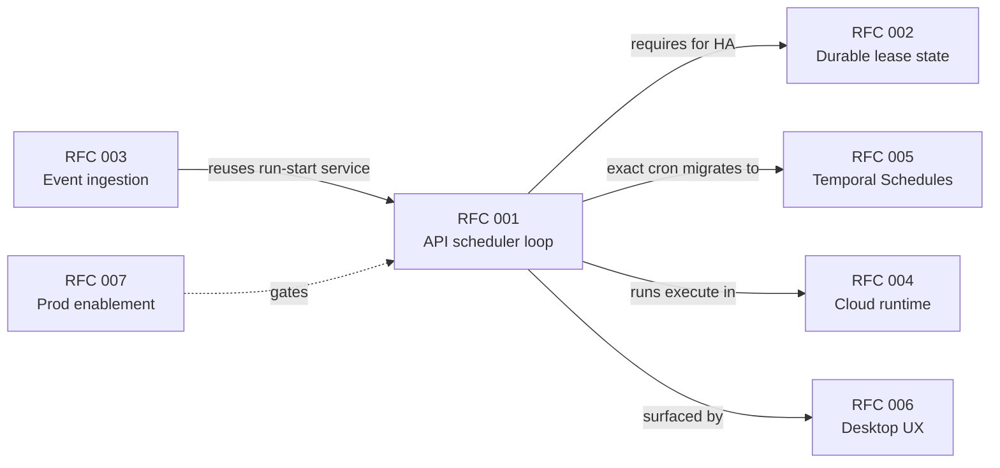
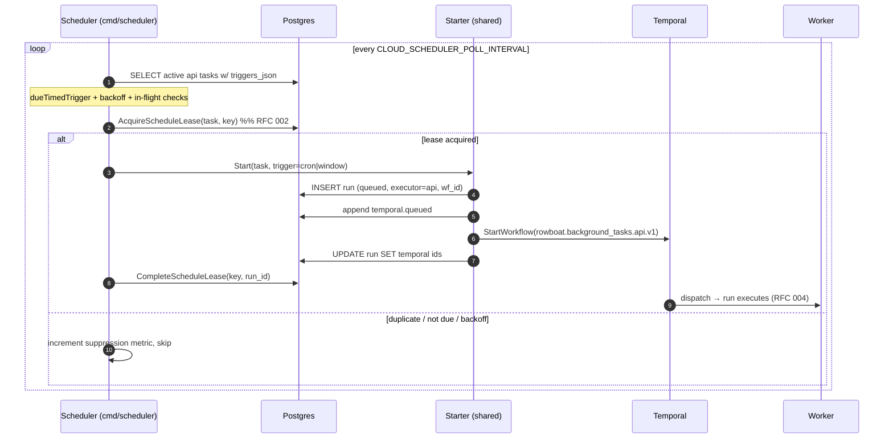

# RFC 001: API-Owned Scheduler for Cloud Background Tasks

| | |
| --- | --- |
| **RFC** | 001 |
| **Status** | Draft |
| **Track** | Cloud-native background workflows |
| **Owners** | `apps/rowboat-api` (Go backend) · `apps/x` (desktop control plane) |
| **Created** | 2026-06-05 |
| **Last updated** | 2026-06-05 |
| **Depends on** | [RFC 002 — Durable Schedule State](./002-durable-schedule-state.md) (required before >1 replica) |
| **Enables / related** | [RFC 005 — Temporal Schedules](./005-temporal-schedule-integration.md), [RFC 003 — Event Ingestion](./003-cloud-event-ingestion.md), [RFC 006 — Desktop Control Plane](./006-desktop-cloud-control-plane.md) |
| **Parent docs** | [`docs/CLOUD_NATIVE_BACKGROUND_WORKFLOWS_RFC.md`](../../docs/CLOUD_NATIVE_BACKGROUND_WORKFLOWS_RFC.md) §6.3, [`..._API_PLAN.md`](../../docs/CLOUD_NATIVE_BACKGROUND_WORKFLOWS_API_PLAN.md) |

## RFC map



## Summary

API-target background tasks already **execute** in the cloud (Temporal worker), but
their **timed triggers** are still initiated by the desktop. The desktop scheduler
(`apps/x/packages/core/src/background-tasks/scheduler.ts`) polls local task files every
15 seconds and, when an `executionTarget: api` task is due, calls
`triggerCloudRunBestEffort()` → `POST /v1/background-tasks/{slug}/trigger`. If the
desktop app is closed, **no API-target cron/window task ever fires.**

This RFC moves cron/window trigger evaluation for API-target tasks into the
Rowboat API deployment so scheduled cloud runs fire while the desktop is offline. It
deliberately reuses the existing run-start path — it does **not** introduce a second
way to create runs.

## Current state (grounded)

| Fact | Evidence |
| --- | --- |
| Task schema supports `execution_target` (`desktop`/`api`, default `desktop`) | `ent/schema/background_task.go:44-46` |
| Triggers stored as validated JSON in `triggers_json` | `ent/schema/background_task.go:41` |
| Manual API trigger → queued run → Temporal start | `internal/backgroundtasks/handler.go:1120` (`triggerAPIRun`) |
| Run creation helper | `handler.go:1272` (`createRun`) |
| Temporal start contract | `internal/backgroundtaskworkflow/workflow.go:117` (`StartBackgroundTaskRun`), `WorkflowName = "rowboat.background_tasks.api.v1"` |
| Timed evaluation lives on the desktop | `scheduler.ts` (15 s poll) + `schedule/utils.ts` (`dueTimedTrigger`, `isCronDue`, `isWindowDue`) |
| Desktop dispatch by target | `scheduler.ts:65-71` (`executionTarget === 'api'` → `triggerCloudRunBestEffort`) |

Net effect: a cloud task with `cronExpr` or `windows` is **cloud-executed but
desktop-scheduled**. Closing the laptop silently pauses every scheduled cloud job.

## Goals

- Evaluate API-target `cronExpr` / `windows` triggers inside the Rowboat API deployment.
- Fire scheduled cloud runs while the desktop is offline.
- **Bit-for-bit reuse** of the existing run-start sequence (`triggerAPIRun`) so HTTP- and
  scheduler-initiated runs are indistinguishable downstream (same events, same metrics,
  same Temporal workflow id shape).
- Preserve desktop trigger semantics for `cronExpr` (2-minute grace) and `windows`
  (once-per-day, anchored at `startTime`).
- Be safe with a single replica from day one; be safe with N replicas once RFC 002 lands.
- Leave `executionTarget: desktop` scheduling entirely on the desktop.

### Measurable acceptance signals

- With the desktop process killed, an API-target task with `cronExpr: "*/5 * * * *"`
  produces a `trigger=cron`, `executor=api` run within one grace window of each
  occurrence.
- `cloud_runs_triggered_total{trigger="cron"}` increments without any HTTP request to
  `/trigger`.
- Two scheduler replicas produce exactly one run per cycle (RFC 002 lease).

## Non-Goals

- Replacing the desktop scheduler for `executionTarget: desktop` tasks.
- Event-trigger routing — owned by [RFC 003](./003-cloud-event-ingestion.md).
- Immediately replacing the loop with Temporal Schedules — that is the staged migration
  in [RFC 005](./005-temporal-schedule-integration.md). This loop ships first and remains
  the fallback.
- Per-task user timezones — v1 evaluates in **UTC** (the server TZ); a task-level `timezone`
  field is a committed fast-follow (see [Decisions](#decisions)).

## Design

### Component shape

Add a long-lived scheduler component. Two deployment shapes are viable; the recommended
v1 is **(A)** for operational isolation, mirroring the worker:

| | (A) Separate `cmd/scheduler` Deployment *(recommended)* | (B) Goroutine inside `cmd/server` |
| --- | --- | --- |
| Isolation | Own pod, own crash domain, own `/metrics` | Shares API pod lifecycle |
| HA story | Scale independently; lease gates duplicates (RFC 002) | Every API replica would evaluate → needs lease immediately |
| Precedent | Matches `cmd/worker` (`cmd/worker/main.go`) | — |
| Cost | One more Deployment | None |

Recommended: `apps/rowboat-api/cmd/scheduler` + a `charts/rowboat-api/templates/scheduler-deployment.yaml`
gated on `scheduler.enabled`, structurally identical to `worker-deployment.yaml` (own
`/metrics`, `/healthz`, `command: ["/rowboat-api-scheduler"]`).

### The reusable run-start service (the crux)

Today the queued-run-then-Temporal-start logic is inlined in `triggerAPIRun`
(`handler.go:1120-1195`). Extract it verbatim into an internal service so the HTTP handler
and the scheduler share one code path:

```go
// internal/backgroundtaskruns/starter.go  (new; or fold into internal/backgroundtasks)
package backgroundtaskruns

// Starter owns the canonical "create queued api run → emit queued event →
// start Temporal workflow → persist temporal ids → count metric" sequence.
// It is the ONLY way an executor=api run is created. HTTP, scheduler (RFC 001),
// and event router (RFC 003) all call Start.
type Starter struct {
	client   *ent.Client
	temporal backgroundtaskworkflow.Controller
	log      *zap.Logger
}

type StartParams struct {
	User             *ent.User
	Task             *ent.BackgroundTask
	Trigger          string // manual | cron | window | event | retry
	RequestedContext string
	RunIDPrefix      string // "api-trigger-", "sched-cron-", "event-", …
	// Optional lineage (retry path):
	PreviousRunID string
	RetryOfRunID  string
	Attempt       *int
}

// Start mirrors handler.triggerAPIRun exactly: createRun(status=queued,
// executor=api, temporal_workflow_id precomputed) → appendSystemEvent(EventQueued)
// → temporal.StartBackgroundTaskRun → UpdateOneID(temporal ids) → metrics.Triggered.
// On Temporal start failure it marks the run failed with
// ErrCodeTemporalStartFailed (handler.go:1162-1178 behavior).
func (s *Starter) Start(ctx context.Context, p StartParams) (*ent.BackgroundTaskRun, error)
```

The HTTP handler's `triggerAPIRun` becomes a thin wrapper that resolves the user/task
from the request and calls `Starter.Start`. **No behavior change** to the HTTP path is in
scope here beyond the refactor; the scheduler then becomes a second caller.

> Why this matters: `viewRun`, the desktop transcript poller, the
> `temporal_workflow_id` index, and every `cloud_runs_*` series assume one creation
> shape. A parallel "scheduler-only" insert path would drift these. See parent RFC
> §5.1 for the flow this preserves.

### Trigger evaluation (port of desktop semantics)

Port `schedule/utils.ts` to Go in `internal/backgroundscheduler`. The three pure
functions must match the desktop bit-for-bit so a task behaves identically whether
desktop- or cloud-scheduled:

```go
const (
	cronGrace    = 2 * time.Minute // schedule/utils.ts GRACE_MS
	retryBackoff = 5 * time.Minute // schedule/utils.ts RETRY_BACKOFF_MS
)

// dueTimedTrigger returns "cron" | "window" | "" — pure cycle check, no backoff.
// Anchored on lastRunAt (advances only on SUCCESS), matching scheduler.ts:53.
func dueTimedTrigger(tr Triggers, lastRunAt *time.Time, now time.Time) string

// isCronDue: find the most-recent occurrence at-or-before now (prev, not
// next-after-lastRun); fire iff lastRunAt < occurrence AND now <= occurrence+grace.
// Mirrors schedule/utils.ts:55-75. Requires a cron lib with a "previous tick".
func isCronDue(expr string, lastRunAt *time.Time, now time.Time) bool

// isWindowDue: now within [start,end] band AND lastRunAt before today's cycle
// start. Once per day per window. Mirrors schedule/utils.ts:77-92.
func isWindowDue(start, end string, lastRunAt *time.Time, now time.Time) bool

// backoffRemaining: > 0 if lastAttemptAt within retryBackoff. schedule/utils.ts:48.
func backoffRemaining(lastAttemptAt *time.Time, now time.Time) time.Duration
```

**Cron library note.** The JS side uses `cron-parser`'s `.prev()`. Go's common
`robfig/cron` exposes only `Next()`. To get the most-recent occurrence ≤ now without
scanning, use **`github.com/adhocore/gronx`** (`PrevTick(expr, inclusive)`) or compute
`prev` by stepping `Next()` from `now - maxPlausibleInterval`. **Decision: `gronx`** — its
`PrevTick`/`NextTick` mirror the JS `cron-parser.prev()` semantics directly, with no
hand-rolled occurrence stepping (see [Decisions](#decisions)).

### Evaluation loop

```go
// internal/backgroundscheduler/scheduler.go
func (s *Scheduler) tick(ctx context.Context) error {
	metrics.Ticks.Inc()
	tasks, err := s.client.BackgroundTask.Query().
		Where(
			backgroundtask.ActiveEQ(true),
			backgroundtask.ExecutionTargetEQ("api"),
			backgroundtask.TriggersJSONNotNil(),
		).
		// NOTE: runs as internal context — bypasses per-user tenant scoping
		// (internal/db/interceptors.go). The scheduler is cross-tenant by design.
		All(auth.WithInternal(ctx))
	if err != nil { return err }
	metrics.TasksScanned.Add(float64(len(tasks)))

	for _, task := range tasks {
		tr, err := parseTriggers(task.TriggersJSON)
		if err != nil { metrics.Errors.Inc(); s.logSkip(task, "bad_triggers", err); continue }

		// In-flight backstop (scheduler.ts:38-48): lastAttemptAt newer than
		// lastRunAt AND still in backoff ⇒ a prior attempt never completed.
		if inFlight(task) && backoffRemaining(task.LastAttemptAt, now) > 0 { continue }

		source := dueTimedTrigger(tr, task.LastRunAt, now) // "cron" | "window" | ""
		if source == "" { continue }
		metrics.DueTasks.WithLabelValues(source).Inc()

		if d := backoffRemaining(task.LastAttemptAt, now); d > 0 {
			metrics.BackoffSuppressed.Inc(); s.logSkip(task, "backoff", d); continue
		}

		// --- RFC 002 lease gate (no-op when single replica / lease disabled) ---
		key := scheduleKey(source, tr, now) // see RFC 002
		lease, ok, err := s.leases.Acquire(ctx, task, source, key, s.owner, s.leaseTTL)
		if err != nil { metrics.Errors.Inc(); continue }
		if !ok { metrics.DuplicateSuppressed.Inc(); continue }

		run, err := s.starter.Start(ctx, runStartParams(task, source))
		if err != nil {
			metrics.Errors.Inc()
			_ = s.leases.Release(ctx, lease.ID, err) // let it expire; do NOT set last_run_id
			continue
		}
		_ = s.leases.Complete(ctx, lease.ID, run.RunID)
		metrics.RunsTriggered.WithLabelValues(source).Inc()
		s.logFire(task, source, key, run)
	}
	return s.cleanupExpiredLeases(ctx) // RFC 002
}
```

Run-ID prefixes for provenance: `sched-cron-<uuid>` and `sched-window-<uuid>` (mirrors
the existing `api-trigger-` / `retry-` / `remote-trigger-` prefixes in `handler.go`).

### Single-evaluator safety (the fallback under the lease)

At-most-once-per-cycle ultimately relies on the **same task runtime fields the desktop
uses** (`last_run_at` advances only on success; `last_attempt_at` anchors backoff — set
today by `MarkRunRunning`, `workflow.go:214-219`). A single evaluator with `last_run_at`
cycle-anchoring cannot double-fire within a cycle.

**Chosen implementation order ([`README.md`](./README.md)) lands RFC 002 *before* this loop
ships**, so the lease exists on day one and multi-replica is a `replicaCount` change, not a
code change. The single-evaluator property documented here remains the correctness fallback
if the lease is ever disabled.

## Sequence



## Configuration

New env keys (registered in `internal/appconfig/config.go` `Config` + `Load`, defaults in
the same style as `TEMPORAL_*`):

| Env | Default | Meaning |
| --- | --- | --- |
| `CLOUD_SCHEDULER_ENABLED` | `false` | Master switch; scheduler exits 0 if false (mirrors `TEMPORAL_WORKER_ENABLED` guard in `cmd/worker/main.go:46`). |
| `CLOUD_SCHEDULER_POLL_INTERVAL` | `15s` | Tick cadence. 15 s matches the desktop loop. |
| `CLOUD_SCHEDULER_LEASE_TTL` | `60s` | Lease lifetime (RFC 002). Must exceed one tick. |
| `CLOUD_SCHEDULER_REPLICA_ID` | pod name (`HOSTNAME`) | Lease owner identity. |
| `CLOUD_SCHEDULER_TIMEZONE` | `UTC` | TZ for cron prev-occurrence + window band math. UTC for v1 (see [Decisions](#decisions)). |

`Config.Validate()` gains: if `CLOUD_SCHEDULER_ENABLED` then `TEMPORAL_ENABLED` must be
true (the scheduler needs a Temporal client to start runs), matching the worker's invariant.

## Observability

Metrics live in `internal/backgroundscheduler/metrics.go` (leaf package, same registry
pattern documented in `internal/backgroundtaskmetrics/metrics.go`). **Cardinality rule
holds: never label by `taskSlug`/`userId`/`runId`.**

| Series | Type | Labels | Notes |
| --- | --- | --- | --- |
| `cloud_scheduler_ticks_total` | counter | — | one per loop iteration |
| `cloud_scheduler_tasks_scanned_total` | counter | — | summed each tick |
| `cloud_scheduler_due_tasks_total` | counter | `trigger` | matched a cycle |
| `cloud_scheduler_runs_triggered_total` | counter | `trigger` | runs actually started (reconcile against `cloud_runs_triggered_total`) |
| `cloud_scheduler_duplicate_suppressed_total` | counter | — | lease not acquired |
| `cloud_scheduler_backoff_suppressed_total` | counter | — | in backoff window |
| `cloud_scheduler_errors_total` | counter | `stage` | `parse`/`lease`/`start`/`query` |
| `cloud_scheduler_tick_duration_seconds` | histogram | — | loop latency; alert if > poll interval |

Structured log fields (one line per decision, via `zap`, mirroring `runLogFields` in
`handler.go:1815`): `taskSlug`, `userId`, `trigger`, `scheduleKey`, `runId`, `decision`
(`fired|skip_not_due|skip_backoff|skip_inflight|skip_duplicate|error`),
`occurrenceAt`, `graceRemainingMs`.

## Failure modes & edge cases

| Case | Behavior |
| --- | --- |
| Temporal unavailable at start | `Starter.Start` marks run `failed` / `temporal_start_failed` (handler.go:1162). Lease released; `last_run_id` **not** set so cycle remains unfired and retries next tick within grace. |
| Scheduler crash mid-tick | At-least-once tick semantics; lease + `last_run_at` make run creation at-most-once per cycle. Partial run insert without Temporal start → next tick sees a `failed` run, cycle still unfired. |
| Missed occurrences (downtime > grace) | By design: cron honors the 2-minute grace (no replay storm). Windows fire if `now` is still inside the band. Matches desktop. **Document this**: downtime longer than grace skips that cron occurrence. |
| Clock skew across replicas | Cron uses occurrence math, not wall-clock equality; small skew tolerated. Lease TTL must exceed max skew + tick. |
| `triggers_json` malformed | `validJSON` validator (`background_task.go:87`) blocks malformed JSON at write time, but shape (`cronExpr`/`windows`) can still be wrong → count `errors{stage=parse}`, skip, log. |
| Task deactivated between scan and start | Re-check `active` inside the lease transaction, or accept one stale fire (idempotent: next tick won't fire an inactive task). |
| Timezone divergence | Desktop windows use **device-local** time; cloud uses `CLOUD_SCHEDULER_TIMEZONE` (UTC default). A task moved desktop→cloud may shift window wall-times. v1 evaluates in UTC (decided); the desktop labels cloud schedules so the shift is visible (RFC 006). |

## Security

- Scheduler runs with `auth.WithInternal(ctx)` (bypasses tenant interceptors) — it is a
  trusted cross-tenant component, exactly like the worker activities (`workflow.go:190`).
  It must never accept external input; its only inputs are DB rows.
- No new external surface. No secrets beyond DB + Temporal creds already in the worker pod.
- Runs it creates inherit the task's owner via the `user` edge; downstream authz is
  unchanged (ORM interceptors still scope reads).

## Migration & code changes

- **No schema change** in this RFC for single-replica (reuses existing task fields). The
  lease table is [RFC 002](./002-durable-schedule-state.md).
- New packages: `internal/backgroundscheduler` (loop, due math, metrics),
  `internal/backgroundtaskruns` (extracted `Starter`).
- Refactor `handler.triggerAPIRun` to call `Starter.Start` (pure refactor; covered by
  existing `handler_cloud_test.go`).
- New binary `cmd/scheduler/main.go` (clone `cmd/worker/main.go` structure: config load,
  telemetry, db open, metrics server, signal-aware loop).
- New chart template `scheduler-deployment.yaml` + `scheduler.enabled` value.

## Rollout

1. Land the `Starter` refactor behind no flag (pure refactor; existing tests guard it).
2. Add scheduler binary + chart, **disabled by default** (`CLOUD_SCHEDULER_ENABLED=false`).
3. Enable in **kind** (`values-kind.yaml`), single replica. Validate: close desktop, cron
   task fires.
4. Enable in **staging**, single replica, soak (reuse [RFC 007](./007-production-cloud-enablement.md) soak).
5. **Gate:** do not exceed one replica until RFC 002 lease tests pass.
6. Enable multiple replicas in staging; verify `duplicate_suppressed` > 0 and exactly one
   run per cycle.
7. Production via RFC 007 phases.

## Test plan

Unit (`internal/backgroundscheduler/..._test.go`) — port the desktop scenarios:

- `isCronDue`: never-run fires; within grace fires; outside grace skipped; already-ran-this-occurrence skipped.
- `isWindowDue`: inside band first-time fires; second time same day skipped; adjacent windows sharing an endpoint both fire; before/after band skipped.
- `backoffRemaining`: zero outside window, positive inside, monotonic.
- `dueTimedTrigger`: cron wins over window when both due; neither → "".
- In-flight backstop: `lastAttemptAt > lastRunAt` within backoff → skip.

Integration:

- `Starter.Start` from scheduler creates `trigger=cron`/`window`, `executor=api` runs with
  Temporal ids — assert parity with `triggerAPIRun` output (same `viewRun` shape).
- Lease prevents duplicate run creation under concurrent ticks (RFC 002 harness).

kind E2E (extends `scripts/rowboat-api-kind.sh`): create API-target cron task, **kill the
desktop process**, assert a `succeeded` cloud run appears within two grace windows.

## Acceptance criteria

- API-target cron/window tasks run with the desktop closed.
- `executionTarget: desktop` tasks remain desktop-scheduled (scheduler ignores them).
- HTTP- and scheduler-initiated runs are byte-identical downstream (events, metrics, IDs).
- Duplicate scheduled runs are prevented across replicas (with RFC 002).
- Run history shows `trigger=cron` / `trigger=window`; logs/metrics explain every decision.

## Alternatives considered

- **Goroutine in `cmd/server`** — rejected for v1 (every API replica would evaluate,
  forcing the lease immediately and coupling scheduler crashes to the API). Revisit if a
  separate Deployment proves operationally heavy.
- **Skip the loop, go straight to Temporal Schedules (RFC 005)** — rejected as the
  *first* step: Temporal Schedules cover only exact cron, not windows, and require the
  schedule-sync/reconciler machinery. The loop ships value sooner and becomes the fallback.
- **Reuse the desktop scheduler over a tunnel** — rejected; defeats the offline goal.

## Decisions

Resolved forks (consolidated in [`README.md` → Decisions](./README.md#consolidated-decisions)):

- **Component shape → separate `cmd/scheduler` Deployment.** Own crash domain + `/metrics`,
  mirrors `cmd/worker`, scales independently. A goroutine in `cmd/server` would force every
  API replica to evaluate (and the lease immediately).
- **Cron library → `github.com/adhocore/gronx`.** Native `PrevTick`/`NextTick` reproduce the
  desktop's `cron-parser.prev()` cycle math without hand-rolled stepping.
- **Timezone → UTC for v1** (`CLOUD_SCHEDULER_TIMEZONE=UTC`). Cron prev-occurrence and window
  bands evaluate in UTC; "once per day" means the UTC day. The desktop labels cloud schedules
  so the wall-clock shift from device-local time is visible ([RFC 006](./006-desktop-cloud-control-plane.md)).
- **Per-task timezone → committed fast-follow (post-v1).** A task-level `timezone` field adds
  a TZ segment to the [RFC 002](./002-durable-schedule-state.md) schedule key, sets Temporal
  `TimeZoneName` ([RFC 005](./005-temporal-schedule-integration.md)), and gets a desktop TZ
  label (RFC 006). This is the single cross-cutting follow-up tracked across the set.
- **Lease from day one.** Implementation order lands RFC 002 first, so the loop is
  lease-aware on first ship; single→multi replica is a config change.

### Deferred (needs production data; not blocking)

- Poll-interval tuning (15 s default) once staging scan latency is measured.
