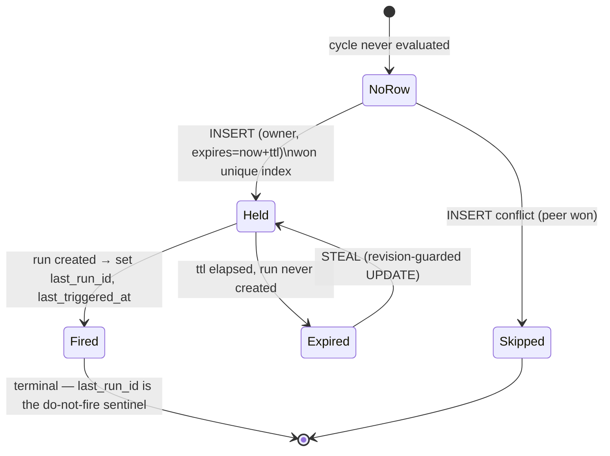

# RFC 002: Durable Schedule State and Cloud Scheduler Leases

|                  |                                                                                                            |
| ---------------- | ---------------------------------------------------------------------------------------------------------- |
| **RFC**          | 002                                                                                                        |
| **Status**       | Implemented — durable lease + cross-replica Postgres tests (slices 002-A…002-F); enables the multi-replica scheduler. |
| **Track**        | Cloud-native background workflows                                                                          |
| **Owners**       | `apps/rowboat-api` (Go backend / ent schema)                                                               |
| **Created**      | 2026-06-05                                                                                                 |
| **Last updated** | 2026-06-08                                                                                                 |
| **Blocks**       | [RFC 001 — API-Owned Scheduler](./001-api-owned-scheduler.md) running with >1 replica                      |
| **Related**      | [RFC 005 — Temporal Schedules](./005-temporal-schedule-integration.md) (supersedes leasing for exact cron) |
| **Supersedes**   | Former cloud workflow planning and API execution-plan schedule-state sections.                             |

## Summary

The API-owned scheduler ([RFC 001](./001-api-owned-scheduler.md)) needs **durable,
cross-replica state** to decide once-and-only-once whether a scheduled cycle is due,
suppress duplicates across replicas, and recover after crashes. This RFC defines that
state as a new ent entity, `BackgroundTaskScheduleState`, plus a small atomic
lease protocol the scheduler depends on instead of ad-hoc queries.

It is intentionally minimal — a per-(task, trigger, cycle) lease row — so it ships before
[RFC 005's](./005-temporal-schedule-integration.md) Temporal Schedules, which later take
over exact-cron leasing.

## Background: why task runtime fields are not enough

The desktop scheduler relies on five task runtime fields (`ent/schema/background_task.go:48-52`):

```
last_attempt_at, last_run_id, last_run_at, last_run_summary, last_run_error
```

These are sufficient for a **single** evaluator (the desktop, or one cloud replica): a
cycle is "done" because `last_run_at` advanced past the occurrence (the anchor used by
`schedule/utils.ts` and ported in RFC 001). They are **not** sufficient for N replicas:

- They encode "did _the_ evaluator run this task", not "_which_ replica owns _this cycle_".
- Two replicas reading the same `last_run_at` in the same tick both see the cycle as
  unfired and both create a run — a classic check-then-act race. The unique run index
  `(run_id, user)` (`background_task_run.go:90`) does **not** save us, because each replica
  mints a _different_ random `run_id` (`sched-cron-<uuid>`), so both inserts succeed.
- A window's "once per day" needs a per-cycle key, not a single timestamp, to stay correct
  across replicas and restarts.

So we need a row whose **uniqueness is the cycle itself**, and an atomic claim on it.

`★ The core idea ─────────────────────────────────`
Make the _cycle_ a uniquely-indexed row and let the database arbitrate. Two replicas
racing to fire the same cron occurrence both try to INSERT the same
`(task_id, trigger_type, schedule_key)` — exactly one wins the unique constraint; the
loser gets a conflict and skips. The DB is the lock; no external coordinator needed.
`──────────────────────────────────────────────────`

## Goals

- Prevent duplicate cloud scheduled runs across replicas and restarts.
- Preserve once-per-cycle semantics for cron and windows (parity with desktop).
- Support multiple scheduler replicas (the HA story RFC 001 defers to here).
- Make "why did/didn't this fire" auditable from a row.
- Stay small enough to ship before Temporal Schedules; additive migration, no backfill.

## Non-Goals

- A scheduling DSL or arbitrary recurrence rules (cron + windows only).
- Retaining every historical evaluation forever (we keep the latest cycle per key + prune).
- Changing desktop local scheduler state.
- Replacing Temporal's own durability for exact cron — RFC 005 does that.

## Data model

### ent schema (drop-in)

`apps/rowboat-api/ent/schema/background_task_schedule_state.go` — uses `BaseMixin`
(UUID `id`, `created_at`, `updated_at`) like every other entity:

```go
package schema

import (
	"entgo.io/contrib/entgql"
	"entgo.io/ent"
	"entgo.io/ent/schema"
	"entgo.io/ent/schema/edge"
	"entgo.io/ent/schema/field"
	"entgo.io/ent/schema/index"

	"github.com/Oppulence-Engineering/rowboat/apps/rowboat-api/ent/schema/mixin"
)

// BackgroundTaskScheduleState records, per (task, trigger, cycle), which
// scheduler replica owns the cycle and whether it has fired. The unique index
// on (task, trigger_type, schedule_key) is the cross-replica duplicate guard:
// the first INSERT for a cycle wins; concurrent inserts conflict and skip.
type BackgroundTaskScheduleState struct{ ent.Schema }

func (BackgroundTaskScheduleState) Mixin() []ent.Mixin { return []ent.Mixin{mixin.BaseMixin{}} }

func (BackgroundTaskScheduleState) Annotations() []schema.Annotation {
	return []schema.Annotation{entgql.RelayConnection(), entgql.QueryField()}
}

func (BackgroundTaskScheduleState) Fields() []ent.Field {
	return []ent.Field{
		field.String("trigger_type").
			Validate(oneOfBackgroundTask("trigger_type", "cron", "window")),
		// schedule_key is the deterministic cycle identity; see "Schedule keys".
		field.String("schedule_key").NotEmpty(),
		field.Time("last_evaluated_at").Optional().Nillable(),
		field.Time("last_due_at").Optional().Nillable(),
		field.Time("last_triggered_at").Optional().Nillable(),
		// last_run_id is the sentinel: non-empty ⇒ this cycle fired, never re-fire.
		field.String("last_run_id").Optional(),
		// Lease ownership. lease_owner is the replica id (pod name); the lease is
		// "held" while now < lease_expires_at and last_run_id == "".
		field.String("lease_owner").Optional(),
		field.Time("lease_expires_at").Optional().Nillable(),
		// revision guards steal/complete via optimistic concurrency.
		field.Int("revision").Default(1).Positive(),
	}
}

func (BackgroundTaskScheduleState) Edges() []ent.Edge {
	return []ent.Edge{
		edge.From("user", User.Type).Ref("background_task_schedule_states").Unique().Required(),
		edge.From("task", BackgroundTask.Type).Ref("schedule_states").Unique().Required(),
	}
}

func (BackgroundTaskScheduleState) Indexes() []ent.Index {
	return []ent.Index{
		// The duplicate guard. Scoped by task edge so keys can't collide across tasks.
		index.Fields("trigger_type", "schedule_key").Edges("task").Unique(),
		// Sweep support: find expired, unfired leases to reclaim/prune.
		index.Fields("lease_expires_at"),
		index.Fields("last_run_id"),
	}
}
```

Add the matching back-edges to existing schemas (additive):

```go
// ent/schema/user.go Edges():  edge.To("background_task_schedule_states", BackgroundTaskScheduleState.Type)
// ent/schema/background_task.go Edges(): edge.To("schedule_states", BackgroundTaskScheduleState.Type).
//     StorageKey(edge.Column("background_task_id"))
```

> `oneOfBackgroundTask` and `validJSON` already exist in `background_task.go:78-93` and are
> reusable validators in the `schema` package.

### Resulting Postgres DDL (Atlas-generated, illustrative)

```sql
CREATE TABLE background_task_schedule_states (
    id                 uuid        PRIMARY KEY DEFAULT gen_random_uuid(),
    created_at         timestamptz NOT NULL DEFAULT now(),
    updated_at         timestamptz NOT NULL DEFAULT now(),
    trigger_type       varchar     NOT NULL,
    schedule_key       varchar     NOT NULL,
    last_evaluated_at  timestamptz,
    last_due_at        timestamptz,
    last_triggered_at  timestamptz,
    last_run_id        varchar     NOT NULL DEFAULT '',
    lease_owner        varchar     NOT NULL DEFAULT '',
    lease_expires_at   timestamptz,
    revision           bigint      NOT NULL DEFAULT 1,
    background_task_id  uuid        NOT NULL REFERENCES background_tasks(id),
    user_id            uuid        NOT NULL REFERENCES users(id)
);

CREATE UNIQUE INDEX btss_cycle_uq
    ON background_task_schedule_states (background_task_id, trigger_type, schedule_key);
CREATE INDEX btss_lease_exp ON background_task_schedule_states (lease_expires_at);
CREATE INDEX btss_last_run  ON background_task_schedule_states (last_run_id);
```

Generated via the existing toolchain: edit schema → `make generate` (`go generate ./ent`)
→ `make migrate-dump name=add_schedule_state` → review → `make migrate-apply`
(`apps/rowboat-api/Makefile:61,84,88`). The migration is purely additive — a new table —
so it is safe to apply ahead of code that reads it.

## Schedule keys

Deterministic, collision-free per cycle (the unique-index payload):

| Trigger | Key format                          | Example                               |
| ------- | ----------------------------------- | ------------------------------------- |
| Cron    | `cron:{expr}:{occurrence-RFC3339}`  | `cron:0 * * * *:2026-06-05T14:00:00Z` |
| Window  | `window:{start}-{end}:{cycle-date}` | `window:09:00-12:00:2026-06-05`       |

`occurrence` is the prev-tick computed by `isCronDue` (RFC 001). `cycle-date` is the
local date of the window's `startTime` anchor. The key embeds the cycle, so re-evaluating
the same occurrence yields the same key → the same row → the duplicate guard.

When per-task timezones land (the committed [RFC 001](./001-api-owned-scheduler.md#decisions)
fast-follow), the key gains a TZ segment to keep cycles distinct across zones:

```
window:{timezone}:{start}-{end}:{cycle-date}   e.g. window:America/New_York:09:00-12:00:2026-06-05
```

> Changing the key format is a **breaking change** for in-flight cycles (old keys won't
> match new ones), so version it explicitly if it ever changes mid-deploy; a brief
> double-fire window during the changeover is acceptable and bounded by grace.

## Lease protocol

### State machine



### Acquisition rules (evaluated in order)

1. **No row** → `INSERT ... ON CONFLICT DO NOTHING`. Won the insert ⇒ **Held**. Conflict
   ⇒ a peer owns it ⇒ **Skipped**.
2. **Row with `last_run_id != ''`** → cycle already fired ⇒ **Skipped** (idempotent).
3. **Row with live lease** (`now < lease_expires_at`, `last_run_id == ''`) → another
   replica is mid-fire ⇒ **Skipped**.
4. **Row with expired lease** (`now >= lease_expires_at`, `last_run_id == ''`) → the prior
   owner crashed before firing ⇒ **STEAL** via revision-guarded UPDATE ⇒ **Held** (or lose
   the steal race → **Skipped**).

### Atomic primitives (ent)

```go
// internal/backgroundscheduler/leases.go
type Lease struct{ ID uuid.UUID; Revision int }

// Acquire returns (lease, acquired=true) iff this replica now owns the cycle.
func (l *Leases) Acquire(ctx context.Context, task *ent.BackgroundTask,
	triggerType, scheduleKey, owner string, ttl time.Duration) (Lease, bool, error) {

	now := time.Now().UTC()
	exp := now.Add(ttl)

	// (1) Try to create the cycle row. ON CONFLICT DO NOTHING is the duplicate
	// guard: concurrent inserts for the same (task,type,key) — exactly one wins.
	created, err := l.client.BackgroundTaskScheduleState.Create().
		SetUser(task.Edges.User).SetTask(task).
		SetTriggerType(triggerType).SetScheduleKey(scheduleKey).
		SetLeaseOwner(owner).SetLeaseExpiresAt(exp).SetLastEvaluatedAt(now).
		OnConflict( // sql.ResolveWithIgnore() → no-op on conflict
			sql.ConflictColumns("background_task_id", "trigger_type", "schedule_key"),
			sql.ResolveWithIgnore(),
		).ID(ctx)
	if err == nil && created != uuid.Nil {
		metrics.LeasesAcquired.Inc()
		return Lease{ID: created, Revision: 1}, true, nil
	}

	// (2/3/4) Row exists — load and decide.
	row, err := l.client.BackgroundTaskScheduleState.Query().
		Where(scheduleKeyPredicate(task.ID, triggerType, scheduleKey)).Only(ctx)
	if err != nil { return Lease{}, false, err }
	if row.LastRunID != "" {              // (2) already fired
		metrics.LeasesSkipped.WithLabelValues("fired").Inc(); return Lease{}, false, nil
	}
	if row.LeaseExpiresAt != nil && now.Before(*row.LeaseExpiresAt) { // (3) live lease
		metrics.LeasesSkipped.WithLabelValues("held").Inc(); return Lease{}, false, nil
	}

	// (4) Steal the expired lease, guarded by revision (optimistic CAS).
	n, err := l.client.BackgroundTaskScheduleState.Update().
		Where(btss.IDEQ(row.ID), btss.RevisionEQ(row.Revision),
			btss.LastRunIDEQ("")).
		SetLeaseOwner(owner).SetLeaseExpiresAt(exp).
		SetLastEvaluatedAt(now).AddRevision(1).Save(ctx)
	if err != nil { return Lease{}, false, err }
	if n == 0 {                            // lost the steal race
		metrics.LeasesSkipped.WithLabelValues("steal_lost").Inc(); return Lease{}, false, nil
	}
	metrics.LeasesStolen.Inc()
	return Lease{ID: row.ID, Revision: row.Revision + 1}, true, nil
}

// Complete marks the cycle fired — the permanent do-not-re-fire sentinel.
func (l *Leases) Complete(ctx context.Context, id uuid.UUID, runID string) error {
	now := time.Now().UTC()
	return l.client.BackgroundTaskScheduleState.UpdateOneID(id).
		SetLastRunID(runID).SetLastTriggeredAt(now).SetLastDueAt(now).
		AddRevision(1).Exec(ctx)
}

// Release abandons the lease after a failed run-start so another replica (or the
// next tick) can retry the cycle within grace. It does NOT set last_run_id.
func (l *Leases) Release(ctx context.Context, id uuid.UUID, cause error) error {
	return l.client.BackgroundTaskScheduleState.UpdateOneID(id).
		ClearLeaseExpiresAt().SetLeaseOwner("").AddRevision(1).Exec(ctx)
}
```

> `OnConflict` + `sql.ResolveWithIgnore` is ent's supported upsert path on Postgres
> (`entgo.io/ent/dialect/sql`); it compiles to `INSERT ... ON CONFLICT (...) DO NOTHING`,
> which is the atomic, single-round-trip duplicate guard — no `SELECT ... FOR UPDATE`
> needed.

### Ordering contract with the run

The lease and the run must be ordered so a crash never strands a fired-but-unrecorded
cycle nor a recorded-but-never-fired one:

```
Acquire(lease)  →  Starter.Start(run)  →  Complete(lease, run.RunID)
```

- Crash **after Acquire, before Start**: lease expires → another replica steals → fires.
  At-most-once preserved (only one will have set `last_run_id`).
- Crash **after Start, before Complete**: the run exists but the lease shows unfired. The
  durable backstop is the **task fields** — `MarkRunRunning` set `last_attempt_at`
  (`workflow.go:214`), so RFC 001's in-flight + backoff checks suppress a re-fire for
  `retryBackoff` (5 min), well within which the lease's `Complete` would normally have run.
  Worst case: one extra run after the backoff window if Complete never lands — bounded and
  rare. A reconciler (below) closes this fully.
- This is **at-least-once firing with at-most-once-per-cycle as the strong guarantee**,
  matching Temporal's own delivery model and acceptable for background tasks.

## Reconciliation & pruning

A lightweight sweep at the end of each tick (or a separate slow loop):

- **Reclaim**: rows with `last_run_id == ''` and `lease_expires_at < now - 2*ttl` whose
  task has a newer `last_run_at` for that cycle → mark fired (heals the
  Start-without-Complete crash).
- **Prune**: delete `Fired` rows older than the retention window (7 days; see
  [Decisions](#decisions)) — cycles are immutable history; only the latest few per key
  matter. Bounded growth: one row per fired cycle per task. Emit
  `cloud_scheduler_schedule_states_pruned_total`.

## Observability

`internal/backgroundscheduler/metrics.go` (cardinality rule: no slug/user/run labels):

| Series                                         | Type    | Labels                                 |
| ---------------------------------------------- | ------- | -------------------------------------- |
| `cloud_scheduler_leases_acquired_total`        | counter | —                                      |
| `cloud_scheduler_leases_skipped_total`         | counter | `reason` (`fired`/`held`/`steal_lost`) |
| `cloud_scheduler_leases_stolen_total`          | counter | —                                      |
| `cloud_scheduler_lease_errors_total`           | counter | `op` (`acquire`/`complete`/`release`)  |
| `cloud_scheduler_schedule_states_pruned_total` | counter | —                                      |
| `cloud_scheduler_schedule_states_rows`         | gauge   | — (live row count; watch growth)       |

Log per lease decision (`zap`): `taskSlug`, `scheduleKey`, `leaseOwner`,
`leaseExpiresAt`, `decision` (`acquired|skipped_fired|skipped_held|stolen|steal_lost`).

## Migration

- ent schema addition + `go generate ./ent` (regenerate client) +
  `make migrate-dump name=add_schedule_state` (Atlas) — **additive**, new table only.
- **No backfill.** Existing tasks acquire schedule state lazily the first time the
  scheduler evaluates them. Until then they have no rows, which is correct (no prior cloud
  cycles existed).
- Roll the migration **before** enabling the multi-replica scheduler; single-replica RFC
  001 works without it.

## Code-level implementation playbook

The schedule-state table is correctness-critical. Treat it like a lock service whose state
happens to live in ent/Postgres. The implementation should be small, heavily tested against
Postgres, and not entangled with HTTP handlers.

### 1. Schema edits and generated files

Add `apps/rowboat-api/ent/schema/background_task_schedule_state.go` as shown above, then
edit the existing edges:

```go
// ent/schema/user.go
edge.To("background_task_schedule_states", BackgroundTaskScheduleState.Type)

// ent/schema/background_task.go
edge.To("schedule_states", BackgroundTaskScheduleState.Type).
	StorageKey(edge.Column("background_task_id"))
```

Because the tenant interceptors are explicitly registered per entity, update
`internal/db/interceptors.go` after codegen:

```go
client.BackgroundTaskScheduleState.Intercept(intercept.TraverseBackgroundTaskScheduleState(
	func(ctx context.Context, q *ent.BackgroundTaskScheduleStateQuery) error {
		return scopeToUser(ctx, func(uid uuid.UUID) {
			q.Where(backgroundtaskschedulestate.HasUserWith(user.IDEQ(uid)))
		})
	}))
```

Without this interceptor, authenticated reads of schedule state would either be unscoped
or blocked depending on how the generated client is used. System components still bypass
it with `auth.WithInternal(ctx)`, same as the worker and scheduler.

Run from `apps/rowboat-api`:

```sh
make generate
make migrate-dump name=add_background_task_schedule_state
make test
```

Review generated changes in:

- `ent/client.go`, `ent/backgroundtaskschedulestate*.go`, predicates, mutations, queries
- `ent/migrate/schema.go`
- `internal/gqlapi/ent.graphql` and generated gql files
- `api/openapi.json` if entoas exposes the entity
- `migrations/*add_background_task_schedule_state*.sql`

### 2. Field semantics the code must preserve

| Field               | Writer                         | Meaning                                                   | Never do                                                       |
| ------------------- | ------------------------------ | --------------------------------------------------------- | -------------------------------------------------------------- |
| `trigger_type`      | lease acquisition              | `cron` or `window` only                                   | Do not store `manual`/`event`; those are not scheduled cycles. |
| `schedule_key`      | due math                       | Deterministic cycle identity                              | Do not include run id, random id, or replica id.               |
| `last_evaluated_at` | acquire/steal/release/complete | Last state transition for this cycle                      | Do not update on every non-due scan.                           |
| `last_due_at`       | acquire                        | The occurrence/window start the scheduler decided was due | Do not use wall-clock tick time for cron; use the occurrence.  |
| `last_triggered_at` | complete                       | When `Starter.Start` succeeded                            | Do not set on Temporal start failure.                          |
| `last_run_id`       | complete only                  | Terminal "this cycle fired" sentinel                      | Do not set before the run row exists.                          |
| `lease_owner`       | acquire/steal/release          | Replica identity                                          | Do not put user/task ids here; they are edges.                 |
| `lease_expires_at`  | acquire/steal/release          | Live lease cutoff                                         | Do not rely on process memory for ownership.                   |
| `revision`          | every mutation                 | Optimistic concurrency guard                              | Do not update expired leases without checking revision.        |

### 3. Package layout

Put all logic under `internal/backgroundscheduler`:

| File                      | Contents                                                                        |
| ------------------------- | ------------------------------------------------------------------------------- |
| `schedule_key.go`         | `CronKey(expr, occurrence, loc)`, `WindowKey(start,end,cycleDate,loc)` + tests. |
| `leases.go`               | `Leases.Acquire`, `Complete`, `Release`, `SweepExpired`, `PruneFired`.          |
| `leases_postgres_test.go` | Testcontainer-backed concurrency tests; build-tag optional if CI needs gating.  |
| `metrics.go`              | Lease counters/gauge listed above.                                              |

Keep the public surface tiny:

```go
type Lease struct {
	ID       uuid.UUID
	Revision int
	Key      string
}

type Decision string
const (
	DecisionAcquired Decision = "acquired"
	DecisionFired    Decision = "fired"
	DecisionHeld     Decision = "held"
	DecisionStolen   Decision = "stolen"
	DecisionLost     Decision = "steal_lost"
)
```

The scheduler loop only needs `(Lease, Decision, error)` and should not know SQL conflict
details.

### 4. Acquisition SQL contract

Ent's fluent API is fine for the normal path, but the guarantee is Postgres:

```sql
INSERT INTO background_task_schedule_states
  (id, user_id, background_task_id, trigger_type, schedule_key,
   last_evaluated_at, last_due_at, lease_owner, lease_expires_at, revision,
   created_at, updated_at)
VALUES
  ($1, $2, $3, $4, $5, $6, $7, $8, $9, 1, now(), now())
ON CONFLICT (background_task_id, trigger_type, schedule_key) DO NOTHING
RETURNING id, revision;
```

If `RETURNING` yields one row, this replica owns the cycle. If it yields zero rows, load the
existing row by `(task,type,key)` and classify:

```go
switch {
case row.LastRunID != "":
	return Lease{}, DecisionFired, nil
case row.LeaseExpiresAt != nil && now.Before(*row.LeaseExpiresAt):
	return Lease{}, DecisionHeld, nil
default:
	// expired/unheld; try revision-guarded steal
}
```

The steal update must be one statement:

```go
n, err := client.BackgroundTaskScheduleState.Update().
	Where(
		backgroundtaskschedulestate.IDEQ(row.ID),
		backgroundtaskschedulestate.RevisionEQ(row.Revision),
		backgroundtaskschedulestate.LastRunIDEQ(""),
		backgroundtaskschedulestate.Or(
			backgroundtaskschedulestate.LeaseExpiresAtIsNil(),
			backgroundtaskschedulestate.LeaseExpiresAtLTE(now),
		),
	).
	SetLeaseOwner(owner).
	SetLeaseExpiresAt(now.Add(ttl)).
	SetLastEvaluatedAt(now).
	AddRevision(1).
	Save(ctx)
```

Exactly one concurrent thief can observe `n == 1`; the rest return `steal_lost`.

### 5. Complete and release

`Complete` must be revision-guarded and must only complete the current owner:

```go
n, err := client.BackgroundTaskScheduleState.Update().
	Where(
		backgroundtaskschedulestate.IDEQ(lease.ID),
		backgroundtaskschedulestate.RevisionEQ(lease.Revision),
		backgroundtaskschedulestate.LeaseOwnerEQ(owner),
		backgroundtaskschedulestate.LastRunIDEQ(""),
	).
	SetLastRunID(runID).
	SetLastTriggeredAt(now).
	ClearLeaseExpiresAt().
	SetLeaseOwner("").
	AddRevision(1).
	Save(ctx)
```

If `n == 0`, log an error with `leaseId`, `scheduleKey`, `owner`, and `runId`: the run may
exist even though the lease did not complete, and the reconciler should later heal it.

`Release` is only for failures before a run exists. It clears ownership but intentionally
does not set `last_run_id`; the cycle remains eligible until grace/backoff logic suppresses
or retries it.

### 6. Reconciler details

The reconciler should run under `auth.WithInternal(ctx)` on a slower cadence than the
scheduler tick (for example every 5 minutes):

1. Find unfired rows with `lease_expires_at < now - 2*ttl`.
2. Join/load the task and inspect its `last_run_id`/`last_run_at`.
3. If the task's latest run belongs to the same cycle key, set the row fired with that run
   id. This heals "Start succeeded, Complete crashed".
4. Otherwise clear the lease so the cycle can be stolen if still within its semantic window.
5. Delete fired rows older than retention (`created_at < now - 7d` or
   `last_triggered_at < now - 7d`).

Do not reconcile by scanning all runs for all tasks on every tick. Keep the sweep bounded
by the `lease_expires_at` and `last_run_id` indexes.

### 7. Testcontainer harness

The lease tests should not use sqlite for the core concurrency assertion. Use a helper like:

```go
func newPostgresEntClient(t *testing.T) *ent.Client {
	// start postgres:16, apply ent schema, return client
}
```

Test cases that must pass repeatedly:

- `TestAcquireConcurrentInsert`: 64 goroutines call `Acquire` on the same key; exactly one
  returns `DecisionAcquired`.
- `TestAcquireConcurrentSteal`: seed an expired lease; 64 goroutines attempt steal; exactly
  one returns `DecisionStolen`.
- `TestCompleteBlocksReacquire`: `Acquire` then `Complete`; subsequent `Acquire` returns
  `DecisionFired`.
- `TestReleaseAllowsReacquire`: `Acquire` then `Release`; subsequent `Acquire` succeeds.
- `TestDifferentKeysDoNotBlock`: same task + different cron occurrence/window date can both
  acquire.
- `TestDifferentTasksSameKeyDoNotCollide`: unique index includes task edge.

## Operational SQL, migrations, and reviewer checklist

The lease table must be easy to inspect during an incident. Add these queries to the
runbook once the table exists.

### Inspect currently held leases

```sql
SELECT
  bt.slug,
  s.trigger_type,
  s.schedule_key,
  s.lease_owner,
  s.lease_expires_at,
  s.last_run_id,
  s.revision,
  s.updated_at
FROM background_task_schedule_states s
JOIN background_tasks bt ON bt.id = s.background_task_id
WHERE s.last_run_id = ''
  AND s.lease_expires_at IS NOT NULL
ORDER BY s.lease_expires_at ASC
LIMIT 100;
```

Expected during healthy operation: a small number of rows with near-future
`lease_expires_at`. Rows far in the past are either crashed attempts awaiting sweep or a
stalled reconciler.

### Find duplicate guard evidence for one task

```sql
SELECT trigger_type, schedule_key, last_triggered_at, last_run_id, lease_owner
FROM background_task_schedule_states s
JOIN background_tasks bt ON bt.id = s.background_task_id
WHERE bt.slug = $1
ORDER BY s.created_at DESC
LIMIT 50;
```

This explains "why did the scheduler skip this minute?" without reading logs. If a row has
`last_run_id`, the cycle already fired. If it has a live lease, a peer owns it. If it has no
`last_run_id` and an expired lease, the reconciler or a later tick should steal/release it.

### Migration safety checklist

Before applying the migration:

- Confirm all new columns are nullable or defaulted.
- Confirm unique index uses `(background_task_id, trigger_type, schedule_key)`, not
  `(user_id, trigger_type, schedule_key)`. Two tasks for the same user may share a cron.
- Confirm `last_run_id` defaults to empty string if code uses `LastRunIDEQ("")`; if it is
  nullable, code must check both nil and empty.
- Confirm foreign keys use normal deletes. If task delete cascades are not generated, update
  `Handler.Delete` to delete schedule states inside its transaction before deleting task.
- Confirm the generated migration is additive only: one table, indexes, FKs.

### Reviewer checklist for `leases.go`

Reviewers should reject implementations that:

- Read then insert without `ON CONFLICT DO NOTHING`.
- Steal expired rows without checking `revision`.
- Set `last_run_id` before `Starter.Start` returns a run id.
- Use Redis/process memory as the source of truth.
- Label metrics with `taskSlug`, `userId`, or `scheduleKey`.
- Use sqlite-only tests for the unique conflict race.
- Forget tenant interceptors for the new entity.

### Retention sizing

Estimate row growth before GA:

```
rows_per_day = active_scheduled_api_tasks * fires_per_task_per_day
7d_rows = rows_per_day * 7
```

Examples:

| Tasks  | Cadence         | Rows/day  | 7-day rows |
| ------ | --------------- | --------- | ---------- |
| 1,000  | hourly cron     | 24,000    | 168,000    |
| 5,000  | daily window    | 5,000     | 35,000     |
| 10,000 | every 5 minutes | 2,880,000 | 20,160,000 |

The every-5-min case is the one that forces retention and indexing discipline. If staging
shows high-frequency schedules becoming common, add a product-level minimum cadence or move
cron to RFC 005 Schedules sooner.

## Test plan

Unit (`leases_test.go`, against an in-memory/enttest sqlite or a Postgres testcontainer —
note: `ON CONFLICT` semantics must be tested on **Postgres**, sqlite differs):

- `scheduleKey` generation is deterministic and collision-free across triggers/dates.
- Acquire on empty → Held; second Acquire same key → Skipped(held).
- Acquire when `last_run_id` set → Skipped(fired).
- Acquire when lease expired → Stolen; concurrent steal → exactly one Held.
- Complete sets `last_run_id`; subsequent Acquire → Skipped(fired).
- Release clears lease without setting `last_run_id`; next Acquire re-leases.

Concurrency integration (**Postgres required**): spawn G goroutines all calling Acquire on
the same key in a tight loop; assert exactly one returns `acquired=true`. Repeat with the
full `Acquire→Start→Complete` against a fake `Starter` and assert exactly one run created.

## Acceptance criteria

- Multiple scheduler replicas cannot create duplicate runs for the same task cycle.
- Scheduler restart loses no schedule state (it is in Postgres).
- Existing tasks need no manual migration; state appears lazily.
- A schedule-state row plus the run table explains why a task did or did not fire.

## Alternatives considered

- **Postgres advisory locks** (`pg_try_advisory_lock(hash(key))`) — simpler, no table, but
  ephemeral (lost on connection drop), not auditable, and gives no "did this cycle already
  fire" record across restarts. Rejected: we need durable, queryable cycle history.
- **Redis `SET NX PX`** lease — fast, but Redis is currently used only for rate-limit
  buckets (`internal/ratelimit`) and is not the durable source of truth; a Redis flush
  would silently double-fire. Rejected for the correctness-critical guard; could be a fast
  pre-check layer later.
- **Defer entirely to Temporal Schedules (RFC 005)** — Temporal gives exactly this
  durability for cron, but not for windows, and not until the schedule-sync machinery
  exists. This table covers windows permanently and cron until RFC 005 migrates it.

## Decisions

Resolved forks (consolidated in [`README.md`](./README.md#consolidated-decisions)):

- **Retention → 7 days for `Fired` rows**, pruned by the reconciler, aligned with
  run-history retention. Growth is one row per fired cycle per task; the prune keeps the
  table bounded. Revisit only if run-history retention changes.
- **`last_evaluated_at` writes only on state transitions** (acquire / steal / complete /
  release), not on every evaluation — keeps write load flat and avoids row churn from idle
  ticks scanning unchanged cycles.
- **CI gains a Postgres testcontainer for this package.** `ON CONFLICT DO NOTHING` is the
  correctness-critical guard and its semantics differ on sqlite; the concurrency tests
  ([Test plan](#test-plan)) run against real Postgres. The rest of the suite keeps the fast
  sqlite/enttest path.
- **Lease substrate → row-based ent entity** (not advisory locks or Redis). Durable,
  auditable, and the single source of truth survives restarts and Redis flushes — see
  [Alternatives considered](#alternatives-considered).
