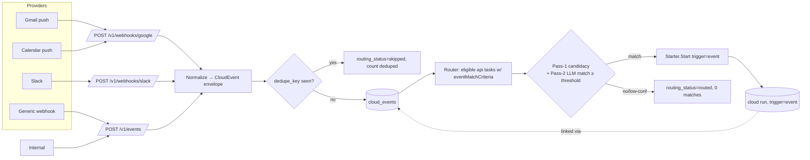

# RFC 003: Cloud Event Ingestion and Event-Triggered Cloud Runs

| | |
| --- | --- |
| **RFC** | 003 |
| **Status** | Draft |
| **Track** | Cloud-native background workflows |
| **Owners** | `apps/rowboat-api` (Go backend) · `apps/x` (desktop event consumers) |
| **Created** | 2026-06-05 |
| **Last updated** | 2026-06-05 |
| **Depends on** | [RFC 001](./001-api-owned-scheduler.md) (shared run-start `Starter`), [RFC 004](./004-cloud-agent-runtime.md) (runtime that consumes event context) |
| **Related** | [RFC 006](./006-desktop-cloud-control-plane.md) (event→run linkage in UI) |
| **Parent docs** | [`docs/CLOUD_NATIVE_BACKGROUND_WORKFLOWS_RFC.md`](../../docs/CLOUD_NATIVE_BACKGROUND_WORKFLOWS_RFC.md) |

## Summary

Event-triggered background tasks (`triggers.eventMatchCriteria`) currently depend on
**desktop-side** event consumers. The desktop classifies inbound events and, for
`executionTarget: api` tasks, calls `triggerCloudRun(slug, 'event', payload)`
(`apps/x/packages/core/src/background-tasks/event-consumer.ts:60-68`). So event-triggered
API tasks are cloud-*executed* but still desktop-*initiated* — closing the laptop stops
all event triggers, exactly as it stops timed triggers (the gap [RFC 001](./001-api-owned-scheduler.md)
closes for cron/windows).

This RFC adds a **cloud event ingestion + routing layer** to the Rowboat API: accept
external/connector events, normalize and de-duplicate them, route them to matching
API-target tasks via `eventMatchCriteria`, and start `trigger=event` cloud runs — with no
desktop in the loop and full inbound-event-to-run-id auditability.

## Current state (grounded)

| Fact | Evidence |
| --- | --- |
| Tasks define `triggers.eventMatchCriteria` (free-text) | `apps/x/packages/shared/src/live-note.ts:44,68` (`TriggersSchema`) |
| Desktop two-pass routing: Pass-1 candidacy (`routeBatch`), Pass-2 agent on payload | `event-consumer.ts:47-68`, `events/routing.ts` |
| Desktop fires cloud run on match | `event-consumer.ts:61-63` → `triggerCloudRun(slug,'event',payload)` |
| `trigger=event` is already a valid run trigger | `ent/schema/background_task_run.go:33-35`; `background-task.ts:108` |
| Run accepts `requested_context` (free text) | `background_task_run.go:53`; used by runtime in `buildSummary`/`buildArtifact` (`workflow.go:479-509`) |

No server-side event store, ingestion endpoint, or router exists today.

## Goals

- Accept external/connector-originated events at the API (push webhooks + internal posts).
- Persist a **normalized event envelope**, idempotent on a dedupe key.
- Route events to active API-target tasks using `eventMatchCriteria`, reusing the
  desktop's two-pass philosophy (cheap candidacy filter, then a bounded LLM decision).
- Start `trigger=event` cloud runs via the **shared `Starter`** ([RFC 001](./001-api-owned-scheduler.md))
  — same provenance as every other cloud run.
- Maintain an audit trail: inbound event → routing decision → run id.

## Non-Goals

- Migrating every connector to cloud ingestion at once (Gmail/Calendar first; Slack/webhook
  later).
- A general-purpose event bus for all of Rowboat.
- Exactly-once delivery from third-party providers (we get at-least-once + dedupe).
- Replacing the desktop event consumer for `executionTarget: desktop` tasks.

## Architecture



## Data model

### `CloudEvent` envelope (ent schema)

`apps/rowboat-api/ent/schema/cloud_event.go` (uses `BaseMixin`):

```go
func (CloudEvent) Fields() []ent.Field {
	return []ent.Field{
		field.String("source").
			Validate(oneOfBackgroundTask("source",
				"gmail", "google_calendar", "slack", "webhook", "internal")),
		field.String("source_event_id").Optional(),  // provider's id (e.g. Gmail historyId)
		field.String("source_account_id").Optional(), // which connected account
		field.String("event_type").Optional(),        // provider-specific, e.g. "message.new"
		field.Text("subject").Optional(),
		field.Text("text").Optional(),                 // normalized human-readable gist
		field.Text("payload_json").Optional().Validate(validJSON), // full normalized payload
		// dedupe_key is the idempotency anchor; unique per (user, source).
		field.String("dedupe_key").NotEmpty(),
		field.String("routing_status").
			Default("pending").
			Validate(oneOfBackgroundTask("routing_status",
				"pending", "routed", "skipped", "failed")),
		field.Int("matched_task_count").Default(0),
		field.Time("occurred_at").Optional().Nillable(), // provider event time
		field.Time("received_at").Default(time.Now).Immutable(),
		field.Time("routed_at").Optional().Nillable(),
	}
}

func (CloudEvent) Edges() []ent.Edge {
	return []ent.Edge{
		edge.From("user", User.Type).Ref("cloud_events").Unique().Required(),
		// runs this event triggered (0..N) — the audit link.
		edge.To("runs", BackgroundTaskRun.Type).StorageKey(edge.Column("cloud_event_id")),
	}
}

func (CloudEvent) Indexes() []ent.Index {
	return []ent.Index{
		index.Fields("source", "dedupe_key").Edges("user").Unique(), // idempotency guard
		index.Fields("routing_status"),
		index.Fields("received_at"),
	}
}
```

### Event → run linkage

Two additive options; **(A) is recommended** for query simplicity:

- **(A)** Add `cloud_event_id` edge/FK on `BackgroundTaskRun` (nullable). One event → many
  runs; one run → at most one originating event. `GET /v1/events/{id}/runs` is a simple
  edge traversal; `GET .../runs/{runId}` can include the source event id.
- **(B)** A `cloud_event_route` join table recording `(event_id, task_id, decision,
  confidence, run_id)` — richer audit (records *non-matches* too), more tables.

**Decision: ship (A)** for linkage + store a `routing_json` decision summary on the event
(`matched_task_count`, plus per-task `{taskSlug, confidence, decision}` for audit). Promote
to **(B)** only if per-task non-match audit becomes a hard requirement.

> **Run context, not raw payload.** Per the existing runtime contract, the run's
> `requested_context` (`background_task_run.go:53`) should carry a **concise event
> summary** (subject + gist), not the full payload — `buildArtifact` (`workflow.go:487`)
> embeds `requested_context` verbatim into the artifact. The full payload stays on the
> `CloudEvent` row, fetched on demand with authz. This keeps Temporal history small (the
> `StartInput` comment at `workflow.go:44` is explicit that start input is "intentionally
> small").

## API surface

All authed routes mount in `cmd/server/wire.go` inside the `RequireJWT` group next to the
background-task routes (`wire.go:183-244`); webhook routes are **public** (provider has no
bearer) and verified by signature instead.

| Method | Path | Auth | Handler |
| --- | --- | --- | --- |
| POST | `/v1/events` | JWT (or `INTERNAL_API_SECRET` for server-to-server) | ingest one normalized event |
| GET | `/v1/events` | JWT | list events (filters: `source`, `routing_status`, `since`, `until`, cursor — mirror `applyRunFilters`, `handler.go:1656`) |
| GET | `/v1/events/{eventId}` | JWT | event detail (+ full payload) |
| GET | `/v1/events/{eventId}/runs` | JWT | runs triggered by this event |
| POST | `/v1/webhooks/google` | signature | Gmail/Calendar push → normalize → ingest |
| POST | `/v1/webhooks/slack` | signature | Slack Events API → normalize → ingest |

### `POST /v1/events` contract

```jsonc
// Request
{
  "source": "internal",
  "sourceEventId": "evt_abc123",          // optional; provider id
  "sourceAccountId": "google:me@x.co",    // optional
  "eventType": "email.received",
  "subject": "Invoice #4821 from Acme",
  "text": "Acme sent invoice #4821, due 2026-07-01, $4,200",
  "payload": { /* full normalized provider object */ },
  "dedupeKey": "gmail:historyId:998877",  // REQUIRED idempotency anchor
  "occurredAt": "2026-06-05T14:03:00Z"
}
// 202 Accepted — event stored, routing enqueued
{ "eventId": "…", "routingStatus": "pending", "deduped": false }
// 200 OK — duplicate (idempotent replay)
{ "eventId": "…", "routingStatus": "routed", "deduped": true, "matchedTaskCount": 1 }
```

Ingestion is **idempotent**: a second POST with the same `(user, source, dedupeKey)` hits
the unique index, returns the existing event, and never re-routes (count `deduped`).

## Routing engine

Reuse the desktop's two-pass design (`event-consumer.ts` + `events/routing.ts`) server-side
in `internal/cloudevents/router.go`:

1. **Eligibility** — query active `executionTarget=api` tasks whose `triggers_json` has a
   non-empty `eventMatchCriteria` (the cloud analogue of `listEligibleTargets`,
   `event-consumer.ts:24-40`). Runs under `auth.WithInternal` scoped to the event's user.
2. **Pass-1 candidacy** — a single bounded LLM call (via the Rowboat API LLM gateway,
   `internal/llm`) ranks which eligible tasks *might* match this event, using each task's
   name + `eventMatchCriteria`. Cheap, batched (mirrors `routeBatch`'s
   `entitySingular/Plural`, `useCase: background_task_agent`).
3. **Pass-2 decision** — for each candidate, produce a `{match: bool, confidence: float,
   explanation: string}` against the normalized payload. **Threshold
   `CLOUD_EVENTS_MATCH_THRESHOLD = 0.7`** (decided; fixed in v1); below it ⇒ no fire. Record
   every decision for audit.
4. **Fire** — for each match above threshold, call `Starter.Start(StartParams{Trigger:
   "event", RunIDPrefix: "event-", RequestedContext: eventSummary(...)})`. The event's
   `routing_status` → `routed`, `matched_task_count` set, runs linked.

```go
// internal/cloudevents/router.go (sketch)
func (r *Router) Route(ctx context.Context, ev *ent.CloudEvent) (RouteResult, error) {
	ctx = auth.WithInternal(ctx)
	targets, err := r.eligibleTargets(ctx, ev.Edges.User.ID) // active api + eventMatchCriteria
	if err != nil { return RouteResult{}, err }
	if len(targets) == 0 { return r.finish(ctx, ev, "routed", nil) }

	candidates := r.pass1Candidacy(ctx, ev, targets)         // bounded LLM, may be empty
	var fired []*ent.BackgroundTaskRun
	for _, t := range candidates {
		dec := r.pass2Decide(ctx, ev, t)                     // {match, confidence, why}
		metrics.RouteMatches.WithLabelValues(dec.bucket()).Inc()
		if !dec.Match || dec.Confidence < r.threshold { continue }
		run, err := r.starter.Start(ctx, eventStartParams(t, ev))
		if err != nil { metrics.RouteFailures.Inc(); continue }
		r.linkEventRun(ctx, ev, run)
		fired = append(fired, run)
	}
	return r.finish(ctx, ev, "routed", fired)
}
```

Routing runs **asynchronously** from ingestion (ingestion returns `202` immediately) so a
slow LLM never blocks a provider webhook (providers retry on slow 2xx). Options for the
async hop: a Temporal workflow (`rowboat.cloud_events.route.v1`, durable, retried — natural
given Temporal is already wired), or an in-process worker queue. **Decision: a Temporal
route-workflow per event** (`rowboat.cloud_events.route.v1`) — it inherits retries,
visibility, and the existing worker deployment, and survives API restarts mid-route. This
makes RFC 003 depend on `TEMPORAL_ENABLED`, exactly like the run path.

## Security

| Concern | Mitigation |
| --- | --- |
| Webhook authenticity | Verify provider signatures: Slack `X-Slack-Signature` (HMAC-SHA256 over `v0:{ts}:{body}`), Google Pub/Sub push OIDC token / channel token. Pattern already in repo: `auth.RequireHookHMAC` (`wire.go:169`) and `auth.RequireInternalSecret` (`wire.go:173`). |
| Replay | `dedupe_key` unique index + reject stale Slack timestamps (> 5 min skew). |
| Tenant isolation | Events scoped to a user/account via the `user` edge; routing only ever sees the event-owner's tasks (`auth.WithInternal` + explicit user filter). The ORM interceptors (`internal/db/interceptors.go`) keep `GET /v1/events` per-user. |
| Oversized payloads | Cap request body (reuse server read limits); reject > N KB with `413`; store a truncated `text` + a pointer if the raw payload is huge. |
| Sensitive payload fields | `payload_json` may hold PII (email bodies). **Decided: encrypt `payload_json` at rest** via the existing `crypto.Sealer` (`internal/crypto`, already used for OAuth refresh tokens); reads are authz-gated. The normalized `text`/`subject` gist stays plaintext for routing. |
| Confused-deputy on `/v1/events` | Server-to-server callers use `INTERNAL_API_SECRET`; user callers use JWT and may only post events for themselves. |

## Observability

`internal/cloudevents/metrics.go` (cardinality rule holds; label only by `source`):

| Series | Type | Labels |
| --- | --- | --- |
| `cloud_events_ingested_total` | counter | `source` |
| `cloud_events_deduped_total` | counter | `source` |
| `cloud_events_routed_total` | counter | `source` |
| `cloud_event_route_matches_total` | counter | `bucket` (`match`/`low_conf`/`no_match`) |
| `cloud_event_route_failures_total` | counter | `stage` |
| `cloud_event_triggered_runs_total` | counter | `source` |
| `cloud_event_route_latency_seconds` | histogram | — (ingest→routed) |

Logs: `eventId`, `source`, `dedupeKey`, `userId`, `matchedTaskCount`, `triggeredRunIds`,
`routingDecision`.

## Rollout

1. Generic internal ingestion: `POST /v1/events` + `CloudEvent` schema + dedupe (no router
   yet — store only).
2. Add the async router (Temporal route-workflow) behind `CLOUD_EVENTS_ROUTING_ENABLED`.
3. devstack/test fixture source posts synthetic events; validate end-to-end in kind.
4. Gmail/Calendar webhook ingestion (`POST /v1/webhooks/google`) with signature verify.
5. Slack + generic webhook sources.
6. Staging soak with conservative threshold; tune threshold from match-quality data.

## Test plan

- Unit: normalization (each provider → envelope), dedupe (same key → one row), threshold
  gating (low confidence → no fire), eligibility filter (only active api +
  `eventMatchCriteria`).
- Unit: signature verification (valid/invalid/stale Slack sig; Google channel token).
- Integration: `POST /v1/events` → router → `Starter.Start` creates a `trigger=event`,
  `executor=api` run linked to the event; second POST same dedupe key → no new run.
- Integration: event→run linkage queryable via `GET /v1/events/{id}/runs`.
- kind E2E: post a devstack event, **desktop closed**, assert the matching API task runs and
  the run links back to the event.

## Acceptance criteria

- API ingests and persists normalized events idempotently.
- Matching API-target tasks run in the cloud with no desktop involvement.
- Duplicate provider events do not create duplicate runs.
- Run history links back to the triggering event; routing decisions are auditable.

## Alternatives considered

- **Synchronous routing inside the webhook handler** — rejected: a slow LLM blocks the
  provider's webhook delivery (Slack/Google retry on slow responses, amplifying load) and
  couples ingestion availability to LLM availability.
- **Deterministic (non-LLM) matching only** — rejected for v1: `eventMatchCriteria` is
  free-text natural language by design (`live-note.ts:68`); deterministic rules can't honor
  it. A deterministic *pre-filter* (sender/subject contains) is a fine cheap Pass-0 add-on.
- **Reuse the desktop router via callback** — rejected; defeats the offline goal.

## Decisions

Resolved forks (consolidated in [`README.md`](./README.md#consolidated-decisions)):

- **Event↔run linkage → option (A)**: nullable `cloud_event_id` FK on `BackgroundTaskRun` +
  a `routing_json` summary on the event. Simple traversal for `GET /v1/events/{id}/runs`;
  no join table until per-task non-match audit is required.
- **`payload_json` → encrypted at rest** via `crypto.Sealer`; the plaintext `text`/`subject`
  gist is what routing reads, so encryption costs nothing on the hot path.
- **Async routing → Temporal route-workflow** (`rowboat.cloud_events.route.v1`). Ingestion
  returns `202` immediately; routing is durable + retried. Adds a `TEMPORAL_ENABLED`
  dependency, consistent with the run path.
- **Match threshold → `CLOUD_EVENTS_MATCH_THRESHOLD = 0.7`, fixed in v1** (not task-tunable).
  Tune from staging match-quality data before exposing any per-task override.
- **`GET /v1/events` → JWT/admin-scoped only in v1.** The desktop surfaces the event→run
  *link* in the run transcript ([RFC 006](./006-desktop-cloud-control-plane.md)), not a full
  event browser yet.

### Deferred (needs data; not blocking)

- A deterministic Pass-0 pre-filter (sender/subject contains) to cut LLM Pass-1 cost — add
  once event volume justifies it.
