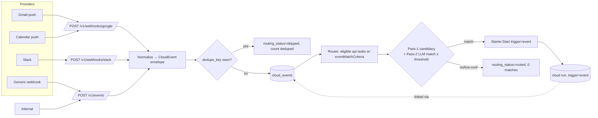

# RFC 003: Cloud Event Ingestion and Event-Triggered Cloud Runs

|                  |                                                                                                                                                     |
| ---------------- | --------------------------------------------------------------------------------------------------------------------------------------------------- |
| **RFC**          | 003                                                                                                                                                 |
| **Status**       | Complete — implemented (rollout stages 1–5) on `rfc-003-cloud-event-ingestion`: ingestion + dedupe, Temporal route workflow + two-pass router, fixtures, Google + Slack webhooks, the self-serve Slack workspace connect flow (`/oauth/slack/start` → `/v1/slack-oauth/claim`), and the Google watch manager (`internal/googlewatch`). GCP provisioning is specified by [RFC 019](./019-google-push-infrastructure.md); the stage-6 staging soak + threshold tuning ride the [RFC 007](./007-production-cloud-enablement.md) production rollout. |
| **Track**        | Cloud-native background workflows                                                                                                                   |
| **Owners**       | `apps/rowboat-api` (Go backend) · `apps/x` (desktop event consumers)                                                                                |
| **Created**      | 2026-06-05                                                                                                                                          |
| **Last updated** | 2026-06-06                                                                                                                                          |
| **Depends on**   | [RFC 001](./001-api-owned-scheduler.md) (shared run-start `Starter`), [RFC 004](./004-cloud-agent-runtime.md) (runtime that consumes event context) |
| **Related**      | [RFC 006](./006-desktop-cloud-control-plane.md) (event→run linkage in UI) · [RFC 019](./019-google-push-infrastructure.md) (GCP-side push provisioning) |
| **Supersedes**   | Former cloud workflow planning event-trigger sections.                                                                                              |

## Summary

Event-triggered background tasks (`triggers.eventMatchCriteria`) currently depend on
**desktop-side** event consumers. The desktop classifies inbound events and, for
`executionTarget: api` tasks, calls `triggerCloudRun(slug, 'event', payload)`
(`apps/x/packages/core/src/background-tasks/event-consumer.ts:60-68`). So event-triggered
API tasks are cloud-_executed_ but still desktop-_initiated_ — closing the laptop stops
all event triggers, exactly as it stops timed triggers (the gap [RFC 001](./001-api-owned-scheduler.md)
closes for cron/windows).

This RFC adds a **cloud event ingestion + routing layer** to the Rowboat API: accept
external/connector events, normalize and de-duplicate them, route them to matching
API-target tasks via `eventMatchCriteria`, and start `trigger=event` cloud runs — with no
desktop in the loop and full inbound-event-to-run-id auditability.

## Current state (grounded)

| Fact                                                                               | Evidence                                                                                               |
| ---------------------------------------------------------------------------------- | ------------------------------------------------------------------------------------------------------ |
| Tasks define `triggers.eventMatchCriteria` (free-text)                             | `apps/x/packages/shared/src/live-note.ts:44,68` (`TriggersSchema`)                                     |
| Desktop two-pass routing: Pass-1 candidacy (`routeBatch`), Pass-2 agent on payload | `event-consumer.ts:47-68`, `events/routing.ts`                                                         |
| Desktop fires cloud run on match                                                   | `event-consumer.ts:61-63` → `triggerCloudRun(slug,'event',payload)`                                    |
| `trigger=event` is already a valid run trigger                                     | `ent/schema/background_task_run.go:33-35`; `background-task.ts:108`                                    |
| Run accepts `requested_context` (free text)                                        | `background_task_run.go:53`; used by runtime in `buildSummary`/`buildArtifact` (`workflow.go:479-509`) |

No server-side event store, ingestion endpoint, or router exists today.

## Goals

- Accept external/connector-originated events at the API (push webhooks + internal posts).
- Persist a **normalized event envelope**, idempotent on a dedupe key.
- Route events to active API-target tasks using `eventMatchCriteria`, reusing the
  desktop's two-pass philosophy (cheap candidacy filter, then a bounded LLM decision).
- Start `trigger=event` cloud runs via the **shared `Starter`** ([RFC 001](./001-api-owned-scheduler.md))
  — same provenance as every other cloud run.
- Maintain an audit trail: inbound event → routing decision → run id.

## Non-Goals

- Migrating every connector to cloud ingestion at once (Gmail/Calendar first; Slack/webhook
  later).
- A general-purpose event bus for all of Rowboat.
- Exactly-once delivery from third-party providers (we get at-least-once + dedupe).
- Replacing the desktop event consumer for `executionTarget: desktop` tasks.

## Architecture



## Data model

### `CloudEvent` envelope (ent schema)

`apps/rowboat-api/ent/schema/cloud_event.go` (uses `BaseMixin`):

```go
func (CloudEvent) Fields() []ent.Field {
	return []ent.Field{
		field.String("source").
			Validate(oneOfBackgroundTask("source",
				"gmail", "google_calendar", "slack", "webhook", "internal")),
		field.String("source_event_id").Optional(),  // provider's id (e.g. Gmail historyId)
		field.String("source_account_id").Optional(), // which connected account
		field.String("event_type").Optional(),        // provider-specific, e.g. "message.new"
		field.Text("subject").Optional(),
		field.Text("text").Optional(),                 // normalized human-readable gist
		field.Bytes("payload_ciphertext").Optional().Sensitive(), // sealed full payload
		field.Text("routing_json").Optional().Validate(validJSON), // bounded decisions
		// dedupe_key is the idempotency anchor; unique per (user, source).
		field.String("dedupe_key").NotEmpty(),
		field.String("routing_status").
			Default("pending").
			Validate(oneOfBackgroundTask("routing_status",
				"pending", "routed", "skipped", "failed")),
		field.Int("matched_task_count").Default(0),
		field.Time("occurred_at").Optional().Nillable(), // provider event time
		field.Time("received_at").Default(time.Now).Immutable(),
		field.Time("routed_at").Optional().Nillable(),
	}
}

func (CloudEvent) Edges() []ent.Edge {
	return []ent.Edge{
		edge.From("user", User.Type).Ref("cloud_events").Unique().Required(),
		// runs this event triggered (0..N) — the audit link.
		edge.To("runs", BackgroundTaskRun.Type).StorageKey(edge.Column("cloud_event_id")),
	}
}

func (CloudEvent) Indexes() []ent.Index {
	return []ent.Index{
		index.Fields("source", "dedupe_key").Edges("user").Unique(), // idempotency guard
		index.Fields("routing_status"),
		index.Fields("received_at"),
	}
}
```

### Event → run linkage

Two additive options; **(A) is recommended** for query simplicity:

- **(A)** Add `cloud_event_id` edge/FK on `BackgroundTaskRun` (nullable). One event → many
  runs; one run → at most one originating event. `GET /v1/events/{id}/runs` is a simple
  edge traversal; `GET .../runs/{runId}` can include the source event id.
- **(B)** A `cloud_event_route` join table recording `(event_id, task_id, decision,
confidence, run_id)` — richer audit (records _non-matches_ too), more tables.

**Decision: ship (A)** for linkage + store a `routing_json` decision summary on the event
(`matched_task_count`, plus per-task `{taskSlug, confidence, decision}` for audit). Promote
to **(B)** only if per-task non-match audit becomes a hard requirement.

> **Run context, not raw payload.** Per the existing runtime contract, the run's
> `requested_context` (`background_task_run.go:53`) should carry a **concise event
> summary** (subject + gist), not the full payload — `buildArtifact` (`workflow.go:487`)
> embeds `requested_context` verbatim into the artifact. The full payload stays on the
> `CloudEvent` row, fetched on demand with authz. This keeps Temporal history small (the
> `StartInput` comment at `workflow.go:44` is explicit that start input is "intentionally
> small").

## API surface

All authed routes mount in `cmd/server/wire.go` inside the `RequireJWT` group next to the
background-task routes (`wire.go:183-244`); webhook routes are **public** (provider has no
bearer) and verified by signature instead.

| Method | Path                        | Auth                                                | Handler                                                                                                                   |
| ------ | --------------------------- | --------------------------------------------------- | ------------------------------------------------------------------------------------------------------------------------- |
| POST   | `/v1/events`                | JWT (or `INTERNAL_API_SECRET` for server-to-server) | ingest one normalized event                                                                                               |
| GET    | `/v1/events`                | JWT                                                 | list events (filters: `source`, `routing_status`, `since`, `until`, cursor — mirror `applyRunFilters`, `handler.go:1656`) |
| GET    | `/v1/events/{eventId}`      | JWT                                                 | event detail (+ full payload)                                                                                             |
| GET    | `/v1/events/{eventId}/runs` | JWT                                                 | runs triggered by this event                                                                                              |
| POST   | `/v1/webhooks/google`       | signature                                           | Gmail/Calendar push → normalize → ingest                                                                                  |
| POST   | `/v1/webhooks/slack`        | signature                                           | Slack Events API → normalize → ingest                                                                                     |

### `POST /v1/events` contract

```jsonc
// Request
{
  "source": "internal",
  "sourceEventId": "evt_abc123",          // optional; provider id
  "sourceAccountId": "google:me@x.co",    // optional
  "eventType": "email.received",
  "subject": "Invoice #4821 from Acme",
  "text": "Acme sent invoice #4821, due 2026-07-01, $4,200",
  "payload": { /* full normalized provider object */ },
  "dedupeKey": "gmail:historyId:998877",  // REQUIRED idempotency anchor
  "occurredAt": "2026-06-05T14:03:00Z"
}
// 202 Accepted — event stored, routing enqueued
{ "eventId": "…", "routingStatus": "pending", "deduped": false }
// 200 OK — duplicate (idempotent replay)
{ "eventId": "…", "routingStatus": "routed", "deduped": true, "matchedTaskCount": 1 }
```

Ingestion is **idempotent**: a second POST with the same `(user, source, dedupeKey)` hits
the unique index, returns the existing event, and never re-routes (count `deduped`).

## Routing engine

Reuse the desktop's two-pass design (`event-consumer.ts` + `events/routing.ts`) server-side
in `internal/cloudevents/router.go`:

1. **Eligibility** — query active `executionTarget=api` tasks whose `triggers_json` has a
   non-empty `eventMatchCriteria` (the cloud analogue of `listEligibleTargets`,
   `event-consumer.ts:24-40`). Runs under `auth.WithInternal` scoped to the event's user.
2. **Pass-1 candidacy** — a single bounded LLM call (via the Rowboat API LLM gateway,
   `internal/llm`) ranks which eligible tasks _might_ match this event, using each task's
   name + `eventMatchCriteria`. Cheap, batched (mirrors `routeBatch`'s
   `entitySingular/Plural`, `useCase: background_task_agent`).
3. **Pass-2 decision** — for each candidate, produce a `{match: bool, confidence: float,
explanation: string}` against the normalized payload. **Threshold
   `CLOUD_EVENTS_MATCH_THRESHOLD = 0.7`** (decided; fixed in v1); below it ⇒ no fire. Record
   every decision for audit.
4. **Fire** — for each match above threshold, call `Starter.Start(StartParams{Trigger:
"event", RunIDPrefix: "event-", RequestedContext: eventSummary(...)})`. The event's
   `routing_status` → `routed`, `matched_task_count` set, runs linked.

```go
// internal/cloudevents/router.go (sketch)
func (r *Router) Route(ctx context.Context, ev *ent.CloudEvent) (RouteResult, error) {
	ctx = auth.WithInternal(ctx)
	targets, err := r.eligibleTargets(ctx, ev.Edges.User.ID) // active api + eventMatchCriteria
	if err != nil { return RouteResult{}, err }
	if len(targets) == 0 { return r.finish(ctx, ev, "routed", nil) }

	candidates := r.pass1Candidacy(ctx, ev, targets)         // bounded LLM, may be empty
	var fired []*ent.BackgroundTaskRun
	for _, t := range candidates {
		dec := r.pass2Decide(ctx, ev, t)                     // {match, confidence, why}
		metrics.RouteMatches.WithLabelValues(dec.bucket()).Inc()
		if !dec.Match || dec.Confidence < r.threshold { continue }
		run, err := r.starter.Start(ctx, eventStartParams(t, ev))
		if err != nil { metrics.RouteFailures.Inc(); continue }
		r.linkEventRun(ctx, ev, run)
		fired = append(fired, run)
	}
	return r.finish(ctx, ev, "routed", fired)
}
```

Routing runs **asynchronously** from ingestion (ingestion returns `202` immediately) so a
slow LLM never blocks a provider webhook (providers retry on slow 2xx). Options for the
async hop: a Temporal workflow (`rowboat.cloud_events.route.v1`, durable, retried — natural
given Temporal is already wired), or an in-process worker queue. **Decision: a Temporal
route-workflow per event** (`rowboat.cloud_events.route.v1`) — it inherits retries,
visibility, and the existing worker deployment, and survives API restarts mid-route. This
makes RFC 003 depend on `TEMPORAL_ENABLED`, exactly like the run path.

## Security

| Concern                         | Mitigation                                                                                                                                                                                                                                                                                                |
| ------------------------------- | --------------------------------------------------------------------------------------------------------------------------------------------------------------------------------------------------------------------------------------------------------------------------------------------------------- |
| Webhook authenticity            | Verify provider signatures: Slack `X-Slack-Signature` (HMAC-SHA256 over `v0:{ts}:{body}`), Google Pub/Sub push OIDC token / channel token. Pattern already in repo: `auth.RequireHookHMAC` (`wire.go:169`) and `auth.RequireInternalSecret` (`wire.go:173`).                                              |
| Replay                          | `dedupe_key` unique index + reject stale Slack timestamps (> 5 min skew).                                                                                                                                                                                                                                 |
| Tenant isolation                | Events scoped to a user/account via the `user` edge; routing only ever sees the event-owner's tasks (`auth.WithInternal` + explicit user filter). The ORM interceptors (`internal/db/interceptors.go`) keep `GET /v1/events` per-user.                                                                    |
| Oversized payloads              | Cap request body (reuse server read limits); reject > N KB with `413`; store a truncated `text` + a pointer if the raw payload is huge.                                                                                                                                                                   |
| Sensitive payload fields        | Full provider payloads may hold PII (email bodies). **Decided: store full payloads as sealed `payload_ciphertext`** via the existing `crypto.Sealer` (`internal/crypto`, already used for OAuth refresh tokens); reads are authz-gated. The normalized `text`/`subject` gist stays plaintext for routing. |
| Confused-deputy on `/v1/events` | Server-to-server callers use `INTERNAL_API_SECRET`; user callers use JWT and may only post events for themselves.                                                                                                                                                                                         |

## Observability

`internal/cloudevents/metrics.go` (cardinality rule holds; label only by `source`):

| Series                              | Type      | Labels                                   |
| ----------------------------------- | --------- | ---------------------------------------- |
| `cloud_events_ingested_total`       | counter   | `source`                                 |
| `cloud_events_deduped_total`        | counter   | `source`                                 |
| `cloud_events_routed_total`         | counter   | `source`                                 |
| `cloud_event_route_matches_total`   | counter   | `bucket` (`match`/`low_conf`/`no_match`) |
| `cloud_event_route_failures_total`  | counter   | `stage`                                  |
| `cloud_event_triggered_runs_total`  | counter   | `source`                                 |
| `cloud_event_route_latency_seconds` | histogram | — (ingest→routed)                        |

Logs: `eventId`, `source`, `dedupeKey`, `userId`, `matchedTaskCount`, `triggeredRunIds`,
`routingDecision`.

## Rollout

1. Generic internal ingestion: `POST /v1/events` + `CloudEvent` schema + dedupe (no router
   yet — store only).
2. Add the async router (Temporal route-workflow) behind `CLOUD_EVENTS_ROUTING_ENABLED`.
3. devstack/test fixture source posts synthetic events; validate end-to-end in kind.
4. Gmail/Calendar webhook ingestion (`POST /v1/webhooks/google`) with signature verify.
5. Slack + generic webhook sources.
6. Staging soak with conservative threshold; tune threshold from match-quality data.

## Code-level implementation playbook

The cloud event path has three durable boundaries: ingest/store, route/decide, and
run-start. Keep them separate so provider webhook retries, LLM routing failures, and
Temporal run failures each have their own idempotency story.

### 1. Data model implementation correction: encrypted payloads are not JSON fields

Earlier drafts used `payload_json` for readability, but the implementation must not store
encrypted payload bytes in a field validated with `validJSON`: ciphertext is not JSON. Use
one of these concrete shapes:

```go
field.Text("payload_json").Optional().Sensitive(),       // plaintext only in dev/test; not recommended
field.Bytes("payload_ciphertext").Optional().Sensitive(), // recommended
field.Text("routing_json").Optional().Validate(validJSON),
```

Recommended v1:

- `subject` and `text` stay plaintext because they are the compact routing gist.
- Full provider payload is sealed with `crypto.Sealer.Seal` (`internal/crypto/crypto.go`)
  and stored in `payload_ciphertext`.
- Handler views expose `payload` only on `GET /v1/events/{id}` after authz; list responses
  omit it.
- `routing_json` is plaintext JSON because it stores Rowboat's own decision summary, not
  third-party raw payload.

The API response can still call the field `payload` or `payloadJson`; the DB column should
make encryption unambiguous.

### 2. Ent schema files and edges

Add `ent/schema/cloud_event.go`:

| Field                                     | Type               | Notes                                                                                                        |
| ----------------------------------------- | ------------------ | ------------------------------------------------------------------------------------------------------------ |
| `source`                                  | string enum        | Base values: `gmail`, `google_calendar`, `slack`, `webhook`, `internal`; RFC 008 later adds faculty sources. |
| `source_event_id`                         | optional string    | Provider id; not globally unique.                                                                            |
| `source_account_id`                       | optional string    | Connected-account key; useful when one user connects multiple Google accounts.                               |
| `event_type`                              | optional string    | Provider-specific type.                                                                                      |
| `subject`                                 | optional text      | Short title used in UI and route prompts.                                                                    |
| `text`                                    | optional text      | Human-readable gist used in route prompts.                                                                   |
| `payload_ciphertext`                      | optional bytes     | Sealed raw normalized payload.                                                                               |
| `dedupe_key`                              | required string    | Idempotency key, unique with `(user,source)`.                                                                |
| `routing_status`                          | enum               | `pending`, `routed`, `skipped`, `failed`.                                                                    |
| `routing_json`                            | optional text JSON | Per-task decisions and explanations.                                                                         |
| `matched_task_count`                      | int                | Fast list/detail summary.                                                                                    |
| `occurred_at`, `received_at`, `routed_at` | times              | Provider time, API receipt, router completion.                                                               |

Add edges:

```go
edge.From("user", User.Type).Ref("cloud_events").Unique().Required()
edge.To("runs", BackgroundTaskRun.Type).StorageKey(edge.Column("cloud_event_id"))
```

Add nullable `cloud_event_id` edge/FK on `BackgroundTaskRun`:

```go
edge.From("cloud_event", CloudEvent.Type).
	Ref("runs").
	Unique().
	Field("cloud_event_id")
```

If ent field-backed optional edges are used, add `field.UUID("cloud_event_id", uuid.UUID{}).
Optional().Nillable()` on `BackgroundTaskRun`. Run `make generate` and inspect generated
query helpers before wiring handlers.

Update `internal/db/interceptors.go` with `CloudEvent` tenant scoping, exactly like
background-task entities.

### 3. Package layout

Use a dedicated package:

| File                                      | Contents                                                                   |
| ----------------------------------------- | -------------------------------------------------------------------------- |
| `internal/cloudevents/types.go`           | Request/response structs, source/type constants, routing status constants. |
| `internal/cloudevents/handler.go`         | `/v1/events`, `/v1/events/{id}`, `/runs` handlers.                         |
| `internal/cloudevents/ingest.go`          | Normalize, seal payload, dedupe insert, enqueue route workflow.            |
| `internal/cloudevents/router.go`          | Eligibility, Pass-1, Pass-2, `Starter.Start`.                              |
| `internal/cloudevents/workflow.go`        | Temporal `rowboat.cloud_events.route.v1` workflow + activities.            |
| `internal/cloudevents/webhooks_google.go` | Pub/Sub / channel-token verification and normalization.                    |
| `internal/cloudevents/webhooks_slack.go`  | Slack HMAC verification and normalization.                                 |
| `internal/cloudevents/metrics.go`         | Counters/histograms.                                                       |

Do not put this in `internal/backgroundtasks`; cloud events will outgrow background-task
run creation and need their own handler + workflow registration.

### 4. Route registration in `cmd/server/wire.go`

Authenticated/internal normalized ingestion:

```go
r.Group(func(r chi.Router) {
	r.Use(authMW.RequireJWT)
	r.Post("/v1/events", cloudEventsH.Ingest)
	r.Get("/v1/events", cloudEventsH.List)
	r.Get("/v1/events/{eventId}", cloudEventsH.Get)
	r.Get("/v1/events/{eventId}/runs", cloudEventsH.Runs)
})

r.With(auth.RequireInternalSecret(cfg.InternalAPISecret)).
	Post("/v1/internal/events", cloudEventsH.IngestInternal)
```

Public provider webhooks must not require JWT:

```go
r.Post("/v1/webhooks/google", cloudEventsH.GoogleWebhook)
r.Post("/v1/webhooks/slack", cloudEventsH.SlackWebhook)
```

Provider handlers verify their own signatures before they call `Ingest`. The existing
patterns are `auth.RequireHookHMAC` and `auth.RequireInternalSecret` in `wire.go:168-174`.

### 5. Dedupe insert flow

The ingest function should return the existing row on conflict:

```go
created, err := client.CloudEvent.Create().
	SetUser(u).
	SetSource(in.Source).
	SetDedupeKey(in.DedupeKey).
	SetSubject(in.Subject).
	SetText(in.Text).
	SetPayloadCiphertext(sealed).
	SetRoutingStatus("pending").
	Save(ctx)
```

On `ent.IsConstraintError(err)`, query:

```go
existing, err := client.CloudEvent.Query().
	Where(
		cloudevent.SourceEQ(in.Source),
		cloudevent.DedupeKeyEQ(in.DedupeKey),
		cloudevent.HasUserWith(user.IDEQ(u.ID)),
	).
	Only(ctx)
```

Return `200 OK` with `deduped=true`, never enqueue routing again. Only the first insert
gets a route workflow. This protects against provider retries and user/server duplicate
posts.

### 6. Route workflow registration

Add constants next to the background-task workflow constants or in `internal/cloudevents`:

```go
const RouteWorkflowName = "rowboat.cloud_events.route.v1"
const ActivityRouteCloudEvent = "rowboat.cloud_events.route_activity.v1"
```

The worker currently registers only `backgroundtaskworkflow.Register` in
`cmd/worker/main.go:120-124`. Add `cloudevents.Register(w, activities)` when
`CLOUD_EVENTS_ROUTING_ENABLED=true`, and construct activities with:

- ent client
- LLM route client
- `backgroundtaskruns.Starter`
- `crypto.Sealer`
- config threshold
- logger

Workflow id:

```
cloud-event-route/{userID}/{eventID}
```

Use `ALLOW_DUPLICATE_FAILED_ONLY` so manual repair can retry a failed route without
creating two concurrent routers for the same event.

### 7. Eligibility query

Routing runs internal, but must explicitly filter to the event owner:

```go
targets, err := client.BackgroundTask.Query().
	Where(
		backgroundtask.ActiveEQ(true),
		backgroundtask.ExecutionTargetEQ("api"),
		backgroundtask.HasUserWith(user.IDEQ(eventUserID)),
		backgroundtask.TriggersJSONNotNil(),
	).
	All(auth.WithInternal(ctx))
```

Then parse `triggers_json` and keep only tasks whose `eventMatchCriteria` is non-empty.
Do not rely on JSON string contains in SQL for v1; parse in Go for correctness and keep
the first implementation simple. If volume demands it, add a generated/materialized
`has_event_trigger` bool later.

### 8. LLM routing client

The desktop Pass-1 uses `generateObject` and `captureLlmUsage` in TypeScript
(`events/routing.ts:73-116`). The API equivalent should call the Rowboat LLM service path
that enforces quota and records usage. Avoid calling the HTTP handler from inside the
process; instead factor the gateway logic into an internal client/service usable by both
`internal/llm/handler.go` and `internal/cloudevents/router.go`, or make a local HTTP call
only as a temporary bridge in kind.

Pass-1 output:

```json
{ "ids": ["task-slug-a", "task-slug-b"] }
```

Pass-2 output per candidate:

```json
{
  "match": true,
  "confidence": 0.86,
  "explanation": "The event is an invoice dispute and the task watches disputed Acme invoices."
}
```

Store a bounded `routing_json`:

```json
{
  "threshold": 0.7,
  "decisions": [
    { "taskSlug": "acme-ar-watch", "match": true, "confidence": 0.86, "runId": "event-..." },
    { "taskSlug": "weekly-digest", "match": false, "confidence": 0.21 }
  ]
}
```

### 9. Event-start parameters

When a decision matches, call `Starter.Start`:

```go
run, err := starter.Start(ctx, backgroundtaskruns.Params{
	User: event.Edges.User,
	Task: task,
	Trigger: "event",
	RunIDPrefix: "event-",
	RequestedContext: eventSummary(event),
	CloudEventID: &event.ID,
	QueuedMessage: "Queued from cloud event router.",
})
```

`eventSummary` should include source, event type, subject, and short text only. Do not put
raw payload JSON in `requested_context`; `StartInput` is intentionally small
(`workflow.go:44-52`) and today's artifact embeds requested context verbatim.

### 10. Failure states

| Failure                      | Row state                                                | Retry story                                      |
| ---------------------------- | -------------------------------------------------------- | ------------------------------------------------ |
| Bad request / invalid source | No row, `400`                                            | Caller fixes input.                              |
| Duplicate dedupe key         | Existing row returned                                    | No reroute.                                      |
| Payload seal failure         | No row or `failed` before enqueue                        | Server error; safe to retry.                     |
| Route workflow start failure | Event stored `pending`, `routing_status=failed` optional | Re-enqueue admin repair.                         |
| Pass-1 LLM failure           | `routing_status=failed`, route failure metric            | Workflow retries; after exhaustion manual retry. |
| Starter failure for one task | Decision records error; continue other matches           | Does not poison whole event unless all fail.     |

## API payloads, prompt templates, and repair operations

### Normalized event API contract in full

`POST /v1/events` should accept a payload that is boring to produce from tests and internal
services:

```json
{
  "source": "internal",
  "sourceEventId": "evt_123",
  "sourceAccountId": "acct_google_primary",
  "eventType": "email.received",
  "subject": "Invoice #4821 dispute",
  "text": "Acme disputed invoice #4821 for $18,000 due to a pricing mismatch.",
  "payload": {
    "provider": "gmail",
    "threadId": "18f...",
    "messageId": "msg_123",
    "from": "ap@acme.com"
  },
  "dedupeKey": "gmail:msg:msg_123",
  "occurredAt": "2026-06-06T14:00:00Z"
}
```

Validation:

- `source` is required and must be known.
- `dedupeKey` is required, stable, and not user-provided prose.
- At least one of `subject`, `text`, or `payload` must be non-empty.
- `payload` is limited before sealing; reject with `413` if above limit.
- `occurredAt` is optional; if absent, use `received_at` for ordering.

Responses:

```json
// 202 Accepted
{"eventId":"...", "routingStatus":"pending", "deduped":false}

// 200 OK duplicate
{"eventId":"...", "routingStatus":"routed", "deduped":true, "matchedTaskCount":1}

// 400 Bad Request
{"error":"dedupeKey is required", "code":"bad_request"}
```

### Pass-1 prompt skeleton

Keep prompts versioned so route-quality changes are auditable:

```text
System: You are Rowboat's cloud event router. Select background tasks that might be
relevant to the event. Prefer recall over precision. Return JSON only.

Event:
- source: {{source}}
- type: {{eventType}}
- subject: {{subject}}
- text: {{text}}

Eligible tasks:
{{#tasks}}
- slug: {{slug}}
  name: {{name}}
  instructions: {{instructions}}
  eventMatchCriteria: {{eventMatchCriteria}}
{{/tasks}}

Return: {"ids":["slug-a","slug-b"]}
```

Add `prompt_version: "cloud-events-pass1-v1"` to `routing_json`.

### Pass-2 prompt skeleton

```text
System: Decide whether this one event should trigger this one background task.
Return JSON: {"match": boolean, "confidence": number, "explanation": string}.

Task:
- name: {{name}}
- instructions: {{instructions}}
- eventMatchCriteria: {{criteria}}

Event:
- source/type: {{source}} / {{eventType}}
- subject: {{subject}}
- text: {{text}}

Rules:
- Trigger only if the event is directly relevant to the criteria.
- confidence must be 0.0 to 1.0.
- explanation must be one sentence.
```

Store pass-2 decisions even when below threshold. That gives operators training data for
threshold tuning without replaying provider payloads.

### Repair endpoints and admin operations

Add internal-only endpoints after v1 if operations need them:

| Method | Path                                    | Purpose                                                      |
| ------ | --------------------------------------- | ------------------------------------------------------------ |
| POST   | `/v1/internal/events/{id}/reroute`      | Set `routing_status=pending` and start route workflow again. |
| POST   | `/v1/internal/events/{id}/mark-skipped` | Stop retries for a poisoned event.                           |
| GET    | `/v1/internal/events/{id}/payload`      | Decrypt payload for debugging under audit.                   |

These must be guarded by `INTERNAL_API_SECRET`, not JWT, and should log `eventId`,
`operator`, `reason`, and `traceId`.

### Synthetic event fixtures

Create fixtures under `internal/cloudevents/testdata/`:

| File                         | Purpose                                         |
| ---------------------------- | ----------------------------------------------- |
| `gmail_invoice_dispute.json` | Should match an invoice/dispute task.           |
| `calendar_qbr_moved.json`    | Should match a customer-status task.            |
| `slack_noise.json`           | Should match nothing.                           |
| `duplicate_gmail.json`       | Same `dedupeKey`; should return existing event. |
| `oversized_payload.json`     | Rejected before sealing.                        |

Use these fixtures in unit tests, kind devstack posts, and manual staging smoke. Keeping the
same payloads across layers makes route regressions obvious.

### Cost controls

Routing can become expensive if every event fans out to every task. Add guardrails in this
order:

1. Hard cap eligible tasks per event in v1, for example 200; if exceeded, route the newest
   or most recently active tasks and emit `cloud_event_route_failures_total{stage="cap"}`.
2. Batch Pass-1 in groups of 20, matching desktop `BATCH_SIZE`.
3. Pass-2 only for Pass-1 candidates.
4. Future Pass-0: deterministic prefilter by source/type/account/customer hints.
5. Future embeddings/cache: only after real volume proves LLM routing is the bottleneck.

## Test plan

- Unit: normalization (each provider → envelope), dedupe (same key → one row), threshold
  gating (low confidence → no fire), eligibility filter (only active api +
  `eventMatchCriteria`).
- Unit: signature verification (valid/invalid/stale Slack sig; Google channel token).
- Integration: `POST /v1/events` → router → `Starter.Start` creates a `trigger=event`,
  `executor=api` run linked to the event; second POST same dedupe key → no new run.
- Integration: event→run linkage queryable via `GET /v1/events/{id}/runs`.
- kind E2E: post a devstack event, **desktop closed**, assert the matching API task runs and
  the run links back to the event.

## Acceptance criteria

- API ingests and persists normalized events idempotently.
- Matching API-target tasks run in the cloud with no desktop involvement.
- Duplicate provider events do not create duplicate runs.
- Run history links back to the triggering event; routing decisions are auditable.

## Alternatives considered

- **Synchronous routing inside the webhook handler** — rejected: a slow LLM blocks the
  provider's webhook delivery (Slack/Google retry on slow responses, amplifying load) and
  couples ingestion availability to LLM availability.
- **Deterministic (non-LLM) matching only** — rejected for v1: `eventMatchCriteria` is
  free-text natural language by design (`live-note.ts:68`); deterministic rules can't honor
  it. A deterministic _pre-filter_ (sender/subject contains) is a fine cheap Pass-0 add-on.
- **Reuse the desktop router via callback** — rejected; defeats the offline goal.

## Decisions

Resolved forks (consolidated in [`README.md`](./README.md#consolidated-decisions)):

- **Event↔run linkage → option (A)**: nullable `cloud_event_id` FK on `BackgroundTaskRun` +
  a `routing_json` summary on the event. Simple traversal for `GET /v1/events/{id}/runs`;
  no join table until per-task non-match audit is required.
- **Full payload → encrypted at rest** as `payload_ciphertext` via `crypto.Sealer`; the
  plaintext `text`/`subject` gist is what routing reads, so encryption costs nothing on the
  hot path.
- **Async routing → Temporal route-workflow** (`rowboat.cloud_events.route.v1`). Ingestion
  returns `202` immediately; routing is durable + retried. Adds a `TEMPORAL_ENABLED`
  dependency, consistent with the run path.
- **Match threshold → `CLOUD_EVENTS_MATCH_THRESHOLD = 0.7`, fixed in v1** (not task-tunable).
  Tune from staging match-quality data before exposing any per-task override.
- **`GET /v1/events` → JWT/admin-scoped only in v1.** The desktop surfaces the event→run
  _link_ in the run transcript ([RFC 006](./006-desktop-cloud-control-plane.md)), not a full
  event browser yet.

### Deferred (needs data; not blocking)

- A deterministic Pass-0 pre-filter (sender/subject contains) to cut LLM Pass-1 cost — add
  once event volume justifies it.
