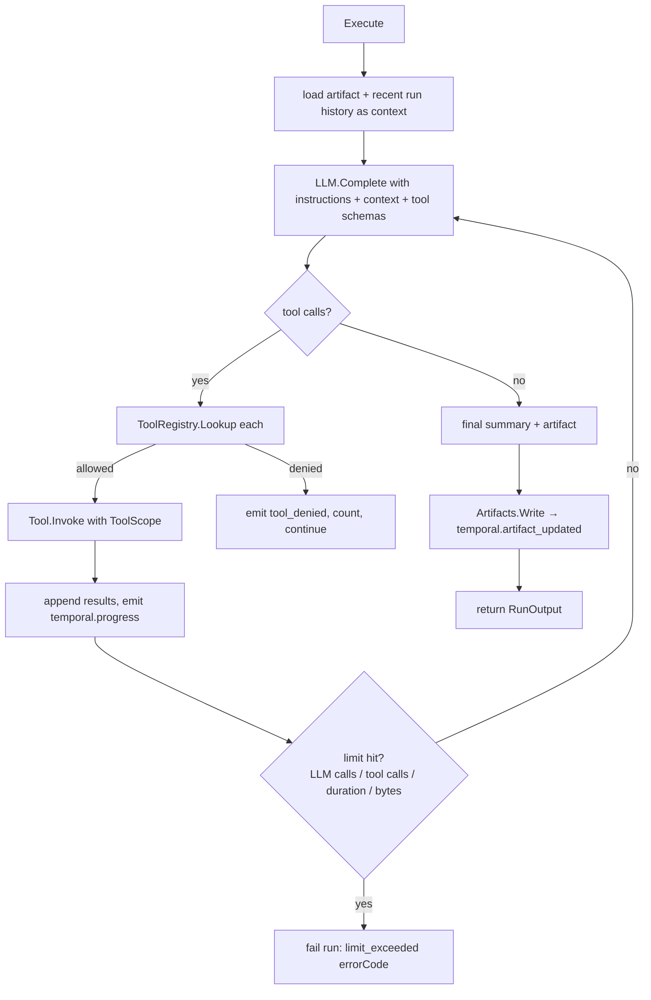

# RFC 004: Cloud-Safe Agent Runtime for API Background Tasks

|                  |                                                                                                                                                                                                                            |
| ---------------- | -------------------------------------------------------------------------------------------------------------------------------------------------------------------------------------------------------------------------- |
| **RFC**          | 004                                                                                                                                                                                                                        |
| **Status**       | Draft                                                                                                                                                                                                                      |
| **Track**        | Cloud-native background workflows                                                                                                                                                                                          |
| **Owners**       | `apps/rowboat-api` (Go backend / Temporal worker)                                                                                                                                                                          |
| **Created**      | 2026-06-05                                                                                                                                                                                                                 |
| **Last updated** | 2026-06-06                                                                                                                                                                                                                 |
| **Depends on**   | existing Temporal worker (`internal/backgroundtaskworkflow`), LLM gateway (`internal/llm`), connectors (`internal/connectors`), secrets (`internal/secrets`)                                                               |
| **Consumed by**  | [RFC 001](./001-api-owned-scheduler.md) & [RFC 003](./003-cloud-event-ingestion.md) (their runs execute through this runtime), [RFC 007](./007-production-cloud-enablement.md) (must land before unbounded cloud tools GA) |
| **Supersedes**   | Former cloud workflow planning and API execution-plan runtime sections.                                                                                                                                                    |

## Summary

The Temporal worker today proves durable execution by producing a **deterministic
markdown artifact** — `ExecuteAPITask` (`internal/backgroundtaskworkflow/workflow.go:236`)
builds a static document from the task's name/instructions/trigger via `buildSummary` and
`buildArtifact` (`workflow.go:479-509`). There is **no LLM call, no tools, no connector
access**. That was the right scaffold for proving the orchestration; it is not yet useful
work.

This RFC defines the first **production cloud runtime**: an LLM-backed, tool-scoped,
connector-aware, limit-bounded execution path that the `ExecuteAPITask` activity delegates
to — while preserving the existing run/event/artifact model byte-for-byte.

## Current state (grounded)

The execution activity, today, in full shape (`workflow.go:236-296`):

```
ExecuteAPITask(ctx, StartInput):
  auth.WithInternal(ctx)
  load task (BackgroundTask + user)
  update run: progress 50, "Building API-native task artifact." + temporal.progress
  summary  := buildSummary(task, in)        // static string
  artifact := buildArtifact(task, in, …)    // static markdown
  upsertArtifact(task, runID, artifact)     // → BackgroundTaskArtifact (workflow.go:404)
  update run: progress 90 + temporal.artifact_updated
  return RunOutput{Summary: summary}
```

Surrounding it (unchanged by this RFC): `MarkRunRunning` (claims the run, sets `executor=api`,
`workflow.go:189`), `MarkRunDone`/`MarkRunFailed` (terminal states + metrics,
`workflow.go:299/349`), the 5-minute activity start-to-close + 3× retry policy
(`workflow.go:153-161`), and `ClassifyRunError` → `error_code` taxonomy
(`internal/backgroundtaskworkflow/errcodes.go`). **This RFC swaps the _body_ of
`ExecuteAPITask`, nothing around it.**

## Goals

- Run useful background jobs fully in the API worker (LLM-generated artifacts, connector
  reads).
- LLM access through the **Rowboat API gateway** (`internal/llm`) so billing/credits/quota
  (`internal/quota`, `internal/credits`) apply uniformly.
- A **limited, auditable** tool surface (explicit allowlist; deny by default).
- Connector access via **cloud-safe, server-held credentials** only.
- Keep user data scoped and isolated (per-run identity on every tool call).
- Preserve the existing artifact + event model (`temporal.*` events, `index.md` artifact,
  revision/provenance fields).
- Bound runtime so a task can't loop forever or blow up cost.

## Non-Goals

- Arbitrary shell execution in the cloud (explicitly disallowed).
- Mirroring the desktop filesystem or every desktop tool in v1.
- Unbounded multi-hour agent loops.
- Replacing the desktop agent runtime for `executionTarget: desktop` tasks.

## Runtime model

### The seam

`ExecuteAPITask` becomes a thin adapter that builds a `RunInput`, calls
`Runtime.Execute`, and maps the result onto the existing event/artifact writes:

```go
// internal/backgroundtaskworkflow/workflow.go (revised ExecuteAPITask body, abridged)
func (a *Activities) ExecuteAPITask(ctx context.Context, in StartInput) (RunOutput, error) {
	ctx = auth.WithInternal(ctx)
	task, err := a.loadTask(ctx, in) // existing load + classify (workflow.go:243-252)
	if err != nil { return RunOutput{}, err }

	out, err := a.runtime.Execute(ctx, runtime.RunInput{
		UserID: in.UserID, TaskID: in.TaskID, Slug: in.Slug, RunID: in.RunID,
		Trigger: in.Trigger, RequestedContext: in.RequestedContext,
		Instructions: task.Instructions, Model: task.Model, Provider: task.Provider,
		Artifacts: a.artifactStore(task),     // ArtifactStore bound to this task
		Events:    a.eventSink(in),           // EventSink → appendEvent (workflow.go:436)
		Tools:     a.toolRegistry(in, task),  // scoped ToolRegistry
		LLM:       a.llmClient(in),           // gateway-backed LLMClient
		Limits:    a.limits,                  // from config
	})
	if err != nil {
		return RunOutput{}, mapRuntimeError(err) // → taggedError(code,…) (errcodes.go:55)
	}
	return RunOutput{Summary: out.Summary}, nil
}
```

`Runtime.Execute` owns the agent loop; the activity owns the durable boundary. Heartbeats
(`SetLastHeartbeatAt`, already written at `workflow.go:202,257,280`) continue from inside
the runtime via the `EventSink`/progress callbacks so Temporal sees liveness during long
LLM calls.

### Core interfaces

`internal/backgroundtaskruntime/runtime.go`:

```go
type RunInput struct {
	UserID, TaskID, Slug, RunID string
	Trigger, RequestedContext   string
	Instructions                string
	Model, Provider             string // optional per-task override (background_task.go:43-44)
	Artifacts ArtifactStore
	Events    EventSink
	Tools     ToolRegistry
	LLM       LLMClient
	Limits    Limits
}

type RunOutput struct {
	Summary       string
	ArtifactBytes int
	LLMCalls      int
	ToolCalls     int
}

type Runtime interface {
	// Execute runs the bounded agent loop. It emits progress via Events, reads/writes
	// the artifact via Artifacts, and calls only tools the Registry permits. It must be
	// deterministic-safe to call from a Temporal activity (no global mutable state).
	Execute(ctx context.Context, in RunInput) (RunOutput, error)
}

type ArtifactStore interface {           // wraps upsertArtifact (workflow.go:404)
	Read(ctx context.Context) (body, contentType string, revision int, err error)
	Write(ctx context.Context, body, contentType string) (revision int, err error)
}

type EventSink interface {               // wraps appendEvent (workflow.go:436)
	Progress(ctx context.Context, percent int, message string) error
	Emit(ctx context.Context, eventType string, payload map[string]any) error // temporal.* vocab
}

type LLMClient interface {               // gateway-backed; billing applies
	Complete(ctx context.Context, req LLMRequest) (LLMResponse, error)
}

type Tool interface {
	Name() string
	JSONSchema() json.RawMessage         // parameters schema for the model
	Invoke(ctx context.Context, scope ToolScope, args json.RawMessage) (json.RawMessage, error)
}

type ToolRegistry interface {
	// Lookup returns a tool only if it is on the allowlist AND the scope permits it;
	// otherwise (nil, ErrToolNotAllowed) — deny by default.
	Lookup(name string) (Tool, error)
	List() []Tool                        // advertised to the model
}
```

### The agent loop (bounded)



## Cloud tool surface

Initial **allowlist** (deny-by-default registry):

| Tool                               | Backed by                                                               | Scope                              |
| ---------------------------------- | ----------------------------------------------------------------------- | ---------------------------------- |
| `llm.complete`                     | `internal/llm` gateway                                                  | implicit (the `LLMClient`, billed) |
| `artifact.read` / `artifact.write` | `ArtifactStore` (this task's `index.md`)                                | task-scoped                        |
| `run_history.read`                 | recent `BackgroundTaskRun` rows for this task                           | task-scoped, read-only             |
| `event.read`                       | linked `CloudEvent` payload ([RFC 003](./003-cloud-event-ingestion.md)) | run-scoped, read-only              |
| `connector.read.*`                 | `internal/connectors` server-held tokens                                | user+connector scoped              |
| `notify.enqueue`                   | notification path, if available                                         | user-scoped                        |

Explicitly **disallowed in v1** (the registry has no entry; `Lookup` returns
`ErrToolNotAllowed`):

- Local filesystem access beyond the artifact store.
- Shell execution.
- Arbitrary network fetch (only vetted, named tools).
- Any desktop-only tool.

> Deny-by-default is enforced structurally: the registry is constructed from an explicit
> slice; unknown names can't resolve. A unit test asserts `Lookup("shell")` →
> `ErrToolNotAllowed`.

## Secrets & connectors

Credential sources, in priority order:

1. **Platform credentials** (vendor LLM keys, etc.) — from `internal/secrets`
   (`secrets.NewFromConfig` + Infisical refresh, wired at `wire.go:52-56`). Never the
   user's.
2. **User OAuth tokens** — only when the user has explicitly connected the provider and the
   API holds a valid token (the connector/OAuth broker, `internal/connectors` /
   `internal/google`, with refresh). Tokens are decrypted via `crypto.Sealer`
   (`internal/crypto`) at use, never logged, never returned to model text.
3. **Per-tool scoped** — a tool receives a narrowly-scoped credential for exactly its call;
   no raw secret passthrough into prompts or outputs.

Every tool invocation carries an immutable scope:

```go
type ToolScope struct {
	UserID      string
	WorkspaceID string // when available
	TaskSlug    string
	RunID       string
	Allowed     []string // capability scopes, e.g. ["gmail.readonly"]
}
```

A tool that needs a connector token resolves it _inside_ `Invoke` from the scope's
`UserID` + capability — it is never handed a bearer by the model. If the user hasn't
connected the provider, the tool fails with a classified error (`connector_unavailable`,
see taxonomy below), not a silent empty result.

## Artifact handling

Writes go through `ArtifactStore`, never raw DB code — wrapping the existing
`upsertArtifact` (`workflow.go:404-434`), which already:

- sets `updated_by_run_id` (provenance, `background_task_artifact.go:35`),
- sets `content_type` (default `text/markdown`, `background_task_artifact.go:37`),
- increments `revision` (`AddRevision(1)`),
- and is followed by a `temporal.artifact_updated` event (`workflow.go:287`).

Additions:

- **Preserve-on-failure:** if the run fails before a successful write, the prior artifact is
  untouched (today's upsert is the only writer; the runtime must not partially write).
  Write the new body in a single `Write` call at the end of a successful loop.
- **Content type:** the runtime may set non-markdown `content_type` for artifacts that
  round-trip to the desktop (the field already exists for this).
- V1 keeps a single `index.md` per task (the artifact edge is 1:1,
  `background_task.go:61-63`). Multi-artifact support is a future additive change (new
  entity), explicitly out of scope.

## Runtime limits

Configurable, enforced inside `Execute`; breaching one fails the run with a specific
`error_code` (so it shows in `cloud_runs_failed_total{error_code}`):

| Limit                   | Default                                                    | Env                                | On breach `error_code`         |
| ----------------------- | ---------------------------------------------------------- | ---------------------------------- | ------------------------------ |
| Max wall-clock per run  | `4m` (< the 5m activity start-to-close, `workflow.go:154`) | `CLOUD_RUNTIME_MAX_DURATION`       | `runtime_deadline_exceeded`    |
| Max LLM calls per run   | `12`                                                       | `CLOUD_RUNTIME_MAX_LLM_CALLS`      | `runtime_llm_budget_exceeded`  |
| Max tool calls per run  | `24`                                                       | `CLOUD_RUNTIME_MAX_TOOL_CALLS`     | `runtime_tool_budget_exceeded` |
| Max artifact bytes      | `1 MiB`                                                    | `CLOUD_RUNTIME_MAX_ARTIFACT_BYTES` | `runtime_artifact_too_large`   |
| Max event payload bytes | `64 KiB`                                                   | `CLOUD_RUNTIME_MAX_EVENT_BYTES`    | `runtime_event_too_large`      |
| Max retry attempts      | `3` (Temporal policy, `workflow.go:159`)                   | `TEMPORAL_*` (existing)            | inherited                      |

> **Duration coupling:** the runtime deadline must be _strictly less_ than the activity
> `StartToCloseTimeout` (5 min), or Temporal will fire `activity_timeout`
> (`ErrCodeActivityTimeout`) before the runtime's own `runtime_deadline_exceeded`, hiding
> the real cause. **Decided:** `EventSink.Progress` drives `activity.RecordHeartbeat` in v1
> (cheap, future-proofs liveness during long LLM calls); raising the ceiling later is then a
> `CLOUD_RUNTIME_MAX_DURATION` + activity-`StartToCloseTimeout` bump, heartbeats already in place.

### Error-code taxonomy additions

Extend `internal/backgroundtaskworkflow/errcodes.go` (the existing taxonomy + `knownErrorCodes`
map + `IsKnownErrorCode`) with runtime codes, all non-retryable via `taggedError`
(`errcodes.go:55`) since retrying won't change the outcome:

```
runtime_deadline_exceeded, runtime_llm_budget_exceeded, runtime_tool_budget_exceeded,
runtime_artifact_too_large, runtime_event_too_large, llm_call_failed,
tool_not_allowed, tool_invoke_failed, connector_unavailable
```

Keep the desktop's mirror in sync (the file comment at `errcodes.go:11` already mandates
this). `ClassifyRunError` (`errcodes.go:65`) needs no change — tagged runtime errors carry
their code through the Temporal `ApplicationError.Type()` already.

## Observability

`internal/backgroundtaskmetrics/metrics.go` gains (same leaf-package + cardinality rule):

| Series                               | Type      | Labels                                |
| ------------------------------------ | --------- | ------------------------------------- |
| `cloud_runtime_llm_calls_total`      | counter   | `provider`                            |
| `cloud_runtime_tool_calls_total`     | counter   | `tool` (bounded allowlist names only) |
| `cloud_runtime_tool_failures_total`  | counter   | `tool`                                |
| `cloud_runtime_limit_exceeded_total` | counter   | `limit`                               |
| `cloud_runtime_artifact_bytes`       | histogram | —                                     |
| `cloud_runtime_llm_latency_seconds`  | histogram | `provider`                            |

> `tool` is a label only because the allowlist is small and fixed — it satisfies the
> bounded-cardinality rule. Never label by `taskSlug`/`runId`/`userId` (logs/traces carry
> those, per `metrics.go:8`).

Logs (`zap`, mirroring `runLogFields`, `handler.go:1815`): `runId`, `taskSlug`, `userId`,
`toolName`, `durationMs`, `errorCode`, `llmCalls`, `toolCalls`, `artifactBytes`.

## Migration & code changes

- New package `internal/backgroundtaskruntime` (interfaces + a `DefaultRuntime`
  implementation + `NoopRuntime` that reproduces today's static-artifact behavior for the
  fallback path / tests).
- `Activities` (`workflow.go:183`) gains a `Runtime` field + `Limits`; `cmd/worker/main.go`
  constructs the runtime with the LLM gateway, connector registry, secrets, and config
  limits (the worker currently builds only `Client`+`Log`, `cmd/worker/main.go:131-134`).
- Extend `errcodes.go` taxonomy.
- Extend `metrics.go`.
- **No ent schema change** (artifact/run/event entities already carry every field the
  runtime needs: `updated_by_run_id`, `content_type`, `error_code`, `error_details`,
  `progress_*`, `last_heartbeat_at`).

Feature flag: `CLOUD_RUNTIME_ENABLED` selects `DefaultRuntime` vs `NoopRuntime`, so the
worker can ship the runtime dark and flip per environment (kind → staging → prod), keeping
the deterministic artifact as an instant rollback.

## Code-level implementation playbook

The current worker is intentionally minimal: it loads DB config, starts metrics, registers
the four activities, and passes only `{Client, Log}` into `backgroundtaskworkflow.Activities`
(`cmd/worker/main.go:120-124`). Implementing this RFC means turning the worker into a
small service container while keeping Temporal activities thin and testable.

### 1. Runtime package files

Create `apps/rowboat-api/internal/backgroundtaskruntime`:

| File                  | Contents                                                                                               |
| --------------------- | ------------------------------------------------------------------------------------------------------ |
| `runtime.go`          | Interfaces in this RFC (`Runtime`, `ArtifactStore`, `EventSink`, `LLMClient`, `ToolRegistry`, `Tool`). |
| `default_runtime.go`  | Bounded agent loop implementation.                                                                     |
| `noop_runtime.go`     | Reproduces today's deterministic `buildSummary`/`buildArtifact` behavior for rollback/tests.           |
| `limits.go`           | Env parsing, default limits, `ErrLimitExceeded`.                                                       |
| `llm_client.go`       | Internal gateway-backed LLM client with quota/accounting.                                              |
| `tool_registry.go`    | Deny-by-default registry and per-run scope construction.                                               |
| `tools_artifact.go`   | `artifact.read`, `artifact.write`.                                                                     |
| `tools_history.go`    | `run_history.read`.                                                                                    |
| `tools_event.go`      | `event.read` for linked RFC 003 events.                                                                |
| `tools_connectors.go` | Gmail/Calendar read tools.                                                                             |
| `errors.go`           | Runtime error types that map to `errcodes.go`.                                                         |
| `metrics.go`          | Runtime counters/histograms.                                                                           |

Keep tool implementations small and boring. Complex provider-specific logic belongs in
provider packages (`internal/google`, `internal/connectors`) and is invoked from the tool.

### 2. Worker dependency construction

Extend `cmd/worker/main.go` after DB open and before `runTemporalWorker`:

1. Build `crypto.Sealer` from `DB_ENCRYPTION_KEY` if connector/event payload tools are
   enabled.
2. Build `secrets.Store` the same way `cmd/server/wire.go` does, so provider keys and
   Infisical-backed secrets are available in the worker.
3. Load pricing and quota gate if the runtime LLM client settles credits directly.
4. Load connector registry from `CONNECTORS_JSON` (`connectors.LoadRegistry`, current
   `wire.go:131-135`).
5. Build `backgroundtaskruntime.Limits` from env.
6. Choose runtime:

```go
var rt backgroundtaskruntime.Runtime
if cfg.CloudRuntimeEnabled {
	rt = backgroundtaskruntime.NewDefault(deps)
} else {
	rt = backgroundtaskruntime.NewNoop()
}
```

Then pass it into activities:

```go
backgroundtaskworkflow.Register(w, &backgroundtaskworkflow.Activities{
	Client: client,
	Log:    log,
	Runtime: rt,
	RuntimeLimits: limits,
})
```

This requires new config fields in `internal/appconfig.Config`:

| Env                                | Default   |
| ---------------------------------- | --------- |
| `CLOUD_RUNTIME_ENABLED`            | `false`   |
| `CLOUD_RUNTIME_MAX_DURATION`       | `4m`      |
| `CLOUD_RUNTIME_MAX_LLM_CALLS`      | `12`      |
| `CLOUD_RUNTIME_MAX_TOOL_CALLS`     | `24`      |
| `CLOUD_RUNTIME_MAX_ARTIFACT_BYTES` | `1048576` |
| `CLOUD_RUNTIME_MAX_EVENT_BYTES`    | `65536`   |

### 3. Refactor `ExecuteAPITask` safely

Split the existing static body into reusable adapters before changing behavior:

```go
func (a *Activities) ExecuteAPITask(ctx context.Context, in StartInput) (RunOutput, error) {
	ctx = auth.WithInternal(ctx)
	task, run, err := a.loadTaskAndRun(ctx, in)
	if err != nil { return RunOutput{}, err }

	bound := a.bindRuntime(ctx, task, run, in)
	out, err := a.Runtime.Execute(ctx, bound)
	if err != nil { return RunOutput{}, mapRuntimeError(err) }
	return RunOutput{Summary: out.Summary}, nil
}
```

Move current helper behavior into adapters:

| Existing function/lines                            | Adapter                                                                            |
| -------------------------------------------------- | ---------------------------------------------------------------------------------- |
| Task load (`workflow.go:243-252`)                  | `loadTaskAndRun` with user edge and current run.                                   |
| `upsertArtifact` (`workflow.go:404-434`)           | `artifactStore.Write`.                                                             |
| `appendEvent` (`workflow.go:436-477`)              | `eventSink.Emit`.                                                                  |
| Progress update (`workflow.go:254-269`, `278-292`) | `eventSink.Progress`, which updates run row, appends event, and records heartbeat. |
| Static `buildSummary`/`buildArtifact`              | `NoopRuntime.Execute`.                                                             |

The first PR can wire `NoopRuntime` only and assert no behavior change. The second PR turns
on `DefaultRuntime` behind `CLOUD_RUNTIME_ENABLED`.

### 4. Heartbeats and progress

`EventSink.Progress` should do three things atomically enough for observability:

1. `activity.RecordHeartbeat(ctx, ProgressHeartbeat{Percent, Message})`
2. Update `background_task_runs`: `last_heartbeat_at=now`, `progress_percent`,
   `progress_message`, `revision+1`
3. Append `temporal.progress` with the same percent/message

If the DB update fails, return `ErrCodeDBError`; if event append fails after the update,
return `ErrCodeDBError` as well. The run may show progress without an event for that tick,
but terminal failure will preserve the error.

### 5. LLM client implementation

Do not call the HTTP handler directly from the worker. `internal/llm/handler.go` currently
combines request parsing, upstream routing, quota reserve/settle, streaming, and usage
recording. Factor the reusable pieces into an internal service:

```go
type Gateway struct {
	Prices *pricing.Table
	Gate   *quota.Gate
	Secrets *secrets.Store
	Client *ent.Client
	HTTP   *http.Client
}

func (g *Gateway) Complete(ctx context.Context, user *ent.User, req CompletionRequest, tel Telemetry) (CompletionResponse, error)
```

The HTTP handler calls `Gateway.ProxyHTTP`; the runtime calls `Gateway.Complete`. Both
paths reserve credits, route model ids, call the upstream, settle actual usage, and write
`LLMUsage`. The runtime sets telemetry headers/fields equivalent to:

- `useCase=background_task_agent`
- `subUseCase=runtime`
- `agentName=<task slug>`

### 6. Prompt and loop shape

For v1, keep the agent loop deterministic in structure:

```go
for step := 0; step < limits.MaxLLMCalls; step++ {
	resp, err := llm.Complete(ctx, requestWithTools(transcript, registry.List()))
	if err != nil { return out, RuntimeError{Code: "llm_call_failed"} }
	if len(resp.ToolCalls) == 0 {
		return writeFinalArtifact(ctx, resp.Final)
	}
	for _, call := range resp.ToolCalls {
		if toolCalls >= limits.MaxToolCalls { return limit("runtime_tool_budget_exceeded") }
		tool, err := registry.Lookup(call.Name)
		if errors.Is(err, ErrToolNotAllowed) {
			events.Emit(ctx, "runtime.tool_denied", ...)
			continue
		}
		result, err := tool.Invoke(ctx, scope, call.Arguments)
		appendToolResult(&transcript, call, result, err)
	}
}
return limit("runtime_llm_budget_exceeded")
```

The model should be instructed to produce one final artifact and summary when done. Tool
results are summarized/truncated before being appended back to the loop to avoid blowing
the next prompt. Raw connector payloads are never pasted wholesale.

### 7. Tool registry mechanics

Construct a registry per run:

```go
registry := backgroundtaskruntime.NewRegistry([]Tool{
	NewArtifactRead(store),
	NewArtifactWrite(store),
	NewRunHistory(client),
	NewEventRead(client, sealer),
	NewGoogleGmailRead(...),
	NewGoogleCalendarRead(...),
})
```

Then filter by task/user capabilities:

- `artifact.*` always available.
- `run_history.read` always available, task-scoped.
- `event.read` only when `run.cloud_event_id` is non-null.
- `connector.read.gmail` only if the user has a connected Google/Gmail credential with the
  required scope.
- `connector.read.calendar` only if the user has calendar scope.

`Lookup` returns `ErrToolNotAllowed` for unknown names and for known names that the scope
does not permit. This lets the model see only allowed tools from `List()` but still handles
hallucinated tool names safely.

### 8. Artifact write policy

The runtime should build the next artifact in memory and call `ArtifactStore.Write` once at
the end. Enforce `MaxArtifactBytes` before writing:

```go
if len([]byte(body)) > limits.MaxArtifactBytes {
	return RuntimeError{Code: "runtime_artifact_too_large"}
}
revision, err := artifacts.Write(ctx, body, "text/markdown")
```

This preserves the current failure behavior: if a run fails, the prior artifact remains the
latest good output. Partial streaming writes are out of scope.

### 9. Error mapping

Add constants to `errcodes.go` and `knownErrorCodes`. `mapRuntimeError` should return
non-retryable `ApplicationError`s via the existing `taggedError` helper:

| Runtime error               | Code                           | Retry?                |
| --------------------------- | ------------------------------ | --------------------- |
| Context deadline            | `runtime_deadline_exceeded`    | no                    |
| LLM call budget             | `runtime_llm_budget_exceeded`  | no                    |
| Tool call budget            | `runtime_tool_budget_exceeded` | no                    |
| Artifact too large          | `runtime_artifact_too_large`   | no                    |
| Event payload too large     | `runtime_event_too_large`      | no                    |
| Upstream LLM failure        | `llm_call_failed`              | maybe later, no in v1 |
| Denied tool                 | `tool_not_allowed`             | no                    |
| Tool implementation failure | `tool_invoke_failed`           | maybe later, no in v1 |
| Missing connector token     | `connector_unavailable`        | no                    |

Because `ClassifyRunError` already preserves known `ApplicationError.Type()`, the workflow
classification path does not need structural changes.

### 10. Test fixtures

The unit test harness should not involve Temporal for most runtime behavior:

- `fakeLLM` returning scripted tool calls/final responses.
- `fakeArtifactStore` recording write attempts and byte counts.
- `fakeEventSink` recording progress/events and allowing injected failures.
- `fakeTool` with configurable result/error/delay.
- `fakeClock` or deadline context for duration tests.

Temporal test env is only needed to verify the activity/wiring boundary:

1. Workflow starts with queued run row.
2. `MarkRunRunning` claims it.
3. Runtime emits progress.
4. Artifact is written.
5. `MarkRunDone` persists summary.

## Runtime prompt/tool contracts and reviewer checklist

### Default system prompt skeleton

The runtime prompt should be stable and versioned. It is part of product behavior and cost
control.

```text
You are executing a Rowboat background task in the cloud.

Task:
- slug: {{slug}}
- name: {{name}}
- trigger: {{trigger}}
- requested context: {{requestedContext}}

Instructions:
{{instructions}}

Rules:
- Use only the tools provided in this request.
- Do not ask the user questions.
- Produce one final artifact and a short summary.
- Keep the artifact grounded in tool results and requested context.
- Never claim to have accessed local desktop files.
- If required data is unavailable, say what is missing and write the best safe artifact.
```

Store `prompt_version: "cloud-runtime-v1"` in runtime events so a later prompt revision can
be correlated with quality/cost changes.

### Tool call event vocabulary

Append runtime events into the existing run event stream:

| Event type                     | Payload                                                              |
| ------------------------------ | -------------------------------------------------------------------- |
| `runtime.llm_call_started`     | `{provider, model, callIndex}`                                       |
| `runtime.llm_call_completed`   | `{provider, model, callIndex, latencyMs, inputTokens, outputTokens}` |
| `runtime.tool_call_started`    | `{tool, callIndex}`                                                  |
| `runtime.tool_call_completed`  | `{tool, callIndex, latencyMs, resultBytes}`                          |
| `runtime.tool_denied`          | `{tool, reason}`                                                     |
| `runtime.limit_exceeded`       | `{limit, value, max}`                                                |
| `runtime.final_artifact_ready` | `{artifactBytes, contentType}`                                       |

These events are for debugging and transcript display. Metrics keep bounded labels; events
may include run-specific details because reads are auth-scoped.

### Connector read tool contract

The first Gmail/Calendar tools should be narrow:

```json
{
  "name": "connector.read.gmail",
  "input": {
    "query": "from:acme.com newer_than:30d",
    "limit": 10
  },
  "output": {
    "messages": [
      {
        "id": "msg_123",
        "threadId": "thr_123",
        "from": "ap@acme.com",
        "subject": "Invoice #4821",
        "receivedAt": "2026-06-06T14:00:00Z",
        "snippet": "We dispute line 3..."
      }
    ]
  }
}
```

```json
{
  "name": "connector.read.calendar",
  "input": {
    "timeMin": "2026-06-06T00:00:00Z",
    "timeMax": "2026-06-13T00:00:00Z",
    "query": "Acme",
    "limit": 10
  },
  "output": {
    "events": [
      {
        "id": "evt_123",
        "summary": "Acme QBR",
        "startsAt": "2026-06-08T17:00:00Z",
        "attendees": ["champion@acme.com"]
      }
    ]
  }
}
```

Do not return raw bodies in v1 unless the user explicitly granted a scope and the runtime
limit can absorb it. Snippets and structured fields are enough for the first useful tasks.

### Reviewer checklist for runtime PRs

Reject runtime changes that:

- Add a tool without a scope check.
- Add a metric label that can contain user/task/run/provider object ids.
- Let the model see OAuth tokens or API keys.
- Stream partial artifact writes into the DB.
- Increase `CLOUD_RUNTIME_MAX_DURATION` without increasing the Temporal activity timeout.
- Add a retryable error for budget/validation failures.
- Bypass the LLM gateway accounting path.
- Put raw linked event payloads into `requested_context`.
- Make `DefaultRuntime` the default before staging soak.

### Rollback behavior

`CLOUD_RUNTIME_ENABLED=false` should:

- Keep API triggers, scheduler triggers, event triggers, and Temporal workflows running.
- Swap only the activity body back to `NoopRuntime`.
- Preserve the same event names for `temporal.running`, `temporal.artifact_updated`, and
  `temporal.completed`.
- Stop advertising connector/faculty tools.
- Leave runtime-specific events absent, not failed.

This makes runtime rollback a product-quality rollback, not a control-plane outage.

## Test plan

- Unit: runtime executes a simple LLM-backed artifact task against a fake `LLMClient`
  (deterministic responses) and writes via a fake `ArtifactStore` (revision increments).
- Unit: `LLMClient` failure → `llm_call_failed` classified code; `MarkRunFailed` records it
  (assert `cloud_runs_failed_total{error_code="llm_call_failed"}`).
- Unit: `Lookup("shell")` and `Lookup("fs.write")` → `ErrToolNotAllowed`; denied tool emits
  `tool_denied`, doesn't abort the loop.
- Unit: each limit breach fails predictably with its code; duration limit fires _before_ the
  Temporal activity timeout.
- Unit: artifact write increments revision and sets `updated_by_run_id`; failure before
  write leaves the prior artifact intact.
- Integration: Temporal worker (test env) runs the full workflow with `DefaultRuntime`,
  emits `temporal.{running,progress,artifact_updated,completed}`, persists artifact + events
  — assert parity with the existing happy-path harness (`handler_cloud_test.go` style).

## Acceptance criteria

- API-target tasks produce useful **LLM-generated** artifacts in the cloud.
- Tool access is explicit, scoped, and auditable; unknown tools are impossible to call.
- Runtime failures yield actionable `error_code` + `error_details` (surfaced to the desktop,
  per `errcodes.go`).
- The existing desktop cloud-run UI inspects runtime events/artifacts unchanged (same
  `temporal.*` vocabulary, same artifact endpoint).
- Cost/loop bounded by enforced limits; breaches are observable.

## Alternatives considered

- **Run the desktop agent (`apps/x/.../background-tasks/agent.ts`) server-side** — rejected:
  it assumes a local filesystem and desktop tool surface; porting it wholesale brings the
  exact unsafe capabilities this RFC excludes. The cloud runtime is a deliberately smaller,
  safer surface.
- **No interfaces, inline LLM call in `ExecuteAPITask`** — rejected: untestable without
  Temporal, and it would hard-wire one tool/credential strategy. The `Runtime`/`ToolRegistry`
  seam keeps the activity thin and the loop unit-testable.
- **Let tools receive bearer tokens from the model** — rejected outright (prompt-injection →
  credential exfiltration). Tools resolve credentials from `ToolScope` internally.

## Decisions

Resolved forks (consolidated in [`README.md`](./README.md#consolidated-decisions)):

- **Agent loop → hand-rolled bounded loop** (no external Go agent framework). Keeps the
  dependency surface small and the loop deterministic/unit-testable behind the `Runtime`
  interface. Revisit only if multi-tool orchestration outgrows it.
- **Temporal heartbeats → wired in v1** via `EventSink.Progress → activity.RecordHeartbeat`.
  Cheap insurance; lets the duration ceiling rise later without a liveness gap.
- **v1 connector read tools → Gmail + Google Calendar (read-only)**, matching the first
  [RFC 003](./003-cloud-event-ingestion.md) event sources. Other connectors are additive
  registry entries, deny-by-default until added.
- **Limits → per-tenant via config/env in v1; no per-task override.** A task can't raise its
  own budget; tenant-level overrides (a power user with higher LLM budget) come later if
  needed.
- **Runtime selection → `CLOUD_RUNTIME_ENABLED` flag** picks `DefaultRuntime` (LLM-backed)
  vs `NoopRuntime` (today's deterministic artifact), so the runtime ships dark and the
  deterministic path is an instant rollback.

### Deferred (needs a real workload; not blocking)

- Raising `CLOUD_RUNTIME_MAX_DURATION` above 4 m (and the matching activity timeout) once a
  genuinely long-running task exists — heartbeats are already wired for it.
