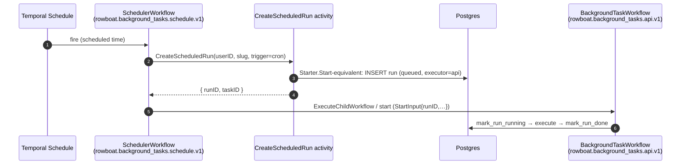

# RFC 005: Temporal Schedule Integration for Exact Cron Cloud Tasks

| | |
| --- | --- |
| **RFC** | 005 |
| **Status** | Draft |
| **Track** | Cloud-native background workflows |
| **Owners** | `apps/rowboat-api` (Go backend / Temporal worker) |
| **Created** | 2026-06-05 |
| **Last updated** | 2026-06-05 |
| **Depends on** | [RFC 001](./001-api-owned-scheduler.md) (ships first, is the fallback), shared `Starter`, [RFC 007](./007-production-cloud-enablement.md) (Temporal Cloud creds) |
| **Relationship** | Supersedes [RFC 002](./002-durable-schedule-state.md) leasing **for exact cron only**; windows + events stay on RFC 001/003 |
| **Parent docs** | [`docs/CLOUD_NATIVE_BACKGROUND_WORKFLOWS_RFC.md`](../../docs/CLOUD_NATIVE_BACKGROUND_WORKFLOWS_RFC.md) §4.3, §6.4 |

## Summary

[RFC 001's](./001-api-owned-scheduler.md) polling loop is the fastest way to make cloud
schedules work, but Temporal ships **first-class durable Schedules** that are a strictly
better fit for *exact cron*: Temporal owns the catch-up policy, overlap policy, jitter,
pause/unpause, and "next fire time" — durably, with no lease table and no poll. This RFC
uses Temporal Schedules for `triggers.cronExpr` while keeping Rowboat's own scheduler for
`triggers.windows` (forgiving once-per-day bands Temporal can't express) and the event
router for `triggers.eventMatchCriteria`.

The desktop still edits one `triggers` object; **the API decides the mechanism per
sub-trigger.**

## Current state (grounded)

| Fact | Evidence |
| --- | --- |
| Temporal already executes API runs | `internal/backgroundtaskworkflow/workflow.go`; workflow `rowboat.background_tasks.api.v1` |
| Temporal client dial (Cloud API-key/TLS aware) | `Dial` (`workflow.go:91`); `Starter` (`workflow.go:108`) |
| Deterministic workflow id | `WorkflowID = "background-task/{userID}/{slug}/{runID}"` (`workflow.go:113`) |
| Reuse policy | `ALLOW_DUPLICATE_FAILED_ONLY` (`workflow.go:123`) |
| Cron/window due math lives on desktop today; RFC 001 moves it to the API loop | `schedule/utils.ts`, RFC 001 |
| Temporal **Schedules** | **not used anywhere yet** |

## Goals

- Use Temporal's durable scheduling for exact `cronExpr` triggers.
- Reduce custom scheduler responsibility where Temporal already has strong semantics.
- Keep Rowboat-specific window/event behavior in Rowboat code.
- **Preserve a single run-history model** in the Rowboat API DB — every fire still produces
  a `BackgroundTaskRun` row via the shared `Starter`, identical to manual/loop runs.

## Non-Goals

- Replacing window triggers with Temporal Schedules (Temporal cron can't express
  "once/day anywhere in a band").
- Replacing event routing with Temporal Schedules.
- Exposing raw Temporal Schedule internals to users (the desktop sees a normalized
  schedule-health summary, RFC 006).

## Proposed split

| Sub-trigger | Mechanism | Owner |
| --- | --- | --- |
| `triggers.cronExpr` | **Temporal Schedule** | this RFC |
| `triggers.windows` | Rowboat API scheduler loop + lease | [RFC 001](./001-api-owned-scheduler.md) / [RFC 002](./002-durable-schedule-state.md) |
| `triggers.eventMatchCriteria` | Cloud event router | [RFC 003](./003-cloud-event-ingestion.md) |
| `manual` `Run now` | `POST /trigger` (unchanged) | `handler.triggerAPIRun` |

A task with both `cronExpr` and `windows` uses **both** mechanisms simultaneously, each
producing its own runs (the `last_run_at` cycle anchor keeps them independent).

## Schedule identity & the run-record problem

Temporal Schedule ID (one per task's cron sub-trigger):

```
background-task-schedule/{userID}/{slug}/cron
```

The critical design constraint: **a Temporal Schedule fires a workflow, but Rowboat needs a
`BackgroundTaskRun` row to exist first** (every run-history/UI/metric assumes it —
`triggerAPIRun` creates the row *before* `StartWorkflow`, `handler.go:1127-1161`). A naive
Schedule that directly starts `rowboat.background_tasks.api.v1` would launch a workflow with
no run row, breaking `MarkRunRunning` (which `Update().Where(RunIDEQ(...))` expects an
existing row, `workflow.go:196-213`).

**Solution — schedule a thin "scheduler workflow" that creates the run first:**



The action target is the **scheduler workflow** `rowboat.background_tasks.schedule.v1`,
task queue `TEMPORAL_TASK_QUEUE` (`rowboat-api-background-tasks`). Its single activity
creates the run row (reusing the same insert logic as `Starter`, run-id prefix
`sched-temporal-<uuid>`), then it starts/continues the existing
`rowboat.background_tasks.api.v1` workflow with the freshly-minted `runID`. This guarantees
the invariant "no `BackgroundTaskWorkflow` runs without a run record."

> **Why a workflow and not just an activity as the schedule action?** Temporal Schedule
> actions start a *workflow*. Making that workflow thin (create-row → start-real-workflow)
> keeps run creation durable and retryable under Temporal's own guarantees, and keeps the
> heavy `BackgroundTaskWorkflow` unchanged.

### Schedule spec

```go
// internal/backgroundtaskworkflow/schedules.go (new)
client.ScheduleClient().Create(ctx, client.ScheduleOptions{
	ID: ScheduleID(userID, slug),                 // background-task-schedule/{u}/{slug}/cron
	Spec: client.ScheduleSpec{
		CronExpressions: []string{task.cronExpr},  // from triggers.cronExpr
		TimeZoneName:    scheduleTimezone,          // UTC for v1 (decided; RFC 001)
		Jitter:          0,                          // exact cron; no smear
	},
	Action: &client.ScheduleWorkflowAction{
		ID:        WorkflowID(userID, slug, "cron-anchor"), // base id; runs get unique suffix
		Workflow:  SchedulerWorkflowName,                   // rowboat.background_tasks.schedule.v1
		TaskQueue: cfg.TemporalTaskQueue,
		Args:      []any{ScheduleFireInput{UserID: userID, Slug: slug, TaskID: taskID, Trigger: "cron"}},
	},
	Overlap: enums.SCHEDULE_OVERLAP_POLICY_SKIP, // don't stack runs if one overruns
	CatchupWindow: time.Minute,                  // ≈ RFC 001's 2-min grace; bound replay after downtime
	Paused:  !task.active,                       // inactive task ⇒ paused schedule
})
```

`Overlap=SKIP` mirrors the desktop's in-flight guard (a new occurrence is skipped while the
prior run is still in flight). `CatchupWindow` ≈ the loop's grace, so a brief outage replays
at most the missed occurrences inside the window — not a storm.

## API behavior (schedule lifecycle = task lifecycle)

The handler's task mutations drive schedule state. Hook into the existing
`Create`/`Patch`/`Delete` handlers (`handler.go:296/386/460`):

| Task event | Schedule action |
| --- | --- |
| Create/Patch sets `cronExpr` (api-target, active) | **upsert** schedule (create or update spec) |
| Patch removes `cronExpr` | **delete** (or pause) schedule |
| Patch sets `active=false` | **pause** schedule |
| Patch sets `active=true` (has cron) | **unpause** (ensure exists) |
| Delete task | **delete** schedule |
| `execution_target` flips `api`→`desktop` | **delete** schedule (desktop owns it now) |

`Run now` (`POST /trigger`) continues through `triggerAPIRun` and **does not** touch the
Schedule — manual and scheduled are independent.

Each upsert is keyed by the task `revision` (`background_task.go:53`) so the reconciler can
detect drift (schedule built from an older revision than the task).

## Reconciliation

Temporal Schedules can drift from the DB (a patch whose upsert failed, a schedule for a
deleted task, a paused schedule for a now-active task). Add a periodic reconciler (a slow
loop in the scheduler binary from RFC 001, or its own goroutine):

```
for each active api-target task with cronExpr:
    ensure schedule exists; if missing → create; if spec/revision differs → update
for each existing background-task-schedule/* in Temporal:
    if owning task missing/deleted → delete (fail-safe)
    if task inactive → ensure paused
    emit drift metric per correction
```

This makes the system self-healing: a missed upsert is repaired within one reconcile
interval, bounded and observable.

## Failure modes

| Case | Behavior |
| --- | --- |
| Schedule upsert fails on `Patch` | Return a visible API error **or** persist a `schedule_sync_state=failed` marker on the task and let the reconciler repair; desktop shows `failed` (RFC 006). Do **not** silently swallow. |
| Schedule fires but run-row creation fails | The scheduler workflow's `CreateScheduledRun` activity retries (Temporal retry policy); on exhaustion, emit a failed scheduler run/event with `errorCode=schedule_run_create_failed`. |
| Schedule exists but task deleted | `SchedulerWorkflow` finds no task → fails fast & safe; reconciler deletes the orphan schedule. |
| Temporal Cloud unreachable during upsert | Mark `schedule_sync_state=syncing/failed`; **RFC 001 loop remains enabled as the fallback** so cron still fires (see Rollout). |
| Both loop and Schedule active for same cron during migration | Double-fire risk — mitigated by the migration order: a task is on **exactly one** mechanism at a time, gated by `schedule_sync_state=current`. The loop skips cron sub-triggers it has handed to Temporal. |

## Desktop UX (summary; full spec in RFC 006)

Desktop shows, for cron api-target tasks:

- `Cloud scheduled` + schedule type `Temporal cron`
- schedule sync state: `current | syncing | failed | paused`
- next expected fire time (from `ScheduleClient.Describe` → `Info.NextActionTimes`)

## Configuration

| Env | Default | Meaning |
| --- | --- | --- |
| `TEMPORAL_SCHEDULES_ENABLED` | `false` | Master switch for the Schedule path. When false, cron stays on the RFC 001 loop. |
| `TEMPORAL_SCHEDULE_CATCHUP` | `1m` | `CatchupWindow`. |
| `TEMPORAL_SCHEDULE_RECONCILE_INTERVAL` | `5m` | Reconciler cadence. |
| `CLOUD_SCHEDULER_TIMEZONE` | `UTC` | shared with RFC 001; the Schedule `TimeZoneName`. |

(All cron firing requires `TEMPORAL_ENABLED=true` and the worker registering
`SchedulerWorkflowName`.)

## Observability

`internal/backgroundtaskmetrics/metrics.go` additions:

| Series | Type | Labels |
| --- | --- | --- |
| `temporal_schedules_upserted_total` | counter | `action` (`create`/`update`) |
| `temporal_schedules_deleted_total` | counter | — |
| `temporal_schedule_sync_failures_total` | counter | `op` |
| `temporal_schedule_drift_total` | counter | `kind` (`missing`/`stale`/`orphan`/`pause`) |
| `temporal_schedule_fires_total` | counter | — (scheduler-workflow starts) |

Logs: `taskSlug`, `scheduleId`, `taskRevision`, `action`
(`upsert/delete/pause/unpause/reconcile`), `error`.

## Rollout

1. **Implement RFC 001 loop first** (it handles cron, windows, fallback) and ship it.
2. Add `SchedulerWorkflow` + `CreateScheduledRun` activity + schedule upsert/delete/pause
   helpers, register on the worker, behind `TEMPORAL_SCHEDULES_ENABLED=false`.
3. Enable in **kind** for a single cron test (desktop closed → Temporal fires → run row →
   completes).
4. Enable in **staging**; run cron tasks on Schedules with the loop *also* watching (loop
   skips cron sub-triggers marked `schedule_sync_state=current`).
5. **Migrate cron tasks** from the loop to Schedules per task: upsert schedule → mark
   `current` → loop stops evaluating that cron.
6. Keep the **RFC 001 loop as the fallback** for any task whose schedule sync is `failed`.
7. Production via RFC 007 phases.

## Test plan

- Unit: `ScheduleID` / `WorkflowID` generation; spec built from `triggers.cronExpr`.
- Unit: `SchedulerWorkflow` creates a run row then starts `rowboat.background_tasks.api.v1`
  (Temporal test env, time-skipping) — assert a `BackgroundTaskRun` exists before the child
  workflow runs.
- Integration: `Create`/`Patch`/`Delete` task upserts/updates/deletes the schedule;
  `active=false` pauses it.
- Integration: reconciler repairs a deleted-schedule / orphaned-schedule / wrong-pause-state.
- kind E2E: cron task fires through a Temporal Schedule with the desktop closed; run history
  shows `trigger=cron`, `executor=api`.

## Acceptance criteria

- Exact-cron api-target tasks fire through Temporal Schedules with the desktop closed.
- Run history remains stored in Rowboat API tables, identical in shape to loop/manual runs.
- Schedule drift is observable and recoverable (reconciler + metrics).
- Falling back to the RFC 001 loop is possible by setting `TEMPORAL_SCHEDULES_ENABLED=false`.

## Alternatives considered

- **Direct schedule → `BackgroundTaskWorkflow`** (no scheduler-workflow indirection) —
  rejected: leaves no `BackgroundTaskRun` row, breaking `MarkRunRunning` and the entire
  run-history/UI/metrics model. The thin scheduler-workflow is the minimal fix.
- **Temporal Schedules for windows too** — rejected: Temporal cron can't express "once per
  day anywhere in [09:00,12:00]"; forcing it would change user-visible window semantics.
- **Drop the RFC 001 loop entirely once Schedules ship** — deferred: the loop is the
  fallback during Temporal Cloud incidents and still owns windows. Revisit consolidation
  after Schedules soak.

## Decisions

Resolved forks (consolidated in [`README.md`](./README.md#consolidated-decisions)):

- **Overlap policy → `SCHEDULE_OVERLAP_POLICY_SKIP`.** Mirrors the desktop in-flight guard: a
  new occurrence is skipped while the prior run is still executing — no stacked runs.
- **Schedule health → a persisted `schedule_sync_state` field on `BackgroundTask`** (additive
  ent change: `current | syncing | failed | paused`). Gives the desktop a fast read; the
  reconciler is the authority that repairs it. Avoids a `ScheduleClient.Describe` round-trip
  on every task-list render (next-fire time is still fetched live on the detail view).
- **Timezone → UTC for v1**, parity with [RFC 001](./001-api-owned-scheduler.md). Temporal's
  native `TimeZoneName` means the per-task-TZ fast-follow can land *first* on the cron path;
  the window loop follows. Either way the desktop labels the zone (RFC 006).
- **Migration → loop-first, then per-task cutover.** The RFC 001 loop ships and owns cron
  until each task is migrated to a Schedule (marked `schedule_sync_state=current`, after
  which the loop skips that cron sub-trigger). The loop stays the permanent fallback.
