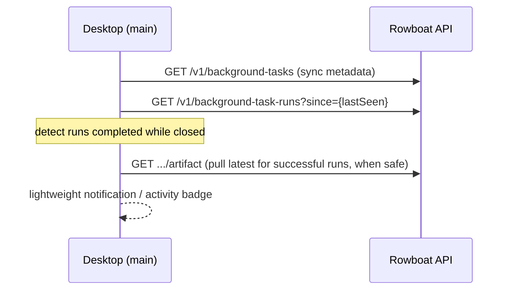

# RFC 006: Desktop as Cloud Workflow Control Plane

|                  |                                                                                                                                                                                                                                                                                   |
| ---------------- | --------------------------------------------------------------------------------------------------------------------------------------------------------------------------------------------------------------------------------------------------------------------------------- |
| **RFC**          | 006                                                                                                                                                                                                                                                                               |
| **Status**       | Draft                                                                                                                                                                                                                                                                             |
| **Track**        | Cloud-native background workflows                                                                                                                                                                                                                                                 |
| **Owners**       | `apps/x` (Electron: main + renderer + core)                                                                                                                                                                                                                                       |
| **Created**      | 2026-06-05                                                                                                                                                                                                                                                                        |
| **Last updated** | 2026-06-06                                                                                                                                                                                                                                                                        |
| **Depends on**   | [RFC 001](./001-api-owned-scheduler.md) (schedule state to display), [RFC 002](./002-durable-schedule-state.md) (`next due`/`last evaluated`), [RFC 005](./005-temporal-schedule-integration.md) (schedule health), [RFC 003](./003-cloud-event-ingestion.md) (event→run linkage) |
| **Supersedes**   | Former cloud workflow planning desktop-control-plane sections.                                                                                                                                                                                                                    |

## Summary

As scheduling and execution move into the API ([RFC 001](./001-api-owned-scheduler.md),
[003](./003-cloud-event-ingestion.md), [005](./005-temporal-schedule-integration.md)), the
desktop's job shifts from _running_ cloud work to being its **control plane**: making
crystal-clear what is cloud-managed vs local, what will run next, and what happened while
the app was closed. The execution/observability plumbing already exists; the gap is
**clarity around scheduled cloud ownership and offline behavior.**

## Current state (grounded)

The desktop cloud surface is already substantial:

| Capability                     | Evidence                                                                                                                                                                                                                                                                                       |
| ------------------------------ | ---------------------------------------------------------------------------------------------------------------------------------------------------------------------------------------------------------------------------------------------------------------------------------------------- |
| IPC channels for cloud control | `apps/x/apps/main/src/ipc.ts:1075-1169`: `bg-task:triggerCloudRun`, `getCloudRunStatus`, `listCloudRuns`, `listCloudRunEvents`, `cancelCloudRun`, `retryCloudRun`, `rerunCloudRun`, `signalCloudRun`, `pullCloudArtifact`, `listAllCloudRuns`, `getArtifactSyncState`                          |
| Core cloud client              | `apps/x/packages/core/src/background-tasks/cloud-sync.ts` — `triggerCloudRun` (`:393`), `listAllCloudRuns` (`:363`), `getCloudRunStatus`, `listCloudRunEvents`, cancel/retry/rerun/signal, `syncArtifactFromCloud` (`:270`), `getArtifactSyncState` (`:289`), `processRemoteTriggers` (`:595`) |
| Renderer                       | `apps/x/apps/renderer/src/components/bg-tasks-view.tsx` — task list, Setup tab, Runs history (Local/Cloud), `CloudRunTranscriptView`, `GlobalCloudRunsView`, auto artifact pull on terminal success                                                                                            |
| Run polling                    | Cloud transcript polls status+events every 2s while non-terminal; lists poll every 3s                                                                                                                                                                                                          |

What's **missing**: nothing tells the user _"this schedule runs in the cloud and will next
fire at T"_, or surfaces runs that happened while the app was closed, or distinguishes
cloud-managed from desktop-only schedules. There is no `bg-task:getCloudScheduleState`.

## Goals

- Make cloud-managed schedules **visible and legible**: next run, schedule health, trigger
  source.
- Show runs that completed while the desktop was closed (the offline-return experience).
- Keep manual cloud controls (`Run now`, cancel, retry, rerun, pull) easy.
- Never confuse `executionTarget: api` (cloud) with `executionTarget: desktop` (local).

## Non-Goals

- A full admin console (the [RFC 003](./003-cloud-event-ingestion.md) event browser, deep
  Temporal internals).
- Surfacing raw Temporal Schedule internals by default (show a normalized health summary).
- Removing desktop-local task execution.

## UX additions

### 1. Cloud schedule status (per task)

For `executionTarget: api` tasks with triggers, show a compact status block in the Setup
tab and the task list row:

```
┌──────────────────────────────────────────────┐
│  ☁ Cloud scheduled                            │
│  Trigger:  cron  ·  Next run: Today 14:00     │
│  Health:   ● current      Last eval: 13:55    │
└──────────────────────────────────────────────┘
```

- Badge: `Cloud scheduled` (api) vs `Runs when desktop is open` (desktop). This distinction
  is **explicit**, not inferred from a buried field.
- `trigger source`: `cron | window | event` (from `triggers`, already on the task).
- `schedule health`: `current | paused | failed | unknown` (from RFC 005 sync state / RFC
  001 schedule state).
- `next expected run` + `last scheduler evaluation` (from the new IPC below).

For `executionTarget: desktop` tasks: `Runs when desktop is open` — and, when the app is
about to close with a desktop schedule pending, an optional reminder.

### 2. Cloud Runs global view (operational hub)

`GlobalCloudRunsView` (already exists, backed by `bg-task:listAllCloudRuns` →
`GET /v1/background-task-runs`) becomes the operations hub. It already lists cross-task
runs; add/confirm:

- filters: task (`slug`), `status`, `trigger`, time range (`since`/`until`) — the API
  already supports these via `applyRunFilters` (`handler.go:1656-1718`); wire the UI
  controls to those query params.
- open run detail; retry/rerun/cancel where valid; pull artifacts; copy run id + Temporal
  workflow/run ids (already shown in `CloudRunTranscriptView`).
- a `trigger` column so cron/window/event/manual/retry runs are distinguishable at a glance.

### 3. Offline-return experience

On desktop start (main process boot, after auth):



- Persist a `lastSeenCloudRunAt` locally; on boot, `listAllCloudRuns({ since })` finds runs
  that completed while closed.
- Pull latest artifacts for successful runs when safe (the artifact-sync sidecar
  `.artifact-sync.json` + `getArtifactSyncState` already gate this — `cloud-sync.ts:289`).
- Show a small notification/activity indicator ("3 cloud runs completed while you were
  away"), not a modal.

### 4. Task creation clarity

When creating a scheduled task, the execution-target choice gets a one-line consequence
label (concise, not a paragraph):

- `api`: _"Scheduled runs happen in the cloud, even when this app is closed."_
- `desktop`: _"Scheduled runs require this app to be open."_

## New IPC contract

Add one channel (typed in `packages/shared/src/ipc.ts`, handled in
`apps/x/apps/main/src/ipc.ts` alongside the existing `bg-task:*` handlers, backed by a new
`cloud-sync.ts` `getCloudScheduleState`):

```ts
// channel: 'bg-task:getCloudScheduleState'
// request
{ slug: string }

// response
{
  success: boolean;
  state?: {
    target: 'api' | 'desktop';
    triggerSources: Array<'cron' | 'window' | 'event'>;
    health: 'current' | 'paused' | 'failed' | 'unknown';
    nextDueAt: string | null;        // ISO; from Temporal Describe (cron) or schedule-state (window)
    lastEvaluatedAt: string | null;  // RFC 002 schedule-state
    lastTriggeredAt: string | null;
    scheduleSyncState?: 'current' | 'syncing' | 'failed' | 'paused'; // RFC 005, cron only
  };
  error?: string;                    // actionable label on failure
}
```

Backed by a new API read endpoint (added in `internal/backgroundtasks`):

```
GET /v1/background-tasks/{slug}/schedule-state
→ { target, triggerSources, health, nextDueAt, lastEvaluatedAt, lastTriggeredAt, scheduleSyncState }
```

The handler composes: the task's `triggers` (for sources), RFC 002
`BackgroundTaskScheduleState` rows (for `lastEvaluatedAt`/`lastTriggeredAt`/window
`nextDueAt`), and — for cron — RFC 005's `ScheduleClient.Describe`
(`Info.NextActionTimes[0]`) / persisted `schedule_sync_state`.

## Data flow (per task, in the detail view)

1. Desktop loads the task list (`bg-task:list`).
2. For `executionTarget: api` tasks, fetch `bg-task:getCloudScheduleState` +
   `bg-task:listCloudRuns`.
3. Renderer shows schedule chip + artifact-sync chip.
4. Active (non-terminal) runs poll status/events every 2s (existing `CloudRunTranscriptView`).
5. Terminal **success** triggers artifact sync (existing auto-pull).

## Error states (each actionable, with a retry where applicable)

| State                | Trigger                                                | Label / action                                                  |
| -------------------- | ------------------------------------------------------ | --------------------------------------------------------------- |
| API unreachable      | `cloudFetch` network error                             | "Can't reach Rowboat cloud." · Retry                            |
| Not authenticated    | 401 from API                                           | "Sign in to view cloud runs." · Sign in                         |
| Temporal disabled    | API returns `temporal_unavailable` (`handler.go:1122`) | "Cloud execution is off for this environment." (info, no retry) |
| Scheduler disabled   | schedule-state endpoint reports loop off               | "Cloud scheduling is off." (info)                               |
| Schedule sync failed | RFC 005 `scheduleSyncState=failed`                     | "Schedule didn't sync." · Retry sync                            |
| Artifact pull failed | `syncArtifactFromCloud` error                          | "Couldn't pull latest output." · Retry pull                     |

These map cleanly onto the existing API error codes (`temporal_unavailable`,
`temporal_start_failed`, etc., from `errcodes.go` / `httpx.Error`), so the desktop can
switch on the `code` field rather than parse messages.

## Code-level implementation playbook

The desktop already has the cloud run control plane. The implementation work here is
mostly additive: shared types, one core function, one IPC channel, small renderer chips,
and local persistence for "runs while closed".

### 1. Shared type additions

Edit `apps/x/packages/shared/src/background-task.ts`:

```ts
export const BackgroundTaskScheduleHealth = z.enum([
  "current",
  "syncing",
  "failed",
  "paused",
  "unknown",
]);
export const BackgroundTaskScheduleMechanism = z.enum([
  "desktop_loop",
  "rowboat_loop",
  "temporal_schedule",
  "none",
]);
export const BackgroundTaskScheduleSource = z.enum(["cron", "window", "event"]);

export const BackgroundTaskCloudScheduleStateSchema = z.object({
  target: BackgroundTaskExecutionTarget,
  triggerSources: z.array(BackgroundTaskScheduleSource),
  health: BackgroundTaskScheduleHealth,
  mechanism: BackgroundTaskScheduleMechanism,
  nextDueAt: z.string().nullable(),
  lastEvaluatedAt: z.string().nullable(),
  lastTriggeredAt: z.string().nullable(),
  scheduleSyncState: z.enum(["current", "syncing", "failed", "paused"]).optional(),
  sources: z
    .record(
      BackgroundTaskScheduleSource,
      z.object({
        mechanism: BackgroundTaskScheduleMechanism,
        health: BackgroundTaskScheduleHealth,
        nextDueAt: z.string().nullable(),
        lastEvaluatedAt: z.string().nullable(),
        lastTriggeredAt: z.string().nullable(),
      }),
    )
    .optional(),
});
```

The `sources` map is optional so the first UI can render a compact aggregate, while mixed
cron+window tasks can still be represented precisely.

Edit `apps/x/packages/shared/src/ipc.ts` next to existing background-task cloud channels:

```ts
'bg-task:getCloudScheduleState': {
  req: z.object({ slug: z.string() }),
  res: z.object({
    success: z.boolean(),
    state: BackgroundTaskCloudScheduleStateSchema.optional(),
    error: z.string().optional(),
  }),
},
```

### 2. Core client function

Add to `apps/x/packages/core/src/background-tasks/cloud-sync.ts`:

```ts
export async function getCloudScheduleState(
  slug: string,
): Promise<BackgroundTaskCloudScheduleStateType> {
  return await cloudFetch<BackgroundTaskCloudScheduleStateType>(
    `/v1/background-tasks/${encodeURIComponent(slug)}/schedule-state`,
  );
}
```

Keep it separate from `listCloudRuns`; schedule state has a slower/on-demand cadence and
should not be fetched every 3 seconds with run history.

### 3. Main IPC handler

In `apps/x/apps/main/src/ipc.ts`, import `getCloudScheduleState` and register:

```ts
'bg-task:getCloudScheduleState': async (_event, args) => {
  try {
    const state = await getCloudScheduleState(args.slug);
    return { success: true, state };
  } catch (err) {
    return { success: false, error: err instanceof Error ? err.message : String(err) };
  }
},
```

Place it near `bg-task:getArtifactSyncState` (`ipc.ts:1185-1191`) and the cloud run
handlers (`ipc.ts:1091-1179`) so the channel surface remains discoverable.

### 4. Renderer schedule state hook

In `bg-tasks-view.tsx`, add a small hook local to the file or extract later:

```tsx
function useCloudScheduleState(
  slug: string | null,
  target: ExecutionTarget,
  triggers: Triggers | undefined,
) {
  const [state, setState] = useState<BackgroundTaskCloudScheduleStateType | null>(null);
  const [error, setError] = useState<string | null>(null);

  useEffect(() => {
    if (!slug || target !== "api" || !triggers) return;
    let cancelled = false;
    async function load() {
      const result = await window.ipc.invoke("bg-task:getCloudScheduleState", { slug });
      if (cancelled) return;
      if (result.success) {
        setState(result.state ?? null);
        setError(null);
      } else {
        setError(result.error ?? "Could not load schedule state");
      }
    }
    void load();
    const id = window.setInterval(load, 60_000);
    return () => {
      cancelled = true;
      window.clearInterval(id);
    };
  }, [slug, target, JSON.stringify(triggers)]);
  return { state, error };
}
```

A 60s refresh is enough for the chip; active run transcript/status polling remains at 2s.
Avoid putting schedule-state fetches inside each run-history poll.

### 5. Task-row and setup-tab UI

Use the existing icon vocabulary (`Cloud`, `Laptop`, `Clock`, `AlertCircle`,
`CheckCircle2`) already imported at the top of `bg-tasks-view.tsx`.

Task row:

| Target/triggers                  | Label                       | Secondary text                            |
| -------------------------------- | --------------------------- | ----------------------------------------- |
| `api` + timed/event triggers     | `Cloud scheduled`           | `Next <relative/date>` or `Health failed` |
| `api` + manual only              | `Cloud manual`              | `Runs on demand in cloud`                 |
| `desktop` + timed/event triggers | `Runs when desktop is open` | Existing `summarizeSchedule(triggers)`    |
| `desktop` + manual only          | `Local manual`              | `Runs on demand here`                     |

Setup tab:

- Reuse `summarizeSchedule(triggers)` (`bg-tasks-view.tsx:92-105`) for a concise trigger
  summary.
- Add a `CloudScheduleStatus` component under execution target + triggers.
- For error states, render the actionable label from the table above and a small retry icon
  button that re-invokes `bg-task:getCloudScheduleState`.
- For `scheduleSyncState=failed`, expose "Retry sync" only after the API endpoint exists;
  until then, make it a reload of state plus explanatory error.

### 6. Offline-return local state

Persist state under the app's config/workdir, for example:

```json
{
  "lastSeenCloudRunAt": "2026-06-06T13:48:00Z",
  "lastNotifiedRunIds": ["api-trigger-...", "sched-cron-..."]
}
```

Implement helpers in `cloud-sync.ts` or a small `cloud-runs-state.ts`:

```ts
readCloudRunSeenState(): Promise<State>
writeCloudRunSeenState(next: State): Promise<void>
markCloudRunsSeen(runs: RemoteRun[]): Promise<void>
```

On main process boot after auth is available:

1. Read `lastSeenCloudRunAt`; default to now on first run to avoid showing old history.
2. `listAllCloudRuns({ since: lastSeenCloudRunAt, executor: 'api', limit: 200 })`.
3. Keep terminal runs only (`succeeded`, `failed`, `stopped`).
4. Group newest successful run per slug; call `syncArtifactFromCloud(slug)` for those only.
5. Emit an app event or IPC notification to the renderer with `{count, runs}`.
6. Update `lastSeenCloudRunAt` to max run `createdAt`/`completedAt`.

Use the existing artifact sidecar through `getArtifactSyncState` before pulling so a local
manual artifact edit is not clobbered blindly.

### 7. Global Cloud Runs filters

The API and core already support filters:

- API: `applyRunFilters` handles `status`, `trigger`, `executor`, `since`, `until`, `slug`,
  `cursor`, `limit` (`handler.go:1656-1717`).
- Core: `listAllCloudRuns` maps the same fields (`cloud-sync.ts:351-377`).
- IPC: `bg-task:listAllCloudRuns` passes them through (`ipc.ts:1160-1172`).

Renderer work is just controls:

- Status segmented select: `all`, `queued`, `running`, `succeeded`, `failed`, `stopped`.
- Trigger select: `all`, `manual`, `cron`, `window`, `event`, `retry`.
- Task filter text/select by slug from `bg-task:list`.
- Since/until date inputs or quick chips (`24h`, `7d`, `30d`).

Do not add client-side filtering after fetching all rows; the server has cursor pagination
and indexes.

### 8. Event-to-run transcript line

Once RFC 003 adds event linkage to run views, extend `BackgroundTaskCloudRunSchema` with:

```ts
sourceEvent: z.object({
  id: z.string(),
  source: z.string(),
  eventType: z.string().optional(),
  subject: z.string().optional(),
  occurredAt: z.string().nullable().optional(),
}).optional();
```

Render in `CloudRunTranscriptView` above the timeline:

```
Triggered by: conduit.dispute.opened - Invoice #4821 dispute
```

This is read-only context; clicking through to a full event browser is not part of this
RFC.

## Renderer states, storage, and QA matrix

### Exact empty/loading/error states

For each task detail:

| Condition                                         | UI state                                                                            |
| ------------------------------------------------- | ----------------------------------------------------------------------------------- |
| Schedule state request in flight                  | Show existing schedule summary plus a small loading dot; do not block task editing. |
| `target=api`, no triggers                         | `Cloud manual` and no next-run line.                                                |
| `target=api`, timed triggers, no server state yet | `Cloud scheduled`, `Health unknown`, retry affordance.                              |
| `health=current`, `nextDueAt` present             | `Cloud scheduled`, `Next <formatted time>`.                                         |
| `health=current`, `nextDueAt=null`                | `Cloud scheduled`, `No upcoming run`.                                               |
| `health=syncing`                                  | `Cloud schedule syncing`.                                                           |
| `health=failed`                                   | `Schedule did not sync`, show retry once endpoint exists.                           |
| API 401                                           | Sign-in action, no retry loop.                                                      |
| API network failure                               | Retry button, no toast storm.                                                       |

Avoid modal dialogs for schedule state. The chip is operational context, not a blocking
workflow.

### Local storage format

Use a single JSON sidecar for cloud-run seen state:

```json
{
  "version": 1,
  "lastSeenCloudRunAt": "2026-06-06T14:00:00Z",
  "lastOfflineNotificationAt": "2026-06-06T14:01:00Z",
  "lastNotifiedRunIds": ["sched-cron-abc", "event-def"]
}
```

Rules:

- If missing, initialize `lastSeenCloudRunAt` to now and do not notify.
- Keep only the newest 200 `lastNotifiedRunIds`.
- Use run `completedAt` when present, otherwise `updatedAt`, otherwise `createdAt`.
- Write state after artifact auto-pull attempts finish, even if some pulls fail, so one bad
  artifact does not repeat-notify forever.

### Artifact auto-pull conflict policy

Before auto-pulling:

1. Call `getArtifactSyncState(slug)`.
2. Pull only if state is `remote_newer` or `not_pulled`.
3. If state is `pull_failed`, retry once during offline-return; if it fails again, surface
   the chip and stop.
4. If local file has changed since sidecar `pulledAt` and remote is newer, skip auto-pull
   and show `Remote newer`; let user pull manually.

This respects the local-first expectation while still making cloud-success artifacts easy
to recover after the app was closed.

### QA matrix

Renderer tests should cover combinations, not just happy paths:

| Target  | Triggers    | Schedule endpoint           | Expected                                     |
| ------- | ----------- | --------------------------- | -------------------------------------------- |
| desktop | cron        | not called                  | `Runs when desktop is open`.                 |
| desktop | none        | not called                  | local/manual label.                          |
| api     | none        | optional/not called         | cloud manual label.                          |
| api     | cron        | `current + nextDueAt`       | next run displayed.                          |
| api     | cron        | `failed`                    | failed label + retry.                        |
| api     | window      | `current + lastEvaluatedAt` | cloud scheduled loop health.                 |
| api     | event       | no nextDueAt                | event trigger label, no misleading next run. |
| api     | cron+window | per-source map              | both mechanisms represented without overlap. |

Manual QA:

1. Create desktop cron task; verify closing warning/copy says desktop must be open.
2. Flip same task to API; verify label changes and local scheduler no longer fires it.
3. Kill desktop, let cloud schedule fire, reopen; verify activity badge and artifact chip.
4. Simulate 401; verify sign-in state.
5. Simulate API offline; verify retry state without repeated toasts.

## Test plan

Renderer (vitest/RTL against the existing `bg-tasks-view.tsx` harness):

- api-target task with triggers renders `Cloud scheduled` + next-run.
- desktop-target task renders `Runs when desktop is open`.
- `getCloudScheduleState` failure renders the actionable error state (per table).
- app restart loads cloud runs completed while closed (mock `listAllCloudRuns({since})`).

Core (`cloud-sync.test.ts` / `cloud-workflows.test.ts` style — these already exist):

- `getCloudScheduleState` maps the API response to the IPC shape; handles each health value.

E2E:

- visible `Run now` creates an API run and run history updates (already covered; extend to
  assert the schedule chip).
- a scheduled cloud run appears in the global view after the desktop was closed (pairs with
  the RFC 001 kind E2E).

## Acceptance criteria

- Users can tell whether a task's schedule is cloud-managed or desktop-managed.
- Users can see the next expected cloud run and schedule health.
- Users can inspect runs created while the desktop was closed.
- Artifact-sync state stays visible and recoverable.
- Existing local desktop task UX is unchanged.

## Alternatives considered

- **Derive schedule state purely client-side from run history** — rejected: can't show
  _next_ fire time or _why a cycle didn't fire_ without the server's schedule-state/Temporal
  Describe. The dedicated endpoint is needed.
- **One mega IPC returning task + runs + schedule** — rejected: couples three polling
  cadences; the existing per-concern channels (list / status / events / schedule-state) keep
  refresh rates independent (3s lists, 2s transcript, on-demand schedule).
- **Block the app from closing if a desktop schedule is pending** — rejected as hostile; a
  reminder + the `api` upsell is the gentler nudge.

## Decisions

Resolved forks (consolidated in [`README.md`](./README.md#consolidated-decisions)):

- **Offline-return surface → a subtle in-app activity badge + an opt-in OS notification**
  ("3 cloud runs completed while you were away"). No modal; never blocks the UI.
- **Event→run link → shown in the run transcript** ("Triggered by: email from Acme") once the
  [RFC 003](./003-cloud-event-ingestion.md) `cloud_event_id` linkage ships. High value, low
  cost given the link is a single FK traversal.
- **Offline artifact pull → auto-pull the latest _successful_ run per task since
  `lastSeenCloudRunAt`**, gated by the existing `.artifact-sync.json` sidecar /
  `getArtifactSyncState`. Bounded (one artifact per task, newest only) so a long absence
  can't trigger a pull storm; older runs pull on demand when opened.
- **Incremental shipping.** The `Cloud scheduled` vs `Runs when desktop is open` labeling +
  offline-return land as soon as RFC 001/002 exist; cron sync-health attaches when RFC 005
  ships; the event-link attaches when RFC 003 ships. The IPC/endpoint shape is stable across
  all three.
