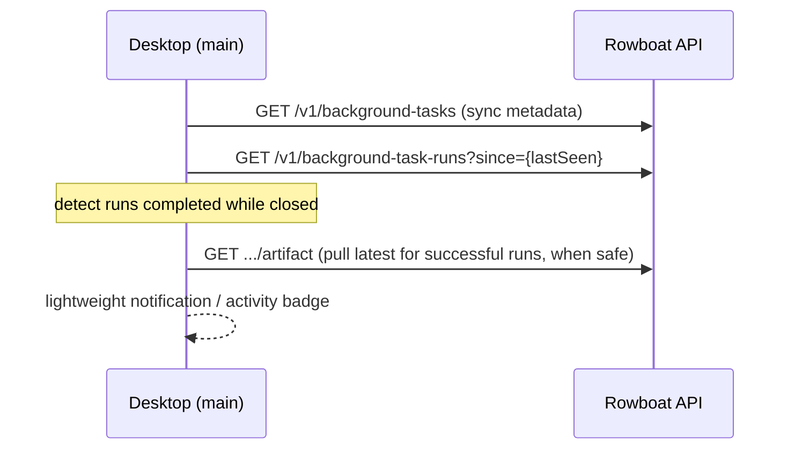

# RFC 006: Desktop as Cloud Workflow Control Plane

| | |
| --- | --- |
| **RFC** | 006 |
| **Status** | Draft |
| **Track** | Cloud-native background workflows |
| **Owners** | `apps/x` (Electron: main + renderer + core) |
| **Created** | 2026-06-05 |
| **Last updated** | 2026-06-05 |
| **Depends on** | [RFC 001](./001-api-owned-scheduler.md) (schedule state to display), [RFC 002](./002-durable-schedule-state.md) (`next due`/`last evaluated`), [RFC 005](./005-temporal-schedule-integration.md) (schedule health), [RFC 003](./003-cloud-event-ingestion.md) (event→run linkage) |
| **Parent docs** | [`docs/CLOUD_NATIVE_BACKGROUND_WORKFLOWS_RFC.md`](../../docs/CLOUD_NATIVE_BACKGROUND_WORKFLOWS_RFC.md) §4.4, §6.3 |

## Summary

As scheduling and execution move into the API ([RFC 001](./001-api-owned-scheduler.md),
[003](./003-cloud-event-ingestion.md), [005](./005-temporal-schedule-integration.md)), the
desktop's job shifts from *running* cloud work to being its **control plane**: making
crystal-clear what is cloud-managed vs local, what will run next, and what happened while
the app was closed. The execution/observability plumbing already exists; the gap is
**clarity around scheduled cloud ownership and offline behavior.**

## Current state (grounded)

The desktop cloud surface is already substantial:

| Capability | Evidence |
| --- | --- |
| IPC channels for cloud control | `apps/x/apps/main/src/ipc.ts:1075-1169`: `bg-task:triggerCloudRun`, `getCloudRunStatus`, `listCloudRuns`, `listCloudRunEvents`, `cancelCloudRun`, `retryCloudRun`, `rerunCloudRun`, `signalCloudRun`, `pullCloudArtifact`, `listAllCloudRuns`, `getArtifactSyncState` |
| Core cloud client | `apps/x/packages/core/src/background-tasks/cloud-sync.ts` — `triggerCloudRun` (`:393`), `listAllCloudRuns` (`:363`), `getCloudRunStatus`, `listCloudRunEvents`, cancel/retry/rerun/signal, `syncArtifactFromCloud` (`:270`), `getArtifactSyncState` (`:289`), `processRemoteTriggers` (`:595`) |
| Renderer | `apps/x/apps/renderer/src/components/bg-tasks-view.tsx` — task list, Setup tab, Runs history (Local/Cloud), `CloudRunTranscriptView`, `GlobalCloudRunsView`, auto artifact pull on terminal success |
| Run polling | Cloud transcript polls status+events every 2s while non-terminal; lists poll every 3s |

What's **missing**: nothing tells the user *"this schedule runs in the cloud and will next
fire at T"*, or surfaces runs that happened while the app was closed, or distinguishes
cloud-managed from desktop-only schedules. There is no `bg-task:getCloudScheduleState`.

## Goals

- Make cloud-managed schedules **visible and legible**: next run, schedule health, trigger
  source.
- Show runs that completed while the desktop was closed (the offline-return experience).
- Keep manual cloud controls (`Run now`, cancel, retry, rerun, pull) easy.
- Never confuse `executionTarget: api` (cloud) with `executionTarget: desktop` (local).

## Non-Goals

- A full admin console (the [RFC 003](./003-cloud-event-ingestion.md) event browser, deep
  Temporal internals).
- Surfacing raw Temporal Schedule internals by default (show a normalized health summary).
- Removing desktop-local task execution.

## UX additions

### 1. Cloud schedule status (per task)

For `executionTarget: api` tasks with triggers, show a compact status block in the Setup
tab and the task list row:

```
┌──────────────────────────────────────────────┐
│  ☁ Cloud scheduled                            │
│  Trigger:  cron  ·  Next run: Today 14:00     │
│  Health:   ● current      Last eval: 13:55    │
└──────────────────────────────────────────────┘
```

- Badge: `Cloud scheduled` (api) vs `Runs when desktop is open` (desktop). This distinction
  is **explicit**, not inferred from a buried field.
- `trigger source`: `cron | window | event` (from `triggers`, already on the task).
- `schedule health`: `current | paused | failed | unknown` (from RFC 005 sync state / RFC
  001 schedule state).
- `next expected run` + `last scheduler evaluation` (from the new IPC below).

For `executionTarget: desktop` tasks: `Runs when desktop is open` — and, when the app is
about to close with a desktop schedule pending, an optional reminder.

### 2. Cloud Runs global view (operational hub)

`GlobalCloudRunsView` (already exists, backed by `bg-task:listAllCloudRuns` →
`GET /v1/background-task-runs`) becomes the operations hub. It already lists cross-task
runs; add/confirm:

- filters: task (`slug`), `status`, `trigger`, time range (`since`/`until`) — the API
  already supports these via `applyRunFilters` (`handler.go:1656-1718`); wire the UI
  controls to those query params.
- open run detail; retry/rerun/cancel where valid; pull artifacts; copy run id + Temporal
  workflow/run ids (already shown in `CloudRunTranscriptView`).
- a `trigger` column so cron/window/event/manual/retry runs are distinguishable at a glance.

### 3. Offline-return experience

On desktop start (main process boot, after auth):



- Persist a `lastSeenCloudRunAt` locally; on boot, `listAllCloudRuns({ since })` finds runs
  that completed while closed.
- Pull latest artifacts for successful runs when safe (the artifact-sync sidecar
  `.artifact-sync.json` + `getArtifactSyncState` already gate this — `cloud-sync.ts:289`).
- Show a small notification/activity indicator ("3 cloud runs completed while you were
  away"), not a modal.

### 4. Task creation clarity

When creating a scheduled task, the execution-target choice gets a one-line consequence
label (concise, not a paragraph):

- `api`: *"Scheduled runs happen in the cloud, even when this app is closed."*
- `desktop`: *"Scheduled runs require this app to be open."*

## New IPC contract

Add one channel (typed in `packages/shared/src/ipc.ts`, handled in
`apps/x/apps/main/src/ipc.ts` alongside the existing `bg-task:*` handlers, backed by a new
`cloud-sync.ts` `getCloudScheduleState`):

```ts
// channel: 'bg-task:getCloudScheduleState'
// request
{ slug: string }

// response
{
  success: boolean;
  state?: {
    target: 'api' | 'desktop';
    triggerSources: Array<'cron' | 'window' | 'event'>;
    health: 'current' | 'paused' | 'failed' | 'unknown';
    nextDueAt: string | null;        // ISO; from Temporal Describe (cron) or schedule-state (window)
    lastEvaluatedAt: string | null;  // RFC 002 schedule-state
    lastTriggeredAt: string | null;
    scheduleSyncState?: 'current' | 'syncing' | 'failed' | 'paused'; // RFC 005, cron only
  };
  error?: string;                    // actionable label on failure
}
```

Backed by a new API read endpoint (added in `internal/backgroundtasks`):

```
GET /v1/background-tasks/{slug}/schedule-state
→ { target, triggerSources, health, nextDueAt, lastEvaluatedAt, lastTriggeredAt, scheduleSyncState }
```

The handler composes: the task's `triggers` (for sources), RFC 002
`BackgroundTaskScheduleState` rows (for `lastEvaluatedAt`/`lastTriggeredAt`/window
`nextDueAt`), and — for cron — RFC 005's `ScheduleClient.Describe`
(`Info.NextActionTimes[0]`) / persisted `schedule_sync_state`.

## Data flow (per task, in the detail view)

1. Desktop loads the task list (`bg-task:list`).
2. For `executionTarget: api` tasks, fetch `bg-task:getCloudScheduleState` +
   `bg-task:listCloudRuns`.
3. Renderer shows schedule chip + artifact-sync chip.
4. Active (non-terminal) runs poll status/events every 2s (existing `CloudRunTranscriptView`).
5. Terminal **success** triggers artifact sync (existing auto-pull).

## Error states (each actionable, with a retry where applicable)

| State | Trigger | Label / action |
| --- | --- | --- |
| API unreachable | `cloudFetch` network error | "Can't reach Rowboat cloud." · Retry |
| Not authenticated | 401 from API | "Sign in to view cloud runs." · Sign in |
| Temporal disabled | API returns `temporal_unavailable` (`handler.go:1122`) | "Cloud execution is off for this environment." (info, no retry) |
| Scheduler disabled | schedule-state endpoint reports loop off | "Cloud scheduling is off." (info) |
| Schedule sync failed | RFC 005 `scheduleSyncState=failed` | "Schedule didn't sync." · Retry sync |
| Artifact pull failed | `syncArtifactFromCloud` error | "Couldn't pull latest output." · Retry pull |

These map cleanly onto the existing API error codes (`temporal_unavailable`,
`temporal_start_failed`, etc., from `errcodes.go` / `httpx.Error`), so the desktop can
switch on the `code` field rather than parse messages.

## Test plan

Renderer (vitest/RTL against the existing `bg-tasks-view.tsx` harness):

- api-target task with triggers renders `Cloud scheduled` + next-run.
- desktop-target task renders `Runs when desktop is open`.
- `getCloudScheduleState` failure renders the actionable error state (per table).
- app restart loads cloud runs completed while closed (mock `listAllCloudRuns({since})`).

Core (`cloud-sync.test.ts` / `cloud-workflows.test.ts` style — these already exist):

- `getCloudScheduleState` maps the API response to the IPC shape; handles each health value.

E2E:

- visible `Run now` creates an API run and run history updates (already covered; extend to
  assert the schedule chip).
- a scheduled cloud run appears in the global view after the desktop was closed (pairs with
  the RFC 001 kind E2E).

## Acceptance criteria

- Users can tell whether a task's schedule is cloud-managed or desktop-managed.
- Users can see the next expected cloud run and schedule health.
- Users can inspect runs created while the desktop was closed.
- Artifact-sync state stays visible and recoverable.
- Existing local desktop task UX is unchanged.

## Alternatives considered

- **Derive schedule state purely client-side from run history** — rejected: can't show
  *next* fire time or *why a cycle didn't fire* without the server's schedule-state/Temporal
  Describe. The dedicated endpoint is needed.
- **One mega IPC returning task + runs + schedule** — rejected: couples three polling
  cadences; the existing per-concern channels (list / status / events / schedule-state) keep
  refresh rates independent (3s lists, 2s transcript, on-demand schedule).
- **Block the app from closing if a desktop schedule is pending** — rejected as hostile; a
  reminder + the `api` upsell is the gentler nudge.

## Decisions

Resolved forks (consolidated in [`README.md`](./README.md#consolidated-decisions)):

- **Offline-return surface → a subtle in-app activity badge + an opt-in OS notification**
  ("3 cloud runs completed while you were away"). No modal; never blocks the UI.
- **Event→run link → shown in the run transcript** ("Triggered by: email from Acme") once the
  [RFC 003](./003-cloud-event-ingestion.md) `cloud_event_id` linkage ships. High value, low
  cost given the link is a single FK traversal.
- **Offline artifact pull → auto-pull the latest *successful* run per task since
  `lastSeenCloudRunAt`**, gated by the existing `.artifact-sync.json` sidecar /
  `getArtifactSyncState`. Bounded (one artifact per task, newest only) so a long absence
  can't trigger a pull storm; older runs pull on demand when opened.
- **Incremental shipping.** The `Cloud scheduled` vs `Runs when desktop is open` labeling +
  offline-return land as soon as RFC 001/002 exist; cron sync-health attaches when RFC 005
  ships; the event-link attaches when RFC 003 ships. The IPC/endpoint shape is stable across
  all three.
