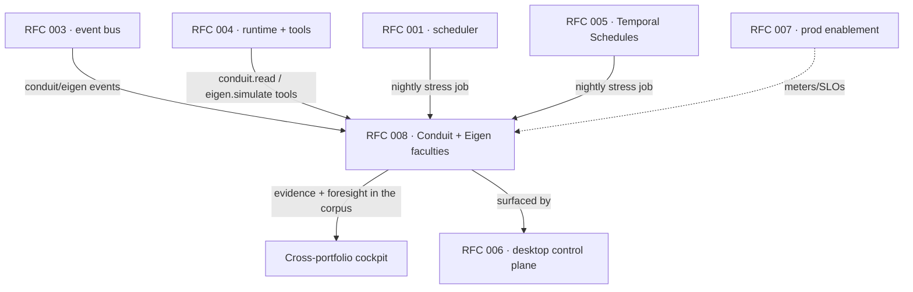
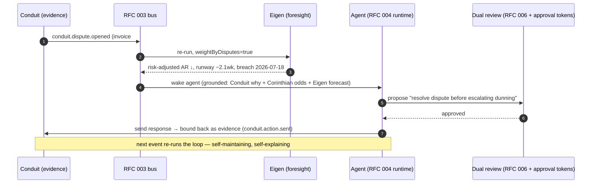

# RFC 008: Conduit & Eigen — the Evidence and Foresight Faculties

|                  |                                                                                                                                                                                                                                                                         |
| ---------------- | ----------------------------------------------------------------------------------------------------------------------------------------------------------------------------------------------------------------------------------------------------------------------- |
| **RFC**          | 008                                                                                                                                                                                                                                                                     |
| **Status**       | Draft                                                                                                                                                                                                                                                                   |
| **Track**        | Cloud-native background workflows · Cross-portfolio cockpit                                                                                                                                                                                                             |
| **Owners**       | `apps/rowboat-api` (Go backend) · `apps/x` (desktop federation) · Conduit team · Eigen team                                                                                                                                                                             |
| **Created**      | 2026-06-05                                                                                                                                                                                                                                                              |
| **Last updated** | 2026-06-06                                                                                                                                                                                                                                                              |
| **Depends on**   | [RFC 003](./003-cloud-event-ingestion.md) (event bus), [RFC 004](./004-cloud-agent-runtime.md) (runtime + tool registry), [RFC 001](./001-api-owned-scheduler.md)/[005](./005-temporal-schedule-integration.md) (scheduling), the cockpit's Read/Mirror/Watch/Act seams |
| **Extends**      | RFC 003 `CloudEvent.source` enum · RFC 004 tool allowlist + error codes                                                                                                                                                                                                 |
| **Parent docs**  | [`docs/architecture-cross-portfolio-cockpit.md`](../../docs/architecture-cross-portfolio-cockpit.md), [`docs/one-pager-product.md`](../../docs/one-pager-product.md) "The platform it becomes"                                                                          |

## RFC map



## Summary

[The execution-plane RFCs (001–007)](./README.md) make the platform an autonomous, durable
agent runtime. The cross-portfolio cockpit (`docs/architecture-cross-portfolio-cockpit.md`)
federates the financial systems-of-record into one corpus. This RFC adds the **two
faculties that turn that federated graph from a report into a brain**:

- **Conduit — evidence.** The system of record binding invoice emails, replies, disputes,
  and follow-ups to the financial record they explain. It plugs in as a **full four-seam
  plane** (Read · Mirror · Watch · Act-audit) and becomes the live _grounding context_,
  _trigger source_, and _audit sink_ for autonomous response.
- **Eigen — foresight.** A forward-simulation engine (runway, liquidity, covenant, AR/AP
  sensitivity). It plugs in as a **runtime tool** (call it mid-run) _and_ a
  **scheduled/event-triggered job** (continuous stress-testing over the federated graph).

Together they close the loop **Conduit → Eigen → Agent → Conduit**: a dispute sharpens the
forecast, the forecast informs the action, the action becomes new evidence.

## Background & current state (grounded)

| Fact                                                                       | Evidence                                                                                                                                  |
| -------------------------------------------------------------------------- | ----------------------------------------------------------------------------------------------------------------------------------------- |
| The cockpit's four integration seams (Read/Mirror/Watch/Act)               | `docs/architecture-cross-portfolio-cockpit.md:60-75`                                                                                      |
| Desktop is an MCP client; servers mounted via `~/.rowboat/config/mcp.json` | `apps/x/packages/core/src/mcp/repo.ts:10`; tools called as `mcp:server:tool` (`application/lib/exec-tool.ts:19`)                          |
| Vault mirror pattern (factory + loop + `createEvent`)                      | `apps/x/packages/core/src/knowledge/sync_gmail.ts`; cockpit `sync_canvas.ts` skeleton (`architecture-cross-portfolio-cockpit.md:162-189`) |
| Event envelope shape `{source, type, payload, target}`                     | `apps/x/packages/shared/src/events.ts:25-65` (`RowboatEventSchema`)                                                                       |
| Event consumers do Pass-1 candidacy → Pass-2 agent                         | `apps/x/packages/core/src/knowledge/live-note/event-consumer.ts`; cloud equivalent in RFC 003                                             |
| Cloud event ingestion + routing + `trigger=event` runs                     | [RFC 003](./003-cloud-event-ingestion.md) (`CloudEvent`, `/v1/events`, `rowboat.cloud_events.route.v1`)                                   |
| Cloud runtime + scoped `ToolRegistry`/`ToolScope`                          | [RFC 004](./004-cloud-agent-runtime.md)                                                                                                   |
| Dual-review Act seam (approval tokens + policy)                            | cockpit `:73-74` → Corinthian `corinthian-mcp/src/lib/approvals.ts`, `policy.ts`, `tool-packs.ts`                                         |

The cockpit thesis (`:11`): _"no single product can produce this, because each is blind to
the others."_ Conduit and Eigen extend it from _see the whole picture_ to **explain it,
simulate it, and act on it.**

## Goals

- Make **Conduit** a first-class plane: its correspondence is queryable (Read), owned in the
  vault (Mirror), wakes agents (Watch), and records autonomous actions back (Act-audit).
- Make **Eigen** continuous: a runtime tool for point-of-decision simulation **and** a
  scheduled/event-triggered job that keeps a live whole-business stress test in the corpus.
- Reuse the existing seams + RFC 003/004 substrate — Conduit/Eigen are **new nodes on the
  fabric**, not new infrastructure.
- Preserve sovereignty: reads are scoped/audited; actions go through the dual-review gate;
  evidence is tamper-evident.

## Non-Goals

- Building Conduit's or Eigen's _internal_ systems (owned by their teams); this RFC defines
  only how they **plug into** Rowboat's planes.
- Moving money. Eigen simulates; the Act seam (under approval tokens) is where money-moving
  lands, unchanged from the cockpit's Phase 3.
- A generic analytics engine — Eigen is financial simulation; other compute faculties would
  be separate plug-ins following the same pattern.

---

## Part A — Conduit (the evidence plane)

Conduit is a system of record that binds correspondence (invoice emails, replies, disputes,
follow-ups) to the financial record it explains. It lights up all four seams.

### A.1 Read — mount Conduit as an MCP server

Conduit exposes an HTTP MCP server; the desktop adds it to `mcp.json` exactly like Canvas
(`architecture-cross-portfolio-cockpit.md:141-160`):

```jsonc
"conduit": {
  "type": "http",
  "url": "https://api.conduit.<domain>/mcp",
  "headers": { "Authorization": "Bearer ${CONDUIT_API_KEY}" }
}
```

The agent immediately gains tools like `mcp:conduit:thread_for_invoice`,
`mcp:conduit:disputes_open`, `mcp:conduit:followups_due`. Cloud runs reach the same data via
the runtime tool below. The token is brokered by the connector OAuth path
([RFC 003/CONNECTOR_SUITE](../../docs/CONNECTOR_SUITE.md)), not hand-edited, once Conduit
joins the connector registry (`GET /v1/connectors`).

### A.2 Mirror — sync correspondence into the vault

`apps/x/packages/core/src/knowledge/sync_conduit.ts`, following the proven
`sync_gmail.ts`/`sync_canvas.ts` shape — **read over the same MCP mount the agent uses**:

```ts
// Mirror the durable identity (the thread bound to an invoice/customer); query the
// volatile state (today's dispute status) on demand. Merge-preserve frontmatter so a
// synced note can also be a live: note (fileops.ts patch semantics).
async function syncConduitThreads() {
  const threads = await executeTool("conduit", "threads_recent", {});
  for (const t of threads) {
    upsertNote(`knowledge/Invoices/${t.invoiceRef}.md`, renderThreadNote(t)); // backlinked
    await createEvent({
      source: "conduit",
      type: "conduit.correspondence.synced",
      payload: digest(t),
    });
  }
}
```

Each invoice note now carries its paper trail; the number stops being a bare figure. Register
in `apps/x/apps/main/src/main.ts` beside the existing `init()` syncs.

### A.3 Watch — Conduit events become cloud triggers

This is the autonomous half, and it routes through **RFC 003** rather than the desktop
consumer so it fires with the desktop closed.

**Extend RFC 003's `CloudEvent.source` enum** (`ent/schema/cloud_event.go`) to add the
portfolio + faculty sources:

```
source ∈ { gmail, google_calendar, slack, webhook, internal,   // RFC 003 base
           canvas, cadence, corinthian, conduit, eigen }        // RFC 008 additions
```

Conduit posts to `POST /v1/webhooks/conduit` (signature-verified, like the provider webhooks)
or `POST /v1/events` (server-to-server with `INTERNAL_API_SECRET`). Canonical event types:

| `event_type`             | Meaning                            | `dedupe_key`                    |
| ------------------------ | ---------------------------------- | ------------------------------- |
| `conduit.dispute.opened` | A dispute was raised on an invoice | `conduit:dispute:{disputeId}`   |
| `conduit.reply.received` | A counterparty replied on a thread | `conduit:msg:{messageId}`       |
| `conduit.followup.due`   | A scheduled follow-up came due     | `conduit:followup:{followupId}` |

The RFC 003 router resolves which task/agent owns the customer/invoice and starts a
`trigger=event` run. The run's `requested_context` is the **concise correspondence summary**
(per RFC 003's "context, not raw payload" rule); the full thread stays on the `CloudEvent`
(sealed `payload_ciphertext`) and is fetched via the runtime tool.

### A.4 Act + the audit loop

When an agent sends a follow-up, it goes through the **dual-review Act seam** (cockpit `:73`):
Rowboat's "reviewable before it lands" + Corinthian's server-side approval tokens for
money-touching actions. The outbound message is then **bound back into Conduit** as new
correspondence on the same invoice, closing the evidence chain:

- The agent's send-action emits `conduit.action.sent` (source `conduit`), which Conduit
  ingests and binds to the invoice.
- The run that produced it is already linked to the originating `CloudEvent`
  (RFC 003 `cloud_event_id`), and its `temporal.*` event stream is immutable
  (`background_task_run_event`, append-only). So **every autonomous action has end-to-end
  provenance**: originating evidence → run → action → bound-back evidence.

### A.5 Conduit runtime tool (RFC 004 registry)

Add to the RFC 004 deny-by-default allowlist a **read-only** tool:

```go
// Tool name: "conduit.read" — read the correspondence/dispute thread bound to an
// invoice or customer. Scoped to ToolScope.UserID + the connector capability.
// Returns a structured thread summary, never raw secrets. Write-back is NOT a tool —
// it happens via the Act seam under approval tokens (A.4).
{ "name": "conduit.read",
  "input":  { "invoiceRef|customerRef": "string", "limit": "int" },
  "output": { "thread": [ {ts, direction, kind: "reply|dispute|followup", gist} ],
              "openDisputes": int, "disputedAmount": number } }
```

`conduit_unavailable` joins the RFC 004 error taxonomy (the user hasn't connected Conduit, or
it's down) so a missing thread fails loud, not as a silent empty result.

---

## Part B — Eigen (the foresight plane)

Eigen is a _compute_ faculty: it consumes the federated graph and returns forward
simulations. It plugs in two ways.

### B.1 Eigen as a runtime tool — foresight at the point of decision

Add to the RFC 004 allowlist a **read-only** simulation tool:

```go
// Tool name: "eigen.simulate" — run a forward financial simulation over the caller's
// federated graph (AR=Canvas, AP=Cadence, behavior=Corinthian, disputes=Conduit).
// Read-only; deterministic given the same inputs + snapshot. Scoped to the tenant.
{ "name": "eigen.simulate",
  "input":  { "horizonDays": "int",
              "shocks": [ { "entity": "string", "deltaDays|deltaAmount": "number" } ],
              "weightByDisputes": "bool" },     // pull Conduit dispute haircuts
  "output": { "runwayWeeks": "number",
              "liquidityFloorBreachDate": "string|null",
              "riskAdjustedAR": "number",
              "drivers": [ { "factor": "string", "impact": "number" } ],
              "confidence": "number" } }
```

An agent about to escalate dunning calls it mid-run: _"if Acme's $48k slips 30d and we owe
their subcontractor $12k Friday, what's the runway hit — and does pushing harder risk the
renewal?"_ — quantified, before it acts. `eigen_unavailable` / `eigen_invalid_scenario` join
the RFC 004 taxonomy.

### B.2 Eigen as a scheduled + event-triggered job — foresight made continuous

**Scheduled full stress run.** A Temporal-scheduled workflow `rowboat.eigen.stress.v1`
(via [RFC 005](./005-temporal-schedule-integration.md) Temporal Schedules, or the
[RFC 001](./001-api-owned-scheduler.md) loop) runs nightly/weekly over the whole federated
graph, writes the result into the corpus (a `Cash position` live note), and — on a threshold
breach — emits an `eigen.breach` event:

```
eigen.breach   { runwayWeeks, breachDate, floorWeeks, topDrivers[] }   // source: eigen
```

**Event-triggered incremental re-run.** A material financial event (a new overdue invoice
from Canvas, a vendor payment due from Cadence, a `conduit.dispute.opened`) triggers a
_targeted_ `eigen.simulate` re-run via the RFC 003 router. If it breaches, the `eigen.breach`
event routes to wake an agent (or alert per RFC 007). Eigen stops being a calculator you
remember to run and becomes an **always-on risk sensor**.

```mermaid
sequenceDiagram
    autonumber
    participant SoR as Canvas/Cadence/Conduit
    participant EV as RFC 003 event bus
    participant EG as Eigen (eigen.simulate)
    participant AG as Cloud runtime (RFC 004)
    participant C as Corpus / Conduit
    SoR->>EV: financial event (overdue / vendor-due / dispute)
    EV->>EG: targeted re-run over federated graph
    EG-->>EV: result; if breach → emit eigen.breach
    EV->>AG: route eigen.breach → wake agent
    AG->>EG: eigen.simulate (scenario: act vs hold)
    AG->>C: write foresight to corpus; queue action (dual review)
```

### B.3 Why Eigen needs the federation (and the execution plane)

No single system-of-record can stress-test the business — each is blind to the others
(`cockpit:11`). The cockpit already federates AR + AP + behavior + disputes into one place,
so Eigen is the **first engine that simulates the whole business off live data**. And the
execution plane is what makes it _continuous_ rather than a manual quarterly spreadsheet.

---

## Part C — The combined loop



Disputes (Conduit) are a probabilistic haircut on AR; payment behavior (Corinthian) is the
collection probability; Eigen produces the **risk-adjusted, dispute-weighted cash forecast**
impossible without both. This is the value chain no single product can assemble.

## Cross-RFC changes this introduces

| RFC                                                                                   | Change                                                                                                                                                   |
| ------------------------------------------------------------------------------------- | -------------------------------------------------------------------------------------------------------------------------------------------------------- |
| [RFC 003](./003-cloud-event-ingestion.md)                                             | `CloudEvent.source` enum gains `canvas, cadence, corinthian, conduit, eigen`; new event types (`conduit.*`, `eigen.breach`); `POST /v1/webhooks/conduit` |
| [RFC 004](./004-cloud-agent-runtime.md)                                               | tool allowlist gains `conduit.read`, `eigen.simulate` (read-only); error codes `conduit_unavailable`, `eigen_unavailable`, `eigen_invalid_scenario`      |
| [RFC 001](./001-api-owned-scheduler.md)/[005](./005-temporal-schedule-integration.md) | register `rowboat.eigen.stress.v1` scheduled workflow                                                                                                    |
| [RFC 006](./006-desktop-cloud-control-plane.md)                                       | surface "Triggered by: dispute on #4821" (event→run link) and the `Cash position` foresight note                                                         |
| [README](./README.md)                                                                 | index row, dependency-graph node, Phase 6, conventions (new sources/tools/metrics)                                                                       |

## Observability

`internal/cloudevents` + a new `internal/faculties` metrics leaf (cardinality rule holds —
label only by bounded dimensions):

| Series                                      | Type      | Labels                                  |
| ------------------------------------------- | --------- | --------------------------------------- |
| `cloud_event_triggered_runs_total` (exists) | counter   | `source` (now incl. `conduit`/`eigen`)  |
| `faculty_eigen_simulations_total`           | counter   | `mode` (`tool`/`scheduled`/`triggered`) |
| `faculty_eigen_breaches_total`              | counter   | —                                       |
| `faculty_eigen_simulation_seconds`          | histogram | `mode`                                  |
| `faculty_conduit_actions_bound_total`       | counter   | — (audit write-backs)                   |

Logs: `runId`, `taskSlug`, `userId`, `faculty` (`conduit`/`eigen`), `invoiceRef`,
`breach`, `durationMs`. (No tenant-identifying labels on metrics.)

## Security

- **Reads are read-only and scoped.** `conduit.read` / `eigen.simulate` resolve credentials
  from `ToolScope` (RFC 004), never from model text; both are deny-by-default registry
  entries.
- **Actions are double-gated.** No autonomous send/move happens without Rowboat's review UI
  **and** Corinthian's approval tokens for money-touching actions (cockpit `:73-74`). Eigen
  is simulation-only — it can never move money.
- **Evidence integrity.** Conduit-bound actions + the append-only `temporal.*` run-event
  stream + the RFC 003 `cloud_event_id` link form a tamper-evident chain — the regulatory
  moat for the sovereignty buyer.
- **Tenant isolation.** Conduit/Eigen calls run under `auth.WithInternal` scoped to the
  event-owner; the ORM interceptors keep all reads per-tenant. Eigen must pin the right
  tenant's federated snapshot and never blend tenants (cockpit open question `:136`).

## Configuration

| Env                           | Default     | Meaning                                    |
| ----------------------------- | ----------- | ------------------------------------------ |
| `FACULTY_CONDUIT_ENABLED`     | `false`     | mount Conduit events + `conduit.read` tool |
| `FACULTY_EIGEN_ENABLED`       | `false`     | enable `eigen.simulate` tool + stress job  |
| `EIGEN_BASE_URL`              | —           | Eigen service endpoint (server-held)       |
| `CONDUIT_BASE_URL`            | —           | Conduit MCP/API endpoint                   |
| `EIGEN_STRESS_SCHEDULE`       | `0 6 * * *` | nightly full stress cron                   |
| `EIGEN_LIQUIDITY_FLOOR_WEEKS` | `8`         | breach threshold for `eigen.breach`        |

## Code-level implementation playbook

Conduit and Eigen should enter the system as ordinary connectors, event sources, and
runtime tools. The value is in reuse: the existing connector registry, RFC 003 event bus,
RFC 004 tool registry, and RFC 006 desktop surfaces do the heavy lifting.

### 1. Connector registry entries

`internal/connectors/registry.go` currently ships Canvas, Corinthian, and Wispr defaults.
Add Conduit and Eigen entries when their teams publish endpoints:

```go
{
	Name:        "conduit",
	DisplayName: "Conduit",
	Description: "Invoice correspondence, disputes, replies, follow-ups",
	MCPURL:      "https://api.conduit.solomon-ai.co/mcp",
	AuthType:    "oauth",
	Audience:    "conduit-api",
	Scopes:      []string{"threads:read", "disputes:read", "actions:write"},
},
{
	Name:        "eigen",
	DisplayName: "Eigen",
	Description: "Forward financial simulations and liquidity stress tests",
	MCPURL:      "https://api.eigen.solomon-ai.co/mcp",
	AuthType:    "oauth",
	Audience:    "eigen-api",
	Scopes:      []string{"simulations:read", "snapshots:read"},
},
```

For v1 runtime tools, Conduit write scopes should not be advertised to the model. They are
needed only by the Act seam after review. The runtime allowlist exposes `conduit.read`
only.

### 2. Desktop Conduit mirror

Add `apps/x/packages/core/src/knowledge/sync_conduit.ts` following the Gmail/Calendar sync
loop shape, but reading through the MCP mount so auth is shared with the agent:

```ts
type ConduitThread = {
  invoiceRef: string;
  customerRef?: string;
  threadId: string;
  subject: string;
  status: "open" | "closed" | "disputed" | "followup_due";
  lastMessageAt: string;
  gist: string;
  openDisputes: number;
  disputedAmount?: number;
};
```

File layout:

```text
knowledge/Invoices/<invoiceRef>.md
knowledge/Customers/<customerRef>.md
```

Render durable identity and backlinks:

```markdown
---
source: conduit
invoiceRef: INV-4821
conduitThreadId: th_123
lastSyncedAt: 2026-06-06T14:00:00Z
---

# Invoice INV-4821

[[Customers/Acme Corp]]

## Correspondence

- 2026-06-06 - Dispute opened: pricing mismatch on line 3.
- 2026-06-07 - Reply received: customer requests corrected PO.

## Current status

Open dispute, $18,000 affected.
```

The sync must merge-preserve frontmatter so a mirrored invoice note can also carry a
`live:`/background-task block. Do not overwrite user notes or task configuration.

Register `sync_conduit.init()` in `apps/x/apps/main/src/main.ts` beside other knowledge
sync initializers once the connector is mounted.

### 3. Conduit event ingestion

Extend RFC 003 source constants with `conduit`. Handler routes:

```go
r.Post("/v1/webhooks/conduit", cloudEventsH.ConduitWebhook)
r.With(auth.RequireInternalSecret(cfg.InternalAPISecret)).
	Post("/v1/internal/events/conduit", cloudEventsH.ConduitInternal)
```

Signature verification options, in priority order:

1. Product-signed HMAC using a Conduit-specific shared secret:
   `X-Conduit-Signature: v1=<hex(hmac_sha256(secret, timestamp+"."+body))>`
2. Internal server-to-server secret for first-party calls.

Normalized envelope examples:

```json
{
  "source": "conduit",
  "eventType": "conduit.dispute.opened",
  "subject": "Dispute opened on INV-4821",
  "text": "Acme disputed $18,000 on INV-4821: pricing mismatch on line 3.",
  "dedupeKey": "conduit:dispute:disp_123",
  "payload": {
    "invoiceRef": "INV-4821",
    "customerRef": "acme",
    "threadId": "th_123",
    "disputeId": "disp_123",
    "amount": 18000,
    "currency": "USD"
  }
}
```

The full payload is sealed via RFC 003; only subject/text enter route prompts by default.

### 4. `conduit.read` runtime tool

Implement under `internal/backgroundtaskruntime/tools_conduit.go`:

```go
type ConduitReadArgs struct {
	InvoiceRef  string `json:"invoiceRef,omitempty"`
	CustomerRef string `json:"customerRef,omitempty"`
	Limit       int    `json:"limit,omitempty"`
}
type ConduitReadResult struct {
	Thread []struct {
		Timestamp string `json:"ts"`
		Direction string `json:"direction"`
		Kind string `json:"kind"`
		Gist string `json:"gist"`
	} `json:"thread"`
	OpenDisputes int `json:"openDisputes"`
	DisputedAmount float64 `json:"disputedAmount,omitempty"`
	Currency string `json:"currency,omitempty"`
}
```

Scope checks:

- `FACULTY_CONDUIT_ENABLED=true`
- user has Conduit connection with `threads:read`/`disputes:read`
- one of `invoiceRef` or `customerRef` is present
- `limit` clamped to a small max, for example 20 messages

Tool errors map:

- missing connection -> `conduit_unavailable`
- Conduit 404 -> successful empty result with `openDisputes=0` only if the invoice is
  known absent; otherwise `tool_invoke_failed`
- timeout -> `tool_invoke_failed`

### 5. Eigen service client and `eigen.simulate`

Implement a small client under `internal/faculties/eigen`:

```go
type Client interface {
	Simulate(ctx context.Context, tenant TenantScope, req SimRequest) (SimResult, error)
}
```

Request:

```go
type SimRequest struct {
	HorizonDays int `json:"horizonDays"`
	Shocks []Shock `json:"shocks,omitempty"`
	WeightByDisputes bool `json:"weightByDisputes"`
	SnapshotID string `json:"snapshotId,omitempty"`
}
```

Validation:

- `horizonDays` between 1 and 730
- shock count <= 50
- amounts finite, not NaN/Inf
- no tenant/workspace ids supplied by the model; derive them from `ToolScope`
- `weightByDisputes` allowed only when Conduit is connected or the snapshot already
  contains dispute data

Result:

```go
type SimResult struct {
	RunwayWeeks float64 `json:"runwayWeeks"`
	LiquidityFloorBreachDate *string `json:"liquidityFloorBreachDate,omitempty"`
	RiskAdjustedAR float64 `json:"riskAdjustedAR"`
	Drivers []Driver `json:"drivers"`
	Confidence float64 `json:"confidence"`
	SnapshotID string `json:"snapshotId"`
}
```

Errors:

- service unavailable / missing connection -> `eigen_unavailable`
- invalid scenario -> `eigen_invalid_scenario`
- timeout/upstream 5xx -> `tool_invoke_failed`

### 6. Eigen scheduled stress workflow

Use the same infrastructure as RFC 005 but a faculty-specific workflow:

```go
const EigenStressWorkflowName = "rowboat.eigen.stress.v1"
const ActivityRunEigenStress = "rowboat.eigen.run_stress.v1"
```

Schedule id:

```
faculty/eigen/stress/{userID}
```

The activity:

1. Loads the user's enabled connectors and federated snapshot handles.
2. Calls Eigen with `horizonDays` default (for example 90) and
   `weightByDisputes=true` if Conduit is enabled.
3. Writes/updates the local/cloud corpus artifact, for example a background task artifact
   or mirrored note named `Cash position`.
4. If `runwayWeeks < EIGEN_LIQUIDITY_FLOOR_WEEKS`, posts an RFC 003 event with
   `source=eigen`, `event_type=eigen.breach`, dedupe key
   `eigen:breach:{userID}:{snapshotID}:{date}`.

The stress workflow should not create a `BackgroundTaskRun` unless product wants it shown
in the normal task run history. For user-legible output, a dedicated background task
(`Cash position stress monitor`) can own the artifact and runs through the same
`Starter.Start` path.

### 7. Combined Conduit -> Eigen -> agent flow

Concrete sequence for the first end-to-end demo:

1. Conduit sends `conduit.dispute.opened` for `INV-4821`.
2. RFC 003 stores `CloudEvent(source=conduit, dedupe_key=conduit:dispute:disp_123)`.
3. Router finds task `acme-risk-watch` with `eventMatchCriteria` mentioning disputes or
   Acme invoices.
4. Router starts `trigger=event` run with requested context:
   `Conduit dispute opened on INV-4821; $18,000 disputed; reason: pricing mismatch.`
5. Runtime reads linked event via `event.read`.
6. Runtime calls `conduit.read(invoiceRef=INV-4821)`.
7. Runtime calls `eigen.simulate(horizonDays=90, shocks=[...], weightByDisputes=true)`.
8. Runtime writes artifact with evidence + forecast + recommended action.
9. If the action is outbound communication, it enters the review UI; after approval, the
   Act seam sends through Conduit/Corinthian and Conduit emits `conduit.action.sent`.
10. The transcript shows originating event, tool calls, Eigen drivers, and bound-back
    evidence id.

### 8. Desktop surfacing

Add only small surfaces in RFC 006 UI:

- Run transcript line: `Triggered by: Conduit dispute - INV-4821`
- Artifact section/link: `Cash position` note from Eigen stress
- Schedule/control chip for the Eigen stress monitor if modeled as a background task

Do not build a Conduit/Eigen admin console in Rowboat Desktop. Deep inspection remains in
the source product; Rowboat shows the evidence/foresight relevant to the run.

### 9. Metrics and audit details

Use bounded labels only:

```go
faculty_eigen_simulations_total{mode="tool"}
faculty_eigen_simulations_total{mode="scheduled"}
faculty_eigen_simulations_total{mode="triggered"}
faculty_tool_failures_total{faculty="eigen", code="eigen_invalid_scenario"}
faculty_conduit_actions_bound_total
```

Audit events in run transcript:

- `faculty.conduit.read`
- `faculty.eigen.simulate`
- `faculty.eigen.breach_detected`
- `faculty.conduit.action_bound`

Do not put invoice/customer names in metric labels. Put `invoiceRef`, `customerRef`,
`snapshotId`, and `breachDate` in logs/events where authz applies.

### 10. Feature flags and rollout dependencies

Flag matrix:

| Feature                 | Required flags                                                                               |
| ----------------------- | -------------------------------------------------------------------------------------------- |
| Conduit mirror only     | `FACULTY_CONDUIT_ENABLED=true` on desktop/core                                               |
| Conduit event ingestion | `FACULTY_CONDUIT_ENABLED=true`, `CLOUD_EVENTS_ROUTING_ENABLED=true`                          |
| `conduit.read` tool     | `FACULTY_CONDUIT_ENABLED=true`, `CLOUD_RUNTIME_ENABLED=true`                                 |
| `eigen.simulate` tool   | `FACULTY_EIGEN_ENABLED=true`, `CLOUD_RUNTIME_ENABLED=true`                                   |
| Eigen stress schedule   | `FACULTY_EIGEN_ENABLED=true`, `TEMPORAL_SCHEDULES_ENABLED=true` or RFC 001 scheduler enabled |
| Full loop               | all above plus production worker enabled and review/Act seam available                       |

## Faculty contract details and demo data

### Conduit event catalog

Start with a small event vocabulary and refuse unrecognized high-impact write events until
the Act seam is ready:

| Event type                 | Required payload fields                                      | Routes to                                                           |
| -------------------------- | ------------------------------------------------------------ | ------------------------------------------------------------------- |
| `conduit.dispute.opened`   | `disputeId`, `invoiceRef`, `customerRef`, `amount`, `reason` | Risk/dispute/watch tasks; Eigen targeted re-run.                    |
| `conduit.dispute.resolved` | `disputeId`, `invoiceRef`, `resolution`, `amountReleased`    | Cash forecast refresh; customer note update.                        |
| `conduit.reply.received`   | `messageId`, `threadId`, `invoiceRef`, `from`, `gist`        | Follow-up agent or customer-status task.                            |
| `conduit.followup.due`     | `followupId`, `threadId`, `invoiceRef`, `dueAt`              | Action-review task.                                                 |
| `conduit.action.sent`      | `actionId`, `threadId`, `runId`, `approvedBy`                | Audit only; should not recursively trigger action tasks by default. |

Default dedupe keys:

```text
conduit:dispute:{disputeId}:opened
conduit:dispute:{disputeId}:resolved
conduit:msg:{messageId}
conduit:followup:{followupId}
conduit:action:{actionId}
```

### Eigen breach event catalog

```json
{
  "source": "eigen",
  "eventType": "eigen.breach",
  "subject": "Liquidity floor breach projected",
  "text": "Runway is projected at 6.4 weeks, below the 8 week floor. Top drivers: Acme dispute, vendor batch due Friday.",
  "dedupeKey": "eigen:breach:user_123:snapshot_456:2026-06-06",
  "payload": {
    "snapshotId": "snapshot_456",
    "runwayWeeks": 6.4,
    "floorWeeks": 8,
    "breachDate": "2026-07-18",
    "drivers": [
      { "factor": "Acme INV-4821 dispute", "impactWeeks": -1.4 },
      { "factor": "Vendor batch due Friday", "impactWeeks": -0.7 }
    ]
  }
}
```

`eigen.breach` should route to alert/recommendation tasks, not directly to money-moving
tools. Eigen never acts; it wakes the agent with forecast context.

### Demo tenant seed data

For the first E2E demo, seed a deterministic scenario:

| Plane      | Seed                                                                 |
| ---------- | -------------------------------------------------------------------- |
| Canvas     | Acme owes `$48,000`; invoice `INV-4821` is `$18,000`; aging 54 days. |
| Cadence    | Vendor batch `$12,000` due Friday.                                   |
| Corinthian | Two broken promises-to-pay; empathetic follow-up historically works. |
| Conduit    | Dispute opened for `INV-4821`, reason pricing mismatch.              |
| Eigen      | Baseline runway 8.5 weeks; dispute-weighted runway 6.4 weeks.        |

Expected artifact:

- Evidence section cites Conduit dispute and thread gist.
- Forecast section includes runway delta and top drivers.
- Action section recommends resolving dispute before escalating dunning.
- Audit section links `cloudEventId`, `runId`, Eigen `snapshotId`, and Conduit `threadId`.

### Tool output redaction rules

Conduit/Eigen tools should redact before model exposure:

- No OAuth tokens, API keys, account ids, or internal tenant ids.
- Email addresses may be included only when needed for action context; otherwise show names
  or domains.
- Currency amounts are allowed because they are the point of the task.
- Full message bodies are summarized to gists unless the user explicitly created a task
  that requires body-level review.
- Eigen scenario IDs/snapshot IDs are allowed in run events, not metric labels.

### Review gate payload for actions

When the agent proposes an outbound Conduit action, the review item should contain:

```json
{
  "kind": "conduit.followup.send",
  "runId": "event-...",
  "cloudEventId": "...",
  "invoiceRef": "INV-4821",
  "threadId": "th_123",
  "recipient": "ap@acme.com",
  "draft": "Thanks for flagging the pricing mismatch...",
  "evidence": [
    { "type": "conduit.thread", "id": "th_123" },
    { "type": "eigen.snapshot", "id": "snapshot_456" }
  ],
  "requiresApproval": true
}
```

Only after approval should a write happen, and the write result should be bound back as
`conduit.action.sent`.

### Faculty readiness checklist

Before enabling the full loop:

- Conduit connector can read threads with tenant scoping.
- Conduit webhook signatures are verified and replay-safe.
- `conduit.read` absent when flag disabled and denied when connection missing.
- Eigen client rejects invalid scenarios deterministically.
- `eigen.simulate` absent when flag disabled and read-only when enabled.
- Eigen scheduled job cannot move money or send messages.
- Runtime transcript shows both evidence and forecast tool calls.
- Review gate blocks outbound action in automated tests.
- Metrics have only bounded labels.

## Implementation order (slots into [`README.md`](./README.md))

Conduit's **Read + Mirror** are independent and can land early (desktop sync, like Canvas).
The autonomous loop needs the execution plane, so the rest slots **after RFC 003 + 004**:

1. **8.1 Conduit Read/Mirror** — connector registry entry + `sync_conduit.ts` + vault notes. _(parallel with Phase 1)_
2. **8.2 Conduit Watch** — extend RFC 003 source enum + `POST /v1/webhooks/conduit` + routing. _(after RFC 003 / Phase 4)_
3. **8.3 Eigen tool** — `eigen.simulate` in the RFC 004 registry. _(after RFC 004 / Phase 2)_
4. **8.4 Eigen jobs** — `rowboat.eigen.stress.v1` scheduled + event-triggered re-runs + `eigen.breach`. _(after RFC 001/005)_
5. **8.5 Combined loop + Act-audit** — dual-review send → Conduit bind-back; RFC 006 surfacing. _(after Phase 5 GA)_

→ This becomes **Phase 6 — Faculties** in the README implementation order.

## Test plan

- Unit: Conduit event normalization + dedupe (`conduit:dispute:{id}` → one row); `conduit.read`
  scope enforcement; `eigen.simulate` input validation (`eigen_invalid_scenario`).
- Unit: Eigen breach threshold emits `eigen.breach` at/over `EIGEN_LIQUIDITY_FLOOR_WEEKS`.
- Unit: deny-by-default — `eigen.simulate`/`conduit.read` absent when faculty disabled.
- Integration: `conduit.dispute.opened` → RFC 003 route → `eigen.simulate(weightByDisputes)`
  re-run → `trigger=event` run linked to the event; risk-adjusted AR reflects the dispute.
- Integration: agent send → dual-review gate → `conduit.action.sent` bound back; provenance
  chain (event→run→action) queryable.
- E2E (kind, desktop closed): post a Conduit dispute event → foresight re-runs → agent wakes →
  proposes action → review → bound-back evidence appears.

## Acceptance criteria

- Conduit correspondence is queryable (Read), owned in the vault (Mirror), wakes cloud agents
  with the desktop closed (Watch), and records autonomous actions back (Act-audit).
- Eigen runs both at the point of decision (tool) and continuously (scheduled + triggered),
  over the live federated graph, writing foresight into the corpus.
- A dispute measurably sharpens the forecast (dispute-weighted AR), and the forecast informs
  a reviewed action — the full loop, with end-to-end provenance.
- Reads are scoped/audited; money-touching actions stay behind the dual-review gate; Eigen
  never moves money.

## Decisions

Resolved forks (consolidated in [`README.md`](./README.md#consolidated-decisions)):

- **Conduit ingestion → through RFC 003**, not the desktop consumer, so it fires with the
  desktop closed; `source=conduit`, payload encrypted, context-not-raw on the run.
- **Eigen plugs in two ways, not one → tool _and_ job.** The tool gives point-of-decision
  foresight; the scheduled/triggered job gives continuous coverage. Neither alone delivers
  "always-on risk sensor + scenario-aware action."
- **Both faculties are read-only at the tool layer.** All write/act flows through the
  existing dual-review Act seam (approval tokens) — faculties never move money.
- **Mirror durable identity, query volatile numbers** (cockpit `:135`): mirror the
  invoice/thread note (joinable, owned); fetch today's dispute amount / today's runway on
  demand. Keeps the vault fresh-enough without a sync storm.
- **Breach threshold is config, not per-task** (`EIGEN_LIQUIDITY_FLOOR_WEEKS`) in v1 — one
  business-level floor; per-entity thresholds are a later additive change.

### Deferred (needs the faculty teams; not blocking)

- Conduit's MCP tool catalog + Eigen's scenario DSL are owned by those teams; this RFC fixes
  only the plug-in contracts.
- Cross-tenant snapshot isolation for Eigen (cockpit open question `:136`) — confirm the
  federated-snapshot boundary with each SoR's RLS model before GA.

## Alternatives considered

- **Conduit as desktop-only (like the original Watch seam)** — rejected: it would only fire
  with the app open, defeating the autonomous loop. Routing through RFC 003 is the offline win.
- **Eigen as a scheduled job only (no tool)** — rejected: loses scenario-aware action at the
  point of decision (the highest-value moment). Tool-only loses continuous coverage. Both.
- **Fold Conduit into Corinthian** — rejected: Corinthian is AR _collections behavior_;
  Conduit is the _correspondence↔record binding_ across AR **and** AP. Distinct faculty,
  distinct SoR (it can explain a Cadence vendor invoice too).
- **A bespoke faculty bus** — rejected: faculties are just new `source`s on the RFC 003 bus
  and new tools in the RFC 004 registry. No new infrastructure; that reuse _is_ the platform.
