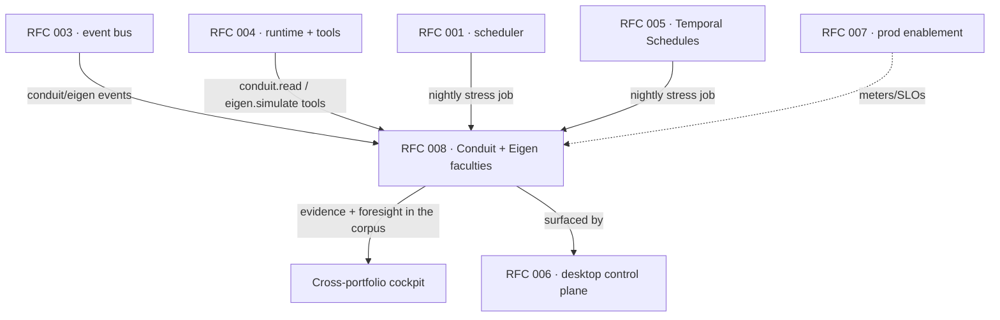
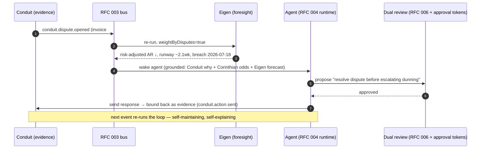

# RFC 008: Conduit & Eigen — the Evidence and Foresight Faculties

| | |
| --- | --- |
| **RFC** | 008 |
| **Status** | Draft |
| **Track** | Cloud-native background workflows · Cross-portfolio cockpit |
| **Owners** | `apps/rowboat-api` (Go backend) · `apps/x` (desktop federation) · Conduit team · Eigen team |
| **Created** | 2026-06-05 |
| **Last updated** | 2026-06-05 |
| **Depends on** | [RFC 003](./003-cloud-event-ingestion.md) (event bus), [RFC 004](./004-cloud-agent-runtime.md) (runtime + tool registry), [RFC 001](./001-api-owned-scheduler.md)/[005](./005-temporal-schedule-integration.md) (scheduling), the cockpit's Read/Mirror/Watch/Act seams |
| **Extends** | RFC 003 `CloudEvent.source` enum · RFC 004 tool allowlist + error codes |
| **Parent docs** | [`docs/architecture-cross-portfolio-cockpit.md`](../../docs/architecture-cross-portfolio-cockpit.md), [`docs/one-pager-product.md`](../../docs/one-pager-product.md) "The platform it becomes" |

## RFC map



## Summary

[The execution-plane RFCs (001–007)](./README.md) make the platform an autonomous, durable
agent runtime. The cross-portfolio cockpit (`docs/architecture-cross-portfolio-cockpit.md`)
federates the financial systems-of-record into one corpus. This RFC adds the **two
faculties that turn that federated graph from a report into a brain**:

- **Conduit — evidence.** The system of record binding invoice emails, replies, disputes,
  and follow-ups to the financial record they explain. It plugs in as a **full four-seam
  plane** (Read · Mirror · Watch · Act-audit) and becomes the live *grounding context*,
  *trigger source*, and *audit sink* for autonomous response.
- **Eigen — foresight.** A forward-simulation engine (runway, liquidity, covenant, AR/AP
  sensitivity). It plugs in as a **runtime tool** (call it mid-run) *and* a
  **scheduled/event-triggered job** (continuous stress-testing over the federated graph).

Together they close the loop **Conduit → Eigen → Agent → Conduit**: a dispute sharpens the
forecast, the forecast informs the action, the action becomes new evidence.

## Background & current state (grounded)

| Fact | Evidence |
| --- | --- |
| The cockpit's four integration seams (Read/Mirror/Watch/Act) | `docs/architecture-cross-portfolio-cockpit.md:60-75` |
| Desktop is an MCP client; servers mounted via `~/.rowboat/config/mcp.json` | `apps/x/packages/core/src/mcp/repo.ts:10`; tools called as `mcp:server:tool` (`application/lib/exec-tool.ts:19`) |
| Vault mirror pattern (factory + loop + `createEvent`) | `apps/x/packages/core/src/knowledge/sync_gmail.ts`; cockpit `sync_canvas.ts` skeleton (`architecture-cross-portfolio-cockpit.md:162-189`) |
| Event envelope shape `{source, type, payload, target}` | `apps/x/packages/shared/src/events.ts:25-65` (`RowboatEventSchema`) |
| Event consumers do Pass-1 candidacy → Pass-2 agent | `apps/x/packages/core/src/knowledge/live-note/event-consumer.ts`; cloud equivalent in RFC 003 |
| Cloud event ingestion + routing + `trigger=event` runs | [RFC 003](./003-cloud-event-ingestion.md) (`CloudEvent`, `/v1/events`, `rowboat.cloud_events.route.v1`) |
| Cloud runtime + scoped `ToolRegistry`/`ToolScope` | [RFC 004](./004-cloud-agent-runtime.md) |
| Dual-review Act seam (approval tokens + policy) | cockpit `:73-74` → Corinthian `corinthian-mcp/src/lib/approvals.ts`, `policy.ts`, `tool-packs.ts` |

The cockpit thesis (`:11`): *"no single product can produce this, because each is blind to
the others."* Conduit and Eigen extend it from *see the whole picture* to **explain it,
simulate it, and act on it.**

## Goals

- Make **Conduit** a first-class plane: its correspondence is queryable (Read), owned in the
  vault (Mirror), wakes agents (Watch), and records autonomous actions back (Act-audit).
- Make **Eigen** continuous: a runtime tool for point-of-decision simulation **and** a
  scheduled/event-triggered job that keeps a live whole-business stress test in the corpus.
- Reuse the existing seams + RFC 003/004 substrate — Conduit/Eigen are **new nodes on the
  fabric**, not new infrastructure.
- Preserve sovereignty: reads are scoped/audited; actions go through the dual-review gate;
  evidence is tamper-evident.

## Non-Goals

- Building Conduit's or Eigen's *internal* systems (owned by their teams); this RFC defines
  only how they **plug into** Rowboat's planes.
- Moving money. Eigen simulates; the Act seam (under approval tokens) is where money-moving
  lands, unchanged from the cockpit's Phase 3.
- A generic analytics engine — Eigen is financial simulation; other compute faculties would
  be separate plug-ins following the same pattern.

---

## Part A — Conduit (the evidence plane)

Conduit is a system of record that binds correspondence (invoice emails, replies, disputes,
follow-ups) to the financial record it explains. It lights up all four seams.

### A.1 Read — mount Conduit as an MCP server

Conduit exposes an HTTP MCP server; the desktop adds it to `mcp.json` exactly like Canvas
(`architecture-cross-portfolio-cockpit.md:141-160`):

```jsonc
"conduit": {
  "type": "http",
  "url": "https://api.conduit.<domain>/mcp",
  "headers": { "Authorization": "Bearer ${CONDUIT_API_KEY}" }
}
```

The agent immediately gains tools like `mcp:conduit:thread_for_invoice`,
`mcp:conduit:disputes_open`, `mcp:conduit:followups_due`. Cloud runs reach the same data via
the runtime tool below. The token is brokered by the connector OAuth path
([RFC 003/CONNECTOR_SUITE](../../docs/CONNECTOR_SUITE.md)), not hand-edited, once Conduit
joins the connector registry (`GET /v1/connectors`).

### A.2 Mirror — sync correspondence into the vault

`apps/x/packages/core/src/knowledge/sync_conduit.ts`, following the proven
`sync_gmail.ts`/`sync_canvas.ts` shape — **read over the same MCP mount the agent uses**:

```ts
// Mirror the durable identity (the thread bound to an invoice/customer); query the
// volatile state (today's dispute status) on demand. Merge-preserve frontmatter so a
// synced note can also be a live: note (fileops.ts patch semantics).
async function syncConduitThreads() {
  const threads = await executeTool('conduit', 'threads_recent', {});
  for (const t of threads) {
    upsertNote(`knowledge/Invoices/${t.invoiceRef}.md`, renderThreadNote(t)); // backlinked
    await createEvent({ source: 'conduit', type: 'conduit.correspondence.synced', payload: digest(t) });
  }
}
```

Each invoice note now carries its paper trail; the number stops being a bare figure. Register
in `apps/x/apps/main/src/main.ts` beside the existing `init()` syncs.

### A.3 Watch — Conduit events become cloud triggers

This is the autonomous half, and it routes through **RFC 003** rather than the desktop
consumer so it fires with the desktop closed.

**Extend RFC 003's `CloudEvent.source` enum** (`ent/schema/cloud_event.go`) to add the
portfolio + faculty sources:

```
source ∈ { gmail, google_calendar, slack, webhook, internal,   // RFC 003 base
           canvas, cadence, corinthian, conduit, eigen }        // RFC 008 additions
```

Conduit posts to `POST /v1/webhooks/conduit` (signature-verified, like the provider webhooks)
or `POST /v1/events` (server-to-server with `INTERNAL_API_SECRET`). Canonical event types:

| `event_type` | Meaning | `dedupe_key` |
| --- | --- | --- |
| `conduit.dispute.opened` | A dispute was raised on an invoice | `conduit:dispute:{disputeId}` |
| `conduit.reply.received` | A counterparty replied on a thread | `conduit:msg:{messageId}` |
| `conduit.followup.due` | A scheduled follow-up came due | `conduit:followup:{followupId}` |

The RFC 003 router resolves which task/agent owns the customer/invoice and starts a
`trigger=event` run. The run's `requested_context` is the **concise correspondence summary**
(per RFC 003's "context, not raw payload" rule); the full thread stays on the `CloudEvent`
(encrypted `payload_json`) and is fetched via the runtime tool.

### A.4 Act + the audit loop

When an agent sends a follow-up, it goes through the **dual-review Act seam** (cockpit `:73`):
Rowboat's "reviewable before it lands" + Corinthian's server-side approval tokens for
money-touching actions. The outbound message is then **bound back into Conduit** as new
correspondence on the same invoice, closing the evidence chain:

- The agent's send-action emits `conduit.action.sent` (source `conduit`), which Conduit
  ingests and binds to the invoice.
- The run that produced it is already linked to the originating `CloudEvent`
  (RFC 003 `cloud_event_id`), and its `temporal.*` event stream is immutable
  (`background_task_run_event`, append-only). So **every autonomous action has end-to-end
  provenance**: originating evidence → run → action → bound-back evidence.

### A.5 Conduit runtime tool (RFC 004 registry)

Add to the RFC 004 deny-by-default allowlist a **read-only** tool:

```go
// Tool name: "conduit.read" — read the correspondence/dispute thread bound to an
// invoice or customer. Scoped to ToolScope.UserID + the connector capability.
// Returns a structured thread summary, never raw secrets. Write-back is NOT a tool —
// it happens via the Act seam under approval tokens (A.4).
{ "name": "conduit.read",
  "input":  { "invoiceRef|customerRef": "string", "limit": "int" },
  "output": { "thread": [ {ts, direction, kind: "reply|dispute|followup", gist} ],
              "openDisputes": int, "disputedAmount": number } }
```

`conduit_unavailable` joins the RFC 004 error taxonomy (the user hasn't connected Conduit, or
it's down) so a missing thread fails loud, not as a silent empty result.

---

## Part B — Eigen (the foresight plane)

Eigen is a *compute* faculty: it consumes the federated graph and returns forward
simulations. It plugs in two ways.

### B.1 Eigen as a runtime tool — foresight at the point of decision

Add to the RFC 004 allowlist a **read-only** simulation tool:

```go
// Tool name: "eigen.simulate" — run a forward financial simulation over the caller's
// federated graph (AR=Canvas, AP=Cadence, behavior=Corinthian, disputes=Conduit).
// Read-only; deterministic given the same inputs + snapshot. Scoped to the tenant.
{ "name": "eigen.simulate",
  "input":  { "horizonDays": "int",
              "shocks": [ { "entity": "string", "deltaDays|deltaAmount": "number" } ],
              "weightByDisputes": "bool" },     // pull Conduit dispute haircuts
  "output": { "runwayWeeks": "number",
              "liquidityFloorBreachDate": "string|null",
              "riskAdjustedAR": "number",
              "drivers": [ { "factor": "string", "impact": "number" } ],
              "confidence": "number" } }
```

An agent about to escalate dunning calls it mid-run: *"if Acme's $48k slips 30d and we owe
their subcontractor $12k Friday, what's the runway hit — and does pushing harder risk the
renewal?"* — quantified, before it acts. `eigen_unavailable` / `eigen_invalid_scenario` join
the RFC 004 taxonomy.

### B.2 Eigen as a scheduled + event-triggered job — foresight made continuous

**Scheduled full stress run.** A Temporal-scheduled workflow `rowboat.eigen.stress.v1`
(via [RFC 005](./005-temporal-schedule-integration.md) Temporal Schedules, or the
[RFC 001](./001-api-owned-scheduler.md) loop) runs nightly/weekly over the whole federated
graph, writes the result into the corpus (a `Cash position` live note), and — on a threshold
breach — emits an `eigen.breach` event:

```
eigen.breach   { runwayWeeks, breachDate, floorWeeks, topDrivers[] }   // source: eigen
```

**Event-triggered incremental re-run.** A material financial event (a new overdue invoice
from Canvas, a vendor payment due from Cadence, a `conduit.dispute.opened`) triggers a
*targeted* `eigen.simulate` re-run via the RFC 003 router. If it breaches, the `eigen.breach`
event routes to wake an agent (or alert per RFC 007). Eigen stops being a calculator you
remember to run and becomes an **always-on risk sensor**.

```mermaid
sequenceDiagram
    autonumber
    participant SoR as Canvas/Cadence/Conduit
    participant EV as RFC 003 event bus
    participant EG as Eigen (eigen.simulate)
    participant AG as Cloud runtime (RFC 004)
    participant C as Corpus / Conduit
    SoR->>EV: financial event (overdue / vendor-due / dispute)
    EV->>EG: targeted re-run over federated graph
    EG-->>EV: result; if breach → emit eigen.breach
    EV->>AG: route eigen.breach → wake agent
    AG->>EG: eigen.simulate (scenario: act vs hold)
    AG->>C: write foresight to corpus; queue action (dual review)
```

### B.3 Why Eigen needs the federation (and the execution plane)

No single system-of-record can stress-test the business — each is blind to the others
(`cockpit:11`). The cockpit already federates AR + AP + behavior + disputes into one place,
so Eigen is the **first engine that simulates the whole business off live data**. And the
execution plane is what makes it *continuous* rather than a manual quarterly spreadsheet.

---

## Part C — The combined loop



Disputes (Conduit) are a probabilistic haircut on AR; payment behavior (Corinthian) is the
collection probability; Eigen produces the **risk-adjusted, dispute-weighted cash forecast**
impossible without both. This is the value chain no single product can assemble.

## Cross-RFC changes this introduces

| RFC | Change |
| --- | --- |
| [RFC 003](./003-cloud-event-ingestion.md) | `CloudEvent.source` enum gains `canvas, cadence, corinthian, conduit, eigen`; new event types (`conduit.*`, `eigen.breach`); `POST /v1/webhooks/conduit` |
| [RFC 004](./004-cloud-agent-runtime.md) | tool allowlist gains `conduit.read`, `eigen.simulate` (read-only); error codes `conduit_unavailable`, `eigen_unavailable`, `eigen_invalid_scenario` |
| [RFC 001](./001-api-owned-scheduler.md)/[005](./005-temporal-schedule-integration.md) | register `rowboat.eigen.stress.v1` scheduled workflow |
| [RFC 006](./006-desktop-cloud-control-plane.md) | surface "Triggered by: dispute on #4821" (event→run link) and the `Cash position` foresight note |
| [README](./README.md) | index row, dependency-graph node, Phase 6, conventions (new sources/tools/metrics) |

## Observability

`internal/cloudevents` + a new `internal/faculties` metrics leaf (cardinality rule holds —
label only by bounded dimensions):

| Series | Type | Labels |
| --- | --- | --- |
| `cloud_event_triggered_runs_total` (exists) | counter | `source` (now incl. `conduit`/`eigen`) |
| `faculty_eigen_simulations_total` | counter | `mode` (`tool`/`scheduled`/`triggered`) |
| `faculty_eigen_breaches_total` | counter | — |
| `faculty_eigen_simulation_seconds` | histogram | `mode` |
| `faculty_conduit_actions_bound_total` | counter | — (audit write-backs) |

Logs: `runId`, `taskSlug`, `userId`, `faculty` (`conduit`/`eigen`), `invoiceRef`,
`breach`, `durationMs`. (No tenant-identifying labels on metrics.)

## Security

- **Reads are read-only and scoped.** `conduit.read` / `eigen.simulate` resolve credentials
  from `ToolScope` (RFC 004), never from model text; both are deny-by-default registry
  entries.
- **Actions are double-gated.** No autonomous send/move happens without Rowboat's review UI
  **and** Corinthian's approval tokens for money-touching actions (cockpit `:73-74`). Eigen
  is simulation-only — it can never move money.
- **Evidence integrity.** Conduit-bound actions + the append-only `temporal.*` run-event
  stream + the RFC 003 `cloud_event_id` link form a tamper-evident chain — the regulatory
  moat for the sovereignty buyer.
- **Tenant isolation.** Conduit/Eigen calls run under `auth.WithInternal` scoped to the
  event-owner; the ORM interceptors keep all reads per-tenant. Eigen must pin the right
  tenant's federated snapshot and never blend tenants (cockpit open question `:136`).

## Configuration

| Env | Default | Meaning |
| --- | --- | --- |
| `FACULTY_CONDUIT_ENABLED` | `false` | mount Conduit events + `conduit.read` tool |
| `FACULTY_EIGEN_ENABLED` | `false` | enable `eigen.simulate` tool + stress job |
| `EIGEN_BASE_URL` | — | Eigen service endpoint (server-held) |
| `CONDUIT_BASE_URL` | — | Conduit MCP/API endpoint |
| `EIGEN_STRESS_SCHEDULE` | `0 6 * * *` | nightly full stress cron |
| `EIGEN_LIQUIDITY_FLOOR_WEEKS` | `8` | breach threshold for `eigen.breach` |

## Implementation order (slots into [`README.md`](./README.md))

Conduit's **Read + Mirror** are independent and can land early (desktop sync, like Canvas).
The autonomous loop needs the execution plane, so the rest slots **after RFC 003 + 004**:

1. **8.1 Conduit Read/Mirror** — connector registry entry + `sync_conduit.ts` + vault notes. *(parallel with Phase 1)*
2. **8.2 Conduit Watch** — extend RFC 003 source enum + `POST /v1/webhooks/conduit` + routing. *(after RFC 003 / Phase 4)*
3. **8.3 Eigen tool** — `eigen.simulate` in the RFC 004 registry. *(after RFC 004 / Phase 2)*
4. **8.4 Eigen jobs** — `rowboat.eigen.stress.v1` scheduled + event-triggered re-runs + `eigen.breach`. *(after RFC 001/005)*
5. **8.5 Combined loop + Act-audit** — dual-review send → Conduit bind-back; RFC 006 surfacing. *(after Phase 5 GA)*

→ This becomes **Phase 6 — Faculties** in the README implementation order.

## Test plan

- Unit: Conduit event normalization + dedupe (`conduit:dispute:{id}` → one row); `conduit.read`
  scope enforcement; `eigen.simulate` input validation (`eigen_invalid_scenario`).
- Unit: Eigen breach threshold emits `eigen.breach` at/over `EIGEN_LIQUIDITY_FLOOR_WEEKS`.
- Unit: deny-by-default — `eigen.simulate`/`conduit.read` absent when faculty disabled.
- Integration: `conduit.dispute.opened` → RFC 003 route → `eigen.simulate(weightByDisputes)`
  re-run → `trigger=event` run linked to the event; risk-adjusted AR reflects the dispute.
- Integration: agent send → dual-review gate → `conduit.action.sent` bound back; provenance
  chain (event→run→action) queryable.
- E2E (kind, desktop closed): post a Conduit dispute event → foresight re-runs → agent wakes →
  proposes action → review → bound-back evidence appears.

## Acceptance criteria

- Conduit correspondence is queryable (Read), owned in the vault (Mirror), wakes cloud agents
  with the desktop closed (Watch), and records autonomous actions back (Act-audit).
- Eigen runs both at the point of decision (tool) and continuously (scheduled + triggered),
  over the live federated graph, writing foresight into the corpus.
- A dispute measurably sharpens the forecast (dispute-weighted AR), and the forecast informs
  a reviewed action — the full loop, with end-to-end provenance.
- Reads are scoped/audited; money-touching actions stay behind the dual-review gate; Eigen
  never moves money.

## Decisions

Resolved forks (consolidated in [`README.md`](./README.md#consolidated-decisions)):

- **Conduit ingestion → through RFC 003**, not the desktop consumer, so it fires with the
  desktop closed; `source=conduit`, payload encrypted, context-not-raw on the run.
- **Eigen plugs in two ways, not one → tool *and* job.** The tool gives point-of-decision
  foresight; the scheduled/triggered job gives continuous coverage. Neither alone delivers
  "always-on risk sensor + scenario-aware action."
- **Both faculties are read-only at the tool layer.** All write/act flows through the
  existing dual-review Act seam (approval tokens) — faculties never move money.
- **Mirror durable identity, query volatile numbers** (cockpit `:135`): mirror the
  invoice/thread note (joinable, owned); fetch today's dispute amount / today's runway on
  demand. Keeps the vault fresh-enough without a sync storm.
- **Breach threshold is config, not per-task** (`EIGEN_LIQUIDITY_FLOOR_WEEKS`) in v1 — one
  business-level floor; per-entity thresholds are a later additive change.

### Deferred (needs the faculty teams; not blocking)

- Conduit's MCP tool catalog + Eigen's scenario DSL are owned by those teams; this RFC fixes
  only the plug-in contracts.
- Cross-tenant snapshot isolation for Eigen (cockpit open question `:136`) — confirm the
  federated-snapshot boundary with each SoR's RLS model before GA.

## Alternatives considered

- **Conduit as desktop-only (like the original Watch seam)** — rejected: it would only fire
  with the app open, defeating the autonomous loop. Routing through RFC 003 is the offline win.
- **Eigen as a scheduled job only (no tool)** — rejected: loses scenario-aware action at the
  point of decision (the highest-value moment). Tool-only loses continuous coverage. Both.
- **Fold Conduit into Corinthian** — rejected: Corinthian is AR *collections behavior*;
  Conduit is the *correspondence↔record binding* across AR **and** AP. Distinct faculty,
  distinct SoR (it can explain a Cadence vendor invoice too).
- **A bespoke faculty bus** — rejected: faculties are just new `source`s on the RFC 003 bus
  and new tools in the RFC 004 registry. No new infrastructure; that reuse *is* the platform.
