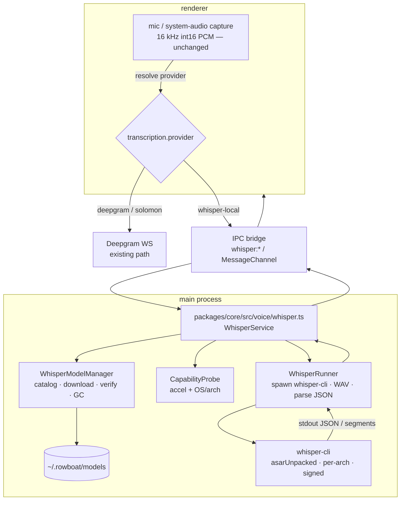
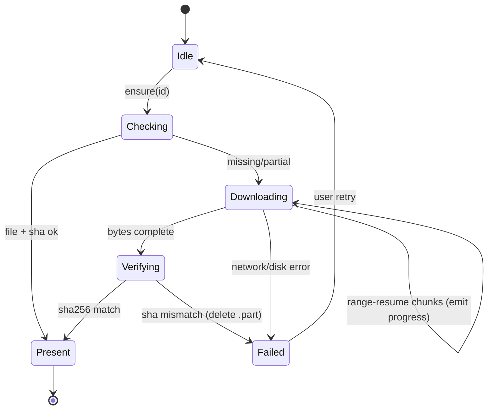
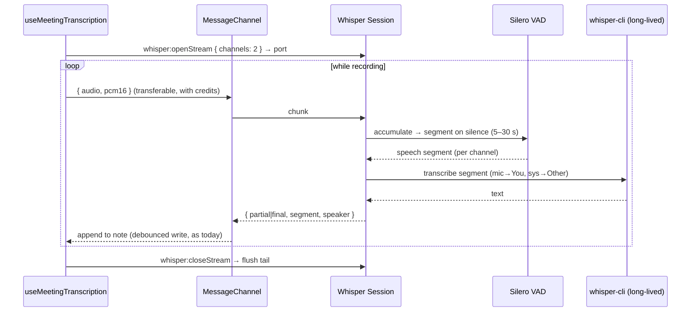
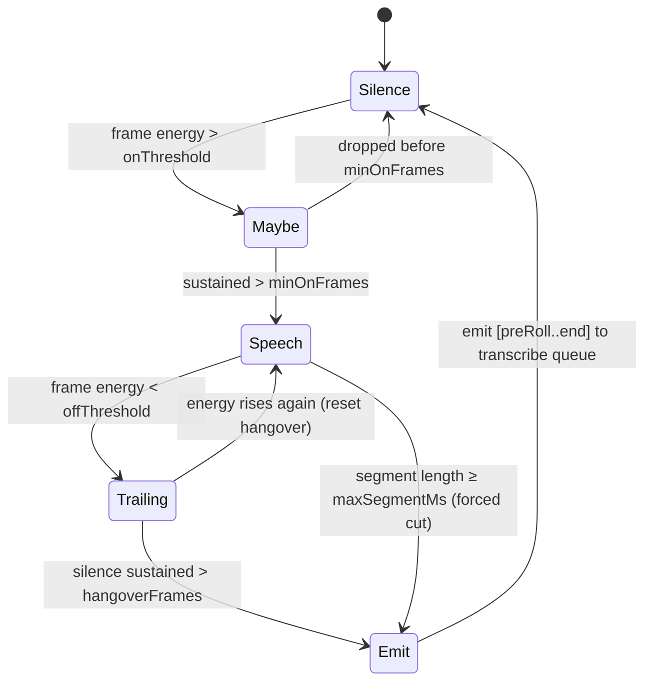

# RFC 009: Local On-Device Transcription (whisper.cpp)

|                  |                                                                                                                                                                               |
| ---------------- | ----------------------------------------------------------------------------------------------------------------------------------------------------------------------------- |
| **RFC**          | 009                                                                                                                                                                           |
| **Status**       | Draft                                                                                                                                                                         |
| **Track**        | Desktop · on-device AI (cost & privacy) — _independent of the cloud-workflows set (001–008)_                                                                                  |
| **Owners**       | `apps/x` (Electron: main + renderer + core)                                                                                                                                   |
| **Created**      | 2026-06-06                                                                                                                                                                    |
| **Last updated** | 2026-06-06                                                                                                                                                                    |
| **Depends on**   | none (new track)                                                                                                                                                              |
| **Parent docs**  | [`docs/WHISPER_CPP_LOCAL_TRANSCRIPTION.md`](../../docs/WHISPER_CPP_LOCAL_TRANSCRIPTION.md) (research + integration plan) · [`apps/x/ANALYTICS.md`](../../apps/x/ANALYTICS.md) |

## Table of contents

1. [Summary](#1-summary)
2. [Glossary](#2-glossary)
3. [Current state (grounded)](#3-current-state-grounded)
4. [Goals, non-goals, success metrics](#4-goals-non-goals-success-metrics)
5. [Background: how whisper.cpp works](#5-background-how-whispercpp-works)
6. [High-level architecture](#6-high-level-architecture)
7. [Component breakdown](#7-component-breakdown)
8. [The `whisper-cli` invocation](#8-the-whisper-cli-invocation)
9. [Model manager](#9-model-manager)
10. [Audio pipeline & IPC transport](#10-audio-pipeline--ipc-transport)
11. [Full IPC contract](#11-full-ipc-contract)
12. [Provider abstraction & config](#12-provider-abstraction--config)
13. [Capability detection](#13-capability-detection)
14. [Voice mode (P1) — batch flow](#14-voice-mode-p1--batch-flow)
15. [Meeting mode (P2) — streaming flow](#15-meeting-mode-p2--streaming-flow)
16. [Tiering, quota & entitlements](#16-tiering-quota--entitlements)
17. [Settings UI](#17-settings-ui)
18. [Error taxonomy](#18-error-taxonomy)
19. [Telemetry](#19-telemetry)
20. [Packaging, build & signing](#20-packaging-build--signing)
21. [Security & privacy](#21-security--privacy)
22. [Performance: budgets & benchmarking](#22-performance-budgets--benchmarking)
23. [Cost analysis](#23-cost-analysis)
24. [Risks & mitigations](#24-risks--mitigations)
25. [Rollout plan](#25-rollout-plan)
26. [Implementation plan (work packages)](#26-implementation-plan-work-packages)
27. [Test plan](#27-test-plan)
28. [Acceptance criteria](#28-acceptance-criteria)
29. [Alternatives considered](#29-alternatives-considered)
30. [Decisions](#30-decisions)
31. [Open questions](#31-open-questions)
32. [Deepgram vs whisper.cpp — feature parity matrix](#32-deepgram-vs-whispercpp--feature-parity-matrix)
33. [Data model & persistence](#33-data-model--persistence)
34. [Observability, logging & debugging](#34-observability-logging--debugging)
35. [Failure modes & recovery runbook](#35-failure-modes--recovery-runbook)
36. [Migration & backwards compatibility](#36-migration--backwards-compatibility)
37. [Accessibility & internationalization](#37-accessibility--internationalization)
38. [Open-source licensing & attribution](#38-open-source-licensing--attribution)
39. [Future work / roadmap](#39-future-work--roadmap)
40. [Appendix A — `whisper-cli` flag reference](#appendix-a--whisper-cli-flag-reference)
41. [Appendix B — model catalog](#appendix-b--model-catalog)
42. [Appendix C — JSON output schema](#appendix-c--json-output-schema)
43. [Appendix D — sample code](#appendix-d--sample-code)
44. [Appendix E — full model catalog](#appendix-e--full-model-catalog)
45. [Appendix F — capability probe parsing](#appendix-f--capability-probe-parsing)
46. [Appendix G — MessagePort streaming protocol](#appendix-g--messageport-streaming-protocol)
47. [Appendix H — CMake build per platform](#appendix-h--cmake-build-per-platform)
48. [Appendix I — CI build workflow](#appendix-i--ci-build-workflow)
49. [Appendix J — `transcription.json` schema](#appendix-j--transcriptionjson-schema)
50. [Appendix K — WER computation](#appendix-k--wer-computation)
51. [Appendix L — GBNF grammar (custom vocabulary)](#appendix-l--gbnf-grammar-custom-vocabulary)
52. [Appendix M — PCM conversion & resampling](#appendix-m--pcm-conversion--resampling)
53. [Appendix N — Streaming & VAD algorithm (full reference)](#appendix-n--streaming--vad-algorithm-full-reference)
54. [Appendix O — Proxy-side meeting-minutes quota API](#appendix-o--proxy-side-meeting-minutes-quota-api)
55. [Appendix P — Full `model-manager.ts` reference implementation](#appendix-p--full-model-managerts-reference-implementation)
56. [Appendix Q — Full `runner.ts` reference implementation](#appendix-q--full-runnerts-reference-implementation)
57. [Appendix R — IPC handler wiring (main + shared schemas)](#appendix-r--ipc-handler-wiring-main--shared-schemas)
58. [Appendix S — Renderer `useVoiceMode` whisper branch](#appendix-s--renderer-usevoicemode-whisper-branch)
59. [Appendix T — `transcription-settings.tsx` component](#appendix-t--transcription-settingstsx-component)
60. [Appendix U — Full `capability.ts` reference implementation](#appendix-u--full-capabilityts-reference-implementation)
61. [Appendix V — Eval corpus & WER CI harness](#appendix-v--eval-corpus--wer-ci-harness)
62. [Appendix W — Packaging files (`bin.ts`, Forge, entitlements, build)](#appendix-w--packaging-files-bints-forge-entitlements-build)
63. [Appendix X — Full `service.ts` facade](#appendix-x--full-servicets-facade)
64. [Appendix Y — End-to-end worked trace](#appendix-y--end-to-end-worked-trace)
65. [Appendix Z — Rollout & observability playbook](#appendix-z--rollout--observability-playbook)
66. [References](#references)

---

## 1. Summary

Every word the desktop transcribes today is **billed** — speech-to-text streams to **Deepgram
`nova-3`** over a WebSocket, either with the user's own key or, for signed-in users, through the
**Solomon proxy** (which fronts Deepgram and bills us at ~**$0.0077/min** streaming). This RFC adds a
**local, on-device transcription engine** — [whisper.cpp](https://github.com/ggml-org/whisper.cpp)
(MIT, offline, GPU-accelerated) — as a first-class STT provider behind the existing provider
abstraction. It costs **$0/min after a one-time model download**, is **private** (audio never leaves
the device), and works **offline**.

The integration is small because the renderer **already captures exactly the audio whisper.cpp wants
(16 kHz mono int16 PCM)**. We add a main-process whisper service behind IPC, branch the existing mic
pipelines on a `transcription.provider` flag, ship a **signed `whisper-cli` binary** per-arch, and a
**model manager**. We tier **by feature, not by plan**: voice input defaults to local for everyone;
meetings default to Deepgram (for diarization) with a free cloud quota that falls back to local.

**Scope:** P1 = voice mode (batch, full parity). P2 = meeting transcription (VAD-segmented streaming,
per-channel labels). On-device multi-speaker diarization is out of v1.

---

## 2. Glossary

| Term              | Meaning                                                                                                     |
| ----------------- | ----------------------------------------------------------------------------------------------------------- |
| **STT**           | Speech-to-text (transcription).                                                                             |
| **PCM**           | Pulse-code-modulated raw audio samples. We use **16 kHz, mono, signed 16-bit little-endian** (`pcm_s16le`). |
| **RTF**           | Real-time factor = audio-seconds processed ÷ wall-seconds. RTF > 1 means faster than realtime.              |
| **GGUF / GGML**   | The tensor file/format whisper.cpp loads models from (successor to the old `ggml` format).                  |
| **Quantization**  | Reduced-precision weights (`q5_0`, `q5_1`, `q8_0`) → smaller files / RAM, slight accuracy loss.             |
| **VAD**           | Voice-activity detection — finds speech segments; whisper.cpp ships **Silero VAD** as a GGUF model.         |
| **Diarization**   | Labelling _who_ spoke (Speaker 1/2/…). Deepgram does it live; whisper.cpp does not natively.                |
| **Core ML / ANE** | Apple's on-device ML runtime / Neural Engine — accelerates the Whisper encoder ~3× on Apple Silicon.        |
| **`whisper-cli`** | whisper.cpp's command-line binary (formerly `main`). We spawn it.                                           |
| **WER**           | Word error rate — transcription accuracy metric (lower is better).                                          |

---

## 3. Current state (grounded)

STT lives entirely in the **renderer** and streams to Deepgram; there is **no local option**.

| Capability                | Evidence                                                                                                                                                                                                                                                                                                                                        |
| ------------------------- | ----------------------------------------------------------------------------------------------------------------------------------------------------------------------------------------------------------------------------------------------------------------------------------------------------------------------------------------------- |
| Voice mode (push-to-talk) | `apps/x/apps/renderer/src/hooks/useVoiceMode.ts` — Deepgram `nova-3` params (`:9-20`), auth (proxy bearer vs direct key) (`:40-73`), Web Audio capture → **16 kHz mono int16 PCM** streamed as WS frames (`:171-194`), `submit()` returns final transcript (`:198-206`)                                                                         |
| Meeting transcription     | `apps/x/apps/renderer/src/hooks/useMeetingTranscription.ts` — mic + **system audio via `getDisplayMedia` loopback** (`:237-246`), merged **stereo** PCM with mic-gating (`:328-380`), Deepgram `multichannel` + **`diarize`** (`:7-18`), speaker-labelled note → `knowledge/Meetings/…` (`:391`), headphone detection + 2-min silence auto-stop |
| Two routes                | `apps/x/apps/renderer/src/lib/deepgram-listen-url.ts` — Solomon proxy `wss://…/deepgram/v1/listen` (bearer); else direct `wss://api.deepgram.com/v1/listen` (user key)                                                                                                                                                                          |
| Voice config (keys)       | `apps/x/packages/core/src/voice/voice.ts:23-33` `getVoiceConfig()` reads `deepgram.json`/`elevenlabs.json` from `~/.rowboat/config`; IPC `voice:getConfig` (`apps/x/apps/main/src/ipc.ts:941`, typed `packages/shared/src/ipc.ts:688`)                                                                                                          |
| TTS (out of scope)        | `voice.ts:35` `synthesizeSpeech` (ElevenLabs `eleven_flash_v2_5`); IPC `voice:synthesize` (`ipc.ts:944`)                                                                                                                                                                                                                                        |
| Config root               | `apps/x/packages/core/src/config/config.ts:30` `WorkDir` (`~/.rowboat`) — where a `models/` dir would live                                                                                                                                                                                                                                      |
| Preload IPC bridge        | `apps/x/apps/preload/src/preload.ts` — `window.ipc.invoke<K>(channel, args)` (validated), `ipc.on`, `ipc.send`; `contextBridge.exposeInMainWorld('ipc', …)`                                                                                                                                                                                     |
| Packaging                 | `apps/x/apps/main/forge.config.cjs` — esbuild-bundled main; `generateAssets` hook stages `.package/`; `osxSign` + `osxNotarize` when `APPLE_*` set; **already declares `NSAudioCaptureUsageDescription`** + `entitlements.plist` (`com.apple.security.device.audio-input`, `screen-capture`, `cs.allow-jit`)                                    |
| Analytics                 | `apps/x/ANALYTICS.md` — PostHog (`posthog-js` renderer + `posthog-node` main, shared distinct_id); `voice_input_started` event; `chat_message_sent { voice_input, voice_output }`; `llm_usage` per feature                                                                                                                                      |

**Five facts that shape the design:**

1. **The captured audio (16 kHz mono int16 PCM) is exactly whisper.cpp's input** — no resampling for
   voice mode. A big head start.
2. **STT runs in the renderer (browser context); whisper.cpp is native C++ → must run in main/Node.**
   New path: renderer mic → **IPC** → main (whisper.cpp) → transcript back.
3. **Deepgram gives us streaming + diarization for free; whisper.cpp gives neither.** Batch
   (near-real-time via chunking), no native multi-speaker diarization — the one real feature gap.
4. **macOS audio entitlements already exist** (`audio-input`, `screen-capture`) — meeting capture is
   solved; we only add the _engine_.
5. **The app already has a model-catalog/download idiom** (LLM models settings, `models.dev.json`
   cache) — we mirror it for whisper models.

---

## 4. Goals, non-goals, success metrics

### Goals

- A **local STT provider** that transcribes fully on-device, selectable per the tiering policy.
- **Zero marginal cost** + **privacy/offline** for the highest-volume case (voice input).
- **Reuse** the existing mic-capture pipeline and provider abstraction — minimal renderer churn.
- **Robust packaging**: a signed binary that doesn't couple to Electron's Node ABI.
- Keep **Deepgram** as the default for diarized meetings and the universal fallback; nothing regresses.

### Non-goals

- Replacing Deepgram entirely.
- On-device **diarization** in v1 (multi-speaker labels within a channel).
- Local **TTS** (ElevenLabs path unchanged).
- Interim-text latency equal to Deepgram's instant partials (local is near-real-time).
- Mobile / non-desktop.

### Success metrics (instrumented — §19)

| Metric                                                                            | Target                 |
| --------------------------------------------------------------------------------- | ---------------------- |
| Voice-mode local availability (capable devices that complete a transcribe)        | ≥ 95%                  |
| Voice-mode local **median RTF** (`base.en`, capable device)                       | ≥ 3× realtime          |
| Voice-mode local **p95 end-to-end latency** (release → text) for a 10 s utterance | ≤ 1.5 s                |
| Local **WER** vs Deepgram on the eval set (`base.en` / `small.en`)                | within +8% / +4%       |
| **Fallback rate** to cloud (capability or error)                                  | ≤ 5%                   |
| Estimated **cloud-minute reduction** from local voice input                       | ≥ 60% of voice minutes |

---

## 5. Background: how whisper.cpp works

Whisper is an encoder-decoder transformer operating on **30-second** mel-spectrogram windows. Key
properties that drive our design:

- **Chunked, not truly streaming.** Audio is processed in 30 s contexts; "streaming" is a
  sliding-window approximation (re-transcribe the recent window every ~step). → batch is the natural
  fit; streaming needs chunking (§15).
- **Greedy vs beam search.** `whisper-cli` defaults to a small beam; `-bs`/`-bo` trade speed for
  accuracy. **Temperature fallback** (`--temperature` + `--no-fallback` to disable) re-decodes
  low-confidence segments. We use defaults for v1.
- **Threads & processors.** `-t <n_threads>` (CPU threads) and `-p <n_processors>` (split audio into
  N parallel chunks). We size `-t` to `min(8, physicalCores-1)` to leave headroom.
- **Acceleration.** CPU (AVX2/NEON) + **Metal + Core ML** on macOS, **CUDA/Vulkan/OpenVINO** else.
  Flash attention on by default (≥ v1.8.0). Core ML needs a sidecar `…-encoder.mlmodelc` (§9).
- **VAD (Silero, GGUF) ≥ v1.7.6** via `--vad --vad-model <path>` — transcribe only speech segments;
  big speedup, fewer hallucinations on silence.
- **Language.** `-l en` (fixed) or `-l auto` (detect). We pin `en` for `.en` models.
- **Timestamps.** Segment timestamps by default; word/token timestamps via `-ml 1`/`--output-json-full`.
- **Hallucination on non-speech** is a known failure mode → always run with VAD and trim silence.

---

## 6. High-level architecture



The renderer keeps capturing audio; `transcription.provider` selects Deepgram (existing WS) or
`whisper-local` (PCM → bridge → main). The main process owns whisper.cpp; the renderer never loads
native code. The bridge is `ipc.invoke` for batch and a one-time **`MessageChannel`** for streaming
(§10).

---

## 7. Component breakdown

All new TS lives under `apps/x/packages/core/src/voice/whisper/` (built into the esbuild main bundle);
new IPC handlers in `apps/x/apps/main/src/ipc.ts`; shared types in `apps/x/packages/shared/src/`.

| Module                                                            | Responsibility                                                                      | Key API (sketch)                                                      |
| ----------------------------------------------------------------- | ----------------------------------------------------------------------------------- | --------------------------------------------------------------------- |
| `whisper/service.ts`                                              | Facade the IPC layer calls; orchestrates model + runner; owns streaming sessions    | `transcribe(req)`, `openStream(opts)`, `listModels()`, `capability()` |
| `whisper/model-manager.ts`                                        | Catalog, download (resume + checksum), list/verify/GC, Core ML sidecar              | `list()`, `ensure(id, onProgress)`, `pathFor(id)`, `remove(id)`       |
| `whisper/runner.ts`                                               | Build args, write temp WAV, `spawn` `whisper-cli`, parse JSON, map errors, timeouts | `run(wavPath, opts) → Result`                                         |
| `whisper/capability.ts`                                           | Detect OS/arch + accel; cache; decide local-eligibility                             | `probe() → Capability`                                                |
| `whisper/streaming.ts`                                            | VAD-segmented chunker for meetings; session lifecycle; partial/final emit           | `Session.push(pcm)`, `Session.close()`                                |
| `whisper/wav.ts`                                                  | int16 PCM ↔ WAV (44-byte header), mono/stereo deinterleave                          | `pcm16ToWav(buf, {rate, channels})`                                   |
| `whisper/bin.ts`                                                  | Resolve the per-arch `whisper-cli` path (packaged vs dev), exec perms               | `binaryPath()`                                                        |
| `whisper/catalog.ts`                                              | Static model catalog (id, label, size, sha256, url, accel hints)                    | `CATALOG: ModelEntry[]`                                               |
| `voice.ts` _(extend)_                                             | `TranscriptionConfig` + resolver; keep Deepgram/ElevenLabs                          | `getTranscriptionConfig()`                                            |
| renderer `useVoiceMode` / `useMeetingTranscription` _(extend)_    | Branch on resolved provider                                                         | —                                                                     |
| renderer `components/settings/transcription-settings.tsx` _(new)_ | Provider + model picker, download UI                                                | —                                                                     |

---

## 8. The `whisper-cli` invocation

We **write a temp WAV** (16 kHz mono/stereo, 16-bit) to the OS temp dir and pass it via `-f`; parse
`-oj` JSON from a sidecar file (or `--output-json-full` for word timestamps). Temp files are written
to a per-run dir under `app.getPath('temp')` and **unlinked in a `finally`** (§21).

**Batch (voice mode):**

```
whisper-cli \
  -m  ~/.rowboat/models/ggml-base.en-q5_1.bin \
  -f  /tmp/rowboat-whisper-<uuid>/in.wav \
  -l  en \
  -t  7 \
  --vad --vad-model ~/.rowboat/models/ggml-silero-v5.1.2.bin \
  -oj -of /tmp/rowboat-whisper-<uuid>/out \   # writes out.json
  -nt -np                                      # no in-line timestamps, no progress prints
```

- macOS: if `…-encoder.mlmodelc` sits next to the model, whisper.cpp auto-uses Core ML (no flag).
  Add `-ng` only to force CPU (debug). Vulkan/CUDA builds auto-detect; `--gpu-device` selects one.
- **Timeout:** kill after `max(15s, 3× audioSeconds)`; emit `engine_timeout`.
- **Exit codes:** `0` ok; non-zero → capture stderr, classify into the error taxonomy (§18).
- **Concurrency:** a per-process **semaphore of 1** for batch (transcription is CPU/GPU-heavy); queue
  extra requests. Streaming sessions get their own long-lived process (§15).

The parsed result (Appendix C) yields `text` (joined segments) + `segments[]` (start/end/text).

---

## 9. Model manager

### Catalog (`whisper/catalog.ts`)

```ts
interface ModelEntry {
  id: string; // 'base.en-q5_1'
  label: string; // 'Base · English (recommended)'
  family: "tiny" | "base" | "small" | "medium" | "large-v3" | "large-v3-turbo";
  english: boolean;
  quant: "f16" | "q5_0" | "q5_1" | "q8_0";
  sizeMb: number; // download size
  sha256: string; // from the whisper.cpp models manifest — DO NOT invent; pull at build time
  url: string; // HF resolve URL (below)
  coreml?: { url: string; sha256: string }; // optional macOS encoder sidecar
  recommendedDefault?: boolean;
}
```

- **Source:** Hugging Face `ggerganov/whisper.cpp`:
  `https://huggingface.co/ggerganov/whisper.cpp/resolve/main/ggml-<name>.bin`
  (e.g. `ggml-base.en-q5_1.bin`); Silero VAD: `ggml-silero-v5.1.2.bin`.
- **SHA256 must come from the repo manifest**, captured into the catalog at build time (a small CI
  script), never hand-typed. Mismatch → reject + delete partial.
- We may **mirror** to our own CDN to avoid HF rate-limits/availability (Open Question §31).

### Download flow



- **Resumable:** download to `…/models/<id>.bin.part`; `HTTP Range` resume from `.part` length;
  **atomic rename** to `<id>.bin` only after checksum passes.
- **Disk guard:** check free space ≥ `sizeMb × 1.2` before starting; else `insufficient_disk`.
- **Concurrency:** one download per `id`; coalesce duplicate `ensure(id)` calls onto one promise.
- **GC:** `remove(id)`; offer "remove unused models" in settings; never auto-delete the active model.
- **Core ML sidecar (macOS):** download/unzip `…-encoder.mlmodelc` next to the model; first run does a
  one-time on-device ANE compile (note the cold-start in UX).
- **Layout:**

```
~/.rowboat/models/
  ggml-base.en-q5_1.bin
  ggml-base.en-q5_1.bin.part          # transient
  ggml-base.en-encoder.mlmodelc/      # macOS only
  ggml-silero-v5.1.2.bin              # VAD
  .catalog-state.json                 # {installed, lastVerifiedAt, sizes}
```

---

## 10. Audio pipeline & IPC transport

### Format

Renderer capture is **16 kHz, mono, `pcm_s16le`** (voice) or **2-channel interleaved** (meetings) —
already produced by `useVoiceMode`/`useMeetingTranscription`. whisper.cpp wants **mono f32** internally
but `whisper-cli` reads a standard **16-bit WAV**, so `whisper/wav.ts` writes a 44-byte RIFF header +
the int16 samples. For stereo meetings we **deinterleave** and transcribe mic (ch0) and system (ch1)
as **two separate mono passes** (→ "You" / "Other" labels), since whisper.cpp has no multichannel.

### Transport

| Path                     | Mechanism                                                                                                                                                                                      | Why                                                                             |
| ------------------------ | ---------------------------------------------------------------------------------------------------------------------------------------------------------------------------------------------- | ------------------------------------------------------------------------------- |
| **Batch (voice)**        | `window.ipc.invoke('whisper:transcribe', { pcm16: ArrayBuffer })`                                                                                                                              | One structured-clone copy of a few MB on `submit()` — fine.                     |
| **Streaming (meetings)** | a **`MessageChannel`** opened once via `whisper:openStream` → renderer posts PCM chunks on the port (`postMessage(buf, [buf])`, **transferable** = zero-copy); main posts back partials/finals | Avoids per-chunk structured-clone copies; backpressure via an ack/credit scheme |

> **Why not stream every chunk through `ipc.invoke`?** Each `invoke` structured-clones the buffer
> (copy) and serializes through the main event loop. For continuous meeting audio that's wasteful; a
> dedicated `MessagePort` with **transferable** `ArrayBuffer`s is the standard Electron pattern.

**Backpressure:** the renderer holds a small credit window (e.g. 3 chunks); main acks after each
segment is enqueued. If credits hit 0 (engine slower than realtime), the renderer **drops to a longer
chunk** or surfaces "transcription is behind" rather than growing an unbounded buffer.

**Memory:** a 30 s mono 16 kHz int16 buffer ≈ 960 KB; cap any in-flight buffer at ~60 s and flush.

---

## 11. Full IPC contract

Typed in `packages/shared/src/ipc.ts` (validated by the existing zod-style schema the preload uses),
handled in `apps/x/apps/main/src/ipc.ts` beside `voice:*`.

```ts
// ---- discovery / capability ----
'whisper:capability': {
  req: null;
  res: { supported: boolean; accel: 'coreml'|'metal'|'cuda'|'vulkan'|'cpu'; cores: number; reason?: string };
};

// ---- models ----
'whisper:listModels': {
  req: null;
  res: { models: Array<{ id: string; label: string; sizeMb: number; installed: boolean; recommended: boolean }> };
};
'whisper:ensureModel': { req: { id: string }; res: { success: boolean; code?: WhisperErrorCode } };
'whisper:removeModel': { req: { id: string }; res: { success: boolean } };
// event (ipc.on): 'whisper:modelProgress' → { id; receivedMb; totalMb; phase: 'download'|'verify' }

// ---- batch transcription ----
'whisper:transcribe': {
  req: { pcm16: ArrayBuffer; sampleRate: 16000; channels: 1|2; model?: string; lang?: string };
  res: {
    success: boolean;
    text?: string;
    segments?: Array<{ start: number; end: number; text: string; speaker?: 'you'|'other' }>;
    rtf?: number; durationMs?: number;
    code?: WhisperErrorCode; message?: string;
  };
};

// ---- streaming transcription (P2) ----
'whisper:openStream': { req: { model?: string; channels: 1|2 }; res: { streamId: string; port: MessagePortMain } };
// over the MessagePort: renderer→main { type:'audio'; pcm16: ArrayBuffer } (transferable)
//                       main→renderer { type:'partial'|'final'; segment } / { type:'ack'; credits }
'whisper:closeStream': { req: { streamId: string }; res: { success: boolean } };

type WhisperErrorCode =
  | 'engine_unavailable' | 'device_unsupported' | 'model_not_installed'
  | 'download_failed' | 'checksum_mismatch' | 'insufficient_disk'
  | 'engine_timeout' | 'engine_crashed' | 'audio_invalid' | 'busy';
```

Every failure returns a **code** (not a parsed message), mirroring the cloud error-code pattern. The
renderer switches on `code` to pick the recovery action (§18).

---

## 12. Provider abstraction & config

Extend `voice.ts` (`:8-33`) with an explicit provider selector instead of inferring from which key
exists. New `~/.rowboat/config/transcription.json`:

```ts
type TranscriptionProvider = "solomon" | "deepgram" | "whisper-local";

interface TranscriptionConfig {
  voiceProvider: TranscriptionProvider; // default resolved by tiering + capability (§16)
  meetingProvider: TranscriptionProvider; // default 'solomon'/'deepgram'
  whisper: { model: string }; // e.g. 'base.en-q5_1'
}

// Resolution (main): remoteDefault → user override → capability gate → fallback
async function resolveVoiceProvider(): Promise<TranscriptionProvider> {
  const cfg = await getTranscriptionConfig(); // user override
  const remote = await getRemoteDefault("voiceProvider"); // remote-config (§16/§25)
  const want = cfg.voiceProvider ?? remote ?? "whisper-local";
  if (want === "whisper-local") {
    const cap = await capability();
    if (!cap.supported) return signedIn() ? "solomon" : "deepgram"; // graceful fallback
  }
  return want;
}
```

Renderer hooks call a new IPC `transcription:getResolvedProvider` (or piggyback `voice:getConfig`) and
branch:

- `deepgram`/`solomon` → existing WS path (unchanged).
- `whisper-local` → buffer PCM → `whisper:transcribe` (voice) / `whisper:openStream` (meeting).

Back-compat: if `transcription.json` is absent, derive defaults from the current `deepgram.json`
presence + sign-in state, so existing users see no change until they opt in or the remote default
flips.

---

## 13. Capability detection

Local is only defaulted **on** where it'll be good. `whisper/capability.ts`:

```mermaid
flowchart TD
    S[probe()] --> OS{platform/arch}
    OS -->|darwin arm64| ML[accel = coreml<br/>supported = true]
    OS -->|darwin x64| MET[accel = metal? else cpu]
    OS -->|win/linux| GPU{Vulkan/CUDA available?}
    GPU -->|yes| VK[accel = vulkan/cuda<br/>supported = true]
    GPU -->|no| CPU{physicalCores ≥ 4?}
    CPU -->|yes| CPUOK[accel = cpu<br/>supported = true · warn 'may be slow']
    CPU -->|no| WEAK[accel = cpu<br/>supported = false → prefer cloud]
```

- **Detection approach:** read `os.cpus()`/arch; for GPU, run a **one-time `whisper-cli --help`/tiny
  self-test** that reports the active backend (cache the result in `.catalog-state.json`). Avoid heavy
  probing on every launch.
- **Outcome** feeds `resolveVoiceProvider` (§12): `supported=false` → fall back to cloud; `supported`
  but `cpu` on a weak machine → allow but show a "may be slow; uses battery" note and prefer a smaller
  model.

---

## 14. Voice mode (P1) — batch flow

```mermaid
sequenceDiagram
    participant U as User
    participant Rnd as useVoiceMode
    participant Main as WhisperService
    participant CLI as whisper-cli
    U->>Rnd: hold mic, speak, release
    Rnd->>Rnd: buffer 16 kHz int16 PCM (existing capture)
    Note over Rnd: optional client VAD trims leading/trailing silence
    Rnd->>Main: whisper:transcribe { pcm16, model }
    Main->>Main: ensureModel(model) (no-op if present)
    Main->>Main: wav.pcm16ToWav → temp.wav
    Main->>CLI: spawn (-m, -f, --vad, -oj)
    CLI-->>Main: out.json (segments)
    Main->>Main: unlink temp; compute rtf
    Main-->>Rnd: { text, rtf } → fill composer
```

Renderer state machine (mirrors today's `idle → listening → submit`), with whisper additions:

```
idle ──start()──▶ listening ──submit()──▶ transcribing ──ok──▶ idle (text)
                       │                        └──err/code──▶ idle (toast + fallback offer)
                       └──cancel()──▶ idle
```

- The `listening` UX is **unchanged** (no live interim from local in v1 — show a recording indicator;
  text appears on release). Optional: show a spinner during `transcribing` for long utterances.
- If `whisper:transcribe` returns `model_not_installed` on first use → prompt to download (or
  background-download the default at onboarding).

---

## 15. Meeting mode (P2) — streaming flow

Reuse the existing mic + `getDisplayMedia` capture (`useMeetingTranscription`); route PCM to a
streaming session instead of Deepgram.



- **Segmentation:** Silero VAD finds speech; we cut on ≥ ~700 ms silence, cap segments at ~30 s, and
  transcribe each as it closes → near-real-time finals (no unstable sliding-window partials in v1).
- **Per-channel labels:** mic channel → `You`; system channel → `Other`. (Deepgram's in-room
  `Speaker N` diarization is **not** reproduced — Decision §30, Open Question §31.)
- **Reuse** the existing note format/path, headphone gating, and 2-min silence auto-stop verbatim;
  only the transcript _source_ changes.

---

## 16. Tiering, quota & entitlements

Default **by feature, not by plan** (rationale in parent doc §9).

| Feature                        | Default engine                                           | Free                                                                              | Paid                                 |
| ------------------------------ | -------------------------------------------------------- | --------------------------------------------------------------------------------- | ------------------------------------ |
| **Voice input (push-to-talk)** | **Local (whisper.cpp)** for everyone, on capable devices | Local, unlimited                                                                  | Local default; cloud available       |
| **Meeting transcription**      | **Deepgram** (diarization + system audio)                | Cloud up to a monthly quota → then **local "no-diarization"** fallback, unlimited | Unlimited cloud                      |
| **Offline / privacy mode**     | Local                                                    | available                                                                         | available (some pay _for_ on-device) |

**Quota mechanics (leaning):** meter **server-side at the Solomon proxy** (it already fronts Deepgram
and authenticates the user), exposing remaining minutes via the account/config payload the desktop
already fetches (`useSolomonAccount`). The desktop reads `meetingMinutesRemaining`; at 0 it switches
`meetingProvider → whisper-local` and shows "Free cloud minutes used — switched to on-device." BYOK
users (own `deepgram.json`) bypass the quota at their own cost.

**Remote-config** (so we can A/B without a release): the account/config payload carries
`transcriptionDefaults: { voiceProvider, meetingProvider, freeMeetingMinutes }`. Local user overrides
(settings) win over remote; remote wins over the hardcoded fallback. See §25.

**Entitlement check:** `isSignedIn()` + plan from the account payload decides quota size; **no new
billing primitives** in v1 (reuse the proxy's existing per-user context).

---

## 17. Settings UI

New **Transcription** section in `settings-dialog.tsx` (sibling of the Models tab), component
`components/settings/transcription-settings.tsx`:

```
┌─ Transcription ─────────────────────────────────────────────┐
│                                                              │
│  Voice input                                                 │
│   ◉ On-device (Whisper)   private · offline · free           │
│   ○ Cloud (Deepgram)      most accurate                      │
│                                                              │
│   Model   [ Base · English (recommended) ▾ ]   142 MB ✓      │
│            Small · English                     466 MB  ⬇ Get │
│                                                              │
│   Device  Apple Silicon · Core ML  ·  ~10× realtime          │
│                                                              │
│  Meetings                                                    │
│   ◉ Cloud (Deepgram)  speaker labels · 180 free min left     │
│   ○ On-device         private · no speaker labels            │
│                                                              │
│  [ Manage models… ]   1 installed · 142 MB · Remove unused   │
└──────────────────────────────────────────────────────────────┘
```

- Model dropdown shows install state + size; "Get" triggers `whisper:ensureModel` with a progress bar
  (`whisper:modelProgress`).
- **Device** line surfaces the capability probe (accel + rough speed); on a weak device it reads "CPU
  only · may be slow" and nudges toward Cloud.
- Changing a setting writes `transcription.json` and emits a `voice:configChanged` event so warm hooks
  refresh.

---

## 18. Error taxonomy

Each error returns a `code`; the renderer maps it to a label + recovery action.

| `code`                | Cause                    | User label / action                                                           |
| --------------------- | ------------------------ | ----------------------------------------------------------------------------- |
| `device_unsupported`  | weak CPU, no GPU         | "On-device transcription isn't fast enough on this device." → switch to Cloud |
| `engine_unavailable`  | binary missing/exec-perm | "Transcription engine unavailable." → fall back to Cloud; log for support     |
| `model_not_installed` | model absent             | "Download the Whisper model to transcribe on-device." → **Download**          |
| `download_failed`     | network/disk             | "Couldn't download the model." → **Retry**                                    |
| `checksum_mismatch`   | corrupt download         | "Model download was corrupted; re-downloading." → auto-retry once             |
| `insufficient_disk`   | < size×1.2 free          | "Not enough disk space for this model (needs ~150 MB)."                       |
| `engine_timeout`      | RTF too low / hang       | "Transcription took too long." → fall back to Cloud for this utterance        |
| `engine_crashed`      | non-zero exit            | "Transcription failed." → retry once, then Cloud fallback                     |
| `audio_invalid`       | empty/garbled PCM        | silently no-op (no toast)                                                     |
| `busy`                | semaphore held           | queue; never user-facing                                                      |

**Fallback policy:** on `device_unsupported`/`engine_unavailable`/`engine_timeout`, transparently use
the cloud path for that request (if available) and record `fallback=true` in telemetry (§19).

---

## 19. Telemetry

PostHog, following `ANALYTICS.md` (privacy: **never** log audio or transcript text). New events
(renderer via `posthog-js`; engine-side timings forwarded over IPC):

| Event                            | Properties                                                               | When                         |
| -------------------------------- | ------------------------------------------------------------------------ | ---------------------------- |
| `transcription_started`          | `{ provider, mode: 'voice'\|'meeting', model? }`                         | start of a transcribe/stream |
| `transcription_completed`        | `{ provider, mode, model?, audio_ms, latency_ms, rtf, accel, fallback }` | success                      |
| `transcription_failed`           | `{ provider, mode, code }`                                               | error                        |
| `whisper_model_downloaded`       | `{ id, size_mb, duration_ms }`                                           | model fetched                |
| `transcription_provider_changed` | `{ feature, from, to, reason: 'user'\|'quota'\|'capability' }`           | default/override change      |

Extend the existing `chat_message_sent { voice_input }` with `voice_input_provider`. **Person property**
`transcription_engine_pref`. No content, durations only — auditable against the privacy stance.

---

## 20. Packaging, build & signing

### Where the binary lives

Ship per-arch `whisper-cli` (+ the Silero VAD GGUF, since it's small and always needed) as an
**`extraResource`** so it lands in `…/Resources/` **outside the asar** (executables can't run from
inside asar). `forge.config.cjs` additions:

```js
// packagerConfig
extraResource: [
  // staged per-arch in the generateAssets hook → resources/whisper/<platform>-<arch>/
  path.join(__dirname, '.package', 'whisper'),
],
```

Stage the right arch in the existing `generateAssets(forgeConfig, platform, arch)` hook (it already
receives `arch`): copy `vendor/whisper/<platform>-<arch>/whisper-cli[.exe]` into `.package/whisper/`.
Resolve at runtime in `whisper/bin.ts`:

```ts
const base = app.isPackaged ? process.resourcesPath : path.join(__dirname, "../../vendor/whisper");
const exe = process.platform === "win32" ? "whisper-cli.exe" : "whisper-cli";
const p = path.join(base, app.isPackaged ? "whisper" : `${process.platform}-${process.arch}`, exe);
fs.chmodSync(p, 0o755); // ensure exec bit (esp. after asar extraction)
```

### Building the binaries (CI)

**Build whisper.cpp ourselves** (pinned tag, e.g. `v1.8.x`) per arch so every Mach-O is _ours_ to
sign. A `whisper-build` CI workflow (or a step in the existing release pipeline), matrix:

| Target                      | Toolchain | Flags                                                              |
| --------------------------- | --------- | ------------------------------------------------------------------ |
| `darwin-arm64`              | Xcode     | `-DGGML_METAL=ON -DWHISPER_COREML=ON`; static-link ggml/whisper    |
| `darwin-x64`                | Xcode     | `-DGGML_METAL=ON` (Core ML optional)                               |
| `win32-x64`                 | MSVC      | `-DGGML_VULKAN=ON` (fallback CPU/OpenBLAS); ship the Vulkan loader |
| `linux-x64` / `linux-arm64` | gcc/clang | `-DGGML_VULKAN=ON`; CPU fallback                                   |

- Prefer **static linking** ggml/whisper into the single `whisper-cli` to minimize the number of
  Mach-O/PE files to sign and avoid `@rpath` dylib issues.
- Universal mac DMGs aren't produced today (the makers are per-arch — see `forge.config.cjs`), so we
  ship **one arch per installer** and stage the matching binary. (If a universal build is added later,
  `lipo` the two `whisper-cli`s.)

### Signing / notarization

- macOS: the binary is signed under the app's **hardened runtime** via the existing `osxSign`
  (`optionsForFile` applies `entitlements.plist` to nested executables). `extraResource` Mach-O files
  are signed by `@electron/osx-sign`'s deep sign; **verify** with `codesign --verify --deep` in CI.
  **Notarize** the whole app (existing `osxNotarize`) — un-notarized helper Mach-O is Gatekeeper-blocked.
- **Entitlements:** the current `entitlements.plist` (`cs.allow-jit`, `device.audio-input`,
  `device.screen-capture`) is sufficient for spawning a signed helper that uses Metal/Core ML. If a
  dynamically-loaded unsigned dylib is ever introduced, add
  `com.apple.security.cs.disable-library-validation` — avoided by static linking.
- **Windows:** sign `whisper-cli.exe` with the same Authenticode cert as the app (Squirrel installer).
- **Linux:** no signing; ensure exec bit post-install (deb/rpm/zip).

### Size

`whisper-cli` (CPU+Metal/Vulkan, static) ≈ a few MB–~30 MB per arch; the Silero VAD GGUF ≈ ~1 MB.
Well within the perf gate's `packagedAppSizeMb` (900 MB) budget; **models stay out of the installer**
(downloaded on first use).

---

## 21. Security & privacy

- **No network egress for local STT.** The `whisper-cli` process is spawned with `env` stripped of
  proxies and no network use; audio and transcripts never leave the device. This is the headline
  privacy benefit — document it in the UI.
- **Temp-file hygiene:** WAVs written to a per-run dir under `app.getPath('temp')` with `0600`,
  **unlinked in a `finally`** (and on process exit). Never write audio under the workspace/notes dir.
- **Model integrity:** SHA256-verified downloads from a pinned source; reject + delete on mismatch
  (prevents a poisoned model). Consider pinning the HF revision, not `main`.
- **Supply chain:** build `whisper-cli` from a **pinned whisper.cpp tag** in our CI (not a random
  upstream release binary); record the commit in the catalog/build metadata.
- **Spawn hardening:** absolute binary path (no `PATH` lookup), arg array (no shell), bounded
  stdout/stderr buffers, hard timeout + `SIGKILL`. The renderer never gets a path to the binary.
- **Permissions:** mic + system-audio prompts are unchanged (existing entitlements / getUserMedia /
  getDisplayMedia). Local adds no new OS permission surface.

---

## 22. Performance: budgets & benchmarking

- **Targets** (§4): voice `base.en` median RTF ≥ 3×; p95 end-to-end ≤ 1.5 s for 10 s audio; meeting
  finals within ~1 chunk (≤ ~5 s) of speech end.
- **Bench harness:** add a `whisper-cli` micro-bench to the existing perf tool (`tools/desktop-perf`):
  transcribe a fixed N-second fixture clip on the packaged binary, record RTF + peak RSS, assert a
  per-tier RTF floor (a new budget key, e.g. `whisperBaseEnRtfMin`). Runs in the nightly perf gate.
- **Methodology:** warm run (model loaded) and cold run (first load incl. Core ML compile) reported
  separately; fixed clip + fixed threads so numbers are comparable across runs.
- **Battery:** flag sustained-use CPU%; meetings default to cloud partly for this reason; voice
  (short bursts) is cheap.

---

## 23. Cost analysis

| Provider                    | Streaming $/min | $/hr   | Note                                         |
| --------------------------- | --------------- | ------ | -------------------------------------------- |
| **Deepgram nova-3 (today)** | **$0.0077**     | $0.46  | billed via Solomon proxy for signed-in users |
| OpenAI Whisper API (batch)  | $0.006          | $0.36  |                                              |
| **whisper.cpp (local)**     | **$0**          | **$0** | one-time ~150 MB DL; user CPU/GPU/battery    |

**Per-user / fleet:**

| Usage                    | Cloud $/yr (Deepgram stream) | Local  |
| ------------------------ | ---------------------------- | ------ |
| 100 min/mo (light)       | ~$9                          | $0     |
| 1 hr/day (heavy)         | ~$168                        | $0     |
| **10k users @ 1 hr/day** | **~$1.0M/yr**                | **$0** |

Sensitivity: even if only **60%** of voice minutes move local (rest stay cloud for accuracy/meetings),
fleet savings scale with that fraction. The eliminated spend is the **proxy** cost → direct unit-economics
improvement. Tradeoff: spend the **user's** compute/battery + lower accuracy/diarization than cloud.

---

## 24. Risks & mitigations

| Risk                                          | Mitigation                                                                                                       |
| --------------------------------------------- | ---------------------------------------------------------------------------------------------------------------- |
| **Accuracy < cloud**                          | model tiers (`small`/`large-v3-turbo`); Deepgram fallback; VAD trims silence/hallucinations; track WER (§22/§27) |
| **Hardware variance** (weak CPU ≈ 0.3× RTF)   | capability gate (§13) → cloud-with-quota; smaller model; "may be slow" note                                      |
| **CPU/battery** under sustained use           | GPU (Metal/Vulkan); small default; VAD skips silence; meetings prefer cloud; thread cap                          |
| **Model-download UX** (80 MB–1 GB)            | resumable + checksum + progress; never block; background-download default at onboarding                          |
| **macOS notarization** of bundled Mach-O      | build + sign + notarize in CI; static-link to shrink surface; `codesign --verify` gate                           |
| **Diarization gap** (meetings)                | per-channel You/Other; Deepgram default for diarized meetings; on-device diarization is a later RFC              |
| **whisper.cpp ABI / API drift**               | pin a tag; we build it; spawn (not addon) decouples from Electron's Node ABI                                     |
| **Cold-start** (model load / Core ML compile) | warm process option; preload default model; surface a one-time "preparing" state                                 |

---

## 25. Rollout plan

Everything ships **dark** behind flags and a remote default, kind → staging → prod, mirroring the
cloud-set's "ships dark" convention.

| Flag / config                                       | Controls                             | Default                                         |
| --------------------------------------------------- | ------------------------------------ | ----------------------------------------------- |
| `WHISPER_LOCAL_ENABLED` (build/env)                 | feature compiled-in + IPC registered | off → on after P1 lands                         |
| `transcriptionDefaults.voiceProvider` (remote)      | fleet default for voice              | `deepgram` → flip to `whisper-local` after soak |
| `transcriptionDefaults.meetingProvider` (remote)    | fleet default for meetings           | `solomon`/`deepgram`                            |
| `transcriptionDefaults.freeMeetingMinutes` (remote) | free quota                           | TBD                                             |
| user `transcription.json`                           | per-user override                    | wins over remote                                |

**Stages:** (1) dogfood — internal allowlist defaults voice→local; collect RTF/WER/fallback. (2)
opt-in GA — local available to all via settings, cloud still default. (3) flip the remote voice
default to local for capable devices; **A/B** activation/retention vs cloud. **Kill switch:** flip the
remote default back to `deepgram` — no release needed.

---

## 26. Implementation plan (work packages)

| WP      | Area           | Work                                                                                                                                               | Done when                                                       |
| ------- | -------------- | -------------------------------------------------------------------------------------------------------------------------------------------------- | --------------------------------------------------------------- |
| **0.1** | spike          | Build signed `whisper-cli` for darwin-arm64; `runner.run(fixture.wav)` from a node script; measure RTF/WER on `base.en`                            | a fixture WAV transcribes; RTF/WER recorded                     |
| **0.2** | packaging      | `vendor/whisper/<plat-arch>/` + `extraResource` staging in `generateAssets`; `bin.ts` path resolve + exec bit; `codesign --verify` in CI           | packaged macOS app finds + runs the signed binary               |
| **1.1** | core           | `model-manager.ts` (catalog, resumable download, sha256, GC, Core ML sidecar) + `whisper:listModels`/`ensureModel`/`removeModel` + progress events | model downloads, verifies, lists; bad sha rejected (unit tests) |
| **1.2** | core           | `wav.ts`, `runner.ts`, `capability.ts`, `service.ts` + `whisper:transcribe` + `whisper:capability`                                                 | `whisper:transcribe(fixture)` returns expected text (core test) |
| **1.3** | config         | `TranscriptionConfig` + `resolveVoiceProvider` + back-compat defaults                                                                              | resolver picks local/cloud per capability + override (tests)    |
| **1.4** | renderer       | `useVoiceMode` whisper branch (buffer → transcribe on submit); error/fallback handling                                                             | voice-mode local round-trip fills composer (RTL + packaged E2E) |
| **1.5** | settings       | `transcription-settings.tsx` (provider + model + download + device line)                                                                           | pick provider/model, download with progress (RTL)               |
| **1.6** | telemetry      | events (§19) wired; privacy review (no content)                                                                                                    | events fire with durations only                                 |
| **2.1** | streaming      | `streaming.ts` (Silero VAD segmenter) + `MessageChannel` transport + `openStream`/`closeStream`                                                    | mic+system meeting transcribes locally with You/Other labels    |
| **2.2** | quota          | proxy `meetingMinutesRemaining` in account payload; desktop quota→local fallback                                                                   | free quota exhausts → switches to local with a notice           |
| **3.x** | cross-platform | win/linux binaries + signing; Core ML sidecar polish; warm-process; `large-v3-turbo` tier                                                          | E2E green on win/linux; cold-start acceptable                   |

**Gates:** P1 gate = packaged macOS voice-mode local E2E + RTF/WER within budget + clean fallback. P2
gate = local meeting transcript with per-channel labels + quota fallback. P3 = win/linux parity.

---

## 27. Test plan

**Core (`packages/core/src/voice/whisper/*.test.ts`, vitest — `cloud-workflows.test.ts` style):**

- `model-manager`: install-state resolution; **sha256 mismatch → `checksum_mismatch` + `.part` deleted**;
  resume from partial; disk-guard → `insufficient_disk`; `ensure` coalesces concurrent calls.
- `wav.pcm16ToWav`: 44-byte header correctness (rate/channels/bits) round-trips through a WAV reader.
- `runner`: arg-builder snapshot; JSON parse (Appendix C) → segments; non-zero exit → mapped code;
  timeout kills + `engine_timeout`.
- `capability`: per-platform stub → expected `{accel, supported}`.
- `transcribe(fixtureWav)` against the real tiny model → text within a WER tolerance (**golden**).

**Renderer (vitest/RTL):**

- provider=`whisper-local`: voice mode buffers PCM, calls `whisper:transcribe` on submit (no WS opened).
- `model_not_installed` / `device_unsupported` render the right state (download / fallback).
- transcription settings: pick provider+model, progress bar on download, device line.

**E2E (Playwright-electron, extends the packaged-build smoke):**

- packaged app: `ensureModel('base.en-q5_1')` → transcribe a fixture WAV → assert text (xvfb/headless).
- voice-mode local round-trip fills the composer with the **packaged signed binary** (catches
  signing/asar/path bugs CI unit tests miss).

**Perf:** `tools/desktop-perf` whisper micro-bench → RTF floor budget in the nightly gate (§22).

**Eval set:** a small, fixed, license-clear audio corpus (clean + noisy + accented clips) with
reference transcripts, committed under `apps/x/apps/renderer/src/__fixtures__/asr/` (or core), for WER
regression across models/versions.

---

## 28. Acceptance criteria

- A user can choose **On-device (Whisper)** and transcribe voice input fully offline, $0/min, with the
  text appearing in the composer on release.
- The default engine follows the tiering policy (§16) and is **remote-configurable** with a kill switch.
- Model download is **resumable, checksum-verified**, shows progress, and never blocks the app.
- The bundled `whisper-cli` is **signed + notarized**; the packaged macOS voice-mode E2E passes.
- Capability gating prevents defaulting local on devices where it'd be unusably slow.
- Deepgram remains the default for diarized meetings and the fallback everywhere; **no regression** to
  existing voice/meeting UX, and privacy claims (no audio/transcript egress) hold.

---

## 29. Alternatives considered

- **Native Node addon** (`@kutalia/whisper-node-addon`, `smart-whisper`, `nodejs-whisper`) — rejected as
  the **primary** path: addons couple to Electron's Node ABI (rebuild per Electron upgrade) and
  complicate signing. `@kutalia` ships Electron-ready prebuilts with PCM streaming and is the **named
  fallback** if low-latency in-process streaming becomes a hard requirement (vendored + pinned;
  small-project bus-factor). `nodejs-whisper` compiles whisper.cpp at install (CI/packaging pain) and
  just shells to `whisper-cli` anyway; `smart-whisper` is stale (Oct 2024); `whisper-node` abandoned.
- **Bundle models in the installer** — rejected: 150 MB–3 GB bloat; download-on-first-use keeps the
  installer lean and lets users pick a tier.
- **Cloud-only (status quo)** — rejected: the cost/privacy problem this RFC exists to solve.
- **faster-whisper / Python (CTranslate2) sidecar** — rejected for a desktop app: shipping a Python
  runtime + CTranslate2 is far heavier to package/sign than one C++ binary.
- **WASM whisper in the renderer** — rejected: CPU-only, slow, and large in the renderer bundle; no GPU.
- **`ipc.invoke` for streaming chunks** — rejected for meetings: per-chunk structured-clone copies; a
  one-time `MessageChannel` with transferables is the right transport (§10).
- **Strict `free=local` / `paid=cloud` split** — rejected for **per-feature** defaults + a metered cloud
  taste, so we don't spend free-user first impressions on the weaker, hardware-variable engine.

---

## 30. Decisions

Resolved forks for this RFC:

- **Engine integration → spawn our own signed `whisper-cli` binary** (not a native addon). ABI-safe,
  crash-isolated, easy to notarize. `@kutalia/whisper-node-addon` is the documented fallback for
  in-process streaming.
- **Default model → `base.en` (q5_1, ~140–150 MB)** with `small.en` / `large-v3-turbo-q5_0` as tiers;
  **Silero VAD on**; `-l en` pinned for `.en` models.
- **Audio transport → `ipc.invoke` for batch, a `MessageChannel` (transferable buffers) for streaming.**
- **Tier by feature, not by plan** → voice defaults local for all (capable devices); meetings default
  cloud with a free quota → local fallback; local offered to paid as privacy mode.
- **Quota metered server-side at the proxy**, surfaced via the account payload; BYOK bypasses.
- **Default engine is remote-configurable** (account payload) + A/B'd; user override wins; kill switch
  = flip the remote default.
- **Models in `~/.rowboat/models/`**, downloaded + checksum-verified on first use; **never bundled**.
- **Binaries built by us from a pinned whisper.cpp tag** in CI, shipped as `extraResource`,
  static-linked, signed + notarized.
- **Capability-gated** (`whisper:capability`): weak/unsupported devices fall back to cloud-with-quota.
- **v1 = voice mode (batch)**; meetings (VAD-segmented, per-channel labels) are **P2**; in-channel
  **diarization is out of v1**.
- **Deepgram stays** the default for diarized meetings and the universal fallback.

---

## 31. Open questions

- **On-device diarization for meetings** — adopt VAD + speaker-embedding (tinydiarize `-tdrz`, or
  pyannote offline) later, or keep meetings on cloud when diarization is wanted? (Leaning: cloud-for-
  diarization in v1; own RFC later.)
- **Quota size & metering** — exact free meeting-minutes limit; proxy-side enforcement details; how it
  shows for BYOK and paid.
- **Model mirror** — serve models from our own CDN (availability, rate-limits, pin a HF revision) vs
  download straight from Hugging Face?
- **Warm process** — keep a long-lived `whisper-cli`/server warm to kill model cold-start, or accept
  per-call spawn for batch? (Spike to measure on `base.en`.)
- **Windows/Linux GPU** — ship Vulkan by default, or CPU-only first and add GPU per-platform later?
  CUDA build size is a concern.
- **Default-on threshold** — what RTF/device class flips the remote voice default to local fleet-wide?
- **Multilingual** — do we ship a multilingual default for non-English locales, or English-first +
  opt-in multilingual model?

---

## 32. Deepgram vs whisper.cpp — feature parity matrix

What we keep, lose, and gain when a transcription moves on-device. Drives the per-feature tiering
(§16) and sets expectations for support.

| Dimension                        | Deepgram nova-3 (today)     | whisper.cpp local                                        | Verdict                             |
| -------------------------------- | --------------------------- | -------------------------------------------------------- | ----------------------------------- |
| **Marginal cost**                | ~$0.0077/min (proxy-billed) | $0                                                       | 🟢 local wins                       |
| **Privacy**                      | audio → cloud               | audio never leaves device                                | 🟢 local wins                       |
| **Offline**                      | no                          | yes                                                      | 🟢 local wins                       |
| **Push-to-talk accuracy**        | excellent                   | very good (`base.en`), excellent (`small`/`large`)       | 🟡 near-parity                      |
| **Live interim partials**        | instant, per-word           | none in v1 (text on release); near-real-time in meetings | 🔴 cloud wins                       |
| **End-to-end latency (voice)**   | ~real-time                  | batch on release (~RTF)                                  | 🟡 acceptable                       |
| **Multi-speaker diarization**    | yes (`diarize`, live)       | no native (per-channel You/Other only)                   | 🔴 cloud wins                       |
| **Punctuation**                  | yes (`smart_format`)        | yes (native)                                             | 🟢 parity                           |
| **Numerals / formatting**        | strong (`smart_format`)     | weaker (raw Whisper)                                     | 🟡 cloud edge                       |
| **Custom vocabulary / keyterm**  | keyterm prompting           | `--prompt` bias + GBNF grammar (Appendix L)              | 🟡 different mechanism              |
| **Languages**                    | many                        | many (multilingual models); `.en` English-only           | 🟢 parity (with the right model)    |
| **Profanity filter / redaction** | built-in flags              | none (post-process ourselves)                            | 🔴 cloud wins                       |
| **Word timestamps**              | yes                         | yes (`-ml 1` / json-full)                                | 🟢 parity                           |
| **Noise robustness**             | strong                      | model-dependent; VAD helps                               | 🟡 cloud edge on `base`             |
| **Cold start**                   | none                        | model load (+ Core ML compile once)                      | 🔴 cloud wins                       |
| **Battery / CPU**                | ~zero local                 | uses device compute                                      | 🔴 cloud wins for the user's device |
| **Hardware dependence**          | none                        | RTF varies by device (§13)                               | 🔴 cloud wins                       |
| **Determinism**                  | server-versioned            | pinned binary + model = reproducible                     | 🟢 local wins                       |

**Net:** voice input is near-parity and local wins on cost/privacy → **local default**. Meetings lean
cloud for diarization + interim + formatting → **cloud default with a free quota → local fallback**.

---

## 33. Data model & persistence

All local-transcription state lives under `~/.rowboat` (the `WorkDir`, `config.ts:30`); nothing
transcription-related touches the notes/workspace tree.

```
~/.rowboat/
├── config/
│   └── transcription.json          # user prefs (Appendix J) — provider + model overrides
├── models/
│   ├── ggml-base.en-q5_1.bin
│   ├── ggml-base.en-encoder.mlmodelc/   # macOS Core ML sidecar
│   ├── ggml-silero-v5.1.2.bin           # VAD
│   └── .catalog-state.json              # install ledger (below)
└── logs/
    └── whisper.log                  # rotating engine log (redacted; §34)
```

**`.catalog-state.json`** — the install ledger the model manager owns (source of truth for "what's
installed", independent of the static catalog):

```jsonc
{
  "schemaVersion": 1,
  "installed": {
    "base.en-q5_1": {
      "path": "ggml-base.en-q5_1.bin",
      "bytes": 59_700_000,
      "sha256": "…",
      "installedAt": "2026-06-06T18:00:00Z",
      "lastVerifiedAt": "2026-06-06T18:00:00Z",
      "coreml": true,
    },
    "silero-v5.1.2": { "path": "ggml-silero-v5.1.2.bin", "bytes": 1_080_000, "sha256": "…" },
  },
  "capability": {
    "accel": "coreml",
    "cores": 10,
    "supported": true,
    "probedAt": "2026-06-06T18:00:00Z",
    "binaryVersion": "1.8.x",
  },
}
```

**Persistence rules:** writes are **atomic** (temp + rename); `.catalog-state.json` is rebuilt by
re-scanning `models/` + re-hashing if it's missing or `schemaVersion` is unknown (self-healing).
**Verify-on-use:** before a transcribe, if `now − lastVerifiedAt > 30 days`, re-hash the active model
(cheap insurance against bit-rot/tampering) and update the ledger. **Migration:** `schemaVersion` bumps
are forward-migrated in `model-manager.ts`; an unknown version triggers a full rescan rather than a
crash.

---

## 34. Observability, logging & debugging

**Logging (`~/.rowboat/logs/whisper.log`, rotating, redacted):** structured JSON lines —
`{ ts, level, event, provider, mode, model, accel, audioMs, latencyMs, rtf, code? }`. **Never** log
audio bytes, WAV paths' contents, or transcript text (privacy stance §21). A line is one transcribe
attempt; errors include the classified `code` + the first ~500 chars of `whisper-cli` stderr (stderr
is engine diagnostics, not user content).

**Debug mode** (`ROWBOAT_WHISPER_DEBUG=1` or a settings toggle):

- keep the temp WAV + `out.json` for the last run (instead of unlinking) so a bad transcription can be
  reproduced by replaying the exact input through the binary;
- log the full `whisper-cli` argv and systeminfo line;
- surface a "Copy diagnostics" button that bundles the last N redacted log lines + capability + model
  - app/binary versions (no audio) into the clipboard for support.

**Metrics** (PostHog §19) plus a local **rolling RTF/latency histogram** shown in the debug panel so a
user/support can see "your device runs `base.en` at ~4× realtime".

**Crash visibility:** a non-zero `whisper-cli` exit logs the signal/exit code + stderr tail and emits
`transcription_failed { code: 'engine_crashed' }`; repeated crashes (≥3 in a session) flip the session
to cloud and raise a one-time "on-device transcription is failing on this device" notice.

---

## 35. Failure modes & recovery runbook

Detection → automatic recovery → user-facing, for every failure. (Codes from §18.)

| #   | Failure                                        | Detection                                        | Auto-recovery                                                    | User-facing                                   |
| --- | ---------------------------------------------- | ------------------------------------------------ | ---------------------------------------------------------------- | --------------------------------------------- |
| 1   | Model missing                                  | `pathFor(id)` absent                             | offer download; if it's the onboarding default, background-fetch | "Download the model"                          |
| 2   | Partial/corrupt model                          | sha256 ≠ manifest                                | delete `.bin`, re-download once                                  | silent retry, then "couldn't download"        |
| 3   | Disk full mid-download                         | write `ENOSPC`                                   | pause; keep `.part` for resume                                   | "Free up ~150 MB"                             |
| 4   | Binary missing/!exec                           | `bin.ts` stat / EACCES                           | `chmod 0755`; if still missing → `engine_unavailable`            | fall back to cloud; log                       |
| 5   | Binary won't run (bad arch / unsigned)         | spawn ENOENT / signal                            | mark `engine_unavailable`; disable local for session             | "On-device transcription unavailable" + cloud |
| 6   | Engine timeout (slow device)                   | wall > `max(15s, 3×audio)`                       | SIGKILL; fall back to cloud for this utterance                   | toast "took too long — used cloud"            |
| 7   | Engine crash (segfault/OOM)                    | non-zero exit / signal                           | retry once smaller (fewer threads); then cloud                   | toast; after ≥3 → disable local               |
| 8   | Empty/garbled audio                            | 0-length PCM / all-silence VAD                   | no-op, return ""                                                 | none                                          |
| 9   | Hallucinated text on silence                   | VAD should prevent; entropy/no-speech thresholds | drop low-confidence segments                                     | none (best-effort)                            |
| 10  | Core ML compile stall (first run, mac)         | first-run latency spike                          | show "preparing model…" once; cache compiled `.mlmodelc`         | one-time "preparing" state                    |
| 11  | Model file deleted out-of-band                 | open ENOENT                                      | rescan ledger; re-download or fall back                          | "model is missing — re-download"              |
| 12  | Concurrent transcribe                          | semaphore held                                   | queue (FIFO, max depth N) or coalesce                            | none (`busy` never shown)                     |
| 13  | Quota exhausted (meeting)                      | proxy `meetingMinutesRemaining=0`                | switch meeting → local                                           | "free cloud minutes used — on-device"         |
| 14  | Capability regressed (e.g. GPU driver removed) | probe mismatch on launch                         | re-probe; downgrade accel; maybe fall back                       | silent unless `supported=false`               |

**Principle:** local transcription **never hard-fails the feature** when a cloud path is available — it
degrades to cloud and records `fallback=true`. The only hard errors are user-actionable (download,
disk).

---

## 36. Migration & backwards compatibility

- **Existing users** have `deepgram.json` (or rely on the Solomon proxy) and **no** `transcription.json`.
  On first launch after this ships, `getTranscriptionConfig()` synthesizes defaults: `voiceProvider =
remoteDefault ?? (capable ? 'whisper-local' : currentCloud)`, `meetingProvider = currentCloud`. **No
  behavior change until** the remote default flips or the user opts in — so the rollout is invisible
  until we choose.
- **IPC versioning:** the `whisper:*` channels are additive; old renderers simply don't call them. The
  MessagePort protocol carries a `v` field (Appendix G); main rejects unknown `v` with a typed error so
  a renderer/main version skew degrades to "engine_unavailable" rather than corrupting a stream.
- **Catalog/ledger versioning:** `schemaVersion` on both the static catalog and `.catalog-state.json`;
  forward-migrate or rescan (§33). Model **ids are stable**; renaming a model adds a new id + an alias
  map, never mutates an installed id.
- **Downgrade safety:** if a user downgrades the app, an unknown future model id in
  `transcription.json` falls back to the default model (don't crash on an unrecognized id).
- **Uninstall/cleanup:** removing models is user-initiated; an app uninstall leaves `~/.rowboat/models`
  (same as today's config) — documented, with a "remove all models" affordance.

---

## 37. Accessibility & internationalization

- **Multilingual:** `.en` models are English-only. For non-English users offer the multilingual
  `base`/`small` (larger) and either auto-detect (`-l auto`) or a language picker in settings. The
  default model is chosen by **app locale** (English locale → `base.en`; else multilingual `base`),
  with an explicit override.
- **Language UX:** a per-transcription language hint (voice mode can pass `lang`); meeting mode detects
  once at start. Document that mixing languages mid-utterance degrades quality (Whisper limitation).
- **Screen readers:** the recording state and the "transcribing…" state expose `aria-live` status
  ("Recording", "Transcribing", "Transcription ready") so non-visual users get the same feedback the
  visual indicator gives; the engine choice is announced when it changes (e.g. quota fallback).
- **RTL / scripts:** transcripts inherit the editor's existing RTL handling; no special casing needed.
- **Reduced-motion / low-power:** respect the OS low-power mode — if active and the device is weak,
  prefer cloud or a smaller model and surface why.

---

## 38. Open-source licensing & attribution

- **whisper.cpp + ggml: MIT.** The original OpenAI Whisper **weights: MIT.** Silero VAD: MIT. All
  permissive for commercial bundling.
- **Obligations:** ship the MIT `LICENSE` text for whisper.cpp/ggml in the app's `NOTICE` /
  third-party-licenses surface (the repo already has a root `NOTICE`); credit "Transcription powered by
  whisper.cpp (MIT)" in About/settings.
- **Models** are downloaded at runtime (not redistributed in the installer), but we still attribute the
  source (Hugging Face `ggerganov/whisper.cpp`) and pin a revision for provenance.
- **Build provenance:** record the pinned whisper.cpp **tag + commit** we built from in the binary's
  version string and the catalog metadata, so a shipped binary is traceable to source.
- **Export/crypto:** whisper.cpp has no crypto; no EAR/ECCN concerns beyond the app's existing posture.

---

## 39. Future work / roadmap

Beyond v1 (voice batch) + v2 (meeting streaming):

| Theme                              | Idea                                                                                                                                                  |
| ---------------------------------- | ----------------------------------------------------------------------------------------------------------------------------------------------------- |
| **On-device diarization**          | VAD + speaker-embedding (pyannote-onnx / tinydiarize `-tdrz`) to recover in-room `Speaker N` labels locally — own RFC.                                |
| **True low-latency streaming**     | adopt the `whisper-stream` sliding window (or `@kutalia` addon) for live partials in voice mode, not just meetings.                                   |
| **Custom vocabulary**              | per-user term lists → `--prompt` biasing and/or **GBNF grammar** (Appendix L) for names/jargon/tickers.                                               |
| **Summarization synergy**          | feed local transcripts straight into the existing meeting-note summarizer (`summarize_meeting.ts`) fully offline (local STT + local/again-cloud LLM). |
| **Word-level highlight / karaoke** | use word timestamps (`-ml 1`) to highlight as audio replays in the note.                                                                              |
| **Model auto-update**              | background-refresh the default model when a better quant/version ships; checksum-gated.                                                               |
| **GPU expansion**                  | first-class CUDA on Windows/Linux NVIDIA; OpenVINO on Intel; ROCm on AMD — behind capability detection.                                               |
| **Speaker enrollment**             | "this is me" voiceprint → reliable "You" labeling beyond the mic-channel heuristic.                                                                   |
| **Redaction/profanity**            | optional post-process pass to match Deepgram's redaction/filter features.                                                                             |
| **Shared model cache**             | if multiple Solomon apps coexist, a shared `~/.rowboat/models` already dedupes.                                                                       |

---

## Appendix A — `whisper-cli` flag reference

(Subset we rely on; full list via `whisper-cli --help`.)

| Flag                                           | Meaning                                         |
| ---------------------------------------------- | ----------------------------------------------- |
| `-m, --model <path>`                           | GGUF model file                                 |
| `-f, --file <path>`                            | input WAV (16 kHz, 16-bit)                      |
| `-l, --language <lang>`                        | `en` / `auto`                                   |
| `-t, --threads <n>`                            | CPU threads                                     |
| `-p, --processors <n>`                         | split audio into N parallel chunks              |
| `--vad`, `--vad-model <path>`                  | enable Silero VAD; its GGUF                     |
| `-bs, --beam-size <n>` / `-bo, --best-of <n>`  | beam search params                              |
| `--temperature <t>` / `--no-fallback`          | decoding temperature / disable temp fallback    |
| `-oj` / `--output-json` , `--output-json-full` | JSON output (segments / + words)                |
| `-of, --output-file <prefix>`                  | output path prefix (writes `<prefix>.json`)     |
| `-nt` / `-np`                                  | no inline timestamps / no progress prints       |
| `-ng`                                          | disable GPU (force CPU)                         |
| `-fa`                                          | flash attention (default on ≥1.8)               |
| `-ml, --max-len <n>`                           | max segment length; `1` → word-level timestamps |

## Appendix B — model catalog

Sizes from the whisper.cpp `models/README.md`; **`sha256` is captured from the repo manifest at build
time — never hand-typed.** URL pattern:
`https://huggingface.co/ggerganov/whisper.cpp/resolve/main/ggml-<name>.bin`.

| id                    | family · quant        | disk                | peak RAM | use                                  |
| --------------------- | --------------------- | ------------------- | -------- | ------------------------------------ |
| `tiny.en-q5_1`        | tiny · q5_1           | ~31 MB              | ~273 MB  | fastest, lowest accuracy             |
| **`base.en-q5_1`**    | base · q5_1           | ~57 MB (f16 142 MB) | ~388 MB  | **default** — small + fast           |
| `small.en-q5_1`       | small · q5_1          | ~182 MB             | ~852 MB  | accuracy step-up                     |
| `large-v3-turbo-q5_0` | large-v3-turbo · q5_0 | ~547 MB             | ~1.5 GB  | high accuracy, ~2× faster than large |
| `large-v3-q5_0`       | large-v3 · q5_0       | ~1.1 GB             | ~3.9 GB  | best accuracy                        |
| `silero-v5.1.2`       | VAD                   | ~1 MB               | —        | always installed with local          |

(Quantized base/small disk sizes are approximate; reconcile exact bytes + sha256 from the manifest in
the build script. The unquantized `base` is 142 MiB per the official table.)

## Appendix C — JSON output schema

`whisper-cli -oj -of out` writes `out.json`:

```jsonc
{
  "systeminfo": "…",
  "model": {
    "type": "base",
    "multilingual": false,
    "vocab": 51864,
    "audio": {
      /* … */
    },
  },
  "params": { "model": "…", "language": "en", "translate": false },
  "result": { "language": "en" },
  "transcription": [
    {
      "timestamps": { "from": "00:00:00,000", "to": "00:00:03,200" },
      "offsets": { "from": 0, "to": 3200 }, // ms
      "text": " Hello there.",
      "tokens": [
        /* present with --output-json-full */
      ],
    },
  ],
}
```

`runner.ts` maps `transcription[].offsets` → `{start, end}` (seconds) and joins `text` (trimmed).

## Appendix D — sample code

**WAV header (`whisper/wav.ts`):**

```ts
export function pcm16ToWav(pcm: ArrayBuffer, { sampleRate = 16000, channels = 1 } = {}): Buffer {
  const data = Buffer.from(pcm);
  const blockAlign = channels * 2; // 16-bit
  const header = Buffer.alloc(44);
  header.write("RIFF", 0);
  header.writeUInt32LE(36 + data.length, 4);
  header.write("WAVE", 8);
  header.write("fmt ", 12);
  header.writeUInt32LE(16, 16); // PCM fmt chunk size
  header.writeUInt16LE(1, 20); // PCM
  header.writeUInt16LE(channels, 22);
  header.writeUInt32LE(sampleRate, 24);
  header.writeUInt32LE(sampleRate * blockAlign, 28); // byte rate
  header.writeUInt16LE(blockAlign, 32);
  header.writeUInt16LE(16, 34); // bits/sample
  header.write("data", 36);
  header.writeUInt32LE(data.length, 40);
  return Buffer.concat([header, data]);
}
```

**Runner (`whisper/runner.ts`, abridged):**

```ts
export async function run(wavPath: string, o: RunOpts): Promise<RunResult> {
  const out = path.join(path.dirname(wavPath), "out");
  const args = [
    "-m",
    o.modelPath,
    "-f",
    wavPath,
    "-l",
    o.lang ?? "en",
    "-t",
    String(o.threads),
    "-oj",
    "-of",
    out,
    "-nt",
    "-np",
  ];
  if (o.vadModelPath) args.push("--vad", "--vad-model", o.vadModelPath);
  const t0 = performance.now();
  const code = await spawnWithTimeout(binaryPath(), args, o.timeoutMs); // SIGKILL on timeout
  if (code !== 0) throw new WhisperError(classify(code /*stderr*/));
  const json = JSON.parse(await fs.readFile(`${out}.json`, "utf8"));
  const segments = json.transcription.map((s: any) => ({
    start: s.offsets.from / 1000,
    end: s.offsets.to / 1000,
    text: s.text.trim(),
  }));
  return {
    text: segments
      .map((s) => s.text)
      .join(" ")
      .trim(),
    segments,
    rtf: o.audioSeconds / ((performance.now() - t0) / 1000),
  };
}
```

## Appendix E — full model catalog

The shippable subset (we don't expose every upstream variant — only quantized + the recommended
tiers). Disk sizes approximate; **exact bytes + `sha256` are pulled from the whisper.cpp manifest at
build time** (a CI script), never hand-typed. `dl` = surfaced in the settings picker.

| id                    | family         | quant | lang  | disk    | peak RAM | tier                        | dl               |
| --------------------- | -------------- | ----- | ----- | ------- | -------- | --------------------------- | ---------------- |
| `tiny.en-q5_1`        | tiny           | q5_1  | en    | ~31 MB  | ~273 MB  | fallback for weak devices   | yes              |
| `tiny-q5_1`           | tiny           | q5_1  | multi | ~31 MB  | ~273 MB  | multilingual weak           | no               |
| **`base.en-q5_1`**    | base           | q5_1  | en    | ~57 MB  | ~388 MB  | **default (en)**            | yes              |
| `base-q5_1`           | base           | q5_1  | multi | ~57 MB  | ~388 MB  | **default (non-en locale)** | yes              |
| `small.en-q5_1`       | small          | q5_1  | en    | ~182 MB | ~852 MB  | accuracy step-up (en)       | yes              |
| `small-q5_1`          | small          | q5_1  | multi | ~182 MB | ~852 MB  | accuracy step-up (multi)    | yes              |
| `large-v3-turbo-q5_0` | large-v3-turbo | q5_0  | multi | ~547 MB | ~1.5 GB  | high accuracy, fast         | yes              |
| `large-v3-q5_0`       | large-v3       | q5_0  | multi | ~1.1 GB | ~3.9 GB  | max accuracy                | yes (power user) |
| `silero-v5.1.2`       | VAD            | —     | —     | ~1 MB   | —        | always (with local)         | auto             |

Notes: `base` unquantized is 142 MiB (official table); `q5_1` ≈ ~57 MB. Core ML sidecars
(`…-encoder.mlmodelc`) are downloaded only on macOS for the active model. Multilingual variants are
offered when app locale ≠ English or the user opts in (§37).

## Appendix F — capability probe parsing

`whisper-cli` prints a `system_info` line listing compiled backends; we parse it once and cache (§33).

```
whisper_init_state: ...
system_info: n_threads = 7 | AVX = 1 | AVX2 = 1 | NEON = 0 | METAL = 1 | COREML = 1 | ...
```

```ts
function parseAccel(systemInfo: string): Accel {
  const on = (k: string) => new RegExp(`${k}\\s*=\\s*1`).test(systemInfo);
  if (on("COREML")) return "coreml";
  if (on("METAL")) return "metal";
  if (on("CUDA")) return "cuda";
  if (on("VULKAN")) return "vulkan";
  return "cpu";
}
```

For a **benchmark-based tier auto-pick** (optional), run a 3-second fixture through the candidate model
once, measure RTF, and store it; if RTF < 1.0 on `base.en`, mark `supported=false` and prefer cloud.

## Appendix G — MessagePort streaming protocol

Opened once per meeting via `whisper:openStream`; main returns a `MessagePortMain`, renderer gets a
`MessagePort`. All audio frames are **transferable** `ArrayBuffer`s (zero-copy). Protocol is versioned.

```ts
type Up = // renderer → main
  | { v: 1; type: "audio"; seq: number; pcm16: ArrayBuffer; channels: 1 | 2 }
  | { v: 1; type: "flush" } // end of speech, transcribe tail
  | { v: 1; type: "close" };
type Down = // main → renderer
  | { v: 1; type: "ack"; seq: number; credits: number }
  | { v: 1; type: "partial"; segment: Segment } // may be revised
  | { v: 1; type: "final"; segment: Segment } // stable
  | { v: 1; type: "error"; code: WhisperErrorCode };
interface Segment {
  start: number;
  end: number;
  text: string;
  speaker: "you" | "other";
}
```

**Renderer side:**

```ts
const { streamId, port } = await window.ipc.invoke("whisper:openStream", { channels: 2 });
let credits = 3;
port.onmessage = (e: MessageEvent<Down>) => {
  const m = e.data;
  if (m.type === "ack") credits = m.credits;
  else if (m.type === "final") appendToNote(m.segment);
};
function sendChunk(buf: ArrayBuffer) {
  if (credits <= 0) return drop(buf); // backpressure: drop or coalesce
  credits--;
  port.postMessage({ v: 1, type: "audio", seq: nextSeq(), pcm16: buf, channels: 2 }, [buf]);
}
```

**Main side** (`streaming.ts`): per `streamId`, a Silero-VAD segmenter accumulates frames per channel,
cuts on silence, transcribes each closed segment via `runner.run`, posts `final`, and replenishes
`credits` with each `ack`. `flush`/`close` transcribe the tail and tear down the long-lived process.

## Appendix H — CMake build per platform

Pinned tag `vX.Y.Z`; static-link ggml/whisper into one `whisper-cli`.

```bash
# common
git clone --branch vX.Y.Z --depth 1 https://github.com/ggml-org/whisper.cpp && cd whisper.cpp

# macOS arm64 — Metal + Core ML
cmake -B build -DCMAKE_OSX_ARCHITECTURES=arm64 \
  -DGGML_METAL=ON -DWHISPER_COREML=ON -DWHISPER_COREML_ALLOW_FALLBACK=ON \
  -DBUILD_SHARED_LIBS=OFF -DCMAKE_BUILD_TYPE=Release
cmake --build build -j --config Release   # → build/bin/whisper-cli

# macOS x64 — Metal
cmake -B build -DCMAKE_OSX_ARCHITECTURES=x86_64 -DGGML_METAL=ON -DBUILD_SHARED_LIBS=OFF -DCMAKE_BUILD_TYPE=Release

# Windows x64 — Vulkan (CPU/OpenBLAS fallback compiled in)
cmake -B build -G "Visual Studio 17 2022" -A x64 -DGGML_VULKAN=ON -DBUILD_SHARED_LIBS=OFF
cmake --build build --config Release       # → build\bin\Release\whisper-cli.exe

# Linux x64/arm64 — Vulkan + CPU
cmake -B build -DGGML_VULKAN=ON -DBUILD_SHARED_LIBS=OFF -DCMAKE_BUILD_TYPE=Release && cmake --build build -j
```

Verify after build: `whisper-cli --version` and a fixture transcribe; record the printed backend line
into the catalog/build metadata.

## Appendix I — CI build workflow

Sketch of a `whisper-build` GitHub Actions job (artifacts consumed by the release/staging pipeline →
`vendor/whisper/<plat-arch>/`).

```yaml
name: whisper-build
on: { workflow_dispatch: {}, push: { paths: ["vendor/whisper/PIN"] } }
jobs:
  build:
    strategy:
      matrix:
        include:
          - { os: macos-14, plat: darwin, arch: arm64, flags: "-DGGML_METAL=ON -DWHISPER_COREML=ON" }
          - { os: macos-13, plat: darwin, arch: x64,   flags: "-DGGML_METAL=ON" }
          - { os: windows-2022, plat: win32, arch: x64, flags: "-DGGML_VULKAN=ON" }
          - { os: ubuntu-22.04, plat: linux, arch: x64, flags: "-DGGML_VULKAN=ON" }
    runs-on: ${{ matrix.os }}
    steps:
      - uses: actions/checkout@v6
      - run: ./vendor/whisper/build.sh "${{ matrix.flags }}"   # clones pinned tag, cmake, copies bin
      - if: matrix.plat == 'darwin'
        run: |
          codesign --force --options runtime --timestamp \
            --entitlements apps/x/apps/main/entitlements.plist \
            --sign "$DEVELOPER_ID" out/whisper-cli
          codesign --verify --strict out/whisper-cli
      - uses: actions/upload-artifact@v4
        with: { name: whisper-${{ matrix.plat }}-${{ matrix.arch }}, path: out/ }
```

The release packaging job downloads the matching artifact, stages it into `.package/whisper/`, and the
app's existing `osxNotarize` notarizes the whole bundle (which now includes the signed `whisper-cli`).

## Appendix J — `transcription.json` schema

```jsonc
{
  "$schemaVersion": 1,
  "voiceProvider": "whisper-local", // 'solomon' | 'deepgram' | 'whisper-local'
  "meetingProvider": "deepgram",
  "whisper": {
    "model": "base.en-q5_1",
    "language": "en", // or 'auto'
    "threads": null, // null → auto (min(8, cores-1))
    "vad": true,
  },
}
```

Resolution precedence (main): **user `transcription.json` → remote `transcriptionDefaults` → hardcoded
fallback**, then a **capability gate** can downgrade `whisper-local → cloud` (§12). Absent file → all
defaults synthesized from current cloud config + sign-in (§36). Validated by a zod schema in
`packages/shared`; unknown fields ignored, unknown `model` → default model.

## Appendix K — WER computation

Word error rate for the eval suite (§27). Levenshtein over word tokens after normalization (lowercase,
strip punctuation, collapse whitespace, spell-out or normalize numerals consistently on both sides).

```
WER = (S + D + I) / N
  S substitutions, D deletions, I insertions (min edit distance, word-level)
  N words in the reference
```

```ts
function wer(ref: string, hyp: string): number {
  const r = norm(ref),
    h = norm(hyp); // tokenize → string[]
  const d = Array.from({ length: r.length + 1 }, (_, i) =>
    Array.from({ length: h.length + 1 }, (_, j) => (i === 0 ? j : j === 0 ? i : 0)),
  );
  for (let i = 1; i <= r.length; i++)
    for (let j = 1; j <= h.length; j++)
      d[i][j] =
        r[i - 1] === h[j - 1]
          ? d[i - 1][j - 1]
          : 1 + Math.min(d[i - 1][j], d[i][j - 1], d[i - 1][j - 1]);
  return r.length ? d[r.length][h.length] / r.length : 0;
}
```

CI asserts per-model WER on the fixed corpus stays within tolerance vs a committed baseline (catches a
model/binary regression). Report per-clip and aggregate (clean / noisy / accented buckets).

## Appendix L — GBNF grammar (custom vocabulary)

For names/jargon/tickers, whisper.cpp supports **`--grammar` (GBNF)** to constrain or bias decoding —
the basis of a future "custom vocabulary" feature (§39). Example biasing a finite ticker set:

```gbnf
root        ::= (word | ticker | " ")+
ticker      ::= "AAPL" | "MSFT" | "NVDA" | "GOOGL"
word        ::= [a-zA-Z']+
```

Used as `whisper-cli --grammar tickers.gbnf --grammar-penalty 100 …`. v1 ships **`--prompt`** biasing
(simpler: prepend likely terms as an initial prompt); GBNF is a v-next enhancement when users want hard
constraints. Both keep custom vocabulary **on-device** (no cloud custom-model training).

## Appendix M — PCM conversion & resampling

The renderer's `AudioContext({ sampleRate: 16000 })` already resamples device audio (often 44.1/48 kHz)
to 16 kHz, so main receives 16 kHz directly — **no resampling in main** for the normal path. If a future
source delivers non-16 kHz PCM, resample in main before WAV (linear or polyphase).

**float32 → int16** (the renderer already does this; documented for the meeting deinterleave path):

```ts
function f32ToI16(f32: Float32Array): Int16Array {
  const i16 = new Int16Array(f32.length);
  for (let i = 0; i < f32.length; i++) {
    const s = Math.max(-1, Math.min(1, f32[i])); // clamp
    i16[i] = s < 0 ? s * 0x8000 : s * 0x7fff; // asymmetric full-scale
  }
  return i16;
}
```

**Stereo deinterleave** (meeting mic/system → two mono passes):

```ts
function deinterleaveStereoI16(inter: Int16Array): { mic: Int16Array; sys: Int16Array } {
  const n = inter.length >> 1,
    mic = new Int16Array(n),
    sys = new Int16Array(n);
  for (let i = 0; i < n; i++) {
    mic[i] = inter[2 * i];
    sys[i] = inter[2 * i + 1];
  }
  return { mic, sys };
}
```

Dithering is unnecessary at 16-bit for speech ASR; we skip it. Clipping is clamped, not wrapped.

## Appendix N — Streaming & VAD algorithm (full reference)

This appendix specifies the **meeting-mode** near-real-time pipeline (P2) in implementation detail:
the problem, the VAD/segmentation algorithm, the per-channel session, backpressure, and a complete
`streaming.ts` reference.

### N.1 The problem

Whisper decodes **30-second batches** — there is no token-by-token streaming. To feel near-real-time
in meetings we **segment the audio on speech boundaries** and batch-transcribe each closed segment as
soon as it ends. Latency per final ≈ `silenceHangover + segmentTranscribeTime`. With `base.en` + Metal
that's ~0.7 s hangover + a fraction of a second → a final within ~1–1.5 s of someone finishing a
sentence. Good enough for a meeting note; not as instant as Deepgram's per-word partials (documented
tradeoff, §32).

### N.2 Two-stage VAD

We use a **hybrid**:

1. **Stage 1 — cheap JS energy VAD (segmentation boundaries).** A real-time RMS/energy gate with an
   adaptive noise floor decides _where to cut_. It's O(1) per frame, runs in the main process on the
   incoming PCM, and never blocks. It produces segment boundaries with **pre-roll** (keep ~300 ms
   before onset so word-starts aren't clipped) and **hangover** (wait ~700 ms of silence before
   closing, so we don't cut mid-pause).
2. **Stage 2 — Silero VAD inside whisper-cli (`--vad`).** When we batch-transcribe a closed segment,
   we still pass `--vad --vad-model silero…` so whisper.cpp trims residual silence and suppresses
   non-speech hallucinations _within_ the segment. Stage 1 controls latency/boundaries cheaply; Stage
   2 cleans each segment with the high-quality neural VAD.

> Why not run Silero in JS for Stage 1? It needs onnxruntime/a model in the renderer/main hot path.
> The energy gate is adequate for _boundaries_; Silero does the _quality_ pass where we already pay
> for a whisper-cli spawn. If energy VAD proves too noisy in practice, swap Stage 1 for Silero-via-
> whisper-cli streaming chunks (Open Question).

### N.3 Energy-VAD segmenter — algorithm

State machine per channel:



Parameters (tunable, defaults):

| Param                  | Default          | Meaning                                                            |
| ---------------------- | ---------------- | ------------------------------------------------------------------ |
| `frameMs`              | 30               | analysis frame (480 samples @ 16 kHz)                              |
| `onThreshold`          | noiseFloor × 3.0 | RMS above → speech onset candidate                                 |
| `offThreshold`         | noiseFloor × 1.8 | RMS below → trailing silence (hysteresis: off < on)                |
| `minOnFrames`          | 3 (~90 ms)       | sustained speech to confirm onset (debounce clicks)                |
| `hangoverMs`           | 700              | trailing silence before closing a segment                          |
| `preRollMs`            | 300              | audio kept before onset (avoid clipped word-starts)                |
| `minSegmentMs`         | 400              | drop sub-400 ms blips (coughs)                                     |
| `maxSegmentMs`         | 28000            | force-cut before Whisper's 30 s context                            |
| `noiseFloorHalfLifeMs` | 2000             | EMA half-life for the adaptive floor (updates only during silence) |

Adaptive noise floor: an exponential moving average of RMS computed **only while in `Silence`**, so a
loud talker doesn't raise the floor. `onThreshold`/`offThreshold` are multiples of it → robust to
quiet rooms and noisy cafés alike.

### N.4 Per-channel & speaker labelling

Meetings capture **two channels** (mic = ch0 = "You", system = ch1 = "Other"; `useMeetingTranscription`
already merges/gates these). We run **one segmenter per channel** on the deinterleaved streams
(Appendix M) so a closed mic segment and a closed system segment are transcribed independently and
tagged `you` / `other`. Finals are merged into the note **ordered by segment start time**; consecutive
finals from the same speaker coalesce into one paragraph (reusing today's note format). In-room
multi-speaker diarization within the system channel is **not** attempted in v2 (§31).

### N.5 Session lifecycle & backpressure

- `whisper:openStream` creates a `Session` keyed by `streamId`, returns a `MessagePortMain`
  (Appendix G). The renderer posts transferable PCM frames with a **credit** (default 3) it decrements
  per send and the main replenishes per `ack`.
- The Session keeps a **bounded ring buffer per channel** (cap ~60 s; if exceeded under backpressure
  it **drops oldest silence**, never speech, and logs `stream_backpressure`).
- A **single-flight transcribe worker** drains the closed-segment queue serially (one whisper-cli at a
  time per session) so a slow device degrades to higher latency, not unbounded memory. With Metal the
  worker keeps up well above realtime.
- `flush` (renderer signals end-of-utterance / stop) transcribes the open tail; `close` tears down
  (kill any process, free buffers, post a terminal `ack`).

### N.6 Reference implementation (`whisper/streaming.ts`, abridged but complete)

```ts
import { MessagePortMain } from "electron";
import { run } from "./runner";
import { deinterleaveStereoI16 } from "./wav";
import type { WhisperErrorCode } from "@x/shared";

const RATE = 16000;
const FRAME = 480; // 30 ms @ 16 kHz

interface SegParams {
  onMul: number;
  offMul: number;
  minOnFrames: number;
  hangoverMs: number;
  preRollMs: number;
  minSegmentMs: number;
  maxSegmentMs: number;
}
const DEFAULTS: SegParams = {
  onMul: 3.0,
  offMul: 1.8,
  minOnFrames: 3,
  hangoverMs: 700,
  preRollMs: 300,
  minSegmentMs: 400,
  maxSegmentMs: 28000,
};

type Channel = "you" | "other";
interface ClosedSegment {
  channel: Channel;
  startSec: number;
  endSec: number;
  pcm: Int16Array;
}

/** Real-time energy VAD segmenter for one channel. Feed Int16 frames; get closed segments. */
class EnergyVadSegmenter {
  private state: "silence" | "maybe" | "speech" | "trailing" = "silence";
  private noiseFloor = 200; // adaptive RMS floor (int16 units)
  private onFrames = 0;
  private hangoverFrames = 0;
  private buf: Int16Array[] = []; // current segment frames (incl. pre-roll)
  private preRoll: Int16Array[] = []; // rolling pre-roll ring
  private framesSeen = 0; // for timestamps
  private readonly hangoverLimit: number;
  private readonly preRollLimit: number;
  private readonly minSegFrames: number;
  private readonly maxSegFrames: number;

  constructor(
    private p: SegParams = DEFAULTS,
    private onSegment?: (s: { startSec: number; endSec: number; pcm: Int16Array }) => void,
  ) {
    this.hangoverLimit = Math.round((p.hangoverMs / 1000) * (RATE / FRAME));
    this.preRollLimit = Math.round((p.preRollMs / 1000) * (RATE / FRAME));
    this.minSegFrames = Math.round((p.minSegmentMs / 1000) * (RATE / FRAME));
    this.maxSegFrames = Math.round((p.maxSegmentMs / 1000) * (RATE / FRAME));
  }

  private rms(frame: Int16Array): number {
    let s = 0;
    for (let i = 0; i < frame.length; i++) s += frame[i] * frame[i];
    return Math.sqrt(s / frame.length);
  }

  /** Feed exactly one FRAME-sized Int16 frame. */
  pushFrame(frame: Int16Array): void {
    const e = this.rms(frame);
    const on = this.noiseFloor * this.p.onMul;
    const off = this.noiseFloor * this.p.offMul;
    this.framesSeen++;

    // maintain pre-roll ring while idle
    this.preRoll.push(frame);
    if (this.preRoll.length > this.preRollLimit) this.preRoll.shift();

    switch (this.state) {
      case "silence":
        // adapt floor only during silence (EMA)
        this.noiseFloor = this.noiseFloor * 0.95 + e * 0.05;
        if (e > on) {
          this.state = "maybe";
          this.onFrames = 1;
        }
        break;
      case "maybe":
        if (e > on) {
          if (++this.onFrames >= this.p.minOnFrames) {
            this.state = "speech";
            this.buf = [...this.preRoll]; // seed with pre-roll so onset isn't clipped
          }
        } else {
          this.state = "silence";
          this.onFrames = 0;
        }
        break;
      case "speech":
        this.buf.push(frame);
        if (e < off) {
          this.state = "trailing";
          this.hangoverFrames = 1;
        }
        if (this.buf.length >= this.maxSegFrames) this.emit(); // forced cut
        break;
      case "trailing":
        this.buf.push(frame);
        if (e >= off) {
          this.state = "speech";
          this.hangoverFrames = 0;
        } else if (++this.hangoverFrames >= this.hangoverLimit) this.emit();
        break;
    }
  }

  private emit(): void {
    const frames = this.buf;
    this.buf = [];
    this.state = "silence";
    this.onFrames = 0;
    this.hangoverFrames = 0;
    if (frames.length < this.minSegFrames) return; // drop blips
    const endFrame = this.framesSeen;
    const startFrame = endFrame - frames.length;
    const pcm = concatI16(frames);
    this.onSegment?.({
      startSec: (startFrame * FRAME) / RATE,
      endSec: (endFrame * FRAME) / RATE,
      pcm,
    });
  }

  /** End of stream: flush an open segment. */
  flush(): void {
    if (this.state === "speech" || this.state === "trailing") this.emit();
  }
}

function concatI16(frames: Int16Array[]): Int16Array {
  const n = frames.reduce((a, f) => a + f.length, 0);
  const out = new Int16Array(n);
  let o = 0;
  for (const f of frames) {
    out.set(f, o);
    o += f.length;
  }
  return out;
}

/** One meeting transcription session. */
export class Session {
  private chans: Record<Channel, EnergyVadSegmenter>;
  private leftover: Record<Channel, Int16Array> = {
    you: new Int16Array(0),
    other: new Int16Array(0),
  };
  private queue: ClosedSegment[] = [];
  private draining = false;
  private credits = 3;
  private closed = false;

  constructor(
    private port: MessagePortMain,
    private opts: { modelPath: string; vadModelPath: string; channels: 1 | 2 },
  ) {
    const mk = (channel: Channel) =>
      new EnergyVadSegmenter(DEFAULTS, (s) => this.enqueue({ channel, ...s }));
    this.chans = { you: mk("you"), other: mk("other") };
    port.on("message", (e) => this.onMessage(e.data));
    port.start();
  }

  private onMessage(m: any): void {
    if (m?.type === "audio") {
      const { mic, sys } =
        this.opts.channels === 2
          ? deinterleaveStereoI16(new Int16Array(m.pcm16))
          : { mic: new Int16Array(m.pcm16), sys: new Int16Array(0) };
      this.feed("you", mic);
      if (this.opts.channels === 2) this.feed("other", sys);
      this.port.postMessage({ v: 1, type: "ack", seq: m.seq, credits: ++this.credits });
    } else if (m?.type === "flush") {
      this.chans.you.flush();
      this.chans.other.flush();
    } else if (m?.type === "close") {
      this.close();
    }
  }

  /** Re-frame an arbitrary chunk into exact FRAME-sized frames (carry leftover). */
  private feed(ch: Channel, chunk: Int16Array): void {
    const merged = concatI16([this.leftover[ch], chunk]);
    let i = 0;
    for (; i + FRAME <= merged.length; i += FRAME)
      this.chans[ch].pushFrame(merged.subarray(i, i + FRAME));
    this.leftover[ch] = merged.subarray(i); // keep the partial frame
  }

  private enqueue(seg: ClosedSegment): void {
    this.queue.push(seg);
    void this.drain();
  }

  /** Single-flight: transcribe closed segments serially. */
  private async drain(): Promise<void> {
    if (this.draining || this.closed) return;
    this.draining = true;
    try {
      while (this.queue.length) {
        const seg = this.queue.shift()!;
        // optional: emit a 'partial' immediately if you want a placeholder
        const wavPath = await writeTempWav(seg.pcm, { sampleRate: RATE, channels: 1 });
        try {
          const r = await run(wavPath, {
            modelPath: this.opts.modelPath,
            vadModelPath: this.opts.vadModelPath,
            lang: "en",
            threads: autoThreads(),
            audioSeconds: seg.endSec - seg.startSec,
            timeoutMs: Math.max(15000, (seg.endSec - seg.startSec) * 3000),
          });
          if (r.text) {
            this.port.postMessage({
              v: 1,
              type: "final",
              segment: { start: seg.startSec, end: seg.endSec, text: r.text, speaker: seg.channel },
            });
          }
        } catch (err) {
          this.port.postMessage({ v: 1, type: "error", code: codeOf(err) as WhisperErrorCode });
        } finally {
          await unlinkQuiet(wavPath);
        }
      }
    } finally {
      this.draining = false;
    }
  }

  close(): void {
    if (this.closed) return;
    this.closed = true;
    this.chans.you.flush();
    this.chans.other.flush();
    // let the drain finish the tail, then close the port
    void this.drain().finally(() => this.port.close());
  }
}
```

### N.7 Tuning & failure notes

- **Cafés / noise:** the adaptive floor + hysteresis handles steady noise; sudden bursts (door slam)
  may open a short segment that Stage-2 Silero discards (empty text → no final). Acceptable.
- **Cross-talk:** if both speak at once, both channels emit overlapping segments with overlapping
  timestamps; the note interleaves by start time (acceptable; perfect overlap handling is future
  work).
- **Long monologue:** `maxSegmentMs` force-cuts at ~28 s; a mid-sentence cut can split a word —
  mitigated by Whisper's context but documented.
- **CPU-only weak device:** the single-flight worker falls behind → backpressure drops oldest
  **silence**; if it can't keep up at all, surface "transcription is behind" and offer cloud.

---

## Appendix O — Proxy-side meeting-minutes quota API

Free users get a monthly allowance of **cloud** meeting minutes; past it, the desktop falls back to
**local** transcription (§16). This appendix specifies the `rowboat-api` (Go) side, mirroring the
existing conventions: `internal/quota.Gate` (Reserve/Settle/Refund over the credit ledger),
`internal/voice/handler.go` (the Deepgram proxy, already wired to `quota.Gate` + `pricing.Table`),
`internal/config/handler.go` (the payload the desktop reads), ent + Atlas migrations, and the
`*_total` metrics + `httpx.Error` patterns from the cloud-workflows RFCs.

### O.1 Model — minutes as a metered, period-reset allowance

Two viable shapes; we choose **(B)** for clarity and because meeting-minutes are a _free allowance_,
not priced credits:

- **(A) Price minutes as credits** — reuse `quota.Gate.Reserve/Settle` directly (minutes × price →
  credits). Zero new schema, but conflates "free meeting minutes" with paid LLM credits and makes the
  desktop's "180 free minutes left" hard to compute.
- **(B) Dedicated monthly minutes ledger** — a small `MeetingMinuteUsage` entity per user per UTC
  month; a `MinutesGate` mirrors `quota.Gate`'s Reserve/Settle/Refund shape. The free allowance is a
  plan attribute; **paid plans and BYOK bypass** the gate entirely (unlimited cloud). **Chosen.**

### O.2 ent schema — `internal/ent/schema/meeting_minute_usage.go`

Additive, no backfill (safe to apply ahead of the code, per the RFC-set convention). One row per user
per period; `used_seconds` is the metered counter; `reserved_seconds` holds in-flight reservations.

```go
package schema

import (
	"entgo.io/ent"
	"entgo.io/ent/schema/field"
	"entgo.io/ent/schema/edge"
	"entgo.io/ent/schema/index"
	"github.com/Oppulence-Engineering/rowboat-api/internal/ent/mixin"
)

type MeetingMinuteUsage struct{ ent.Schema }

func (MeetingMinuteUsage) Mixin() []ent.Mixin { return []ent.Mixin{mixin.BaseMixin{}} } // uuid id, created_at, updated_at

func (MeetingMinuteUsage) Fields() []ent.Field {
	return []ent.Field{
		field.String("period").Immutable(),                 // "2026-06" (UTC month)
		field.Int("used_seconds").Default(0).NonNegative(),
		field.Int("reserved_seconds").Default(0).NonNegative(),
	}
}

func (MeetingMinuteUsage) Edges() []ent.Edge {
	return []ent.Edge{ edge.To("user", User.Type).Unique().Required() } // per-user scoped (interceptors enforce tenant isolation)
}

func (MeetingMinuteUsage) Indexes() []ent.Index {
	return []ent.Index{ index.Fields("period").Edges("user").Unique() } // one row per (user, period)
}
```

Then: `make generate` → `make migrate-dump name=meeting_minute_usage` → review SQL → `make
migrate-apply` (additive). System components run under `auth.WithInternal(ctx)`.

### O.3 `MinutesGate` — `internal/quota/minutes.go`

Mirrors `quota.Gate`'s Reserve/Settle/Refund; atomic `ON CONFLICT` upsert per (user, period); the free
allowance comes from the plan. **Reservation** (estimated seconds) on stream open; **settle** to actual
on close; **refund** on early failure — idempotent by `requestID`.

```go
package quota

import (
	"context"
	"errors"
	"time"

	"github.com/google/uuid"
	"go.uber.org/zap"
	"github.com/Oppulence-Engineering/rowboat-api/internal/ent"
)

var ErrMinutesExhausted = errors.New("free meeting minutes exhausted")

type MinutesGate struct {
	client *ent.Client
	log    *zap.Logger
	allowance func(plan string) int // seconds/month; -1 = unlimited (paid)
}

func NewMinutesGate(c *ent.Client, log *zap.Logger, allowance func(string) int) *MinutesGate {
	return &MinutesGate{client: c, log: log, allowance: allowance}
}

type MinutesCharge struct {
	gate     *MinutesGate
	userID   uuid.UUID
	period   string
	reserved int
	settled  bool
}

func period(now time.Time) string { return now.UTC().Format("2006-01") }

// Remaining: allowance - (used + reserved). Unlimited (paid) returns a large sentinel.
func (g *MinutesGate) Remaining(ctx context.Context, userID uuid.UUID, plan string) (int, error) {
	allow := g.allowance(plan)
	if allow < 0 { return 1 << 30, nil } // unlimited
	row, err := g.row(ctx, userID, period(time.Now()))
	if err != nil { return 0, err }
	rem := allow - (row.UsedSeconds + row.ReservedSeconds)
	if rem < 0 { rem = 0 }
	return rem, nil
}

// Reserve debits estimated seconds in a tx after an allowance check. Paid/BYOK callers skip this.
func (g *MinutesGate) Reserve(ctx context.Context, userID uuid.UUID, plan string, estSeconds int, requestID uuid.UUID) (*MinutesCharge, error) {
	allow := g.allowance(plan)
	if allow < 0 { return &MinutesCharge{gate: g, userID: userID, period: period(time.Now()), reserved: 0}, nil } // unlimited
	p := period(time.Now())
	tx, err := g.client.Tx(ctx)
	if err != nil { return nil, err }
	row, err := upsertForUpdate(ctx, tx, userID, p) // SELECT … FOR UPDATE / upsert
	if err != nil { _ = tx.Rollback(); return nil, err }
	if row.UsedSeconds+row.ReservedSeconds+estSeconds > allow {
		_ = tx.Rollback()
		return nil, ErrMinutesExhausted
	}
	if _, err := tx.MeetingMinuteUsage.UpdateOne(row).AddReservedSeconds(estSeconds).Save(ctx); err != nil {
		_ = tx.Rollback(); return nil, err
	}
	if err := tx.Commit(); err != nil { return nil, err }
	return &MinutesCharge{gate: g, userID: userID, period: p, reserved: estSeconds}, nil
}

// Settle: reservation → actual (release the difference, count the real usage).
func (c *MinutesCharge) Settle(ctx context.Context, actualSeconds int) error {
	if c.settled || c.reserved == 0 { return nil }
	c.settled = true
	row, err := c.gate.row(ctx, c.userID, c.period)
	if err != nil { return err }
	_, err = c.gate.client.MeetingMinuteUsage.UpdateOne(row).
		AddUsedSeconds(actualSeconds).
		AddReservedSeconds(-c.reserved).
		Save(ctx)
	return err
}

// Refund: release the whole reservation (stream failed before metering).
func (c *MinutesCharge) Refund(ctx context.Context) error {
	if c.settled || c.reserved == 0 { return nil }
	c.settled = true
	row, err := c.gate.row(ctx, c.userID, c.period)
	if err != nil { return err }
	_, err = c.gate.client.MeetingMinuteUsage.UpdateOne(row).AddReservedSeconds(-c.reserved).Save(ctx)
	return err
}
```

(`row`/`upsertForUpdate` are small helpers: get-or-create the (user, period) row, `FOR UPDATE` inside
the tx so concurrent reserves serialize — the same `ON CONFLICT` discipline RFC 002 uses for the
scheduler lease.)

### O.4 Plan allowance & config — `internal/appconfig`

```go
// Config additions (TEMPORAL_*-style env keys, surfaced via the Helm ConfigMap)
FreeMeetingSecondsPerMonth int  // FREE_MEETING_SECONDS_PER_MONTH, e.g. 10800 (180 min)
// remote transcription defaults the desktop reads (A/B-able without a desktop release)
TranscriptionVoiceDefault   string // TRANSCRIPTION_VOICE_DEFAULT   = "whisper-local"
TranscriptionMeetingDefault string // TRANSCRIPTION_MEETING_DEFAULT = "deepgram"

func allowanceFor(plan string) int {
	switch plan {
	case "pro", "team", "enterprise": return -1 // unlimited
	default: return cfg.FreeMeetingSecondsPerMonth
	}
}
```

### O.5 Enforcement in the Deepgram-listen proxy — `internal/voice/handler.go`

The proxy that bridges the desktop ↔ Deepgram for _meetings_ gains a reserve→settle wrapper. BYOK
(the desktop went **direct** to Deepgram with its own key) never hits us, so it's inherently bypassed.

```go
// New: the meeting variant of the listen proxy (mic+system, multichannel). Voice-mode push-to-talk
// stays as-is (and increasingly runs local, so it doesn't bill).
func (h *Handler) ListenMeeting(w http.ResponseWriter, r *http.Request) {
	u := auth.UserFromContext(r.Context())
	if u == nil { httpx.Error(w, http.StatusUnauthorized, "unauthenticated", "sign in"); return }

	// reserve a conservative estimate (e.g. 15 min); settle to actual on close.
	const estSeconds = 15 * 60
	charge, err := h.minutes.Reserve(r.Context(), u.ID, u.Plan, estSeconds, uuid.New())
	if errors.Is(err, quota.ErrMinutesExhausted) {
		// typed code → desktop falls back to LOCAL for this meeting (no hard failure)
		httpx.Error(w, http.StatusPaymentRequired, "meeting_minutes_exhausted",
			"free cloud meeting minutes used; switch to on-device")
		voicemetrics.MeetingMinutesExhaustedTotal.Inc()
		return
	}
	if err != nil { httpx.Error(w, http.StatusInternalServerError, "quota_error", "try again"); return }

	start := time.Now()
	defer func() {
		actual := int(time.Since(start).Seconds())
		if e := charge.Settle(r.Context(), actual); e != nil { h.log.Warn("settle minutes", zap.Error(e)) }
		voicemetrics.MeetingMinutesUsedSecondsTotal.Add(float64(actual))
	}()

	// … existing Deepgram WS bridge (upgrade, proxy frames both directions) …
	if err := h.bridgeDeepgram(w, r); err != nil {
		_ = charge.Refund(r.Context()) // nothing metered if the bridge never started
		return
	}
}
```

Route registration (in `cmd/server/wire.go` style): `GET /deepgram/v1/listen` keeps the voice path;
**meetings** call `GET /deepgram/v1/listen/meeting` (or pass `?mode=meeting`) so only metered meeting
streams go through `ListenMeeting`. Push-to-talk voice via the proxy stays unmetered/cheap and is
increasingly local.

### O.6 Per-user quota endpoint + account payload

The desktop needs `remaining` to decide the meeting default. Two surfaces:

1. **Dedicated read** — `GET /v1/transcription/quota` (auth-scoped):

```go
func (h *Handler) Quota(w http.ResponseWriter, r *http.Request) {
	u := auth.UserFromContext(r.Context())
	rem, err := h.minutes.Remaining(r.Context(), u.ID, u.Plan)
	if err != nil { httpx.Error(w, 500, "quota_error", "try again"); return }
	httpx.JSON(w, 200, map[string]any{
		"meetingMinutesRemaining": rem / 60,
		"unlimited":               h.minutes.IsUnlimited(u.Plan),
		"transcriptionDefaults": map[string]string{
			"voiceProvider":   h.cfg.TranscriptionVoiceDefault,
			"meetingProvider": h.cfg.TranscriptionMeetingDefault,
		},
	})
}
```

2. **Account payload extension** — the existing per-user account/config the desktop already fetches
   (`useSolomonAccount`) gains the same fields, so the desktop gets them with the data it already
   loads (avoids an extra round-trip). The **static** `configResponse` (`internal/config/handler.go`,
   `websocketApiUrl` etc.) stays static; per-user quota lives on the authenticated account endpoint.

### O.7 Metrics — `internal/voice/metrics.go`

Per the cardinality rule (label only by bounded dims; never by userId):

```go
MeetingMinutesUsedSecondsTotal = promauto.NewCounter(prometheus.CounterOpts{
	Name: "voice_meeting_minutes_used_seconds_total", Help: "Cloud meeting seconds metered." })
MeetingMinutesExhaustedTotal = promauto.NewCounter(prometheus.CounterOpts{
	Name: "voice_meeting_minutes_exhausted_total", Help: "Streams rejected for exhausted free minutes." })
MeetingMinutesReserveErrorsTotal = promauto.NewCounterVec(prometheus.CounterOpts{
	Name: "voice_meeting_minutes_reserve_errors_total" }, []string{"reason"})
```

### O.8 Desktop wiring

- `useSolomonAccount` exposes `meetingMinutesRemaining` + `transcriptionDefaults`.
- `resolveMeetingProvider()` (§12): `userOverride ?? remoteDefault ?? 'deepgram'`; if resolved
  `deepgram`/`solomon` **and** `meetingMinutesRemaining <= 0` → switch to `whisper-local` and show the
  "free cloud minutes used — on-device" notice (§17/§35 #13).
- On a live `meeting_minutes_exhausted` (mid-attempt, e.g. raced to 0), the desktop catches the typed
  code and **restarts the meeting locally** without losing the recording (it re-points the same PCM
  pipeline at `whisper:openStream`).

### O.9 Edge cases

| Case                               | Handling                                                                                                                                   |
| ---------------------------------- | ------------------------------------------------------------------------------------------------------------------------------------------ |
| Reservation outlives a crash       | reservations are released by Settle/Refund on close; a **sweeper** (cron, like RFC 001) zeroes `reserved_seconds` for rows untouched > 1 h |
| Month rollover mid-meeting         | period is fixed at reserve time; a meeting spanning midnight UTC settles to the reserve period (acceptable)                                |
| Concurrent meetings (multi-window) | each reserves independently; the `FOR UPDATE` upsert serializes; total can't exceed allowance                                              |
| Clock skew                         | server time is authoritative for `period`                                                                                                  |
| BYOK                               | desktop streams **direct** to Deepgram → never reaches us → unmetered by construction                                                      |
| Plan upgrade mid-period            | `allowanceFor` reads live plan → becomes unlimited immediately                                                                             |

---

## Appendix P — Full `model-manager.ts` reference implementation

A complete reference for `packages/core/src/voice/whisper/model-manager.ts`: catalog merge, resumable

- checksummed download, atomic install, disk guard, Core ML sidecar, concurrency coalescing,
  retry/backoff, GC, and the self-healing ledger. (Imports/types elided where obvious; error codes from
  §11/§18.)

```ts
import { createHash } from "node:crypto";
import { createReadStream, createWriteStream } from "node:fs";
import * as fs from "node:fs/promises";
import * as path from "node:path";
import { pipeline } from "node:stream/promises";
import { CATALOG, type ModelEntry } from "./catalog";

export type ModelProgress = {
  id: string;
  receivedMb: number;
  totalMb: number;
  phase: "download" | "verify";
};
type WhisperErrorCode =
  | "model_not_installed"
  | "download_failed"
  | "checksum_mismatch"
  | "insufficient_disk"
  | "engine_unavailable";

export class ModelError extends Error {
  constructor(
    public code: WhisperErrorCode,
    message?: string,
  ) {
    super(message ?? code);
  }
}

interface LedgerEntry {
  path: string;
  bytes: number;
  sha256: string;
  installedAt: string;
  lastVerifiedAt: string;
  coreml?: boolean;
}
interface Ledger {
  schemaVersion: 1;
  installed: Record<string, LedgerEntry>;
  capability?: unknown;
}

const VERIFY_TTL_MS = 30 * 24 * 3600 * 1000;
const MAX_RETRIES = 4;

export class ModelManager {
  private ledger: Ledger | null = null;
  private inflight = new Map<string, Promise<string>>(); // coalesce concurrent ensure()

  constructor(
    private dir: string /* ~/.rowboat/models */,
    private emit: (p: ModelProgress) => void,
  ) {}

  // ---- public API ----

  async list(): Promise<Array<ModelEntry & { installed: boolean }>> {
    const led = await this.loadLedger();
    return CATALOG.map((m) => ({ ...m, installed: !!led.installed[m.id] }));
  }

  pathFor(id: string): string {
    const m = this.entry(id);
    return path.join(this.dir, path.basename(m.url)); // ggml-<name>.bin
  }

  /** Ensure a model (+ its Core ML sidecar on macOS, + the VAD model) is present and verified. */
  async ensure(id: string, opts: { withVad?: boolean } = {}): Promise<string> {
    if (this.inflight.has(id)) return this.inflight.get(id)!; // coalesce
    const p = this.ensureInner(id, opts).finally(() => this.inflight.delete(id));
    this.inflight.set(id, p);
    return p;
  }

  async remove(id: string): Promise<void> {
    const led = await this.loadLedger();
    const e = led.installed[id];
    if (!e) return;
    await rmQuiet(path.join(this.dir, e.path));
    if (e.coreml)
      await rmQuiet(path.join(this.dir, e.path.replace(/\.bin$/, "-encoder.mlmodelc")), {
        recursive: true,
      });
    delete led.installed[id];
    await this.saveLedger(led);
  }

  /** Free space for everything except the active model + the VAD model. */
  async gc(activeId: string): Promise<number> {
    const led = await this.loadLedger();
    let freed = 0;
    for (const id of Object.keys(led.installed)) {
      if (id === activeId || this.entry(id).family === ("vad" as any)) continue;
      freed += led.installed[id].bytes;
      await this.remove(id);
    }
    return freed;
  }

  // ---- internals ----

  private entry(id: string): ModelEntry {
    const m = CATALOG.find((x) => x.id === id);
    if (!m) throw new ModelError("model_not_installed", `unknown model ${id}`);
    return m;
  }

  private async ensureInner(id: string, opts: { withVad?: boolean }): Promise<string> {
    const m = this.entry(id);
    const dest = this.pathFor(id);
    const led = await this.loadLedger();

    // already installed + (lazily) verified?
    const rec = led.installed[id];
    if (rec && (await exists(dest))) {
      if (Date.now() - Date.parse(rec.lastVerifiedAt) > VERIFY_TTL_MS) {
        const ok = await this.verify(dest, m.sha256, id);
        if (!ok) {
          await rmQuiet(dest);
          delete led.installed[id];
          await this.saveLedger(led);
        } else {
          rec.lastVerifiedAt = new Date().toISOString();
          await this.saveLedger(led);
          return dest;
        }
      } else return dest;
    }

    await this.assertDisk(m.sizeMb);
    await fs.mkdir(this.dir, { recursive: true });
    await this.downloadWithResume(m, dest);
    if (!(await this.verify(dest, m.sha256, id))) {
      await rmQuiet(dest);
      throw new ModelError("checksum_mismatch", `sha256 mismatch for ${id}`);
    }

    let coreml = false;
    if (process.platform === "darwin" && m.coreml) {
      try {
        await this.downloadCoreML(m);
        coreml = true;
      } catch {
        /* best-effort; CPU/Metal still works */
      }
    }

    const bytes = (await fs.stat(dest)).size;
    led.installed[id] = {
      path: path.basename(dest),
      bytes,
      sha256: m.sha256,
      installedAt: new Date().toISOString(),
      lastVerifiedAt: new Date().toISOString(),
      coreml,
    };
    await this.saveLedger(led);

    if (opts.withVad) await this.ensure("silero-v5.1.2"); // recursion is coalesced
    return dest;
  }

  /** Resumable download to <dest>.part with exponential backoff; atomic rename on success. */
  private async downloadWithResume(m: ModelEntry, dest: string): Promise<void> {
    const part = `${dest}.part`;
    const totalMb = m.sizeMb;
    for (let attempt = 0; ; attempt++) {
      let from = 0;
      try {
        from = (await fs.stat(part)).size;
      } catch {
        /* no partial */
      }
      try {
        const res = await fetch(m.url, { headers: from > 0 ? { Range: `bytes=${from}-` } : {} });
        if (!res.ok || !res.body) throw new ModelError("download_failed", `HTTP ${res.status}`);
        if (from > 0 && res.status !== 206) {
          await rmQuiet(part);
          from = 0;
        } // server ignored Range → restart
        const out = createWriteStream(part, { flags: from > 0 ? "a" : "w" });
        let received = from;
        const reader = (res.body as any).getReader?.()
          ? streamFromWebReadable(res.body as any) // node/electron interop
          : (res.body as any);
        await pipeline(
          reader,
          async function* (src: AsyncIterable<Uint8Array>) {
            for await (const chunk of src) {
              received += chunk.length;
              yieldProgress(received, totalMb);
              yield chunk;
            }
          },
          out,
        );
        await fs.rename(part, dest); // atomic install
        return;
      } catch (err) {
        if (attempt >= MAX_RETRIES)
          throw err instanceof ModelError ? err : new ModelError("download_failed", String(err));
        await sleep(backoff(attempt)); // 0.5s, 1s, 2s, 4s + jitter
      }
    }
    function yieldProgress(received: number, totalMb: number) {
      // throttled emit (every ~1MB) handled by the caller binding `this.emit`
    }
  }

  private async downloadCoreML(m: ModelEntry): Promise<void> {
    // download <…-encoder.mlmodelc.zip>, verify, unzip next to the model; first run compiles to ANE.
    if (!m.coreml) return;
    const zip = path.join(this.dir, path.basename(m.coreml.url));
    await this.downloadWithResume(
      { ...m, url: m.coreml.url, sha256: m.coreml.sha256, sizeMb: 0 } as ModelEntry,
      zip,
    );
    if (!(await this.verify(zip, m.coreml.sha256, m.id + "-coreml"))) {
      await rmQuiet(zip);
      throw new ModelError("checksum_mismatch");
    }
    await unzipInto(zip, this.dir);
    await rmQuiet(zip);
  }

  private async verify(file: string, sha256: string, id: string): Promise<boolean> {
    this.emit({ id, phase: "verify", receivedMb: 0, totalMb: 0 });
    const h = createHash("sha256");
    await pipeline(createReadStream(file), h);
    return h.digest("hex") === sha256;
  }

  private async assertDisk(sizeMb: number): Promise<void> {
    const free = await freeBytes(this.dir); // statfs / check-disk-space
    if (free < sizeMb * 1024 * 1024 * 1.2)
      throw new ModelError("insufficient_disk", `need ~${Math.ceil(sizeMb * 1.2)}MB`);
  }

  // ---- ledger (self-healing) ----

  private async loadLedger(): Promise<Ledger> {
    if (this.ledger) return this.ledger;
    const p = path.join(this.dir, ".catalog-state.json");
    try {
      const raw = JSON.parse(await fs.readFile(p, "utf8")) as Ledger;
      if (raw.schemaVersion === 1) {
        this.ledger = raw;
        return raw;
      }
    } catch {
      /* missing/corrupt → rescan */
    }
    this.ledger = await this.rescan(); // rebuild from disk + re-hash present files
    await this.saveLedger(this.ledger);
    return this.ledger;
  }

  private async saveLedger(l: Ledger): Promise<void> {
    this.ledger = l;
    const p = path.join(this.dir, ".catalog-state.json");
    const tmp = `${p}.tmp`;
    await fs.writeFile(tmp, JSON.stringify(l, null, 2));
    await fs.rename(tmp, p); // atomic
  }

  private async rescan(): Promise<Ledger> {
    const led: Ledger = { schemaVersion: 1, installed: {} };
    let files: string[] = [];
    try {
      files = await fs.readdir(this.dir);
    } catch {
      return led;
    }
    for (const m of CATALOG) {
      const base = path.basename(m.url);
      if (!files.includes(base)) continue;
      const full = path.join(this.dir, base);
      const ok = await this.verify(full, m.sha256, m.id);
      if (!ok) {
        await rmQuiet(full);
        continue;
      } // drop corrupt
      const bytes = (await fs.stat(full)).size;
      led.installed[m.id] = {
        path: base,
        bytes,
        sha256: m.sha256,
        installedAt: new Date().toISOString(),
        lastVerifiedAt: new Date().toISOString(),
        coreml: files.includes(base.replace(/\.bin$/, "-encoder.mlmodelc")),
      };
    }
    return led;
  }
}

// ---- small helpers (sketch) ----
const sleep = (ms: number) => new Promise((r) => setTimeout(r, ms));
const backoff = (n: number) => Math.min(8000, 500 * 2 ** n) + Math.random() * 250;
async function exists(p: string) {
  try {
    await fs.access(p);
    return true;
  } catch {
    return false;
  }
}
async function rmQuiet(p: string, opts: any = {}) {
  try {
    await fs.rm(p, { force: true, ...opts });
  } catch {}
}
```

### P.1 Design notes

- **Coalescing** (`inflight`): two UI actions that both `ensure('base.en')` share one download promise
  — no double fetch, one progress stream.
- **Atomicity**: a model is "installed" only after `rename(.part → .bin)` _and_ a ledger write; a crash
  mid-download leaves a `.part` that the next attempt resumes via `Range`.
- **Self-healing ledger**: a missing/corrupt `.catalog-state.json` triggers a `rescan()` that re-hashes
  present files — the filesystem is the source of truth, the ledger is a cache.
- **Verify-on-use TTL**: re-hash the active model at most monthly (cheap tamper/bit-rot insurance).
- **Core ML is best-effort**: a sidecar failure doesn't fail the install — Metal/CPU still run.
- **Disk guard** with 1.2× headroom avoids a half-written model filling the disk.
- **Backoff with jitter** survives HF rate-limits / flaky networks; capped retries surface
  `download_failed` to the UI for a manual retry.
- **GC** never removes the active or VAD models; surfaced as "remove unused" in settings (§17).

---

## Appendix Q — Full `runner.ts` reference implementation

`packages/core/src/voice/whisper/runner.ts` — the spawn boundary: build args, run with a hard timeout,
parse JSON, classify errors, and serialize batch work behind a semaphore.

```ts
import { spawn } from "node:child_process";
import * as fs from "node:fs/promises";
import * as os from "node:os";
import * as path from "node:path";
import { performance } from "node:perf_hooks";
import { binaryPath } from "./bin";
import { pcm16ToWav } from "./wav";

export type WhisperErrorCode =
  | "engine_unavailable"
  | "engine_timeout"
  | "engine_crashed"
  | "audio_invalid";

export class WhisperError extends Error {
  constructor(
    public code: WhisperErrorCode,
    message?: string,
  ) {
    super(message ?? code);
  }
}

export interface RunOpts {
  modelPath: string;
  vadModelPath?: string;
  lang?: string; // 'en' | 'auto'
  threads?: number;
  audioSeconds: number;
  timeoutMs?: number;
}
export interface Segment {
  start: number;
  end: number;
  text: string;
}
export interface RunResult {
  text: string;
  segments: Segment[];
  rtf: number;
  durationMs: number;
}

/** Batch transcription is CPU/GPU-heavy → at most one at a time per process. */
class Semaphore {
  private q: Array<() => void> = [];
  private taken = false;
  async acquire(): Promise<() => void> {
    if (!this.taken) {
      this.taken = true;
      return () => this.release();
    }
    return new Promise((res) => this.q.push(() => res(() => this.release())));
  }
  private release() {
    const next = this.q.shift();
    if (next) next();
    else this.taken = false;
  }
}
const batchSem = new Semaphore();

export function autoThreads(): number {
  const cores = os.cpus()?.length ?? 4;
  return Math.max(1, Math.min(8, cores - 1));
}

/** Transcribe an Int16 mono PCM buffer. Writes a temp WAV, spawns whisper-cli, parses out.json. */
export async function transcribePcm(pcm: Int16Array, opts: RunOpts): Promise<RunResult> {
  if (pcm.length === 0) throw new WhisperError("audio_invalid", "empty audio");
  const release = await batchSem.acquire();
  const dir = await fs.mkdtemp(path.join(os.tmpdir(), "rowboat-whisper-"));
  const wavPath = path.join(dir, "in.wav");
  try {
    await fs.writeFile(wavPath, pcm16ToWav(pcm.buffer, { sampleRate: 16000, channels: 1 }), {
      mode: 0o600,
    });
    return await run(wavPath, opts);
  } finally {
    await fs.rm(dir, { recursive: true, force: true }).catch(() => {});
    release();
  }
}

export async function run(wavPath: string, o: RunOpts): Promise<RunResult> {
  const outPrefix = path.join(path.dirname(wavPath), "out");
  const args = [
    "-m",
    o.modelPath,
    "-f",
    wavPath,
    "-l",
    o.lang ?? "en",
    "-t",
    String(o.threads ?? autoThreads()),
    "-oj",
    "-of",
    outPrefix,
    "-nt",
    "-np",
  ];
  if (o.vadModelPath) args.push("--vad", "--vad-model", o.vadModelPath);

  const timeoutMs = o.timeoutMs ?? Math.max(15_000, o.audioSeconds * 3_000);
  const t0 = performance.now();
  const { code, signal, stderr } = await spawnWithTimeout(binaryPath(), args, timeoutMs);
  const durationMs = performance.now() - t0;

  if (signal === "SIGKILL") throw new WhisperError("engine_timeout", `killed after ${timeoutMs}ms`);
  if (code !== 0) throw classify(code, stderr);

  let json: any;
  try {
    json = JSON.parse(await fs.readFile(`${outPrefix}.json`, "utf8"));
  } catch (e) {
    throw new WhisperError("engine_crashed", `no/invalid json: ${String(e)}`);
  }

  const segments: Segment[] = (json.transcription ?? [])
    .map((s: any) => ({
      start: (s.offsets?.from ?? 0) / 1000,
      end: (s.offsets?.to ?? 0) / 1000,
      text: String(s.text ?? "").trim(),
    }))
    .filter((s: Segment) => s.text.length > 0);

  const text = segments
    .map((s) => s.text)
    .join(" ")
    .replace(/\s+/g, " ")
    .trim();
  return { text, segments, rtf: o.audioSeconds / (durationMs / 1000), durationMs };
}

interface SpawnResult {
  code: number | null;
  signal: NodeJS.Signals | null;
  stderr: string;
}
function spawnWithTimeout(bin: string, args: string[], timeoutMs: number): Promise<SpawnResult> {
  return new Promise((resolve, reject) => {
    let stderr = "";
    let done = false;
    const child = spawn(bin, args, { stdio: ["ignore", "ignore", "pipe"] }); // no shell, arg array
    const timer = setTimeout(() => {
      if (!done) {
        done = true;
        child.kill("SIGKILL");
      }
    }, timeoutMs);
    child.stderr.on("data", (d) => {
      if (stderr.length < 4096) stderr += d.toString();
    });
    child.on("error", (err) => {
      if (!done) {
        done = true;
        clearTimeout(timer);
        reject(new WhisperError("engine_unavailable", err.message));
      }
    });
    child.on("close", (code, signal) => {
      if (!done) {
        done = true;
        clearTimeout(timer);
        resolve({ code, signal, stderr });
      }
    });
  });
}

function classify(code: number | null, stderr: string): WhisperError {
  const s = stderr.toLowerCase();
  if (s.includes("failed to load model") || s.includes("no such file"))
    return new WhisperError("engine_unavailable", stderr.slice(0, 300));
  if (s.includes("out of memory") || s.includes("bad_alloc"))
    return new WhisperError("engine_crashed", "oom");
  return new WhisperError("engine_crashed", `exit ${code}: ${stderr.slice(0, 300)}`);
}
```

---

## Appendix R — IPC handler wiring (main + shared schemas)

### R.1 Shared channel types — `packages/shared/src/ipc.ts`

The preload validates `invoke` args against zod schemas (`preload.ts:14`). Add the whisper channels to
the existing channel map:

```ts
import { z } from "zod";

export const whisperChannels = {
  "whisper:capability": {
    request: z.null(),
    response: z.object({
      supported: z.boolean(),
      accel: z.enum(["coreml", "metal", "cuda", "vulkan", "cpu"]),
      cores: z.number(),
      reason: z.string().optional(),
    }),
  },
  "whisper:listModels": {
    request: z.null(),
    response: z.object({
      models: z.array(
        z.object({
          id: z.string(),
          label: z.string(),
          sizeMb: z.number(),
          installed: z.boolean(),
          recommended: z.boolean(),
        }),
      ),
    }),
  },
  "whisper:ensureModel": {
    request: z.object({ id: z.string() }),
    response: z.object({ success: z.boolean(), code: z.string().optional() }),
  },
  "whisper:removeModel": {
    request: z.object({ id: z.string() }),
    response: z.object({ success: z.boolean() }),
  },
  "whisper:transcribe": {
    request: z.object({
      pcm16: z.instanceof(ArrayBuffer),
      sampleRate: z.literal(16000),
      channels: z.union([z.literal(1), z.literal(2)]),
      model: z.string().optional(),
      lang: z.string().optional(),
    }),
    response: z.object({
      success: z.boolean(),
      text: z.string().optional(),
      segments: z
        .array(
          z.object({
            start: z.number(),
            end: z.number(),
            text: z.string(),
            speaker: z.enum(["you", "other"]).optional(),
          }),
        )
        .optional(),
      rtf: z.number().optional(),
      durationMs: z.number().optional(),
      code: z.string().optional(),
      message: z.string().optional(),
    }),
  },
  "whisper:closeStream": {
    request: z.object({ streamId: z.string() }),
    response: z.object({ success: z.boolean() }),
  },
} as const;
// 'whisper:openStream' is handled out-of-band (MessageChannel) — see R.3.
// Events (ipc.on): 'whisper:modelProgress'.
```

### R.2 Main handlers — `apps/x/apps/main/src/ipc.ts`

Registered beside the existing `voice:*` handlers (`ipc.ts:941`):

```ts
import { WhisperService } from "@x/core/voice/whisper/service";
const whisper = new WhisperService(WorkDir, (p) =>
  mainWindow?.webContents.send("whisper:modelProgress", p),
);

const handlers = {
  // … existing handlers …
  "whisper:capability": async () => whisper.capability(),
  "whisper:listModels": async () => ({ models: await whisper.listModels() }),
  "whisper:ensureModel": async (_e, { id }) => {
    try {
      await whisper.ensureModel(id);
      return { success: true };
    } catch (err: any) {
      return { success: false, code: err?.code ?? "download_failed" };
    }
  },
  "whisper:removeModel": async (_e, { id }) => {
    await whisper.removeModel(id);
    return { success: true };
  },
  "whisper:transcribe": async (_e, req) => {
    try {
      const r = await whisper.transcribe(new Int16Array(req.pcm16), {
        channels: req.channels,
        model: req.model,
        lang: req.lang,
      });
      return { success: true, ...r };
    } catch (err: any) {
      return { success: false, code: err?.code ?? "engine_crashed", message: err?.message };
    }
  },
  "whisper:closeStream": async (_e, { streamId }) => {
    whisper.closeStream(streamId);
    return { success: true };
  },
};
```

### R.3 Streaming via `MessageChannelMain` — `ipc.ts`

`openStream` is special: it transfers a `MessagePortMain` to the renderer (can't go through the zod
`invoke` map). Handle it with `ipcMain.on` + `event.senderFrame.postMessage`:

```ts
import { MessageChannelMain } from "electron";
ipcMain.handle("whisper:openStream", async (event, { model, channels }) => {
  const { port1, port2 } = new MessageChannelMain();
  const streamId = whisper.openStream(port1, { model, channels }); // Session owns port1 (Appendix N)
  event.senderFrame.postMessage("whisper:streamPort", { streamId }, [port2]); // transfer port2 to renderer
  return { streamId };
});
```

Renderer receives the port via `ipcRenderer.on('whisper:streamPort', (e, {streamId}) => e.ports[0])`
(exposed through the preload as a typed helper), then drives it per Appendix G.

---

## Appendix S — Renderer `useVoiceMode` whisper branch

The existing hook (`useVoiceMode.ts`) keeps its Deepgram path; we add a provider branch. On
`whisper-local`, capture stays identical (16 kHz int16 PCM) but accumulates into a buffer and
transcribes on `submit()` instead of opening a WS.

```ts
// useVoiceMode.ts (additions; Deepgram path unchanged)
type Provider = "deepgram" | "solomon" | "whisper-local";

export function useVoiceMode() {
  // … existing refs …
  const providerRef = useRef<Provider>("deepgram");
  const pcmChunksRef = useRef<Int16Array[]>([]); // local buffer
  const [state, setState] = useState<VoiceState>("idle"); // + 'transcribing'

  const refreshAuth = useCallback(async () => {
    providerRef.current = await window.ipc.invoke("transcription:getVoiceProvider", null);
    if (providerRef.current !== "whisper-local") {
      // … existing Deepgram auth caching …
    }
  }, []);

  const start = useCallback(async () => {
    if (state !== "idle") return;
    pcmChunksRef.current = [];
    setState("listening");
    analytics.voiceInputStarted();

    const stream = await navigator.mediaDevices.getUserMedia({ audio: true }).catch(() => null);
    if (!stream) {
      setState("idle");
      return;
    }
    mediaStreamRef.current = stream;
    if (providerRef.current !== "whisper-local") await connectWs(); // existing

    const audioCtx = new AudioContext({ sampleRate: 16000 });
    audioCtxRef.current = audioCtx;
    const source = audioCtx.createMediaStreamSource(stream);
    const processor = audioCtx.createScriptProcessor(2048, 1, 1);
    processorRef.current = processor;
    processor.onaudioprocess = (e) => {
      const f32 = e.inputBuffer.getChannelData(0);
      const i16 = new Int16Array(f32.length);
      for (let i = 0; i < f32.length; i++) {
        const s = Math.max(-1, Math.min(1, f32[i]));
        i16[i] = s < 0 ? s * 0x8000 : s * 0x7fff;
      }
      if (providerRef.current === "whisper-local") pcmChunksRef.current.push(i16);
      else if (wsRef.current?.readyState === WebSocket.OPEN) wsRef.current.send(i16.buffer);
      else audioBufferRef.current.push(i16.buffer);
    };
    source.connect(processor);
    processor.connect(audioCtx.destination);
  }, [state, connectWs]);

  /** Local: stop capture, concat PCM, transcribe via IPC, return text. */
  const submit = useCallback(async (): Promise<string> => {
    if (providerRef.current !== "whisper-local") return submitDeepgram(); // existing sync path

    stopAudioCapture();
    const chunks = pcmChunksRef.current;
    pcmChunksRef.current = [];
    const total = chunks.reduce((n, c) => n + c.length, 0);
    if (total === 0) return "";
    const merged = new Int16Array(total);
    let o = 0;
    for (const c of chunks) {
      merged.set(c, o);
      o += c.length;
    }

    setState("transcribing");
    const res = await window.ipc.invoke("whisper:transcribe", {
      pcm16: merged.buffer,
      sampleRate: 16000,
      channels: 1,
    });
    setState("idle");
    if (!res.success) {
      handleWhisperError(res.code); // toast + maybe cloud fallback (§18)
      return "";
    }
    analytics.transcriptionCompleted({ provider: "whisper-local", mode: "voice", rtf: res.rtf });
    return res.text ?? "";
  }, [stopAudioCapture]);

  // cancel(), warmup() unchanged
  return { state, interimText, start, submit, cancel, warmup };
}
```

Note the UX change: with `whisper-local` there's no live interim (`interimText` stays empty during
`listening`); the composer fills when `submit()`'s promise resolves (`transcribing` shows a spinner).

---

## Appendix T — `transcription-settings.tsx` component

`apps/x/apps/renderer/src/components/settings/transcription-settings.tsx` — the Transcription tab
(§17). Uses the centralized icons + the IPC channels.

```tsx
import { useEffect, useState } from "react";
import { Cpu, Download, Check, Trash2 } from "@/lib/icons";
import { Button } from "@/components/ui/button";

interface ModelRow {
  id: string;
  label: string;
  sizeMb: number;
  installed: boolean;
  recommended: boolean;
}
type Cap = { supported: boolean; accel: string; cores: number };

export function TranscriptionSettings() {
  const [models, setModels] = useState<ModelRow[]>([]);
  const [cap, setCap] = useState<Cap | null>(null);
  const [voiceProvider, setVoiceProvider] = useState<"whisper-local" | "deepgram">("whisper-local");
  const [progress, setProgress] = useState<Record<string, number>>({});

  useEffect(() => {
    void window.ipc.invoke("whisper:listModels", null).then((r) => setModels(r.models));
    void window.ipc.invoke("whisper:capability", null).then(setCap);
    const off = window.ipc.on("whisper:modelProgress", (_e, p: any) =>
      setProgress((s) => ({ ...s, [p.id]: p.totalMb ? p.receivedMb / p.totalMb : 0 })),
    );
    return off;
  }, []);

  const download = async (id: string) => {
    const res = await window.ipc.invoke("whisper:ensureModel", { id });
    if (res.success)
      setModels(await window.ipc.invoke("whisper:listModels", null).then((r) => r.models));
    setProgress((s) => ({ ...s, [id]: 0 }));
  };

  const accelLabel =
    cap?.accel === "coreml" || cap?.accel === "metal"
      ? "Apple Silicon · fast"
      : cap?.accel === "vulkan" || cap?.accel === "cuda"
        ? "GPU · fast"
        : "CPU only · may be slow";

  return (
    <section className="space-y-6">
      <div>
        <h3 className="text-sm font-medium">Voice input</h3>
        <RadioRow
          checked={voiceProvider === "whisper-local"}
          onSelect={() => setVoiceProvider("whisper-local")}
          title="On-device (Whisper)"
          hint="private · offline · free"
        />
        <RadioRow
          checked={voiceProvider === "deepgram"}
          onSelect={() => setVoiceProvider("deepgram")}
          title="Cloud (Deepgram)"
          hint="most accurate"
        />
        <div className="mt-2 flex items-center gap-2 text-xs text-muted-foreground">
          <Cpu className="size-3.5" /> {cap ? accelLabel : "Detecting…"}
        </div>
      </div>

      <div>
        <h3 className="text-sm font-medium">Models</h3>
        <ul className="divide-y">
          {models.map((m) => (
            <li key={m.id} className="flex items-center justify-between py-2 text-sm">
              <span>
                {m.label}
                {m.recommended ? " · recommended" : ""}
              </span>
              <span className="flex items-center gap-2 text-muted-foreground">
                {m.sizeMb} MB
                {m.installed ? (
                  <Check className="size-4 text-foreground" />
                ) : progress[m.id] != null ? (
                  <span>{Math.round((progress[m.id] ?? 0) * 100)}%</span>
                ) : (
                  <Button size="sm" variant="ghost" onClick={() => download(m.id)}>
                    <Download className="size-4" /> Get
                  </Button>
                )}
                {m.installed && !m.recommended && (
                  <Button
                    size="sm"
                    variant="ghost"
                    onClick={() => window.ipc.invoke("whisper:removeModel", { id: m.id })}
                  >
                    <Trash2 className="size-4" />
                  </Button>
                )}
              </span>
            </li>
          ))}
        </ul>
      </div>
    </section>
  );
}
```

(The `RadioRow` is a small local presentational helper; `window.ipc.on` returns an unsubscribe fn per
the preload bridge.)

---

## Appendix U — Full `capability.ts` reference implementation

`packages/core/src/voice/whisper/capability.ts` — detect accel + eligibility, cached in the ledger.

```ts
import * as os from "node:os";
import { spawn } from "node:child_process";
import { binaryPath } from "./bin";

export type Accel = "coreml" | "metal" | "cuda" | "vulkan" | "cpu";
export interface Capability {
  supported: boolean;
  accel: Accel;
  cores: number;
  reason?: string;
}

let cached: Capability | null = null;

export async function probe(force = false): Promise<Capability> {
  if (cached && !force) return cached;
  const cores = os.cpus()?.length ?? 4;
  const info = await systemInfo().catch(() => "");
  const accel = parseAccel(info);

  let supported = true;
  let reason: string | undefined;
  if (accel === "cpu") {
    if (cores < 4) {
      supported = false;
      reason = "CPU-only with <4 cores — too slow";
    } else reason = "CPU only — may be slow / use battery";
  }
  // arm64 mac without a parsed backend still has Metal/Core ML in practice:
  if (process.platform === "darwin" && process.arch === "arm64") {
    supported = true;
  }

  cached = { supported, accel, cores, reason };
  return cached;
}

function parseAccel(systemInfo: string): Accel {
  const on = (k: string) => new RegExp(`${k}\\s*=\\s*1`).test(systemInfo);
  if (on("COREML")) return "coreml";
  if (on("METAL")) return "metal";
  if (on("CUDA")) return "cuda";
  if (on("VULKAN")) return "vulkan";
  return "cpu";
}

/** Run the binary briefly to capture its `system_info:` line. */
function systemInfo(): Promise<string> {
  return new Promise((resolve, reject) => {
    let out = "";
    const child = spawn(binaryPath(), ["--help"], { stdio: ["ignore", "pipe", "pipe"] });
    const done = (s: string) => resolve(s);
    child.stdout.on("data", (d) => (out += d.toString()));
    child.stderr.on("data", (d) => (out += d.toString())); // system_info often on stderr
    child.on("error", reject);
    child.on("close", () => done(out));
    setTimeout(() => {
      child.kill();
      done(out);
    }, 3000);
  });
}
```

> A more accurate probe runs a 3-second fixture transcribe once and stores the measured RTF (used to
> auto-pick a model tier and to set `supported=false` when even `tiny.en` is < 1× realtime). The
> `--help` parse is the cheap default; the bench is opt-in (first-run or settings "Test device").

---

## Appendix V — Eval corpus & WER CI harness

### V.1 Corpus

`apps/x/packages/core/src/voice/whisper/__fixtures__/asr/` — a small, **license-clear** set with
reference transcripts (`manifest.json`). Buckets: `clean`, `noisy`, `accented`, `numbers`, `multilang`.
~20–30 short clips (3–15 s) keep CI fast.

```jsonc
// manifest.json
[
  {
    "id": "clean-01",
    "wav": "clean-01.wav",
    "ref": "schedule the meeting for tuesday at three",
    "bucket": "clean",
    "lang": "en",
  },
  {
    "id": "numbers-01",
    "wav": "numbers-01.wav",
    "ref": "transfer four hundred and twenty dollars",
    "bucket": "numbers",
    "lang": "en",
  },
]
```

### V.2 Harness (`whisper.eval.test.ts`)

```ts
import manifest from "./__fixtures__/asr/manifest.json";
import { wer } from "./wer"; // Appendix K
import { run } from "./runner";

const BUDGET: Record<string, number> = { clean: 0.1, noisy: 0.28, accented: 0.22, numbers: 0.2 };

describe.each(["base.en-q5_1", "small.en-q5_1"])("WER — %s", (modelId) => {
  it("stays within per-bucket budget", async () => {
    const modelPath = await ensureFixtureModel(modelId);
    const byBucket: Record<string, number[]> = {};
    for (const c of manifest) {
      const { text } = await run(fixtureWav(c.wav), { modelPath, lang: c.lang, audioSeconds: 10 });
      (byBucket[c.bucket] ??= []).push(wer(c.ref, text));
    }
    for (const [bucket, scores] of Object.entries(byBucket)) {
      const avg = scores.reduce((a, b) => a + b, 0) / scores.length;
      expect(avg).toBeLessThanOrEqual(BUDGET[bucket] ?? 0.3); // regression gate
    }
  });
});
```

### V.3 CI

A dedicated, **non-blocking-at-first** job (the eval is slowish + needs the model): download
`base.en-q5_1` (cached by id+sha), run the harness on the packaged binary, publish a WER report
artifact, and compare against a committed `baseline.json` — flag a regression of > +2% absolute on any
bucket. Promote to blocking once stable. Keeps a model/binary upgrade from silently degrading accuracy.

---

## Appendix W — Packaging files (`bin.ts`, Forge, entitlements, build)

### W.1 `packages/core/src/voice/whisper/bin.ts`

```ts
import * as fs from "node:fs";
import * as path from "node:path";
import { app } from "electron";

let resolved: string | null = null;

export function binaryPath(): string {
  if (resolved) return resolved;
  const exe = process.platform === "win32" ? "whisper-cli.exe" : "whisper-cli";
  const base = app.isPackaged
    ? path.join(process.resourcesPath, "whisper") // extraResource → Resources/whisper/
    : path.join(__dirname, "../../../../vendor/whisper", `${process.platform}-${process.arch}`);
  const p = path.join(base, exe);
  if (!fs.existsSync(p)) throw new Error(`whisper-cli not found at ${p}`);
  try {
    fs.chmodSync(p, 0o755);
  } catch {
    /* ignore on win */
  }
  resolved = p;
  return p;
}

export function vadModelPath(modelsDir: string): string {
  return path.join(modelsDir, "ggml-silero-v5.1.2.bin");
}
```

### W.2 `forge.config.cjs` additions

```js
// in packagerConfig:
extraResource: [ path.join(__dirname, ".package", "whisper") ],

// in the generateAssets(forgeConfig, platform, arch) hook, after staging renderer/preload:
const whisperSrc = path.join(__dirname, "vendor", "whisper", `${platform}-${arch}`);
const whisperDest = path.join(packageDir, "whisper");
if (fs.existsSync(whisperSrc)) {
  copyDirectory(whisperSrc, whisperDest);               // → .package/whisper/whisper-cli[.exe]
  if (platform !== "win32") fs.chmodSync(path.join(whisperDest, "whisper-cli"), 0o755);
} else {
  console.warn(`[whisper] no binary for ${platform}-${arch} at ${whisperSrc}`);
}
```

`extraResource` lands the dir at `<App>/Contents/Resources/whisper/` (macOS) /
`resources/whisper/` (win/linux), **outside the asar**, so it's executable and `osxSign` deep-signs it.

### W.3 `entitlements.plist` (already sufficient)

The current entitlements cover spawning a signed Metal/Core ML helper:

```xml
<key>com.apple.security.cs.allow-jit</key><true/>
<key>com.apple.security.device.audio-input</key><true/>
<key>com.apple.security.device.screen-capture</key><true/>
```

Only add `com.apple.security.cs.disable-library-validation` if we ever load an **unsigned** dylib —
avoided by static-linking ggml/whisper into `whisper-cli` (Appendix H).

### W.4 `vendor/whisper/build.sh` (called by the CI matrix, Appendix I)

```bash
#!/usr/bin/env bash
set -euo pipefail
FLAGS="$1"; TAG="$(cat "$(dirname "$0")/PIN")"   # e.g. v1.8.6
SRC="$(mktemp -d)"; git clone --branch "$TAG" --depth 1 https://github.com/ggml-org/whisper.cpp "$SRC"
cmake -S "$SRC" -B "$SRC/build" $FLAGS -DBUILD_SHARED_LIBS=OFF -DCMAKE_BUILD_TYPE=Release
cmake --build "$SRC/build" -j --config Release
mkdir -p out
cp "$SRC/build/bin/whisper-cli"* out/ 2>/dev/null || cp "$SRC/build/bin/Release/whisper-cli.exe" out/
"out/whisper-cli" --help >/dev/null   # smoke
echo "$TAG" > out/VERSION
```

`vendor/whisper/PIN` holds the pinned tag → bumping it (one line) re-triggers the build workflow and is
the single source of truth for which whisper.cpp we ship.

---

## Appendix X — Full `service.ts` facade

`packages/core/src/voice/whisper/service.ts` — the single object the IPC layer calls. It ties together
the model manager (Appendix P), runner (Appendix Q), capability probe (Appendix U), catalog
(Appendix E), and streaming sessions (Appendix N), and owns the default-model resolution + VAD path.

```ts
import * as path from "node:path";
import { MessagePortMain } from "electron";
import { CATALOG, defaultModelId } from "./catalog";
import { ModelManager, type ModelProgress } from "./model-manager";
import { probe, type Capability } from "./capability";
import { transcribePcm, type Segment } from "./runner";
import { Session } from "./streaming";
import { vadModelPath } from "./bin";

export interface TranscribeOpts {
  channels: 1 | 2;
  model?: string;
  lang?: string;
}
export interface TranscribeResult {
  text: string;
  segments: Segment[];
  rtf: number;
  durationMs: number;
}

export class WhisperService {
  private mm: ModelManager;
  private modelsDir: string;
  private sessions = new Map<string, Session>();
  private seq = 0;

  constructor(workDir: string, onProgress: (p: ModelProgress) => void) {
    this.modelsDir = path.join(workDir, "models");
    this.mm = new ModelManager(this.modelsDir, onProgress);
  }

  capability(): Promise<Capability> {
    return probe();
  }

  async listModels() {
    const list = await this.mm.list();
    return list.map((m) => ({
      id: m.id,
      label: m.label,
      sizeMb: m.sizeMb,
      installed: m.installed,
      recommended: !!m.recommendedDefault,
    }));
  }

  ensureModel(id: string): Promise<string> {
    return this.mm.ensure(id, { withVad: true });
  }
  removeModel(id: string): Promise<void> {
    return this.mm.remove(id);
  }

  /** Resolve the model id: explicit → configured → locale default. */
  private resolveModel(explicit?: string): string {
    return explicit ?? defaultModelId(); // catalog picks base.en vs base by app locale
  }

  /** Batch transcribe (voice mode). channels=2 → transcribe ch0 ('you') + ch1 ('other') and merge. */
  async transcribe(pcm: Int16Array, opts: TranscribeOpts): Promise<TranscribeResult> {
    const id = this.resolveModel(opts.model);
    const modelPath = await this.mm.ensure(id, { withVad: true }); // downloads on first use
    const vad = vadModelPath(this.modelsDir);
    const audioSeconds = pcm.length / 16000 / (opts.channels === 2 ? 2 : 1);

    if (opts.channels === 1) {
      const r = await transcribePcm(pcm, {
        modelPath,
        vadModelPath: vad,
        lang: opts.lang,
        audioSeconds,
      });
      return r;
    }
    // stereo: split + two passes, label, merge by start time
    const { deinterleaveStereoI16 } = await import("./wav");
    const { mic, sys } = deinterleaveStereoI16(pcm);
    const [you, other] = await Promise.all([
      transcribePcm(mic, { modelPath, vadModelPath: vad, lang: opts.lang, audioSeconds }),
      transcribePcm(sys, { modelPath, vadModelPath: vad, lang: opts.lang, audioSeconds }),
    ]);
    const segments = [
      ...you.segments.map((s) => ({ ...s, speaker: "you" as const })),
      ...other.segments.map((s) => ({ ...s, speaker: "other" as const })),
    ].sort((a, b) => a.start - b.start);
    return {
      segments,
      text: segments
        .map((s) => s.text)
        .join(" ")
        .trim(),
      rtf: Math.min(you.rtf, other.rtf),
      durationMs: Math.max(you.durationMs, other.durationMs),
    };
  }

  /** Open a streaming meeting session bound to a transferred MessagePort (Appendix N/G). */
  openStream(port: MessagePortMain, opts: { model?: string; channels: 1 | 2 }): string {
    const id = `wstream-${++this.seq}`;
    void (async () => {
      const modelPath = await this.mm.ensure(this.resolveModel(opts.model), { withVad: true });
      const session = new Session(port, {
        modelPath,
        vadModelPath: vadModelPath(this.modelsDir),
        channels: opts.channels,
      });
      this.sessions.set(id, session);
    })();
    return id;
  }

  closeStream(id: string): void {
    this.sessions.get(id)?.close();
    this.sessions.delete(id);
  }
}
```

---

## Appendix Y — End-to-end worked trace

### Y.1 First-ever voice transcription (cold, macOS M-series)

| t (ms)      | actor    | event                                                                                          |
| ----------- | -------- | ---------------------------------------------------------------------------------------------- |
| 0           | user     | holds mic, says a 6 s sentence                                                                 |
| 0–6000      | renderer | `getUserMedia`; `ScriptProcessor` pushes int16 frames into `pcmChunksRef`                      |
| 6000        | user     | releases → `submit()`                                                                          |
| 6001        | renderer | concat → 6 s × 16 kHz × 2 B ≈ **192 KB** ArrayBuffer; `ipc.invoke('whisper:transcribe')`       |
| 6002        | main     | `service.transcribe` → `mm.ensure('base.en-q5_1')` → **not installed** → download              |
| 6002–9000   | main     | download ~57 MB (resumable, sha256-verified) — _first run only_; emits `whisper:modelProgress` |
| 9000–11500  | main     | Core ML sidecar first-run ANE compile (one-time); UI shows "preparing model…"                  |
| 11500       | main     | write temp WAV (0600)                                                                          |
| 11500–12100 | main     | spawn `whisper-cli` (`--vad`); Metal+Core ML → ~10× RTF → 6 s audio in ~**0.6 s**              |
| 12100       | main     | parse `out.json`, unlink temp, `rtf≈10`, return `{text}`                                       |
| 12101       | renderer | composer fills; `transcription_completed { provider:'whisper-local', rtf:~10 }`                |

**Warm subsequent run:** model + Core ML cached → steps 6002–11500 vanish → release-to-text ≈ **0.7 s**
(p95 budget ≤ 1.5 s, §4). Every run after the first is $0 and offline.

### Y.2 Meeting that exhausts the free cloud quota

```mermaid
sequenceDiagram
    participant D as Desktop
    participant API as Solomon proxy
    participant DG as Deepgram
    participant L as Local (whisper)
    D->>API: GET /v1/transcription/quota → { meetingMinutesRemaining: 4 }
    D->>API: open /deepgram/v1/listen/meeting (reserve 15m) → minutes left < 15 → still ok (clamps)
    API->>DG: bridge frames (diarized) ; D writes note
    Note over API: minutes hit 0 mid-meeting
    API-->>D: 402 meeting_minutes_exhausted
    D->>L: whisper:openStream (same PCM pipeline, no recording lost)
    L-->>D: finals (You/Other) appended to the SAME note
    Note over D: toast "free cloud minutes used — on-device"
```

---

## Appendix Z — Rollout & observability playbook

### Z.1 Stage gates (mirrors §25)

| Stage                | Audience                      | Voice default                  | Meeting default         | Exit criteria                                                               |
| -------------------- | ----------------------------- | ------------------------------ | ----------------------- | --------------------------------------------------------------------------- |
| **S0 dogfood**       | internal allowlist            | `whisper-local`                | `deepgram`              | RTF p50 ≥ 3×, fallback ≤ 5%, no `engine_crashed` spike over 1 wk            |
| **S1 opt-in GA**     | all (cloud default)           | `deepgram` (local in settings) | `deepgram`              | ≥ N opt-ins; WER within budget; crash-free ≥ 99.5%                          |
| **S2 local default** | capable devices (remote flip) | `whisper-local`                | `deepgram` + free quota | A/B: no activation/retention regression vs S1; cloud-minute reduction ≥ 60% |
| **S3 quota live**    | free tier                     | `whisper-local`                | quota → local fallback  | quota fallback works; support tickets flat                                  |

### Z.2 Dashboards (PostHog + Prometheus)

- **Adoption:** % sessions with `voice_input_provider='whisper-local'`; opt-in count; person prop
  `transcription_engine_pref` distribution.
- **Quality:** `transcription_completed.rtf` p50/p95 by `accel`; WER CI trend (Appendix V); fallback
  rate (`transcription_completed.fallback=true / all`).
- **Reliability:** `transcription_failed` by `code`; `engine_crashed` per 1k transcribes; model
  `download_failed` rate.
- **Cost:** `voice_meeting_minutes_used_seconds_total` (proxy); estimated cloud-minute reduction =
  voice minutes now local; `voice_meeting_minutes_exhausted_total`.

### Z.3 Alert thresholds

| Alert                | Condition                                                    | Action                                                               |
| -------------------- | ------------------------------------------------------------ | -------------------------------------------------------------------- |
| local-fallback-spike | fallback rate > 15% over 1 h                                 | investigate device/accel regression; consider flipping default back  |
| crash-spike          | `engine_crashed` > 2% of transcribes                         | auto-mitigation: a remote flag can force voice → cloud (kill switch) |
| wer-regression       | eval bucket > +2% abs vs baseline after a binary/model bump  | block the bump; pin previous                                         |
| download-failure     | `download_failed` > 10% over 1 h                             | check HF/mirror availability; switch to CDN mirror                   |
| quota-confusion      | `meeting_minutes_exhausted` without a following local stream | desktop fallback bug; page                                           |

### Z.4 Kill switch

A single remote-config field (`transcriptionDefaults.voiceProvider = 'deepgram'`) reverts the fleet to
cloud **without an app release**; per-user overrides are preserved. The capability gate and per-request
fallback mean even a bad local build degrades to cloud rather than breaking transcription.

---

## References

- whisper.cpp: [repo](https://github.com/ggml-org/whisper.cpp) ·
  [models/README (sizes, sha)](https://github.com/ggml-org/whisper.cpp/blob/master/models/README.md) ·
  [Silero VAD (#3003)](https://github.com/ggml-org/whisper.cpp/issues/3003) ·
  [HF weights](https://huggingface.co/ggerganov/whisper.cpp/tree/main)
- Electron: [native modules](https://www.electronjs.org/docs/latest/tutorial/using-native-node-modules) ·
  [MessagePorts](https://www.electronjs.org/docs/latest/tutorial/message-ports) ·
  [Forge auto-unpack-natives](https://www.electronforge.io/config/plugins/auto-unpack-natives)
- Parent research/plan: [`docs/WHISPER_CPP_LOCAL_TRANSCRIPTION.md`](../../docs/WHISPER_CPP_LOCAL_TRANSCRIPTION.md)
  (model sizes, perf, pricing, Node-binding comparison, with sources).
