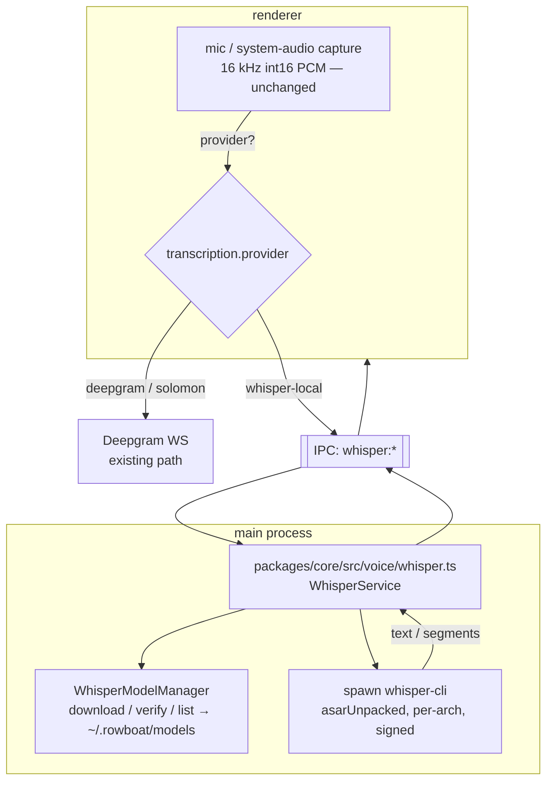
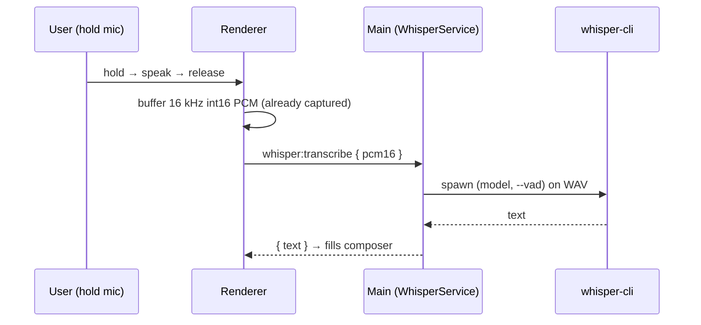

# RFC 009: Local On-Device Transcription (whisper.cpp)

|                  |                                                                                                                          |
| ---------------- | ------------------------------------------------------------------------------------------------------------------------ |
| **RFC**          | 009                                                                                                                      |
| **Status**       | Draft                                                                                                                    |
| **Track**        | Desktop · on-device AI (cost & privacy) — _independent of the cloud-workflows set (001–008)_                             |
| **Owners**       | `apps/x` (Electron: main + renderer + core)                                                                              |
| **Created**      | 2026-06-06                                                                                                               |
| **Last updated** | 2026-06-06                                                                                                               |
| **Depends on**   | none (new track)                                                                                                         |
| **Parent docs**  | [`docs/WHISPER_CPP_LOCAL_TRANSCRIPTION.md`](../../docs/WHISPER_CPP_LOCAL_TRANSCRIPTION.md) (research + integration plan) |

## Summary

Every word the desktop transcribes today is **billed** — speech-to-text streams to **Deepgram
`nova-3`** over a WebSocket, either with the user's own key or, for signed-in users, through the
**Solomon proxy** (which fronts Deepgram and bills us at ~**$0.0077/min** streaming). This RFC adds a
**local, on-device transcription engine** — [whisper.cpp](https://github.com/ggml-org/whisper.cpp)
(MIT, runs offline, GPU-accelerated) — as a first-class STT provider behind the existing provider
abstraction. It is **$0/min after a one-time model download**, **private** (audio never leaves the
device), and works **offline**.

The integration is small because the renderer **already captures exactly the audio whisper.cpp wants
(16 kHz mono int16 PCM)**; we add a main-process whisper service behind IPC and branch the existing
mic pipelines on a provider flag. We tier **by feature, not by plan**: voice input defaults to local
for everyone; meetings default to Deepgram (for diarization) with a free cloud quota that falls back
to local.

## Current state (grounded)

STT lives entirely in the **renderer** and streams to Deepgram; there is **no local option**.

| Capability                | Evidence                                                                                                                                                                                                                                                                                                                                                 |
| ------------------------- | -------------------------------------------------------------------------------------------------------------------------------------------------------------------------------------------------------------------------------------------------------------------------------------------------------------------------------------------------------- |
| Voice mode (push-to-talk) | `apps/x/apps/renderer/src/hooks/useVoiceMode.ts` — Deepgram `nova-3` params (`:9-20`), auth (proxy bearer vs direct key) (`:40-73`), Web Audio capture → **16 kHz mono int16 PCM** streamed as WS frames (`:171-194`), `submit()` returns the final transcript (`:198-206`)                                                                              |
| Meeting transcription     | `apps/x/apps/renderer/src/hooks/useMeetingTranscription.ts` — mic + **system audio via `getDisplayMedia` loopback** (`:237-246`), merged **stereo** PCM with mic-gating (`:328-380`), Deepgram `multichannel` + **`diarize`** (`:7-18`), speaker-labelled note written to `knowledge/Meetings/…` (`:391`), headphone detection + 2-min silence auto-stop |
| Two routes                | `apps/x/apps/renderer/src/lib/deepgram-listen-url.ts` — Solomon proxy `wss://…/deepgram/v1/listen` (bearer); else direct `wss://api.deepgram.com/v1/listen` (user key)                                                                                                                                                                                   |
| Voice config (keys)       | `apps/x/packages/core/src/voice/voice.ts:23-33` `getVoiceConfig()` reads `deepgram.json` / `elevenlabs.json` from `~/.rowboat/config`; IPC `voice:getConfig` (`apps/x/apps/main/src/ipc.ts:941`, typed `packages/shared/src/ipc.ts:688`)                                                                                                                 |
| TTS (out of scope)        | `voice.ts:35` `synthesizeSpeech` (ElevenLabs `eleven_flash_v2_5`); IPC `voice:synthesize` (`ipc.ts:944`)                                                                                                                                                                                                                                                 |
| Config root               | `apps/x/packages/core/src/config/config.ts:30` `WorkDir` (`~/.rowboat`) — where a `models/` dir would live                                                                                                                                                                                                                                               |

**Three facts that shape the design:**

1. **The captured audio (16 kHz mono int16 PCM) is exactly whisper.cpp's input** — no resampling for
   voice mode. A big head start.
2. **STT runs in the renderer (browser context); whisper.cpp is native C++ and must run in main/Node.**
   New path: renderer mic → **IPC** → main (whisper.cpp) → transcript back.
3. **Deepgram gives us streaming + diarization for free; whisper.cpp gives neither out of the box.**
   It's batch (near-real-time via chunking) and has no native multi-speaker diarization — the one
   real feature gap (meetings).

## Goals

- A **local STT provider** that transcribes fully on-device, selectable per the tiering policy.
- **Zero marginal cost** and **privacy/offline** operation for the highest-volume case (voice input).
- **Reuse** the existing mic-capture pipeline and provider abstraction — minimal renderer churn.
- **Robust packaging**: ship a signed binary that doesn't couple to Electron's Node ABI.
- Keep **Deepgram** as the default for meetings and as a fallback everywhere; nothing regresses.

## Non-Goals

- Replacing Deepgram entirely (it stays for diarized meetings and as fallback).
- On-device **diarization** in v1 (multi-speaker labels within a channel) — see Open Questions.
- Local **TTS** (ElevenLabs path is unchanged).
- A real-time interim-text experience equal to Deepgram's instant partials (local is near-real-time).

## Proposed design

### Architecture



The renderer keeps capturing audio; a `transcription.provider` flag selects Deepgram (existing WS) or
**`whisper-local`** (PCM → IPC → main). The main process owns whisper.cpp; the renderer never loads
native code.

### Engine & model strategy

- **Spawn the prebuilt `whisper-cli` binary** as a child process (parse `-oj` JSON / segments) —
  **not** a native Node addon. Rationale in [Alternatives](#alternatives-considered): a plain
  executable is **ABI-independent of Electron's Node** (no `electron-rebuild` on Electron upgrades),
  crash-isolated, and trivial to code-sign/notarize. We build the binaries ourselves per-arch in CI
  so they're signed (see [Packaging](#packaging--signing)).
- **Default model `base.en` (q5_0, ~150 MB)** — small download, faster-than-realtime on most
  hardware, decent English quality. Offer **`small.en`** (or `large-v3-turbo-q5_0`) as a
  higher-accuracy option; multilingual `base`/`small` only when needed.
- **Enable built-in Silero VAD** (`--vad`, whisper.cpp ≥ 1.7.6) to transcribe only speech segments —
  big speedup, cleaner chunk boundaries, fewer silence hallucinations.
- Models are **downloaded, not bundled** (keeps the installer small) to `~/.rowboat/models/`, verified
  by checksum, with progress + resume.

### New IPC contract

Typed in `packages/shared/src/ipc.ts`, handled in `apps/x/apps/main/src/ipc.ts` beside `voice:*`,
backed by a new `packages/core/src/voice/whisper.ts`:

```ts
// 'whisper:listModels'  → { models: Array<{ id; label; sizeMb; installed; recommended }> }
// 'whisper:downloadModel'  { id }  → { success; error? }   (+ 'whisper:downloadProgress' events: { id, receivedMb, totalMb })
// 'whisper:transcribe'  { pcm16: ArrayBuffer; sampleRate: 16000; model?: string; lang?: string }
//                        → { success; text?; segments?: Array<{ start; end; text }>; error? }
// 'whisper:capability'  → { supported: boolean; accel: 'metal'|'coreml'|'vulkan'|'cuda'|'cpu'; reason? }
// --- P2 streaming (meetings) ---
// 'whisper:startStream'  { model?; channels: 1|2 }  → { streamId }
// 'whisper:pushAudio'    { streamId; pcm16: ArrayBuffer }
// 'whisper:stopStream'   { streamId }   (+ 'whisper:streamPartial'/'streamFinal' events)
```

Errors return an **actionable code** (`model_not_installed`, `download_failed`,
`engine_unavailable`, `device_unsupported`) so the renderer switches on `code`, mirroring the cloud
error-code pattern in this codebase.

### Provider abstraction & config

Extend `VoiceConfig`/`getVoiceConfig` (`voice.ts:8-33`) and a new `transcription.json` (or a field on
the existing settings) with a **provider selector** rather than inferring from which key exists:

```ts
type TranscriptionProvider = "solomon" | "deepgram" | "whisper-local";
interface TranscriptionConfig {
  voiceProvider: TranscriptionProvider; // default per tiering (§ below)
  meetingProvider: TranscriptionProvider; // default 'solomon'/'deepgram'
  whisper?: { model: string }; // e.g. 'base.en-q5_0'
}
```

The renderer hooks (`useVoiceMode`, `useMeetingTranscription`) branch on the resolved provider: for
`whisper-local`, accumulate PCM and call `whisper:transcribe` (voice mode, batch on `submit()`) or
`whisper:startStream`/`pushAudio` (meetings, P2) instead of opening the Deepgram WS.

### Data flow

**Voice mode (push-to-talk) — batch, the ideal case:**



**Meeting mode (P2) — VAD-segmented near-real-time:** reuse the existing mic + `getDisplayMedia`
capture; route PCM to `whisper:startStream`; the service segments on silence (Silero VAD, ~5–30 s
windows) and emits partials/finals. Per-channel labels (`You` for mic ch0, `Other` for system ch1)
replace Deepgram's in-room diarization.

### Productization & tiering (who gets which engine)

Default **by feature, not by plan** (full rationale in the parent doc §9):

| Feature                        | Default engine                                           | Free                                                                              | Paid                                 |
| ------------------------------ | -------------------------------------------------------- | --------------------------------------------------------------------------------- | ------------------------------------ |
| **Voice input (push-to-talk)** | **Local (whisper.cpp)** for everyone, on capable devices | Local, unlimited                                                                  | Local default; cloud available       |
| **Meeting transcription**      | **Deepgram** (diarization + system audio)                | Cloud up to a monthly quota → then **local "no-diarization"** fallback, unlimited | Unlimited cloud                      |
| **Offline / privacy mode**     | Local                                                    | available                                                                         | available (some pay _for_ on-device) |

Principles: per-feature defaults; give free users a **capped taste** of premium meetings; local is a
**feature** (private/offline/unlimited), not a free-tier downgrade; **gate local on device
capability** (`whisper:capability`); keep **BYOK** (`deepgram.json`); and make the default
**remote-configurable** so we can A/B `free → local` vs `free → cloud-quota` against activation.

### Packaging & signing

- Place per-arch binaries under `apps/x/apps/main/resources/whisper/<platform>-<arch>/whisper-cli`
  and mark **`asarUnpack`** in `forge.config.cjs` (binaries can't execute from inside the asar);
  Forge's `auto-unpack-natives` covers any `.node`. **Statically link** ggml/whisper into the one
  binary to minimize Mach-O files to sign.
- **Build the binaries in CI per-arch** (mac arm64/x64, win x64, linux x64/arm64) and **sign with our
  Developer ID + hardened runtime, then notarize** — un-notarized helper Mach-O is Gatekeeper-blocked.
  Reuse the app's existing `osxSign` path (active when `APPLE_*` secrets are present).
- Default to **CPU/Vulkan** on Win/Linux (GPU best-effort; CUDA builds are large). The perf gate's
  `packagedAppSizeMb` budget easily absorbs a few-MB binary; models stay out of the package.

## Cost analysis

| Provider                    | Streaming $/min | $/hr   | Note                                           |
| --------------------------- | --------------- | ------ | ---------------------------------------------- |
| **Deepgram nova-3 (today)** | **$0.0077**     | $0.46  | billed via Solomon proxy for signed-in users   |
| OpenAI Whisper API (batch)  | $0.006          | $0.36  |                                                |
| **whisper.cpp (local)**     | **$0**          | **$0** | one-time ~150 MB DL; uses user CPU/GPU/battery |

~1 hr/day/user ≈ **$95–168/yr** of cloud spend; at **10k active users ≈ $1M+/yr** eliminated for
users who run local — plus privacy/offline. The tradeoff is the **user's** compute/battery and lower
accuracy/diarization than top cloud.

## Risks & mitigations

| Risk                                                   | Mitigation                                                                                      |
| ------------------------------------------------------ | ----------------------------------------------------------------------------------------------- |
| **Accuracy < cloud** (base.en weaker on accents/noise) | model tiers (`small`/`large-v3-turbo`); Deepgram fallback; VAD trims silence/hallucinations     |
| **Hardware variance** (weak CPU ≈ 0.3× realtime)       | `whisper:capability` gating; prefer cloud-with-quota on weak devices; show active engine        |
| **CPU/battery** under sustained use                    | GPU (Metal/Vulkan), small default model, VAD, thread throttle; meetings prefer cloud by default |
| **Model-download UX** (80 MB–1 GB)                     | progress + resume + checksum; never block app; reuse catalog-download pattern                   |
| **macOS notarization** of bundled Mach-O               | build + sign + notarize in CI; static-link to minimize surface                                  |
| **Diarization gap** (meetings)                         | per-channel You/Other labels; Deepgram default for diarized meetings                            |

## Test plan

**Core (`packages/core/src/voice/whisper.test.ts`, vitest — matches `cloud-workflows.test.ts` style):**

- `WhisperModelManager` resolves install state, verifies checksum, surfaces `download_failed`.
- `transcribe(fixtureWav)` against a tiny model returns expected text (golden, tolerance-matched).
- capability detection returns the right `accel`/`supported` per platform stub.

**Renderer (vitest/RTL):**

- provider = `whisper-local`: voice mode buffers PCM and calls `whisper:transcribe` on submit (no WS).
- `model_not_installed` / `device_unsupported` render the actionable state (offer download / fall back).
- Transcription settings: pick provider + model, download progress, size shown.

**E2E (Playwright-electron, extends the packaged-build smoke):**

- packaged app: download `base.en`, transcribe a fixture WAV through `whisper:transcribe`, assert text.
- voice-mode local round-trip fills the composer with the packaged binary (xvfb/headless on CI).

**Perf:** add a `whisper-cli` RTF micro-bench to the perf harness on a fixed clip; budget a max RTF.

## Acceptance criteria

- A user can choose **On-device (Whisper)** and transcribe voice input fully offline, $0/min.
- The default engine follows the tiering policy and is **remote-configurable**.
- Model download is resumable, verified, and never blocks the app.
- The bundled binary is **signed + notarized**; packaged-app E2E transcription passes on macOS.
- Deepgram remains the default for diarized meetings and the fallback everywhere; **no regression** to
  existing voice/meeting UX.

## Alternatives considered

- **Native Node addon** (`@kutalia/whisper-node-addon`, `smart-whisper`, `nodejs-whisper`) — rejected
  as the **primary** path: addons couple to Electron's Node ABI (rebuild per Electron upgrade) and
  complicate signing. `@kutalia` ships Electron-ready prebuilts with PCM streaming and is the **named
  fallback** if low-latency in-process streaming becomes a hard requirement (vendored + pinned;
  small-project bus-factor). `nodejs-whisper` compiles whisper.cpp at install (CI/packaging pain) and
  just shells to `whisper-cli` anyway; `smart-whisper` is stale (Oct 2024); `whisper-node` abandoned.
- **Bundle models in the installer** — rejected: 150 MB–3 GB bloat; download-on-first-use keeps the
  installer lean and lets users pick a tier.
- **Cloud-only (status quo)** — rejected: it's the cost/privacy problem this RFC exists to solve.
- **faster-whisper / Python sidecar** — rejected for a desktop app: shipping a Python runtime + CTranslate2
  is heavier to package/sign than a single C++ binary.
- **Strict free=local / paid=cloud split** — rejected in favor of **per-feature** defaults + a metered
  cloud taste, so we don't spend free-user first impressions on the weaker, hardware-variable engine
  (parent doc §9).

## Decisions

Resolved forks for this RFC:

- **Engine integration → spawn our own signed `whisper-cli` binary** (not a native addon). ABI-safe,
  crash-isolated, easy to notarize. `@kutalia/whisper-node-addon` is the documented fallback for
  in-process streaming.
- **Default model → `base.en` (q5_0, ~150 MB)** with `small.en` / `large-v3-turbo-q5_0` as tiers;
  **Silero VAD on**.
- **Tier by feature, not by plan** → voice input defaults local for all (capable devices); meetings
  default cloud with a free quota → local fallback; local offered to paid as privacy mode.
- **Default engine is remote-configurable** and A/B-tested against activation/conversion.
- **Models live in `~/.rowboat/models/`**, downloaded + checksum-verified on first use; never bundled.
- **Capability-gated** (`whisper:capability`): weak/unsupported devices fall back to cloud-with-quota.
- **v1 scope = voice mode (batch)**; meetings (VAD-segmented, per-channel labels) are **P2**;
  in-channel **diarization is out of v1**.
- **Deepgram stays** the default for diarized meetings and the universal fallback.

## Open questions

- **On-device diarization for meetings** — adopt a VAD + speaker-embedding pipeline (e.g.
  tinydiarize `-tdrz`, or pyannote offline) later, or keep meetings on cloud when diarization is
  wanted? (Leaning: cloud-for-diarization in v1; revisit.)
- **Quota mechanics** — where is the free meeting-minutes quota metered (proxy-side vs client), and
  what's the limit?
- **Warm process** — keep a long-lived `whisper-cli`/server warm to avoid model cold-start, or accept
  per-call spawn for batch? (Spike to measure.)
- **Windows/Linux GPU** — ship Vulkan by default, or CPU-only first and add GPU per-platform later?
