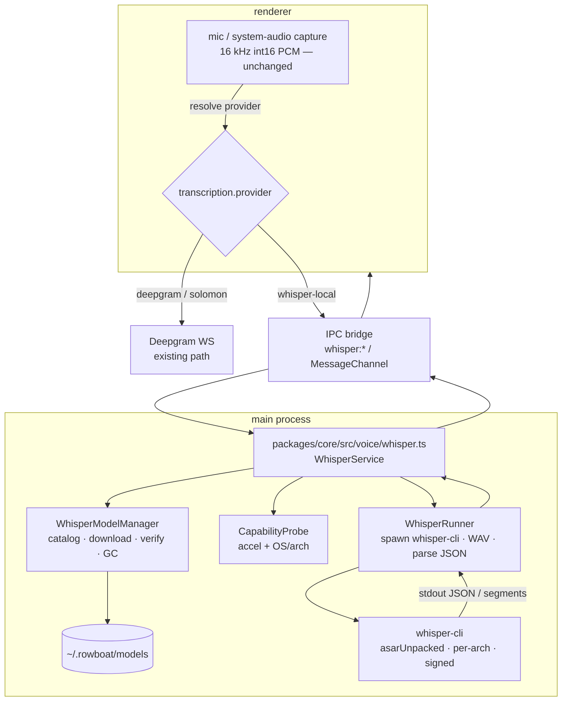
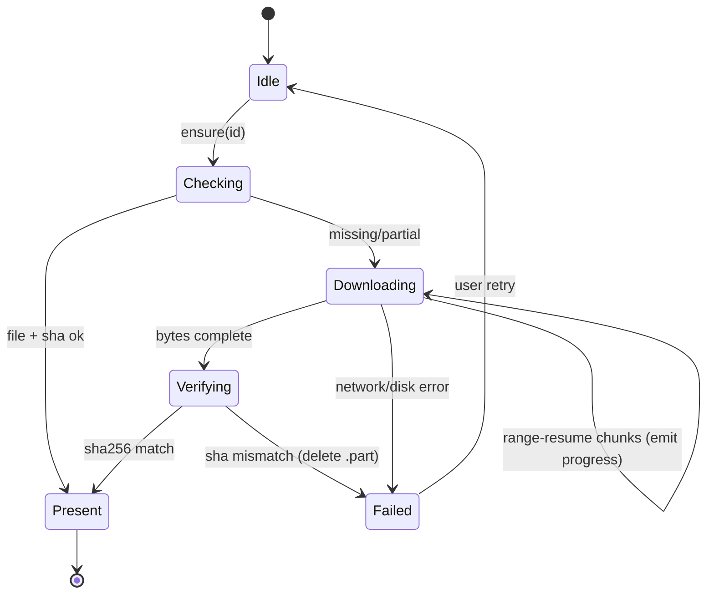
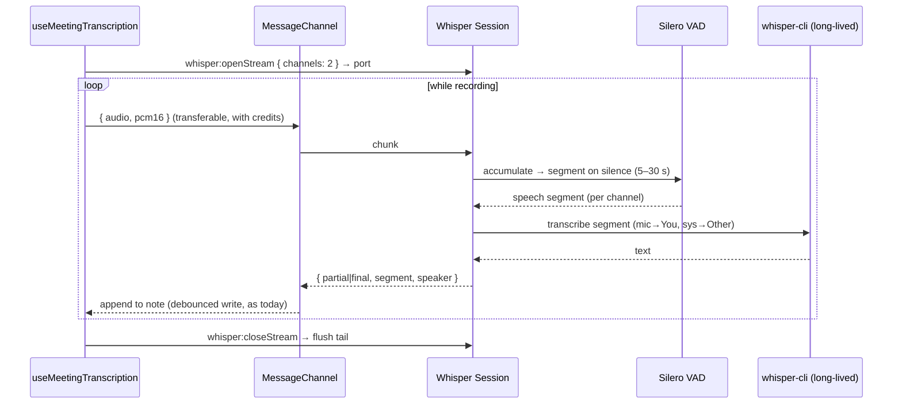

# RFC 009: Local On-Device Transcription (whisper.cpp)

|                  |                                                                                                                                                                               |
| ---------------- | ----------------------------------------------------------------------------------------------------------------------------------------------------------------------------- |
| **RFC**          | 009                                                                                                                                                                           |
| **Status**       | Draft                                                                                                                                                                         |
| **Track**        | Desktop · on-device AI (cost & privacy) — _independent of the cloud-workflows set (001–008)_                                                                                  |
| **Owners**       | `apps/x` (Electron: main + renderer + core)                                                                                                                                   |
| **Created**      | 2026-06-06                                                                                                                                                                    |
| **Last updated** | 2026-06-06                                                                                                                                                                    |
| **Depends on**   | none (new track)                                                                                                                                                              |
| **Parent docs**  | [`docs/WHISPER_CPP_LOCAL_TRANSCRIPTION.md`](../../docs/WHISPER_CPP_LOCAL_TRANSCRIPTION.md) (research + integration plan) · [`apps/x/ANALYTICS.md`](../../apps/x/ANALYTICS.md) |

## Table of contents

1. [Summary](#1-summary)
2. [Glossary](#2-glossary)
3. [Current state (grounded)](#3-current-state-grounded)
4. [Goals, non-goals, success metrics](#4-goals-non-goals-success-metrics)
5. [Background: how whisper.cpp works](#5-background-how-whispercpp-works)
6. [High-level architecture](#6-high-level-architecture)
7. [Component breakdown](#7-component-breakdown)
8. [The `whisper-cli` invocation](#8-the-whisper-cli-invocation)
9. [Model manager](#9-model-manager)
10. [Audio pipeline & IPC transport](#10-audio-pipeline--ipc-transport)
11. [Full IPC contract](#11-full-ipc-contract)
12. [Provider abstraction & config](#12-provider-abstraction--config)
13. [Capability detection](#13-capability-detection)
14. [Voice mode (P1) — batch flow](#14-voice-mode-p1--batch-flow)
15. [Meeting mode (P2) — streaming flow](#15-meeting-mode-p2--streaming-flow)
16. [Tiering, quota & entitlements](#16-tiering-quota--entitlements)
17. [Settings UI](#17-settings-ui)
18. [Error taxonomy](#18-error-taxonomy)
19. [Telemetry](#19-telemetry)
20. [Packaging, build & signing](#20-packaging-build--signing)
21. [Security & privacy](#21-security--privacy)
22. [Performance: budgets & benchmarking](#22-performance-budgets--benchmarking)
23. [Cost analysis](#23-cost-analysis)
24. [Risks & mitigations](#24-risks--mitigations)
25. [Rollout plan](#25-rollout-plan)
26. [Implementation plan (work packages)](#26-implementation-plan-work-packages)
27. [Test plan](#27-test-plan)
28. [Acceptance criteria](#28-acceptance-criteria)
29. [Alternatives considered](#29-alternatives-considered)
30. [Decisions](#30-decisions)
31. [Open questions](#31-open-questions)
32. [Appendix A — `whisper-cli` flag reference](#appendix-a--whisper-cli-flag-reference)
33. [Appendix B — model catalog](#appendix-b--model-catalog)
34. [Appendix C — JSON output schema](#appendix-c--json-output-schema)
35. [Appendix D — sample code](#appendix-d--sample-code)
36. [References](#references)

---

## 1. Summary

Every word the desktop transcribes today is **billed** — speech-to-text streams to **Deepgram
`nova-3`** over a WebSocket, either with the user's own key or, for signed-in users, through the
**Solomon proxy** (which fronts Deepgram and bills us at ~**$0.0077/min** streaming). This RFC adds a
**local, on-device transcription engine** — [whisper.cpp](https://github.com/ggml-org/whisper.cpp)
(MIT, offline, GPU-accelerated) — as a first-class STT provider behind the existing provider
abstraction. It costs **$0/min after a one-time model download**, is **private** (audio never leaves
the device), and works **offline**.

The integration is small because the renderer **already captures exactly the audio whisper.cpp wants
(16 kHz mono int16 PCM)**. We add a main-process whisper service behind IPC, branch the existing mic
pipelines on a `transcription.provider` flag, ship a **signed `whisper-cli` binary** per-arch, and a
**model manager**. We tier **by feature, not by plan**: voice input defaults to local for everyone;
meetings default to Deepgram (for diarization) with a free cloud quota that falls back to local.

**Scope:** P1 = voice mode (batch, full parity). P2 = meeting transcription (VAD-segmented streaming,
per-channel labels). On-device multi-speaker diarization is out of v1.

---

## 2. Glossary

| Term              | Meaning                                                                                                     |
| ----------------- | ----------------------------------------------------------------------------------------------------------- |
| **STT**           | Speech-to-text (transcription).                                                                             |
| **PCM**           | Pulse-code-modulated raw audio samples. We use **16 kHz, mono, signed 16-bit little-endian** (`pcm_s16le`). |
| **RTF**           | Real-time factor = audio-seconds processed ÷ wall-seconds. RTF > 1 means faster than realtime.              |
| **GGUF / GGML**   | The tensor file/format whisper.cpp loads models from (successor to the old `ggml` format).                  |
| **Quantization**  | Reduced-precision weights (`q5_0`, `q5_1`, `q8_0`) → smaller files / RAM, slight accuracy loss.             |
| **VAD**           | Voice-activity detection — finds speech segments; whisper.cpp ships **Silero VAD** as a GGUF model.         |
| **Diarization**   | Labelling _who_ spoke (Speaker 1/2/…). Deepgram does it live; whisper.cpp does not natively.                |
| **Core ML / ANE** | Apple's on-device ML runtime / Neural Engine — accelerates the Whisper encoder ~3× on Apple Silicon.        |
| **`whisper-cli`** | whisper.cpp's command-line binary (formerly `main`). We spawn it.                                           |
| **WER**           | Word error rate — transcription accuracy metric (lower is better).                                          |

---

## 3. Current state (grounded)

STT lives entirely in the **renderer** and streams to Deepgram; there is **no local option**.

| Capability                | Evidence                                                                                                                                                                                                                                                                                                                                        |
| ------------------------- | ----------------------------------------------------------------------------------------------------------------------------------------------------------------------------------------------------------------------------------------------------------------------------------------------------------------------------------------------- |
| Voice mode (push-to-talk) | `apps/x/apps/renderer/src/hooks/useVoiceMode.ts` — Deepgram `nova-3` params (`:9-20`), auth (proxy bearer vs direct key) (`:40-73`), Web Audio capture → **16 kHz mono int16 PCM** streamed as WS frames (`:171-194`), `submit()` returns final transcript (`:198-206`)                                                                         |
| Meeting transcription     | `apps/x/apps/renderer/src/hooks/useMeetingTranscription.ts` — mic + **system audio via `getDisplayMedia` loopback** (`:237-246`), merged **stereo** PCM with mic-gating (`:328-380`), Deepgram `multichannel` + **`diarize`** (`:7-18`), speaker-labelled note → `knowledge/Meetings/…` (`:391`), headphone detection + 2-min silence auto-stop |
| Two routes                | `apps/x/apps/renderer/src/lib/deepgram-listen-url.ts` — Solomon proxy `wss://…/deepgram/v1/listen` (bearer); else direct `wss://api.deepgram.com/v1/listen` (user key)                                                                                                                                                                          |
| Voice config (keys)       | `apps/x/packages/core/src/voice/voice.ts:23-33` `getVoiceConfig()` reads `deepgram.json`/`elevenlabs.json` from `~/.rowboat/config`; IPC `voice:getConfig` (`apps/x/apps/main/src/ipc.ts:941`, typed `packages/shared/src/ipc.ts:688`)                                                                                                          |
| TTS (out of scope)        | `voice.ts:35` `synthesizeSpeech` (ElevenLabs `eleven_flash_v2_5`); IPC `voice:synthesize` (`ipc.ts:944`)                                                                                                                                                                                                                                        |
| Config root               | `apps/x/packages/core/src/config/config.ts:30` `WorkDir` (`~/.rowboat`) — where a `models/` dir would live                                                                                                                                                                                                                                      |
| Preload IPC bridge        | `apps/x/apps/preload/src/preload.ts` — `window.ipc.invoke<K>(channel, args)` (validated), `ipc.on`, `ipc.send`; `contextBridge.exposeInMainWorld('ipc', …)`                                                                                                                                                                                     |
| Packaging                 | `apps/x/apps/main/forge.config.cjs` — esbuild-bundled main; `generateAssets` hook stages `.package/`; `osxSign` + `osxNotarize` when `APPLE_*` set; **already declares `NSAudioCaptureUsageDescription`** + `entitlements.plist` (`com.apple.security.device.audio-input`, `screen-capture`, `cs.allow-jit`)                                    |
| Analytics                 | `apps/x/ANALYTICS.md` — PostHog (`posthog-js` renderer + `posthog-node` main, shared distinct_id); `voice_input_started` event; `chat_message_sent { voice_input, voice_output }`; `llm_usage` per feature                                                                                                                                      |

**Five facts that shape the design:**

1. **The captured audio (16 kHz mono int16 PCM) is exactly whisper.cpp's input** — no resampling for
   voice mode. A big head start.
2. **STT runs in the renderer (browser context); whisper.cpp is native C++ → must run in main/Node.**
   New path: renderer mic → **IPC** → main (whisper.cpp) → transcript back.
3. **Deepgram gives us streaming + diarization for free; whisper.cpp gives neither.** Batch
   (near-real-time via chunking), no native multi-speaker diarization — the one real feature gap.
4. **macOS audio entitlements already exist** (`audio-input`, `screen-capture`) — meeting capture is
   solved; we only add the _engine_.
5. **The app already has a model-catalog/download idiom** (LLM models settings, `models.dev.json`
   cache) — we mirror it for whisper models.

---

## 4. Goals, non-goals, success metrics

### Goals

- A **local STT provider** that transcribes fully on-device, selectable per the tiering policy.
- **Zero marginal cost** + **privacy/offline** for the highest-volume case (voice input).
- **Reuse** the existing mic-capture pipeline and provider abstraction — minimal renderer churn.
- **Robust packaging**: a signed binary that doesn't couple to Electron's Node ABI.
- Keep **Deepgram** as the default for diarized meetings and the universal fallback; nothing regresses.

### Non-goals

- Replacing Deepgram entirely.
- On-device **diarization** in v1 (multi-speaker labels within a channel).
- Local **TTS** (ElevenLabs path unchanged).
- Interim-text latency equal to Deepgram's instant partials (local is near-real-time).
- Mobile / non-desktop.

### Success metrics (instrumented — §19)

| Metric                                                                            | Target                 |
| --------------------------------------------------------------------------------- | ---------------------- |
| Voice-mode local availability (capable devices that complete a transcribe)        | ≥ 95%                  |
| Voice-mode local **median RTF** (`base.en`, capable device)                       | ≥ 3× realtime          |
| Voice-mode local **p95 end-to-end latency** (release → text) for a 10 s utterance | ≤ 1.5 s                |
| Local **WER** vs Deepgram on the eval set (`base.en` / `small.en`)                | within +8% / +4%       |
| **Fallback rate** to cloud (capability or error)                                  | ≤ 5%                   |
| Estimated **cloud-minute reduction** from local voice input                       | ≥ 60% of voice minutes |

---

## 5. Background: how whisper.cpp works

Whisper is an encoder-decoder transformer operating on **30-second** mel-spectrogram windows. Key
properties that drive our design:

- **Chunked, not truly streaming.** Audio is processed in 30 s contexts; "streaming" is a
  sliding-window approximation (re-transcribe the recent window every ~step). → batch is the natural
  fit; streaming needs chunking (§15).
- **Greedy vs beam search.** `whisper-cli` defaults to a small beam; `-bs`/`-bo` trade speed for
  accuracy. **Temperature fallback** (`--temperature` + `--no-fallback` to disable) re-decodes
  low-confidence segments. We use defaults for v1.
- **Threads & processors.** `-t <n_threads>` (CPU threads) and `-p <n_processors>` (split audio into
  N parallel chunks). We size `-t` to `min(8, physicalCores-1)` to leave headroom.
- **Acceleration.** CPU (AVX2/NEON) + **Metal + Core ML** on macOS, **CUDA/Vulkan/OpenVINO** else.
  Flash attention on by default (≥ v1.8.0). Core ML needs a sidecar `…-encoder.mlmodelc` (§9).
- **VAD (Silero, GGUF) ≥ v1.7.6** via `--vad --vad-model <path>` — transcribe only speech segments;
  big speedup, fewer hallucinations on silence.
- **Language.** `-l en` (fixed) or `-l auto` (detect). We pin `en` for `.en` models.
- **Timestamps.** Segment timestamps by default; word/token timestamps via `-ml 1`/`--output-json-full`.
- **Hallucination on non-speech** is a known failure mode → always run with VAD and trim silence.

---

## 6. High-level architecture



The renderer keeps capturing audio; `transcription.provider` selects Deepgram (existing WS) or
`whisper-local` (PCM → bridge → main). The main process owns whisper.cpp; the renderer never loads
native code. The bridge is `ipc.invoke` for batch and a one-time **`MessageChannel`** for streaming
(§10).

---

## 7. Component breakdown

All new TS lives under `apps/x/packages/core/src/voice/whisper/` (built into the esbuild main bundle);
new IPC handlers in `apps/x/apps/main/src/ipc.ts`; shared types in `apps/x/packages/shared/src/`.

| Module                                                            | Responsibility                                                                      | Key API (sketch)                                                      |
| ----------------------------------------------------------------- | ----------------------------------------------------------------------------------- | --------------------------------------------------------------------- |
| `whisper/service.ts`                                              | Facade the IPC layer calls; orchestrates model + runner; owns streaming sessions    | `transcribe(req)`, `openStream(opts)`, `listModels()`, `capability()` |
| `whisper/model-manager.ts`                                        | Catalog, download (resume + checksum), list/verify/GC, Core ML sidecar              | `list()`, `ensure(id, onProgress)`, `pathFor(id)`, `remove(id)`       |
| `whisper/runner.ts`                                               | Build args, write temp WAV, `spawn` `whisper-cli`, parse JSON, map errors, timeouts | `run(wavPath, opts) → Result`                                         |
| `whisper/capability.ts`                                           | Detect OS/arch + accel; cache; decide local-eligibility                             | `probe() → Capability`                                                |
| `whisper/streaming.ts`                                            | VAD-segmented chunker for meetings; session lifecycle; partial/final emit           | `Session.push(pcm)`, `Session.close()`                                |
| `whisper/wav.ts`                                                  | int16 PCM ↔ WAV (44-byte header), mono/stereo deinterleave                          | `pcm16ToWav(buf, {rate, channels})`                                   |
| `whisper/bin.ts`                                                  | Resolve the per-arch `whisper-cli` path (packaged vs dev), exec perms               | `binaryPath()`                                                        |
| `whisper/catalog.ts`                                              | Static model catalog (id, label, size, sha256, url, accel hints)                    | `CATALOG: ModelEntry[]`                                               |
| `voice.ts` _(extend)_                                             | `TranscriptionConfig` + resolver; keep Deepgram/ElevenLabs                          | `getTranscriptionConfig()`                                            |
| renderer `useVoiceMode` / `useMeetingTranscription` _(extend)_    | Branch on resolved provider                                                         | —                                                                     |
| renderer `components/settings/transcription-settings.tsx` _(new)_ | Provider + model picker, download UI                                                | —                                                                     |

---

## 8. The `whisper-cli` invocation

We **write a temp WAV** (16 kHz mono/stereo, 16-bit) to the OS temp dir and pass it via `-f`; parse
`-oj` JSON from a sidecar file (or `--output-json-full` for word timestamps). Temp files are written
to a per-run dir under `app.getPath('temp')` and **unlinked in a `finally`** (§21).

**Batch (voice mode):**

```
whisper-cli \
  -m  ~/.rowboat/models/ggml-base.en-q5_1.bin \
  -f  /tmp/rowboat-whisper-<uuid>/in.wav \
  -l  en \
  -t  7 \
  --vad --vad-model ~/.rowboat/models/ggml-silero-v5.1.2.bin \
  -oj -of /tmp/rowboat-whisper-<uuid>/out \   # writes out.json
  -nt -np                                      # no in-line timestamps, no progress prints
```

- macOS: if `…-encoder.mlmodelc` sits next to the model, whisper.cpp auto-uses Core ML (no flag).
  Add `-ng` only to force CPU (debug). Vulkan/CUDA builds auto-detect; `--gpu-device` selects one.
- **Timeout:** kill after `max(15s, 3× audioSeconds)`; emit `engine_timeout`.
- **Exit codes:** `0` ok; non-zero → capture stderr, classify into the error taxonomy (§18).
- **Concurrency:** a per-process **semaphore of 1** for batch (transcription is CPU/GPU-heavy); queue
  extra requests. Streaming sessions get their own long-lived process (§15).

The parsed result (Appendix C) yields `text` (joined segments) + `segments[]` (start/end/text).

---

## 9. Model manager

### Catalog (`whisper/catalog.ts`)

```ts
interface ModelEntry {
  id: string; // 'base.en-q5_1'
  label: string; // 'Base · English (recommended)'
  family: "tiny" | "base" | "small" | "medium" | "large-v3" | "large-v3-turbo";
  english: boolean;
  quant: "f16" | "q5_0" | "q5_1" | "q8_0";
  sizeMb: number; // download size
  sha256: string; // from the whisper.cpp models manifest — DO NOT invent; pull at build time
  url: string; // HF resolve URL (below)
  coreml?: { url: string; sha256: string }; // optional macOS encoder sidecar
  recommendedDefault?: boolean;
}
```

- **Source:** Hugging Face `ggerganov/whisper.cpp`:
  `https://huggingface.co/ggerganov/whisper.cpp/resolve/main/ggml-<name>.bin`
  (e.g. `ggml-base.en-q5_1.bin`); Silero VAD: `ggml-silero-v5.1.2.bin`.
- **SHA256 must come from the repo manifest**, captured into the catalog at build time (a small CI
  script), never hand-typed. Mismatch → reject + delete partial.
- We may **mirror** to our own CDN to avoid HF rate-limits/availability (Open Question §31).

### Download flow



- **Resumable:** download to `…/models/<id>.bin.part`; `HTTP Range` resume from `.part` length;
  **atomic rename** to `<id>.bin` only after checksum passes.
- **Disk guard:** check free space ≥ `sizeMb × 1.2` before starting; else `insufficient_disk`.
- **Concurrency:** one download per `id`; coalesce duplicate `ensure(id)` calls onto one promise.
- **GC:** `remove(id)`; offer "remove unused models" in settings; never auto-delete the active model.
- **Core ML sidecar (macOS):** download/unzip `…-encoder.mlmodelc` next to the model; first run does a
  one-time on-device ANE compile (note the cold-start in UX).
- **Layout:**

```
~/.rowboat/models/
  ggml-base.en-q5_1.bin
  ggml-base.en-q5_1.bin.part          # transient
  ggml-base.en-encoder.mlmodelc/      # macOS only
  ggml-silero-v5.1.2.bin              # VAD
  .catalog-state.json                 # {installed, lastVerifiedAt, sizes}
```

---

## 10. Audio pipeline & IPC transport

### Format

Renderer capture is **16 kHz, mono, `pcm_s16le`** (voice) or **2-channel interleaved** (meetings) —
already produced by `useVoiceMode`/`useMeetingTranscription`. whisper.cpp wants **mono f32** internally
but `whisper-cli` reads a standard **16-bit WAV**, so `whisper/wav.ts` writes a 44-byte RIFF header +
the int16 samples. For stereo meetings we **deinterleave** and transcribe mic (ch0) and system (ch1)
as **two separate mono passes** (→ "You" / "Other" labels), since whisper.cpp has no multichannel.

### Transport

| Path                     | Mechanism                                                                                                                                                                                      | Why                                                                             |
| ------------------------ | ---------------------------------------------------------------------------------------------------------------------------------------------------------------------------------------------- | ------------------------------------------------------------------------------- |
| **Batch (voice)**        | `window.ipc.invoke('whisper:transcribe', { pcm16: ArrayBuffer })`                                                                                                                              | One structured-clone copy of a few MB on `submit()` — fine.                     |
| **Streaming (meetings)** | a **`MessageChannel`** opened once via `whisper:openStream` → renderer posts PCM chunks on the port (`postMessage(buf, [buf])`, **transferable** = zero-copy); main posts back partials/finals | Avoids per-chunk structured-clone copies; backpressure via an ack/credit scheme |

> **Why not stream every chunk through `ipc.invoke`?** Each `invoke` structured-clones the buffer
> (copy) and serializes through the main event loop. For continuous meeting audio that's wasteful; a
> dedicated `MessagePort` with **transferable** `ArrayBuffer`s is the standard Electron pattern.

**Backpressure:** the renderer holds a small credit window (e.g. 3 chunks); main acks after each
segment is enqueued. If credits hit 0 (engine slower than realtime), the renderer **drops to a longer
chunk** or surfaces "transcription is behind" rather than growing an unbounded buffer.

**Memory:** a 30 s mono 16 kHz int16 buffer ≈ 960 KB; cap any in-flight buffer at ~60 s and flush.

---

## 11. Full IPC contract

Typed in `packages/shared/src/ipc.ts` (validated by the existing zod-style schema the preload uses),
handled in `apps/x/apps/main/src/ipc.ts` beside `voice:*`.

```ts
// ---- discovery / capability ----
'whisper:capability': {
  req: null;
  res: { supported: boolean; accel: 'coreml'|'metal'|'cuda'|'vulkan'|'cpu'; cores: number; reason?: string };
};

// ---- models ----
'whisper:listModels': {
  req: null;
  res: { models: Array<{ id: string; label: string; sizeMb: number; installed: boolean; recommended: boolean }> };
};
'whisper:ensureModel': { req: { id: string }; res: { success: boolean; code?: WhisperErrorCode } };
'whisper:removeModel': { req: { id: string }; res: { success: boolean } };
// event (ipc.on): 'whisper:modelProgress' → { id; receivedMb; totalMb; phase: 'download'|'verify' }

// ---- batch transcription ----
'whisper:transcribe': {
  req: { pcm16: ArrayBuffer; sampleRate: 16000; channels: 1|2; model?: string; lang?: string };
  res: {
    success: boolean;
    text?: string;
    segments?: Array<{ start: number; end: number; text: string; speaker?: 'you'|'other' }>;
    rtf?: number; durationMs?: number;
    code?: WhisperErrorCode; message?: string;
  };
};

// ---- streaming transcription (P2) ----
'whisper:openStream': { req: { model?: string; channels: 1|2 }; res: { streamId: string; port: MessagePortMain } };
// over the MessagePort: renderer→main { type:'audio'; pcm16: ArrayBuffer } (transferable)
//                       main→renderer { type:'partial'|'final'; segment } / { type:'ack'; credits }
'whisper:closeStream': { req: { streamId: string }; res: { success: boolean } };

type WhisperErrorCode =
  | 'engine_unavailable' | 'device_unsupported' | 'model_not_installed'
  | 'download_failed' | 'checksum_mismatch' | 'insufficient_disk'
  | 'engine_timeout' | 'engine_crashed' | 'audio_invalid' | 'busy';
```

Every failure returns a **code** (not a parsed message), mirroring the cloud error-code pattern. The
renderer switches on `code` to pick the recovery action (§18).

---

## 12. Provider abstraction & config

Extend `voice.ts` (`:8-33`) with an explicit provider selector instead of inferring from which key
exists. New `~/.rowboat/config/transcription.json`:

```ts
type TranscriptionProvider = "solomon" | "deepgram" | "whisper-local";

interface TranscriptionConfig {
  voiceProvider: TranscriptionProvider; // default resolved by tiering + capability (§16)
  meetingProvider: TranscriptionProvider; // default 'solomon'/'deepgram'
  whisper: { model: string }; // e.g. 'base.en-q5_1'
}

// Resolution (main): remoteDefault → user override → capability gate → fallback
async function resolveVoiceProvider(): Promise<TranscriptionProvider> {
  const cfg = await getTranscriptionConfig(); // user override
  const remote = await getRemoteDefault("voiceProvider"); // remote-config (§16/§25)
  const want = cfg.voiceProvider ?? remote ?? "whisper-local";
  if (want === "whisper-local") {
    const cap = await capability();
    if (!cap.supported) return signedIn() ? "solomon" : "deepgram"; // graceful fallback
  }
  return want;
}
```

Renderer hooks call a new IPC `transcription:getResolvedProvider` (or piggyback `voice:getConfig`) and
branch:

- `deepgram`/`solomon` → existing WS path (unchanged).
- `whisper-local` → buffer PCM → `whisper:transcribe` (voice) / `whisper:openStream` (meeting).

Back-compat: if `transcription.json` is absent, derive defaults from the current `deepgram.json`
presence + sign-in state, so existing users see no change until they opt in or the remote default
flips.

---

## 13. Capability detection

Local is only defaulted **on** where it'll be good. `whisper/capability.ts`:

```mermaid
flowchart TD
    S[probe()] --> OS{platform/arch}
    OS -->|darwin arm64| ML[accel = coreml<br/>supported = true]
    OS -->|darwin x64| MET[accel = metal? else cpu]
    OS -->|win/linux| GPU{Vulkan/CUDA available?}
    GPU -->|yes| VK[accel = vulkan/cuda<br/>supported = true]
    GPU -->|no| CPU{physicalCores ≥ 4?}
    CPU -->|yes| CPUOK[accel = cpu<br/>supported = true · warn 'may be slow']
    CPU -->|no| WEAK[accel = cpu<br/>supported = false → prefer cloud]
```

- **Detection approach:** read `os.cpus()`/arch; for GPU, run a **one-time `whisper-cli --help`/tiny
  self-test** that reports the active backend (cache the result in `.catalog-state.json`). Avoid heavy
  probing on every launch.
- **Outcome** feeds `resolveVoiceProvider` (§12): `supported=false` → fall back to cloud; `supported`
  but `cpu` on a weak machine → allow but show a "may be slow; uses battery" note and prefer a smaller
  model.

---

## 14. Voice mode (P1) — batch flow

```mermaid
sequenceDiagram
    participant U as User
    participant Rnd as useVoiceMode
    participant Main as WhisperService
    participant CLI as whisper-cli
    U->>Rnd: hold mic, speak, release
    Rnd->>Rnd: buffer 16 kHz int16 PCM (existing capture)
    Note over Rnd: optional client VAD trims leading/trailing silence
    Rnd->>Main: whisper:transcribe { pcm16, model }
    Main->>Main: ensureModel(model) (no-op if present)
    Main->>Main: wav.pcm16ToWav → temp.wav
    Main->>CLI: spawn (-m, -f, --vad, -oj)
    CLI-->>Main: out.json (segments)
    Main->>Main: unlink temp; compute rtf
    Main-->>Rnd: { text, rtf } → fill composer
```

Renderer state machine (mirrors today's `idle → listening → submit`), with whisper additions:

```
idle ──start()──▶ listening ──submit()──▶ transcribing ──ok──▶ idle (text)
                       │                        └──err/code──▶ idle (toast + fallback offer)
                       └──cancel()──▶ idle
```

- The `listening` UX is **unchanged** (no live interim from local in v1 — show a recording indicator;
  text appears on release). Optional: show a spinner during `transcribing` for long utterances.
- If `whisper:transcribe` returns `model_not_installed` on first use → prompt to download (or
  background-download the default at onboarding).

---

## 15. Meeting mode (P2) — streaming flow

Reuse the existing mic + `getDisplayMedia` capture (`useMeetingTranscription`); route PCM to a
streaming session instead of Deepgram.



- **Segmentation:** Silero VAD finds speech; we cut on ≥ ~700 ms silence, cap segments at ~30 s, and
  transcribe each as it closes → near-real-time finals (no unstable sliding-window partials in v1).
- **Per-channel labels:** mic channel → `You`; system channel → `Other`. (Deepgram's in-room
  `Speaker N` diarization is **not** reproduced — Decision §30, Open Question §31.)
- **Reuse** the existing note format/path, headphone gating, and 2-min silence auto-stop verbatim;
  only the transcript _source_ changes.

---

## 16. Tiering, quota & entitlements

Default **by feature, not by plan** (rationale in parent doc §9).

| Feature                        | Default engine                                           | Free                                                                              | Paid                                 |
| ------------------------------ | -------------------------------------------------------- | --------------------------------------------------------------------------------- | ------------------------------------ |
| **Voice input (push-to-talk)** | **Local (whisper.cpp)** for everyone, on capable devices | Local, unlimited                                                                  | Local default; cloud available       |
| **Meeting transcription**      | **Deepgram** (diarization + system audio)                | Cloud up to a monthly quota → then **local "no-diarization"** fallback, unlimited | Unlimited cloud                      |
| **Offline / privacy mode**     | Local                                                    | available                                                                         | available (some pay _for_ on-device) |

**Quota mechanics (leaning):** meter **server-side at the Solomon proxy** (it already fronts Deepgram
and authenticates the user), exposing remaining minutes via the account/config payload the desktop
already fetches (`useSolomonAccount`). The desktop reads `meetingMinutesRemaining`; at 0 it switches
`meetingProvider → whisper-local` and shows "Free cloud minutes used — switched to on-device." BYOK
users (own `deepgram.json`) bypass the quota at their own cost.

**Remote-config** (so we can A/B without a release): the account/config payload carries
`transcriptionDefaults: { voiceProvider, meetingProvider, freeMeetingMinutes }`. Local user overrides
(settings) win over remote; remote wins over the hardcoded fallback. See §25.

**Entitlement check:** `isSignedIn()` + plan from the account payload decides quota size; **no new
billing primitives** in v1 (reuse the proxy's existing per-user context).

---

## 17. Settings UI

New **Transcription** section in `settings-dialog.tsx` (sibling of the Models tab), component
`components/settings/transcription-settings.tsx`:

```
┌─ Transcription ─────────────────────────────────────────────┐
│                                                              │
│  Voice input                                                 │
│   ◉ On-device (Whisper)   private · offline · free           │
│   ○ Cloud (Deepgram)      most accurate                      │
│                                                              │
│   Model   [ Base · English (recommended) ▾ ]   142 MB ✓      │
│            Small · English                     466 MB  ⬇ Get │
│                                                              │
│   Device  Apple Silicon · Core ML  ·  ~10× realtime          │
│                                                              │
│  Meetings                                                    │
│   ◉ Cloud (Deepgram)  speaker labels · 180 free min left     │
│   ○ On-device         private · no speaker labels            │
│                                                              │
│  [ Manage models… ]   1 installed · 142 MB · Remove unused   │
└──────────────────────────────────────────────────────────────┘
```

- Model dropdown shows install state + size; "Get" triggers `whisper:ensureModel` with a progress bar
  (`whisper:modelProgress`).
- **Device** line surfaces the capability probe (accel + rough speed); on a weak device it reads "CPU
  only · may be slow" and nudges toward Cloud.
- Changing a setting writes `transcription.json` and emits a `voice:configChanged` event so warm hooks
  refresh.

---

## 18. Error taxonomy

Each error returns a `code`; the renderer maps it to a label + recovery action.

| `code`                | Cause                    | User label / action                                                           |
| --------------------- | ------------------------ | ----------------------------------------------------------------------------- |
| `device_unsupported`  | weak CPU, no GPU         | "On-device transcription isn't fast enough on this device." → switch to Cloud |
| `engine_unavailable`  | binary missing/exec-perm | "Transcription engine unavailable." → fall back to Cloud; log for support     |
| `model_not_installed` | model absent             | "Download the Whisper model to transcribe on-device." → **Download**          |
| `download_failed`     | network/disk             | "Couldn't download the model." → **Retry**                                    |
| `checksum_mismatch`   | corrupt download         | "Model download was corrupted; re-downloading." → auto-retry once             |
| `insufficient_disk`   | < size×1.2 free          | "Not enough disk space for this model (needs ~150 MB)."                       |
| `engine_timeout`      | RTF too low / hang       | "Transcription took too long." → fall back to Cloud for this utterance        |
| `engine_crashed`      | non-zero exit            | "Transcription failed." → retry once, then Cloud fallback                     |
| `audio_invalid`       | empty/garbled PCM        | silently no-op (no toast)                                                     |
| `busy`                | semaphore held           | queue; never user-facing                                                      |

**Fallback policy:** on `device_unsupported`/`engine_unavailable`/`engine_timeout`, transparently use
the cloud path for that request (if available) and record `fallback=true` in telemetry (§19).

---

## 19. Telemetry

PostHog, following `ANALYTICS.md` (privacy: **never** log audio or transcript text). New events
(renderer via `posthog-js`; engine-side timings forwarded over IPC):

| Event                            | Properties                                                               | When                         |
| -------------------------------- | ------------------------------------------------------------------------ | ---------------------------- |
| `transcription_started`          | `{ provider, mode: 'voice'\|'meeting', model? }`                         | start of a transcribe/stream |
| `transcription_completed`        | `{ provider, mode, model?, audio_ms, latency_ms, rtf, accel, fallback }` | success                      |
| `transcription_failed`           | `{ provider, mode, code }`                                               | error                        |
| `whisper_model_downloaded`       | `{ id, size_mb, duration_ms }`                                           | model fetched                |
| `transcription_provider_changed` | `{ feature, from, to, reason: 'user'\|'quota'\|'capability' }`           | default/override change      |

Extend the existing `chat_message_sent { voice_input }` with `voice_input_provider`. **Person property**
`transcription_engine_pref`. No content, durations only — auditable against the privacy stance.

---

## 20. Packaging, build & signing

### Where the binary lives

Ship per-arch `whisper-cli` (+ the Silero VAD GGUF, since it's small and always needed) as an
**`extraResource`** so it lands in `…/Resources/` **outside the asar** (executables can't run from
inside asar). `forge.config.cjs` additions:

```js
// packagerConfig
extraResource: [
  // staged per-arch in the generateAssets hook → resources/whisper/<platform>-<arch>/
  path.join(__dirname, '.package', 'whisper'),
],
```

Stage the right arch in the existing `generateAssets(forgeConfig, platform, arch)` hook (it already
receives `arch`): copy `vendor/whisper/<platform>-<arch>/whisper-cli[.exe]` into `.package/whisper/`.
Resolve at runtime in `whisper/bin.ts`:

```ts
const base = app.isPackaged ? process.resourcesPath : path.join(__dirname, "../../vendor/whisper");
const exe = process.platform === "win32" ? "whisper-cli.exe" : "whisper-cli";
const p = path.join(base, app.isPackaged ? "whisper" : `${process.platform}-${process.arch}`, exe);
fs.chmodSync(p, 0o755); // ensure exec bit (esp. after asar extraction)
```

### Building the binaries (CI)

**Build whisper.cpp ourselves** (pinned tag, e.g. `v1.8.x`) per arch so every Mach-O is _ours_ to
sign. A `whisper-build` CI workflow (or a step in the existing release pipeline), matrix:

| Target                      | Toolchain | Flags                                                              |
| --------------------------- | --------- | ------------------------------------------------------------------ |
| `darwin-arm64`              | Xcode     | `-DGGML_METAL=ON -DWHISPER_COREML=ON`; static-link ggml/whisper    |
| `darwin-x64`                | Xcode     | `-DGGML_METAL=ON` (Core ML optional)                               |
| `win32-x64`                 | MSVC      | `-DGGML_VULKAN=ON` (fallback CPU/OpenBLAS); ship the Vulkan loader |
| `linux-x64` / `linux-arm64` | gcc/clang | `-DGGML_VULKAN=ON`; CPU fallback                                   |

- Prefer **static linking** ggml/whisper into the single `whisper-cli` to minimize the number of
  Mach-O/PE files to sign and avoid `@rpath` dylib issues.
- Universal mac DMGs aren't produced today (the makers are per-arch — see `forge.config.cjs`), so we
  ship **one arch per installer** and stage the matching binary. (If a universal build is added later,
  `lipo` the two `whisper-cli`s.)

### Signing / notarization

- macOS: the binary is signed under the app's **hardened runtime** via the existing `osxSign`
  (`optionsForFile` applies `entitlements.plist` to nested executables). `extraResource` Mach-O files
  are signed by `@electron/osx-sign`'s deep sign; **verify** with `codesign --verify --deep` in CI.
  **Notarize** the whole app (existing `osxNotarize`) — un-notarized helper Mach-O is Gatekeeper-blocked.
- **Entitlements:** the current `entitlements.plist` (`cs.allow-jit`, `device.audio-input`,
  `device.screen-capture`) is sufficient for spawning a signed helper that uses Metal/Core ML. If a
  dynamically-loaded unsigned dylib is ever introduced, add
  `com.apple.security.cs.disable-library-validation` — avoided by static linking.
- **Windows:** sign `whisper-cli.exe` with the same Authenticode cert as the app (Squirrel installer).
- **Linux:** no signing; ensure exec bit post-install (deb/rpm/zip).

### Size

`whisper-cli` (CPU+Metal/Vulkan, static) ≈ a few MB–~30 MB per arch; the Silero VAD GGUF ≈ ~1 MB.
Well within the perf gate's `packagedAppSizeMb` (900 MB) budget; **models stay out of the installer**
(downloaded on first use).

---

## 21. Security & privacy

- **No network egress for local STT.** The `whisper-cli` process is spawned with `env` stripped of
  proxies and no network use; audio and transcripts never leave the device. This is the headline
  privacy benefit — document it in the UI.
- **Temp-file hygiene:** WAVs written to a per-run dir under `app.getPath('temp')` with `0600`,
  **unlinked in a `finally`** (and on process exit). Never write audio under the workspace/notes dir.
- **Model integrity:** SHA256-verified downloads from a pinned source; reject + delete on mismatch
  (prevents a poisoned model). Consider pinning the HF revision, not `main`.
- **Supply chain:** build `whisper-cli` from a **pinned whisper.cpp tag** in our CI (not a random
  upstream release binary); record the commit in the catalog/build metadata.
- **Spawn hardening:** absolute binary path (no `PATH` lookup), arg array (no shell), bounded
  stdout/stderr buffers, hard timeout + `SIGKILL`. The renderer never gets a path to the binary.
- **Permissions:** mic + system-audio prompts are unchanged (existing entitlements / getUserMedia /
  getDisplayMedia). Local adds no new OS permission surface.

---

## 22. Performance: budgets & benchmarking

- **Targets** (§4): voice `base.en` median RTF ≥ 3×; p95 end-to-end ≤ 1.5 s for 10 s audio; meeting
  finals within ~1 chunk (≤ ~5 s) of speech end.
- **Bench harness:** add a `whisper-cli` micro-bench to the existing perf tool (`tools/desktop-perf`):
  transcribe a fixed N-second fixture clip on the packaged binary, record RTF + peak RSS, assert a
  per-tier RTF floor (a new budget key, e.g. `whisperBaseEnRtfMin`). Runs in the nightly perf gate.
- **Methodology:** warm run (model loaded) and cold run (first load incl. Core ML compile) reported
  separately; fixed clip + fixed threads so numbers are comparable across runs.
- **Battery:** flag sustained-use CPU%; meetings default to cloud partly for this reason; voice
  (short bursts) is cheap.

---

## 23. Cost analysis

| Provider                    | Streaming $/min | $/hr   | Note                                         |
| --------------------------- | --------------- | ------ | -------------------------------------------- |
| **Deepgram nova-3 (today)** | **$0.0077**     | $0.46  | billed via Solomon proxy for signed-in users |
| OpenAI Whisper API (batch)  | $0.006          | $0.36  |                                              |
| **whisper.cpp (local)**     | **$0**          | **$0** | one-time ~150 MB DL; user CPU/GPU/battery    |

**Per-user / fleet:**

| Usage                    | Cloud $/yr (Deepgram stream) | Local  |
| ------------------------ | ---------------------------- | ------ |
| 100 min/mo (light)       | ~$9                          | $0     |
| 1 hr/day (heavy)         | ~$168                        | $0     |
| **10k users @ 1 hr/day** | **~$1.0M/yr**                | **$0** |

Sensitivity: even if only **60%** of voice minutes move local (rest stay cloud for accuracy/meetings),
fleet savings scale with that fraction. The eliminated spend is the **proxy** cost → direct unit-economics
improvement. Tradeoff: spend the **user's** compute/battery + lower accuracy/diarization than cloud.

---

## 24. Risks & mitigations

| Risk                                          | Mitigation                                                                                                       |
| --------------------------------------------- | ---------------------------------------------------------------------------------------------------------------- |
| **Accuracy < cloud**                          | model tiers (`small`/`large-v3-turbo`); Deepgram fallback; VAD trims silence/hallucinations; track WER (§22/§27) |
| **Hardware variance** (weak CPU ≈ 0.3× RTF)   | capability gate (§13) → cloud-with-quota; smaller model; "may be slow" note                                      |
| **CPU/battery** under sustained use           | GPU (Metal/Vulkan); small default; VAD skips silence; meetings prefer cloud; thread cap                          |
| **Model-download UX** (80 MB–1 GB)            | resumable + checksum + progress; never block; background-download default at onboarding                          |
| **macOS notarization** of bundled Mach-O      | build + sign + notarize in CI; static-link to shrink surface; `codesign --verify` gate                           |
| **Diarization gap** (meetings)                | per-channel You/Other; Deepgram default for diarized meetings; on-device diarization is a later RFC              |
| **whisper.cpp ABI / API drift**               | pin a tag; we build it; spawn (not addon) decouples from Electron's Node ABI                                     |
| **Cold-start** (model load / Core ML compile) | warm process option; preload default model; surface a one-time "preparing" state                                 |

---

## 25. Rollout plan

Everything ships **dark** behind flags and a remote default, kind → staging → prod, mirroring the
cloud-set's "ships dark" convention.

| Flag / config                                       | Controls                             | Default                                         |
| --------------------------------------------------- | ------------------------------------ | ----------------------------------------------- |
| `WHISPER_LOCAL_ENABLED` (build/env)                 | feature compiled-in + IPC registered | off → on after P1 lands                         |
| `transcriptionDefaults.voiceProvider` (remote)      | fleet default for voice              | `deepgram` → flip to `whisper-local` after soak |
| `transcriptionDefaults.meetingProvider` (remote)    | fleet default for meetings           | `solomon`/`deepgram`                            |
| `transcriptionDefaults.freeMeetingMinutes` (remote) | free quota                           | TBD                                             |
| user `transcription.json`                           | per-user override                    | wins over remote                                |

**Stages:** (1) dogfood — internal allowlist defaults voice→local; collect RTF/WER/fallback. (2)
opt-in GA — local available to all via settings, cloud still default. (3) flip the remote voice
default to local for capable devices; **A/B** activation/retention vs cloud. **Kill switch:** flip the
remote default back to `deepgram` — no release needed.

---

## 26. Implementation plan (work packages)

| WP      | Area           | Work                                                                                                                                               | Done when                                                       |
| ------- | -------------- | -------------------------------------------------------------------------------------------------------------------------------------------------- | --------------------------------------------------------------- |
| **0.1** | spike          | Build signed `whisper-cli` for darwin-arm64; `runner.run(fixture.wav)` from a node script; measure RTF/WER on `base.en`                            | a fixture WAV transcribes; RTF/WER recorded                     |
| **0.2** | packaging      | `vendor/whisper/<plat-arch>/` + `extraResource` staging in `generateAssets`; `bin.ts` path resolve + exec bit; `codesign --verify` in CI           | packaged macOS app finds + runs the signed binary               |
| **1.1** | core           | `model-manager.ts` (catalog, resumable download, sha256, GC, Core ML sidecar) + `whisper:listModels`/`ensureModel`/`removeModel` + progress events | model downloads, verifies, lists; bad sha rejected (unit tests) |
| **1.2** | core           | `wav.ts`, `runner.ts`, `capability.ts`, `service.ts` + `whisper:transcribe` + `whisper:capability`                                                 | `whisper:transcribe(fixture)` returns expected text (core test) |
| **1.3** | config         | `TranscriptionConfig` + `resolveVoiceProvider` + back-compat defaults                                                                              | resolver picks local/cloud per capability + override (tests)    |
| **1.4** | renderer       | `useVoiceMode` whisper branch (buffer → transcribe on submit); error/fallback handling                                                             | voice-mode local round-trip fills composer (RTL + packaged E2E) |
| **1.5** | settings       | `transcription-settings.tsx` (provider + model + download + device line)                                                                           | pick provider/model, download with progress (RTL)               |
| **1.6** | telemetry      | events (§19) wired; privacy review (no content)                                                                                                    | events fire with durations only                                 |
| **2.1** | streaming      | `streaming.ts` (Silero VAD segmenter) + `MessageChannel` transport + `openStream`/`closeStream`                                                    | mic+system meeting transcribes locally with You/Other labels    |
| **2.2** | quota          | proxy `meetingMinutesRemaining` in account payload; desktop quota→local fallback                                                                   | free quota exhausts → switches to local with a notice           |
| **3.x** | cross-platform | win/linux binaries + signing; Core ML sidecar polish; warm-process; `large-v3-turbo` tier                                                          | E2E green on win/linux; cold-start acceptable                   |

**Gates:** P1 gate = packaged macOS voice-mode local E2E + RTF/WER within budget + clean fallback. P2
gate = local meeting transcript with per-channel labels + quota fallback. P3 = win/linux parity.

---

## 27. Test plan

**Core (`packages/core/src/voice/whisper/*.test.ts`, vitest — `cloud-workflows.test.ts` style):**

- `model-manager`: install-state resolution; **sha256 mismatch → `checksum_mismatch` + `.part` deleted**;
  resume from partial; disk-guard → `insufficient_disk`; `ensure` coalesces concurrent calls.
- `wav.pcm16ToWav`: 44-byte header correctness (rate/channels/bits) round-trips through a WAV reader.
- `runner`: arg-builder snapshot; JSON parse (Appendix C) → segments; non-zero exit → mapped code;
  timeout kills + `engine_timeout`.
- `capability`: per-platform stub → expected `{accel, supported}`.
- `transcribe(fixtureWav)` against the real tiny model → text within a WER tolerance (**golden**).

**Renderer (vitest/RTL):**

- provider=`whisper-local`: voice mode buffers PCM, calls `whisper:transcribe` on submit (no WS opened).
- `model_not_installed` / `device_unsupported` render the right state (download / fallback).
- transcription settings: pick provider+model, progress bar on download, device line.

**E2E (Playwright-electron, extends the packaged-build smoke):**

- packaged app: `ensureModel('base.en-q5_1')` → transcribe a fixture WAV → assert text (xvfb/headless).
- voice-mode local round-trip fills the composer with the **packaged signed binary** (catches
  signing/asar/path bugs CI unit tests miss).

**Perf:** `tools/desktop-perf` whisper micro-bench → RTF floor budget in the nightly gate (§22).

**Eval set:** a small, fixed, license-clear audio corpus (clean + noisy + accented clips) with
reference transcripts, committed under `apps/x/apps/renderer/src/__fixtures__/asr/` (or core), for WER
regression across models/versions.

---

## 28. Acceptance criteria

- A user can choose **On-device (Whisper)** and transcribe voice input fully offline, $0/min, with the
  text appearing in the composer on release.
- The default engine follows the tiering policy (§16) and is **remote-configurable** with a kill switch.
- Model download is **resumable, checksum-verified**, shows progress, and never blocks the app.
- The bundled `whisper-cli` is **signed + notarized**; the packaged macOS voice-mode E2E passes.
- Capability gating prevents defaulting local on devices where it'd be unusably slow.
- Deepgram remains the default for diarized meetings and the fallback everywhere; **no regression** to
  existing voice/meeting UX, and privacy claims (no audio/transcript egress) hold.

---

## 29. Alternatives considered

- **Native Node addon** (`@kutalia/whisper-node-addon`, `smart-whisper`, `nodejs-whisper`) — rejected as
  the **primary** path: addons couple to Electron's Node ABI (rebuild per Electron upgrade) and
  complicate signing. `@kutalia` ships Electron-ready prebuilts with PCM streaming and is the **named
  fallback** if low-latency in-process streaming becomes a hard requirement (vendored + pinned;
  small-project bus-factor). `nodejs-whisper` compiles whisper.cpp at install (CI/packaging pain) and
  just shells to `whisper-cli` anyway; `smart-whisper` is stale (Oct 2024); `whisper-node` abandoned.
- **Bundle models in the installer** — rejected: 150 MB–3 GB bloat; download-on-first-use keeps the
  installer lean and lets users pick a tier.
- **Cloud-only (status quo)** — rejected: the cost/privacy problem this RFC exists to solve.
- **faster-whisper / Python (CTranslate2) sidecar** — rejected for a desktop app: shipping a Python
  runtime + CTranslate2 is far heavier to package/sign than one C++ binary.
- **WASM whisper in the renderer** — rejected: CPU-only, slow, and large in the renderer bundle; no GPU.
- **`ipc.invoke` for streaming chunks** — rejected for meetings: per-chunk structured-clone copies; a
  one-time `MessageChannel` with transferables is the right transport (§10).
- **Strict `free=local` / `paid=cloud` split** — rejected for **per-feature** defaults + a metered cloud
  taste, so we don't spend free-user first impressions on the weaker, hardware-variable engine.

---

## 30. Decisions

Resolved forks for this RFC:

- **Engine integration → spawn our own signed `whisper-cli` binary** (not a native addon). ABI-safe,
  crash-isolated, easy to notarize. `@kutalia/whisper-node-addon` is the documented fallback for
  in-process streaming.
- **Default model → `base.en` (q5_1, ~140–150 MB)** with `small.en` / `large-v3-turbo-q5_0` as tiers;
  **Silero VAD on**; `-l en` pinned for `.en` models.
- **Audio transport → `ipc.invoke` for batch, a `MessageChannel` (transferable buffers) for streaming.**
- **Tier by feature, not by plan** → voice defaults local for all (capable devices); meetings default
  cloud with a free quota → local fallback; local offered to paid as privacy mode.
- **Quota metered server-side at the proxy**, surfaced via the account payload; BYOK bypasses.
- **Default engine is remote-configurable** (account payload) + A/B'd; user override wins; kill switch
  = flip the remote default.
- **Models in `~/.rowboat/models/`**, downloaded + checksum-verified on first use; **never bundled**.
- **Binaries built by us from a pinned whisper.cpp tag** in CI, shipped as `extraResource`,
  static-linked, signed + notarized.
- **Capability-gated** (`whisper:capability`): weak/unsupported devices fall back to cloud-with-quota.
- **v1 = voice mode (batch)**; meetings (VAD-segmented, per-channel labels) are **P2**; in-channel
  **diarization is out of v1**.
- **Deepgram stays** the default for diarized meetings and the universal fallback.

---

## 31. Open questions

- **On-device diarization for meetings** — adopt VAD + speaker-embedding (tinydiarize `-tdrz`, or
  pyannote offline) later, or keep meetings on cloud when diarization is wanted? (Leaning: cloud-for-
  diarization in v1; own RFC later.)
- **Quota size & metering** — exact free meeting-minutes limit; proxy-side enforcement details; how it
  shows for BYOK and paid.
- **Model mirror** — serve models from our own CDN (availability, rate-limits, pin a HF revision) vs
  download straight from Hugging Face?
- **Warm process** — keep a long-lived `whisper-cli`/server warm to kill model cold-start, or accept
  per-call spawn for batch? (Spike to measure on `base.en`.)
- **Windows/Linux GPU** — ship Vulkan by default, or CPU-only first and add GPU per-platform later?
  CUDA build size is a concern.
- **Default-on threshold** — what RTF/device class flips the remote voice default to local fleet-wide?
- **Multilingual** — do we ship a multilingual default for non-English locales, or English-first +
  opt-in multilingual model?

---

## Appendix A — `whisper-cli` flag reference

(Subset we rely on; full list via `whisper-cli --help`.)

| Flag                                           | Meaning                                         |
| ---------------------------------------------- | ----------------------------------------------- |
| `-m, --model <path>`                           | GGUF model file                                 |
| `-f, --file <path>`                            | input WAV (16 kHz, 16-bit)                      |
| `-l, --language <lang>`                        | `en` / `auto`                                   |
| `-t, --threads <n>`                            | CPU threads                                     |
| `-p, --processors <n>`                         | split audio into N parallel chunks              |
| `--vad`, `--vad-model <path>`                  | enable Silero VAD; its GGUF                     |
| `-bs, --beam-size <n>` / `-bo, --best-of <n>`  | beam search params                              |
| `--temperature <t>` / `--no-fallback`          | decoding temperature / disable temp fallback    |
| `-oj` / `--output-json` , `--output-json-full` | JSON output (segments / + words)                |
| `-of, --output-file <prefix>`                  | output path prefix (writes `<prefix>.json`)     |
| `-nt` / `-np`                                  | no inline timestamps / no progress prints       |
| `-ng`                                          | disable GPU (force CPU)                         |
| `-fa`                                          | flash attention (default on ≥1.8)               |
| `-ml, --max-len <n>`                           | max segment length; `1` → word-level timestamps |

## Appendix B — model catalog

Sizes from the whisper.cpp `models/README.md`; **`sha256` is captured from the repo manifest at build
time — never hand-typed.** URL pattern:
`https://huggingface.co/ggerganov/whisper.cpp/resolve/main/ggml-<name>.bin`.

| id                    | family · quant        | disk                | peak RAM | use                                  |
| --------------------- | --------------------- | ------------------- | -------- | ------------------------------------ |
| `tiny.en-q5_1`        | tiny · q5_1           | ~31 MB              | ~273 MB  | fastest, lowest accuracy             |
| **`base.en-q5_1`**    | base · q5_1           | ~57 MB (f16 142 MB) | ~388 MB  | **default** — small + fast           |
| `small.en-q5_1`       | small · q5_1          | ~182 MB             | ~852 MB  | accuracy step-up                     |
| `large-v3-turbo-q5_0` | large-v3-turbo · q5_0 | ~547 MB             | ~1.5 GB  | high accuracy, ~2× faster than large |
| `large-v3-q5_0`       | large-v3 · q5_0       | ~1.1 GB             | ~3.9 GB  | best accuracy                        |
| `silero-v5.1.2`       | VAD                   | ~1 MB               | —        | always installed with local          |

(Quantized base/small disk sizes are approximate; reconcile exact bytes + sha256 from the manifest in
the build script. The unquantized `base` is 142 MiB per the official table.)

## Appendix C — JSON output schema

`whisper-cli -oj -of out` writes `out.json`:

```jsonc
{
  "systeminfo": "…",
  "model": {
    "type": "base",
    "multilingual": false,
    "vocab": 51864,
    "audio": {
      /* … */
    },
  },
  "params": { "model": "…", "language": "en", "translate": false },
  "result": { "language": "en" },
  "transcription": [
    {
      "timestamps": { "from": "00:00:00,000", "to": "00:00:03,200" },
      "offsets": { "from": 0, "to": 3200 }, // ms
      "text": " Hello there.",
      "tokens": [
        /* present with --output-json-full */
      ],
    },
  ],
}
```

`runner.ts` maps `transcription[].offsets` → `{start, end}` (seconds) and joins `text` (trimmed).

## Appendix D — sample code

**WAV header (`whisper/wav.ts`):**

```ts
export function pcm16ToWav(pcm: ArrayBuffer, { sampleRate = 16000, channels = 1 } = {}): Buffer {
  const data = Buffer.from(pcm);
  const blockAlign = channels * 2; // 16-bit
  const header = Buffer.alloc(44);
  header.write("RIFF", 0);
  header.writeUInt32LE(36 + data.length, 4);
  header.write("WAVE", 8);
  header.write("fmt ", 12);
  header.writeUInt32LE(16, 16); // PCM fmt chunk size
  header.writeUInt16LE(1, 20); // PCM
  header.writeUInt16LE(channels, 22);
  header.writeUInt32LE(sampleRate, 24);
  header.writeUInt32LE(sampleRate * blockAlign, 28); // byte rate
  header.writeUInt16LE(blockAlign, 32);
  header.writeUInt16LE(16, 34); // bits/sample
  header.write("data", 36);
  header.writeUInt32LE(data.length, 40);
  return Buffer.concat([header, data]);
}
```

**Runner (`whisper/runner.ts`, abridged):**

```ts
export async function run(wavPath: string, o: RunOpts): Promise<RunResult> {
  const out = path.join(path.dirname(wavPath), "out");
  const args = [
    "-m",
    o.modelPath,
    "-f",
    wavPath,
    "-l",
    o.lang ?? "en",
    "-t",
    String(o.threads),
    "-oj",
    "-of",
    out,
    "-nt",
    "-np",
  ];
  if (o.vadModelPath) args.push("--vad", "--vad-model", o.vadModelPath);
  const t0 = performance.now();
  const code = await spawnWithTimeout(binaryPath(), args, o.timeoutMs); // SIGKILL on timeout
  if (code !== 0) throw new WhisperError(classify(code /*stderr*/));
  const json = JSON.parse(await fs.readFile(`${out}.json`, "utf8"));
  const segments = json.transcription.map((s: any) => ({
    start: s.offsets.from / 1000,
    end: s.offsets.to / 1000,
    text: s.text.trim(),
  }));
  return {
    text: segments
      .map((s) => s.text)
      .join(" ")
      .trim(),
    segments,
    rtf: o.audioSeconds / ((performance.now() - t0) / 1000),
  };
}
```

## References

- whisper.cpp: [repo](https://github.com/ggml-org/whisper.cpp) ·
  [models/README (sizes, sha)](https://github.com/ggml-org/whisper.cpp/blob/master/models/README.md) ·
  [Silero VAD (#3003)](https://github.com/ggml-org/whisper.cpp/issues/3003) ·
  [HF weights](https://huggingface.co/ggerganov/whisper.cpp/tree/main)
- Electron: [native modules](https://www.electronjs.org/docs/latest/tutorial/using-native-node-modules) ·
  [MessagePorts](https://www.electronjs.org/docs/latest/tutorial/message-ports) ·
  [Forge auto-unpack-natives](https://www.electronforge.io/config/plugins/auto-unpack-natives)
- Parent research/plan: [`docs/WHISPER_CPP_LOCAL_TRANSCRIPTION.md`](../../docs/WHISPER_CPP_LOCAL_TRANSCRIPTION.md)
  (model sizes, perf, pricing, Node-binding comparison, with sources).
