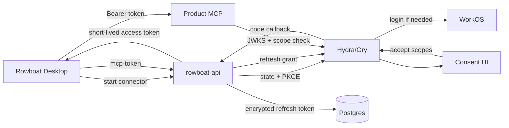
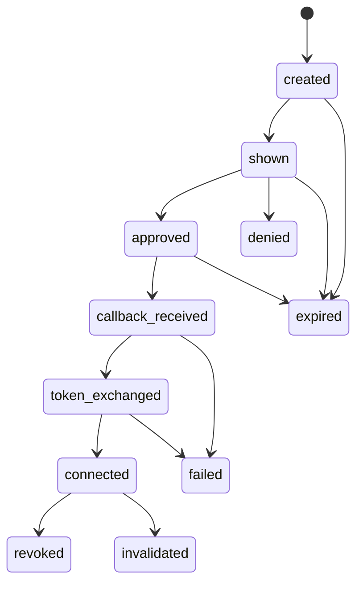

# RFC 012: Connector Suite and Consent Broker

|                  |                                                                                                                                                           |
| ---------------- | --------------------------------------------------------------------------------------------------------------------------------------------------------- |
| **RFC**          | 012                                                                                                                                                       |
| **Status**       | Implementing — core broker endpoints landed; full consent and first-party rollout open                                                                    |
| **Track**        | Cross-product connector authorization                                                                                                                     |
| **Owners**       | `apps/rowboat-api`, `apps/oauth-consent`, product MCP owners                                                                                              |
| **Created**      | 2026-06-06                                                                                                                                                |
| **Last updated** | 2026-07-26                                                                                                                                                |
| **Depends on**   | [RFC 011](./complete-011-identity-and-authorization-plane.md), WorkOS, deferred Hydra/Ory broker mode                                                     |
| **Enables**      | [RFC 013](./013-oppulence-product-connector-fabric.md), [RFC 020](./020-native-third-party-action-engine.md), [RFC 008](./008-conduit-eigen-faculties.md) |
| **Supersedes**   | Former connector suite plan and connector sections of the former backend implementation plan.                                                             |

## Summary

Rowboat needs one first-party connector protocol for Canvas, Corinthian, Cadence
(Billflow legacy naming), Conduit, Eigen, and future Oppulence products. This RFC
promotes the connector suite design into the numbered RFC set: OAuth2/PKCE
account linking, product-scoped audiences, consent UI, scope catalog, resource
server libraries, entitlement checks, token revocation, and money-moving approval
tokens.

This RFC defines the authorization substrate. Product-specific data planes and
MCP contracts are covered by [RFC 013](./013-oppulence-product-connector-fabric.md).
Third-party package authoring, generic provider auth adapters, actions,
triggers, ingestion, relationship mappings, and certification are covered by
[RFC 020](./020-native-third-party-action-engine.md). RFC 020 extends this
substrate; it does not create a second credential broker.

## Current state

| Capability                      | State                                                                       |
| ------------------------------- | --------------------------------------------------------------------------- |
| Desktop MCP client              | Exists in `apps/x/packages/core/src/mcp`                                    |
| Canvas MCP                      | Exists in the portfolio, already HTTP-MCP shaped                            |
| Corinthian MCP                  | Exists with approval-token patterns                                         |
| Cadence/Billflow MCP            | Missing or needs shim                                                       |
| rowboat-api connector endpoints | Landed: catalog; OAuth start/callback/claim; API key; MCP token; disconnect |
| Connection storage and audit    | Landed: `MCPConnection`, history hooks, and tenant interceptors             |
| Hydra/Ory broker                | Deferred by deployment doc                                                  |
| Consent UI                      | Artifacts exist but deferred                                                |

RFC 004 assumes cloud runtime connector reads, and RFC 008 assumes connector
registry access for Conduit/Eigen. This RFC fills the shared broker contract those
RFCs depend on.

## Goals

- One account-linking flow for all first-party products.
- One scope vocabulary and consent UX.
- One Go and one TypeScript resource-server middleware.
- Product MCP servers remain independently owned and enforce scopes themselves.
- rowboat-api stores refresh tokens encrypted and mints short-lived resource tokens.
- Product-side subscription/entitlement gates happen before consent is granted.
- Revocation works from Rowboat and from product backends.

## Non-Goals

- Defining each product's MCP tool catalog; see RFC 013 and product-owned RFCs.
- Proxying MCP traffic through rowboat-api.
- Replacing WorkOS as human identity.
- Handling third-party bank/Plaid tokens in Rowboat.
- Defining generic external-provider packages or runtime behavior; RFC 020 owns
  that layer while reusing this RFC's consent and credential controls.

## Architecture



## Scope model

Scopes are namespaced as:

```
{product}:{resource}.{action}
```

Trust tiers:

| Tier         | Examples                                                  | Consent behavior                                      |
| ------------ | --------------------------------------------------------- | ----------------------------------------------------- |
| low          | `canvas:invoices.read`                                    | standard consent                                      |
| medium       | `canvas:customers.write`                                  | explicit "modify records" emphasis                    |
| high         | `canvas:dunning.execute`                                  | extra confirmation                                    |
| money-moving | `corinthian:payments.execute`, `cadence:payments.execute` | WorkOS MFA step-up plus per-invocation approval token |

The scope catalog must live as structured data, not prose only. The consent UI and
resource-server libraries should consume the same catalog.

## Connector registry API

`GET /v1/connectors` returns all available connectors and current user status:

```json
{
  "connectors": [
    {
      "name": "canvas",
      "displayName": "Canvas",
      "audience": "canvas-api",
      "mcpUrl": "https://api.canvas.solomon-ai.co/v1/mcp",
      "authType": "oauth",
      "scopes": ["canvas:invoices.read"],
      "connected": true,
      "connectedAt": "2026-06-06T12:00:00Z",
      "lastUsedAt": "2026-06-06T13:00:00Z"
    }
  ]
}
```

The desktop uses this endpoint for the Connected Accounts settings surface and
for MCP mount discovery.

## Broker API

| Method   | Path                                  | Purpose                                                                          |
| -------- | ------------------------------------- | -------------------------------------------------------------------------------- |
| `POST`   | `/v1/connections/{name}/start`        | Create pending state/PKCE and return authorization URL.                          |
| `GET`    | `/v1/connections/{name}/callback`     | Validate state, exchange code, store encrypted refresh token, deep-link desktop. |
| `POST`   | `/v1/connections/{name}/mcp-token`    | Return cached or freshly minted short-lived product token.                       |
| `DELETE` | `/v1/connections/{name}`              | Revoke refresh token and delete local connection.                                |
| `POST`   | `/oauth-hooks/pre-consent`            | Hydra hook for entitlement/scope checks.                                         |
| `POST`   | `/v1/internal/connections/invalidate` | Product requests forced disconnect.                                              |

All connection rows are per user and unique on `(user, connector)`.

## Entitlement gate

Before consent, rowboat-api calls the target product's entitlement endpoint:

```
GET /v1/internal/entitlements?user_id={workos_user_id}
```

The product returns whether the user or org may grant the requested scopes. If
not, the consent UI shows an upsell or denial state instead of the approve screen.

Denial reasons:

- `no_subscription`
- `scope_not_in_plan`
- `user_banned`
- `org_mismatch`
- `connector_disabled`

## Consent UI

The consent app shows:

- Product identity.
- Client identity (`Rowboat Desktop`).
- Requested scopes grouped by trust tier.
- Required vs optional scopes.
- Plan/upsell mode when entitlement fails.
- WorkOS MFA step-up for money-moving scopes.
- Final approve/deny actions back to Hydra/Ory.

The consent UI must not invent scope copy. It reads the scope catalog.

## Resource-server libraries

Two packages implement the same contract:

- `packages/oauth-resource-server-go`
- `packages/oauth-resource-server-ts`

Responsibilities:

1. Fetch and cache issuer JWKS.
2. Validate `iss`, `aud`, `exp`, `nbf`, `iat`.
3. Enforce RS256 only.
4. Parse space-delimited `scope`.
5. Provide all-of and any-of scope middleware.
6. Refetch JWKS once on `kid` miss.
7. Optional introspection for money-moving scopes.

Product MCP servers must enforce scopes even if Rowboat checked them earlier.

## Money-moving approval tokens

Holding a money-moving scope is necessary but insufficient. Product MCP servers
return `428 Precondition Required` for action-specific approval:

```json
{
  "approvalRequired": true,
  "approvalChallengeUrl": "https://api.corinthian.solomon-ai.co/v1/approvals/appr_123"
}
```

The user approves the exact action in a browser. The product returns a one-time
approval token, and the desktop retries the MCP call with `X-Approval-Token`.

Approval tokens are product-owned because only the product can bind the approval
to the exact domain action.

## Revocation

Revocation can originate from:

| Origin               | Flow                                                                                                |
| -------------------- | --------------------------------------------------------------------------------------------------- |
| Desktop              | `DELETE /v1/connections/{name}` -> Ory revoke -> delete `MCPConnection`.                            |
| Product              | `/v1/internal/connections/invalidate` -> Ory revoke -> delete row -> notify desktop on next launch. |
| Refresh token expiry | Mark disconnected; desktop re-prompts when connector is used.                                       |
| Security incident    | Product or platform revokes all grants by connector/user/org.                                       |

Refresh tokens rotate on use. Reuse detection must revoke the connection.

## Data model

Minimum broker entities:

| Entity                | Fields                                                                                                               |
| --------------------- | -------------------------------------------------------------------------------------------------------------------- |
| `ConnectorDefinition` | name, display name, audience, MCP URL, auth type, supported scopes, environment, status. May start config-backed.    |
| `MCPConnection`       | user edge, connector, audience, scopes, encrypted refresh token, connected_at, last_used_at, expires_at, revoked_at. |
| `OAuthPending`        | state, connector, code verifier, requested scopes, redirect target, expires_at.                                      |
| `ConnectorAuditEvent` | user, connector, event type, scoped metadata, created_at. Can be table or structured logs in v1.                     |

## Observability and audit

Required audit events:

| Event                                  | Emitted by  |
| -------------------------------------- | ----------- |
| `connection.start`                     | rowboat-api |
| `consent.shown`                        | consent UI  |
| `consent.granted`                      | consent UI  |
| `consent.denied`                       | consent UI  |
| `token.exchanged`                      | rowboat-api |
| `token.refreshed`                      | rowboat-api |
| `token.revoked`                        | rowboat-api |
| `entitlement.check`                    | rowboat-api |
| `mcp.tool.invoked`                     | product MCP |
| `mcp.tool.denied`                      | product MCP |
| `approval.requested`                   | product     |
| `approval.granted` / `approval.denied` | product     |

Metrics label only by connector, product, result, and reason. No user IDs in
metric labels.

## Rollout

1. Add config-backed connector definitions and `GET /v1/connectors`.
2. Add `MCPConnection` and `OAuthPending` schemas.
3. Implement start/callback/token/delete endpoints behind a disabled broker flag.
4. Implement scope catalog as JSON.
5. Implement resource-server libraries.
6. Enable broker in kind/staging with a dev product MCP.
7. Enable Canvas read-only connector.
8. Enable Corinthian read-only connector.
9. Enable Cadence/Billflow read-only connector.
10. Add high/money-moving scopes only after approval-token paths pass product tests.

## Test plan

- Unit: scope catalog parsing, trust tier grouping, optional/required scope filtering.
- Unit: state/PKCE generation and expiry.
- Unit: token encryption/decryption and refresh rotation.
- Unit: resource-server JWT verification, `kid` miss, wrong audience, missing scope.
- Integration: connector start -> callback -> mcp-token.
- Integration: entitlement denial renders upsell payload.
- Integration: forced invalidation deletes the row and revokes token.
- Product MCP tests: missing scope -> 403; money-moving without approval -> 428.

## Detailed implementation design

### Connector definition file

Connector definitions can start as config-backed JSON/YAML before moving to ent:

```yaml
id: canvas
display_name: Canvas
audience: mcp:canvas
status: beta
environments:
  - local
  - staging
  - production
auth:
  type: oauth2_authorization_code_pkce
  authorization_url: https://canvas.example.com/oauth/authorize
  token_url: https://canvas.example.com/oauth/token
  revocation_url: https://canvas.example.com/oauth/revoke
resource_server:
  mcp_url: https://canvas.example.com/mcp
  jwks_audience: mcp:canvas
scopes:
  - name: canvas.read
    tier: read
    required: true
  - name: canvas.watch
    tier: watch
    required: false
```

Definitions must be environment-aware. A staging connector must not accidentally
mint tokens for a production product audience.

### Scope catalog schema

The scope catalog is the source of truth:

```json
{
  "name": "cadence.payment_run.approve_request",
  "display_name": "Request payment approval",
  "description": "Create a payment approval request for review.",
  "tier": "money_moving",
  "risk": "high",
  "requires_step_up": true,
  "requires_per_invocation_approval": true,
  "resource_types": ["payment_run"],
  "implies": ["cadence.read"],
  "conflicts_with": []
}
```

Rules:

- Scopes are namespaced by product.
- `read` scopes never imply write scopes.
- `watch` scopes imply enough read access to interpret the event.
- `act` scopes never imply money-moving finalization.
- Money-moving scopes require both consent-time step-up and per-call approval.

### Consent session state machine



State transitions are append-audited. `OAuthPending` may store only the current
state, but audit logs must preserve the path.

### OAuth state record

`OAuthPending` fields:

```text
id uuid
state_hash string unique
connector_id string
user_id uuid
organization_id uuid nullable
requested_scopes string[]
redirect_after string
code_verifier_encrypted bytes
nonce string
status enum(created, shown, approved, denied, callback_received, token_exchanged, expired, failed)
expires_at timestamp
created_at timestamp
updated_at timestamp
```

`state` and PKCE verifier are never logged. The stored state should be hashed so
a DB read alone is not enough to replay a callback.

### Connection lifecycle

`MCPConnection` states:

| State             | Meaning                                                                     |
| ----------------- | --------------------------------------------------------------------------- |
| `active`          | Refresh token exists, scopes are valid, resource server can receive tokens. |
| `reauth_required` | Refresh failed or provider requires user action.                            |
| `revoking`        | User requested disconnect and revocation is in progress.                    |
| `revoked`         | Local row retained for audit, encrypted token deleted.                      |
| `invalidated`     | Product, entitlement, admin, or security policy invalidated the grant.      |
| `error`           | Unexpected broker/provider failure needs retry or support.                  |

The desktop should show `reauth_required` as fixable by the user and `invalidated`
as policy/product controlled.

### API details

#### `GET /v1/connectors`

Response:

```json
{
  "connectors": [
    {
      "id": "canvas",
      "display_name": "Canvas",
      "status": "beta",
      "connected": true,
      "connection_health": "active",
      "granted_scopes": ["canvas.read"],
      "available_scopes": ["canvas.read", "canvas.watch"],
      "requires_entitlement": "canvas_connector"
    }
  ]
}
```

#### `POST /v1/connectors/{id}/start`

Request:

```json
{
  "requested_scopes": ["canvas.read", "canvas.watch"],
  "redirect_after": "rowboat://settings/connectors"
}
```

Response:

```json
{
  "authorization_url": "https://...",
  "expires_at": "2026-06-06T12:10:00Z"
}
```

#### `GET /v1/connectors/{id}/callback`

Callback verifies state, exchanges code, stores encrypted tokens, and redirects
to the desktop or hosted callback destination with a success/failure code. The
redirect must not include raw access tokens or refresh tokens.

#### `POST /v1/connectors/{id}/resource-token`

Request:

```json
{
  "connection_id": "conn_123",
  "scopes": ["canvas.read"],
  "audience": "mcp:canvas"
}
```

Response:

```json
{
  "token": "eyJ...",
  "expires_in": 300,
  "token_type": "Bearer"
}
```

The response token is short-lived and audience-bound. It is not a provider
access token.

#### `DELETE /v1/connectors/{id}/connections/{connection_id}`

Deletes local access by transitioning to `revoking`, calling provider revocation
where available, deleting encrypted refresh material, and retaining an audit
tombstone.

### Refresh behavior

Resource-token minting uses this algorithm:

1. Load connection by id and actor.
2. Verify connection is active.
3. Verify requested scopes are a subset of granted scopes.
4. Verify entitlement still allows the connector.
5. Refresh upstream OAuth access token if needed.
6. Store rotated refresh token if provider returns one.
7. Mint Rowboat resource token for product MCP.
8. Emit audit event.

Provider access tokens should remain server-side unless the product MCP
architecture explicitly requires them. Prefer product MCP servers to call their
own product APIs with product-owned credentials whenever possible.

### Resource-server middleware contract

Go and TypeScript libraries should expose equivalent APIs:

```ts
const actor = await requireMCPToken(req, {
  audience: "mcp:canvas",
  requiredScopes: ["canvas.read"],
});
```

The returned actor includes:

- user id
- organization id
- connection id
- connector id
- scopes
- token id
- trust tier

Middleware denies by default and returns structured errors:

- `token_missing`
- `token_expired`
- `token_invalid_signature`
- `audience_mismatch`
- `scope_missing`
- `connection_revoked`
- `approval_required`

### Entitlement checks

Entitlement checks happen before consent starts and before resource-token mint.
This prevents stale subscriptions from retaining access after plan changes.

Entitlement response:

```json
{
  "allowed": false,
  "reason": "plan_required",
  "required_plan": "business",
  "upgrade_url": "rowboat://billing"
}
```

The consent UI must not hide entitlement failure as an OAuth failure.

### Approval-token design

Approval tokens are action-specific:

```json
{
  "approval_id": "appr_123",
  "connection_id": "conn_123",
  "scope": "cadence.payment_run.execute",
  "resource_type": "payment_run",
  "resource_id": "payrun_123",
  "amount": "12500.00",
  "currency": "USD",
  "approver_user_id": "usr_456",
  "expires_at": "2026-06-06T12:05:00Z"
}
```

The product MCP validates:

- action details match token claims
- approver satisfies product policy
- token is not expired or already used
- base connector scope exists
- product-side audit record is written

Rowboat may initiate or display the approval challenge, but final validation
lives with the product that owns the risky action.

### Provider onboarding checklist

Before adding a connector:

1. Define product id and stable audience.
2. Define scope catalog entries.
3. Decide OAuth or static product-owned auth shape.
4. Implement devstack/mock provider behavior.
5. Add connector definition for local/staging/prod.
6. Add entitlement mapping.
7. Add product MCP resource-server middleware.
8. Add revoke/invalidate behavior.
9. Add audit event mapping.
10. Add desktop settings copy and failure states.

### Security controls

- Encrypt refresh tokens at rest with key rotation support.
- Hash OAuth state.
- Use PKCE for browser-based OAuth flows.
- Cap pending consent TTL, for example 10 minutes.
- Use exact redirect URI allowlists.
- Do not allow scope escalation during callback.
- Do not allow `redirect_after` to arbitrary web origins.
- Maintain emergency connector disable flags.
- Support admin invalidation by connector, org, user, or connection id.

### Operational runbook

Common incidents:

| Incident                     | Runbook                                                                                      |
| ---------------------------- | -------------------------------------------------------------------------------------------- |
| Provider OAuth outage        | Disable connector start, keep existing connections marked degraded.                          |
| Compromised connector secret | Disable connector, rotate secret, invalidate affected pending states, revoke where possible. |
| Bad scope catalog deploy     | Roll back catalog, prevent new consent, preserve existing grants until reviewed.             |
| Product MCP rejecting tokens | Check audience, JWKS cache, clock skew, and scope names.                                     |
| Entitlement bug              | Disable token mint for affected connector and run audit query by connector/result.           |

## Acceptance criteria

- A user can connect and disconnect a product through one broker flow.
- The desktop receives short-lived resource tokens and calls product MCP directly.
- Product MCP servers reject wrong audience, missing scope, and expired tokens.
- Entitlement checks block unsupported users before consent.
- Money-moving actions require both consent-time step-up and per-call approval.
- All authorization events are auditable.

## Decisions

- **Product tokens are audience-bound.** One token targets one resource server.
- **rowboat-api does not proxy MCP calls.** It brokers consent and token refresh only.
- **Scope catalog is structured data.** Prose docs are not the source of truth.
- **Money-moving approval is product-owned.** Rowboat surfaces the challenge, but the
  product validates action-specific approval.
- **Hydra/Ory is introduced only for broker mode.** WorkOS-direct remains the live
  service-plane auth path per RFC 011.
