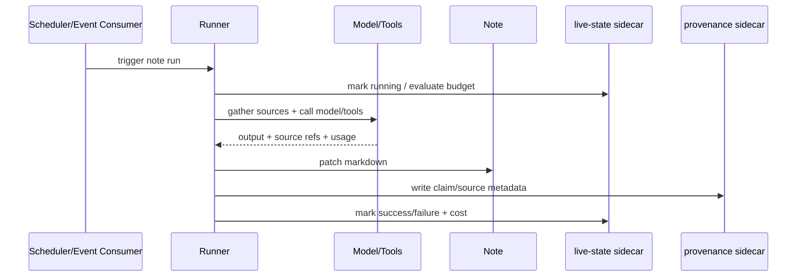

# RFC 014: Live-Note Observability, Cost, and Provenance

|                  |                                                                                                                                                  |
| ---------------- | ------------------------------------------------------------------------------------------------------------------------------------------------ |
| **RFC**          | 014                                                                                                                                              |
| **Status**       | Draft                                                                                                                                            |
| **Track**        | Trust, observability, and user control                                                                                                           |
| **Owners**       | `apps/x`, `apps/rowboat-api`                                                                                                                     |
| **Created**      | 2026-06-06                                                                                                                                       |
| **Last updated** | 2026-06-06                                                                                                                                       |
| **Depends on**   | Existing live-note/background-task runtime, [RFC 006](./complete-006-desktop-cloud-control-plane.md), [RFC 010](./010-rowboat-api-service-plane.md)       |
| **Related**      | RFCs 001-007 for cloud run observability                                                                                                         |
| **Parent docs**  | [`docs/roadmap-2026-2046.md`](../../docs/roadmap-2026-2046.md) P0 defensive gaps, [`docs/one-pager-product.md`](../../docs/one-pager-product.md) |

## Summary

The roadmap identifies pre-scale product gaps that are broader than cloud run
execution: every live note needs transparent observability, cost visibility,
source provenance, and user controls. Without those, Rowboat risks the same
failure modes customers report in other agent products: silent failures, runaway
cost, ungrounded claims, and actions users cannot audit.

RFC 006 makes cloud schedules visible. This RFC makes live notes themselves
trustworthy across local and cloud execution.

## Current state

Rowboat already has:

- local live-note and background-task schedulers
- run logs under the desktop workspace
- cloud run history and events for API-target tasks
- artifact provenance fields for cloud background tasks
- PostHog usage events
- local Markdown notes that users can inspect and edit

Gaps called out by the roadmap:

1. Per-live-note observability.
2. BYO-model and hosted-model cost transparency.
3. Voice/style matching for generated drafts.
4. Provenance UX for claims.
5. A visible distinction between generated text and asserted/source-backed facts.

This RFC covers items 1, 2, 4, and 5. Style matching is referenced here only where
it affects provenance; the draft-quality implementation can be a later feature RFC
if it expands beyond lightweight prompt conditioning.

## Goals

- Give every live note a run history the user can inspect.
- Show cost and token usage per run, per note, and over time.
- Surface trigger health and silent-trigger warnings.
- Provide a kill switch per note and global emergency pause.
- Attach provenance metadata to generated claims.
- Preserve source-backed vs generated/derived distinction in the note UI.
- Work for both local desktop runs and cloud API runs.

## Non-Goals

- Replacing the cloud runs view from RFC 006.
- Building a full tracing UI.
- Guaranteeing model factuality.
- Implementing a legal/compliance policy engine.
- Rewriting all generated note content into a structured database.

## User-facing model

Each live note has an Observability panel:

| Section  | Shows                                                                                    |
| -------- | ---------------------------------------------------------------------------------------- |
| Health   | active/paused/error, last run, next run, last trigger evaluation, silent-trigger warning |
| Runs     | local and cloud run history, status, trigger, duration, model/provider, cost             |
| Sources  | source files/events/connectors used by the latest generated content                      |
| Budget   | per-run token/credit cap, monthly cap, soft warning threshold                            |
| Controls | run now, pause, resume, kill switch, clear failure, open artifact/run                    |

For compact views, the note header gets chips:

- `current`
- `stale`
- `failed`
- `paused`
- `over budget`
- `source missing`
- `generated`

## Live-note metadata

Add a sidecar per live note rather than stuffing operational history into the
Markdown body:

```
<note>.live-state.json
```

Shape:

```json
{
  "schemaVersion": 1,
  "notePath": "knowledge/Companies/Acme.md",
  "paused": false,
  "lastRunId": "run_123",
  "lastRunAt": "2026-06-06T12:00:00Z",
  "lastSuccessAt": "2026-06-06T12:00:00Z",
  "lastFailureAt": null,
  "lastFailureCode": null,
  "lastTriggerEvaluatedAt": "2026-06-06T12:15:00Z",
  "lastTriggerMatchedAt": "2026-06-06T12:00:00Z",
  "lastSeenCloudRunAt": "2026-06-06T12:00:00Z",
  "budget": {
    "maxInputTokens": 50000,
    "maxOutputTokens": 6000,
    "maxCreditsPerRun": 500,
    "monthlyCreditSoftLimit": 5000
  },
  "latestProvenanceRevision": 7
}
```

State files are local-first. Cloud-run metadata is pulled from rowboat-api when
the note maps to API-target execution.

## Run cost model

Every run summary should include:

| Field          | Source                                     |
| -------------- | ------------------------------------------ |
| input tokens   | local provider estimates or API `LLMUsage` |
| output tokens  | local provider estimates or API `LLMUsage` |
| model/provider | run config                                 |
| credit cost    | API ledger or local pricing estimate       |
| elapsed time   | run timestamps                             |
| tool calls     | run events                                 |
| fallback path  | local/cloud/provider fallback metadata     |

For BYO keys, dollar cost may be an estimate based on configured pricing. The UI
must label estimates as estimates.

## Provenance model

Each generated content block can cite sources using hidden metadata sidecars and
visible affordances in the renderer.

Sidecar:

```
<note>.provenance.json
```

Shape:

```json
{
  "schemaVersion": 1,
  "notePath": "knowledge/Companies/Acme.md",
  "revision": 7,
  "generatedAt": "2026-06-06T12:00:00Z",
  "runId": "run_123",
  "claims": [
    {
      "anchor": "money.ar_balance",
      "textHash": "sha256:...",
      "kind": "source_backed",
      "sources": [
        {
          "type": "connector_resource",
          "connector": "canvas",
          "resourceType": "invoice",
          "resourceId": "inv_4821",
          "displayName": "Invoice #4821",
          "observedAt": "2026-06-06T11:58:00Z"
        }
      ]
    },
    {
      "anchor": "recommendation.next_step",
      "textHash": "sha256:...",
      "kind": "generated_recommendation",
      "sources": ["money.ar_balance", "relationship.last_meeting"]
    }
  ]
}
```

`kind` values:

- `source_backed`
- `derived`
- `generated_summary`
- `generated_recommendation`
- `user_edited`
- `unknown`

The renderer can show source chips and warning states without polluting Markdown
portability.

## Silent-trigger detection

A trigger is considered suspicious when:

- cron/window trigger has not fired within `N` expected cycles
- event trigger has matched before but no event has been evaluated for `N` days
- cloud schedule is `failed`
- local scheduler is disabled while note has desktop-only triggers
- credentials required by the note are disconnected

Warnings are shown inline and in the global activity view. They do not block
editing.

## Budgets and kill switches

Controls:

| Control                 | Scope                         |
| ----------------------- | ----------------------------- |
| pause live note         | one note                      |
| pause all live notes    | workspace                     |
| disable cloud execution | API-target runs               |
| per-run token cap       | one note                      |
| monthly soft cap        | one note/workspace            |
| hard credit cap         | API server-side account quota |

On budget breach:

- local run stops before model call when estimated budget is exceeded
- API run returns structured `insufficient_credits` or `budget_exceeded`
- note state becomes `over budget`
- user can rerun with adjusted cap

## Error taxonomy

Desktop and API should normalize live-note failures into:

- `trigger_parse_failed`
- `source_unavailable`
- `connector_disconnected`
- `model_unavailable`
- `budget_exceeded`
- `insufficient_credits`
- `tool_denied`
- `tool_failed`
- `artifact_write_failed`
- `cloud_execution_unavailable`
- `unknown`

The UI switches on codes, not message text.

## Data flow



## Rollout

1. Add live-state sidecar and migration from existing run metadata where possible.
2. Add per-note run history panel for local runs.
3. Merge cloud run history into the same panel for API-target notes.
4. Add cost/usage summaries.
5. Add pause/kill switch controls.
6. Add silent-trigger warnings.
7. Add provenance sidecar and source chips for new generated content.
8. Backfill best-effort provenance for existing notes as `unknown` or
   `generated_summary`.

## Test plan

- Unit: state sidecar read/write/migration.
- Unit: budget checks for local estimated tokens and API credit responses.
- Unit: silent-trigger detection for cron/window/event cases.
- Unit: provenance sidecar hash anchoring and source rendering.
- Renderer: chips and Observability panel states.
- Integration: local live note run records cost and provenance.
- Integration: cloud live note shows API run/cost/artifact state.
- E2E: pause note prevents scheduled run; global pause prevents all runs.

## Detailed implementation design

### Sidecar file layout

For a note:

```text
Notes/Customer/Acme.md
```

Sidecars live next to it or under the existing app metadata root, depending on
current desktop conventions:

```text
Notes/Customer/.Acme.rowboat-state.json
Notes/Customer/.Acme.rowboat-provenance.json
```

If the app already uses a hidden metadata folder, use that instead. The
important rule is stable mapping from note path to sidecar path and portability
when a note is moved inside the vault.

### Live-state schema

```json
{
  "schema_version": "2026-06-06",
  "note_id": "note_123",
  "note_path": "Customer/Acme.md",
  "automation": {
    "enabled": true,
    "paused_until": null,
    "global_pause_respected": true
  },
  "trigger_health": {
    "status": "healthy",
    "last_expected_at": "2026-06-06T12:00:00Z",
    "last_observed_run_at": "2026-06-06T12:00:07Z",
    "next_expected_at": "2026-06-06T12:15:00Z",
    "missed_count": 0,
    "source": "cron"
  },
  "runs": [
    {
      "run_id": "run_123",
      "execution_target": "api",
      "trigger": "event",
      "status": "succeeded",
      "started_at": "2026-06-06T12:00:00Z",
      "completed_at": "2026-06-06T12:00:20Z",
      "cost": {
        "credits": 12,
        "estimated": false
      },
      "artifact_refs": ["artifact_123"],
      "provenance_ref": "prov_123"
    }
  ]
}
```

The state sidecar stores operational facts. It should not store raw source
documents or model prompts.

### Provenance schema

```json
{
  "schema_version": "2026-06-06",
  "note_id": "note_123",
  "claims": [
    {
      "claim_id": "claim_123",
      "markdown_anchor": "sha256:line-block-hash",
      "run_id": "run_123",
      "kind": "generated_summary",
      "confidence": "medium",
      "sources": [
        {
          "source_id": "src_123",
          "type": "product_resource",
          "product": "canvas",
          "resource_type": "invoice",
          "external_id": "inv_456",
          "retrieved_at": "2026-06-06T12:00:00Z",
          "quote_hash": "sha256:abc"
        }
      ],
      "created_at": "2026-06-06T12:00:20Z"
    }
  ]
}
```

Claims are anchored to markdown by hashes or block ids so simple line movement
does not destroy provenance. If anchoring fails after heavy edits, mark the claim
as `orphaned` and keep it visible in the provenance panel.

### Run history retention

The UI does not need infinite run rows loaded into memory. Retention policy:

- keep latest 50 runs in sidecar for instant UI
- archive older local run summaries in app metadata if needed
- cloud run details can be fetched on demand by run id
- keep cost totals by day/week/month even after individual rows roll off
- never delete audit-critical records on the server just because local UI rolls
  off old runs

### Cost calculation

Cost rows should distinguish exact and estimated:

| Source                               | Accuracy             | Notes                                  |
| ------------------------------------ | -------------------- | -------------------------------------- |
| rowboat-api credit settlement        | exact                | Use ledger entry id and credits.       |
| provider usage from local model call | estimated or exact   | Depends on provider/local runtime.     |
| local whisper.cpp                    | estimated            | CPU/battery cost is not credit cost.   |
| local diarization                    | estimated            | Track duration and model, not credits. |
| product MCP call                     | usually zero credits | Still record call count and product.   |

Cost display examples:

```text
12 credits
~4 credits estimated
Local processing only
No billable usage recorded
```

Never mix exact and estimated totals without labelling.

### Budget enforcement order

For every automated run:

1. Check global automation pause.
2. Check note-level pause.
3. Check trigger-specific pause.
4. Estimate run cost where possible.
5. Check daily/weekly/monthly budget.
6. Reserve credits for cloud calls when available.
7. Start run.
8. Settle exact or estimated cost.
9. Update budget counters.
10. Emit budget audit event.

If step 4 cannot estimate cost, use conservative defaults. If reservation fails,
the run does not start.

### Silent-trigger algorithm

Silent trigger detection compares expected and observed activity:

| Trigger type | Expected source                                | Miss condition                                    |
| ------------ | ---------------------------------------------- | ------------------------------------------------- |
| cron         | schedule definition and next fire              | `now > next_expected + grace` and no run observed |
| window       | window start/end plus evaluation interval      | window closed without evaluation/run marker       |
| event        | provider heartbeat or event subscription state | provider reports delivery but no linked run       |
| manual       | user action                                    | no silent detection; show immediate failure       |

Grace windows are per trigger type. The UI should show:

- expected time
- last successful run
- last failed run
- reason if known
- repair action if available

### UI surface

Each live note gets a compact header status and a detailed panel.

Header chips:

- `Healthy`
- `Running`
- `Paused`
- `Budget stopped`
- `Needs attention`
- `No provenance`
- `Local only`
- `Cloud run`

Detailed panel tabs:

- Runs
- Cost
- Sources
- Triggers
- Controls

Controls:

- pause note
- resume note
- run now
- view last artifact
- open source
- open cloud run
- disable automation for this note
- global pause entry point

### Error taxonomy details

Errors should map to user actions:

| Code                 | User action                                        |
| -------------------- | -------------------------------------------------- |
| `auth_required`      | Sign in again.                                     |
| `connector_revoked`  | Reconnect product.                                 |
| `quota_exceeded`     | Add credits or lower budget.                       |
| `budget_paused`      | Raise budget or resume manually.                   |
| `source_unavailable` | Retry later or check product status.               |
| `model_unavailable`  | Retry or switch model.                             |
| `provenance_missing` | Treat content as generated without source support. |
| `trigger_missed`     | Check schedule/event health.                       |
| `write_conflict`     | Review local note edits and retry merge.           |

The renderer should branch on code, not provider message text.

### Provenance rendering

Generated content should visually distinguish:

- directly quoted source-backed text
- summarized source-backed text
- model-generated recommendation
- user-authored text
- unknown provenance

The note body remains normal markdown. The UI may decorate it based on sidecar
anchors but should not make markdown unreadable outside Rowboat.

### Privacy rules

- Sidecars may contain source ids and hashes.
- Sidecars should not duplicate full emails, invoices, or product payloads unless
  the note itself already contains that content.
- Cost/provenance upload to rowboat-api is allowed only for cloud runs or
  explicit sync features.
- Local-only notes keep local-only provenance unless the user enables cloud sync.

### Backfill behavior

Existing notes get best-effort state:

```json
{
  "schema_version": "2026-06-06",
  "backfilled": true,
  "provenance_quality": "unknown"
}
```

Do not pretend old generated content has precise sources. Unknown is a real and
acceptable provenance state.

### Support workflow

Support/debug export should include:

- note id/path
- run ids
- trigger health summary
- error codes
- cost rows
- source ids and hashes
- app version
- API environment

It must exclude raw connector tokens, raw audio, raw private payloads, and full
provider responses unless an explicit support export mode is added.

## Acceptance criteria

- Every live note has visible health, run history, and controls.
- Users can see approximate or exact cost per run.
- Budget breaches stop runs predictably and leave actionable UI.
- Generated claims can show their source or admit no source is known.
- Trigger silence is detectable before the user discovers stale notes manually.
- The user can stop all live-note automation quickly.

## Decisions

- **Operational state lives in sidecars.** Markdown stays portable and readable.
- **Cost can be estimated when exact billing is unavailable.** Estimates must be
  labelled.
- **Provenance is best-effort but explicit.** Unknown provenance is a visible state,
  not hidden.
- **Local and cloud runs share one trust surface.** Execution target changes should
  not change what the user can inspect.
