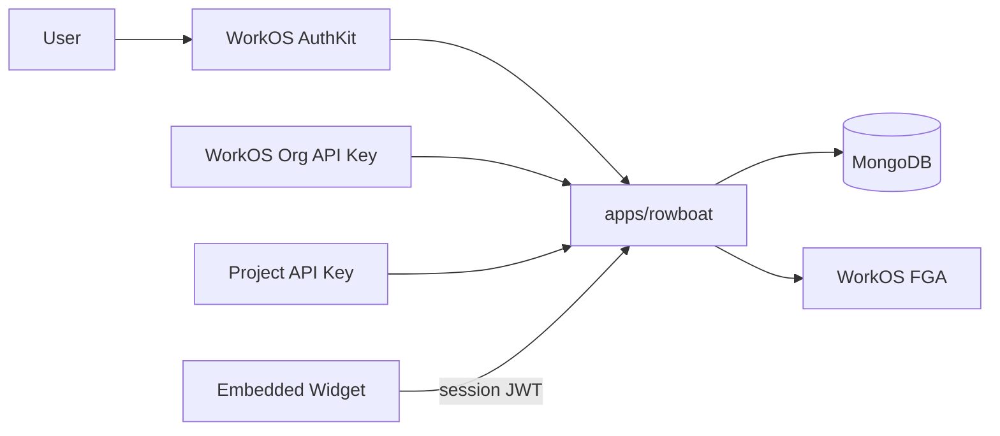
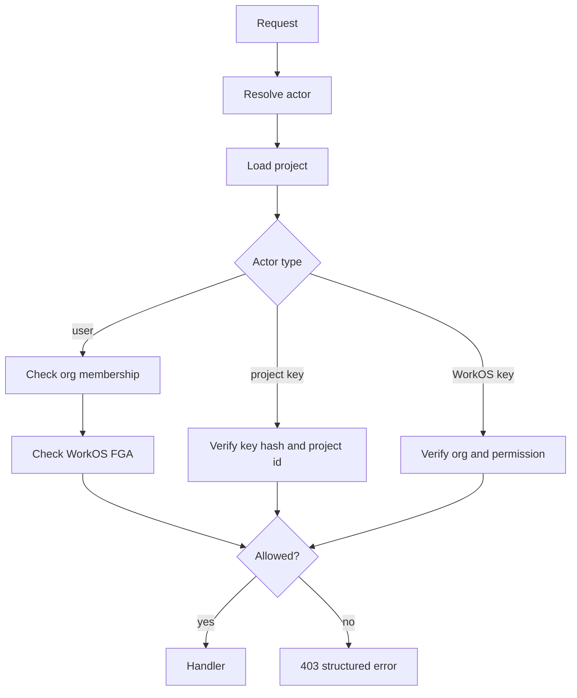

# RFC 015: Rowboat Platform WorkOS FGA and Widget Auth

|                  |                                                                                                                                                                                                                                                                              |
| ---------------- | ---------------------------------------------------------------------------------------------------------------------------------------------------------------------------------------------------------------------------------------------------------------------------- |
| **RFC**          | 015                                                                                                                                                                                                                                                                          |
| **Status**       | Draft                                                                                                                                                                                                                                                                        |
| **Track**        | Hosted platform auth and authorization                                                                                                                                                                                                                                       |
| **Owners**       | `apps/rowboat`                                                                                                                                                                                                                                                               |
| **Created**      | 2026-06-06                                                                                                                                                                                                                                                                   |
| **Last updated** | 2026-06-06                                                                                                                                                                                                                                                                   |
| **Depends on**   | WorkOS AuthKit, WorkOS Organizations, WorkOS FGA/API Keys                                                                                                                                                                                                                    |
| **Related**      | [RFC 010](./010-rowboat-api-service-plane.md), [RFC 011](./011-identity-and-authorization-plane.md), [RFC 016](./016-app-family-consolidation.md)                                                                                                                            |
| **Parent docs**  | [`docs/superpowers/plans/2026-05-20-workos-auth-rework.md`](../../docs/superpowers/plans/2026-05-20-workos-auth-rework.md), [`docs/superpowers/plans/2026-05-20-rowboat-apps-architecture-map.md`](../../docs/superpowers/plans/2026-05-20-rowboat-apps-architecture-map.md) |

## Summary

The hosted Rowboat platform (`apps/rowboat`) still has an Auth0-centered design
in the architecture map and a WorkOS migration task plan in docs. This RFC turns
that task plan into a durable architecture decision: migrate human auth to WorkOS
AuthKit, use WorkOS Organizations as tenant boundaries, register Rowboat projects
as WorkOS FGA resources, split organization API keys from project API keys, and
repair widget session auth so the embeddable widget stops depending on stubbed
`501` helper routes.

This RFC applies to `apps/rowboat`, not the desktop service plane in
`apps/rowboat-api`.

## Current state

| Area         | Current issue                                                             |
| ------------ | ------------------------------------------------------------------------- |
| Human auth   | Auth0 dependency remains in `apps/rowboat` plan evidence.                 |
| Users        | Existing local model keys off Auth0 subject.                              |
| Orgs         | WorkOS Organizations not yet the canonical tenant boundary.               |
| Project auth | App-local membership and API key checks dominate.                         |
| FGA          | WorkOS project resources not registered.                                  |
| API keys     | Project API keys and organization API keys need distinct actor semantics. |
| Widget APIs  | Widget auth/session helpers are stubbed or return `501`.                  |

## Goals

- Replace Auth0 with WorkOS AuthKit in hosted platform auth.
- Keep existing server action/controller seams stable where possible.
- Add local organization records keyed by WorkOS organization id.
- Scope projects by organization.
- Register projects as WorkOS FGA resources.
- Normalize authorization actors: user, WorkOS organization API key, project API key.
- Implement widget session authentication.
- Preserve project API keys for existing integrations while adding WorkOS API-key support.

## Non-Goals

- Changing Rowboat Desktop auth.
- Replacing rowboat-api service-plane auth from RFC 010.
- Rewriting the hosted workflow runtime.
- Moving project/conversation storage from MongoDB.
- Solving app-family consolidation; see RFC 016.

## Architecture



## Local models

### User

```ts
User {
  id: string
  workosUserId: string
  legacyAuth0Id?: string
  billingCustomerId?: string
  name?: string
  email?: string
  currentOrganizationId?: string
  createdAt: string
  updatedAt?: string
  lastSeenAt?: string
}
```

### Organization

```ts
Organization {
  id: string
  workosOrganizationId: string
  name: string
  billingCustomerId?: string
  createdAt: string
  updatedAt?: string
}
```

### Project

Add:

```ts
organizationId: string
workosAuthorizationResourceId?: string
publicClientId?: string
```

## Auth routes

Routes:

| Route            | Purpose                                      |
| ---------------- | -------------------------------------------- |
| `/auth/login`    | Redirect to WorkOS sign-in.                  |
| `/auth/signup`   | Redirect to WorkOS sign-up.                  |
| `/auth/callback` | Handle AuthKit callback and sync local user. |
| `/auth/logout`   | Clear WorkOS session.                        |

Server-side code should keep `requireAuth()` and `authCheck()` as stable import
surfaces, backed internally by WorkOS.

## Authorization actors

```ts
type AuthActor =
  | {
      type: "user";
      userId: string;
      organizationId: string;
      organizationMembershipId?: string;
      permissions: string[];
    }
  | { type: "workos_api_key"; organizationId: string; permissions: string[] }
  | { type: "project_api_key"; projectId: string; key: string };
```

Project authorization order:

1. Load project.
2. For project API key actor, validate the key is scoped to the requested project.
3. For org-scoped actors, require actor org equals project org.
4. WorkOS API key actor requires requested permission.
5. User actor may pass by explicit WorkOS permission, existing project membership,
   or WorkOS FGA check.

## WorkOS FGA model

Resource type:

```text
project
```

Permissions:

- `project:view`
- `project:edit`
- `project:delete`
- `project:run`
- `project:manage_api_keys`

Roles:

- `project-owner`
- `project-editor`
- `project-viewer`

On project create:

1. Create Mongo project with `organizationId`.
2. Create WorkOS FGA project resource with external id = Rowboat project id.
3. Store returned `workosAuthorizationResourceId`.
4. Assign project owner to creator's organization membership.

On rename/delete, update/delete the WorkOS resource.

## API key policy

### Project API keys

Project API keys are generated by Rowboat and scoped to one project. New keys are
stored as hashes only:

```text
rbp_<random>
sha256(secret) stored
prefix stored for display
```

They authorize only:

- external chat API for the owning project
- widget or project-scoped APIs explicitly allowed by product policy

### WorkOS organization API keys

WorkOS API keys are organization-owned and can access multiple projects only when
their permissions authorize the action and project org matches.

The public chat route accepts:

1. `rbp_*` project key -> project actor.
2. otherwise WorkOS API key -> organization actor.

## Widget session auth

The widget must not rely on stubbed helpers.

Required flow:

1. Parent site provides `x-client-id` or configured public client id.
2. Platform resolves client id to a project.
3. Guest/user session endpoint issues a short-lived widget session JWT.
4. Widget chat/list/message/turn routes require that JWT.
5. Session payload includes project id, session id, optional user metadata, and
   expiry.
6. Widget route rejects sessions for another project.

Widget session JWTs are separate from WorkOS user sessions and project API keys.

## Auth0 migration

Migration sequence:

1. Export Auth0 users.
2. Create/update WorkOS users with `external_id = auth0 user_id`.
3. Add `legacyAuth0Id` to local users.
4. Backfill local `workosUserId` from WorkOS external id lookups.
5. Keep project membership rows unchanged.
6. After staging verification, remove Auth0 SDK/imports/secrets.

## Billing

Billing moves from user-scoped to organization-scoped where WorkOS orgs exist.
Until the billing provider has a dedicated org field, the WorkOS organization id
can be used as the billing customer owner id.

Users without a WorkOS organization are redirected to onboarding to create/select
one before project creation.

## Rollout

1. Add WorkOS dependencies and env contract.
2. Add AuthKit routes and session adapter.
3. Add local `Organization` repository and indexes.
4. Migrate user model to `workosUserId` + `legacyAuth0Id`.
5. Add organization-scoped projects.
6. Add authorization actor model.
7. Register WorkOS FGA resources for projects.
8. Split WorkOS org API keys and project API keys.
9. Repair widget session auth.
10. Run Auth0 migration and remove Auth0 dependencies after staging soak.

## Test plan

- Unit: WorkOS profile sync creates/updates local users.
- Unit: legacy Auth0 id links existing users.
- Unit: organization repository upsert and indexes.
- Unit: project authorization policy for all actor types.
- Unit: WorkOS FGA allow/deny paths.
- Route test: public chat API with project key, WorkOS key, missing key, wrong org.
- Widget tests: invalid client id, missing session, wrong-project session, expired
  session, valid turn route.
- Build: `npm run typecheck`, `npm run test`, `npm run build`.

## Detailed implementation design

### Route inventory

Hosted platform routes should be grouped by actor:

| Route group            | Actor                                 | Notes                                            |
| ---------------------- | ------------------------------------- | ------------------------------------------------ |
| `/auth/*`              | browser user                          | WorkOS AuthKit login, callback, logout.          |
| `/app/*`               | browser user                          | Dashboard/builder routes requiring user session. |
| `/api/projects/*`      | user or org API key                   | Project management and runtime APIs.             |
| `/api/public/*`        | project API key or WorkOS org API key | External chat/project integration.               |
| `/api/widget/*`        | widget session JWT                    | Embedded widget runtime.                         |
| `/api/workos/webhooks` | WorkOS webhook signature              | User/org/membership/key sync.                    |
| `/api/internal/*`      | internal service                      | Maintenance/backfill only.                       |

Each group should have one auth helper. Avoid route-local ad hoc cookie/JWT/API
key parsing.

### Session adapter

`requireAuth()` should return:

```ts
type HostedSession = {
  user: {
    id: string;
    workosUserId: string;
    email?: string;
    name?: string;
  };
  organization: {
    id: string;
    workosOrganizationId: string;
    role?: string;
  };
  permissions: string[];
  sessionId: string;
};
```

If a user is authenticated but has not selected an organization, `requireAuth`
returns a typed onboarding redirect/error instead of a partial session.

### Database indexes

Required unique indexes:

```text
users.workosUserId unique
users.legacyAuth0Id sparse unique
organizations.workosOrganizationId unique
projects.organizationId + projects.slug unique
projects.publicClientId unique sparse
apiKeys.hash unique
```

Authorization queries should be able to fetch project plus organization in one
round trip on hot paths.

### WorkOS webhook sync

The hosted app should consume WorkOS webhooks for:

- user created/updated/deleted
- organization created/updated/deleted
- organization membership created/updated/deleted
- API key created/revoked where WorkOS emits usable events

Webhook behavior:

1. Verify WorkOS signature.
2. Deduplicate by WorkOS event id.
3. Upsert local projection.
4. Mark deleted/disabled instead of hard-deleting rows with projects.
5. Emit local audit event.

Webhook failures should be retryable and idempotent.

### FGA relation model

Resource:

```text
project:{project_id}
```

Relations:

```text
owner: user | organization
editor: user | organization
viewer: user | organization
api_runner: api_key | organization
```

Permissions:

```text
project:view = owner or editor or viewer
project:edit = owner or editor
project:delete = owner
project:run = owner or editor or api_runner
project:manage_api_keys = owner
```

During migration, local membership can remain a fallback, but each fallback
allow should emit a metric so the team knows when FGA has become authoritative.

### Authorization decision flow



Authorization errors should not reveal whether a project exists in another
organization.

### Project API key lifecycle

Project key fields:

```ts
type ProjectApiKey = {
  id: string;
  projectId: string;
  name: string;
  prefix: string;
  hash: string;
  createdByUserId?: string;
  createdAt: string;
  lastUsedAt?: string;
  revokedAt?: string;
  expiresAt?: string;
};
```

Rules:

- show secret only once
- store hash only
- use constant-time hash comparison
- allow key naming
- support revoke
- record last-used metadata
- rate-limit by key/project
- key prefix is display/debug only, not auth

### WorkOS organization API key behavior

WorkOS org API keys authorize organization-scoped automation. They do not
implicitly bypass project permissions.

For project routes:

1. Verify WorkOS API key.
2. Resolve organization.
3. Load project.
4. Require project organization equals key organization.
5. Require WorkOS permission for route.
6. Optionally check FGA relation for project-level permission.

### Widget session model

Widget session creation:

```http
POST /api/widget/sessions
x-client-id: pub_client_123
content-type: application/json
```

Request:

```json
{
  "external_user_id": "customer_123",
  "metadata": {
    "plan": "gold"
  }
}
```

Response:

```json
{
  "session_token": "eyJ...",
  "expires_in": 1800,
  "session_id": "wgs_123",
  "project_id": "proj_123"
}
```

JWT claims:

```json
{
  "iss": "rowboat-widget",
  "aud": "rowboat-widget",
  "sub": "widget_session:wgs_123",
  "project_id": "proj_123",
  "public_client_id": "pub_client_123",
  "external_user_id": "customer_123",
  "exp": 1770249600
}
```

Widget session tokens cannot call project-management APIs. They can only call
widget runtime routes for their project/session.

### Widget route contract

| Method | Route                                     | Purpose                                            |
| ------ | ----------------------------------------- | -------------------------------------------------- |
| `POST` | `/api/widget/sessions`                    | Create a widget session from public client id.     |
| `GET`  | `/api/widget/session`                     | Validate session and return project/widget config. |
| `GET`  | `/api/widget/conversations`               | List conversations for this widget session.        |
| `POST` | `/api/widget/conversations`               | Create conversation for this widget session.       |
| `GET`  | `/api/widget/conversations/{id}/messages` | List messages visible to this session.             |
| `POST` | `/api/widget/conversations/{id}/turns`    | Submit user turn.                                  |

Every widget route verifies:

- JWT signature
- expiry
- project id
- session id
- conversation belongs to session/project
- project/widget is enabled

### Auth0 cutover runbook

Pre-cutover:

1. Export Auth0 users and ids.
2. Dry-run WorkOS import.
3. Add `legacyAuth0Id` and `workosUserId` fields.
4. Backfill staging.
5. Verify a sample of users and project memberships.
6. Deploy dual-read code that can map both ids.

Cutover:

1. Freeze Auth0 profile mutation if possible.
2. Run final import/backfill.
3. Enable WorkOS AuthKit login.
4. Keep Auth0 rollback secrets available for one soak window.
5. Watch login, callback, session, and project-open metrics.

Post-cutover:

1. Remove Auth0 SDK/imports.
2. Remove Auth0 env vars.
3. Delete fallback code after soak.
4. Update docs/screenshots.

### Failure modes

| Failure                   | Behavior                                                                          |
| ------------------------- | --------------------------------------------------------------------------------- |
| WorkOS callback fails     | Show login error with request id; do not create partial user.                     |
| User has no org           | Redirect to organization onboarding.                                              |
| FGA create resource fails | Project create rolls back or marks `authz_pending` and hides project until fixed. |
| FGA check times out       | Fail closed for writes; optionally allow cached view for reads if policy permits. |
| Widget token expired      | Return `401 widget_session_expired`.                                              |
| Project key revoked       | Return `401 key_revoked`; do not reveal project metadata.                         |
| WorkOS webhook delayed    | User session path performs lazy sync on login.                                    |

### Observability

Metrics:

- `hosted_auth_login_total{result}`
- `hosted_auth_callback_total{result}`
- `hosted_authz_check_total{actor_type,result,reason}`
- `workos_fga_check_seconds`
- `widget_session_created_total{result}`
- `widget_turn_total{result}`
- `api_key_auth_total{actor_type,result}`

Audit events:

- `hosted.user.synced`
- `hosted.org.synced`
- `hosted.project.created`
- `hosted.project.fga_registered`
- `hosted.project.authz_allowed`
- `hosted.project.authz_denied`
- `hosted.api_key.created`
- `hosted.api_key.revoked`
- `widget.session.created`
- `widget.turn.created`

No metric label should include user id, project id, organization id, or API key
prefix.

### Backward compatibility

Project API keys remain valid through migration unless individually revoked.
Public chat routes should accept old key format during a bounded compatibility
window and write a warning metric so remaining users can be contacted.

### Security constraints

- Cookies must be HTTP-only and secure in production.
- CSRF protection applies to browser mutation routes.
- API key routes use bearer/header auth, not cookies.
- Widget sessions are short-lived and scoped.
- Public client ids are identifiers, not secrets.
- WorkOS webhook secrets are separate per environment.
- FGA failures fail closed for mutation routes.

## Acceptance criteria

- No Auth0 imports or environment references remain after cutover.
- Hosted users sign in through WorkOS AuthKit.
- Projects are organization-scoped.
- WorkOS FGA resources exist for projects.
- Project API keys are hash-stored and project-scoped.
- WorkOS org API keys authorize by org and permission.
- Widget routes no longer return `501` and enforce session JWTs.

## Decisions

- **WorkOS Organizations are the hosted platform tenant boundary.**
- **Project API keys remain project-scoped.** They are not replaced by WorkOS org
  API keys.
- **FGA augments, not replaces, local membership during migration.**
- **Widget sessions are separate JWTs.** They are not WorkOS sessions and not raw
  project API keys.
- **Auth0 migration uses WorkOS `external_id`.** Existing project memberships do
  not need wholesale rewrites.
