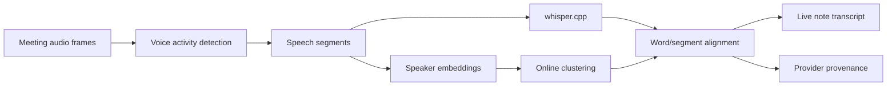
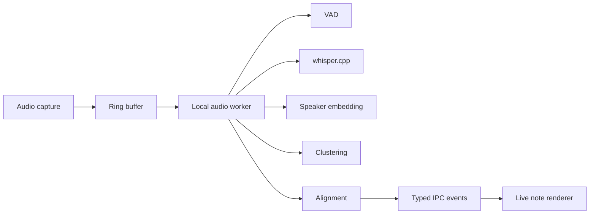

# RFC 017: On-Device Meeting Diarization

|                  |                                                                                                                                                                                                                        |
| ---------------- | ---------------------------------------------------------------------------------------------------------------------------------------------------------------------------------------------------------------------- |
| **RFC**          | 017                                                                                                                                                                                                                    |
| **Status**       | Draft                                                                                                                                                                                                                  |
| **Track**        | Local audio intelligence                                                                                                                                                                                               |
| **Owners**       | `apps/x`                                                                                                                                                                                                               |
| **Created**      | 2026-06-06                                                                                                                                                                                                             |
| **Last updated** | 2026-06-06                                                                                                                                                                                                             |
| **Depends on**   | [RFC 009](./009-local-on-device-transcription.md)                                                                                                                                                                      |
| **Related**      | [RFC 014](./014-live-note-observability-cost-and-provenance.md), [RFC 016](./016-app-family-consolidation.md)                                                                                                          |
| **Refs**         | Supersedes former whisper.cpp research plan; quality references: [`docs/DESKTOP_PERFORMANCE_GATE.md`](../../docs/DESKTOP_PERFORMANCE_GATE.md), [`docs/DESKTOP_QUALITY_GATES.md`](../../docs/DESKTOP_QUALITY_GATES.md). |

## Summary

RFC 009 adds local transcription with whisper.cpp and keeps meetings on Deepgram
by default because diarization quality remains a product requirement. This RFC
defines the follow-up: an opt-in local diarization pipeline that can identify
speaker segments on-device for meetings, recover better in-room speaker labels
than the current channel-level `You`/`Other` fallback, and preserve the same
privacy and performance posture as local transcription.

The v1 product posture is a beta-quality local meetings mode, not an immediate
replacement for cloud diarization.

## Problem

Meeting transcription has two separate jobs:

- Speech-to-text: convert audio into words.
- Diarization: assign words or time ranges to speakers.

Whisper.cpp addresses the first job. It does not solve robust multi-speaker
diarization for overlapping, noisy, or remote-call audio. If desktop simply
routes meetings to local whisper.cpp, users lose an important product behavior:
knowing who said what.

## Goals

- Add a local speaker diarization pipeline for meetings.
- Keep all diarization audio processing on-device in local mode.
- Support a beta mode that can label speakers as `Speaker 1`, `Speaker 2`, etc.
- Preserve RFC 009 fallback behavior to cloud meetings when local quality or
  performance is insufficient.
- Capture quality metrics without uploading raw audio.
- Integrate with desktop live-note provenance so users can tell when a note used
  local beta diarization.

## Non-Goals

- Making local diarization the default for all users in v1.
- Replacing Deepgram meetings mode before quality gates pass.
- Cloud diarization redesign.
- Biometric identity recognition.
- Naming real people automatically from voice prints.
- Training custom speaker models on user audio.
- Supporting every conferencing app-specific audio topology in v1.

## User-facing behavior

Local meetings mode has three states:

| State                             | Behavior                                                                                       |
| --------------------------------- | ---------------------------------------------------------------------------------------------- |
| `cloud_meetings_default`          | Existing default. Meetings use cloud provider diarization when the user has quota and consent. |
| `local_diarization_beta`          | Meeting audio is transcribed and diarized locally. Speakers are anonymous labels.              |
| `local_transcript_no_diarization` | Fallback when diarization is disabled, unavailable, or fails quality checks.                   |

The note header should show the provider mode:

```text
Transcription: Local
Diarization: Local beta
```

When local diarization is not confident, the transcript should fall back to
channel labels or anonymous speaker labels instead of inventing identities.

## Architecture



## Pipeline

### 1. Audio capture

Reuse the audio capture path owned by `apps/x`. The diarization pipeline consumes
the same normalized PCM stream as transcription.

Inputs:

- sample rate
- channel layout
- timestamped audio frames
- capture source metadata
- meeting session id

The pipeline must not write raw meeting audio to disk unless an existing local
recording feature explicitly does so and the user has enabled it.

### 2. Voice activity detection

VAD splits audio into speech and non-speech regions. It is required even when
the embedding model can tolerate silence because it reduces CPU cost and
improves clustering quality.

Requirements:

- streaming operation
- bounded latency target under 2 seconds
- configurable aggressiveness
- silence segments preserved as timing gaps, not transcript text

### 3. Speaker embeddings

The local model manager from RFC 009 should be extended to install and verify a
speaker embedding model.

Requirements:

- offline model download after install
- checksum verification
- explicit model version in provenance
- uninstall path
- CPU execution in v1, optional acceleration later

Candidate implementation families:

- ONNX speaker embedding models
- pyannote-compatible exported models
- small local speaker encoders with a native runtime

The exact model is an implementation choice, but it must pass the quality gates
below before graduating out of beta.

### 4. Clustering

The v1 clustering algorithm should be conservative:

- Assign stable anonymous labels within one meeting.
- Avoid over-splitting one speaker into many speakers.
- Prefer `Unknown speaker` over a false confident assignment.
- Support speaker-count hints only as optional tuning.

The transcript model stores speaker ids as local meeting-scoped identifiers:

```ts
type LocalSpeakerLabel = {
  meetingId: string;
  speakerId: string;
  displayName: "Speaker 1" | "Speaker 2" | "Unknown speaker";
  confidence?: number;
};
```

No biometric identity is persisted across meetings in v1.

### 5. Alignment

Whisper.cpp segment timestamps and diarization segments will not line up
perfectly. The alignment layer assigns transcript segments to speaker labels
with overlap-aware rules:

1. Use time overlap between STT segments and diarization turns.
2. Split transcript segments when one STT segment spans multiple speaker turns.
3. Mark low-confidence overlap as `Unknown speaker`.
4. Preserve original STT timestamps for traceability.

## Provenance

Each local diarized meeting note records:

```json
{
  "transcription_provider": "whisper.cpp",
  "transcription_model": "base.en",
  "diarization_provider": "local",
  "diarization_model": "speaker-embedding-v1",
  "diarization_mode": "beta",
  "audio_uploaded": false,
  "speaker_identity_persistence": "meeting_only"
}
```

This provenance should be visible in the same trust surface as RFC 014.

## Quality gates

Local diarization cannot move from beta to default until it passes:

| Gate       | Target                                                                               |
| ---------- | ------------------------------------------------------------------------------------ |
| DER        | Documented diarization error rate against internal fixture set.                      |
| WER impact | No material regression versus RFC 009 local STT alone.                               |
| Latency    | Streaming speaker labels update within product-acceptable delay.                     |
| CPU        | Sustained meeting processing stays within desktop performance budget.                |
| Memory     | Model and buffers fit within desktop memory gate.                                    |
| Battery    | No severe battery regression on laptop profiles.                                     |
| UX         | Users can distinguish cloud diarization, local beta diarization, and no diarization. |

The exact numeric thresholds should be set during implementation after fixture
collection, but the gate names are fixed.

## Evaluation dataset

Use local-only test fixtures that cover:

- one speaker
- two speakers
- three or more speakers
- crosstalk
- noisy rooms
- remote-call audio
- microphone plus system audio
- speaker changes inside one STT segment
- long meetings over 30 minutes

Fixtures must not include private customer audio unless the user has explicitly
consented to local test use under a written policy.

## Failure handling

| Failure                   | Behavior                                                                         |
| ------------------------- | -------------------------------------------------------------------------------- |
| Diarization model missing | Show local STT without diarization or offer cloud meetings mode.                 |
| Model verification fails  | Disable local diarization and surface a recoverable model error.                 |
| CPU budget exceeded       | Drop diarization, keep transcription.                                            |
| Low confidence            | Use `Unknown speaker` or channel labels.                                         |
| Alignment fails           | Preserve transcript text and timestamps without speaker attribution.             |
| Crash                     | Restart local worker if possible; do not lose already committed transcript text. |

## Privacy and security

- Raw audio remains local in local diarization mode.
- Speaker embeddings are meeting-scoped and deleted with the meeting transcript
  unless an explicit future feature changes that policy.
- No cross-meeting voice identity in v1.
- Model downloads use checksum verification.
- Crash reports must not include raw audio or embeddings.

## Rollout

### Phase 0: Research spike

- Select candidate local VAD and speaker embedding runtime.
- Build an offline fixture runner.
- Measure CPU, memory, DER, and alignment quality.

### Phase 1: Hidden local pipeline

- Add model-manager support for diarization assets.
- Run local diarization behind a developer flag.
- Emit provenance and performance metrics locally.

### Phase 2: Beta product mode

- Add user-facing `Local diarization beta` mode.
- Show local beta provenance in live notes.
- Keep Deepgram meetings as the default.

### Phase 3: Default decision

- Compare beta results against cloud diarization.
- Decide whether to promote, keep as beta, or limit to privacy-first users.

## Detailed implementation design

### Runtime topology

Local diarization should run in a worker boundary separate from the renderer:



The renderer receives typed transcript updates. It never runs model inference on
the UI thread.

### Threading and backpressure

Recommended worker lanes:

| Lane       | Work                      | Notes                                           |
| ---------- | ------------------------- | ----------------------------------------------- |
| capture    | read audio frames         | Must avoid blocking; drops are visible metrics. |
| VAD        | speech segmentation       | Low-latency, small model.                       |
| STT        | whisper.cpp decode        | Heaviest lane; already covered by RFC 009.      |
| embedding  | speaker vectors           | Can batch speech segments.                      |
| clustering | online speaker assignment | Maintains meeting-local state.                  |
| alignment  | join words and speakers   | Produces UI-ready events.                       |

Backpressure policy:

- never block audio capture on diarization
- allow diarization to lag behind STT by a bounded amount
- drop/refine speaker labels before dropping transcript text
- if CPU is constrained, increase diarization latency or disable diarization
  before disabling STT

### Audio segment model

```ts
type AudioFrame = {
  sessionId: string;
  timestampMs: number;
  durationMs: number;
  sampleRate: number;
  channels: number;
  pcmRef: string;
};

type SpeechSegment = {
  segmentId: string;
  startMs: number;
  endMs: number;
  channel?: number;
  vadConfidence: number;
  audioRef: string;
};
```

`pcmRef` and `audioRef` are local memory or temp-file references, not cloud
identifiers.

### Transcript segment model

```ts
type TranscriptSegment = {
  segmentId: string;
  text: string;
  startMs: number;
  endMs: number;
  words?: Array<{
    text: string;
    startMs: number;
    endMs: number;
    confidence?: number;
    speakerId?: string;
  }>;
  speakerId?: string;
  speakerConfidence?: number;
  provider: "whisper.cpp";
};
```

Word-level speaker labels are preferred when available. Segment-level labels are
acceptable for beta.

### Diarization state model

```ts
type DiarizationState = {
  sessionId: string;
  modelVersion: string;
  speakers: Array<{
    speakerId: string;
    displayName: string;
    embeddingCentroidRef: string;
    firstSeenMs: number;
    lastSeenMs: number;
    segmentCount: number;
  }>;
  assignments: Array<{
    segmentId: string;
    speakerId: string;
    confidence: number;
    method: "embedding_cluster" | "channel_fallback" | "unknown";
  }>;
};
```

Embedding references are local and deleted with the session unless future product
policy explicitly introduces persistent voice profiles.

### VAD parameters

Initial tunables:

| Parameter            | Default        | Notes                               |
| -------------------- | -------------- | ----------------------------------- |
| frame size           | 20-30 ms       | Common VAD window.                  |
| speech threshold     | model-specific | Exposed only to debug settings.     |
| min speech duration  | 250 ms         | Filters clicks/noise.               |
| min silence gap      | 300 ms         | Controls segment splitting.         |
| max segment duration | 20-30 s        | Prevents huge embedding/STT chunks. |

These should be config-driven for fixture tuning but not exposed as normal user
preferences.

### Embedding and clustering details

The first shippable clustering approach should be simple:

1. Generate an embedding for each stable speech segment.
2. Compare to existing speaker centroids.
3. Assign to nearest centroid above similarity threshold.
4. Create a new speaker if no centroid is close enough and max speaker count is
   not exceeded.
5. Update centroid with weighted average.
6. Mark low-confidence or overlapping segments as unknown.

Tunable values:

- similarity threshold
- unknown threshold
- max speakers before requiring manual split
- centroid update weight
- minimum segment length for embedding
- overlap handling policy

Avoid complex offline re-clustering in v1 unless implemented as an optional
post-meeting refinement pass.

### Online versus trailing refinement

V1 can support two modes:

| Mode                | Benefit                                    | Cost                                    |
| ------------------- | ------------------------------------------ | --------------------------------------- |
| Online              | Speaker labels appear during meeting.      | Lower quality; early labels may change. |
| Trailing refinement | Better cluster stability after more audio. | Labels may update after delay.          |

The UI should tolerate label corrections:

```text
Speaker 2 -> Speaker 1
Unknown speaker -> Speaker 3
```

Corrections should be applied as transcript patch events with stable segment ids.

### Overlap handling

Overlapping speech is hard. V1 policy:

- do not invent two simultaneous word streams unless STT provides them
- mark overlap-heavy segments as low confidence
- prefer primary speaker by dominant energy/overlap
- show `Unknown speaker` when confidence is poor
- keep raw timing so future refinement can improve labels

### Meeting source layouts

Handle these layouts explicitly:

| Layout                    | Behavior                                      |
| ------------------------- | --------------------------------------------- |
| single microphone         | diarize by embedding only                     |
| microphone + system audio | use channels as weak hints, then embeddings   |
| remote call mixed audio   | diarize by embedding, expect lower confidence |
| stereo participants       | use channel as hint when available            |
| screen recording audio    | treat as mixed audio                          |

Channel labels such as `You`/`Other` can be preserved as hints but should not be
confused with speaker identity.

### Model manager extensions

RFC 009 model manager adds:

```ts
type LocalModelAsset = {
  id: string;
  kind: "transcription" | "vad" | "speaker_embedding";
  version: string;
  platform: "darwin-arm64" | "darwin-x64" | "win32-x64" | "linux-x64";
  path: string;
  checksum: string;
  sizeBytes: number;
  installedAt?: string;
};
```

Install flow:

1. Fetch manifest.
2. Check available disk.
3. Download asset.
4. Verify checksum.
5. Move into model cache atomically.
6. Mark installed.
7. Run a tiny self-test.

Failed installs should leave the previous model usable.

### Platform packaging

macOS:

- prefer native or ONNX runtime with signed binaries
- support Apple Silicon path first if that is primary desktop hardware
- ensure notarization includes model/runtime assets where required

Windows:

- avoid requiring Python runtime for production
- package native runtime libraries with app
- test microphone/system-audio combinations separately

Linux:

- treat as best effort unless the product officially supports desktop Linux
- document dependencies when native audio stack varies

### Performance budgets

Collect:

- real-time factor for STT
- diarization lag seconds
- CPU percent by process
- peak memory
- model load time
- dropped audio frames
- battery drain estimate
- UI frame drops

Initial gate suggestion:

| Metric                 | Beta maximum                                        |
| ---------------------- | --------------------------------------------------- |
| diarization lag        | under 10 seconds in normal meetings                 |
| UI frame drops         | no visible sustained jank                           |
| dropped capture frames | near zero                                           |
| model load time        | under 5 seconds after installed                     |
| memory overhead        | documented and accepted by desktop performance gate |

Final numeric thresholds should come from the desktop performance plan.

### Quality metrics

Measure:

- DER: diarization error rate
- JER: Jaccard error rate when useful
- speaker count accuracy
- false split rate
- false merge rate
- unknown rate
- WER delta versus no diarization
- label correction frequency

Quality reports should include dataset composition. A single aggregate DER can
hide poor behavior in noisy or mixed-audio meetings.

### Fixture runner

Create a local fixture command:

```text
rowboat-audio-fixtures diarize \
  --input fixtures/meeting_two_speakers.wav \
  --rttm fixtures/meeting_two_speakers.rttm \
  --transcript fixtures/meeting_two_speakers.json \
  --model speaker-embedding-v1
```

Outputs:

- DER/JER
- timing stats
- memory stats
- speaker confusion matrix
- transcript assignment diff
- JSON report for CI

### UI details

Meeting settings:

- `Cloud diarization`
- `Local diarization beta`
- `Local transcription only`

Transcript UI:

- anonymous speaker labels
- confidence warning for beta
- ability to rename speakers within the meeting
- visible provider/provenance
- warning when labels may update after refinement

Renaming `Speaker 1` to "Alex" is local to that meeting in v1. It does not
create a reusable voice profile.

### Crash recovery

Persist partial transcript text before diarization refinement. Recovery order:

1. Restore committed transcript.
2. Restore run/session metadata.
3. Discard incomplete embedding/clustering state if unsafe.
4. Resume transcription if audio stream continues.
5. Mark diarization as interrupted if it cannot be resumed.

Never corrupt the note because diarization state is inconsistent.

### Privacy detail

Speaker embeddings are sensitive. Treat them like local biometric derivatives
even if they are not used for identity:

- keep in memory when possible
- encrypt temp storage if persisted
- delete on meeting delete
- exclude from telemetry
- exclude from crash dumps
- do not sync by default

### Rollback plan

Feature flags:

- `LOCAL_DIARIZATION_ENABLED`
- `LOCAL_DIARIZATION_BETA_UI`
- `LOCAL_DIARIZATION_REFINEMENT`
- `LOCAL_DIARIZATION_FIXTURE_MODE`

Rollback means hiding local diarization UI and keeping RFC 009 local STT or cloud
meetings behavior intact.

## Decisions

- Local diarization is a follow-up to RFC 009, not part of the first local STT
  rollout.
- V1 speaker labels are anonymous and meeting-scoped.
- The product default remains cloud meetings until local diarization quality
  gates pass.
- Diarization failure must not discard transcript text.
- Provenance must state local/cloud provider and beta/default mode.

## Acceptance criteria

- A developer flag can process a meeting locally and produce speaker-labeled
  transcript segments.
- The pipeline records local diarization provenance.
- Missing or failed diarization falls back to usable transcript text.
- Performance gates are measured on desktop fixture hardware.
- Beta UI distinguishes local diarization from cloud diarization.

## Open questions

- Which local speaker embedding model gives the best quality/performance tradeoff
  on the supported desktop platforms?
- Should local diarization run inline during transcription or as a trailing
  refinement pass for long meetings?
- Should users be allowed to manually rename `Speaker 1` within a meeting?
