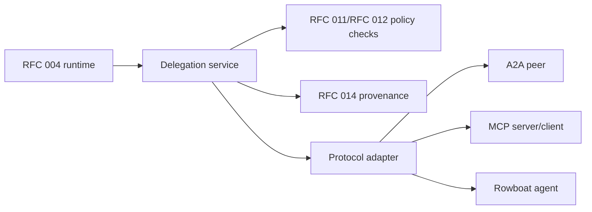

# RFC 018: A2A Delegation and Agent Identity

|                  |                                                                                                                                                                                                                                      |
| ---------------- | ------------------------------------------------------------------------------------------------------------------------------------------------------------------------------------------------------------------------------------ |
| **RFC**          | 018                                                                                                                                                                                                                                  |
| **Status**       | Draft                                                                                                                                                                                                                                |
| **Track**        | Agent identity and delegation                                                                                                                                                                                                        |
| **Owners**       | `future protocol`, `apps/rowboat-api`, `apps/x`                                                                                                                                                                                      |
| **Created**      | 2026-06-06                                                                                                                                                                                                                           |
| **Last updated** | 2026-06-06                                                                                                                                                                                                                           |
| **Depends on**   | [RFC 011](./011-identity-and-authorization-plane.md), [RFC 012](./012-connector-suite-and-consent-broker.md), [RFC 014](./014-live-note-observability-cost-and-provenance.md)                                                        |
| **Related**      | [RFC 004](./004-cloud-agent-runtime.md), [RFC 008](./008-conduit-eigen-faculties.md), [RFC 013](./013-oppulence-product-connector-fabric.md), [RFC 016](./016-app-family-consolidation.md)                                           |
| **Parent docs**  | [`docs/roadmap-2026-2046.md`](../../docs/roadmap-2026-2046.md), [`docs/one-pager-product.md`](../../docs/one-pager-product.md), [`docs/architecture-cross-portfolio-cockpit.md`](../../docs/architecture-cross-portfolio-cockpit.md) |

## Summary

The long-term product direction assumes users can delegate work to agents that
coordinate across tools, services, and other agents while preserving consent,
auditability, and user-side control. This RFC defines the boundary for
agent-to-agent delegation and agent identity. It does not make A2A a near-term
default runtime. It establishes the identity, permission, protocol, and
observability primitives needed before Rowboat agents can safely delegate work
outside a single run.

The core decision: every delegation must be attributable to a user, organization,
agent, run, scope, and approval policy. No agent gets ambient authority.

## Problem

Current RFCs define cloud execution, connector tools, product faculties, and
trust surfaces. They do not yet define what happens when:

- one Rowboat agent asks another agent to perform a subtask
- a user-side desktop agent delegates to a hosted agent
- a Rowboat agent calls an external agent over A2A or MCP-like protocols
- an external agent asks Rowboat for data or action
- a delegated task needs connector scopes or money-touching approval

Without a first-class delegation model, agent integrations will either be too
weak to use or too powerful to trust.

## Goals

- Define agent identities as auditable actors.
- Support user-authorized delegation between Rowboat agents.
- Provide a protocol adapter boundary for A2A and MCP-style integrations.
- Bind delegated actions to connector scopes and consent records.
- Preserve human approval gates for sensitive and money-touching actions.
- Record delegation chains in live-note/run provenance.
- Enable future cross-portfolio agent workflows without bypassing RFC 011/RFC
  012 authorization.

## Non-Goals

- Implementing a full A2A protocol stack in this RFC.
- Replacing the RFC 004 cloud runtime.
- Giving agents persistent autonomous authority by default.
- Allowing external agents to bypass WorkOS, connector consent, or approval
  tokens.
- Defining a blockchain, DID, or cryptographic identity requirement.
- Guaranteeing compatibility with every emerging agent protocol.

## Terminology

| Term             | Meaning                                                                                 |
| ---------------- | --------------------------------------------------------------------------------------- |
| User principal   | The human or organization identity from RFC 011.                                        |
| Agent identity   | A named, versioned Rowboat or external agent actor.                                     |
| Delegation       | A bounded request from one actor to another actor to perform work.                      |
| Delegation token | A short-lived, scoped credential representing one delegation.                           |
| Delegation chain | Ordered provenance from user to agent to sub-agent to tool/action.                      |
| Protocol adapter | Boundary that translates Rowboat delegation semantics to A2A, MCP, or another protocol. |

## Actor model

```ts
type AgentActor = {
  type: "agent";
  agentId: string;
  agentVersion?: string;
  ownerUserId?: string;
  ownerOrganizationId?: string;
  trustDomain: "rowboat" | "oppulence" | "external";
};

type DelegationContext = {
  delegationId: string;
  parentDelegationId?: string;
  userId: string;
  organizationId?: string;
  sourceAgent: AgentActor;
  targetAgent: AgentActor;
  runId?: string;
  scopes: string[];
  expiresAt: string;
  approvalPolicy: "none" | "review_required" | "dual_review_required";
  reason: string;
};
```

An agent actor is never a replacement for the user principal. It is an
additional actor in the audit chain.

## Permission model

Delegation uses least privilege:

1. The user or organization grants a base capability.
2. The source agent requests a subset of that capability.
3. The delegation service mints a short-lived delegation token.
4. The target agent can use only the delegated scopes.
5. Tool calls still check connector consent, entitlement, and approval policy.

Scopes should reuse RFC 012 connector and product scopes where possible:

```text
gmail.read
calendar.read
conduit.read
eigen.simulate
canvas.read
cadence.watch
corinthian.read
action.propose
action.approve_request
```

Money-touching actions cannot be delegated as final authority. They can be
delegated only as proposals that require the relevant review gate.

## Delegation token

Delegation tokens are:

- short-lived
- audience-bound
- scope-bound
- run-bound when created inside a run
- revocable
- logged by token id, not by raw token

Example claims:

```json
{
  "sub": "agent:rowboat/live-note-writer",
  "aud": "agent:oppulence/eigen-forecast",
  "delegation_id": "del_123",
  "user_id": "usr_123",
  "org_id": "org_123",
  "run_id": "run_123",
  "scope": ["eigen.simulate"],
  "approval_policy": "none",
  "exp": 1770249600
}
```

## Protocol adapter boundary



Protocol adapters are not trusted policy engines. They translate messages and
credentials, then call back into Rowboat policy checks for data access and
actions.

Adapters must support:

- identity handshake
- capability discovery
- scoped request envelope
- structured result envelope
- error taxonomy
- audit event emission
- timeout and cancellation

## Request envelope

```json
{
  "delegation_id": "del_123",
  "parent_delegation_id": "del_122",
  "source_agent": "rowboat/live-note-writer@1",
  "target_agent": "oppulence/eigen-forecast@1",
  "task": "simulate cash impact of delaying vendor payment",
  "scopes": ["eigen.simulate"],
  "inputs": {
    "scenario_ref": "artifact:scenario_123"
  },
  "approval_policy": "none",
  "expires_at": "2026-06-06T18:15:00Z"
}
```

Inputs should reference artifacts where possible instead of embedding sensitive
payloads directly in the delegation envelope.

## Result envelope

```json
{
  "delegation_id": "del_123",
  "status": "succeeded",
  "artifacts": ["artifact:eigen_result_456"],
  "summary": "Delaying payment preserves 3.1 weeks of runway under the selected scenario.",
  "tool_calls": [
    {
      "tool": "eigen.simulate",
      "status": "succeeded"
    }
  ]
}
```

The result summary is user-visible only after the normal run artifact and
provenance rules apply.

## Observability and provenance

RFC 014 must be extended to show:

- source agent
- target agent
- protocol adapter
- delegated scopes
- approval policy
- token id
- timeout/cancellation
- artifacts produced by the delegated agent
- full delegation chain

Run history should answer:

```text
Who asked which agent to do what, using which authority, producing which result?
```

## External agent trust levels

| Trust level           | Allowed behavior                                                                      |
| --------------------- | ------------------------------------------------------------------------------------- |
| `rowboat_internal`    | Can receive scoped delegation tokens and access internal artifacts allowed by policy. |
| `oppulence_internal`  | Can receive scoped product/faculty delegation with product-specific policies.         |
| `verified_external`   | Can receive narrow scopes after explicit admin/user configuration.                    |
| `unverified_external` | Capability discovery only; no data or action scopes.                                  |

Trust level is not enough by itself. Scopes, consent, and approval policy still
apply.

## Failure handling

| Failure                   | Behavior                                                      |
| ------------------------- | ------------------------------------------------------------- |
| Target unavailable        | Mark delegation failed; parent run decides retry or fallback. |
| Scope denied              | Fail closed with policy error.                                |
| Token expired             | Fail closed; do not auto-renew without parent run authority.  |
| Adapter error             | Emit adapter-specific error with bounded details.             |
| External result malformed | Reject result and record validation failure.                  |
| Approval required         | Return proposal artifact, not final action.                   |

## Security requirements

- Delegation tokens must be short-lived and audience-bound.
- External agents never receive raw connector tokens.
- Sensitive inputs should pass by artifact reference when possible.
- Every delegated tool call re-checks policy.
- Delegation chains are immutable audit records.
- Administrators can disable external delegation at tenant level.
- Revocation prevents future use of outstanding delegation tokens where the
  backing token infrastructure supports it.

## Rollout

### Phase 0: Model only

- Add agent identity and delegation record schemas.
- Add audit events for internal no-op delegations.
- Surface delegation chains in developer run history.

### Phase 1: Internal delegation

- Allow one Rowboat runtime agent to delegate to another internal Rowboat
  capability behind a flag.
- Use existing tool scopes and approval policies.
- No external protocol adapters.

### Phase 2: Oppulence faculty delegation

- Allow Rowboat agents to delegate scoped work to Conduit/Eigen/Cadence style
  product faculties.
- Preserve dual-review policy for action proposals.

### Phase 3: External protocol adapters

- Add one A2A or MCP-style adapter in dark-launch mode.
- Support capability discovery and scoped request/result envelopes.
- Restrict to verified external agents.

### Phase 4: User-facing delegation controls

- Add tenant and user controls for external delegation.
- Show delegation chains and revocation status in the trust surface.

## Detailed implementation design

### Data model

```text
AgentIdentity
  id uuid
  agent_key string unique
  display_name string
  owner_type enum(rowboat, oppulence, tenant, external)
  owner_id string nullable
  trust_domain enum(rowboat, oppulence, external)
  trust_level enum(rowboat_internal, oppulence_internal, verified_external, unverified_external)
  version string
  status enum(active, disabled, revoked)
  capabilities_json json
  created_at timestamp
  updated_at timestamp

Delegation
  id uuid
  parent_id uuid nullable
  user_id uuid
  organization_id uuid nullable
  source_agent_id uuid
  target_agent_id uuid
  run_id uuid nullable
  protocol enum(rowboat_internal, a2a, mcp)
  scopes string[]
  approval_policy enum(none, review_required, dual_review_required)
  status enum(created, dispatched, succeeded, failed, cancelled, expired)
  reason text
  expires_at timestamp
  created_at timestamp
  updated_at timestamp

DelegationToken
  id uuid
  delegation_id uuid
  token_hash string
  audience string
  scopes string[]
  expires_at timestamp
  revoked_at timestamp nullable
  created_at timestamp
```

Raw delegation tokens are never stored.

### API surface

#### `POST /v1/agents/delegations`

Creates a delegation from the current actor or current run.

Request:

```json
{
  "source_agent": "rowboat/live-note-writer@1",
  "target_agent": "oppulence/eigen-forecast@1",
  "run_id": "run_123",
  "scopes": ["eigen.simulate"],
  "reason": "Simulate cash impact for the Acme note.",
  "approval_policy": "none",
  "input_artifacts": ["artifact:scenario_123"],
  "expires_in_seconds": 600
}
```

Response:

```json
{
  "delegation_id": "del_123",
  "status": "created",
  "expires_at": "2026-06-06T12:10:00Z"
}
```

This endpoint does not automatically call an external agent unless the caller
uses a dispatch mode explicitly enabled by feature flag.

#### `POST /v1/agents/delegations/{id}:dispatch`

Dispatches a delegation through an adapter:

```json
{
  "protocol": "rowboat_internal",
  "adapter": "eigen",
  "timeout_seconds": 60
}
```

#### `GET /v1/agents/delegations/{id}`

Returns status, target, scopes, artifacts, and audit summary. It does not return
raw token material.

#### `POST /v1/agents/delegations/{id}:cancel`

Cancels pending work and revokes outstanding delegation token where possible.

### Policy check algorithm

Before minting a delegation token:

1. Resolve user/org actor from run or request.
2. Resolve source agent identity.
3. Resolve target agent identity.
4. Verify source agent may delegate at all.
5. Verify target agent trust level.
6. Verify requested scopes are allowed by user/org policy.
7. Verify connector grants for connector scopes.
8. Verify approval policy for high-risk scopes.
9. Verify tenant-level external delegation setting.
10. Create delegation record.
11. Mint short-lived token.
12. Emit provenance event.

Any missing policy input fails closed. The system should never "warn and allow"
external delegation.

### Capability discovery

Agent capability documents:

```json
{
  "agent_key": "oppulence/eigen-forecast",
  "version": "1",
  "display_name": "Eigen Forecast",
  "protocols": ["rowboat_internal", "mcp"],
  "capabilities": [
    {
      "name": "simulate",
      "scopes": ["eigen.simulate"],
      "input_schema": "schema:eigen.simulate.input.v1",
      "output_schema": "schema:eigen.simulate.output.v1",
      "max_duration_seconds": 60,
      "risk": "low"
    }
  ]
}
```

Capability discovery is read-only. Unverified external agents can expose
capabilities, but they cannot receive user data until verified and authorized.

### Adapter interface

Internal code should use one adapter interface:

```go
type Adapter interface {
    Name() string
    Protocol() Protocol
    Discover(ctx context.Context, target AgentIdentity) (Capabilities, error)
    Dispatch(ctx context.Context, req DelegationRequest) (DelegationResult, error)
    Cancel(ctx context.Context, delegationID string) error
}
```

Adapter implementations:

- `rowboat_internal`: direct in-process or service call
- `mcp`: MCP client/server translation
- `a2a`: A2A envelope translation

Adapters cannot bypass policy. They receive already-authorized request envelopes
and return structured results.

### Delegation chain example

```text
user:usr_123
  -> agent:rowboat/live-note-writer@1
    -> agent:oppulence/eigen-forecast@1
      -> tool:eigen.simulate
```

If Eigen then calls Conduit for evidence:

```text
user:usr_123
  -> rowboat/live-note-writer@1
    -> oppulence/eigen-forecast@1
      -> oppulence/conduit-evidence@1
        -> tool:conduit.read
```

Each edge has its own delegation id, scopes, expiry, and result.

### Artifact passing

Delegation inputs should prefer references:

```json
{
  "artifact_ref": "artifact:scenario_123",
  "access": {
    "mode": "read",
    "expires_at": "2026-06-06T12:10:00Z"
  }
}
```

Benefits:

- avoids copying sensitive payloads into protocol logs
- supports access revocation
- keeps provenance tied to source artifacts
- lets adapters fetch only what they need

External agents should receive minimized inputs. Internal agents may receive
richer artifacts if policy allows.

### Result validation

Results must validate against declared schemas:

1. Check delegation id.
2. Check source adapter.
3. Validate JSON schema or typed result.
4. Verify artifact ids are owned by the delegated run/agent.
5. Enforce max result size.
6. Strip unsafe content from display fields.
7. Attach result to parent run provenance.

Malformed external results are rejected and recorded as adapter failures.

### Approval integration

Delegated work can create approval requests:

```json
{
  "type": "approval_request",
  "scope": "cadence.payment_run.execute",
  "resource": {
    "type": "payment_run",
    "id": "payrun_123"
  },
  "proposed_by": "agent:rowboat/live-note-writer@1",
  "delegation_id": "del_123",
  "summary": "Release $12,500 to Acme Supplies on Friday."
}
```

Approval request creation is not action execution. Product-owned policy still
verifies final execution.

### Tenant controls

Tenant settings:

```json
{
  "agent_delegation_enabled": true,
  "external_delegation_enabled": false,
  "allowed_external_agents": ["vendor/example-agent"],
  "max_delegation_chain_depth": 3,
  "max_delegation_ttl_seconds": 900,
  "require_admin_for_external_agents": true
}
```

Default posture should allow internal dark-launch delegation only and deny
external delegation.

### Chain depth and cycle prevention

Delegation creation must reject:

- target agent already present in active chain if cycles are disallowed
- chain depth over tenant/global maximum
- requested TTL longer than parent delegation TTL
- scopes broader than parent scopes
- approval policy weaker than parent policy

Child delegations can narrow authority but cannot expand it.

### Error codes

| Code                        | Meaning                                       |
| --------------------------- | --------------------------------------------- |
| `agent_unknown`             | Target or source agent not registered.        |
| `agent_disabled`            | Agent exists but is not active.               |
| `delegation_disabled`       | Tenant or global setting disables delegation. |
| `external_agent_unverified` | External agent not verified for data access.  |
| `delegation_scope_denied`   | Requested scope not allowed.                  |
| `delegation_ttl_invalid`    | TTL too long or exceeds parent.               |
| `delegation_cycle`          | Delegation would create a cycle.              |
| `adapter_unavailable`       | Protocol adapter unavailable.                 |
| `result_invalid`            | Adapter returned malformed result.            |
| `approval_required`         | Work can only produce an approval request.    |

These codes should integrate with RFC 014 run provenance.

### Observability schema

Audit event example:

```json
{
  "event": "delegation.created",
  "delegation_id": "del_123",
  "parent_delegation_id": null,
  "run_id": "run_123",
  "source_agent": "rowboat/live-note-writer@1",
  "target_agent": "oppulence/eigen-forecast@1",
  "trust_level": "oppulence_internal",
  "scopes": ["eigen.simulate"],
  "approval_policy": "none",
  "created_at": "2026-06-06T12:00:00Z"
}
```

Metrics:

- `delegation_created_total{target_trust_level,protocol,result}`
- `delegation_dispatch_seconds{protocol,result}`
- `delegation_policy_denied_total{reason}`
- `delegation_result_invalid_total{protocol}`
- `delegation_cancelled_total{reason}`

No metric labels by user id, org id, agent id if the agent set becomes
unbounded. Use bounded trust/protocol/reason labels.

### External agent verification

Verification checklist:

1. Register agent identity.
2. Record owner/contact.
3. Pin protocol endpoint.
4. Pin JWKS or credential verification method.
5. Review capability document.
6. Define allowed scopes.
7. Set tenant allowlist.
8. Run sandbox dispatch.
9. Review logs/provenance.
10. Enable for limited tenants.

External verification can be manual at first. The policy model should not assume
an automated marketplace exists.

### Sandbox mode

Before any external agent receives real data, adapters should support sandbox:

- fake user/org ids
- fixture artifacts
- no connector tokens
- no money-moving scopes
- synthetic approval responses
- full audit logging

Sandbox results should be clearly marked and never merged into real live notes
unless explicitly imported by a developer.

### Security review checklist

Before external delegation ships:

- token audience and expiry reviewed
- adapter request/response validation reviewed
- SSRF risks reviewed for external endpoints
- artifact access controls reviewed
- prompt/data exfiltration risks reviewed
- audit logs reviewed
- tenant disable switch tested
- emergency revoke path tested
- approval-required actions tested
- privacy policy reviewed

### Test plan extension

Additional tests:

- unit: child delegation cannot broaden scope
- unit: TTL cannot exceed parent TTL
- unit: chain-depth rejection
- unit: disabled tenant rejects external delegation
- unit: unverified external agent gets capability discovery only
- integration: internal delegation creates provenance chain
- integration: adapter malformed result is rejected
- integration: cancellation revokes token and records status
- security: external adapter cannot access artifact outside delegated refs
- E2E: live-note run delegates to Eigen, receives result, and displays chain

## Decisions

- Agent identity augments user identity; it never replaces it.
- Delegation authority is short-lived, scoped, audience-bound, and auditable.
- Protocol adapters translate messages but do not own policy.
- External agents never receive raw connector tokens.
- Money-touching work can be delegated only as proposals requiring review.
- A2A support starts dark and internal before any verified external integration.

## Acceptance criteria

- Internal delegation records can be created and displayed in run provenance.
- Delegation tokens include user, org, source agent, target agent, scopes, and
  expiry.
- Tool calls made through delegation re-check RFC 011/RFC 012 policy.
- External protocol adapter work cannot proceed without trust-level and admin
  controls.
- Money-touching delegated work produces a review artifact, not an automatic
  action.

## Open questions

- Which protocol should be the first adapter target: A2A, MCP client/server, or
  a Rowboat-native internal adapter?
- Should agent identities be registered per tenant, globally, or both?
- Should delegation records live in the Go service plane only, or also be
  mirrored into hosted platform project history?
