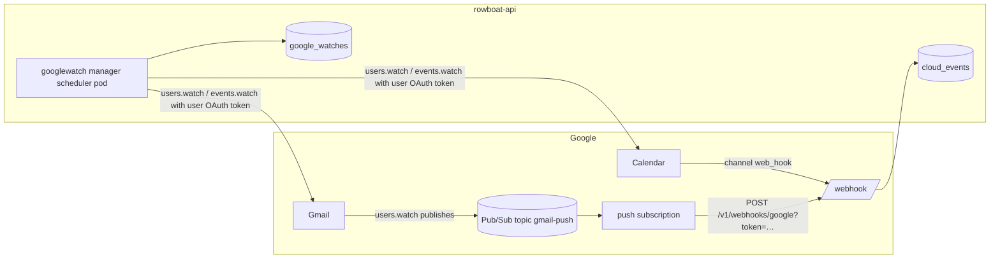

# RFC 019: Google Push Infrastructure for Cloud Event Ingestion

|                  |                                                                                                                                                                  |
| ---------------- | ----------------------------------------------------------------------------------------------------------------------------------------------------------------- |
| **RFC**          | 019                                                                                                                                                              |
| **Status**       | Accepted — code side implemented with RFC 003; GCP side is operator-provisioned per this RFC                                                                     |
| **Track**        | Cloud-native background workflows                                                                                                                                |
| **Owners**       | `apps/rowboat-api` (watch manager, webhook) · Platform/Infra (GCP project, Pub/Sub)                                                                              |
| **Created**      | 2026-06-09                                                                                                                                                       |
| **Last updated** | 2026-06-09                                                                                                                                                       |
| **Depends on**   | [RFC 003](./complete-003-cloud-event-ingestion.md) (webhook + router), [RFC 007](./007-production-cloud-enablement.md) (production rollout gates)                         |
| **Related**      | [`docs/BACKEND_DEPLOYMENT.md`](../../docs/BACKEND_DEPLOYMENT.md) (operator prerequisites index)                                                                  |

## Summary

[RFC 003](./complete-003-cloud-event-ingestion.md) shipped the *receiving* half of Google
event ingestion: `POST /v1/webhooks/google` verifies and ingests Gmail Pub/Sub
pushes and Calendar channel notifications, and `internal/googlewatch` registers
and renews the per-account subscriptions that make Google send them. What
remains is the half that **cannot be created from the codebase**: the GCP
project resources (Pub/Sub topic, publish grant, push subscription) and console
state (domain verification) that Google requires before any push flows. This
RFC specifies those resources, the configuration matrix that wires them into
the deployment, the verification procedure, and the security decisions
(shared-token verification now, Pub/Sub OIDC as the committed follow-up).

## Current state (grounded)

| Fact                                                                            | Evidence                                                                  |
| -------------------------------------------------------------------------------- | --------------------------------------------------------------------------- |
| Webhook verifies a shared token (query param or `X-Goog-Channel-Token`)         | `apps/rowboat-api/internal/cloudevents/webhooks_google.go` (`verifyGoogleToken`) |
| Gmail pushes decode `{emailAddress, historyId}`; dedupe key is history-anchored | `webhooks_google.go` (`handleGmailPush`)                                  |
| Calendar channel ids are Rowboat-minted as `gcal:{email}:{uuid}`                | `apps/rowboat-api/internal/googlewatch/manager.go` (`registerCalendar`)   |
| Watch manager runs in the scheduler pod, gated by `GOOGLE_WATCH_ENABLED`        | `apps/rowboat-api/cmd/scheduler/main.go` (`buildWatchManager`)            |
| Boot validation requires `PUBLIC_BASE_URL` + `GOOGLE_WEBHOOK_TOKEN` when on     | `apps/rowboat-api/internal/appconfig/config.go` (`Validate`)              |
| Unresolvable pushes are acked (200) and counted, never stored                   | `webhooks_google.go`; `cloud_events_unresolved_total{source}`             |
| OAuth scopes already cover `users.watch` / `events.watch`                       | `apps/rowboat-api/internal/google/handler.go` (scopes incl. `gmail.readonly`, `calendar.events.readonly`) |

No GCP resources exist in any environment; without them the webhook is a
working endpoint Google never calls.

## Goals

- Name every operator-provisioned GCP resource, with exact `gcloud` commands.
- Make provider retries, token rotation, and unresolvable accounts safe and
  observable (no retry storms, no stored unowned events).
- Keep the per-account cost profile flat: a handful of Google API calls per
  account per week.

## Non-Goals

- Pub/Sub OIDC push authentication (committed follow-up; see Decisions).
- Per-calendar watches beyond `primary`, or Gmail label configurations beyond
  `INBOX` (both are deliberate v1 bounds in the watch manager).
- Slack-side app configuration (its Events API subscription is Slack-console
  state owned by the Slack connect flow, not GCP).

## Architecture



The watch manager (left-pointing arrows) is what makes Google produce traffic;
the topic/subscription and domain verification (this RFC) are what let that
traffic reach the webhook.

## Provisioning playbook

Prerequisites: the GCP project owning the existing Google OAuth client
(`GOOGLE_OAUTH_CLIENT_ID/SECRET` in Infisical); `gcloud` authenticated against
it; the deployed `PUBLIC_BASE_URL` (production `https://api.x.solomon-ai.co`);
a generated `GOOGLE_WEBHOOK_TOKEN` (`openssl rand -hex 32`) — it serves as both
the Pub/Sub push query token and the Calendar channel token.

### 1. Enable APIs

```bash
gcloud services enable gmail.googleapis.com calendar-json.googleapis.com pubsub.googleapis.com
```

No consent-screen changes: the connect flow's scopes already cover both watch
calls.

### 2. Gmail: topic + publish grant + push subscription

Gmail never calls the webhook directly — `users.watch` makes it publish to a
topic; a push subscription forwards to the webhook.

```bash
gcloud pubsub topics create gmail-push

# Gmail publishes via a Google-owned service account.
gcloud pubsub topics add-iam-policy-binding gmail-push \
  --member=serviceAccount:gmail-api-push@system.gserviceaccount.com \
  --role=roles/pubsub.publisher

gcloud pubsub subscriptions create gmail-push-to-rowboat \
  --topic=gmail-push \
  --push-endpoint="https://api.x.solomon-ai.co/v1/webhooks/google?token=<GOOGLE_WEBHOOK_TOKEN>" \
  --ack-deadline=30 \
  --min-retry-delay=10s \
  --max-retry-delay=600s
```

Why this is safe under Pub/Sub's at-least-once delivery:

- The webhook dedupes on `gmail:history:{email}:{historyId}` and acks
  duplicates with 200 — redelivery never duplicates events.
- Pushes for accounts no Rowboat user has connected are acked (200, dropped,
  counted in `cloud_events_unresolved_total{source="gmail"}`) so Pub/Sub does
  not retry them for the 7-day retention.
- Optional hardening: `--dead-letter-topic=gmail-push-dlq
  --max-delivery-attempts=10` parks messages during a persistent webhook 5xx.

### 3. Calendar: domain verification

Calendar channels push directly to the webhook, and Google refuses channels
for unverified domains:

1. Verify `https://api.x.solomon-ai.co` in Google Search Console (DNS TXT).
2. GCP console → **APIs & Services → Domain verification** → add the same host.

Nothing else is provisioned: channels are per-user; the watch manager mints
them (`gcal:{email}:{uuid}`) with `GOOGLE_WEBHOOK_TOKEN` as the channel token,
which Google echoes back as `X-Goog-Channel-Token` for verification.

## Configuration matrix

| Key                         | Where     | Value                                                                                    |
| --------------------------- | --------- | ----------------------------------------------------------------------------------------- |
| `GOOGLE_WATCH_ENABLED`      | configmap | `"true"` (only the scheduler binary runs the loop; validation fails fast elsewhere-safe) |
| `GMAIL_PUBSUB_TOPIC`        | configmap | `projects/<PROJECT>/topics/gmail-push`; empty skips Gmail watches (Calendar still works) |
| `GOOGLE_WATCH_INTERVAL`     | configmap | `15m` (default)                                                                          |
| `GOOGLE_WATCH_RENEW_MARGIN` | configmap | `24h` (default; Google expires both watch kinds within ~7 days)                          |
| `GOOGLE_WEBHOOK_TOKEN`      | secret    | generated token from the playbook                                                        |
| `scheduler.enabled`         | helm      | `true` — the watch loop runs in the scheduler pod                                        |

Watch-only mode (`GOOGLE_WATCH_ENABLED=true`, `CLOUD_SCHEDULER_ENABLED=false`)
needs no Temporal.

## Verification

```bash
kubectl -n rowboat logs deploy/rowboat-api-scheduler | grep "google watch manager starting"

# A user connects Google; within one interval their watches register:
curl -s rowboat-api-scheduler:9090/metrics | grep google_watch_renewals_total
# google_watch_renewals_total{kind="gmail"} 1
# google_watch_renewals_total{kind="calendar"} 1

# Send the connected account an email, then:
curl -s https://api.x.solomon-ai.co/v1/events -H "Authorization: Bearer $TOK" | jq '.events[0]'
# → source=gmail, eventType=history.changed, routingStatus=routed|skipped
```

With `CLOUD_EVENTS_ROUTING_ENABLED=true` and an active `executionTarget: api`
task with `eventMatchCriteria`, the event links a `trigger=event` run
(`GET /v1/events/{id}/runs`) — RFC 003's acceptance criteria, end to end.

## Failure modes

| Symptom                                                       | Cause / fix                                                                                                                                              |
| -------------------------------------------------------------- | ---------------------------------------------------------------------------------------------------------------------------------------------------------- |
| Webhook 401s every push                                       | Token mismatch (subscription URL / channel token vs `GOOGLE_WEBHOOK_TOKEN`). Channels minted before a rotation carry the old token until renewal — force by deleting their watch rows (re-registered next tick). |
| Webhook 500 `webhook_unconfigured`                            | `GOOGLE_WEBHOOK_TOKEN` unset on the API pods (fails closed by design).                                                                                     |
| `cloud_events_unresolved_total{source="gmail"}` climbing      | Account not resolvable: connected before `external_account_id` existed (reconnect once; WorkOS-email fallback covers same-email cases) or disconnected (sweep removes the watch within one interval; pushes stop at expiry). |
| `google_watch_failures_total{stage="invalid_grant"}`          | Dead refresh token, recorded as `last_error` on the watch row; self-heals when the user reconnects Google.                                                 |
| `google_watch_failures_total{stage="register"}`               | Gmail/Calendar API rejected the call — API not enabled (step 1) or domain not verified (step 3). Details in scheduler logs.                                |
| Calendar `events.watch` → `push.webhookUrlUnauthorized`       | Domain verification incomplete for the exact `PUBLIC_BASE_URL` host.                                                                                       |
| Events ingest but `routingStatus=skipped`                     | Routing disabled (`CLOUD_EVENTS_ROUTING_ENABLED=false`) — expected until the router is on (requires Temporal).                                             |

## Token rotation

```bash
# Update the subscription endpoint first, then the cluster secret; the brief
# mismatch 401s are absorbed by Pub/Sub retries.
gcloud pubsub subscriptions update gmail-push-to-rowboat \
  --push-endpoint="https://api.x.solomon-ai.co/v1/webhooks/google?token=<NEW_TOKEN>"
kubectl -n rowboat patch secret rowboat-api-secrets \
  -p '{"stringData":{"GOOGLE_WEBHOOK_TOKEN":"<NEW_TOKEN>"}}'
kubectl -n rowboat rollout restart deploy
```

Calendar channels re-mint with the new token at their next renewal (≤ the
renew margin); force immediacy by deleting the calendar watch rows.

## Quotas / scale

- Renewal cadence (once per account per ~6 days, scanned every 15m) sits far
  below Gmail per-user and per-project API quotas.
- Gmail pushes carry no message content — only `{emailAddress, historyId}`;
  the run's agent fetches details with the user's own connection.
- Cost scales with mailbox/calendar activity (Pub/Sub messages), not with the
  number of connected accounts (two watch rows + a few API calls/week each).

## Decisions

- **Shared-token verification in v1.** The `?token=` query (Pub/Sub) and
  channel token (Calendar) are constant-time compared and fail closed when
  unconfigured. Chosen because it needs zero new JWKS plumbing and the blast
  radius is bounded: the webhook only ever stores events for resolvable users.
  Known weakness: the token can land in proxy/audit logs — treat as a secret,
  rotate per the procedure above.
- **Pub/Sub OIDC push auth is the committed follow-up**, not optional
  hardening: recreate the subscription with `--push-auth-service-account` and
  verify the OIDC JWT (audience = the push endpoint) against Google's JWKS in
  the webhook, then retire the query token for the Pub/Sub path. The channel
  token remains for Calendar (Google offers no OIDC there).
- **`INBOX`-scoped Gmail watches and `primary`-only Calendar watches** keep v1
  push volume proportional to what users actually see; widening either is a
  product decision, not an ops one.

### Deferred (needs data; not blocking)

- Dead-letter topic + alerting as a default (add with RFC 007's production
  alert pack rather than ad hoc).
- Per-environment topics (staging vs production) — one topic per cluster is
  assumed; revisit if a shared GCP project must serve both.
