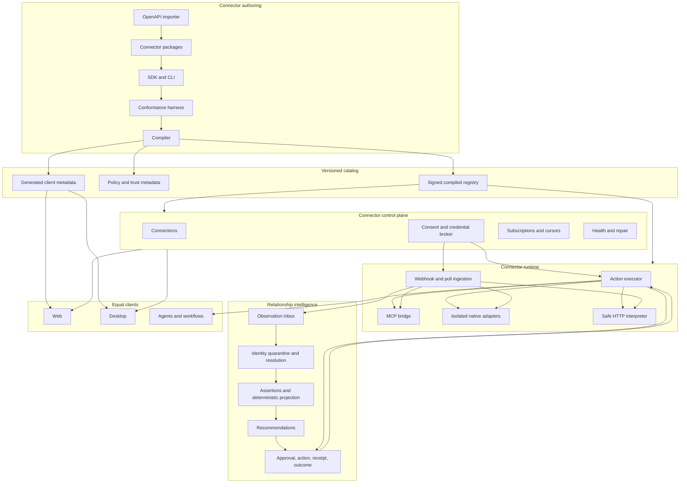

# RFC 020: Third-Party Connector Platform and SDK

|                  |                                                                                                                                                                                                                                                                                                                                             |
| ---------------- | ------------------------------------------------------------------------------------------------------------------------------------------------------------------------------------------------------------------------------------------------------------------------------------------------------------------------------------------- |
| **RFC**          | 020                                                                                                                                                                                                                                                                                                                                         |
| **Status**       | Implementing — broker foundation landed; connector platform program open                                                                                                                                                                                                                                                                    |
| **Track**        | Connector authoring, catalog, credential control, ingestion, tools, actions, and relationship evidence                                                                                                                                                                                                                                      |
| **Owners**       | `apps/rowboat-api`, connector platform, relationship intelligence, `apps/rowboat-www`, `apps/x`                                                                                                                                                                                                                                             |
| **Created**      | 2026-06-09                                                                                                                                                                                                                                                                                                                                  |
| **Reworked**     | 2026-07-26                                                                                                                                                                                                                                                                                                                                  |
| **Depends on**   | [RFC 010](./complete-010-rowboat-api-service-plane.md), [RFC 011](./complete-011-identity-and-authorization-plane.md), [RFC 012](./012-connector-suite-and-consent-broker.md), [RFC 014](./014-live-note-observability-cost-and-provenance.md), [RFC 023](./023-closed-loop-actions.md), [RFC 027](./complete-027-durable-agent-runtime.md) |
| **Enables**      | [RFC 036](./036-relationship-state-engine.md), [RFC 032](./032-detection-sensor-integrations.md), [RFC 033](./033-integration-parity-surface.md), broad third-party integration coverage                                                                                                                                                    |
| **Supersedes**   | The original RFC 020 draft, which covered only provider/action manifests, OAuth, execution, and MCP exposure                                                                                                                                                                                                                                |
| **External ref** | Sim public repository snapshot [`6f514c1`](https://github.com/simstudioai/sim/tree/6f514c1c9dfc41fa13a3eeada07b901d10d29ab8) inspected 2026-07-26                                                                                                                                                                                           |

## 1. Executive decision

Oppulence will build one **third-party connector platform**, not a collection
of one-off integrations.

A connector is a versioned package that can:

1. authenticate one or more provider accounts;
2. discover and read provider objects;
3. receive webhooks or poll incrementally;
4. normalize provider events into evidence for the living relationship model;
5. expose typed read and action capabilities to agents and deterministic
   workflows;
6. execute approved side effects safely;
7. report freshness, lag, errors, cost, and provenance;
8. render the same connection and capability model in web and desktop.

The platform uses a **declarative fast path** for ordinary HTTP APIs, an
**MCP bridge** for trustworthy provider-maintained tool servers, and a
**reviewed native adapter escape hatch** for protocols or semantics that cannot
be expressed safely as data.

The unit of scale is a `ConnectorPackage`, not a handler, UI card, OAuth route,
or tool definition. The package is compiled into:

- a server catalog;
- runtime action and ingestion plans;
- authorization and approval policies;
- generated Go and TypeScript contracts;
- catalog metadata for both clients;
- conformance tests and documentation.

This RFC evolves the existing RFC 020 rather than adding a parallel connector
system. RFC 012 remains the authorization substrate. RFC 020 owns third-party
connector authoring and runtime semantics. RFC 036 owns canonical relationship
state.

## 2. Product contract

The product promise is:

> Oppulence maintains an accurate, living model of every customer relationship
> and tells the team what needs action.

Connectors exist to make that promise true. Breadth alone is not the product.
An integration is valuable when it increases one or more of:

- relationship coverage;
- identity accuracy;
- evidence freshness;
- commitment, risk, milestone, or participant accuracy;
- recommendation usefulness;
- safe action completion;
- outcome capture.

Therefore:

- integrations are **evidence streams and governed actuators**;
- a connector may emit observations but may not write canonical relationship
  state;
- every material relationship claim remains traceable to source evidence;
- every consequential external action remains policy-checked, approval-bound,
  idempotent, and receipted;
- a provider outage or stale cursor is visible in relationship completeness;
- web and desktop are equal clients of the same connector control plane;
- the relationship history survives replacing a connector implementation.

The category is not “workflow automation with many logos.” It is relationship
intelligence with a connector substrate capable of broad, dependable coverage.

## 3. Scope

### 3.1 In scope

- connector package specification;
- connector SDK and CLI;
- provider, capability, action, trigger, object, selector, and mapping schemas;
- OAuth, API-key, service-account, signed-request, and no-auth connections;
- multi-account and organization-shared connections;
- connection lifecycle and health;
- webhook, push, polling, import, and backfill ingestion;
- action execution and normalized receipts;
- provider rate limits, retries, pagination, and idempotency;
- relationship observation and identity-hint emission;
- provider MCP and user-supplied MCP wrapping;
- OpenAPI-based scaffolding;
- compiled catalogs and generated client contracts;
- web/desktop catalog and settings parity;
- versioning, compatibility, deprecation, certification, and kill switches;
- security, privacy, observability, cost, SLOs, tests, and release gates;
- a program for growing from reference connectors to hundreds of maintained
  integrations.

### 3.2 Non-goals

- copying Sim’s code or matching its catalog logo-for-logo;
- allowing arbitrary unreviewed code in the production API process;
- making every provider object part of canonical relationship state;
- letting connector packages define tenant authorization policy;
- exposing long-lived provider credentials to web, desktop, an LLM, or an MCP
  client;
- direct connector mutation of relationship snapshots;
- autonomous money-moving or externally visible actions;
- claiming “1,000 integrations” when most are untested passthroughs;
- replacing first-party deep Gmail, Calendar, Slack, meeting, or product paths
  before the replacement passes parity and migration gates;
- building a visual workflow editor as part of this RFC.

## 4. Current-state audit

### 4.1 What is already landed

| Capability                       | Current implementation                                                           | Assessment                                       |
| -------------------------------- | -------------------------------------------------------------------------------- | ------------------------------------------------ |
| Connector registry               | `apps/rowboat-api/internal/connectors/registry.go` and `default_connectors.json` | Useful seed; provider-level and manually curated |
| Catalog endpoint                 | `GET /v1/connectors`                                                             | Landed                                           |
| OAuth start/callback/claim       | `internal/connectors/handler.go`                                                 | Landed for current broker model                  |
| API-key connection               | `POST /v1/connections/{name}/api-key`                                            | Landed                                           |
| Credential encryption            | `internal/crypto`, sealed connection fields                                      | Landed baseline                                  |
| Connection persistence and audit | `MCPConnection`, `MCPConnectionHistory`, tenant interceptors and hooks           | Landed baseline                                  |
| MCP credential minting           | `POST /v1/connections/{name}/mcp-token`                                          | Landed                                           |
| MCP allowlists and trust tiers   | `MCPToolPolicy` in connector registry                                            | Landed seed                                      |
| Onboarding capability metadata   | `IntegrationTemplateBlock`                                                       | Landed seed                                      |
| Desktop connector client         | `apps/x/packages/core/src/connectors/connectors-backend.ts`                      | Landed                                           |
| Generated API contract           | `packages/rowboat-api-client-ts`                                                 | Landed                                           |
| Relationship adapter normalizers | Gmail, Calendar, Slack, HubSpot paths under `internal/revenue`                   | Landed proof, not a generic runtime              |
| Cloud agent MCP execution        | `internal/backgroundtaskruntime/tools_mcp.go`                                    | Landed transport                                 |

The foundation proves authentication, encrypted connection storage, MCP
transport, tenant scoping, and basic catalog presentation. It does not yet make
adding a connector routine.

### 4.2 Gaps that block catalog scale

The current registry:

- represents a provider and an MCP endpoint, not a complete package;
- has no versioned action or trigger schemas;
- has no compiled package format or SDK;
- has no generic HTTP execution interpreter;
- has no webhook subscription or poller lifecycle;
- has no cursor, watermark, replay, dead-letter, or backfill contract;
- has no standard object, selector, pagination, or error model;
- has no relationship mapping contract;
- has no connector conformance harness;
- has no package signing, promotion channel, certification, or deprecation
  process;
- does not generate equivalent web and desktop presentation contracts;
- relies on manual JSON edits and provider-specific code;
- cannot safely support community or third-party authored packages;
- does not measure connector-level coverage, freshness, accuracy, or cost.

Without these pieces, “add a lot of integrations” becomes a growing queue of
bespoke OAuth, API, UI, sync, and maintenance projects.

## 5. Sim reference audit

Sim is a useful architecture reference because its public repository has
achieved broad integration coverage through repeatable contracts. The inspected
snapshot is commit
[`6f514c1c9dfc41fa13a3eeada07b901d10d29ab8`](https://github.com/simstudioai/sim/tree/6f514c1c9dfc41fa13a3eeada07b901d10d29ab8),
dated 2026-07-24.

At that snapshot, the repository contains hundreds of integration block files,
tool service directories, and action modules. Exact counts are implementation
evidence, not a product commitment for Oppulence.

### 5.1 Patterns to adopt

1. **One typed contract per tool operation.** Sim’s
   [`ToolConfig`](https://github.com/simstudioai/sim/blob/6f514c1c9dfc41fa13a3eeada07b901d10d29ab8/apps/sim/tools/types.ts#L136-L193)
   binds stable identity, version, parameters, output schema, OAuth requirements,
   request construction, retry behavior, and response transformation.
2. **Explicit parameter visibility.** Inputs distinguish values that a user may
   provide, an LLM may provide, only a user may provide, and values hidden from
   both.
3. **Per-service directory structure.** A service owns an index, shared types,
   utilities, and one file per action.
4. **Central registry and canonical version resolution.** Discovery surfaces
   resolve the latest supported version while preserving older definitions for
   compatibility.
5. **Presentation separated from execution.** Integration catalog metadata and
   UI configuration reference tool ids rather than embedding execution logic.
6. **OAuth and required scopes are part of the operation contract.**
7. **Outputs are normalized and described.** Consumers do not need to infer a
   provider’s raw response.
8. **Contributor rules are explicit.** Naming, visibility, response shaping,
   registration, and tests are reviewable conventions rather than tribal
   knowledge.
9. **Multiple extension modes coexist.** Native tools, custom tools, MCP, and
   reusable workflows serve different needs.
10. **Preview, hide, and version controls permit safe catalog evolution.**

### 5.2 Patterns to adapt

| Sim pattern                           | Oppulence adaptation                                                                                                         |
| ------------------------------------- | ---------------------------------------------------------------------------------------------------------------------------- |
| TypeScript operation objects          | Declarative connector packages compiled into Go runtime plans and TypeScript clients                                         |
| Block-oriented presentation           | Relationship-observer and governed-action capabilities with shared client metadata                                           |
| OAuth token injected into tool params | Credential injected only inside the server execution boundary and never represented in LLM-visible input                     |
| Central source registry               | Generated registry from independently testable packages to avoid a manually edited mega-file                                 |
| Native HTTP tool request              | Safe HTTP interpreter for the common case, provider MCP bridge where appropriate, isolated native adapter only when required |
| Generic tool output                   | Typed normalized result plus optional relationship observation and action receipt                                            |
| Provider retry behavior               | Central retry, idempotency, rate-limit, uncertainty, and circuit-breaker policy                                              |
| Catalog breadth                       | Certification tiers that distinguish listed, verified, relationship-grade, and action-grade connectors                       |

### 5.3 Patterns to reject

Oppulence will not:

- accept an integration merely because an API call succeeds;
- inject credentials into a model-visible object;
- execute untrusted connector code inside `rowboat-api`;
- allow a connector to declare its own approval bypass;
- dump raw provider responses into relationship state;
- hide stale or disconnected sources behind a healthy aggregate;
- maintain separate connector semantics in web and desktop;
- make a giant hand-maintained import registry the long-term authoring model.

## 6. Vocabulary and ownership

| Term                  | Definition                                                                                                                 | Owner                          |
| --------------------- | -------------------------------------------------------------------------------------------------------------------------- | ------------------------------ |
| `ConnectorPackage`    | Versioned source package containing provider metadata, auth, capabilities, actions, triggers, mappings, fixtures, and docs | Connector platform             |
| `ConnectorDefinition` | Compiled immutable definition for one package version                                                                      | Catalog                        |
| `Provider`            | External service such as HubSpot, Slack, Salesforce, or Stripe                                                             | Package                        |
| `Connection`          | Tenant-authorized binding to one external provider account                                                                 | Control plane                  |
| `Credential`          | Sealed secret material for a connection                                                                                    | Credential broker              |
| `Capability`          | User-facing grouping of related actions, triggers, objects, and required scopes                                            | Package                        |
| `Action`              | Typed invocation that reads or changes provider state                                                                      | Execution runtime              |
| `Trigger`             | Push or webhook event contract                                                                                             | Ingestion runtime              |
| `Poller`              | Incremental provider reader driven by cursor or time watermark                                                             | Ingestion runtime              |
| `ObjectType`          | Typed external resource shape used by selectors, reads, and mappings                                                       | Package                        |
| `Selector`            | Dynamic catalog lookup for provider objects such as channels, pipelines, or calendars                                      | Execution runtime              |
| `ObservationMapper`   | Deterministic mapping from provider input to RFC 036 observation candidates                                                | Relationship ingestion         |
| `IdentityHint`        | Provider ref, verified email, domain, or explicit association used by RFC 036 identity resolution                          | Package emits; RFC 036 decides |
| `Invocation`          | One attempt to execute an action or selector                                                                               | Execution runtime              |
| `ActionReceipt`       | Durable normalized result and uncertainty state for a side effect                                                          | RFC 023 / RFC 036              |
| `SourceCheckpoint`    | Cursor, watermark, lag, and error state for one ingestion stream                                                           | Ingestion runtime              |
| `Certification`       | Evidence-backed quality tier for a connector version                                                                       | Connector platform             |

Ownership boundaries are mandatory:

- RFC 012 owns consent, connection authorization, credentials, and revocation.
- RFC 020 owns package authoring, catalog compilation, provider I/O, and
  connector quality.
- RFC 023 owns approval and action policy.
- RFC 027 owns durable agent/workflow execution.
- RFC 036 owns identity, observations, assertions, projections,
  recommendations, and relationship state.

## 7. Target architecture



### 7.1 Authority

The compiled registry is authoritative for what a connector version is allowed
to do. The database is authoritative for tenant connections, subscriptions,
runtime state, health, invocations, and receipts. RFC 036 is authoritative for
relationship state.

Neither a client nor a connector package can expand authorization at runtime.

## 8. Connector package structure

The canonical source layout is:

```text
connectors/
  hubspot/
    connector.yaml
    auth.yaml
    capabilities/
      crm-research.yaml
      crm-actions.yaml
    objects/
      company.schema.json
      contact.schema.json
      deal.schema.json
    actions/
      company.get.yaml
      deal.search.yaml
      note.create.yaml
    selectors/
      owner.list.yaml
      pipeline.list.yaml
    triggers/
      company.changed.yaml
      deal.changed.yaml
    pollers/
      companies.incremental.yaml
    mappings/
      company.relationship.yaml
      deal.relationship.yaml
    fixtures/
      actions/
      webhooks/
      pollers/
      errors/
    tests/
      conformance.yaml
    docs/
      overview.md
      setup.md
      scopes.md
      troubleshooting.md
    icon.svg
```

Rules:

- one provider per package;
- one stable operation per file;
- package source is human-reviewable;
- generated artifacts are never edited;
- fixtures contain synthetic or provider-approved test data;
- provider secrets never exist in a package;
- every file validates against a versioned schema;
- every package declares an owner and maintenance policy.

## 9. Package manifest

Example:

```yaml
schema_version: oppulence.connector/v1
id: hubspot
name: HubSpot
version: 1.0.0
status: preview
owner: connector-platform
homepage: https://www.hubspot.com
docs_url: https://developers.hubspot.com
categories: [crm, sales, support]
tags: [contacts, companies, deals, tickets]
runtime:
  modes: [http]
  base_urls:
    - https://api.hubapi.com
  egress_hosts:
    - api.hubapi.com
auth:
  definition: ./auth.yaml
capabilities:
  - ./capabilities/crm-research.yaml
  - ./capabilities/crm-actions.yaml
objects:
  - ./objects/company.schema.json
  - ./objects/contact.schema.json
  - ./objects/deal.schema.json
actions:
  include: ./actions/*.yaml
selectors:
  include: ./selectors/*.yaml
triggers:
  include: ./triggers/*.yaml
pollers:
  include: ./pollers/*.yaml
mappings:
  include: ./mappings/*.yaml
compatibility:
  min_platform_version: 1.0.0
  replacement_for: []
release:
  certification: listed
  kill_switch: connector.hubspot
```

The compiler:

1. resolves includes without network access;
2. validates all schemas;
3. verifies ids and references;
4. rejects undeclared hosts and scopes;
5. computes a content digest;
6. produces normalized immutable runtime plans;
7. emits generated Go and TypeScript metadata;
8. signs the release artifact;
9. records provenance from source commit to catalog version.

## 10. Capability contract

A capability is the user-facing unit shown in the integrations catalog.

```yaml
id: crm-research
title: CRM research
description: Read companies, contacts, deals, and recent engagement.
category: relationship-context
required_scopes:
  - crm.objects.companies.read
  - crm.objects.contacts.read
trust_tier: read
actions:
  - company.get
  - contact.search
  - deal.search
triggers:
  - company.changed
relationship_dimensions:
  - lifecycle
  - participants
  - commercial_context
sample_prompts:
  - Brief me on the current HubSpot relationship with Acme.
```

Capabilities:

- explain the value before consent;
- group scopes by user-visible purpose;
- drive client presentation;
- drive plan entitlements;
- do not grant authority by themselves;
- reference only operations declared in the same connector version.

## 11. Action contract

### 11.1 Required action fields

Every action declares:

- stable id and semantic version;
- name and model-safe description;
- effect class;
- required scopes;
- input JSON Schema;
- output JSON Schema;
- parameter visibility;
- request construction;
- expected success responses;
- normalized error mapping;
- pagination behavior;
- timeout and response-size limits;
- retry policy;
- idempotency support;
- rate-limit bucket;
- approval policy class;
- audit redaction;
- optional relationship observation mapping;
- deprecation and replacement metadata.

### 11.2 Effect classes

| Class            | Meaning                                                                         | Default control                          |
| ---------------- | ------------------------------------------------------------------------------- | ---------------------------------------- |
| `read`           | No provider mutation                                                            | Tenant authorization, scope check, audit |
| `write_internal` | Provider mutation not normally visible to an external counterparty              | Policy check; approval configurable      |
| `act_external`   | Sends, posts, schedules, changes status, or otherwise affects an external party | Explicit approval required               |
| `money_moving`   | Creates, refunds, charges, pays, or changes financial commitment                | Step-up plus exact-revision approval     |
| `destructive`    | Deletes, revokes, archives, or irreversibly changes provider state              | Step-up plus explicit impact display     |

Packages may request a stricter class. They may not downgrade the platform’s
centrally maintained classification.

### 11.3 Example action

```yaml
schema_version: oppulence.connector.action/v1
id: note.create
version: 1.0.0
name: Create CRM note
description: Add an internal note to a HubSpot record.
effect: write_internal
required_scopes:
  - crm.objects.companies.write
params:
  visibility:
    company_id: user_or_model
    body: user_or_model
input_schema:
  type: object
  additionalProperties: false
  required: [company_id, body]
  properties:
    company_id:
      type: string
    body:
      type: string
      minLength: 1
      maxLength: 10000
request:
  method: POST
  path: /crm/v3/objects/notes
  headers:
    content-type: application/json
  body:
    properties:
      hs_note_body: ${input.body}
    associations:
      - to:
          id: ${input.company_id}
        types:
          - associationCategory: HUBSPOT_DEFINED
            associationTypeId: 190
success:
  statuses: [200, 201]
output:
  schema:
    type: object
    required: [note_id, created_at]
    properties:
      note_id: { type: string }
      created_at: { type: string, format: date-time }
  mapping:
    note_id: $.id
    created_at: $.createdAt
retry:
  mode: idempotent_only
  max_attempts: 3
approval:
  policy_class: provider_write
receipt:
  external_id: $.id
```

The exact provider payload remains a package concern. The invocation and
receipt shape remain platform concerns.

### 11.4 Parameter visibility

Allowed values:

- `user_or_model`: ordinary task input;
- `user_only`: operator-selected account-specific or sensitive configuration;
- `model_only`: derived invocation input visible to the model but not editable
  in normal UI;
- `system_only`: runtime context such as access tokens, workspace ids,
  idempotency keys, or policy decisions.

`system_only` values do not appear in model tool schemas, logs, persisted
prompts, or client payloads.

## 12. Trigger and poller contract

### 12.1 Trigger

A trigger declares:

- provider event type;
- subscription create, renew, inspect, and delete operations;
- webhook route key;
- signature scheme;
- timestamp and replay window;
- deduplication keys;
- source ordering fields;
- schema versions;
- payload size and retention class;
- mapping to normalized observations;
- resync behavior after a gap.

### 12.2 Poller

A poller declares:

- initial backfill window;
- incremental cursor or watermark;
- stable page order;
- lookback overlap for eventually consistent APIs;
- page and item limits;
- rate-limit bucket;
- checkpoint commit rule;
- deleted or retracted object handling;
- late event policy;
- repair and full-resync operations.

### 12.3 Processing invariant

The platform commits a checkpoint only after all page items are durably in the
event inbox. A process crash may replay a page; it may not silently skip it.

### 12.4 Normalized event envelope

```json
{
  "schemaVersion": "connector.event.v1",
  "workspaceId": "uuid",
  "connectionId": "uuid",
  "connectorId": "hubspot",
  "connectorVersion": "1.0.0",
  "sourceAccountId": "portal-123",
  "streamId": "companies",
  "externalEventId": "company-456:updatedAt",
  "externalObjectRef": "hubspot:company:456",
  "eventType": "company.updated",
  "occurredAt": "2026-07-26T12:00:00Z",
  "receivedAt": "2026-07-26T12:00:02Z",
  "cursor": "opaque-provider-cursor",
  "contentHash": "sha256",
  "payloadRef": "sealed-object-ref",
  "mappingVersion": "1.0.0"
}
```

The connector event is not yet a relationship observation. Mapping and identity
resolution occur at the next boundary.

## 13. Object and selector contract

Object schemas support:

- stable external references;
- typed normalized fields;
- display labels;
- pagination;
- selector dependencies;
- search and lookup;
- cache TTL;
- sensitivity labels;
- identity-hint eligibility.

Selectors power account-safe fields such as:

- Slack channel;
- CRM pipeline and owner;
- Calendar;
- DocuSign template;
- Stripe account;
- project, board, list, or workspace.

Selectors:

- run with the selected connection;
- never expose credentials;
- validate tenant and connection access;
- have bounded results and pagination;
- return stable ids plus display metadata;
- may cache non-sensitive results;
- use the same generated contract in both clients.

## 14. Relationship mapping contract

### 14.1 Fundamental rule

A connector emits evidence. It does not decide truth.

The mapping pipeline is:

`provider event → connector event → observation candidate → identity resolution
or quarantine → accepted assertions → deterministic projection`

### 14.2 Mapping output

An `ObservationMapper` may emit:

- source event classification;
- provider object references;
- verified participant emails;
- verified account domains;
- explicit provider associations;
- bounded source facts;
- source-backed assertion candidates;
- content sensitivity and retention class;
- relationship dimensions affected;
- evidence display hints.

It may not emit:

- a canonical relationship id based only on fuzzy similarity;
- a final health status;
- an unexplained model score;
- a user correction;
- an executable recommendation;
- canonical commitment, risk, or milestone state without the RFC 036
  acceptance path.

### 14.3 Example relationship mapping

```yaml
schema_version: oppulence.connector.mapping/v1
id: company.relationship
source:
  object: company
identity_hints:
  provider_refs:
    - template: hubspot:company:${event.id}
      verification: authoritative
  account_domains:
    - path: $.properties.domain
      verification: provider_asserted
facts:
  - dimension: lifecycle
    field: crm_stage
    value: $.properties.lifecycle_stage
    valid_from: $.updatedAt
  - dimension: commercial_context
    field: annual_revenue
    value: $.properties.annualrevenue
    valid_from: $.updatedAt
evidence:
  title: HubSpot company updated
  summary_template: ${event.properties.name} changed in HubSpot.
```

### 14.4 Mapper execution

Mappings are deterministic. AI extraction may operate later on sealed evidence
under RFC 036, with an extractor version and evaluation gate. Package mappings
must be replayable without contacting the provider.

## 15. Connector authoring SDK

### 15.1 CLI

The `rowboat connector` CLI will provide:

```text
rowboat connector init <provider>
rowboat connector import-openapi <spec>
rowboat connector add action <operation-id>
rowboat connector add trigger <event>
rowboat connector add poller <resource>
rowboat connector add mapping <object>
rowboat connector generate
rowboat connector validate
rowboat connector test
rowboat connector test --live
rowboat connector conformance
rowboat connector diff <old> <new>
rowboat connector pack
rowboat connector publish --channel preview
rowboat connector deprecate <operation>
rowboat connector doctor <connection>
```

### 15.2 OpenAPI importer

The importer generates drafts for:

- provider base URLs and server variables;
- operations and stable provisional ids;
- path, query, header, and body schemas;
- response schemas;
- OAuth scheme references;
- pagination hints;
- documented error responses.

It cannot infer reliably:

- user-safe descriptions;
- effect class;
- approval requirements;
- correct retry or idempotency policy;
- relationship semantics;
- retention;
- provider operational quirks.

Those fields remain required human review.

### 15.3 Local harness

The harness provides:

- a mock provider server;
- recorded and synthetic fixtures;
- OAuth callback simulation;
- webhook signature generation;
- token expiry and rotation;
- rate-limit and retry injection;
- timeout and uncertain-write injection;
- cursor loss and replay;
- schema and mapping inspection;
- web and desktop catalog preview;
- a relationship observation preview;
- an action approval and receipt preview.

### 15.4 Authoring productivity targets

For a provider with a usable OpenAPI specification:

- scaffold package: under 30 minutes;
- first validated read action: under four engineer hours;
- basic verified connector: under two engineer days;
- relationship-grade connector: under five engineer days;
- add a similar action after the first: under one engineer hour;
- at least 80% of ordinary REST request and response code generated or
  declarative.

These are system metrics. Failure to meet them triggers platform investment
rather than normalizing bespoke connector work.

## 16. Runtime modes

### 16.1 Declarative HTTP

Default mode for ordinary REST and GraphQL providers.

The runtime interprets a compiled plan and owns:

- input validation;
- URL and request construction;
- credential injection;
- egress policy;
- retries and rate limits;
- pagination;
- response-size limits;
- error normalization;
- result mapping;
- audit and receipts.

### 16.2 Provider MCP bridge

Use when a provider or trusted maintainer exposes a high-quality MCP server.

The platform:

- pins server identity and transport;
- imports and snapshots tool schemas;
- allowlists tools;
- classifies effects centrally;
- binds credentials through the broker;
- validates calls and results;
- wraps audit, approval, timeout, and receipts;
- detects schema drift before promotion.

MCP does not bypass connector governance.

### 16.3 Native adapter

Use for:

- non-HTTP protocols;
- complex streaming;
- provider-specific signing or binary formats;
- high-volume sync requiring optimized code;
- deep first-party integrations;
- behavior not safely expressible in the package DSL.

Native adapters implement a stable gRPC or Go interface, run in a bounded
worker boundary, and still consume compiled package metadata. Arbitrary Go
plugins are not loaded into the API process.

### 16.4 Custom HTTP and user MCP

Tenant-created custom HTTP tools and user-supplied MCP servers are allowed as a
lower certification tier. They receive:

- tenant-only visibility;
- explicit egress and credential configuration;
- read/action classification;
- approval enforcement;
- audit;
- strict limits;
- no relationship-state emission until an admin defines and validates a
  mapping.

## 17. Credential and connection control plane

### 17.1 Supported auth types

- OAuth 2.0 authorization code with PKCE;
- OAuth refresh-token rotation;
- API key in header or query;
- bearer token;
- basic auth;
- service account JSON or signed JWT;
- HMAC request signing;
- provider app installation;
- delegated organization connection;
- no auth.

Each auth definition declares:

- required secrets by environment;
- authorization and token endpoints;
- supported scopes;
- scope bundles by capability;
- token refresh and rotation;
- revocation;
- account identity discovery;
- connection validation;
- provider-specific terminal errors.

### 17.2 Connection lifecycle

`requested → authorizing → active → degraded → reauth_required → revoked`

Additional terminal or administrative states:

`rejected`, `expired`, `disabled`, `deleted`.

A connection records:

- workspace and owner or organization;
- connector id and pinned major version;
- provider account id and display name;
- granted scopes;
- credential reference;
- authorization actor and time;
- last successful use;
- validation status;
- source freshness summary;
- reauthentication reason;
- revocation status.

### 17.3 Multi-account

The uniqueness constraint is not `(user, provider)`. It is a stable connection
id with uniqueness over the provider account identity within a workspace.

Users can:

- connect multiple Gmail, Slack, CRM, or financial accounts;
- choose defaults by capability;
- bind a relationship or workflow to a specific account;
- see which connection produced evidence or executed an action;
- remove one account without affecting another.

### 17.4 Secret handling

- secrets are envelope-encrypted with tenant-aware KMS keys;
- only the connector runtime can request decrypted material;
- tokens are injected after policy and input validation;
- clients receive connection metadata, not credentials;
- agents and models never receive credentials;
- logs, traces, errors, fixtures, and receipts use structured redaction;
- rotation is atomic and audited;
- deletion includes credential destruction and provider revocation where
  supported.

## 18. Action execution lifecycle

An invocation follows:

1. authenticate the caller;
2. authorize workspace and connection;
3. resolve a pinned connector and action version;
4. validate input and visibility rules;
5. classify the effect centrally;
6. obtain the RFC 023 policy decision and required approval;
7. reserve idempotency key and invocation record;
8. enforce quota, rate limit, and circuit breaker;
9. load the credential in the server runtime;
10. build and validate the outbound request;
11. pin and verify destination;
12. execute with bounded timeout and response size;
13. normalize the provider result or error;
14. commit the receipt and audit;
15. emit an outcome observation when applicable;
16. return a redacted normalized result.

### 18.1 Idempotency

Every action declares one of:

- provider idempotency key;
- safe platform deduplication;
- naturally idempotent;
- non-idempotent.

The runtime retries mutations only when the declared strategy proves it safe.

### 18.2 Uncertain outcomes

If a connection drops after a provider may have accepted a mutation:

- status is `outcome_unknown`;
- the runtime does not blind-retry a non-idempotent action;
- the receipt includes the last known request identity;
- a provider-specific watcher or read-after-write reconciliation runs;
- clients show uncertainty and a resolution path;
- outcome resolution emits a new event rather than rewriting history.

### 18.3 Error taxonomy

Provider errors normalize to:

- `invalid_input`;
- `not_connected`;
- `reauth_required`;
- `scope_missing`;
- `forbidden`;
- `not_found`;
- `conflict`;
- `rate_limited`;
- `provider_unavailable`;
- `timeout`;
- `outcome_unknown`;
- `schema_drift`;
- `policy_denied`;
- `approval_required`;
- `internal_error`.

Raw provider detail is retained only under the declared sensitivity and
retention policy.

## 19. Ingestion lifecycle

### 19.1 Push path

`provider → verified webhook gateway → event inbox → dedupe → package mapping →
relationship observation inbox → identity resolution → projection`

### 19.2 Poll path

`durable schedule → connection lease → incremental fetch → durable event inbox
→ checkpoint commit → package mapping → relationship ingestion`

### 19.3 Durability

- webhook acknowledgement occurs only after durable inbox commit;
- subscriptions renew before expiry;
- one stream lease prevents concurrent cursor corruption;
- event dedupe is workspace, connection, stream, event id, and version scoped;
- dead letters preserve enough redacted context for repair;
- replay can target one event, stream, connection, connector version, or
  workspace;
- mapping replay never calls the provider;
- provider backfill is separately rate-limited and observable.

### 19.4 Retraction and deletion

Provider delete events do not erase evidence automatically. They emit a
retraction or deletion observation that RFC 036 evaluates under retention,
legal hold, and user-correction rules.

## 20. Data model

| Entity                      | Key fields                                                                                    |
| --------------------------- | --------------------------------------------------------------------------------------------- |
| `ConnectorRelease`          | connector id, version, digest, channel, certification, source commit, signature, published at |
| `ConnectorOperation`        | connector release, type, operation id, version, effect, scopes, schema digests                |
| `ConnectorConnection`       | workspace, connector, provider account id, credential ref, scopes, state, health              |
| `ConnectorCredential`       | KMS key ref, sealed material, version, rotated at, destroyed at                               |
| `ConnectorSubscription`     | connection, trigger, external subscription id, expiry, renewal status                         |
| `ConnectorCheckpoint`       | connection, stream, cursor, watermark, last event, lag, error                                 |
| `ConnectorEventInbox`       | connection, stream, external event id/version, content hash, payload ref, processing state    |
| `ConnectorInvocation`       | actor, connection, action version, effect, input digest, policy and approval refs, status     |
| `ConnectorReceipt`          | invocation, external id, normalized result, uncertainty, provider timing, outcome refs        |
| `ConnectorDeadLetter`       | source entity, failure class, attempts, redacted diagnostic, next repair action               |
| `ConnectorHealthSample`     | connection/stream, availability, auth, freshness, lag, rate-limit, schema drift               |
| `ConnectorCertificationRun` | release, suite version, results, environment, reviewer, expiry                                |

Package definitions remain source-controlled and compiled. Tenant runtime state
belongs in the database.

Every tenant-owned table is scoped through ORM interceptors and mutation hooks.
Generated GraphQL exposure is opt-in, not automatic.

## 21. API surface

### 21.1 Catalog

| Method | Path                             | Purpose                                                   |
| ------ | -------------------------------- | --------------------------------------------------------- |
| `GET`  | `/v1/connectors`                 | Search and list effective catalog plus connection summary |
| `GET`  | `/v1/connectors/{id}`            | Connector detail, capabilities, versions, scopes, docs    |
| `GET`  | `/v1/connectors/{id}/operations` | Paged effective actions, triggers, objects, selectors     |
| `POST` | `/v1/connectors/search`          | Capability and operation discovery                        |

### 21.2 Connections

| Method   | Path                                       | Purpose                             |
| -------- | ------------------------------------------ | ----------------------------------- |
| `POST`   | `/v1/connectors/{id}/connections/start`    | Begin authorization                 |
| `GET`    | `/v1/connectors/{id}/connections/callback` | Provider callback                   |
| `POST`   | `/v1/connectors/{id}/connections/claim`    | Bind completed flow                 |
| `POST`   | `/v1/connectors/{id}/connections/api-key`  | Create sealed key connection        |
| `GET`    | `/v1/connections`                          | List all tenant-visible connections |
| `GET`    | `/v1/connections/{id}`                     | Detail, scopes, health, streams     |
| `POST`   | `/v1/connections/{id}/validate`            | Verify account and credential       |
| `POST`   | `/v1/connections/{id}/reauthorize`         | Restore or expand scopes            |
| `DELETE` | `/v1/connections/{id}`                     | Revoke and delete                   |

Existing name-based routes remain as compatibility aliases until generated
clients migrate.

### 21.3 Runtime

| Method | Path                                             | Purpose                         |
| ------ | ------------------------------------------------ | ------------------------------- |
| `POST` | `/v1/connector-actions/{action}:invoke`          | Invoke typed action             |
| `POST` | `/v1/connector-selectors/{selector}:query`       | Query provider selector         |
| `POST` | `/v1/connections/{id}/streams/{stream}:backfill` | Governed backfill               |
| `POST` | `/v1/connections/{id}/streams/{stream}:repair`   | Repair cursor/subscription      |
| `GET`  | `/v1/connector-invocations/{id}`                 | Invocation and receipt          |
| `ANY`  | `/v1/connectors/mcp`                             | Policy-wrapped MCP tool surface |

### 21.4 Administration

| Method | Path                                           | Purpose                          |
| ------ | ---------------------------------------------- | -------------------------------- |
| `GET`  | `/v1/admin/connector-releases`                 | Release and certification status |
| `POST` | `/v1/admin/connector-releases/{id}:promote`    | Promote channel                  |
| `POST` | `/v1/admin/connector-releases/{id}:disable`    | Kill switch                      |
| `GET`  | `/v1/admin/connector-health`                   | Fleet health                     |
| `POST` | `/v1/admin/connector-dead-letters/{id}:replay` | Governed replay                  |

## 22. Domain events

Required events include:

- `connector.release.published`;
- `connector.release.promoted`;
- `connector.release.disabled`;
- `connector.connection.requested`;
- `connector.connection.activated`;
- `connector.connection.degraded`;
- `connector.connection.reauth_required`;
- `connector.connection.revoked`;
- `connector.subscription.renewed`;
- `connector.subscription.failed`;
- `connector.stream.advanced`;
- `connector.stream.stalled`;
- `connector.event.accepted`;
- `connector.event.quarantined`;
- `connector.event.mapped`;
- `connector.invocation.requested`;
- `connector.invocation.policy_denied`;
- `connector.invocation.executed`;
- `connector.invocation.outcome_unknown`;
- `connector.invocation.reconciled`;
- `connector.schema_drift.detected`.

Events use the transactional outbox. Payloads carry ids and safe metadata, not
credentials or unrestricted provider content.

## 23. Web and desktop parity

Both clients consume the same generated catalog, connection, health, selector,
and action contracts.

| Capability                            | Web         | Desktop     | Shared authority         |
| ------------------------------------- | ----------- | ----------- | ------------------------ |
| Browse and search integrations        | Required    | Required    | Catalog API              |
| View capability and scope explanation | Required    | Required    | Connector release        |
| Connect OAuth/API-key account         | Required    | Required    | Connection API           |
| Multiple accounts and defaults        | Required    | Required    | Connection API           |
| Reauthorize or disconnect             | Required    | Required    | Connection API           |
| Source health, lag, and repair        | Required    | Required    | Health API               |
| Select provider resources             | Required    | Required    | Selector API             |
| Review operation effect and approval  | Required    | Required    | Policy and action schema |
| View invocation receipts              | Required    | Required    | Receipt API              |
| View evidence produced by a connector | Required    | Required    | RFC 036                  |
| Offline connection list               | Cached view | Cached view | Versioned cache contract |

Presentation metadata includes:

- icon asset digest;
- name and description;
- categories and tags;
- connection instructions;
- capabilities;
- scope explanations;
- account labels;
- certification;
- preview or degraded status;
- sample relationship use cases;
- documentation and privacy links.

Client-specific CSS and layout remain client concerns. Semantics, labels,
status, and available operations do not.

## 24. Tool discovery and agent exposure

Agents must not receive every action from every connector in every prompt.

Discovery is layered:

1. relationship or workflow context narrows eligible connections;
2. policy removes unauthorized or disallowed operations;
3. semantic and lexical search selects relevant capabilities;
4. the model sees only bounded action schemas;
5. execution revalidates policy, scopes, effect, and approval.

The MCP surface exposes concrete typed actions, not an unrestricted
`execute_anything` escape hatch. Meta-tools may search the catalog, but final
execution resolves to a pinned operation version.

Tool descriptions are evaluation assets. Changes require tool-selection
regression tests.

## 25. Security and privacy

### 25.1 Threat model

The platform defends against:

- SSRF and DNS rebinding;
- malicious OpenAPI specifications;
- forged or replayed webhooks;
- OAuth state injection and account confusion;
- token theft and log leakage;
- tenant-crossing connection access;
- prompt injection in provider content;
- model-generated credential extraction;
- scope escalation;
- package tampering;
- compromised MCP servers;
- schema drift that changes action meaning;
- duplicate or replayed mutations;
- approval substitution;
- over-retention of provider payloads.

### 25.2 Controls

- compile packages in a networkless sandbox;
- require HTTPS and explicit egress hosts;
- resolve and pin outbound destinations; block private and metadata ranges;
- validate webhook signatures over raw bytes and enforce replay windows;
- hash OAuth state and seal PKCE/verifier material;
- bind claims to the initiating tenant and actor;
- use tenant-aware envelope encryption;
- keep secrets outside model and client schemas;
- require scope subset checks at invocation time;
- bind approvals to action id, version, connection, input digest, actor, and
  expiry;
- sign connector release artifacts;
- import provider MCP schemas into reviewable snapshots;
- enforce response size, content type, and timeout;
- sanitize provider content before model use while retaining provenance;
- make retention explicit per field and payload class;
- audit every privileged transition.

### 25.3 Package review

Automated review rejects:

- undeclared network destinations;
- unbounded response bodies;
- hidden user/model input;
- a write operation classified as read;
- retries on non-idempotent writes;
- wildcard scopes without explicit exception;
- missing redaction;
- mapping directly to canonical state;
- fixtures containing plausible secrets or personal data;
- breaking schema changes without a major version.

## 26. Reliability and SLOs

### 26.1 Platform SLOs

| Signal                                                     | Target                                  |
| ---------------------------------------------------------- | --------------------------------------- |
| Catalog read availability                                  | 99.95% monthly                          |
| Connection control-plane availability                      | 99.9% monthly                           |
| Read-action platform success excluding provider faults     | 99.9%                                   |
| Approved-action platform success excluding provider faults | 99.9%                                   |
| Webhook durable acceptance p95                             | under 500 ms                            |
| Webhook-to-observation p95                                 | under 60 seconds                        |
| Poll-stream lag                                            | within connector-declared freshness SLO |
| Invocation start p95                                       | under 250 ms before provider latency    |
| Cross-client connection-state freshness p95                | under 5 seconds                         |
| Credential exposure incidents                              | zero                                    |
| Cross-tenant access incidents                              | zero                                    |

Each connector declares provider-specific expectations. A slow provider does
not count as platform availability, but it is still visible to users.

### 26.2 Runtime controls

- per-provider and per-connection token buckets;
- distributed concurrency limits;
- retry budgets;
- exponential backoff with jitter;
- circuit breakers;
- bulkheads by provider;
- durable schedules and leases;
- request cancellation;
- response and file limits;
- dead-letter queues;
- operator replay;
- graceful degradation when one connector fails.

## 27. Observability and cost

Every request, event, mapping, and action carries:

- workspace-safe trace id;
- connector and version;
- connection id;
- operation and version;
- invocation or event id;
- provider request id when safe;
- attempt;
- policy and approval refs;
- latency segments;
- bytes and item counts;
- normalized outcome;
- cost attribution.

Dashboards:

- provider and operation success;
- auth and scope failures;
- freshness and stream lag;
- webhook verification and renewal;
- rate limiting;
- schema drift;
- retries and uncertainty;
- mapping and identity quarantine;
- action approval and receipt;
- cost per active connection, event, and successful action;
- certification age and regression status.

Payloads, credentials, and raw external text do not become trace attributes.

## 28. Versioning and compatibility

### 28.1 Version units

Separately version:

- package;
- auth definition;
- action;
- trigger;
- poller;
- object schema;
- mapping;
- compiler;
- conformance suite.

### 28.2 Compatibility rules

Patch:

- description, docs, non-semantic metadata;
- bug fix that does not change accepted input or output meaning.

Minor:

- optional input;
- additive output;
- new action, trigger, selector, or capability.

Major:

- removed or renamed field;
- changed effect;
- changed identity meaning;
- narrowed or reinterpreted output;
- new required scope;
- changed retry or idempotency semantics;
- changed relationship mapping meaning.

Connections pin a supported major version. New minors can roll forward after
conformance. Relationship reprocessing records the mapping version.

### 28.3 Deprecation

Deprecation requires:

- replacement id where one exists;
- affected connection and workflow inventory;
- client warning;
- migration guide;
- at least one supported overlap window;
- replay comparison for mapping changes;
- rollback plan;
- explicit end-of-support event.

Emergency disablement uses a signed kill switch and preserves audit and user
explanation.

## 29. Certification

| Tier                 | Meaning                                                                         | Required proof                        |
| -------------------- | ------------------------------------------------------------------------------- | ------------------------------------- |
| `listed`             | Package validates and can appear behind preview                                 | Schema, ownership, docs               |
| `verified`           | Auth and declared operations pass provider sandbox or approved mock             | Contract and live smoke tests         |
| `relationship_grade` | Ingestion, identity hints, evidence, replay, freshness, and retention pass      | RFC 036 golden corpus and fault tests |
| `action_grade`       | Side effects pass policy, approval, idempotency, uncertainty, and receipt tests | RFC 023 closed-loop E2E               |
| `enterprise_grade`   | Shared connections, FGA, audit export, retention, load, and recovery pass       | Enterprise and SRE suite              |

Certification applies to a release, expires, and is revoked on material schema
drift or provider breakage.

The UI shows the tier accurately. “Connected” does not imply
`relationship_grade`.

## 30. Connector quality scorecard

Scorecards report dimensions separately rather than one opaque score:

- auth reliability;
- operation contract pass rate;
- event coverage;
- median and tail freshness;
- replay correctness;
- mapping precision;
- identity ambiguity rate;
- action success and uncertainty;
- provider schema drift;
- maintenance responsiveness;
- cost efficiency;
- documentation quality;
- client parity.

Certification decisions use declared thresholds per dimension.

## 31. Catalog strategy

### 31.1 Selection rule

Prioritize connectors by:

`relationship signal value × customer demand × reachable account coverage ×
maintenance feasibility ÷ security and operational cost`

Logo count is a secondary metric.

### 31.2 Reference connectors

The first complete package suite is:

1. Gmail — messages, threads, sent actions, push and repair;
2. Google Calendar — meetings and lifecycle;
3. Slack — conversations, participants, commitments, governed messages;
4. HubSpot — company, contact, deal, activity, note actions.

These already have partial native or relationship implementations and form the
cross-source golden account.

### 31.3 Expansion waves

Wave 1 — core customer communication and CRM:

- Outlook / Microsoft 365;
- Microsoft Calendar and Teams;
- Salesforce;
- Pipedrive;
- Attio;
- Zoom, Google Meet, and meeting transcript providers.

Wave 2 — commercial commitments and customer health:

- DocuSign and e-sign;
- Stripe;
- QuickBooks and Xero;
- Intercom, Zendesk, and support systems;
- Gong, Grain, Fireflies, and call intelligence.

Wave 3 — work and knowledge:

- Linear, Jira, Asana, ClickUp, Monday, and Trello;
- Notion, Google Drive, SharePoint, Dropbox, and Box;
- product analytics and incident systems where they reveal customer impact.

Long tail:

- provider MCP;
- approved community packages;
- tenant custom HTTP;
- user MCP.

### 31.4 Breadth targets

Targets describe verified availability, not marketing inventory:

- 4 reference connectors at relationship grade;
- 20 relationship-grade connectors;
- 50 verified providers and at least 250 maintained operations;
- 100 verified providers through native packages and MCP bridges;
- hundreds of listed long-tail integrations only after automated conformance,
  ownership, and health visibility exist.

A “1,000+” claim is prohibited unless the catalog reports the certification
mix and production health truthfully.

## 32. Delivery program

Later phases cannot waive earlier exit gates.

### Phase C0 — Contract and ownership

**Goal:** one connector architecture and no conflicting sources of truth.

| ID   | Deliverable                                                                             | Proof               |
| ---- | --------------------------------------------------------------------------------------- | ------------------- |
| C0.1 | Ratify ownership boundaries across RFC 012, 020, 023, 027, 033, and 036                 | Architecture review |
| C0.2 | Inventory every current connector, OAuth path, MCP path, normalizer, and client surface | Versioned inventory |
| C0.3 | Define package, operation, event, effect, error, and certification schemas              | JSON Schema tests   |
| C0.4 | Define migration compatibility for current `/v1/connectors` and name-based routes       | Contract tests      |
| C0.5 | Establish connector platform owners and on-call rotation                                | Ownership record    |

Exit gate:

- every existing connector has an owner and target runtime mode;
- no unresolved authority overlap;
- version 1 schemas are approved;
- current clients retain compatibility.

### Phase C1 — SDK, compiler, and generated catalog

**Goal:** make a connector package the only new authoring path.

| ID   | Deliverable                                              | Proof                    |
| ---- | -------------------------------------------------------- | ------------------------ |
| C1.1 | `rowboat connector init`, validate, generate, diff, pack | CLI tests                |
| C1.2 | OpenAPI importer and review report                       | Fixture specs            |
| C1.3 | Package compiler and signed artifact                     | Deterministic build test |
| C1.4 | Generated Go registry and TypeScript catalog contracts   | Build and drift test     |
| C1.5 | Local provider harness and fixture runner                | Contributor E2E          |
| C1.6 | Generated docs and client preview                        | Snapshot tests           |
| C1.7 | Reference read-only HubSpot package                      | Conformance run          |

Exit gate:

- two clean-room contributors can add a read action using docs alone;
- identical input produces identical compiled digest;
- invalid scope, host, effect, schema, or mapping references fail the build;
- web and desktop compile against the same generated metadata;
- authoring productivity targets are measured.

### Phase C2 — Safe execution and complete connection control

**Goal:** support production reads and governed actions.

| ID   | Deliverable                                             | Proof                           |
| ---- | ------------------------------------------------------- | ------------------------------- |
| C2.1 | Generic safe HTTP interpreter                           | Security and contract tests     |
| C2.2 | Versioned multi-account connection model                | Migration and tenant tests      |
| C2.3 | OAuth/API-key/service-account auth adapters             | Auth matrix                     |
| C2.4 | Rate limits, retries, circuits, pagination, size limits | Fault tests                     |
| C2.5 | Invocation, receipt, normalized errors, uncertainty     | Action E2E                      |
| C2.6 | Policy-wrapped MCP bridge                               | Schema drift and approval tests |
| C2.7 | Credential KMS rotation and destruction                 | Security exercise               |

Exit gate:

- reference read operations meet SLOs;
- no credential reaches clients, models, logs, or receipts;
- SSRF and DNS-rebinding suite passes;
- multi-account selection is deterministic;
- uncertain writes are never blindly retried;
- MCP cannot bypass scope or effect policy.

### Phase C3 — Durable ingestion and relationship evidence

**Goal:** make packages production observers for RFC 036.

| ID   | Deliverable                                                    | Proof                       |
| ---- | -------------------------------------------------------------- | --------------------------- |
| C3.1 | Durable webhook gateway and subscription lifecycle             | Replay and renewal tests    |
| C3.2 | Poller leases, cursors, watermarks, and backfill               | Crash and cursor-loss tests |
| C3.3 | Event inbox, dedupe, outbox, dead letter, replay               | Fault suite                 |
| C3.4 | Deterministic observation mapping runtime                      | Replay hash test            |
| C3.5 | Identity-hint quarantine integration                           | Ambiguity corpus            |
| C3.6 | Source health and completeness propagation                     | Stale-source scenarios      |
| C3.7 | Gmail, Calendar, Slack, HubSpot packages at relationship grade | Cross-source golden corpus  |

Exit gate:

- a provider page cannot be lost across process failure;
- replay over the same package version is deterministic;
- ambiguous identity fails closed;
- stale/disconnected sources degrade relationship completeness;
- four reference connectors pass backfill, live update, repair, and deletion
  scenarios.

### Phase C4 — Governed action loop

**Goal:** close Observe → Recommend → Approve → Act → Learn.

| ID   | Deliverable                                       | Proof                    |
| ---- | ------------------------------------------------- | ------------------------ |
| C4.1 | Central effect registry and package linting       | Misclassification corpus |
| C4.2 | RFC 023 exact-revision approval binding           | Security E2E             |
| C4.3 | Idempotency and outcome reconciliation framework  | Provider fault tests     |
| C4.4 | Email, Slack, CRM, and calendar reference actions | Closed-loop corpus       |
| C4.5 | Outcome observations and recommendation feedback  | RFC 036 E2E              |
| C4.6 | Action receipts in both clients                   | Cross-client E2E         |

Exit gate:

- every external action has a valid approval and durable receipt;
- approval substitution and replay attacks fail;
- effect class is visible before approval;
- outcomes return to relationship state;
- web and desktop show the same action revision and result.

### Phase C5 — Catalog UX and parity

**Goal:** make integration discovery and operation coherent in both clients.

| ID   | Deliverable                                    | Proof                      |
| ---- | ---------------------------------------------- | -------------------------- |
| C5.1 | Searchable categorized integration catalog     | Shared behavior suite      |
| C5.2 | Capability and scope explanation               | Snapshot and content tests |
| C5.3 | Multi-account, defaults, reconnect, disconnect | Cross-client E2E           |
| C5.4 | Health, lag, source repair, and backfill UI    | Fault E2E                  |
| C5.5 | Generated selectors and operation forms        | Contract E2E               |
| C5.6 | Certification and preview/degraded states      | Shared snapshot tests      |
| C5.7 | Connection and receipt real-time updates       | Freshness SLO              |

Exit gate:

- parity matrix is green;
- no client maintains a private connector semantics table;
- all critical connection and repair flows work in web and desktop;
- accessibility and keyboard flows pass;
- catalog presentation matches the effective server release.

### Phase C6 — Scale and ecosystem

**Goal:** grow breadth without degrading trust or maintenance.

| ID   | Deliverable                                           | Proof                |
| ---- | ----------------------------------------------------- | -------------------- |
| C6.1 | Preview, canary, stable, and rollback channels        | Promotion exercise   |
| C6.2 | Automated nightly provider contract tests             | Fleet dashboard      |
| C6.3 | Certification service and expiry                      | Certification audit  |
| C6.4 | Community package review and signing                  | Supply-chain test    |
| C6.5 | Provider MCP schema monitoring                        | Drift simulation     |
| C6.6 | Connector maintenance queues and ownership SLO        | Operations report    |
| C6.7 | First 20 relationship-grade and 50 verified providers | Published scorecards |
| C6.8 | Cost and capacity controls for 100+ providers         | Load and cost report |

Exit gate:

- broken releases roll back without client deploys;
- every stable connector has active ownership and recent certification;
- provider drift is detected before widespread failure;
- contribution does not permit arbitrary production code execution;
- fleet SLO and cost targets hold at representative scale.

### 32.1 Critical path

The order is:

1. package schemas and ownership;
2. SDK, compiler, and conformance;
3. safe execution and multi-account credentials;
4. durable ingestion and relationship mapping;
5. reference connector migration;
6. governed actions and receipts;
7. complete client parity;
8. certification, ecosystem, and catalog expansion.

Adding dozens of bespoke connectors before steps 1–4 is prohibited because it
creates migration debt instead of a platform.

## 33. Test and evaluation strategy

### 33.1 Package tests

- schema validation;
- ids and reference integrity;
- effect and scope linting;
- request construction;
- response normalization;
- error normalization;
- pagination;
- redaction;
- deterministic mapping;
- breaking-change diff.

### 33.2 Runtime tests

- tenant and role isolation;
- credential lifecycle;
- OAuth injection and claim binding;
- SSRF, DNS rebinding, redirect, and response limits;
- retry and rate-limit behavior;
- idempotency;
- uncertain writes;
- circuit breaking;
- cancellation;
- provider schema drift.

### 33.3 Ingestion tests

- forged and replayed webhook;
- duplicate event;
- out-of-order event;
- late event;
- cursor loss;
- page crash;
- expired subscription;
- deletion and retraction;
- backfill overlap;
- dead-letter replay;
- mapping version replay.

### 33.4 Relationship tests

- exact provider association;
- verified email and domain hints;
- ambiguous shared domain;
- cross-account collision;
- source conflict;
- stale source;
- user correction;
- merge and split lineage;
- evidence explanation;
- connector replacement with history preserved.

### 33.5 Action tests

- policy denial;
- approval required;
- approval expiry;
- input digest mismatch;
- duplicate approval;
- provider accepted then timed out;
- receipt reconciliation;
- outcome observation;
- money-moving and destructive step-up.

### 33.6 Client tests

- shared catalog fixtures;
- connection lifecycle;
- multi-account;
- scopes and capability explanation;
- selector parity;
- health and repair;
- action preview and receipt;
- evidence provenance;
- responsive, accessibility, keyboard, and desktop-native behavior.

### 33.7 Golden connector corpus

Each reference connector has:

- successful auth;
- missing scope;
- expired token;
- representative reads;
- representative write;
- webhook and poll event;
- pagination;
- rate limit;
- provider outage;
- schema drift;
- identity ambiguity;
- relationship mapping;
- action outcome.

## 34. Release gates

A connector release cannot enter `stable` unless:

- package and compiler versions are recorded;
- required certification tier passes;
- owner and escalation path exist;
- auth and scope documentation are accurate;
- live or provider-approved contract proof is current;
- security review matches its runtime and effect classes;
- retention is declared;
- health and cost telemetry are live;
- web and desktop display the same effective metadata;
- rollback or kill switch is tested;
- breaking changes have a migration;
- no unresolved high-severity conformance finding remains.

A relationship-grade release additionally requires:

- deterministic mapping replay;
- identity ambiguity fail-closed proof;
- source freshness propagation;
- evidence rendering;
- RFC 036 corpus pass.

An action-grade release additionally requires:

- exact approval binding;
- safe idempotency;
- uncertain-outcome handling;
- receipt and outcome observation;
- RFC 023 closed-loop pass.

## 35. Metrics

### 35.1 Platform metrics

- time to first validated action;
- time to verified connector;
- percentage generated or declarative;
- conformance pass rate;
- compiler determinism;
- connector releases per engineer month;
- provider breakages detected before users;
- mean time to repair;
- stable releases with active owner;
- catalog API and runtime SLOs;
- cost per connection, event, and invocation.

### 35.2 Product metrics

- active connected accounts;
- relationships covered by at least one fresh source;
- relationships covered by two or more independent source classes;
- evidence freshness;
- material state fields attributable to connector evidence;
- recommendation lift from added sources;
- approved actions completed;
- outcomes captured;
- connection activation and reauthorization success;
- web/desktop parity regressions.

### 35.3 Guardrails

- credential exposures;
- cross-tenant access;
- incorrect identity attachments;
- connector-caused false material assertions;
- actions without valid approval;
- duplicate external mutations;
- unbounded provider data retention;
- stable connectors without recent certification;
- marketing catalog count exceeding verified inventory.

## 36. Complete definition of done

This RFC is complete only when:

### Authoring

- a documented package specification and SDK exist;
- OpenAPI scaffolding, validation, generation, diff, test, and packaging work;
- a contributor can add an ordinary REST action without editing runtime code;
- generated catalogs are deterministic and signed;
- authoring productivity targets are measured and met.

### Runtime

- safe HTTP, provider MCP, and reviewed native modes exist;
- multi-account connections and supported auth types work;
- credentials remain server-side and tenant-encrypted;
- retries, rate limits, idempotency, uncertainty, and error normalization work;
- package releases can promote, canary, disable, and roll back independently of
  client deployment.

### Relationship intelligence

- connectors emit RFC 036 observation candidates through the durable path;
- no connector writes canonical relationship state;
- identity ambiguity is quarantined;
- source health affects completeness;
- mapping replay is deterministic and versioned;
- evidence survives connector replacement.

### Actions

- effect classes are centrally enforced;
- approval binds exact version, connection, and input;
- side effects are idempotent where possible;
- uncertainty is explicit;
- every action has a receipt;
- outcomes return to relationship state.

### Clients

- web and desktop have equivalent catalog, connection, health, repair,
  selector, approval, and receipt capabilities;
- both consume generated shared contracts;
- neither has a private source of connector truth.

### Breadth and operations

- four reference connectors are relationship grade;
- at least 20 connectors are relationship grade;
- at least 50 providers are verified;
- every stable connector has an owner, current certification, health telemetry,
  docs, and kill switch;
- fleet SLO, security, cost, and disaster-recovery gates pass.

## 37. Risks and mitigations

| Risk                                           | Consequence                             | Mitigation                                                       |
| ---------------------------------------------- | --------------------------------------- | ---------------------------------------------------------------- |
| Catalog count becomes the goal                 | Shallow, brittle integrations           | Relationship value ranking and certification tiers               |
| DSL grows into a programming language          | Unsafe complexity and poor tooling      | Keep common HTTP path bounded; use isolated native adapters      |
| Provider APIs drift                            | Silent breakage or wrong actions        | Schema snapshots, nightly probes, canaries, kill switches        |
| OpenAPI creates false confidence               | Generated but semantically unsafe tools | Mandatory effect, scope, retry, mapping, and human review        |
| MCP is treated as trusted passthrough          | Scope or action bypass                  | Import schema, allowlist, wrap policy and audit                  |
| Credentials leak into model context            | Security incident                       | System-only injection after policy inside runtime                |
| Identity mappings overreach                    | Evidence attached to wrong account      | Verified hints and RFC 036 quarantine                            |
| Retrying writes duplicates side effects        | Customer harm                           | Declared idempotency and explicit uncertainty                    |
| Shared connections widen access                | Cross-team data exposure                | FGA, connection grants, resource restrictions, audit             |
| Client semantics diverge                       | Confusing and unsafe parity gaps        | Generated contracts and shared behavior suite                    |
| Community packages introduce supply-chain risk | Compromise                              | Signed artifacts, sandboxed build, no in-process arbitrary code  |
| Connector maintenance dominates roadmap        | Slow product progress                   | Generated scaffolds, ownership SLO, telemetry-driven deprecation |

## 38. Resolved decisions

1. RFC 020 is expanded instead of creating a competing connector RFC.
2. RFC 012 remains the consent and credential substrate.
3. Connector packages are the unit of breadth.
4. Declarative HTTP is the default runtime mode.
5. MCP is a supported bridge, not a policy bypass.
6. Complex native adapters run behind a bounded interface.
7. Package sources compile into signed immutable runtime plans.
8. Web and desktop consume the same generated connector contract.
9. Credentials are system-only and server-side.
10. Actions have central effect classification.
11. External, destructive, and money-moving effects require explicit approval.
12. Connectors emit evidence, never canonical relationship state.
13. Mapping is deterministic and replayable.
14. Ambiguous identity fails closed.
15. Multi-account is a first-class connection model.
16. Current name-based APIs migrate through compatibility aliases.
17. Certification is release-specific and visible to users.
18. Catalog growth is prioritized by relationship signal value.
19. A large catalog claim must disclose verified quality.
20. Sim is an architecture reference, not an implementation dependency.

## 39. Open decisions

These decisions require proof during C0–C2:

1. exact package schema language and templating expression subset;
2. whether complex deterministic transforms use CEL, JSONata, Starlark, or a
   smaller purpose-built expression language;
3. signed artifact storage and promotion service;
4. whether compiled connector plans are embedded at build, loaded from object
   storage, or both;
5. connector native-adapter isolation boundary;
6. provider live-test credential ownership;
7. certification expiry by tier;
8. community contribution and commercial provider terms;
9. which operations are eligible for tenant custom mappings;
10. exact 20-connector relationship-grade launch set after customer demand
    validation.

An open implementation choice may not weaken the hard product, security,
identity, approval, or parity invariants in this RFC.

## 40. Rejected alternatives

### 40.1 One handler per integration

Rejected because auth, retries, schemas, UI, mappings, and maintenance diverge
immediately.

### 40.2 Buy-only integration vendor

Rejected as the core path because it adds unit cost, limits relationship
semantics, and places a third party in the credential and action hot path.
Vendor fallback may remain during migration.

### 40.3 MCP-only

Rejected because many providers do not ship stable MCP servers and MCP alone
does not provide ingestion, freshness, relationship mapping, retention, or
Oppulence approval semantics.

### 40.4 OpenAPI-only

Rejected because API descriptions do not encode product-safe effect,
idempotency, relationship, privacy, or operational meaning.

### 40.5 Arbitrary JavaScript connectors in the API

Rejected because it creates tenant isolation, supply-chain, resource, and
incident-response risk.

### 40.6 Client-owned connections and tokens

Rejected because clients are not the source of truth, web and desktop would
diverge, and agents could accidentally receive secrets.

### 40.7 Direct mapping into relationship snapshots

Rejected because it bypasses evidence, identity, correction, temporal
assertion, and deterministic projection rules.

## 41. Evidence register

### 41.1 Current Rowboat implementation

- `apps/rowboat-api/internal/connectors/registry.go`
- `apps/rowboat-api/internal/connectors/default_connectors.json`
- `apps/rowboat-api/internal/connectors/handler.go`
- `apps/rowboat-api/internal/connectors/runtime_resolver.go`
- `apps/rowboat-api/internal/backgroundtaskruntime/tools_mcp.go`
- `apps/rowboat-api/ent/schema/mcp_connection.go`
- `apps/rowboat-api/ent/schema/mcp_connection_history.go`
- `apps/rowboat-api/ent/schema/oauth_pending.go`
- `apps/rowboat-api/internal/db/interceptors.go`
- `apps/rowboat-api/internal/db/hooks.go`
- `apps/x/packages/core/src/connectors/connectors-backend.ts`
- `apps/x/packages/core/src/mcp/mcp.ts`
- `packages/rowboat-api-client-ts/src/generated/schema.ts`
- `apps/rowboat-api/internal/revenue/relationship_adapters.go`
- `apps/rowboat-api/internal/revenue/relationship_state.go`

### 41.2 Sim public architecture reference

- [Tool contract and parameter visibility](https://github.com/simstudioai/sim/blob/6f514c1c9dfc41fa13a3eeada07b901d10d29ab8/apps/sim/tools/types.ts#L45-L193)
- [Representative typed Slack action](https://github.com/simstudioai/sim/blob/6f514c1c9dfc41fa13a3eeada07b901d10d29ab8/apps/sim/tools/slack/message.ts)
- [Central block registry and version resolution](https://github.com/simstudioai/sim/blob/6f514c1c9dfc41fa13a3eeada07b901d10d29ab8/apps/sim/blocks/registry.ts#L14-L170)
- [Integration categories and presentation metadata](https://github.com/simstudioai/sim/blob/6f514c1c9dfc41fa13a3eeada07b901d10d29ab8/apps/sim/blocks/types.ts#L17-L170)
- [OAuth provider and service types](https://github.com/simstudioai/sim/blob/6f514c1c9dfc41fa13a3eeada07b901d10d29ab8/apps/sim/lib/oauth/types.ts)
- [Tool contributor contract](https://github.com/simstudioai/sim/blob/6f514c1c9dfc41fa13a3eeada07b901d10d29ab8/apps/sim/tools/AGENTS.md)
- [Block contributor contract](https://github.com/simstudioai/sim/blob/6f514c1c9dfc41fa13a3eeada07b901d10d29ab8/apps/sim/blocks/AGENTS.md)

The external evidence justifies repeatable contracts, central discovery,
separate presentation, explicit visibility, versioning, and contributor
tooling. Oppulence-specific relationship, identity, approval, durability, and
governance requirements come from the one-pager and RFC 036.
