# RFC 020: Native Third-Party Tool & Connector Engine (Composio Replacement)

|                  |                                                                                                                                                                               |
| ---------------- | ----------------------------------------------------------------------------------------------------------------------------------------------------------------------------- |
| **RFC**          | 020                                                                                                                                                                           |
| **Status**       | Draft                                                                                                                                                                         |
| **Track**        | Third-party tool execution / agent capability plane                                                                                                                           |
| **Owners**       | `apps/rowboat-api`, `apps/x` (core + main), connector maintainers                                                                                                             |
| **Created**      | 2026-06-09                                                                                                                                                                    |
| **Last updated** | 2026-06-09                                                                                                                                                                    |
| **Depends on**   | [RFC 010](./complete-010-rowboat-api-service-plane.md), [RFC 011](./complete-011-identity-and-authorization-plane.md), [RFC 012](./012-connector-suite-and-consent-broker.md) |
| **Enables**      | Composio decommission; cheaper unit economics on agent tool use; [RFC 008](./008-conduit-eigen-faculties.md) cloud tool surface                                               |
| **Refs**         | Generalizes the native pattern in `internal/google` + `internal/connectors`; replaces `internal/composio` proxy.                                                              |

## Summary

Today the agent's third-party actions (Gmail, GitHub, Slack, Notion, Calendar,
Asana, …) are served by **Composio**: `apps/rowboat-api/internal/composio/handler.go`
is a reverse proxy to `backend.composio.dev`, and the desktop calls it through
`apps/x/packages/core/src/composio/client.ts`. Composio bills per
seat/MAU/action, the cost scales with usage, and the entire tool-execution path
depends on a third party that also sees per-user request metadata.

This RFC defines a **native tool & connector engine inside `rowboat-api`** that
reproduces the five capabilities Composio actually provides — **catalog**,
**auth-config**, **connected accounts**, **tool discovery**, and **tool
execution** — for arbitrary third-party SaaS providers, and exposes them to the
agent over **MCP** (the tool transport the desktop and RFC 012/013 already
speak). It is explicitly the generic-external-SaaS capability that
[RFC 012](./012-connector-suite-and-consent-broker.md) lists as a **Non-Goal**
("Building generic external-provider OAuth for arbitrary SaaS products"), built
on RFC 012's broker substrate (encrypted token storage, `OAuthPending` handoff,
PKCE, audit, revocation).

The design's center of gravity is **how provider actions are represented and
maintained** — declarative manifests bootstrapped from OpenAPI, plus an
**MCP-first** policy that avoids hand-maintaining apps that already ship a good
MCP server. The plumbing (proxy, token refresh, encryption) is mostly already in
the codebase.

## Motivation

- **Cost.** Composio pricing scales with usage (seats / monthly active users /
  tool calls). As agent tool use grows, this becomes a per-call tax on the core
  product loop. A native engine has high fixed build cost but ~zero marginal
  cost per call.
- **Control & privacy.** Today every tool search and execution round-trips
  through `backend.composio.dev` carrying `X-Solomon-User` (per-user isolation
  tag). Bringing this in-house keeps user action metadata on our infrastructure
  and removes a third-party availability dependency from the hot path.
- **It is already a thin shim.** The backend integration is a ~100-line reverse
  proxy and the desktop client is 9 REST calls. We are not unwinding deep
  coupling — we are replacing a proxy and a catalog.
- **Architectural convergence.** RFC 012/013 already standardize on MCP for
  first-party products; the desktop has a full MCP client
  (`apps/x/packages/core/src/mcp/mcp.ts`). Serving third-party tools over the
  same MCP surface collapses three tool paths (first-party, third-party, BYO MCP)
  into one.

## Current state

| Capability                      | Today                                                                               | Source                                           |
| ------------------------------- | ----------------------------------------------------------------------------------- | ------------------------------------------------ |
| Third-party tool catalog        | Composio `/toolkits`, `/tools`                                                      | `internal/composio/handler.go` (proxy)           |
| Third-party OAuth (connect)     | Composio managed auth (`/auth_configs`, `/connected_accounts`)                      | `composio-handler.ts` (`:8081` local callback)   |
| Third-party token storage       | Held by Composio; desktop stores only account **metadata**                          | `core/src/composio/repo.ts`                      |
| Tool discovery                  | Composio `/tools?query=` (returns input schemas)                                    | `core/src/composio/client.ts:297`                |
| Tool execution                  | Composio `/tools/execute/{slug}`                                                    | `core/src/composio/client.ts:329`                |
| Agent tool surface              | 4 builtin tools: `composio-list-toolkits/search-tools/execute-tool/connect-toolkit` | `core/src/application/lib/builtin-tools.ts:1306` |
| Native OAuth (template)         | Google: start/callback/claim/refresh, encrypted refresh token                       | `internal/google/handler.go`, `oauthflow.go`     |
| First-party connector broker    | Ory-brokered OAuth + `mcp-token` mint + `MCPConnection`                             | `internal/connectors/handler.go`                 |
| Token-at-rest encryption        | AES-256-GCM `Seal`/`Open`, key from `DB_ENCRYPTION_KEY`                             | `internal/crypto/crypto.go`                      |
| OAuth handoff / DB              | `OAuthPending`, `OAuthConnection`, `MCPConnection` (ent)                            | `ent/schema/*.go`                                |
| MCP client (transport we reuse) | stdio + streamable-HTTP + SSE; `listTools`/`executeTool`                            | `core/src/mcp/mcp.ts`                            |

**Read:** the only genuinely missing pieces are (1) a **provider/action catalog**
we own, (2) an **execution engine** that turns a declarative action + a user
token into an outbound HTTP call and a normalized result, and (3) wiring those to
the agent over MCP. Everything else already exists in some form.

## Goals

- Replace Composio for a defined set of high-value providers with **no loss of
  agent capability** (connect, discover, execute).
- Represent providers and their actions as **declarative manifests** (data, not
  code) so adding a provider/action is a config + review task, not an engineering
  project.
- **Bootstrap manifests from OpenAPI** specs where providers publish them.
- Serve native tools to the agent over **MCP**, reusing the desktop's existing
  MCP client and collapsing the bespoke `composio-*` builtin tools.
- Reuse RFC 012's broker: encrypted refresh tokens, `OAuthPending` handoff, PKCE,
  revocation, audit.
- **MCP-first**: for apps that ship a good MCP server, mount it rather than
  hand-maintaining a manifest.
- Keep Composio available as an **optional, key-gated fallback** during migration
  so we can move provider-by-provider and never regress.
- Per-user token isolation, egress allowlisting, and full audit of tool calls.

## Non-Goals

- Re-implementing Composio's _entire_ catalog (hundreds of apps) on day one. We
  cover a prioritized set and grow it.
- A visual no-code action builder. Manifests are reviewed config.
- Replacing first-party product connectors (RFC 012/013 own Canvas/Cadence/
  Corinthian/Conduit/Eigen) — this RFC is third-party SaaS only.
- Replacing the native Google email/calendar sync path (RFC 010) — that stays as
  a deep native integration; the engine may later expose Google _actions_ on top
  of the same stored token.
- Changing human identity (WorkOS, RFC 011).

## Architecture

```mermaid
flowchart TB
    subgraph Desktop[apps/x]
      AG[Agent / LLM tool calls]
      MCPC[MCP client core/src/mcp]
      AG -->|search/execute| MCPC
    end

    subgraph API[rowboat-api]
      MCPS[Internal MCP server\n/v1/tools/mcp]
      CAT[Catalog service\nproviders + actions]
      EXEC[Execution engine\nrequest build + normalize]
      BROKER[OAuth broker\nRFC 012 substrate]
      VAULT[(crypto.Seal tokens)]
      MAN[(Manifest store\nconfig + ent)]
    end

    MCPC -->|mcp-token, Bearer| MCPS
    MCPS --> CAT
    MCPS --> EXEC
    CAT --> MAN
    EXEC -->|load+refresh user token| BROKER
    BROKER --> VAULT
    EXEC -->|outbound HTTPS w/ user token| EXT[Third-party APIs\nGmail/GitHub/Slack/...]
    BROKER -->|authorize_url| EXT
```



The desktop never holds third-party long-lived tokens. It calls the engine's MCP
surface with its Rowboat bearer; the engine loads the per-user token, refreshes
it if needed, executes the outbound call server-side, and returns a normalized
result.

## Capability parity matrix

Every Composio surface the desktop uses today maps to a native equivalent:

| Composio (today)                                          | Native engine (this RFC)                                                               | Notes                                    |
| --------------------------------------------------------- | -------------------------------------------------------------------------------------- | ---------------------------------------- |
| `GET /toolkits`, `/toolkits/{slug}` (`client.ts:213,226`) | `GET /v1/tools/providers` + catalog service                                            | Backed by manifests                      |
| `GET /tools?query=` (`client.ts:297`)                     | `POST /v1/tools/search` (per-provider action search)                                   | Returns JSON-Schema input params         |
| `POST /tools/execute/{slug}` (`client.ts:329`)            | `POST /v1/tools/execute` → execution engine                                            | Server injects user token                |
| `POST /auth_configs` (`client.ts:253`)                    | Static per-provider OAuth client config in `secrets` + manifest                        | We register the OAuth apps               |
| `POST/GET/DELETE /connected_accounts` (`client.ts:265+`)  | `POST /v1/connections/{provider}/start` + callback + `DELETE` (RFC 012 broker)         | New `ProviderConnection` ent             |
| 4 `composio-*` builtin tools (`builtin-tools.ts:1306`)    | One MCP mount exposing `list_providers/search_actions/execute_action/connect_provider` | Drop-in replacement of the builtin block |
| Local account metadata (`composio/repo.ts`)               | `GET /v1/connections` status (server-authoritative)                                    | Removes the local JSON cache             |

## Design

### 1. Provider & action manifests (the core abstraction)

A **provider manifest** describes auth + transport; an **action manifest**
describes one callable tool. Both are data (YAML/JSON), validated by a schema,
checked into the repo (or stored in ent for hot-add). Example:

```yaml
# providers/github.yaml
id: github
display_name: GitHub
categories: [developer]
base_url: https://api.github.com
auth:
  type: oauth2_authorization_code
  authorization_url: https://github.com/login/oauth/authorize
  token_url: https://github.com/login/oauth/access_token
  scopes_default: [repo, read:user]
  client_id_secret: GITHUB_OAUTH_CLIENT_ID # resolved from secrets store
  client_secret_secret: GITHUB_OAUTH_CLIENT_SECRET
rate_limit: { per_user_rpm: 60 }
egress_allow: ["api.github.com"] # SSRF guard
---
# actions/github.create_issue.yaml
id: github.create_issue
provider: github
summary: Create an issue in a repository.
scopes: [repo]
input_schema: # JSON Schema (LLM-facing)
  type: object
  required: [owner, repo, title]
  properties:
    owner: { type: string }
    repo: { type: string }
    title: { type: string }
    body: { type: string }
request:
  method: POST
  path: /repos/{owner}/{repo}/issues # path templated from input
  body: { title: "{title}", body: "{body}" } # body templated from input
response:
  success_when: "status < 300"
  map: # normalize provider → tool result
    url: "$.html_url"
    number: "$.number"
```

The **execution engine** is a generic interpreter of these manifests: bind input
→ path/query/body templates, attach the user's bearer token, enforce
`egress_allow` + rate limit, execute, and apply the response `map`
(JSONPath-style). No per-action Go code.

`Decision:` manifests are the unit of breadth. Adding an action is a reviewed PR
to a YAML file, not a code change — this is the only way to approach Composio's
catalog size without Composio's headcount.

### 2. OpenAPI bootstrap

Most target providers publish OpenAPI specs. A `make connectors-import`
generator ingests a spec and emits draft action manifests (path, method, params →
`input_schema`). A human curates which operations become tools, the summaries
(LLM-facing wording matters), and the response `map`. This turns "write N action
manifests" into "review N generated manifests."

### 3. Catalog & discovery service

`internal/toolengine/catalog.go` loads provider + action manifests at boot
(config-backed first, ent-backed later for hot-add), validates them, and serves:

- `GET /v1/tools/providers` — providers + per-user connection status (replaces
  `/toolkits`).
- `POST /v1/tools/search` — given a query (+ optional provider filter), return
  matching actions with their `input_schema`. v1: keyword/BM25 over
  summary+id+tags. v2: embeddings (the app already has an LLM gateway).

Dynamic search (not "list all tools") is deliberate: a provider has dozens of
actions and dumping them all into the prompt is token-expensive. This mirrors
today's `composio-search-tools` → `composio-execute-tool` pattern.

### 4. Connect flow (reuse RFC 012 broker)

Generalize `internal/connectors` from first-party-only to arbitrary OAuth2
providers:

- `POST /v1/connections/{provider}/start` → create `OAuthPending` (hashed state +
  sealed PKCE verifier, 10-min TTL), return provider `authorization_url`.
- `GET /v1/connections/{provider}/callback` → validate state, exchange code for
  tokens **server-side**, store sealed refresh token in a new `ProviderConnection`
  row, deep-link the desktop (no tokens in the redirect).
- `DELETE /v1/connections/{provider}` → revoke + tombstone.

This removes the desktop's local `:8081` OAuth callback server
(`composio-handler.ts`) and the local `connected_accounts.json` cache: the server
becomes authoritative, exactly like the Google path.

### 5. Execution engine

`POST /v1/tools/execute { action_id, input }`:

1. Resolve action manifest; validate `input` against `input_schema`.
2. Load the caller's `ProviderConnection`; verify granted scopes ⊇ action scopes.
3. Refresh the upstream token if expired (reuse the Google refresh pattern;
   rotate + reseal).
4. Build the outbound request from the manifest templates; enforce `egress_allow`
   (SSRF guard) and per-user rate limit.
5. Execute server-side with the user token; apply response `map`; redact secrets.
6. Emit audit (`tool.invoked` / `tool.denied`) and return a normalized result.

### 6. Expose to the agent over MCP

Rather than keep four bespoke `composio-*` builtin tools, the engine hosts an
**internal MCP server** at `/v1/tools/mcp` (streamable-HTTP, the transport
`core/src/mcp/mcp.ts` already supports) exposing meta-tools:

- `list_providers()` · `connect_provider(provider)` · `search_actions(query,
provider?)` · `execute_action(action_id, input)`.

The desktop mounts it like any MCP server (authenticated with the Rowboat
bearer / a minted resource token). `builtin-tools.ts:1306-1448` collapses to one
mount. First-party (012/013), third-party (this RFC), and user-supplied MCP
servers then share **one** tool path.

`Decision:` MCP is the tool transport, not a new bespoke protocol — it unifies
every connector class and reuses the client we already ship.

## Data model

| Entity               | Fields                                                                                                                                    | Notes                                                                |
| -------------------- | ----------------------------------------------------------------------------------------------------------------------------------------- | -------------------------------------------------------------------- |
| `ProviderDefinition` | id, display_name, categories, base_url, auth type, authz/token URLs, default scopes, client-id/secret keys, egress_allow, status, env     | Config-backed first; ent for hot-add                                 |
| `ActionManifest`     | id, provider, summary, scopes, input_schema, request template, response map, tier                                                         | Config-backed; OpenAPI-bootstrapped                                  |
| `ProviderConnection` | user edge, provider, granted scopes, `refresh_token_encrypted`, `access_token_encrypted?`, connected_at, last_used_at, expires_at, status | Mirrors `OAuthConnection`/`MCPConnection`; unique `(user, provider)` |
| `OAuthPending`       | _(reused as-is)_ hashed state, provider, sealed PKCE, requested scopes, redirect_after, TTL                                               | `ent/schema/oauth_pending.go`                                        |
| `ToolAuditEvent`     | user, provider, action_id, result, reason, latency_ms, created_at                                                                         | Table or structured logs in v1                                       |

Reuse `internal/crypto` (`Seal`/`Open`) for every token field. No third-party
token ever leaves the server unencrypted or appears in a redirect/log.

## API surface

| Method   | Path                                  | Auth         | Purpose                                  |
| -------- | ------------------------------------- | ------------ | ---------------------------------------- |
| `GET`    | `/v1/tools/providers`                 | JWT          | Catalog + per-user connection status     |
| `POST`   | `/v1/tools/search`                    | JWT          | Discover actions (returns input schemas) |
| `POST`   | `/v1/tools/execute`                   | JWT          | Execute an action server-side            |
| `ANY`    | `/v1/tools/mcp`                       | JWT/resource | Internal MCP server (agent tool path)    |
| `POST`   | `/v1/connections/{provider}/start`    | JWT          | Begin OAuth (generalizes connectors)     |
| `GET`    | `/v1/connections/{provider}/callback` | public       | OAuth callback (state-resolved user)     |
| `DELETE` | `/v1/connections/{provider}`          | JWT          | Revoke + tombstone                       |
| `GET`    | `/v1/connections`                     | JWT          | Connection status (replaces local cache) |

All mounted behind the existing JWT auth + `ratelimit.PerUser` middleware (see
`cmd/server/wire.go:295` for the Composio precedent).

## Security

- **Token-at-rest:** AES-256-GCM via `internal/crypto`; rotate refresh tokens on
  use; reuse-detection revokes the connection (RFC 012 rule).
- **SSRF / egress:** the execution engine only dials hosts in the provider's
  `egress_allow`; no manifest-controlled arbitrary URLs; block private IP ranges.
- **Scope enforcement:** action scopes must be a subset of granted scopes; deny by
  default.
- **Secret redaction:** never log tokens, request bodies with credentials, or
  `Authorization` headers; audit records store action_id + result, not payloads.
- **Per-user isolation:** connections keyed by `(user, provider)`; tokens loaded
  by authenticated actor only.
- **PKCE + hashed state + exact redirect allowlist** (inherited from RFC 012).
- **Money-touching / high-risk actions** out of scope here; if ever added, they
  follow RFC 012's step-up + per-invocation approval-token model.

## Rollout & migration

Migrate provider-by-provider with Composio as a fallback, so capability never
regresses:

1. Build `internal/toolengine` (catalog + execution interpreter) + manifest
   schema + OpenAPI importer. Land the `ProviderConnection` ent + reuse
   `OAuthPending`.
2. Stand up the internal MCP server at `/v1/tools/mcp` behind a disabled flag.
3. Onboard **GitHub** and **Slack** first (clean OAuth, good OpenAPI, high value)
   as the reference manifests. Register our own OAuth apps; store client
   creds in `secrets`.
4. **Shadow mode:** in dev/staging, run native search/execute alongside Composio
   for the onboarded providers and diff results (correctness gate).
5. Desktop: add a feature flag in `core/src/composio/client.ts` (and the
   `builtin-tools.ts` block) to route onboarded providers to the native MCP
   mount; leave others on Composio.
6. Onboard the next tranche (Gmail/Calendar — note Google already has stored
   tokens via RFC 010; the engine can execute Gmail/Calendar _actions_ on the
   existing connection), Notion, Linear, Asana, etc.
7. For any app with a high-quality first-party MCP server, **mount it directly**
   instead of writing manifests (MCP-first).
8. When parity is reached for the priority set, flip the default to native; keep
   Composio key-gated for the long tail.
9. Decommission `internal/composio` when no provider depends on it.

`Decision:` Composio is demoted to an **optional, key-gated long-tail fallback**,
not deleted on day one. `provider_unconfigured` already degrades gracefully
(today's "integrations disabled" state), so running with it off is safe.

## Cost model

| Path                       | Fixed cost                            | Marginal cost / call | When it wins                   |
| -------------------------- | ------------------------------------- | -------------------- | ------------------------------ |
| Composio (today)           | low                                   | per seat/MAU/action  | tiny usage, broad catalog need |
| Native engine (this RFC)   | high (engine + per-provider manifest) | ≈ outbound API only  | at scale; core providers       |
| MCP-first (mount existing) | ~zero (point at a server)             | ≈ outbound API only  | apps with good MCP servers     |

The native engine trades a one-time build + ongoing **manifest maintenance per
provider** for the elimination of per-call vendor fees. MCP-first minimizes the
maintenance tail. The decision is the classic build-vs-buy crossover: Composio is
cheaper until tool usage (or provider count we care about) is large enough that
its per-use fees exceed our maintenance cost — which is the cost concern that
prompted this RFC.

## Test plan

- **Unit:** manifest schema validation; template binding (path/query/body);
  response `map` (JSONPath); `egress_allow` enforcement; scope subset checks;
  token seal/refresh/rotate.
- **Unit:** OpenAPI importer produces a valid manifest for a known spec.
- **Integration:** connect → callback → `ProviderConnection` persisted (sealed);
  `search` returns schemas; `execute` performs a real call against a **mock
  provider** in devstack.
- **Contract / shadow:** for GitHub + Slack, native `execute` results match
  Composio results on a fixture corpus (the migration gate).
- **MCP:** the desktop MCP client lists + calls the engine's meta-tools; an
  agent end-to-end "create a GitHub issue" succeeds via the native path.
- **Security:** SSRF attempt to a non-allowed host is blocked; expired/rotated
  token refresh; revoked connection denies execution; no token in logs/redirects.

## Acceptance criteria

- A user can connect a third-party provider, and the agent can discover and
  execute its actions, with **no Composio dependency** for the onboarded set.
- Adding a new action is a reviewed manifest change, not a code change; OpenAPI
  import produces usable drafts.
- Third-party tools reach the agent over the **same MCP path** as first-party and
  BYO MCP servers; the `composio-*` builtin tools are removed for migrated
  providers.
- All third-party tokens are encrypted at rest, refreshed server-side, and never
  exposed to the client or logs; every tool call is audited.
- Composio can be fully disabled for the priority providers with no loss of
  capability (verified in shadow mode before flipping the default).

## Decisions

- **Manifests, not code, are the unit of catalog breadth** — bootstrapped from
  OpenAPI, curated by review.
- **MCP is the agent tool transport** — the engine is an internal MCP server; no
  bespoke tool protocol; one path for all connector classes.
- **Reuse RFC 012's broker substrate** (encryption, `OAuthPending`, PKCE,
  revocation, audit) rather than inventing third-party auth.
- **Server-authoritative connections** — drop the desktop's local
  `connected_accounts.json`; status comes from `/v1/connections`.
- **MCP-first** — mount a provider's existing MCP server when one is good enough;
  only write manifests when there isn't one.
- **Composio stays as an optional, key-gated long-tail fallback** during and
  after migration; decommission the proxy only when nothing depends on it.

## Open questions

- **Catalog breadth target.** Which 15–25 providers constitute "parity for us"?
  (Drive the rollout tranches from real tool-call telemetry, not Composio's full
  list.)
- **Action search ranking.** Is keyword/BM25 enough for v1, or do we need
  embeddings immediately for recall on large providers?
- **Cloud runtime reuse.** RFC 004/008 cloud runs need the same tool surface —
  does the engine's MCP server serve cloud workers directly, or via a
  service-to-service token (RFC 011)?
- **Manifest governance.** Where do manifests live long-term (repo vs ent-backed
  hot-add), and what's the review/versioning process for a breaking provider API
  change?
- **Google overlap.** Do Gmail/Calendar _actions_ execute on the RFC 010 native
  Google connection, or a separate engine connection? (Prefer reusing the stored
  token to avoid double-connect UX.)
