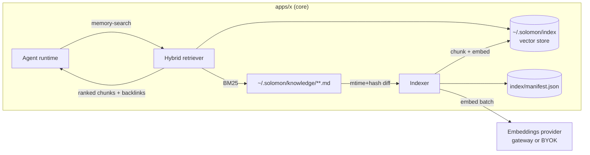

# RFC 021: Semantic Retrieval & Memory Index

|                       |                                                                                                                                                                                                                                                                   |
| --------------------- | ----------------------------------------------------------------------------------------------------------------------------------------------------------------------------------------------------------------------------------------------------------------- |
| **RFC**               | 021                                                                                                                                                                                                                                                               |
| **Status**            | Draft                                                                                                                                                                                                                                                             |
| **Track**             | Desktop · memory & retrieval (foundations for the finance command center)                                                                                                                                                                                         |
| **Owners**            | `apps/x` (Electron: core + renderer) · `apps/rowboat-api` (embeddings proxy, optional)                                                                                                                                                                            |
| **Created**           | 2026-06-10                                                                                                                                                                                                                                                        |
| **Last updated**      | 2026-06-10                                                                                                                                                                                                                                                        |
| **Depends on**        | none (new track); reuses [RFC 010 — API Service Plane](./010-rowboat-api-service-plane.md) for the metered embeddings path                                                                                                                                        |
| **Enables / related** | [RFC 022 — Unified Entity Graph](./022-unified-entity-graph.md) (entities become semantically recallable), [RFC 026 — Finance Command Center](./026-finance-command-center.md); cost surfaced via [RFC 014](./014-live-note-observability-cost-and-provenance.md) |
| **Supersedes**        | none                                                                                                                                                                                                                                                              |

## Summary

Solomon's agents recall context by scanning files lexically (`file-grep`, `file-glob`, `file-list`) and re-reading whole notes on every run. This works for a small vault but degrades badly as the knowledge base grows: exact-string search misses paraphrase ("late invoice" ≠ "overdue AR"), there is no ranking, and large notes blow the context budget. This RFC adds a **local, incremental semantic index** over `~/.solomon/knowledge/**` plus a `memory-search` builtin tool that does **hybrid retrieval** (lexical BM25 + vector similarity). The index re-embeds only changed content (reusing the existing `graph_state` change-detection), stores vectors in a single embeddable file (no server), and routes embedding calls through the same provider abstraction the app already uses for chat. This is the retrieval foundation the finance command center ([RFC 026](./026-finance-command-center.md)) needs to answer "what did we agree with Acme about the overdue invoice?" across hundreds of notes, threads, and transcripts.

## Current state (grounded)

| Fact                                                                               | Evidence                                                                                              |
| ---------------------------------------------------------------------------------- | ----------------------------------------------------------------------------------------------------- |
| Recall is lexical only: `file-list`, `file-glob`, `file-grep` builtin tools        | `apps/x/packages/core/src/application/lib/builtin-tools.ts:173,373,388`                               |
| Agents are told to find tasks/notes by globbing + reading candidates               | `builtin-tools.ts:1503` ("Look up existing tasks with `file-glob` … and `file-readText`")             |
| Vault change-detection already exists (mtime + content hash per file)              | `apps/x/packages/core/src/knowledge/graph_state.ts:13-20` (`FileState{mtime,hash}`, `processedFiles`) |
| Knowledge is plain markdown + YAML frontmatter under the WorkDir                   | `apps/x/packages/core/src/knowledge/` (vault root from `config/config.ts` `WorkDir`)                  |
| The app already has a provider/gateway abstraction for model calls                 | `apps/x/packages/core/src/models/gateway.ts`, `models/models.ts`                                      |
| No vector store, embeddings, ranking, or semantic tool exists anywhere in `apps/x` | (absence) — `grep -ri "embedding\|vector\|cosine" apps/x/packages/core/src` returns nothing relevant  |

**Problem.** As a finance operator accumulates invoice mirrors, meeting transcripts, entity notes, and AR/AP threads, lexical search cannot find the right context, and re-reading whole files per run is both slow and expensive. There is no "recall the 8 most relevant chunks" primitive — the thing every retrieval-augmented agent needs.

## Goals

- A **local semantic index** over the markdown vault with **incremental** updates (only changed files re-embed).
- A `memory-search` builtin tool returning ranked, **chunk-level** results with file backlinks the agent can open.
- **Hybrid** retrieval: combine vector similarity with lexical BM25 so exact identifiers (invoice numbers, emails) and paraphrase both rank well.
- **Zero new infrastructure**: single embeddable store file under `~/.solomon/index/`; no daemon, no external DB.
- **Provider-agnostic** embeddings: metered cloud path for managed users, BYOK direct path for local keys.
- **Graceful degradation**: if embeddings are unavailable, fall back to lexical `file-grep` so the agent never hard-fails.

### Measurable acceptance signals

- On a 5,000-note vault, `memory-search` returns top-k in **< 150 ms p95** (warm index).
- A changed note re-embeds in **< 1 s** and only its changed chunks are re-encoded (verified by chunk-hash counters).
- Recall@5 for paraphrase queries beats `file-grep` on a labelled eval set of ≥ 50 finance queries.

## Non-Goals

- A cloud-hosted/team-shared vector index — the shared **entity** spine is [RFC 022](./022-unified-entity-graph.md); this RFC is the **local** content index.
- Re-architecting the knowledge graph builder ([RFC 008](./008-conduit-eigen-faculties.md) / `build_graph.ts`); the index is read-only over whatever files exist.
- Embedding non-vault data (raw Gmail API responses, audio). Only persisted markdown under the WorkDir is indexed.
- Cross-encoder reranking models (listed in [Deferred](#deferred-needs-eval-data-not-blocking)).

## Design

### Conceptual shape



The indexer is a background pass (piggybacks on the existing 15 s knowledge sync tick) that diffs the vault, chunks changed files, embeds new/changed chunks, and upserts vectors. The retriever fuses vector hits with a lexical BM25 pass and returns chunks with their source path + heading anchor so the agent can `file-readText` the full note when needed.

### Chunking

- **Markdown-aware**: split on heading boundaries (`#`/`##`/`###`); never split mid-sentence; soft cap ~512 tokens with ~64-token overlap.
- **Frontmatter-aware**: index entity frontmatter (name, `resourceRefs` from [RFC 022](./022-unified-entity-graph.md), tags) as a separate "entity card" chunk so a Company/Invoice note is findable by its properties, not just prose.
- Each chunk carries metadata: `{path, headingAnchor, frontmatterId?, contentHash, startLine, endLine}`.

### Hybrid retrieval

1. Vector search top-N (N≈40) by cosine over the embedding store.
2. Lexical BM25 top-N over the same chunk corpus (reuse the existing file walk; a lightweight in-memory BM25 over chunk text is sufficient at vault scale).
3. **Reciprocal-rank fusion** of the two lists → top-k (default k=8).
4. Return chunks with backlinks; the agent decides whether to open full notes.

### `memory-search` tool

A new entry in the builtin toolset (`builtin-tools.ts`) mirroring the shape of `file-grep`:

```ts
'memory-search': {
  description: 'Semantic + lexical recall over the knowledge vault. Returns the most '
    + 'relevant chunks with file backlinks. Prefer this over file-grep when the query is '
    + 'conceptual ("overdue AR for Acme") rather than an exact string.',
  inputSchema: z.object({
    query: z.string().min(1),
    k: z.number().int().min(1).max(25).default(8),
    pathPrefix: z.string().optional(),   // scope to e.g. "Invoices/" or "People/"
  }),
  execute: async ({ query, k, pathPrefix }) => retriever.search(query, { k, pathPrefix }),
}
```

A companion skill (`packages/core/src/application/assistant/skills/memory-search/`) teaches agents when to use semantic vs lexical recall.

## Data model

- **Vector store**: a single file `~/.solomon/index/vectors.db`. **Recommended: `sqlite-vec`** (SQLite extension; one file, transactional, embeddable in the Electron main/core process; no native server). `lancedb` is the documented alternative ([Alternatives](#alternatives-considered)).
- **Manifest** `~/.solomon/index/manifest.json`:

```jsonc
{
  "version": 1,
  "model": "text-embedding-3-small", // provider+model identity; mismatch ⇒ rebuild
  "dims": 1536,
  "files": {
    "Invoices/INV-456.md": {
      "mtime": "…",
      "hash": "sha256:…",
      "chunks": [{ "anchor": "h2-status", "chunkHash": "…", "vectorId": 8123 }],
    },
  },
}
```

The manifest is the source of truth for "what is indexed at which content hash"; the vector store holds the vectors keyed by `vectorId`. On startup, if `manifest.model`/`dims` differ from the configured provider, the index is rebuilt (embeddings from different models are not comparable).

## API surface

Embeddings are obtained through the existing provider seam, not a new desktop dependency:

| Mode              | Path                                                | Notes                                                                                                                |
| ----------------- | --------------------------------------------------- | -------------------------------------------------------------------------------------------------------------------- |
| Managed / metered | `POST {API_URL}/v1/embeddings` (thin proxy, billed) | Add to [RFC 010](./010-rowboat-api-service-plane.md) service plane next to the LLM gateway; meters tokens like chat. |
| BYOK              | direct provider call via `models/gateway.ts`        | Uses the user's configured key; no backend round-trip.                                                               |

The desktop chooses the path the same way `gateway.ts` already does for chat completions. `POST /v1/embeddings` request `{ model, input: string[] }` → `{ data: [{ embedding: number[] }], usage }` (OpenAI-compatible).

## Configuration

| Key (`~/.solomon/config/index.json` or env) | Default                                                     | Meaning                                                             |
| ------------------------------------------- | ----------------------------------------------------------- | ------------------------------------------------------------------- |
| `provider` / `model`                        | inherits chat provider; `text-embedding-3-small` for OpenAI | Embedding model identity.                                           |
| `dims`                                      | model default                                               | Vector dimensionality.                                              |
| `batchSize`                                 | 64                                                          | Chunks per embed request.                                           |
| `maxMonthlyEmbedTokens`                     | unset (no cap)                                              | Cost guard; when hit, indexing pauses and logs (see Observability). |
| `enabled`                                   | `true`                                                      | Kill switch → retrieval falls back to lexical only.                 |

## Observability

| Series                            | Type      | Labels                          | Notes                                                                       |
| --------------------------------- | --------- | ------------------------------- | --------------------------------------------------------------------------- |
| `memory_index_chunks_total`       | gauge     | —                               | Indexed chunk count.                                                        |
| `memory_index_reembed_total`      | counter   | `reason{new,changed}`           | Re-embed work; never label by file/user.                                    |
| `memory_index_embed_tokens_total` | counter   | —                               | Feeds [RFC 014](./014-live-note-observability-cost-and-provenance.md) cost. |
| `memory_search_latency_ms`        | histogram | `mode{hybrid,lexical_fallback}` | Retrieval latency.                                                          |

PostHog desktop event `memory_index_built {chunks, durationMs}` per `apps/x/ANALYTICS.md` conventions (no PII; never label by note path).

## Migration & code changes

- New package `apps/x/packages/core/src/memory/` (indexer, store adapter, retriever, chunker).
- New builtin tool `memory-search` registered in `builtin-tools.ts`; new skill folder.
- Indexer hooked into the existing knowledge sync tick (alongside `build_graph.ts`), reusing `graph_state.ts` diffing rather than a second walker.
- Optional backend: `POST /v1/embeddings` in `apps/rowboat-api` (RFC 010 plane).
- New native dep: `sqlite-vec` (or `lancedb`) added to `apps/main` and bundled by esbuild like other core deps.

## Code-level implementation playbook

### WP1 — Indexer + store

1. `memory/store.ts`: thin adapter over `sqlite-vec` (`upsert(vectorId, vec, meta)`, `query(vec, n, filter)`); the DB file lives at `WorkDir/index/vectors.db`.
2. `memory/chunker.ts`: markdown+frontmatter chunker producing `{text, meta}`; unit-tested against fixture notes.
3. `memory/indexer.ts`: diff vault via `graph_state` semantics → chunk changed files → embed (batched) → upsert + manifest write. Idempotent; safe to run on every tick.

### WP2 — Embeddings provider

4. `memory/embed.ts`: `embed(texts: string[]): Promise<number[][]>` choosing metered `/v1/embeddings` vs BYOK via the same logic as `gateway.ts`. Respect `maxMonthlyEmbedTokens`.

### WP3 — Retriever + tool

5. `memory/retriever.ts`: hybrid search (vector top-N + in-memory BM25 + RRF fusion); return chunks with backlinks.
6. Register `memory-search` in `builtin-tools.ts`; add the skill; on any retriever error, log and fall back to a `file-grep` over `query` terms.

## Security

- The index never leaves the device (local file); embeddings of note text are sent to the configured provider exactly as chat content already is — no new exfiltration surface beyond the user's existing model provider.
- The vector store inherits the WorkDir's filesystem permissions; no secrets are embedded (frontmatter secrets, if any, are out of scope — entity frontmatter is identifiers, not credentials).
- Cost guard (`maxMonthlyEmbedTokens`) prevents a runaway re-index from generating unbounded provider spend.

## Failure modes & edge cases

| Case                                                | Behavior                                         | Recovery                                                                   |
| --------------------------------------------------- | ------------------------------------------------ | -------------------------------------------------------------------------- |
| Embeddings provider down / 429                      | Indexing pauses; retrieval uses lexical fallback | Resume on next tick; surface a non-blocking toast after repeated failures. |
| Manifest/model mismatch (user switched embed model) | Detected at startup                              | Full rebuild (background); search degrades to lexical until done.          |
| Store corruption                                    | `query` throws                                   | Quarantine `vectors.db`, rebuild from manifest+vault.                      |
| Huge note (e.g., 200-page PDF mirror)               | Chunker caps chunk size; many chunks             | Bounded by `batchSize`; no single oversized embed call.                    |
| Vault on slow/network FS                            | Diff + read slow                                 | Index work is off the UI thread; bounded by the sync tick.                 |

## Test plan

- **Unit**: chunker boundaries (headings, frontmatter, overlap); RRF fusion ranking; manifest mismatch → rebuild trigger.
- **Integration**: edit one note → exactly its changed chunks re-embed (assert `reembed_total{changed}` delta); provider-down → lexical fallback returns results.
- **Eval**: labelled set of ≥ 50 finance queries; assert Recall@5(hybrid) > Recall@5(file-grep) and p95 latency < 150 ms on a 5k-note fixture.

## Acceptance criteria

- `memory-search` is a registered builtin tool used by the Copilot and background runtimes.
- Incremental re-embed verified (changed-only) and full-rebuild-on-model-change verified.
- Lexical fallback proven when embeddings are disabled/unavailable.
- Cost metering wired into [RFC 014](./014-live-note-observability-cost-and-provenance.md).

## Alternatives considered

- **`lancedb`** instead of `sqlite-vec` — columnar, great for large corpora, but heavier native footprint; `sqlite-vec` wins on "single file, no server, easy bundle" at desktop scale. Revisit if a single vault exceeds ~1M chunks.
- **Server-side index** (embed + store in `rowboat-api`) — rejected for v1: breaks local-first/offline, adds latency and privacy surface. The **shared entity spine** ([RFC 022](./022-unified-entity-graph.md)) is the deliberate server-side counterpart.
- **Embed-everything-eagerly on write** — rejected; piggybacking the existing diff tick is simpler and avoids write-path latency.

## Decisions

Resolved forks (to be consolidated in [`README.md`](./README.md)):

- **Store → `sqlite-vec`, single file under `WorkDir/index/`.** No daemon; transactional; trivial to bundle.
- **Retrieval → hybrid (vector + BM25 + RRF), not pure vector.** Finance recall needs exact identifiers _and_ paraphrase.
- **Embeddings → same provider seam as chat (metered or BYOK).** No new model-key surface.
- **Incremental via `graph_state` diffing, on the existing sync tick.** One walker, not two.

### Deferred (needs eval data; not blocking)

- Cross-encoder reranking of the fused top-k (quality vs latency tradeoff).
- Per-entity "summary embeddings" maintained by the [RFC 022](./022-unified-entity-graph.md) resolver for entity-level recall.
- Optional encrypted index at rest if a future deployment stores the vault on shared disk.
