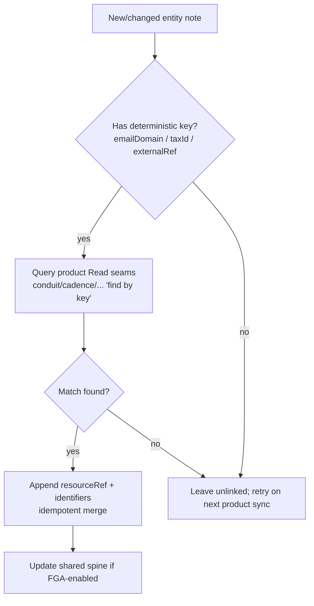
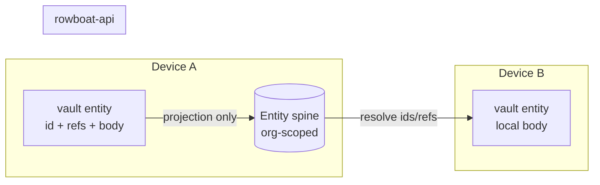

# RFC 022: Unified Entity Graph — Stable IDs, Cross-Product Reconciliation & Shared Memory

|                       |                                                                                                                                                                                                                                                                                                                                                                                                     |
| --------------------- | --------------------------------------------------------------------------------------------------------------------------------------------------------------------------------------------------------------------------------------------------------------------------------------------------------------------------------------------------------------------------------------------------- |
| **RFC**               | 022                                                                                                                                                                                                                                                                                                                                                                                                 |
| **Status**            | Draft                                                                                                                                                                                                                                                                                                                                                                                               |
| **Track**             | Memory & identity · the "one graph, many surfaces" spine                                                                                                                                                                                                                                                                                                                                            |
| **Owners**            | `apps/x` (knowledge graph) · `apps/rowboat-api` (shared entity spine, FGA)                                                                                                                                                                                                                                                                                                                          |
| **Created**           | 2026-06-10                                                                                                                                                                                                                                                                                                                                                                                          |
| **Last updated**      | 2026-06-10                                                                                                                                                                                                                                                                                                                                                                                          |
| **Depends on**        | [RFC 011 — Identity & Authorization](./complete-011-identity-and-authorization-plane.md), [RFC 015 — WorkOS FGA](./015-rowboat-platform-workos-fga-and-widget-auth.md) (org scoping)                                                                                                                                                                                                                |
| **Enables / related** | [RFC 008 — Conduit & Eigen Faculties](./008-conduit-eigen-faculties.md) & [RFC 013 — Product Connector Fabric](./013-oppulence-product-connector-fabric.md) (the Mirror seam writes `resourceRefs`); [RFC 021 — Semantic Index](./complete-021-semantic-memory-index.md); [RFC 023 — Closed-Loop Actions](./023-closed-loop-actions.md); [RFC 026 — Finance Command Center](./026-finance-command-center.md) |
| **Supersedes**        | none                                                                                                                                                                                                                                                                                                                                                                                                |

## Summary

Solomon's knowledge entities (`People/Alice.md`, `Companies/Acme.md`, `Invoices/INV-456.md`) are identified **only by file path**. They have no stable identity and no link to the same real-world thing as it exists in Conduitt (an AR customer / invoice), Cadence (an AP vendor), Canvas (a billing customer), or Eigen (a modeled entity). And the graph is strictly **personal** — one user's `~/.solomon/` — so a finance team cannot share business memory. This RFC gives every entity a **stable ULID** plus a set of **`resourceRefs`** that reconcile it to external product records, and defines an **optional org-scoped shared spine** (IDs + refs + short summaries, never raw PII) synced to `rowboat-api` and gated by WorkOS FGA. This is the literal mechanism behind "one memory graph, many surfaces": the agent can say _"Acme is 22 days late (Conduitt), we owe their sister entity on PO-88 (Cadence), and they're 14% of Q3 exposure (Eigen)"_ because all four point at the same entity id.

## Current state (grounded)

| Fact                                                                                          | Evidence                                                                                                                                                                                                                           |
| --------------------------------------------------------------------------------------------- | ---------------------------------------------------------------------------------------------------------------------------------------------------------------------------------------------------------------------------------- |
| Entities are identified by file path; no stable id field                                      | `apps/x/packages/core/src/knowledge/build_graph.ts` (writes `knowledge/<Type>/<Name>.md`); no id minting                                                                                                                           |
| Change tracking keys on file path → `{mtime,hash}`                                            | `apps/x/packages/core/src/knowledge/graph_state.ts:13-20` (`processedFiles: Record<path, FileState>`)                                                                                                                              |
| Backend `User` is the only identity anchor; org id is optional                                | `apps/rowboat-api/ent/schema/user.go:43-45` (`workos_user_id` unique; `workos_org_id` optional)                                                                                                                                    |
| `CloudEvent.source` enum does **not** yet include product sources                             | `apps/rowboat-api/ent/schema/cloud_event.go:37` (`gmail, google_calendar, slack, webhook, internal`) — products must be added (see [RFC 008](./008-conduit-eigen-faculties.md)/[013](./013-oppulence-product-connector-fabric.md)) |
| The Mirror seam (`sync_*.ts`) is the established way to bring external records into the vault | `apps/x/packages/core/src/knowledge/sync_gmail.ts` (pattern); RFC 008/013 propose `sync_conduit.ts` etc.                                                                                                                           |
| Products federate; none copies another's DB                                                   | [RFC 013](./013-oppulence-product-connector-fabric.md) (Read/Mirror/Watch/Act seams)                                                                                                                                               |

**Problem.** Without stable ids and cross-product refs, the vertical products cannot be unified into one context. And without a shared spine, the memory dies with one laptop and one user — useless for a finance team.

## Goals

- A **stable id** (ULID) on every entity note, preserved across renames/moves.
- A **`resourceRefs`** grammar that links an entity to its records in Conduitt / Cadence / Canvas / Eigen / Corinthian.
- A **reconciliation resolver** that matches entities across products by deterministic keys (email domain, tax id, external ref) and records refs idempotently.
- An **optional org-scoped shared spine** in `rowboat-api` so a team shares the same entity identities and cross-links — synced with a strict **privacy boundary** (only ids/refs/short summaries leave the device).
- **Backfill** existing notes with ids without breaking links.

### Measurable acceptance signals

- 100% of newly created entity notes carry an `id` and survive a rename (id stable; backlinks intact).
- A desktop `Company` reconciles to a Conduitt customer and a Cadence vendor via a single resolver pass; the agent can enumerate all three from one entity.
- With FGA enabled, two users in the same org see the same entity ids and cross-links; users in different orgs do not.

## Non-Goals

- Building the product connectors themselves — those are [RFC 008](./008-conduit-eigen-faculties.md) / [RFC 013](./013-oppulence-product-connector-fabric.md). This RFC owns the **identity + reconciliation + sharing** spine they write into.
- Replacing the markdown vault with a database. The vault stays canonical on-device; the shared spine is an **index of identities**, not a content store.
- Acting on business objects — that is [RFC 023](./023-closed-loop-actions.md).
- Full bidirectional sync of entity bodies to the cloud (privacy boundary forbids it).

## Design

### Entity identity

Every entity note gains frontmatter:

```yaml
---
id: 01J9Z8Q5K3R7V2C4M6N8P0T1S3 # ULID, minted once, never reused
kind: company # company | person | project | invoice | vendor | …
resourceRefs: # stable external pointers (see grammar below)
  - conduit:customer:cus_8fA2
  - cadence:vendor:ven_5512
  - canvas:customer:cus_8fA2
  - eigen:entity:ent_acme
identifiers: # deterministic match keys (for reconciliation)
  emailDomains: [acme.com]
  taxId: "US-94-XXXXXXX"
---
```

- **`id`** is minted by `build_graph.ts` when an entity note is first created and copied forward on any rename/merge (renames update the path, never the id).
- **`resourceRefs`** are written by the Mirror seam (`sync_conduit.ts`, `sync_cadence.ts`, …) and by the resolver.
- **`identifiers`** are the deterministic keys the resolver matches on.

### `resourceRef` grammar

```
<product>:<type>:<externalId>
product  ∈ conduit | cadence | canvas | corinthian | eigen
type     ∈ customer | invoice | vendor | bill | entity | dispute | …   (product-defined)
externalId = the product's own stable id (opaque to Rowboat)
```

This mirrors the `resourceId` concept already named in [RFC 008](./008-conduit-eigen-faculties.md)/[013](./013-oppulence-product-connector-fabric.md) (e.g. `knowledge/Invoices/INV-456.md` → `resourceId: conduit:invoice:inv_456`) and generalises it to a **set** so one entity spans products.

### Reconciliation resolver



- Deterministic-first (never fuzzy-merge two entities automatically); ambiguous matches surface as a **suggested link** the user confirms (reuse the approval-card pattern from [RFC 023](./023-closed-loop-actions.md)).
- Idempotent: re-running the resolver never duplicates a `resourceRef`.

### Shared/team spine (optional, FGA-gated)

When a user belongs to an org (`workos_org_id` present), the desktop syncs a **minimal projection** of each entity to `rowboat-api`:



- **Projection = `{id, kind, displayName, resourceRefs, identifiers, oneLineSummary}`** only. The note **body, frontmatter secrets, and raw mirrored content never leave the device.**
- FGA ([RFC 015](./015-rowboat-platform-workos-fga-and-widget-auth.md)) scopes the spine to the org; cross-org reads are denied at the resolver.
- Conflict policy: ids are globally unique (ULID), so two devices minting "Acme" independently reconcile by `identifiers` → the spine merges them into one canonical id and both devices adopt it.

## Data model

### Vault (on-device)

Frontmatter as above. The `id`/`resourceRefs`/`identifiers` block is **read-write protected** the way the `live:` block already is — agents edit the body, the resolver edits the identity block.

### Backend `Entity` (ent, org-scoped spine)

```go
// apps/rowboat-api/ent/schema/entity.go (new)
field.String("entity_id").Unique().NotEmpty()      // the ULID
field.String("org_id").NotEmpty()                  // FGA scope (workos_org_id)
field.String("kind").NotEmpty()
field.String("display_name")
field.JSON("resource_refs", []string{})            // ["conduit:customer:…", …]
field.JSON("identifiers", map[string]any{})        // deterministic keys
field.String("one_line_summary").Optional()        // bounded, no PII dumps
// edges: belongs to org; many runs/events reference it (audit)
```

Indexes on `(org_id, entity_id)` and on each `resource_ref` for reverse lookup ("which entity is `conduit:customer:cus_8fA2`?").

## API surface

| Method | Path                                         | Auth                   | Purpose                                                         |
| ------ | -------------------------------------------- | ---------------------- | --------------------------------------------------------------- |
| `PUT`  | `/v1/entities/{id}`                          | bearer + FGA org write | Upsert the projection from a device.                            |
| `GET`  | `/v1/entities?ref=conduit:customer:cus_8fA2` | bearer + FGA org read  | Reverse-resolve a product record → entity id.                   |
| `GET`  | `/v1/entities/{id}`                          | bearer + FGA org read  | Resolve refs/summary for cross-device linking.                  |
| `POST` | `/v1/entities/merge`                         | bearer + FGA org write | Merge two ids discovered to be the same (resolver, idempotent). |

## Configuration

| Key                       | Default                                           | Meaning                                                     |
| ------------------------- | ------------------------------------------------- | ----------------------------------------------------------- |
| `entity.sharedSpine`      | `false` (off until org present)                   | Enable team spine sync.                                     |
| `entity.projectionFields` | id, kind, displayName, refs, identifiers, summary | The allowlist that may leave the device (privacy boundary). |
| `entity.resolveOnSync`    | `true`                                            | Run the resolver after each product Mirror sync.            |

## Observability

| Series                    | Type    | Labels                              | Notes                                           |
| ------------------------- | ------- | ----------------------------------- | ----------------------------------------------- |
| `entity_resolve_total`    | counter | `result{linked,unlinked,ambiguous}` | Reconciliation outcomes; never label by entity. |
| `entity_spine_sync_total` | counter | `direction{up,down}`                | Projection sync volume.                         |
| `entity_merge_total`      | counter | —                                   | Cross-device id merges.                         |

## Migration & code changes

- `build_graph.ts`: mint `id` on entity creation; preserve on rename/merge.
- New `packages/core/src/knowledge/entity-resolver.ts`: deterministic reconciliation; writes `resourceRefs`/`identifiers`.
- `sync_*.ts` Mirror seams (RFC 008/013) call the resolver after writing mirror notes.
- New ent schema `entity.go` + handlers in `apps/rowboat-api/internal/entities/`; FGA checks via the RFC 015 layer.
- **Backfill**: a one-time pass over existing notes minting ids (path-stable, link-preserving), gated behind a migration marker file (like the existing `today-note-deprecation.json` pattern).

## Code-level implementation playbook

### WP1 — Stable IDs + backfill (desktop, ship first; no backend)

1. Add `id` minting + preservation in `build_graph.ts`; protect the identity block in the frontmatter parser.
2. One-time backfill pass with a `config/entity-ids-backfilled.json` marker.

### WP2 — Reconciliation resolver

3. `entity-resolver.ts`: deterministic match against product Read seams; idempotent `resourceRefs` merge; ambiguous → suggested-link card.
4. Hook resolver into the Mirror `sync_*` flows.

### WP3 — Shared spine (backend, FGA-gated)

5. `ent/schema/entity.go` + `internal/entities` handlers; FGA org scoping (RFC 015).
6. Desktop projection sync (`PUT /v1/entities/{id}`) — **projection allowlist enforced client-side and server-side**.
7. Cross-device resolve + merge.

## Security

- **Privacy boundary is the core control**: only the projection allowlist (`id, kind, displayName, refs, identifiers, summary`) may sync up. Bodies, mirrored financial content, and secrets stay local. Enforced on **both** ends.
- **FGA org scoping** ([RFC 015](./015-rowboat-platform-workos-fga-and-widget-auth.md)): every spine read/write checks org membership; cross-org access denied. Resolver never links across orgs.
- **No automatic identity merges** across deterministic-key collisions that imply different orgs; such cases require user confirmation.
- `identifiers` (tax ids, email domains) are sensitive — stored in the org-scoped spine only, never in shared logs/metrics.

## Failure modes & edge cases

| Case                                                   | Behavior                                             | Recovery                                                 |
| ------------------------------------------------------ | ---------------------------------------------------- | -------------------------------------------------------- |
| Two devices mint "Acme" independently                  | Both upsert; spine merges by `identifiers`           | `POST /v1/entities/merge`; devices adopt canonical id.   |
| Product returns a new external id for a known customer | Resolver appends a second `resourceRef`              | Refs are a set; no overwrite.                            |
| Ambiguous match (two customers, same domain)           | Marked `ambiguous`; suggested-link card              | User confirms; resolver records the chosen ref.          |
| Org membership revoked                                 | Spine reads denied                                   | Local vault unaffected (local-first); re-link on rejoin. |
| Offline                                                | Resolver/spine sync deferred; ids still mint locally | Reconciles on reconnect.                                 |

## Test plan

- **Unit**: id minting + rename preservation; `resourceRef` grammar parse/merge idempotency; projection allowlist (assert body never serialized).
- **Integration**: seed a Conduitt customer + Cadence vendor (sandbox Read seams) → resolver links one entity to both; reverse `GET /v1/entities?ref=…` returns it.
- **FGA**: two users same org see shared ids; different org denied (RFC 015 harness).
- **Merge**: independent "Acme" on two devices → merge → single canonical id on both.

## Acceptance criteria

- Entity notes carry stable ids surviving rename; backfill complete behind a marker.
- Resolver links a desktop entity to ≥ 2 product records deterministically and idempotently.
- Shared spine syncs only the projection (verified) and is FGA-org-scoped.
- The Copilot can answer a cross-product question about one entity citing refs from ≥ 2 products.

## Alternatives considered

- **Fuzzy/embedding entity matching as the primary resolver** — rejected as primary: silent wrong-merges in finance are unacceptable. Deterministic-first; embeddings ([RFC 021](./complete-021-semantic-memory-index.md)) only **suggest** candidates for human confirmation.
- **Full entity bodies in the shared spine** — rejected: violates the privacy boundary and bloats the backend. Projection-only.
- **Backend as the canonical entity store** — rejected: breaks local-first. Vault stays canonical; spine is an identity index.

## Decisions

Resolved forks (consolidated in [`README.md`](./README.md)):

- **Identity → per-entity ULID in frontmatter, minted by `build_graph.ts`, rename-stable.**
- **Cross-product links → a `resourceRefs` set using `product:type:id`, written by the Mirror seam + resolver.**
- **Reconciliation → deterministic-first; ambiguous/fuzzy requires user confirmation.**
- **Sharing → projection-only, org-scoped, FGA-gated; bodies never leave the device.**

### Deferred (needs product schemas; not blocking)

- A canonical `kind` taxonomy negotiated with each product team (current list is `TBD (confirm with Conduitt/Cadence/Eigen)`).
- Relationship edges in the shared spine (entity↔entity: "subsidiary of", "AP counterparty of") — start with nodes + refs; add edges once value is proven.
- Time-travel / provenance on the spine (who linked what, when) — fold into [RFC 014](./014-live-note-observability-cost-and-provenance.md) provenance.
