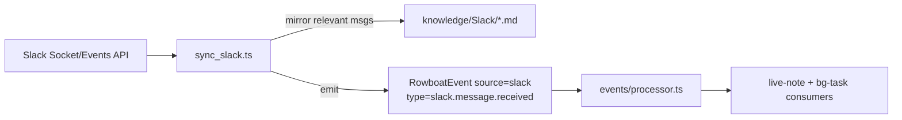

# RFC 024: Finishing the Cold Primitives — Slack Events, Code Mode, Agent-Schedule UI, Version History

|                       |                                                                                                                                                  |
| --------------------- | ------------------------------------------------------------------------------------------------------------------------------------------------ |
| **RFC**               | 024                                                                                                                                              |
| **Status**            | Draft                                                                                                                                            |
| **Track**             | Desktop · productionizing half-built primitives                                                                                                  |
| **Owners**            | `apps/x` (core + renderer)                                                                                                                       |
| **Created**           | 2026-06-10                                                                                                                                       |
| **Last updated**      | 2026-06-10                                                                                                                                       |
| **Depends on**        | [RFC 003 — Cloud Event Ingestion](./complete-003-cloud-event-ingestion.md) (Slack event shape), local event queue                                         |
| **Enables / related** | [RFC 025 — Desktop Runtime Durability](./025-desktop-runtime-durability.md), [RFC 026 — Finance Command Center](./026-finance-command-center.md) |
| **Supersedes**        | none                                                                                                                                             |

## Summary

Four capabilities are **wired but cold** — their plumbing exists but they don't produce value in the product. This RFC turns each on as an independent, shippable work package: (1) a **Slack event producer** so live-notes/bg-tasks can trigger on Slack messages (OAuth + repo exist, no producer); (2) **Code Mode GA** — define and harden the ACP code-execution path for real finance use cases (run a reconciliation/model script in a gated sandbox); (3) an **Agent-Schedule management UI** for the existing scheduler with no surface; and (4) **note Version History** — restore-able timeline using the existing version store that isn't shown anywhere. None of these is new architecture; each is "connect the last wire" on something already built. They're grouped because individually they're too small for their own RFC but collectively they remove papercuts that block the daily-driver experience.

## Current state (grounded)

| Fact                                                                            | Evidence                                                                                            |
| ------------------------------------------------------------------------------- | --------------------------------------------------------------------------------------------------- |
| Slack OAuth + a config repo exist                                               | `apps/x/packages/core/src/slack/repo.ts`; `apps/x/packages/core/src/auth/slack-backend-oauth.ts`    |
| …but no Slack **event producer** writes `RowboatEvent`s (unlike Gmail/Calendar) | `apps/x/packages/core/src/knowledge/sync_gmail.ts` exists; no `sync_slack.ts`                       |
| Code Mode (ACP) infra exists with a permission registry                         | `apps/x/packages/core/src/code-mode/acp/` (`manager`, `permission-registry.ts`, `agents`, `client`) |
| Agent-schedule has runner/repo/state but no UI surface                          | `apps/x/packages/core/src/agent-schedule/runner.ts`, `repo.ts`, `state-repo.ts`                     |
| Version history store exists but is not surfaced in the editor                  | `apps/x/packages/core/src/knowledge/version_history.ts`                                             |
| The events pipeline + consumers are the integration point for new producers     | `apps/x/packages/core/src/events/processor.ts`; live-note + bg-task event-consumers                 |
| `bg-tasks-view.tsx` is the proven template for a management surface             | `apps/x/apps/renderer/src/components/bg-tasks-view.tsx`                                             |

**Problem.** Each cold primitive is a promise the product doesn't keep: Slack is "connected" but inert; Code Mode exists but has no defined job; schedules run with no way to see/manage them; edits are irreversible despite a version store. For a finance operator these are trust and control gaps.

## Goals

- **WP1 — Slack event producer**: Slack messages/mentions become `RowboatEvent{source:"slack"}` so live-notes/bg-tasks trigger on them (e.g., "#ar-collections mentions Acme → update the Acme live-note").
- **WP2 — Code Mode GA**: a defined, gated use case (run a script — reconciliation, ad-hoc model — in a sandbox with explicit permissions), hardened and tested.
- **WP3 — Agent-Schedule UI**: list / enable / disable / run-now / view history for scheduled agents.
- **WP4 — Version History**: a note version timeline with diff + one-click restore in the editor.

### Measurable acceptance signals

- A Slack mention triggers a live-note update end-to-end (event in `events/done/` with consumer results).
- A Code Mode reconciliation script runs in a sandbox, blocked from disallowed paths/commands, with output captured.
- The schedule UI shows every scheduled agent with next-run + last-result; disable stops firing.
- Restoring a prior note version reverts the body and preserves the protected `live:`/identity frontmatter.

## Non-Goals

- Re-architecting the event pipeline or scheduler (durability is [RFC 025](./025-desktop-runtime-durability.md)).
- Slack **actions** (posting/replying as the user) — read/trigger only here; outbound messaging is an Act-seam concern ([RFC 023](./023-closed-loop-actions.md)/[013](./013-oppulence-product-connector-fabric.md)).
- A general code IDE — Code Mode is scoped, gated script execution, not a dev environment.

## Design

### WP1 — Slack event producer

Mirror the Gmail Mirror+producer pattern:

- New `packages/core/src/knowledge/sync_slack.ts` using `slack/repo.ts` creds; subscribe to messages/mentions in selected channels; dedupe by Slack `ts`.
- Emit `RowboatEvent{source:"slack", type:"slack.message.received", payload:<markdown gist>, target?}`; the existing processor routes it to consumers (no consumer changes needed — they already fan out by source/criteria).
- Optional Mirror to `knowledge/Slack/` for recall ([RFC 021](./complete-021-semantic-memory-index.md)).

### WP2 — Code Mode GA

- Define the **job**: "run this script against my data in a sandbox" — e.g., reconcile a CSV bank export against AP bills, build a quick runway model. The ACP `manager` + `permission-registry.ts` already gate tool/command access.
- Harden: explicit allowlisted working dir, command allowlist, no network unless granted; capture stdout/artifacts into a note; surface a clear permission prompt (reuse the existing approval UX).
- Ship one or two **recipes** (skills) so the feature has an obvious entry point rather than being latent infra.

### WP3 — Agent-Schedule UI

- New renderer view modeled on `bg-tasks-view.tsx`: table of scheduled agents from `agent-schedule/repo.ts` + state from `state-repo.ts`; columns: name, trigger (cron/window), next run, last result, enabled toggle, run-now.
- IPC: a `agent-schedule:list/setActive/runNow` channel set (mirror the `bg-task:*` channels).

### WP4 — Version History

- `version_history.ts` already stores versions; add an editor panel: timeline of versions (timestamp, source: user/agent), a diff view, and **restore** (writes the chosen body back while preserving protected frontmatter blocks — the same read-write protection live-notes use).

## Data model

- **Slack**: reuse `RowboatEvent` (`packages/shared/src/events.ts`) and the `events/pending|done` queue; mirror notes under `knowledge/Slack/`.
- **Code Mode**: runs/artifacts captured as notes (existing pattern); permissions in the ACP registry.
- **Schedules**: existing `agent-schedule` repo/state files — UI is read/update only.
- **Versions**: existing `version_history.ts` store; no schema change, add UI.

## API / IPC surface

| Channel                    | Req → Res                  | Purpose                                       |
| -------------------------- | -------------------------- | --------------------------------------------- |
| `agent-schedule:list`      | `null → {schedules[]}`     | Populate the UI.                              |
| `agent-schedule:setActive` | `{id, active} → {ok}`      | Enable/disable.                               |
| `agent-schedule:runNow`    | `{id} → {runId}`           | Manual trigger.                               |
| `note:listVersions`        | `{path} → {versions[]}`    | Version timeline.                             |
| `note:restoreVersion`      | `{path, versionId} → {ok}` | Restore body, preserve protected frontmatter. |

(Follow the `bg-task:*` result-object IPC convention — no throwing across IPC.)

## Configuration

| Key                        | Default                | Meaning                                   |
| -------------------------- | ---------------------- | ----------------------------------------- |
| `slack.channels`           | `[]`                   | Channels to watch (none → producer idle). |
| `codeMode.allowedCommands` | conservative allowlist | Gated command surface.                    |
| `codeMode.network`         | `deny`                 | Network access requires explicit grant.   |
| `versionHistory.retention` | last 50 / 90 days      | Version pruning.                          |

## Observability

| Series                       | Type    | Labels                    | Notes             |
| ---------------------------- | ------- | ------------------------- | ----------------- |
| `slack_events_emitted_total` | counter | `type`                    | Producer volume.  |
| `code_mode_runs_total`       | counter | `result{ok,denied,error}` | Sandbox usage.    |
| `note_restore_total`         | counter | —                         | Version restores. |

PostHog: `slack_trigger_fired`, `code_mode_run`, `note_version_restored` per `apps/x/ANALYTICS.md` (no PII).

## Migration & code changes

- New: `knowledge/sync_slack.ts`; renderer `agent-schedule-view.tsx`; editor version-history panel; Code Mode recipes/skills.
- IPC: add `agent-schedule:*` and `note:listVersions/restoreVersion` to `packages/shared/src/ipc.ts` + handlers in `apps/main/src/ipc.ts`.
- No backend changes; no schema changes.

## Code-level implementation playbook

Each WP is independently shippable; suggested order WP4 → WP3 → WP1 → WP2 (ascending risk).

1. **WP4** (lowest risk): wire `version_history.ts` to an editor panel + restore IPC; preserve protected frontmatter on restore.
2. **WP3**: `agent-schedule-view.tsx` cloned from `bg-tasks-view.tsx`; `agent-schedule:*` IPC over `repo.ts`/`state-repo.ts`.
3. **WP1**: `sync_slack.ts` producer using `slack/repo.ts`; emit `RowboatEvent`; verify consumers fire.
4. **WP2**: harden ACP gating; ship a reconciliation recipe; capture output to a note.

## Security

- **Slack**: read/trigger only; no outbound messaging (Act seam handles that with approval, [RFC 023](./023-closed-loop-actions.md)). Mirror only watched channels.
- **Code Mode**: deny-by-default commands + paths + network; explicit per-run grant (reuse approval UX); finance scripts run against local data with no implicit egress.
- **Version restore**: cannot rewrite protected frontmatter (`live:`/identity blocks) — only the body; prevents an agent from using "restore" to bypass live-note/identity protections.

## Failure modes & edge cases

| Case                                               | Behavior                                             | Recovery                                       |
| -------------------------------------------------- | ---------------------------------------------------- | ---------------------------------------------- |
| Slack socket drops                                 | Producer reconnects; dedupe by `ts` prevents replays | Resume on reconnect.                           |
| Code Mode script tries disallowed command/path     | Denied + logged                                      | Surface the denial; user can grant explicitly. |
| Schedule disabled mid-run                          | Current run finishes; no new runs                    | Re-enable to resume.                           |
| Restore to a version with a since-deleted backlink | Body restored; dangling link flagged                 | Standard broken-link handling.                 |

## Test plan

- **WP1**: mock Slack event → assert `RowboatEvent{source:slack}` emitted, processed, consumer result recorded; dedupe on repeat `ts`.
- **WP2**: script hitting a denied command/path is blocked; allowed reconciliation produces a captured artifact.
- **WP3**: list reflects repo/state; disable stops firing; run-now creates a run.
- **WP4**: restore reverts body, preserves `live:`/identity frontmatter; retention prunes.

## Acceptance criteria

- Each WP independently shippable and demoable: a Slack mention triggers a live-note; a reconciliation runs gated; schedules are manageable; a note version restores.
- No regressions to the existing event pipeline, scheduler, or editor.

## Alternatives considered

- **One RFC per primitive** — rejected: each is too small; grouping keeps the "finish what's started" intent legible and lets them ship piecemeal.
- **Slack as a legacy integration vendor/MCP connector instead of a native producer** — rejected for triggering: the live-note/bg-task event model needs a `RowboatEvent` producer; legacy integration vendor remains available for Slack **actions**.
- **General code sandbox (containers)** — deferred; the ACP gating is sufficient for the defined finance scripts at desktop scope.

## Decisions

Resolved forks (consolidated in [`README.md`](./README.md)):

- **Slack is read/trigger via a native `RowboatEvent` producer**, not an action surface (actions go through [RFC 023](./023-closed-loop-actions.md)).
- **Code Mode ships with concrete finance recipes**, not as latent infra; gated deny-by-default.
- **Schedule UI reuses the `bg-tasks-view` template + `bg-task:*` IPC convention.**
- **Version restore preserves protected frontmatter.**

### Deferred (not blocking)

- Slack actions (post/reply) via the Act seam.
- Code Mode container isolation for untrusted scripts.
- Cross-note "what changed this week" version digest.
