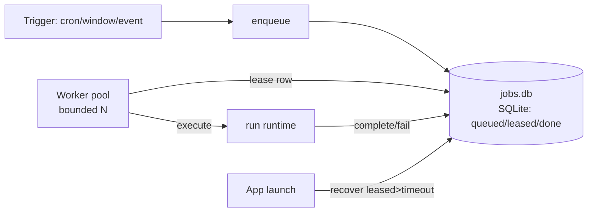

# RFC 025: Desktop Runtime Durability — Local Job Queue, Backpressure & Multi-Workspace

|                       |                                                                                                                                                                                                                                                                                   |
| --------------------- | --------------------------------------------------------------------------------------------------------------------------------------------------------------------------------------------------------------------------------------------------------------------------------- |
| **RFC**               | 025                                                                                                                                                                                                                                                                               |
| **Status**            | Draft                                                                                                                                                                                                                                                                             |
| **Track**             | Desktop · runtime reliability (foundation under everything else)                                                                                                                                                                                                                  |
| **Owners**            | `apps/x` (core: scheduler, events, runtime; main: lifecycle)                                                                                                                                                                                                                      |
| **Created**           | 2026-06-10                                                                                                                                                                                                                                                                        |
| **Last updated**      | 2026-06-10                                                                                                                                                                                                                                                                        |
| **Depends on**        | none new; mirrors the durability ideas of [RFC 002 — Durable Schedule State](./complete-002-durable-schedule-state.md) on-device                                                                                                                                                           |
| **Enables / related** | [RFC 001 — API-Owned Scheduler](./complete-001-api-owned-scheduler.md) (cloud counterpart), [RFC 003 — Cloud Event Ingestion](./complete-003-cloud-event-ingestion.md), [RFC 023](./023-closed-loop-actions.md), [RFC 024](./024-cold-primitives-ga.md), [RFC 026](./026-finance-command-center.md) |
| **Supersedes**        | none                                                                                                                                                                                                                                                                              |

## Summary

The desktop's automation engine — live-notes, background tasks, and event consumers — is fast but **fragile**: concurrency is guarded **in-memory**, so a crash or quit loses in-flight state and a second window can double-run a task; the file event queue (`events/pending/`) has **no backpressure**, so a sync storm fans out unboundedly and can hammer the LLM provider; and the app is bound to **one workspace** (`WorkDir`), so switching businesses/clients needs a restart. For a finance operator running autonomous AR/AP loops ([RFC 023](./023-closed-loop-actions.md)), this is unacceptable — a missed or double-fired dunning action erodes trust. This RFC adds a **durable local job queue** (SQLite, at-most-once, crash-safe), an **event backpressure + coalescing** policy (storms collapse to one pending run per object), and **multi-workspace** support (switch without restart). It is the on-device analogue of the cloud durability work in [RFC 001](./complete-001-api-owned-scheduler.md)/[002](./complete-002-durable-schedule-state.md).

## Current state (grounded)

| Fact                                                                                    | Evidence                                                                                                                                                                   |
| --------------------------------------------------------------------------------------- | -------------------------------------------------------------------------------------------------------------------------------------------------------------------------- |
| Live-note/bg-task concurrency is guarded **in memory** (lost on restart)                | `apps/x/packages/core/src/agents/runtime.ts` (in-process run guards); `apps/x/packages/core/src/background-tasks/scheduler.ts` (in-flight `lastAttemptAt>lastRunAt` check) |
| The event queue is plain files moved `pending/` → `done/`; no depth bound or coalescing | `apps/x/packages/core/src/events/processor.ts:23-29,44` (writes `done/`, unlinks `pending/`)                                                                               |
| Producers append files to `events/pending/`; processor fans out to all consumers        | `processor.ts` (Pass-1 fan-out per source/criteria)                                                                                                                        |
| One `WorkDir` per process; switching needs a restart                                    | `apps/x/packages/core/src/config/config.ts` (`WorkDir` resolved once)                                                                                                      |
| The cloud side already solved durability with leases                                    | [RFC 002](./complete-002-durable-schedule-state.md) (`BackgroundTaskScheduleState` + atomic lease)                                                                                  |

**Problem.** In-memory guards + an unbounded file queue + single-workspace binding mean: lost runs on crash, possible double-runs across windows, provider hammering during storms, and no clean way to operate multiple businesses. As autonomous actions ([RFC 023](./023-closed-loop-actions.md)) land, these become correctness/safety bugs, not just papercuts.

## Goals

- A **durable local job queue** (survives restart; at-most-once execution per object/trigger).
- **Backpressure**: bounded global concurrency + queue-depth caps + a **coalesce** policy keyed by `(consumer, target)` so a storm collapses to one pending run per object — **no silent loss** (overflow is logged/countered).
- **Multi-workspace**: multiple `~/.solomon/<workspace>/` roots; switch in-app (or per-window) without restart; runtimes are workspace-scoped.
- A clean **recovery** path: on launch, requeue interrupted runs deterministically.

### Measurable acceptance signals

- Kill the app mid-run; on restart the interrupted run is recovered exactly once (no loss, no duplicate).
- Inject 500 events targeting the same object in 1 s; exactly **one** run executes (coalesced); overflow counter reflects the collapse.
- Two windows on two workspaces run concurrently; no cross-talk; a task in workspace A never fires in workspace B.

## Non-Goals

- Moving desktop execution to the cloud (that's the [RFC 001](./complete-001-api-owned-scheduler.md)/[004](./complete-004-cloud-agent-runtime.md) `executionTarget:"api"` path; this RFC hardens the **local** path).
- A distributed queue across machines (single-device durability only; cross-device is the cloud plane).
- Changing trigger semantics (cron/window/event evaluation is unchanged — only execution durability/backpressure).

## Design

### Durable local queue



- A SQLite DB `~/.solomon/<workspace>/runtime/jobs.db` with a `jobs` table: `{id, kind, target, dedupe_key, state(queued|leased|done|failed), lease_owner, lease_expires_at, attempts, created_at}`.
- Enqueue is **idempotent on `dedupe_key`** = `(consumer, target, triggerWindow)`; a worker **leases** a `queued` row (atomic `UPDATE … WHERE state='queued'` — the on-device analogue of the [RFC 002](./complete-002-durable-schedule-state.md) lease), runs it, marks `done`.
- **Recovery**: on launch, rows `leased` past `lease_expires_at` are reset to `queued` (the prior process died); at-most-once is preserved because completion flips state under the lease.
- Replaces the in-memory guards in `runtime.ts`/`scheduler.ts`.

### Backpressure & coalescing

- **Global concurrency cap** (configurable; default tied to model rate limits): the worker pool size bounds concurrent LLM-bearing runs.
- **Queue-depth cap** per consumer; on overflow, **coalesce** by `dedupe_key`: a new event for an object that already has a `queued` job for the same window **merges** (latest context wins) instead of adding a row. A 500-event storm on Acme → one Acme run.
- **No silent loss**: coalesced/dropped counts are emitted (`runtime_coalesced_total`, `runtime_overflow_total`); on hard overflow, drop-oldest with a logged warning (never silent).
- The event processor (`processor.ts`) becomes a thin producer **into** the durable queue rather than fanning out directly to runtimes.

### Multi-workspace

- Allow N `WorkDir` roots (`~/.solomon/<workspace>/`), each with its own `jobs.db`, scheduler tick, event queue, and index ([RFC 021](./complete-021-semantic-memory-index.md)).
- **Switch model**: either a workspace switcher in one window (tear down + spin up the workspace-scoped services) or **one window per workspace** (recommended: simpler isolation). Services are constructed per-workspace, not as singletons.
- `config.ts` `WorkDir` resolution becomes per-workspace context passed down, not a process global.

## Data model

```sql
-- ~/.solomon/<workspace>/runtime/jobs.db
CREATE TABLE jobs (
  id            TEXT PRIMARY KEY,           -- ULID
  consumer      TEXT NOT NULL,              -- 'live-note' | 'background-task'
  target        TEXT NOT NULL,              -- note path / task slug / resourceRef
  dedupe_key    TEXT NOT NULL,              -- (consumer,target,window) → coalescing key
  state         TEXT NOT NULL,              -- queued|leased|done|failed
  context_json  TEXT,                       -- latest merged trigger context
  lease_owner   TEXT, lease_expires_at INTEGER,
  attempts      INTEGER NOT NULL DEFAULT 0,
  created_at    INTEGER NOT NULL,
  UNIQUE(dedupe_key, state)                 -- one live job per object/window
);
CREATE INDEX jobs_state ON jobs(state, lease_expires_at);
```

Existing live-note/bg-task frontmatter run-state (`lastRunAt`, etc.) remains the user-visible record; `jobs.db` is the execution ledger.

## Configuration

| Key                      | Default          | Meaning                                       |
| ------------------------ | ---------------- | --------------------------------------------- |
| `runtime.maxConcurrent`  | 4                | Worker pool size (concurrent runs).           |
| `runtime.queueDepthCap`  | 256 per consumer | Backpressure threshold.                       |
| `runtime.leaseTtl`       | `10m`            | Lease timeout → recovery resets stale leases. |
| `runtime.coalesceWindow` | trigger window   | Key span for coalescing storms.               |
| `workspaces`             | `[default]`      | Configured workspace roots.                   |

## Observability

| Series                    | Type      | Labels     | Notes                                    |
| ------------------------- | --------- | ---------- | ---------------------------------------- |
| `runtime_jobs_state`      | gauge     | `state`    | Queue depth by state.                    |
| `runtime_coalesced_total` | counter   | `consumer` | Storm collapses (never label by target). |
| `runtime_overflow_total`  | counter   | `consumer` | Hard drops (should be ~0).               |
| `runtime_recovered_total` | counter   | —          | Runs requeued after crash.               |
| `runtime_run_latency_ms`  | histogram | `consumer` | Enqueue→complete.                        |

## Migration & code changes

- New `packages/core/src/runtime/queue.ts` (SQLite job queue + lease + recovery) and `runtime/worker.ts` (bounded pool).
- `background-tasks/scheduler.ts` + live-note scheduler: **enqueue** instead of running inline; delete in-memory guards.
- `events/processor.ts`: produce into the queue (coalescing) instead of direct fan-out.
- `config.ts`: per-workspace context; `apps/main` lifecycle constructs services per workspace + handles switching/teardown.
- New native dep: `better-sqlite3` (or reuse the `sqlite-vec`/SQLite from [RFC 021](./complete-021-semantic-memory-index.md)) bundled by esbuild.
- **Rollout behind a flag** (`runtime.durableQueue`): default off → on after soak; in-memory path remains as fallback for one release.

## Code-level implementation playbook

### WP1 — Durable queue + worker (single workspace)

1. `runtime/queue.ts`: SQLite schema, idempotent enqueue (dedupe), atomic lease, complete/fail, stale-lease recovery on launch.
2. `runtime/worker.ts`: bounded pool leasing+running jobs; wire to the existing run execution.
3. Switch `scheduler.ts`/live-note scheduler to enqueue; remove in-memory guards (behind the flag).

### WP2 — Backpressure + coalescing

4. Queue-depth caps + coalesce-by-`dedupe_key`; processor produces into the queue; emit coalesce/overflow counters.

### WP3 — Multi-workspace

5. Per-workspace service construction; workspace switcher / per-window workspace; per-workspace `jobs.db`, queue, index, scheduler.

## Security

- The job queue holds run metadata (paths, slugs, resourceRefs) — same sensitivity as the vault; inherits WorkDir filesystem permissions; no new network surface.
- **Correctness is a safety property here**: at-most-once execution prevents double-firing autonomous actions ([RFC 023](./023-closed-loop-actions.md)) — a duplicated dunning step or AP approval is a real-world harm. Lease + completion-under-lease guarantees it.
- Multi-workspace isolation prevents cross-business data/action bleed (a task in client A's workspace cannot fire against client B).

## Failure modes & edge cases

| Case                            | Behavior                                                                     | Recovery                                         |
| ------------------------------- | ---------------------------------------------------------------------------- | ------------------------------------------------ |
| Crash/quit mid-run              | Lease expires; row stays `leased` until launch                               | Launch recovery resets to `queued`; re-run once. |
| Two windows, same workspace     | Atomic lease → only one runs a given job                                     | Second sees no `queued` row for the dedupe_key.  |
| Event storm (500/s same object) | Coalesced to one `queued` job; latest context                                | `coalesced_total` reflects collapse; one run.    |
| Provider rate-limited           | Worker pool bounds concurrency; jobs wait in `queued`                        | Drains as limits recover; no thundering herd.    |
| `jobs.db` corruption            | Quarantine + rebuild empty; live-note frontmatter is the durable user record | Triggers re-fire on next tick.                   |
| Clock skew across windows       | Lease uses monotonic-ish expiry + generous TTL                               | Stale leases recovered conservatively.           |

## Test plan

- **Unit**: idempotent enqueue (dedupe), atomic lease (no double-lease), recovery resets stale leases, coalesce merges context.
- **Integration**: kill-mid-run → recovered exactly once; 500-event storm → one run + overflow counters; two workspaces concurrent with no cross-talk.
- **Soak**: 24 h with synthetic triggers; assert no lost/duplicate runs; queue depth bounded.

## Acceptance criteria

- Crash recovery is exactly-once (no loss, no duplicate), proven by test.
- Storms coalesce to one run per object with non-silent overflow accounting.
- Two workspaces operate concurrently and isolated, no restart to switch.
- In-memory guards removed (behind the flag) with the durable queue as the path.

## Alternatives considered

- **Keep in-memory guards, add a mutex file** — rejected: doesn't survive crashes or give recovery/coalescing; half-measure.
- **Reuse the cloud Temporal path for everything** — rejected: breaks local-first/offline and adds latency for routine local runs; the cloud plane ([RFC 001](./complete-001-api-owned-scheduler.md)/[004](./complete-004-cloud-agent-runtime.md)) remains for `executionTarget:"api"`.
- **A real embedded queue (e.g., NATS/JetStream)** — overkill for a single device; SQLite + leases matches the proven [RFC 002](./complete-002-durable-schedule-state.md) pattern at desktop scale.

## Decisions

Resolved forks (consolidated in [`README.md`](./README.md)):

- **Durability → a local SQLite job queue with atomic leases + launch recovery** (the on-device analogue of [RFC 002](./complete-002-durable-schedule-state.md)).
- **Backpressure → coalesce by `(consumer,target,window)`; never silently drop** (overflow countered/logged).
- **Multi-workspace → per-workspace services; recommend one window per workspace** for isolation.
- **Roll out behind a flag**, in-memory path retained one release as fallback.

### Deferred (not blocking)

- Cross-device run handoff (start on laptop, finish in cloud) — relates to [RFC 006](./complete-006-desktop-cloud-control-plane.md).
- Priority lanes (interactive Copilot runs preempt background runs).
- Adaptive concurrency that auto-tunes `maxConcurrent` to observed provider limits.
