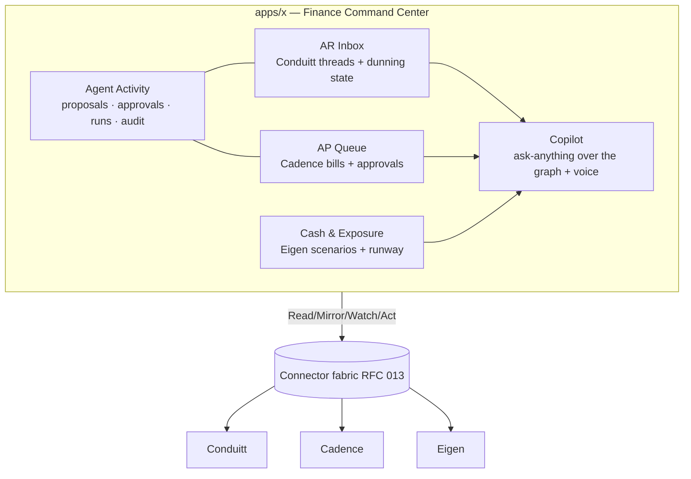
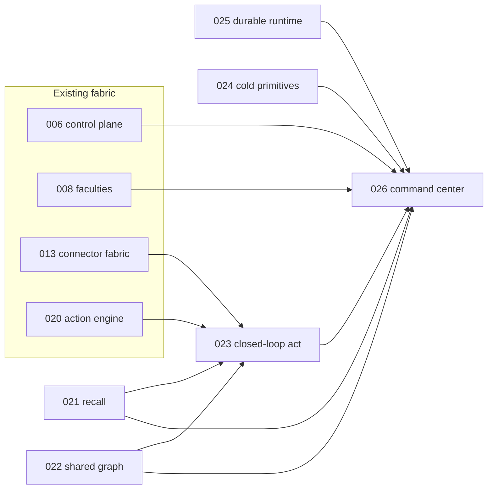

# RFC 026: The Finance Command Center

|                  |                                                                                                                                                                                                                                                                                                                                                                                                                                                                                                                      |
| ---------------- | -------------------------------------------------------------------------------------------------------------------------------------------------------------------------------------------------------------------------------------------------------------------------------------------------------------------------------------------------------------------------------------------------------------------------------------------------------------------------------------------------------------------- |
| **RFC**          | 026                                                                                                                                                                                                                                                                                                                                                                                                                                                                                                                  |
| **Status**       | Draft (umbrella / product vision)                                                                                                                                                                                                                                                                                                                                                                                                                                                                                    |
| **Track**        | Product · the finance-operator/founder cockpit over Conduitt + Cadence + Eigen                                                                                                                                                                                                                                                                                                                                                                                                                                       |
| **Owners**       | `apps/x` (cockpit surface) · `apps/rowboat-api` (federation) · product teams (Conduitt/Cadence/Eigen contracts)                                                                                                                                                                                                                                                                                                                                                                                                      |
| **Created**      | 2026-06-10                                                                                                                                                                                                                                                                                                                                                                                                                                                                                                           |
| **Last updated** | 2026-06-10                                                                                                                                                                                                                                                                                                                                                                                                                                                                                                           |
| **Composes**     | [006](./complete-006-desktop-cloud-control-plane.md) control plane · [008](./008-conduit-eigen-faculties.md) faculties · [013](./013-oppulence-product-connector-fabric.md) connector fabric · [020](./020-native-third-party-action-engine.md) action engine · **new:** [021](./021-semantic-memory-index.md) recall · [022](./022-unified-entity-graph.md) graph · [023](./023-closed-loop-actions.md) act · [024](./024-cold-primitives-ga.md) primitives · [025](./025-desktop-runtime-durability.md) durability |
| **Supersedes**   | none — this is the synthesis that gives the others a shared "why"                                                                                                                                                                                                                                                                                                                                                                                                                                                    |

## Summary

This is the umbrella RFC: it does not introduce new mechanics — it **composes** the foundations ([RFC 021–025](#dependency-on-the-foundation-rfcs)) and the existing fabric ([006](./complete-006-desktop-cloud-control-plane.md)/[008](./008-conduit-eigen-faculties.md)/[013](./013-oppulence-product-connector-fabric.md)/[020](./020-native-third-party-action-engine.md)) into one product: a **finance command center** where a **finance operator or founder** runs the entire cash cycle from a single, memory-aware, agentic desktop cockpit. AR lives in **Conduitt** (collections), AP in **Cadence**, and stress-testing/foresight in **Eigen** — three separate products that the desktop unifies via a shared entity graph, semantic recall, closed-loop actions, and the embedded browser/voice/connectors. The thesis, concretely: _"Acme is 22 days late on INV-456 (Conduitt), we owe their parent on BILL-88 due Friday (Cadence), paying it drops runway below the board floor in the downside case (Eigen) — here's the recommended sequence; approve?"_ — answered and **acted on** from one surface. None of the three verticals can do this alone.

## Why this is the unlock (and why it's defensible)

The three vertical products each own a slice of finance ops. Their data is siloed and their UIs are dashboards you read. The command center is the **horizontal layer** that:

1. **Unifies memory** — one entity ([RFC 022](./022-unified-entity-graph.md)) is the same customer in Conduitt, vendor in Cadence, and modeled entity in Eigen; the agent reasons across all three plus your email, calendar, and meeting transcripts.
2. **Closes the loop** — it doesn't just show you the overdue invoice, it runs the dunning cadence, watches for the payment, and updates the thread, with you approving the money-touching steps ([RFC 023](./023-closed-loop-actions.md)).
3. **Acts where there's no API** — the embedded browser + connectors mean it can operate vendor portals, bank sites, and tools the verticals don't integrate ([RFC 020](./020-native-third-party-action-engine.md)).

That horizontal memory + action layer is the moat: it gets more valuable with every product, every connector, and every resolved entity — and it's the surface the operator lives in all day, not another tab.

## Current state (grounded)

| Fact                                                                                                   | Evidence                                                                                                                                                                                                                             |
| ------------------------------------------------------------------------------------------------------ | ------------------------------------------------------------------------------------------------------------------------------------------------------------------------------------------------------------------------------------ |
| The desktop is an agentic coworker with a self-building knowledge graph + live-note/bg-task automation | `apps/x/packages/core/src/knowledge/`, `…/background-tasks/`, `…/knowledge/live-note/`                                                                                                                                               |
| Products federate via Read/Mirror/Watch/Act, not shared DBs                                            | [RFC 013](./013-oppulence-product-connector-fabric.md); [RFC 008](./008-conduit-eigen-faculties.md)                                                                                                                                  |
| Inbound state changes are normalized as `CloudEvent`s (product sources to be added)                    | `apps/rowboat-api/ent/schema/cloud_event.go:37`                                                                                                                                                                                      |
| The cloud runtime executes scheduled/event tasks with a deny-by-default tool surface                   | `apps/rowboat-api/internal/backgroundtaskruntime/tool_registry.go:5-15`; [RFC 004](./complete-004-cloud-agent-runtime.md)                                                                                                            |
| The desktop is already positioned as the **control plane** over cloud execution                        | [RFC 006](./complete-006-desktop-cloud-control-plane.md)                                                                                                                                                                             |
| **Missing foundations** this RFC depends on                                                            | recall ([021](./021-semantic-memory-index.md)), shared graph ([022](./022-unified-entity-graph.md)), closed-loop act ([023](./023-closed-loop-actions.md)), durable runtime ([025](./025-desktop-runtime-durability.md)) — all Draft |

## Goals

- A coherent **cockpit** for a finance operator/founder: AR inbox, AP queue, cash & exposure, and an agent-activity timeline — over Conduitt/Cadence/Eigen.
- **A small set of killer workflows** that are only possible because memory + action span the products.
- A **build order** that sequences the foundation RFCs so value compounds.
- **North-star metrics** that prove the cockpit is the operator's daily driver.

### Measurable acceptance signals (product-level)

- A founder completes a "morning cash command" review (AR at risk, AP due, runway under stress) in one surface in **< 5 minutes**.
- An operator runs a full dunning cycle on an account without leaving the cockpit or hand-touching the product UIs.
- **Daily active use** by the target persona with autonomous loops running between sessions (runs-while-closed via [RFC 006](./complete-006-desktop-cloud-control-plane.md)/[001](./complete-001-api-owned-scheduler.md)).

## Non-Goals

- Re-specifying any foundation — each is owned by its RFC. This doc **composes**, it does not re-define data models, tokens, or queues.
- Building inside the vertical products — their internal schemas are theirs; the command center integrates over the four seams.
- A consumer/personal-finance product — the persona is a **business** finance operator/founder.

## Personas & jobs-to-be-done

| Persona                      | Core jobs                                                          | What the cockpit gives them                                                                                                                         |
| ---------------------------- | ------------------------------------------------------------------ | --------------------------------------------------------------------------------------------------------------------------------------------------- |
| **Finance operator**         | Chase AR, approve AP, reconcile, keep the cash cycle moving        | Autonomous dunning with approvals; AP queue with context; one place for every counterparty's full history.                                          |
| **Founder / owner-operator** | "Are we okay on cash?", board prep, vendor/customer judgment calls | A cash-command briefing; stress-tested decisions ("can we pay BILL-88 and survive the downside?"); ask-anything memory across email/calls/products. |

## The killer workflows

Each workflow names the enabling RFCs. These are the demos that make it "insanely valuable."

### 1. Autonomous dunning with cockpit approval

Live-note objective _"keep Acme's overdue AR moving"_ → agent drafts the next dunning step using full context (recall [021] + entity [022]) → **proposes** the send ([023]) → operator approves on a card → executes via Conduitt's Act seam ([013]/[020]) → the resulting Stripe/payment event returns as a `CloudEvent` ([003]) → the thread updates (paid / promised / escalate). Runs while the laptop is closed via the cloud control plane ([006]/[001]).

### 2. AP approval gated by a live stress test

A Cadence bill (BILL-88) hits the AP queue → before approving, the agent asks Eigen to stress runway with this payment in the downside scenario ([008] faculty + [013] Read) → if it breaches the board floor, the card warns and suggests sequencing/partial payment → operator approves with eyes open ([023]).

### 3. "Cash command" morning briefing

One generated view across the shared graph ([022]) + recall ([021]): AR at risk (Conduitt), AP due this week (Cadence), runway under base/downside (Eigen), and what changed overnight (events) — answerable by voice. The founder's daily 5-minute cash review.

### 4. "What did we agree with Acme?"

Voice/meeting transcription ([RFC 009](./complete-009-local-on-device-transcription.md)/[017](./complete-017-on-device-meeting-diarization.md)) tied to the Acme entity ([022]) and its invoice thread → "in Tuesday's call we agreed to net-45 on INV-456" surfaced when chasing payment — memory the verticals don't have.

### 5. Act where there's no API

A vendor only has a web portal → the embedded browser + action engine ([020]) + approval ([023]) let the agent operate it (download a statement, submit a form) under human approval — extending reach beyond what Cadence/Conduitt integrate.

## Cockpit surface design

- **AR Inbox** — Conduitt invoice threads with dunning state, each backed by an entity ([022]); approval cards inline ([023]).
- **AP Queue** — Cadence bills with stress context ([008]/Eigen); approve/sequence with tokens ([012]/[023]).
- **Cash & Exposure** — Eigen scenarios; runway floors; the "can we afford this?" surface.
- **Agent Activity** — the propose→approve→execute→watch audit timeline ([023]); trust through legibility ([014]).
- **Copilot** — ask-anything over the unified graph, recall-powered ([021]), voice-capable ([009]).

## Dependency on the foundation RFCs

## Build order (sequence value, de-risk first)

| Phase                      | Ship                                                                                                                                                            | Why first                                                                      |
| -------------------------- | --------------------------------------------------------------------------------------------------------------------------------------------------------------- | ------------------------------------------------------------------------------ |
| **P0 — Trust floor**       | [025](./025-desktop-runtime-durability.md) durable runtime                                                                                                      | Autonomous finance actions need at-most-once correctness before anything else. |
| **P1 — Recall**            | [021](./021-semantic-memory-index.md) semantic index                                                                                                            | Every workflow needs context retrieval that scales.                            |
| **P2 — Unify**             | [022](./022-unified-entity-graph.md) entity graph                                                                                                               | The "one entity, many products" spine — the heart of the thesis.               |
| **P3 — Finish primitives** | [024](./024-cold-primitives-ga.md) cold primitives                                                                                                              | Slack triggers, schedule UI, version history remove daily-driver papercuts.    |
| **P4 — Act**               | [023](./023-closed-loop-actions.md) closed-loop + [013](./013-oppulence-product-connector-fabric.md)/[020](./020-native-third-party-action-engine.md) Act seams | Now safe to operate objects: dunning, AP approvals.                            |
| **P5 — Cockpit**           | this RFC's surfaces (AR/AP/Cash/Activity)                                                                                                                       | Compose it all into the operator's home.                                       |

## North-star & guardrail metrics

| Metric                                                 | Type       | Target intent                                                   |
| ------------------------------------------------------ | ---------- | --------------------------------------------------------------- |
| Daily active operators with ≥1 autonomous loop running | north-star | The cockpit is their daily driver.                              |
| Median time to "morning cash command" review           | activation | < 5 min.                                                        |
| AR touched-by-agent / total AR actions                 | value      | Agent does the bulk of routine chasing.                         |
| Money-moving actions executed without a valid token    | guardrail  | **0** (enforced by [023](./023-closed-loop-actions.md)).        |
| Duplicate/lost autonomous runs                         | guardrail  | **0** (enforced by [025](./025-desktop-runtime-durability.md)). |

## Security & trust

- Inherits the guarantees of the foundations: **no money moves without a single-use scoped token + step-up** ([023](./023-closed-loop-actions.md)/[012](./012-connector-suite-and-consent-broker.md)/[011](./complete-011-identity-and-authorization-plane.md)); **at-most-once** execution ([025](./025-desktop-runtime-durability.md)); **PII boundary** on the shared graph ([022](./022-unified-entity-graph.md)); **deny-by-default** tools ([004](./complete-004-cloud-agent-runtime.md)).
- **Legibility is trust**: the Agent Activity timeline ([014](./014-live-note-observability-cost-and-provenance.md)) makes every proposal/approval/execution/outcome auditable — essential for finance.

## Failure modes (product-level)

| Case                            | Behavior                                                | Mitigation                                                                                                                                     |
| ------------------------------- | ------------------------------------------------------- | ---------------------------------------------------------------------------------------------------------------------------------------------- |
| A product is down               | Read/Act for that product degrades; others keep working | Per-seam error codes ([013](./013-oppulence-product-connector-fabric.md)); cockpit shows the gap, doesn't fail whole.                          |
| Stale cross-product context     | Entity refs resolve to last-synced state                | Watch events keep entities fresh; reconcile fallback ([022](./022-unified-entity-graph.md)).                                                   |
| Operator over-trusts automation | —                                                       | Per-action approval + audit + guardrail metrics; auto-approve is opt-in and non-financial only ([023](./023-closed-loop-actions.md) Deferred). |

## Test plan (product-level)

- **E2E demos** of the five killer workflows in sandbox (Conduitt/Cadence/Eigen test instances).
- **Persona walkthroughs**: operator runs an AR day; founder runs a cash-command review — timed against the activation targets.
- Foundation test plans ([021–025](#dependency-on-the-foundation-rfcs)) gate their own correctness; this RFC validates **composition** (cross-product flows end-to-end).

## Acceptance criteria

- The five killer workflows demo end-to-end against sandbox product instances.
- The cockpit surfaces (AR/AP/Cash/Activity) compose the foundations with no new mechanics.
- Guardrails hold: 0 tokenless money moves, 0 duplicate autonomous runs.

## Alternatives considered

- **Build the command center inside one vertical (e.g., Conduitt)** — rejected: it would only ever see AR; the value is the horizontal span. The desktop is the only surface that already federates.
- **A web dashboard instead of the desktop cockpit** — rejected: loses local-first memory, the embedded browser (act-without-API), on-device voice/transcription, and the always-on agent runtime. The desktop is the differentiator.
- **Ship the cockpit before the foundations** — rejected: autonomous finance actions on an in-memory, non-durable, no-shared-graph base is unsafe; P0–P2 are prerequisites.

## Decisions

Resolved forks (consolidated in [`README.md`](./README.md)):

- **The command center is a composition RFC**, not new mechanics — it sequences and unifies [021–025](#dependency-on-the-foundation-rfcs) + the existing fabric.
- **The desktop is the cockpit** (not a web app): local-first memory + embedded browser + voice + always-on runtime are the moat.
- **Persona = business finance operator/founder**; AR=Conduitt, AP=Cadence, foresight=Eigen.
- **Trust before autonomy**: durability ([025](./025-desktop-runtime-durability.md)) and per-action approval ([023](./023-closed-loop-actions.md)) ship before broad automation.

### Deferred (post-v1)

- A team/multiplayer cockpit (multiple operators, assignment, roles) on top of the shared graph ([022](./022-unified-entity-graph.md)) + FGA ([015](./015-rowboat-platform-workos-fga-and-widget-auth.md)).
- Policy-tier auto-approval for non-financial routine actions ([023](./023-closed-loop-actions.md) Deferred).
- Additional planes (Canvas billing, Corinthian) as first-class cockpit surfaces once their seams land ([013](./013-oppulence-product-connector-fabric.md)).
