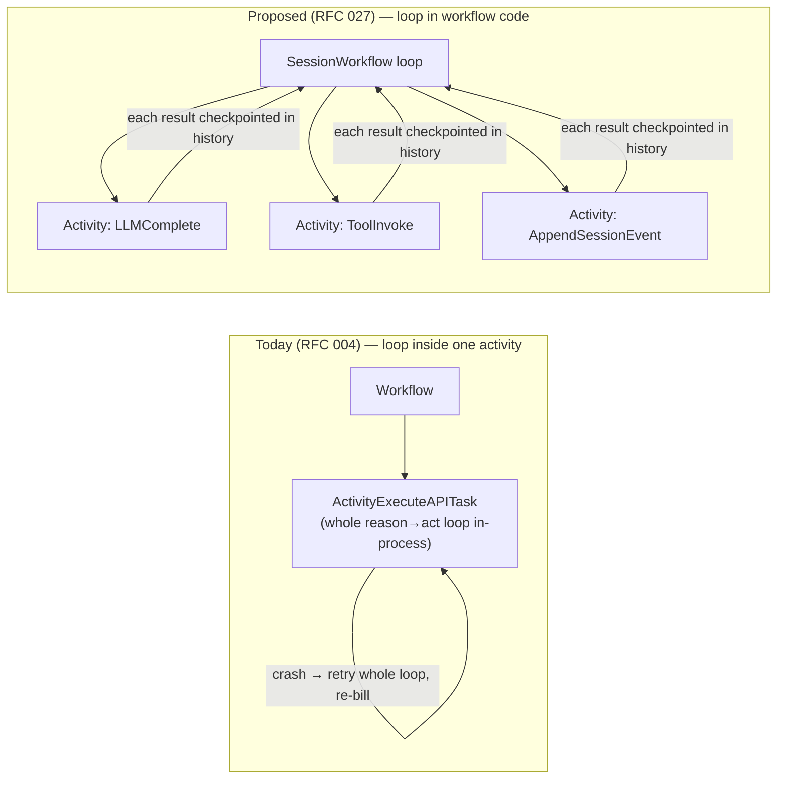
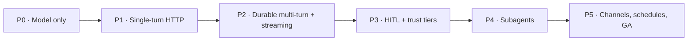

# RFC 027: Durable Agent Runtime

|                  |                                                                                                                                                                                                                                                                                                                                              |
| ---------------- | -------------------------------------------------------------------------------------------------------------------------------------------------------------------------------------------------------------------------------------------------------------------------------------------------------------------------------------------- |
| **RFC**          | 027                                                                                                                                                                                                                                                                                                                                          |
| **Status**       | Draft                                                                                                                                                                                                                                                                                                                                        |
| **Track**        | Backend service plane · durable agentic runtime                                                                                                                                                                                                                                                                                              |
| **Owners**       | `apps/rowboat-api`                                                                                                                                                                                                                                                                                                                           |
| **Created**      | 2026-06-17                                                                                                                                                                                                                                                                                                                                   |
| **Last updated** | 2026-06-17                                                                                                                                                                                                                                                                                                                                   |
| **Depends on**   | [RFC 004](./complete-004-cloud-agent-runtime.md) cloud runtime · [RFC 010](./010-rowboat-api-service-plane.md) service plane · [RFC 012](./012-connector-suite-and-consent-broker.md) consent broker · [RFC 005](./complete-005-temporal-schedule-integration.md) Temporal Schedules · ent/Postgres · Temporal · AI Gateway (`internal/llm`) |
| **Related**      | [RFC 008](./008-conduit-eigen-faculties.md) faculties · [RFC 018](./018-a2a-delegation-and-agent-identity.md) A2A delegation · [RFC 021](./021-semantic-memory-index.md) semantic memory · [RFC 023](./023-closed-loop-actions.md) closed-loop actions · [RFC 025](./025-desktop-runtime-durability.md) desktop runtime durability           |
| **Refs**         | Generalizes RFC 004's single-activity agent loop into a per-step durable, multi-tenant, multi-turn framework. Inspired by Vercel's [eve](https://vercel.com/docs/eve) (filesystem-first durable agents); this is its Temporal/Go analogue.                                                                                                   |

## Summary

This RFC defines a **durable, multi-tenant agent framework** inside `apps/rowboat-api` — a Temporal/Go analogue of Vercel's [eve](https://vercel.com/docs/eve), which models agents as durable backend workflows. The framework adds first-class **agents**, **sessions**, **turns**, **tools**, **subagents**, **human-in-the-loop approvals**, **channels**, and **streaming observability** on top of the Temporal infrastructure RFCs 001–006 already shipped. The single architectural move at its center: today the entire reason→act loop runs **inside one Temporal activity** (`Activities.ExecuteAPITask` → `backgroundtaskruntime.DefaultRuntime.Execute`), so a worker crash retries the whole loop from scratch and re-bills. We **lift the loop into workflow code** so each LLM call and each tool call becomes its own checkpointed activity recorded in Temporal history — yielding per-step durability, resume-exactly-where-stopped, multi-turn sessions, and indefinite zero-cost HITL pauses.

## What we're mirroring (eve)

eve is a filesystem-first framework for durable backend AI agents: an agent is a directory whose conventional files describe its behavior, every conversation runs as a durable workflow (checkpointed per step, surviving crashes/deploys/long pauses), and the runtime serves HTTP, streams lifecycle events, and supports indefinite approval pauses.

| eve primitive        | What it is                                                                               |
| -------------------- | ---------------------------------------------------------------------------------------- |
| Agent (`agent/` dir) | Conventional files compiled into a runnable agent                                        |
| `instructions.md`    | Always-on system prompt                                                                  |
| `agent.ts`           | Runtime config (model + options) via `defineAgent`                                       |
| `tools/*`            | One typed tool per file; filename = tool name; schema-validated                          |
| `skills/*`           | Larger procedures/knowledge loaded **on demand**, kept out of the always-on prompt       |
| `channels/*`         | Platform entry points (HTTP, Slack, Discord, Teams, Telegram, GitHub, Linear)            |
| `connections/*`      | Typed external integrations via MCP servers / OpenAPI docs, **auth brokered**            |
| `subagents/*`        | Delegated agents with isolated context windows + restricted tool sets                    |
| `sandbox/*`          | Isolated bash compute env for untrusted/model-generated code                             |
| `schedules/*`        | Recurring cron jobs                                                                      |
| Sessions & turns     | A session is the durable task; each message/event is a turn; lifecycle streams as NDJSON |
| HITL approvals       | Approval-required actions pause **indefinitely without consuming resources**             |
| Observability        | Every model/tool call is traced in order with inputs/outputs (OTel)                      |

## Current state (grounded)

The service already runs on Temporal; this is a framework layer over proven infrastructure, not greenfield.

| Fact                                                                                           | Evidence                                                                                                                                                                                                                                             |
| ---------------------------------------------------------------------------------------------- | ---------------------------------------------------------------------------------------------------------------------------------------------------------------------------------------------------------------------------------------------------- |
| Temporal SDK is wired; worker dials and registers activities in a redial loop                  | `apps/rowboat-api/cmd/worker/main.go:143` (`backgroundtaskworkflow.Dial`), `:174` (`Register`); `go.temporal.io/sdk v1.44.1`                                                                                                                         |
| A background-task workflow + control signal + deterministic ids already exist                  | `apps/rowboat-api/internal/backgroundtaskworkflow/workflow.go:39` (`WorkflowName`), `:51` (`SignalControl`), `:123` (`WorkflowID`), `:156` (`Register`)                                                                                              |
| **The whole agent loop runs inside one activity today** (the thing this RFC changes)           | `…/backgroundtaskworkflow/workflow.go:317` `ExecuteAPITask` → `:360` `a.Runtime.Execute(...)` → `…/backgroundtaskruntime/default_runtime.go:62`, the in-process `for call < MaxLLMCalls` loop at `:87`                                               |
| Reusable runtime primitives exist: deny-by-default registry, tools, limits, payload caps       | `…/backgroundtaskruntime/tool_registry.go:33` (`Lookup` → `ErrToolNotAllowed`), `runtime.go:119` (`Tool`), `:128` (`ToolRegistry`), `limits.go:11` (`Limits`), `default_runtime.go:15-49` (caps)                                                     |
| An event-routing workflow with deterministic per-event ids is the second workflow precedent    | `apps/rowboat-api/internal/cloudevents/workflow.go:21` (`RouteWorkflowName`), `:33` (`RouteWorkflowID`)                                                                                                                                              |
| LLM gateway does route → reserve → upstream → settle with spend limits and billing idempotency | `apps/rowboat-api/internal/llm/chat.go:90` (`ChatComplete`), `:113` (`gate.Reserve`); `…/backgroundtaskruntime/llm_client.go:109` (`runtimeRequestID`)                                                                                               |
| SSE streaming already exists for LLM passthrough (`http.Flusher`)                              | `apps/rowboat-api/internal/llm/stream.go:32` (`text/event-stream`), `:38` (`http.Flusher`)                                                                                                                                                           |
| Durable, seq-ordered, idempotent event projection pattern exists                               | `apps/rowboat-api/ent/schema/background_task_run_event.go` (unique `(run, seq)` index); `…/backgroundtaskworkflow/workflow.go:584` (`appendEvent`); poll API `…/backgroundtasks/handler.go:1200` (`ListRunEvents`, `?afterSeq`/`nextSeq` at `:1244`) |
| Connector/consent broker + scope model + money-moving approval tokens are defined              | [RFC 012](./012-connector-suite-and-consent-broker.md); scope `{product}:{resource}.{action}`, trust tiers incl. `money-moving`                                                                                                                      |
| Dark-by-default feature-flag convention is established                                         | `apps/rowboat-api/internal/appconfig/config.go:390` (`TEMPORAL_ENABLED=false`), `:402` (`CLOUD_SCHEDULER_ENABLED=false`), `:412` (`CLOUD_EVENTS_ROUTING_ENABLED=false`)                                                                              |

## Goals

- A **per-step durable** agent loop: each LLM/tool call is a checkpointed Temporal activity, so a session survives worker crashes, redeploys, and long pauses and resumes exactly where it stopped.
- **Multi-turn durable sessions** — a long-lived workflow that is idle (zero-cost) between turns, mirroring eve's session/turn model.
- **Declarative, multi-tenant agents** definable without a redeploy, composed from a type-safe Go tool registry.
- An **HTTP surface** for create-session / submit-turn / stream / approve / cancel under the existing `/v1/*` convention, with NDJSON streaming + a durable poll fallback.
- **Human-in-the-loop approvals** that pause the workflow indefinitely with no resource cost, integrating RFC 012 trust tiers and money-moving approval tokens.
- **Subagents** as child workflows with isolated context windows and narrowed tool sets (foundation for [RFC 018](./018-a2a-delegation-and-agent-identity.md) delegation).
- **Channels** beyond HTTP (Slack/etc.) and **schedules** reusing the RFC 003 ingestion and RFC 005 Temporal-Schedule machinery.
- **Cost governance**: per-turn and per-session caps layered on the existing `quota.Gate` spend limits.
- First-class **observability**: every model/tool call as a Temporal event + OTel span + queryable projection row.

## Non-Goals

- **Untrusted/model-generated code execution (eve's `sandbox/*`).** Deferred; it needs an isolated compute boundary (gVisor/Firecracker/microVM or a separate sandbox service) and matches RFC 004's existing refusal of shell/codegen tools. Called out in [Risks](#risks--open-decisions).
- New LLM provider integrations — we reuse `internal/llm` (OpenAI-compatible upstreams) as-is.
- Replacing the desktop's local runtime ([RFC 025](./025-desktop-runtime-durability.md)); this is the cloud-side framework. The desktop remains the control plane.
- A general drag-and-drop agent builder UI. This RFC defines the runtime + API; product surfaces consume it.

## eve → Temporal/Go concept mapping

| eve primitive                  | rowboat-api / Temporal equivalent                                                                                 | Builds on / reuses                                                                             |
| ------------------------------ | ----------------------------------------------------------------------------------------------------------------- | ---------------------------------------------------------------------------------------------- |
| Agent (`agent/` dir)           | `AgentDefinition` (ent row; tenant-scoped) or an embedded built-in spec loaded into the same shape                | `connectors.LoadRegistry` / `pricing.LoadJSON` data-loading precedent                          |
| `instructions.md`              | `AgentDefinition.instructions` (system prompt text)                                                               | `RunInput.Instructions` (`backgroundtaskruntime/runtime.go:19`)                                |
| `agent.ts` (model + config)    | `AgentDefinition.model/provider/limits`                                                                           | `RunInput.Model/Provider` (`runtime.go:20`), `Limits` (`limits.go:11`)                         |
| `tools/*` (typed, file = name) | Go `Tool` impls registered on the worker as **activities**; advertised via `ToolDef{Name,Description,Parameters}` | `backgroundtaskruntime.Tool`/`ToolRegistry`/`ToolDef` (`runtime.go:93,119,128`)                |
| `skills/*` (load-on-demand)    | A retrievable knowledge tool (`skill.load`) or sub-prompt fetched by an activity; v1 keeps it minimal             | tool mechanics; [RFC 021](./021-semantic-memory-index.md) for recall                           |
| `channels/*`                   | Channel adapters that start/append sessions via the canonical starter                                             | `internal/cloudevents` webhooks + router as ingestion precedent                                |
| `connections/*` (MCP/OpenAPI)  | `OAuthConnection`/`MCPConnection`/`ComposioLink` + consent broker; creds resolved **inside** the tool activity    | `internal/connectors`, `crypto.Sealer`, [RFC 012](./012-connector-suite-and-consent-broker.md) |
| `subagents/*`                  | `workflow.ExecuteChildWorkflow` → `rowboat.agent.subagent.v1`, isolated transcript + narrowed registry            | child-workflow pattern; [RFC 018](./018-a2a-delegation-and-agent-identity.md)                  |
| `sandbox/*` (untrusted bash)   | **Deferred** (see Non-Goals)                                                                                      | n/a                                                                                            |
| `schedules/*` (cron)           | Temporal Schedules starting sessions                                                                              | [RFC 005](./complete-005-temporal-schedule-integration.md)                                     |
| Session (the task)             | `rowboat.agent.session.v1` long-lived workflow + `AgentSession` projection                                        | `BackgroundTaskWorkflow` shape; `BackgroundTaskRun` projection                                 |
| Turn (a message/event)         | A Temporal **Update** (`submitTurn`) into the running workflow; `AgentTurn` projection                            | new; Signal precedent `SignalControl` (`workflow.go:51`)                                       |
| HITL approval                  | `workflow.Await` on an approval predicate, resolved by an `approveAction` Update                                  | [RFC 012](./012-connector-suite-and-consent-broker.md) money-moving approval token             |
| Observability (per-call)       | One activity per LLM/tool call → Temporal event + OTel span + `AgentToolCall`/event row                           | `internal/backgroundtaskworkflow/events.go`, OTel + Prometheus                                 |
| Continuation token + stream    | Signed token encoding the **stable** session workflow id + `x-rowboat-session-id` header; NDJSON SSE              | `BackgroundTaskRunEvent` projection + `internal/llm/stream.go`                                 |

## Architecture: the durable agent-loop workflow

### The inversion (why this is the core of the RFC)



Today `Activities.ExecuteAPITask` (`workflow.go:317`) calls `a.Runtime.Execute` (`workflow.go:360`), and the loop body — every LLM call and tool call — runs in-process inside that single activity (`default_runtime.go:62-184`). That is durable at the _task_ granularity but not the _step_ granularity. We move the `for` loop into workflow code; each step becomes an activity whose result is recorded in Temporal history and replayed (never re-executed) on recovery. The plain-Go primitives (`Tool`, `ToolRegistry`, `Message`, `ToolDef`, `truncateToolResult`, deny-by-default `Lookup`) are reused unchanged — only _where the loop body runs_ moves.

### `rowboat.agent.session.v1`

A long-lived session workflow, idle between turns:

```text
SessionWorkflow(ctx, SessionStart):
  state = rehydrate(SessionStart)              // compacted prior-turn summaries + counters
  register Update "submitTurn"                 // validated, synchronous ack
  register Update "approveAction"              // HITL resolution
  register Signal "control"                    // cancel/pause (reuse SignalControl shape)
  for {
     workflow.Await(turnPending || closeRequested || idleTimeout)
     if closeRequested || idleTimeout: break
     runTurn(ctx, &state, nextTurn)
     if shouldContinueAsNew(ctx, state):
        return workflow.NewContinueAsNewError(ctx, state.compact())
  }

runTurn:                                       // the reason→act loop, now in WORKFLOW code
  emit(agent.turn_started)
  transcript = seed(state.summary, turn.input)
  for call := 0; call < limits.MaxLLMCallsPerTurn; call++ {
     enforceBudgets(state, limits)
     res := ExecuteActivity(ctx, ActivityLLMComplete, ...).Get(ctx)   // billed; durable
     state.llmCalls++; state.costUnits += res.Cost
     transcript = append(transcript, res.Message)
     if len(res.Message.ToolCalls) == 0 { finalize(res.Content); return }
     for each toolCall in res.Message.ToolCalls:
        if isSubagent(toolCall):         result = ExecuteChildWorkflow(...)        // §subagents
        else if tool.requiresApproval:   result = awaitApprovalThenInvoke(...)     // §HITL
        else:                            result = ExecuteActivity(ctx, ActivityToolInvoke, ...).Get(ctx)
        transcript = appendToolResult(transcript, toolCall.ID, truncate(result))
  }
  finalize(limit_exceeded)
```

The loop body is structurally identical to `DefaultRuntime.Execute` (`default_runtime.go:87-184`) — same deny-by-default `Lookup`, same `truncateToolResult(result, resultCap(tool.Name()))` — but each `LLMComplete`/`ToolInvoke` is now a checkpointed activity.

### Activities (the IO / non-deterministic boundary)

| Activity                                       | Wraps / does                                                                                   | Reuses                                                                                |
| ---------------------------------------------- | ---------------------------------------------------------------------------------------------- | ------------------------------------------------------------------------------------- |
| `ActivityLLMComplete`                          | One model call; binds billing identity (`auth.WithUser`), tees token deltas to the stream bus  | `llm.Handler.ChatComplete` (`chat.go:90`), `GatewayLLM.Complete` (`llm_client.go:49`) |
| `ActivityToolInvoke`                           | Look up tool in the per-session scoped registry; resolve creds from `ToolScope` **internally** | `ToolRegistry.Lookup` (`tool_registry.go:33`), connector token resolution             |
| `ActivityAppendSessionEvent`                   | Write one durable `AgentSessionEvent(seq, type, json)` row + publish to the bus                | `appendEvent` read-max-seq + unique `(session, seq)` idempotency (`workflow.go:584`)  |
| `ActivityPersistTurn` / `ActivityMarkSession*` | Projection writes; guard-on-status idempotency                                                 | `MarkRunRunning/Done/Failed` pattern (`workflow.go`)                                  |
| `ActivityValidateApproval`                     | RFC 012 approval-token / WorkOS MFA step-up verification                                       | [RFC 012](./012-connector-suite-and-consent-broker.md)                                |

These register on the worker via a new `agentworkflow.Register(w, activities)` inside `cmd/worker/main.go`'s redial loop (next to `backgroundtaskworkflow.Register` at `main.go:174`), gated by the new flag.

### Turn delivery: Update, not Signal

A turn needs validation (model allowed? budget left? session not terminal?) and a synchronous result (turn id + continuation token), exactly like eve's `POST …/session`. We submit turns via a Temporal **Update** (`submitTurn`) whose validator rejects bad turns before they enter history and returns the turn id; we keep **Signal** for `cancel`/`pause` (genuinely fire-and-forget, and must work where Update is disabled), reusing the `SignalControl` shape (`workflow.go:51`). See [Decisions](#decisions) for the Update-availability fallback.

### Streaming out of a deterministic workflow

Workflows cannot do IO, so events flow through two complementary channels:

1. **Durable projection (source of truth):** `ActivityAppendSessionEvent` writes `AgentSessionEvent` rows — the exact analogue of `BackgroundTaskRunEvent`. The stream backfills/pages by seq, reusing the `?afterSeq=…`/`nextSeq` contract (`handler.go:1208,1244`). No event is lost when no live subscriber is attached, and reconnection is resumable.
2. **Live fan-out (low latency):** the same activity publishes to a Redis pub/sub channel `agent-session:{sessionID}` (Redis is already a first-class dep — `ratelimit.NewManager(..., cfg.RedisURL, ...)` in `wire.go:90`). The SSE handler subscribes for live deltas and backfills from the DB for `seq ≤ lastDelivered`, deduping by seq.

**Token-level deltas** bypass the workflow entirely: they are non-deterministic and must never touch workflow state. `ActivityLLMComplete` tees token deltas to the bus while it runs (reusing the SSE relay in `internal/llm/stream.go`); the workflow only ever sees the final `ChatResult`. The stream endpoint emits **NDJSON** (`application/x-ndjson`) to mirror eve.

### Determinism constraints

- **Activities** (non-deterministic / IO): all LLM calls, all tool executions, all DB reads/writes, connector token resolution, anything using wall-clock/random/network/tokenization.
- **Workflow code** (deterministic): the reason→act loop, transcript accumulation, budget counting, child-workflow orchestration.
- Use `workflow.Now(ctx)` for time; **no `time.Now()`/`uuid.NewString()`/map-iteration ordering** in workflow code. Derive deterministic ids: `agent-session/{userID}/{sessionID}` (analogue of `WorkflowID` at `workflow.go:123` and `RouteWorkflowID` at `cloudevents/workflow.go:33`), turn id `…/turn/{turnSeq}`, approval id `…/turn/{turnSeq}/approval/{toolCallIndex}`.
- **Billing idempotency** changes subtly: with the loop in the workflow, a _workflow replay_ does not re-invoke a recorded activity (no re-billing). The per-call activity reuses a `runtimeRequestID`-style key (`llm_client.go:109`) anchored to `agent-session/{sessionID}/turn/{turnSeq}/llm/{callIndex}` plus attempt, so the gateway's `charge.Finalized()/InProgress()` guards (`chat.go:117-121`) keep activity retries safe. **This is an explicit test target.**
- Use `workflow.GetVersion` for loop-shape changes and Temporal's replay test env; keep a `Register`-by-name test mirror (the convention flagged in `backgroundtaskworkflow/workflow_integration_test.go`).

### History / state & continuation

- The **Temporal event log** is the live source of truth (transcript reconstructed on replay from recorded activity results); **ent projections** (`AgentSession`/`AgentTurn`/`AgentSessionEvent`/`AgentToolCall`) are the queryable record that outlives Temporal's retention window — exactly as `BackgroundTaskRun`/`BackgroundTaskRunEvent` mirror workflow state today.
- **ContinueAsNew bounds history:** after a turn (or when `workflow.GetInfo(ctx).GetCurrentHistoryLength()` crosses a threshold), return `workflow.NewContinueAsNewError(ctx, state.compact())` carrying _summarized_ prior turns + latest artifact reference + counters, not the full transcript. The session **workflow id is stable** across ContinueAsNew (only the Temporal run id changes), so the client's continuation token keeps working.
- **Resumption:** GET stream reads `AgentSession.temporal_workflow_id` and tails events from `?afterSeq`. An idle/long-paused workflow is rehydrated by Temporal on the next Update — no resources consumed while idle. Attaching to a _closed_ session serves history from projections; a new turn on a closed session starts a fresh run under the same session workflow id (`WORKFLOW_ID_REUSE_POLICY_ALLOW_DUPLICATE`, cf. the `ALLOW_DUPLICATE_FAILED_ONLY` policy at `workflow.go:133`), seeded with the prior compacted state.

### HITL / approvals

```mermaid
sequenceDiagram
  participant M as Model (activity)
  participant W as SessionWorkflow
  participant DB as AgentApproval (ent)
  participant U as User/Client
  M-->>W: tool call (trust tier = money-moving)
  W->>DB: ActivityPersistApproval (pending)
  W-->>U: emit agent.approval_requested (durable + bus)
  Note over W: workflow.Await(resolved) — indefinite, zero worker slot
  U->>W: approveAction Update (X-Approval-Token)
  W->>W: validator → ActivityValidateApproval (RFC 012 MFA/token)
  alt granted
    W->>M: ActivityToolInvoke
  else denied
    W->>W: append denial observation; model reacts
  end
```

When the loop selects a tool whose `ToolDef` carries a trust tier requiring approval (RFC 012 `act`/`money-moving`), the workflow emits `agent.approval_requested` with a deterministic `approvalId`, tool name, **redacted** args, and tier; persists an `AgentApproval` row; and blocks on `workflow.Await`. This consumes no worker slot (eve's "pause indefinitely without consuming resources"). Resolution arrives via the `approveAction` Update, whose validator calls `ActivityValidateApproval` (money-moving requires a per-invocation `X-Approval-Token` + WorkOS MFA step-up per RFC 012). An optional `workflow.NewTimer` provides auto-expiry.

### Limits / budgets

Extend `backgroundtaskruntime.Limits` (`limits.go:11`) into per-turn and per-session tiers:

- **Per-turn:** `MaxLLMCallsPerTurn`, `MaxToolCallsPerTurn`, `MaxWallclockPerTurn` (a `workflow.NewTimer` racing the loop; per-call activity `StartToCloseTimeout` stays below it — same invariant as the validated `CLOUD_RUNTIME_MAX_DURATION < 5m` at `config.go:597`).
- **Per-session:** `MaxTurns`, cumulative `MaxLLMCalls`, cumulative **credit/spend ceiling** tracked in workflow state from each `ChatResult` (carried through ContinueAsNew). Each LLM activity already passes through `quota.Gate.Reserve/Settle` with `SpendLimits` (`chat.go:113`); the session ceiling is an additional governor. Breaches emit `agent.limit_exceeded`, reusing the `RuntimeLimitExceeded` metric/error vocabulary.

## Subagents as child workflows

The model invokes a subagent as a tool call (`subagent.delegate`), so it slots into the existing loop; the dispatch step branches to `workflow.ExecuteChildWorkflow(ctx, opts, "rowboat.agent.subagent.v1", subInput)` instead of `ActivityToolInvoke`.

- **Isolated context:** the child gets a fresh transcript seeded only with the delegated task; its transcript never merges into the parent's history. The parent receives a compact `SubagentResult{Summary, ArtifactRefs}` and appends _that_ as the tool observation.
- **Restricted tools:** the worker registers the same Go tool activities, but the child's deny-by-default `ToolRegistry` is built from the child `AgentDefinition`'s narrower allowlist. The child runs under a **scoped delegation token + agent identity** per [RFC 018](./018-a2a-delegation-and-agent-identity.md) (narrower than the parent's).
- **Cancellation:** set `ChildWorkflowOptions.ParentClosePolicy` (REQUEST_CANCEL); run each child under a cancelable `workflow.Context` so the parent can cancel one subagent without dying; children check `ctx.Err()` cooperatively. Child failure does not auto-fail the session — the parent decides retry/fallback (RFC 018).
- A **delegation-depth + fan-out cap** in workflow state prevents recursive credit burn.

## Agent definition (hybrid)

Tools must run as Temporal activities, so every tool's Go implementation **must be registered on the worker regardless of representation**. Therefore tools are always compiled-in Go; the "definition" question is only about _composition_ (instructions, model, enabled tools, subagent/channel/connector wiring). The framework is also multi-tenant. We adopt a two-layer hybrid:

- **Layer 1 — Go capability registry (compile-time, type-safe):** every tool is a Go `backgroundtaskruntime.Tool` registered on the worker, declaring name, JSON-Schema params, and required scope/trust tier (RFC 012). Type safety lives here; this is non-negotiable because tools are activities.
- **Layer 2 — declarative `AgentDefinition` (runtime data, multi-tenant):** an ent row referencing tools **by name** (validated at save against the Layer-1 registry — unknown name → `400`, preserving deny-by-default), plus instructions, model config, limits, subagent composition, channel bindings, connector requirements. Enables tenant agents **without a redeploy**.
- **First-party agents via embedded convention directory (the eve flavor):** built-ins ship as an `embed.FS` `agents/<name>/` directory (`instructions.md`, `agent.json`, `tools.json`) loaded into the _same_ `AgentDefinition` shape at boot and seeded as system-owned, read-only definitions tenants can fork.

This matches existing precedent — declarative catalogs loaded from data (`connectors.LoadRegistry`, `pricing.LoadJSON`) over a compiled-in implementation registry — and RFC 004's already-decided "hand-rolled bounded loop, no external Go agent framework." Pure Go-native is rejected (no tenant agents without redeploy); pure declarative is rejected (tools cannot be data — a manifest can only _reference_ Go activities).

## HTTP surface

Mounted in `cmd/server/wire.go` `mountRoutes` inside the authenticated group (after `authMW.RequireJWT` at `wire.go:335`, alongside `/v1/background-tasks` at `:349`), behind `AGENT_RUNTIME_ENABLED`, with a new `ratelimit.GroupAgent`:

```text
/v1/agents                                  # AgentDefinition CRUD (multi-tenant)
/v1/agent-sessions
  POST   /v1/agent-sessions                 # create → start workflow; returns continuationToken + x-rowboat-session-id
  GET    /v1/agent-sessions/{id}            # session view (projection)
  POST   /v1/agent-sessions/{id}/turns      # submit a turn (Update submitTurn)
  GET    /v1/agent-sessions/{id}/stream     # NDJSON live stream (tail projection + Redis bus)
  GET    /v1/agent-sessions/{id}/events     # paged poll fallback (?afterSeq / nextSeq)
  POST   /v1/agent-sessions/{id}/approvals/{approvalId}  # approve/deny (Update approveAction; X-Approval-Token)
  POST   /v1/agent-sessions/{id}/cancel     # Signal / CancelWorkflow
```

`continuationToken` encodes the **stable** session workflow id (survives ContinueAsNew); `x-rowboat-session-id` = `AgentSession.session_id` — direct analogues of eve's `continuationToken` / `x-eve-session-id`. We generalize the `NewStarter`/`Controller` pattern: wire `agentSessionsH.SetTemporal(agentworkflow.NewStarter(temporalClient, cfg))`, mirroring `backgroundTasksH.SetTemporal(backgroundtaskworkflow.NewStarter(...))` at `wire.go:140`. Because two+ subsystems now dial Temporal, hoist `backgroundtaskworkflow.Dial` (`workflow.go:101`) into a shared `internal/temporalx` package (low-risk refactor). Channels and schedules create sessions through the same canonical starter (`internal/agentsessions`), exactly as the scheduler and event router both funnel through one `Starter` today.

## New Go packages + ent entities

**Packages** (mirroring `backgroundtaskworkflow` / `backgroundtaskruntime` / `backgroundtaskruns`):

| Package                                     | Owns                                                                                                                                                                   |
| ------------------------------------------- | ---------------------------------------------------------------------------------------------------------------------------------------------------------------------- |
| `internal/agentworkflow`                    | `rowboat.agent.session.v1` + `rowboat.agent.subagent.v1`, activities, `Controller`/`Starter`, `Register`, deterministic ids                                            |
| `internal/backgroundtaskruntime` _(extend)_ | shared primitives reused as-is (`Tool`, `ToolRegistry`, `Message`, `ToolDef`, `truncateToolResult`, `Limits`); add per-call helpers + trust-tier metadata on `ToolDef` |
| `internal/agentregistry`                    | `AgentDefinition` loader (embedded built-ins via `embed.FS` + tenant ent rows), name-validation against the tool registry                                              |
| `internal/agentsessions`                    | the one canonical session/turn creation path (analogue of `backgroundtaskruns`)                                                                                        |
| `internal/agents`                           | chi HTTP handlers (analogue of `internal/backgroundtasks`)                                                                                                             |
| `internal/agentstream`                      | NDJSON SSE tail + Redis pub/sub fan-out (borrows from `internal/llm/stream.go`)                                                                                        |

**ent entities** — each with `mixin.BaseMixin{}` + a `user` (and/or org) edge so `internal/db/interceptors.go` tenant-scopes them automatically, following `BackgroundTaskRun`/`BackgroundTaskRunEvent` conventions:

| Entity              | Key fields                                                                                                                                                                                       |
| ------------------- | ------------------------------------------------------------------------------------------------------------------------------------------------------------------------------------------------ |
| `AgentDefinition`   | slug, name, instructions, model, provider, limits (json), enabled_tools ([]string), subagent_refs, channel_bindings, connector_reqs, source (`builtin`/`tenant`), revision; unique (slug, owner) |
| `AgentSession`      | session_id, agent ref, status, temporal_workflow_id, temporal_run_id, channel, cumulative counters (turns, llm_calls, tool_calls, cost_units); index temporal_workflow_id                        |
| `AgentTurn`         | session ref, seq, input, status, summary, llm_calls, tool_calls, cost_units, started/completed                                                                                                   |
| `AgentSessionEvent` | session ref, optional turn ref, seq, event_type, event_json (validJSON), received_at; **unique `(session, seq)`**                                                                                |
| `AgentToolCall`     | turn ref, call_index, tool_name, args_json (redacted), result_bytes, status, error_code, trust_tier, timestamps                                                                                  |
| `AgentApproval`     | session ref, turn ref, approval_id, tool_name, trust_tier, status (pending/granted/denied/expired), approval_token_ref, requested_by/resolved_by, timestamps                                     |

Migrations are additive (`make generate` → `make migrate-dump` → `make migrate-apply`), no backfill, safe to apply ahead of the code that reads them.

## Phased delivery (dark-by-default)

Master flag `AGENT_RUNTIME_ENABLED=false` (the new-feature default, like `TEMPORAL_ENABLED`/`CLOUD_SCHEDULER_ENABLED`/`CLOUD_EVENTS_ROUTING_ENABLED` at `config.go:390-412`) + sub-flags `AGENT_STREAMING_ENABLED`, `AGENT_HITL_ENABLED`, `AGENT_SUBAGENTS_ENABLED`. Each phase ends in a hard gate.



| Phase  | Work                                                                                                                                                                                                                                                                                    | Gate                                                                                                                                                          |
| ------ | --------------------------------------------------------------------------------------------------------------------------------------------------------------------------------------------------------------------------------------------------------------------------------------- | ------------------------------------------------------------------------------------------------------------------------------------------------------------- |
| **P0** | Ent entities + additive migration; `internal/agentworkflow` skeleton registered on the worker but inert; embedded built-in loader; no routes mounted.                                                                                                                                   | Migrations apply clean (Postgres + sqlite); worker registers; nothing reachable.                                                                              |
| **P1** | `rowboat.agent.session.v1` with the loop in workflow code; `ActivityLLMComplete` (wrap `ChatComplete`), `ActivityToolInvoke` (reuse read-only tools); durable events; `POST /v1/agent-sessions` + `POST …/turns` (Signal first) + `GET …/events` poll; per-turn `Limits`.               | A flagged tenant runs a single-turn agent end-to-end; `Lookup("shell")` denied; cost bounded.                                                                 |
| **P2** | Long-lived idle-between-turns workflow; switch turn submit to **Update** (synchronous ack + turn id + continuation token); ContinueAsNew to bound history; NDJSON SSE with Redis fan-out + DB backfill; token deltas teed from the LLM activity.                                        | Session survives a worker restart mid-session and resumes from the recorded step; reconnecting stream backfills missed events; history bounded under N turns. |
| **P3** | `ToolDef` trust tiers (RFC 012); approval-required tools pause on `workflow.Await`; `approveAction` Update + `ActivityValidateApproval`; `AgentApproval` rows + approval events.                                                                                                        | A money-moving tool blocks indefinitely consuming no resources and resumes only on a valid `X-Approval-Token`; invalid token rejected by the validator.       |
| **P4** | `rowboat.agent.subagent.v1`; `subagent.delegate` branches into `ExecuteChildWorkflow` with isolated context + narrowed registry + delegation token (RFC 018); summarized result folded back; `ParentClosePolicy` + cancellation; depth/fan-out caps.                                    | Parent delegates, child runs isolated, summary returned, parent cancel cancels child.                                                                         |
| **P5** | Channel adapters (Slack/etc.) start/append sessions via `internal/agentsessions` (reuse cloudevents webhook+router pattern); Temporal Schedules start sessions (reuse RFC 005); `AgentDefinition` CRUD GA; flip `AGENT_RUNTIME_ENABLED` after burn-in. `sandbox/*` explicitly deferred. | Scheduled + channel-triggered sessions run desktop-closed; SLOs hold over soak; rollback = flag off.                                                          |

## Decisions

| Decision                         | Choice                                                                                                                                                                                            | Affects       |
| -------------------------------- | ------------------------------------------------------------------------------------------------------------------------------------------------------------------------------------------------- | ------------- |
| **Loop location**                | Lift the reason→act loop from inside `ExecuteAPITask` into **workflow code**; each LLM/tool call is its own checkpointed activity. RFC 004's single-activity loop becomes the legacy/`Noop` path. | runtime       |
| **Agent definition**             | **Hybrid** — type-safe Go tool registry (Layer 1) + declarative `AgentDefinition` ent rows referencing tools by name (Layer 2) + embedded built-in directory for first-party agents.              | definition    |
| **Naming**                       | Descriptive: "Durable Agent Runtime"; packages `internal/agent*`; routes `/v1/agent-sessions`. No new product codename.                                                                           | all           |
| **Turn delivery**                | Temporal **Update** (`submitTurn`/`approveAction`) for validated, synchronous turns and approvals; **Signal** retained for `cancel`/`pause`.                                                      | API, workflow |
| **Update-availability fallback** | If a cluster lacks Update support, fall back to a Signal-submit + poll-`/events` flow (no synchronous ack). **Open:** require Update at GA, or keep the dual path permanently.                    | API           |
| **History bounding**             | ContinueAsNew with a compacted state; stable session workflow id across ContinueAsNew. **Open:** ContinueAsNew per-turn vs on a history-length threshold.                                         | workflow      |
| **Sandbox / code-exec**          | **Deferred** (Non-Goal); requires an isolated compute boundary before enabling. Matches RFC 004 disallowing shell/codegen.                                                                        | scope         |
| **Budgets**                      | Per-turn + per-session caps layered on the existing `quota.Gate` `SpendLimits`; per-tenant defaults (no per-task override), consistent with RFC 004.                                              | cost          |

## Risks & open decisions

- **Temporal history growth.** Every LLM/tool result enters history; large tool outputs + long transcripts approach Temporal's per-payload (~2–4 MB) and per-workflow history (~50 MB / ~51.2k events) limits. _Mitigations:_ existing payload caps (`toolResultCap`/`artifactResultCap`/`truncateToolResult`, `default_runtime.go:15-49`), claim-check large blobs into ent/object store and pass references, ContinueAsNew cadence, summarize-and-compact prior turns.
- **Non-determinism with streaming.** Token deltas must never feed workflow state — only the final `ChatResult` is durable. _Risk:_ branching workflow logic on streamed content; `time.Now()`/`uuid`/map-ordering leaking into workflow code. _Mitigations:_ strict activity boundary, `workflow.Now`, deterministic ids, `workflow.GetVersion`, replay tests.
- **Billing idempotency across replay vs retry.** The loop-in-workflow inversion changes the model (replay does not re-bill; activity retry reserves fresh). Reuse a `runtimeRequestID`-style per-call key; make it an explicit test target.
- **Cost amplification.** Multi-turn + recursive subagents multiply spend. _Mitigations:_ per-turn AND per-session ceilings, cumulative cost from `ChatResult`, subagent depth/fan-out caps, reuse `quota.Gate`. **Open:** per-tenant vs per-agent budget overrides.
- **Prompt-injection / connector scopes.** Turn content is untrusted; tools must resolve creds from `ToolScope` internally, never model text (existing invariant; RFC 004 rejects creds in model text). Amplified by subagents and money-moving tools. _Mitigations:_ deny-by-default registry, RFC 012 scope/trust tiers + per-invocation approval, RFC 018 delegation tokens scoped narrower than the parent, redacted args in audit rows/events. **Open:** whether `act`/`money-moving` tiers are mandatory-HITL by default.
- **At-least-once event projection.** Event-append activities can run more than once. Reuse the `appendEventIfMissing` + unique `(session, seq)` + read-max-seq-retry idempotency (`workflow.go:584,642`); SSE clients dedupe by seq.

## Test plan

- **Replay/determinism:** Temporal replay test env over `rowboat.agent.session.v1`; keep a `Register`-by-name test mirror (the convention in `backgroundtaskworkflow/workflow_integration_test.go`).
- **Worker-restart resume:** kill the worker mid-session; assert the session resumes from the recorded step (no re-billed LLM call, transcript intact).
- **Billing idempotency:** assert a replay does not re-charge and an activity retry reuses the per-call `RequestID` (`charge.Finalized()/InProgress()` honored).
- **Deny-by-default:** `Lookup("shell")` / any non-allowlisted tool → `ErrToolNotAllowed`.
- **HITL indefinite pause:** an approval-required tool blocks on `workflow.Await` with no timer firing; resumes only on a valid `approveAction` Update; invalid `X-Approval-Token` rejected by the validator.
- **ContinueAsNew:** session over N turns stays under the history-length threshold; continuation token still resolves the same workflow id.
- **SSE reconnect:** drop and reattach mid-session; assert backfill from `?afterSeq` + dedupe-by-seq yields a gap-free, duplicate-free stream.
- **Migrations:** apply clean on Postgres (testcontainer) and sqlite; entities tenant-scoped via interceptors.
