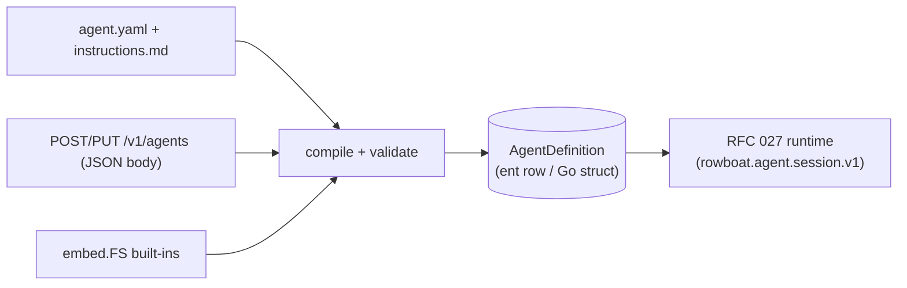
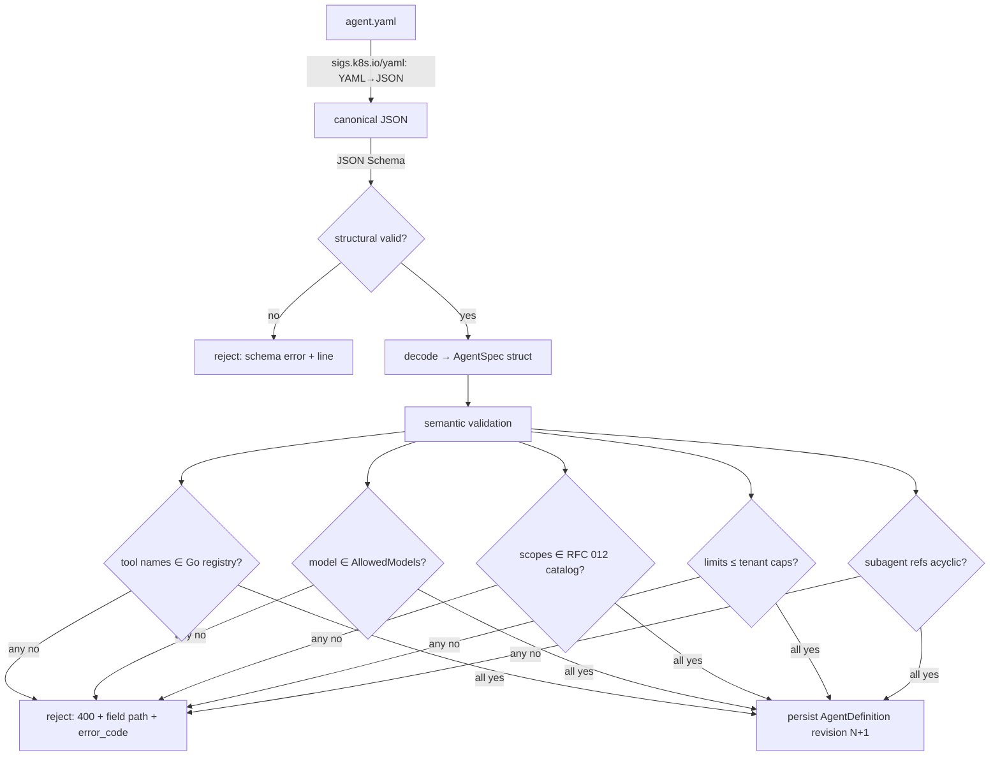
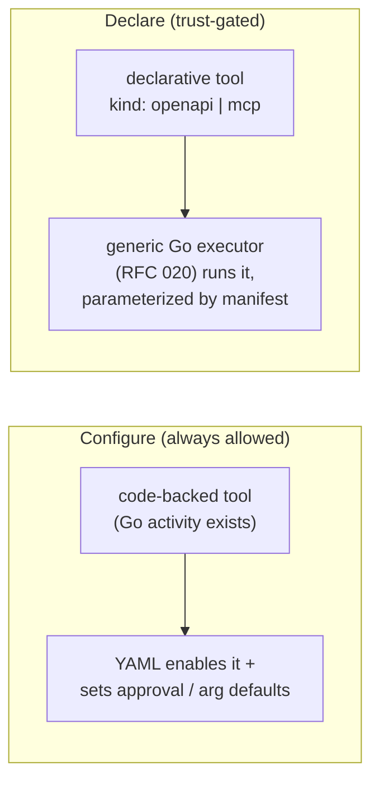

# RFC 028: Declarative Agent Definitions (YAML & GitOps)

|                  |                                                                                                                                                                                                                                                                                                                                             |
| ---------------- | ------------------------------------------------------------------------------------------------------------------------------------------------------------------------------------------------------------------------------------------------------------------------------------------------------------------------------------------- |
| **RFC**          | 028                                                                                                                                                                                                                                                                                                                                         |
| **Status**       | Draft                                                                                                                                                                                                                                                                                                                                       |
| **Track**        | Backend service plane · agent authoring                                                                                                                                                                                                                                                                                                     |
| **Owners**       | `apps/rowboat-api` · `apps/cli`                                                                                                                                                                                                                                                                                                             |
| **Created**      | 2026-06-17                                                                                                                                                                                                                                                                                                                                  |
| **Last updated** | 2026-06-17                                                                                                                                                                                                                                                                                                                                  |
| **Depends on**   | [RFC 027](./complete-027-durable-agent-runtime.md) durable agent runtime (the `AgentDefinition` shape, `internal/agentregistry`, `/v1/agents`) · [RFC 012](./012-connector-suite-and-consent-broker.md) scope catalog · [RFC 020](./020-native-third-party-action-engine.md) declarative OpenAPI/MCP tools · `internal/llm` model allowlist |
| **Related**      | [RFC 005](./complete-005-temporal-schedule-integration.md) reconciler pattern · [RFC 010](./complete-010-rowboat-api-service-plane.md) service plane · [RFC 018](./018-a2a-delegation-and-agent-identity.md) delegation · [RFC 023](./023-closed-loop-actions.md) closed-loop actions                                                       |
| **Refs**         | Extends RFC 027's hybrid definition (Layer 2) with a YAML source format + GitOps. Mirrors Vercel eve's filesystem-first authoring. YAML compiles into the **same** `AgentDefinition` — no new runtime path.                                                                                                                                 |

## Summary

[RFC 027](./complete-027-durable-agent-runtime.md) makes agents a hybrid: type-safe Go tools (Layer 1) composed by a declarative, multi-tenant `AgentDefinition` (Layer 2). This RFC adds a **YAML authoring format and a GitOps workflow** for that Layer 2, so first-party and tenant agents can be defined as files — `agent.yaml` + `instructions.md` — validated against the live tool registry and applied without a redeploy. The central invariant: **YAML is a _source format_ that compiles into the same `AgentDefinition`** the API and embedded built-ins already use; the durable session workflow, activities, and ent rows from RFC 027 are unchanged. This RFC also draws the line between **configuring code-backed tools** (always allowed) and **declaring new declarative tools** (OpenAPI/MCP via [RFC 020](./020-native-third-party-action-engine.md), trust-gated) — which is how a customer gets genuinely new capabilities from a file with no code change on our side.

## Relationship to RFC 027

RFC 028 is purely additive to RFC 027. One canonical shape, three front doors:



| Concern                      | Owned by RFC 027                                           | Added by RFC 028                                                           |
| ---------------------------- | ---------------------------------------------------------- | -------------------------------------------------------------------------- |
| Canonical agent shape        | `AgentDefinition` (struct + ent row), `revision`           | unchanged; gains `source_format` / `raw_source` / `content_hash` fields    |
| Composition loader/validator | `internal/agentregistry` (validate tool names vs registry) | YAML→struct decode + JSON-Schema validation feeding the **same** validator |
| Runtime                      | `rowboat.agent.session.v1`, activities, sessions/turns     | unchanged                                                                  |
| Authoring                    | embedded built-ins + `/v1/agents` JSON CRUD                | YAML files, a CLI, and a GitOps reconciler                                 |

## Current state (grounded)

| Fact                                                                                               | Evidence                                                                                                                                                                                                         |
| -------------------------------------------------------------------------------------------------- | ---------------------------------------------------------------------------------------------------------------------------------------------------------------------------------------------------------------- |
| The "declarative catalog loaded from data" pattern is already established and wired                | `pricing.LoadJSON([]byte)` (`apps/rowboat-api/internal/pricing/pricing.go:61`, used at `cmd/server/wire.go:77`); `connectors.LoadRegistry([]byte)` (`internal/connectors/registry.go:62`, used at `wire.go:244`) |
| Config-as-override-of-built-in defaults is the convention (env supplies raw JSON, code falls back) | `CONNECTORS_JSON` / `PRICING_JSON` (`internal/appconfig/config.go:94,164,336,377`)                                                                                                                               |
| A model allowlist policy already rejects disallowed models with a `400`                            | `internal/llm/handler.go:50` (`AllowedModels`), `:100` (policy map), `:402` (`model_not_allowed`); `LLM_ALLOWED_MODELS` (`config.go:171,380`)                                                                    |
| The reconciler pattern (declared → desired → repair drift, with a persisted sync-state) exists     | `internal/backgroundtaskschedule` `Reconciler.ReconcileOnce`; `ScheduleSyncState`/`ScheduleSyncError` repaired to `current`/`failed`/`paused` (`reconciler_test.go`)                                             |
| YAML→JSON decoding libraries are already in the dependency tree                                    | `github.com/ghodss/yaml` (`go.mod:42`), `gopkg.in/yaml.v3` (`go.mod:125`) — promote `sigs.k8s.io/yaml` (same approach) to a direct dep                                                                           |
| A native declarative tool engine (OpenAPI-bootstrapped manifests, MCP-first) is specified          | [RFC 020](./020-native-third-party-action-engine.md) — "declarative manifests bootstrapped from OpenAPI, plus an MCP-first policy"                                                                               |
| A CLI app exists to host author tooling                                                            | `apps/cli`                                                                                                                                                                                                       |

## Goals

- A **versioned YAML schema** (`apiVersion: agent.rowboat.dev/v1`, `kind: Agent`) and directory convention (`agent.yaml` + `instructions.md` + optional `skills/`) that compiles into `AgentDefinition`.
- A **single validation pipeline** shared by YAML and the JSON API: structural (JSON Schema) + semantic (tool names vs the Go registry, model vs the allowlist, scopes vs the RFC 012 catalog, limits clamped to tenant caps, subagent-ref cycle detection).
- **Three delivery modes** over the same shape: embedded built-ins (build-time), tenant-authored `PUT /v1/agents` (runtime, no redeploy), and a **GitOps reconciler** (a repo of agent YAMLs → desired state, drift repaired).
- A clear, enforced boundary between **configuring** code-backed tools and **declaring** new declarative (OpenAPI/MCP) tools, with the latter trust-gated.
- **Immutable, revision-pinned** definitions so editing a YAML never mutates a running RFC 027 session.
- **Author DX**: a `rowboat agent validate|diff|push|pull` CLI and a published JSON Schema for editor autocomplete.

## Non-Goals

- **Defining new executable tool code in YAML.** Tools run as Temporal activities (RFC 027); YAML may _configure_ code-backed tools or _reference_ declarative OpenAPI/MCP tools (RFC 020), never carry arbitrary code. (Restated in [Decisions](#decisions).)
- Changing the RFC 027 runtime, session/turn model, or activity set.
- Secrets/credentials in YAML — see [Secrets](#secrets-never-live-in-yaml).
- A visual agent builder UI (a separate product surface; it would write the same `AgentDefinition`).

## The authoring format

A directory mirrors eve's filesystem-first convention; long prompts stay in markdown so YAML stays readable.

```text
agents/
  collections/
    agent.yaml          # composition: model, tools, connections, subagents, limits, channels, triggers
    instructions.md     # the system prompt (referenced by spec.instructionsFile)
    skills/             # optional markdown procedures (RFC 027 skills)
```

`agent.yaml`:

```yaml
apiVersion: agent.rowboat.dev/v1
kind: Agent
metadata:
  slug: collections
  name: Collections Agent
spec:
  model: anthropic/claude-sonnet-4-6 # validated against internal/llm AllowedModels
  instructionsFile: ./instructions.md # or inline `instructions: |`
  limits: # clamped to tenant caps (RFC 027)
    maxTurns: 20
    maxLLMCalls: 60
    maxToolCalls: 120
    spendCeilingUsd: 5.00
  tools: # references by NAME → validated vs the Go registry
    - conduit.read
    - eigen.simulate
    - name: gmail.send
      requiresApproval: true # per-tool trust override (RFC 027 HITL)
    - name: vendor_portal # a DECLARATIVE tool (RFC 020), trust-gated
      kind: openapi
      manifestRef: manifests/acme-portal.yaml
  connections: # what it NEEDS — scopes, never credentials
    - scope: "conduit:invoices.read"
    - scope: "gmail:messages.send"
  subagents:
    - draft_dunning # another Agent slug; cycle-checked
  channels: [http, slack]
  triggers:
    - schedule: "0 9 * * 1" # compiles to an RFC 005 Temporal Schedule
```

The struct backing this is the canonical RFC 027 `AgentDefinition`; YAML adds no fields the JSON API cannot also express.

## The compile-and-validate pipeline



- **YAML → JSON** with `sigs.k8s.io/yaml` (the `ghodss/yaml` approach already in the tree at `go.mod:42`) so **one JSON Schema validates both** the YAML file and the `/v1/agents` JSON body. Use **strict decoding** (disallow unknown fields, reject duplicate keys) to avoid silent YAML footguns.
- **Tool-name validation** reuses RFC 027's rule exactly: each `tools[].name` must resolve in the Layer-1 Go registry, preserving deny-by-default (`tool_registry.go:33` `Lookup` → `ErrToolNotAllowed`). Unknown name → `400 tool_not_registered`.
- **Model validation** reuses `internal/llm` `AllowedModels` (`handler.go:50`); disallowed model → `model_not_allowed` (`handler.go:402`).
- **Scope validation** checks each `connections[].scope` against the RFC 012 catalog (`{product}:{resource}.{action}`) and tenant entitlements.
- **Limits** are clamped to the tenant's per-tenant ceilings (RFC 027 budgets); over-cap → rejected, not silently lowered.
- **Subagent refs** are resolved and **cycle-checked** at validate time.

Validation is a pure function over `(spec, registrySnapshot, tenantPolicy)`, so the CLI runs the _same_ check offline as the server does on apply.

## Tools: configure vs declare

This is the crux of "new capabilities from a file." Two tiers, enforced by the validator:



- **Configure (Tier 1):** the tool's behavior is Go (a registered activity). YAML may enable it, mark it `requiresApproval`, and set argument defaults. No new code; no new trust.
- **Declare (Tier 2):** `kind: openapi` or `kind: mcp` references an [RFC 020](./020-native-third-party-action-engine.md) manifest. The _executor_ is a single generic Go activity (HTTP/OpenAPI caller or MCP client) parameterized entirely by the manifest — so a customer adds a genuinely new action **without us shipping code**. Because these reach arbitrary external systems, they are **trust-gated**: allowed only when the tenant is entitled, the target connector/scope is consented (RFC 012), and (configurably) such tools default to `requiresApproval`.

Tier 2 is exactly the engine RFC 020 specifies; RFC 028 makes its manifests referenceable from an agent's YAML.

## Delivery modes

All three converge on the same validated `AgentDefinition`:

1. **Embedded built-ins (build-time).** First-party agents ship as YAML under `embed.FS agents/`, compiled and seeded read-only at boot — this _is_ RFC 027's embedded-directory mode, with YAML as the source format. Loaded the same way `pricing.LoadJSON`/`connectors.LoadRegistry` load their catalogs (`wire.go:77,244`).
2. **Tenant-authored (runtime, no redeploy).** `PUT /v1/agents/{slug}` with `Content-Type: application/yaml` (or JSON). Validated, persisted as a new revision, tenant-scoped by the ent interceptors (RFC 027).
3. **GitOps (declared repo → desired state).** A repo of agent YAMLs is the source of truth for a tenant/org; a **reconciler** mirrors the RFC 005 pattern — `ReconcileOnce` diffs declared YAML against persisted `AgentDefinition`s and repairs drift, recording an `agent_sync_state` (`current` / `failed` / `out_of_sync`) and `agent_sync_error`, exactly as `backgroundtaskschedule.Reconciler` repairs `ScheduleSyncState`. `managed_by=gitops` definitions reject out-of-band API edits (or flag a conflict) so git stays authoritative.

## Versioning & immutability

- Each apply computes a **`content_hash`** over the canonical JSON; an unchanged hash is a no-op (idempotent GitOps).
- A change bumps **`revision`** (the field already on `AgentDefinition`) and writes an immutable prior revision (via enthistory, already used for other entities).
- **RFC 027 sessions pin the revision** they started with: `AgentSession` records `agent_revision`, so editing or rolling back a YAML never changes a running session's behavior mid-flight — preserving determinism and a clean audit trail. Rollback = re-apply a prior revision (new revision, same content).

## Secrets never live in YAML

YAML declares **what an agent needs**, not how to authenticate. `connections[].scope` names a capability; the actual token is supplied at tool-execution time by the RFC 012 broker and resolved **inside** the tool activity (the RFC 027 invariant — creds never appear in model text or definitions). Validation rejects any field that looks like an inline secret. This keeps agent YAML safe to commit to a customer's git repo.

## Packages, ent, and surfaces

**Packages** (extend RFC 027's):

| Package                             | Change                                                                                                                                |
| ----------------------------------- | ------------------------------------------------------------------------------------------------------------------------------------- |
| `internal/agentregistry` _(extend)_ | Add `LoadYAML([]byte)` / `Compile(spec) (AgentDefinition, error)`; the shared validator; the embedded-builtin loader switches to YAML |
| `internal/agentspec` _(new)_        | The versioned `apiVersion/kind/metadata/spec` types, strict decoder, JSON Schema (generated + published)                              |
| `internal/agentgitops` _(new)_      | The reconciler (`ReconcileOnce`), `agent_sync_state` management — mirrors `internal/backgroundtaskschedule`                           |
| `internal/agents` _(extend)_        | `/v1/agents` accepts `application/yaml`; `GET …?format=yaml` renders back                                                             |
| `apps/cli` _(extend)_               | `rowboat agent validate \| diff \| push \| pull`                                                                                      |

**ent** — extend `AgentDefinition` (no new core entity required):

| Field                                  | Purpose                                                               |
| -------------------------------------- | --------------------------------------------------------------------- |
| `source_format`                        | `builtin` / `yaml` / `json`                                           |
| `raw_source`                           | the original YAML (text) for round-trip `GET …?format=yaml` and diffs |
| `content_hash`                         | canonical-JSON hash for idempotent apply / no-op detection            |
| `managed_by`                           | `builtin` / `api` / `gitops` (ownership; gitops blocks API edits)     |
| `agent_sync_state`, `agent_sync_error` | reconciler state (GitOps), mirroring `ScheduleSyncState`              |

`AgentSession` (RFC 027) gains `agent_revision` for revision pinning. All additive migrations, no backfill.

## HTTP / CLI surface

```text
PUT    /v1/agents/{slug}        # Content-Type: application/yaml | application/json → validate + apply (new revision)
POST   /v1/agents:validate      # dry-run: validate without persisting (CLI + CI use this)
GET    /v1/agents/{slug}?format=yaml   # round-trip the canonical YAML
GET    /v1/agents/{slug}/revisions     # revision history
POST   /v1/agents/{slug}:rollback      # re-apply a prior revision

# CLI (apps/cli)
rowboat agent validate ./agents/collections     # offline structural + (with --remote) semantic check
rowboat agent diff ./agents/collections          # local vs deployed revision
rowboat agent push ./agents/                      # apply a directory (GitOps-friendly; CI step)
rowboat agent pull collections > agent.yaml       # export current revision
```

The published **JSON Schema** powers `rowboat agent validate` offline, editor autocomplete, and the server-side structural gate — one schema, three consumers.

## Phased delivery (dark-by-default)

Behind `AGENT_YAML_ENABLED=false` (sub-flag of RFC 027's `AGENT_RUNTIME_ENABLED`), `AGENT_GITOPS_ENABLED`, `AGENT_DECLARATIVE_TOOLS_ENABLED`.

| Phase  | Work                                                                                                                                                          | Gate                                                                                                            |
| ------ | ------------------------------------------------------------------------------------------------------------------------------------------------------------- | --------------------------------------------------------------------------------------------------------------- | ---------------------------------------------------------------------------------------------- |
| **P0** | `internal/agentspec` types + strict decoder + JSON Schema; `agentregistry.LoadYAML/Compile` feeding the shared validator; convert embedded built-ins to YAML. | A built-in YAML compiles to an `AgentDefinition` byte-identical to its JSON form; runs under RFC 027 unchanged. |
| **P1** | `PUT /v1/agents` accepts YAML; `POST …:validate` dry-run; `content_hash` + `revision` bump; `AgentSession.agent_revision` pinning; `GET …?format=yaml`.       | Tenant applies a YAML agent (no redeploy); editing it mid-session does not change the running session.          |
| **P2** | Published JSON Schema + `rowboat agent validate/diff/push/pull`; CI example.                                                                                  | `rowboat agent validate` offline matches server-side validation for the same file.                              |
| **P3** | Declarative tools (`kind: openapi                                                                                                                             | mcp`) referenceable from YAML via RFC 020 manifests; trust gate + default-approval policy.                      | A YAML agent invokes an OpenAPI tool it declared; unentitled/unconsented declaration rejected. |
| **P4** | GitOps reconciler (`internal/agentgitops`): repo → desired state, drift repair, `agent_sync_state`; `managed_by=gitops` edit-protection.                      | A declared repo state repairs induced drift; out-of-band API edit on a gitops agent is rejected/flagged.        |

## Decisions

| Decision                        | Choice                                                                                                                                                   | Affects      |
| ------------------------------- | -------------------------------------------------------------------------------------------------------------------------------------------------------- | ------------ |
| **YAML is a source format**     | YAML compiles into the existing RFC 027 `AgentDefinition`; no new runtime path. One canonical shape, three front doors.                                  | architecture |
| **One schema, both formats**    | Decode YAML→JSON via `sigs.k8s.io/yaml`; a single published JSON Schema validates YAML files, API JSON bodies, and the offline CLI.                      | validation   |
| **Versioned, k8s-style**        | `apiVersion: agent.rowboat.dev/v1`, `kind: Agent`; future versions add a conversion step.                                                                | schema       |
| **Strict decoding**             | Disallow unknown fields + duplicate keys; long prompts go in `instructionsFile`, not inline YAML.                                                        | safety, DX   |
| **Tools: configure vs declare** | YAML configures code-backed tools freely; declares OpenAPI/MCP tools only via RFC 020 manifests, **trust-gated** and default-approval.                   | security     |
| **Secrets never in YAML**       | Reference scopes (RFC 012); the broker supplies tokens inside the tool activity.                                                                         | security     |
| **Immutable, revision-pinned**  | Apply bumps `revision`; sessions pin `agent_revision`; rollback = re-apply a prior revision.                                                             | determinism  |
| **GitOps ownership**            | `managed_by=gitops` makes git authoritative; the reconciler repairs drift with a persisted sync-state (RFC 005 pattern); API edits are rejected/flagged. | ops          |

## Risks & open decisions

- **YAML footguns** (anchors, Norway-problem booleans, type coercion). _Mitigation:_ strict decode, JSON Schema typing, `sigs.k8s.io/yaml`'s JSON semantics, golden round-trip tests.
- **Tenant-supplied YAML as an attack surface.** It carries no code (Non-Goal), but a malicious spec could over-request scopes or point a declarative tool at a sensitive endpoint. _Mitigation:_ deny-by-default tool registry, RFC 012 scope/entitlement checks, Tier-2 trust gate + default-approval, redaction in audit.
- **Schema evolution.** _Mitigation:_ `apiVersion` + a conversion layer; never silently re-interpret an old `v1` file.
- **GitOps vs API write conflicts.** _Open:_ hard-reject API edits on `managed_by=gitops` agents, or accept-and-flag-drift until the next reconcile. (Leaning hard-reject, matching RFC 005's reconciler-is-authority stance.)
- **Subagent-ref cycles / missing refs across a partial apply.** _Mitigation:_ validate the whole directory as a unit; cycle detection; two-phase apply (validate all → persist all).
- **Drift between offline CLI validation and server state** (registry/policy changes server-side). _Mitigation:_ `validate --remote` hits `POST …:validate`; CLI prints the registry snapshot version it validated against.

## Test plan

- **Round-trip parity:** a built-in YAML compiles to an `AgentDefinition` byte-identical to its JSON form and runs under RFC 027 unchanged.
- **Shared-schema:** the same JSON Schema accepts/rejects equivalent YAML and JSON API bodies (table test).
- **Semantic rejects:** unknown tool → `tool_not_registered`; disallowed model → `model_not_allowed`; unknown scope → rejected; over-cap limits → rejected (not clamped silently); subagent cycle → rejected.
- **Strict decode:** unknown field and duplicate key are rejected with a field path + line.
- **Revision pinning:** editing/rolling back a YAML mid-session does not change the running session's behavior; `AgentSession.agent_revision` is honored.
- **Idempotent apply:** re-applying an unchanged file is a no-op (`content_hash` match); a change bumps `revision` and writes history.
- **Reconciler (GitOps):** declared repo state repairs induced drift to `current`; an out-of-band API edit on a `managed_by=gitops` agent is rejected/flagged (matching `backgroundtaskschedule.Reconciler` tests).
- **Declarative tools:** a YAML-declared OpenAPI/MCP tool executes via the RFC 020 generic executor; an unentitled/unconsented declaration is rejected; such tools default to `requiresApproval`.
- **CLI:** `rowboat agent validate` offline matches server-side validation for the same fixtures.
- **Migrations:** additive fields apply clean on Postgres (testcontainer) + sqlite; definitions tenant-scoped via interceptors.
