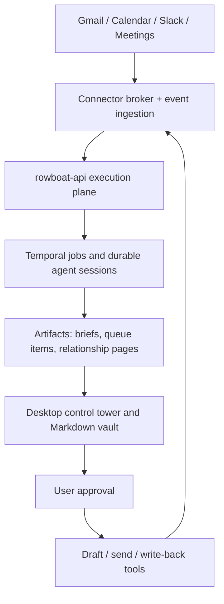

# RFC 029: Founder Operating Memory and Control Tower

|                  |                                                                                                                                                                                                                                                                                                                                                                                                                             |
| ---------------- | --------------------------------------------------------------------------------------------------------------------------------------------------------------------------------------------------------------------------------------------------------------------------------------------------------------------------------------------------------------------------------------------------------------------------- |
| **RFC**          | 029                                                                                                                                                                                                                                                                                                                                                                                                                         |
| **Status**       | Draft                                                                                                                                                                                                                                                                                                                                                                                                                       |
| **Track**        | Product strategy - wedge, jobs, and productization                                                                                                                                                                                                                                                                                                                                                                          |
| **Owners**       | `apps/x` desktop experience, `apps/rowboat-api` execution plane, `apps/rowboatx` next control-tower UI                                                                                                                                                                                                                                                                                                                      |
| **Created**      | 2026-06-26                                                                                                                                                                                                                                                                                                                                                                                                                  |
| **Last updated** | 2026-06-26                                                                                                                                                                                                                                                                                                                                                                                                                  |
| **Depends on**   | [RFC 006](./complete-006-desktop-cloud-control-plane.md), [RFC 010](./complete-010-rowboat-api-service-plane.md), [RFC 012](./012-connector-suite-and-consent-broker.md), [RFC 014](./014-live-note-observability-cost-and-provenance.md), [RFC 021](./complete-021-semantic-memory-index.md), [RFC 027](./complete-027-durable-agent-runtime.md)                                                                           |
| **Related**      | [RFC 016](./016-app-family-consolidation.md), [RFC 023](./023-closed-loop-actions.md), [RFC 028](./028-declarative-agent-definitions.md), [email-013](./email-013-meeting-briefs-and-relationship-context.md), [email-014](./email-014-sync-reliability-rate-limits-and-repair.md), [email-016](./email-016-email-evaluation-and-quality-gates.md), [email-017](./email-017-onboarding-permissions-and-feature-adoption.md) |
| **Supersedes**   | none                                                                                                                                                                                                                                                                                                                                                                                                                        |

## Main point

**Rowboat should be built and sold as the founder/operator control tower that prevents critical follow-ups, meeting context, relationship memory, and commitments from slipping across email, calendar, meetings, Slack, and notes.**

The agent builder, knowledge graph, MCP layer, model gateway, and Temporal runtime are infrastructure. They matter because they make the product promise credible, but they are not the wedge. The wedge is simpler and sharper:

> Connect the work sources. Rowboat tells you what changed, what matters today, who needs a response, what was promised, and what action is ready for approval.

This RFC turns that positioning into a product surface and build order.

## Summary

Rowboat already has enough substrate to become a live operating memory: a local Markdown vault, Gmail/calendar/meeting ingestion, live notes, semantic memory, background tasks, connector OAuth, an LLM gateway, Temporal-backed jobs, durable agent sessions, and approval primitives. The product problem is not missing infrastructure. The product problem is focus.

The near-term product should not lead with "build agents" or "AI knowledge graph." It should lead with a concrete operator outcome: **never walk into a meeting cold, never forget a high-value follow-up, never lose the thread on an important person, customer, investor, vendor, or project.**

This RFC defines the first opinionated product layer over the existing runtime:

1. **Daily Founder Brief** - what matters today, sourced from calendar, email, meetings, Slack, and active notes.
2. **Follow-Up Queue** - unanswered asks, stale commitments, waiting-on threads, and draftable next actions.
3. **Relationship and Deal Memory** - source-linked person/company/project pages kept current by jobs.
4. **Approval-Gated Action Queue** - draft emails, calendar actions, CRM/task updates, and other actions that require review.
5. **Reliability and Trust Surface** - every item has provenance, job state, and a repair path when sync or AI judgment fails.

## Current state

| Surface                          | What exists today                                                                                                                                                                  | Why it matters for this RFC                                                        |
| -------------------------------- | ---------------------------------------------------------------------------------------------------------------------------------------------------------------------------------- | ---------------------------------------------------------------------------------- |
| `apps/x`                         | Electron desktop app with local Markdown knowledge, Gmail/calendar/meeting sync, voice/meeting notes, live notes, scheduled agents, MCP/model plumbing, and background task views. | This is the daily-driver surface for founder/operator memory.                      |
| `apps/x/LIVE_NOTE.md`            | Live notes can refresh on cron, time windows, events, or manual runs.                                                                                                              | Live notes are the primitive for relationship, deal, project, and topic awareness. |
| `apps/rowboat-api`               | Go service plane for billing/credits, LLM gateway, vendor proxies, WorkOS auth, Google/Slack OAuth, connector OAuth, background tasks, event ingestion, and agents.                | This is the always-on execution and connector plane.                               |
| `apps/rowboat-api/cmd/worker`    | Temporal worker for API-native background tasks, cloud-event routing, durable agent sessions, and agent tools.                                                                     | This lets Rowboat run critical jobs while the desktop is closed.                   |
| `apps/rowboat-api/cmd/scheduler` | API-owned scheduler and Google watch manager.                                                                                                                                      | This supports reliable scheduled and event-driven runs.                            |
| `apps/rowboat`                   | Older hosted agent-builder product with workflows, RAG ingestion, scheduled/recurring job rules, and widget surfaces.                                                              | Useful infrastructure and reference surface, but not the primary wedge.            |
| `apps/rowboatx`                  | Next.js UI shell with artifact, task, queue, tool, conversation, and editor components.                                                                                            | Good candidate for the next control-tower UI.                                      |

The repository already contains product one-pagers that describe Rowboat as a local-first AI coworker and Markdown knowledge graph. This RFC narrows the product point: the graph exists to make founder/operator follow-through reliable.

## Market signal

Public complaints from founders, sellers, and operators cluster around follow-through and context fragmentation, not around a desire to configure more agents:

| Signal                                                                                                 | Representative source                                                                                                                                                                                                                          | Product implication                                                                  |
| ------------------------------------------------------------------------------------------------------ | ---------------------------------------------------------------------------------------------------------------------------------------------------------------------------------------------------------------------------------------------- | ------------------------------------------------------------------------------------ |
| Founders lose deals because follow-up is late or forgotten.                                            | Reddit / r/SaaS: lost deals from not following up, even though the CRM had the data. <https://www.reddit.com/r/SaaS/comments/1rmb9km/i_lost_3_deals_in_one_month_because_i_didnt/>                                                             | Build a follow-up risk queue, not just a CRM sync.                                   |
| Indie founders build simple pipeline trackers after losing deals.                                      | Indie Hackers: "built a dead simple pipeline tracker after losing a deal because I forgot to follow up." <https://www.indiehackers.com/post/built-a-dead-simple-pipeline-tracker-after-losing-a-deal-because-i-forgot-to-follow-up-7dd824ba48> | The buyer wants enforcement of next action, not complex pipeline management.         |
| Sales users already connect AI to HubSpot, Gmail, Calendar, Granola, and Slack, but still need review. | Reddit / r/sales: AI workflows across sales tools, with hallucination caveats. <https://www.reddit.com/r/sales/comments/1tsscv6/account_executives_how_do_you_use_ai_in_your/>                                                                 | Rowboat should combine context and draft action, then ask for approval.              |
| Customer-facing teams complain CRMs are admin systems, not working memory.                             | Reddit / r/CustomerSuccess: CRM work duplicates email, calls, and Slack. <https://www.reddit.com/r/CustomerSuccess/comments/1p8nf8b/does_anyone_else_feel_like_their_crm_is_built_for/>                                                        | Rowboat should sit where work happens and write back selectively.                    |
| Operators are already making daily briefs over calendars, issues, and important emails.                | Hacker News thread on AI-generated morning/evening briefings. <https://news.ycombinator.com/item?id=47783940>                                                                                                                                  | Daily brief is an obvious wedge and retention loop.                                  |
| Security concerns rise when agents read email, calendar, and Slack.                                    | Hacker News discussion on risks of agents over private work data. <https://news.ycombinator.com/item?id=47479962>                                                                                                                              | Local-first, provenance, scoped connectors, and approval gates are product features. |

The core buyer language should be:

- "What do I need to know before today starts?"
- "Who am I about to disappoint?"
- "Which deal, customer, investor, or project is going stale?"
- "What changed since I last looked?"
- "What action can I safely approve in one click?"

## Product thesis

Rowboat becomes the **operating memory for founder-led work**:

- It observes the work stream: email, calendar, meetings, Slack, notes, and eventually CRM/task systems.
- It maintains source-linked memory: people, companies, projects, decisions, asks, commitments, risks, and follow-ups.
- It runs jobs continuously: daily briefs, event-triggered updates, stale-thread detection, meeting prep, and relationship refresh.
- It proposes actions: reply drafts, calendar nudges, task/CRM write-backs, and escalations.
- It keeps humans in the loop: every external or destructive action is reviewable and auditable.

The phrase "founder operating memory" should be understood as the wedge, not the ceiling. The same primitives can later serve EAs, sales operators, customer success, consultants, finance operators, and enterprise assistants.

## Personas

| Persona                                 | Acute pain                                                                                             | First product promise                                                            |
| --------------------------------------- | ------------------------------------------------------------------------------------------------------ | -------------------------------------------------------------------------------- |
| Founder-led sales                       | Many conversations, informal commitments, weak CRM hygiene, high opportunity cost of missed follow-up. | "Your follow-up queue catches the deals you are about to lose."                  |
| EA / chief of staff                     | Needs cross-source briefing and context continuity across exec meetings.                               | "Every meeting has a concise brief and source trail."                            |
| Solo consultant / professional operator | Client work spans email, meetings, docs, invoices, and private notes.                                  | "Your client memory stays current without sacrificing data ownership."           |
| AE / sales operator                     | Deal context lives across CRM, email, calls, Slack, and notes.                                         | "Rowboat finds stale next steps and drafts the work back into your daily tools." |

## Goals

- Make the first screen and onboarding converge on a **control tower**, not a blank chat.
- Ship a useful first brief within 10 minutes of connecting Gmail and Calendar.
- Detect and rank follow-up risks from source data, with explainable evidence.
- Keep person, company, project, and deal pages up to date with source-linked memory.
- Make all AI-generated claims traceable to email, meeting, calendar, Slack, note, or web source.
- Make action proposals safe by default: draft first, approve before send/write, record audit trail.
- Reuse the existing background task and agent infrastructure instead of creating a separate product runtime.

## Non-goals

- Replacing the user's CRM in the first release.
- Fully autonomous sending, money movement, or external writes without approval.
- A generic agent marketplace as the primary user-facing product.
- A broad enterprise knowledge platform before the founder/operator wedge is working.
- Making `apps/rowboat` the primary GTM surface for this wedge. It remains useful infrastructure and reference code.

## Product surface

### 1. Daily Founder Brief

The daily brief is the retention loop. It should answer:

- What is on my calendar today?
- Which meetings need context?
- Which people or companies have important recent changes?
- Which open loops are stale?
- Which emails or Slack messages require a response?
- Which decisions or commitments need attention?

The brief should be short, source-linked, and action-oriented. It is not a newsletter. It is a triage artifact.

### 2. Follow-Up Queue

The follow-up queue is the mission-critical object. It contains:

- Waiting-on-me threads.
- Waiting-on-them threads.
- Stale deals or projects.
- Unanswered direct asks.
- Commitments extracted from meetings.
- Draftable next actions.

Every queue item needs:

- Source evidence.
- Confidence and reason.
- Suggested next action.
- Owner and due date if inferable.
- Dismiss, snooze, mark handled, and approve draft actions.

### 3. Relationship and Deal Memory

Rowboat should maintain living pages for:

- People.
- Companies.
- Deals / opportunities.
- Projects.
- Investors.
- Vendors.
- Customers.

Each page should show:

- Last touch.
- Open loops.
- Current context.
- Promises made.
- Recent changes.
- Relevant source trail.
- Suggested next action.

This maps naturally to live notes: a relationship or deal page is a live note with event criteria and scheduled refresh.

### 4. Meeting Lifecycle

A meeting should have a loop:

1. Pre-brief before the meeting.
2. Live or imported notes during/after the meeting.
3. Action extraction after the meeting.
4. Follow-up drafts.
5. Relationship/deal page update.
6. Future brief uses the updated memory.

This is the clearest "memory compounds" story in the product.

### 5. Approval-Gated Action Queue

Actions should start conservative:

- Draft email reply.
- Draft follow-up.
- Draft meeting recap.
- Draft scheduling note.
- Create task.
- Update CRM note or field.
- Add calendar hold.
- Post Slack summary.

The model proposes. The user approves. The system logs source, rationale, diff, tool call, and result.

## Background job portfolio

| Job                         | Trigger                       | Inputs                                                          | Output                               | Execution target                 | Success signal                                         |
| --------------------------- | ----------------------------- | --------------------------------------------------------------- | ------------------------------------ | -------------------------------- | ------------------------------------------------------ |
| Daily Founder Brief         | Cron / morning window         | Calendar, important email, Slack, active notes, meetings        | `Daily Brief` artifact               | API if enabled, desktop fallback | Brief opened and at least one action taken.            |
| Follow-Up Sweeper           | Cron + event                  | Gmail/Slack threads, meeting action items, CRM/task refs        | Follow-up queue items                | API                              | User approves, snoozes, or dismisses items.            |
| Meeting Pre-Brief           | Calendar event window         | Attendees, prior emails, previous meetings, notes, web optional | Meeting brief                        | Desktop/API                      | Brief viewed before meeting.                           |
| Post-Meeting Processor      | Meeting note created/imported | Transcript/notes, calendar event, attendees                     | Actions, recap, relationship updates | Desktop first, API later         | Follow-up draft approved or page updated.              |
| Relationship Refresh        | Event + scheduled             | Person/company related events and notes                         | Updated live page                    | API/Desktop                      | Page has recent source-linked state.                   |
| Deal/Customer Risk Monitor  | Event + daily                 | Email, Slack, meetings, CRM refs                                | Risk item and next action            | API                              | User catches stale or risky account before escalation. |
| Knowledge Graph Maintenance | Idle / nightly                | Markdown vault, metadata, embeddings                            | Dedupe, backlinks, summaries, index  | Desktop local                    | Search quality and brief citation quality improve.     |
| Connector Health and Repair | Scheduler                     | OAuth tokens, watch state, sync cursors                         | Health alerts and repair tasks       | API                              | No silent sync failure.                                |

## Architecture direction

### Boundary decisions

1. **Desktop remains the trust anchor.** The local Markdown vault is the user's inspectable memory and the strongest privacy differentiator.
2. **`rowboat-api` owns always-on execution.** Jobs that must run while the laptop is closed should use the API scheduler, Temporal worker, event routing, and connector broker.
3. **`apps/rowboatx` can become the next control-tower UI.** Its artifact, task, queue, tool, and conversation components are closer to the required interaction model than a blank chat.
4. **`apps/rowboat` is not the wedge.** The hosted visual agent builder remains a platform surface, but the founder/operator product should not depend on users building workflows from scratch.
5. **Agent definitions are implementation detail for most users.** RFC 028 matters for shipping first-party jobs and advanced customization, but the first product path should expose "briefs, queues, relationships, approvals" rather than YAML or graph nodes.

## Metrics

### Activation

- Time to first useful brief: target under 10 minutes after Gmail + Calendar connect.
- Percent of new users who view first brief on day 0.
- Percent of new users who approve/snooze/dismiss at least one follow-up queue item on day 0.

### Retention

- Daily brief open rate.
- Weekly active follow-up queue usage.
- Number of active live relationship/deal pages per user.
- Number of source-linked queue items acted on per week.

### Quality

- Unsourced claim rate in briefs and queue items.
- False positive follow-up rate.
- False negative follow-up rate from labeled review.
- Draft acceptance/edit rate.
- Connector silent-failure count.

### Trust

- Percent of generated items with source links.
- Action proposal approval rate.
- Approval reversal/undo rate.
- Job failures surfaced with actionable repair steps.

## Implementation plan

### WP0 - Product consolidation

- Rename the internal wedge around "Founder Operating Memory" or "Founder Control Tower."
- Update first-run copy and docs so the user lands on a brief/follow-up outcome, not a generic chat.
- Choose one primary product path: desktop-first, cloud-assisted when connected.
- Inventory which current `apps/rowboat` job-builder capabilities should migrate into `rowboat-api` or remain platform-only.

### WP1 - Daily Founder Brief MVP

- Build a first-party daily brief job definition.
- Inputs: today's calendar, recent important email, meeting notes, active live notes, and optionally Slack.
- Output: concise artifact with source links and action suggestions.
- UI: brief as the home/control-tower artifact, with queue extraction.
- Gate: first useful brief within 10 minutes for a fresh connected account.

### WP2 - Follow-Up Queue

- Define a `FollowUpItem` shape with source refs, confidence, reason, suggested action, status, snooze, and dismissal.
- Add detectors for direct asks, unanswered threads, waiting-on-them, stale deals/projects, and meeting action items.
- Add approval-ready draft generation for safe email follow-up.
- Gate: users can clear the queue without opening raw email.

### WP3 - Relationship and Deal Pages

- Add first-party live-note templates for person, company, deal, project, investor, vendor, and customer.
- Route relevant events to the right page.
- Show last touch, open loops, current context, recent changes, and next action.
- Gate: the next meeting brief pulls from these pages and visibly improves.

### WP4 - Reliability and observability

- Use RFC 014-style run history for briefs, queue jobs, and relationship refresh jobs.
- Surface connector health, sync age, watch renewal status, and failed job repair actions.
- Add labeled eval fixtures for brief quality and follow-up detection.
- Gate: no critical queue/brief job fails silently.

### WP5 - Approval-gated actions

- Start with draft-only Gmail actions.
- Add one-click approve/edit/reject.
- Record provenance: source item, prompt/run id, tool call, edited diff, and result.
- Later add CRM/task/calendar write-back behind the same approval model.
- Gate: action approval feels faster than manual follow-up.

### WP6 - GTM and packaging

- Publish a tight wedge page and demo around "never lose a deal because you forgot to follow up."
- Create templates: Founder Daily Brief, Investor Follow-Up, Customer Risk, Hiring Pipeline, Vendor/Finance Review.
- Price around active operator seats plus always-on jobs/connectors, with usage transparency for LLM-heavy work.

## Decisions

1. **The control tower is the home surface.** Chat is available, but the app should open to a brief, queue, and relationship context.
2. **Follow-up is the first mission-critical problem.** It is urgent, concrete, and tied to revenue and reputation.
3. **Every claim needs provenance.** A brief without source links is not acceptable for this category.
4. **Draft before action.** External writes are approval-gated until the product proves reliability.
5. **Local-first remains a differentiator.** The cloud runtime exists to run jobs and broker connectors, not to erase the user's owned memory layer.
6. **Builder features are secondary.** First-party jobs and templates should cover the wedge before exposing broad agent construction.

## Risks and mitigations

| Risk                                      | Why it matters                                         | Mitigation                                                                                     |
| ----------------------------------------- | ------------------------------------------------------ | ---------------------------------------------------------------------------------------------- |
| The product becomes too broad again.      | "AI coworker" can mean anything.                       | Keep the first release scoped to briefs, follow-ups, relationships, and approvals.             |
| False positives create queue fatigue.     | A bad queue becomes another inbox.                     | Confidence labels, easy dismiss/snooze, learning from corrections, and eval gates.             |
| False negatives break trust.              | Missing one critical follow-up undermines the promise. | Conservative detection, daily digest of uncertainty, and source-review workflows.              |
| Hallucinated context hurts relationships. | Founder/sales communication is high-stakes.            | Source-linked claims, quoted evidence snippets, draft-first actions.                           |
| Connector failures are invisible.         | The product depends on fresh data.                     | Connector health, sync age, watch renewal, repair jobs, and visible warnings.                  |
| Cloud/local split confuses users.         | Privacy trust depends on a clear model.                | Explain which jobs run locally, which run in API, and why. Make cloud optional where possible. |

## Open questions

- Should Slack be part of the default first-run path, or should Gmail + Calendar ship first?
- Which CRM should get the first write-back path: HubSpot, Salesforce, or a generic CSV/API note export?
- Should `apps/rowboatx` become the control tower, or should the existing `apps/x` renderer evolve first?
- What is the minimum relationship entity model required before RFC 022's full unified entity graph?
- How much of the follow-up detector should be local-only for privacy-sensitive users?

## Acceptance criteria

- A user can connect Gmail + Calendar and receive a useful daily brief in under 10 minutes.
- The brief includes at least three source-linked items when relevant source data exists.
- The follow-up queue can identify unanswered asks and stale waiting-on threads with visible source evidence.
- A relationship or deal page can be made live and kept current by events or schedule.
- A draft follow-up can be generated, edited, approved, and recorded with provenance.
- Job health is visible: last run, next run, failure reason, and repair action.
- The product home communicates the control-tower promise without requiring the user to understand agents, MCP, YAML, or Temporal.
