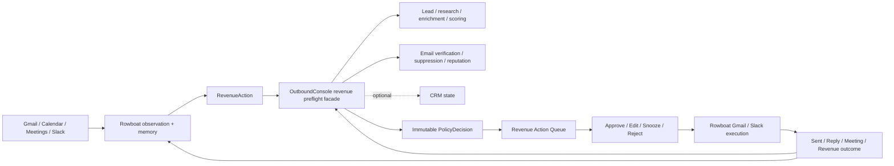
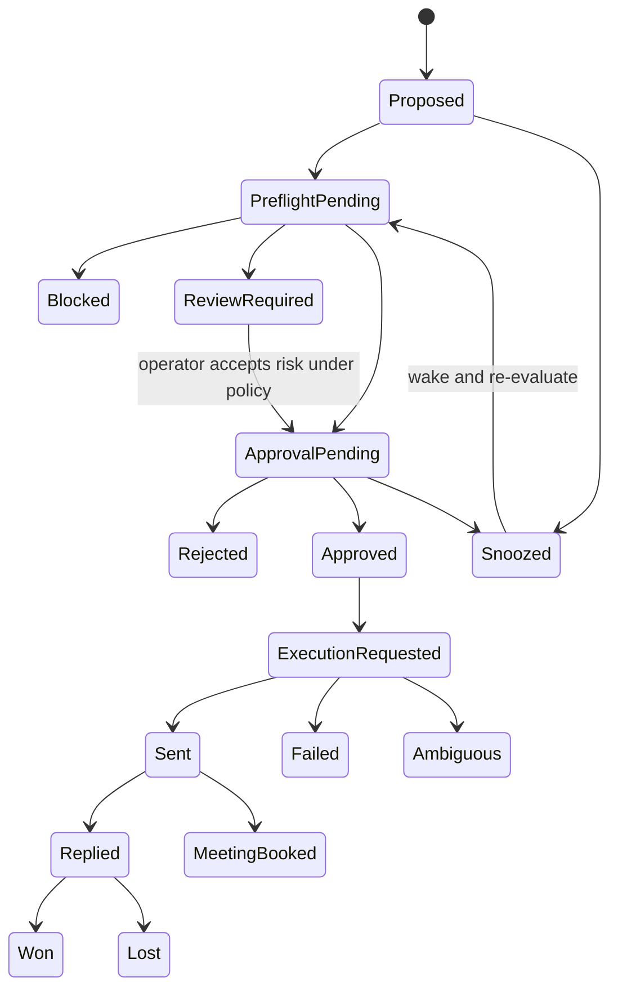

# RFC 030: Revenue Memory and Outbound Governance Integration

|                  |                                                                                                                                                                                                                                                                                                                                                                                                                                                                                                                                                               |
| ---------------- | ------------------------------------------------------------------------------------------------------------------------------------------------------------------------------------------------------------------------------------------------------------------------------------------------------------------------------------------------------------------------------------------------------------------------------------------------------------------------------------------------------------------------------------------------------------- |
| **RFC**          | 030                                                                                                                                                                                                                                                                                                                                                                                                                                                                                                                                                           |
| **Status**       | Draft                                                                                                                                                                                                                                                                                                                                                                                                                                                                                                                                                         |
| **Track**        | Product integration - warm revenue recovery, relationship memory, and governed execution                                                                                                                                                                                                                                                                                                                                                                                                                                                                      |
| **Owners**       | `rowboat/apps/rowboat-api` (memory, recommendations, approval, orchestration) · `oppulence-paperless-backend/services/lead-scraper-service` (commercial records, research, enrichment, governance facade) · `paperless-check-if-email-exists/backend` (verification, suppression, reputation, hygiene)                                                                                                                                                                                                                                                        |
| **Created**      | 2026-07-12                                                                                                                                                                                                                                                                                                                                                                                                                                                                                                                                                    |
| **Last updated** | 2026-07-12                                                                                                                                                                                                                                                                                                                                                                                                                                                                                                                                                    |
| **Depends on**   | [RFC 003](./complete-003-cloud-event-ingestion.md), [RFC 011](./complete-011-identity-and-authorization-plane.md), [RFC 012](./012-connector-suite-and-consent-broker.md), [RFC 022](./022-unified-entity-graph.md), [RFC 023](./023-closed-loop-actions.md), [RFC 029](./029-founder-operating-memory.md), `oppulence-paperless-backend/services/lead-scraper-service/docs/rfcs/RFC-029-origami-style-research-results-api.md`, `oppulence-paperless-backend/services/lead-scraper-service/docs/rfcs/RFC-030-sales-prospecting-research-operating-system.md` |
| **Related**      | [RFC 013](./013-oppulence-product-connector-fabric.md), [RFC 014](./014-live-note-observability-cost-and-provenance.md), [email-004](./email-004-reply-zero-and-drafting.md), [email-013](./email-013-meeting-briefs-and-relationship-context.md), [email-015](./email-015-email-privacy-security-and-governance.md), [email-016](./email-016-email-evaluation-and-quality-gates.md), [email-019](./email-019-multi-account-organizations-and-team-boundaries.md)                                                                                             |
| **Supersedes**   | none; specializes RFC 023 for customer-facing revenue actions                                                                                                                                                                                                                                                                                                                                                                                                                                                                                                 |

## Main point

Rowboat, OutboundConsole, and the email-verification backend should become one customer-facing **Revenue Memory and Execution OS** without becoming one repository, one process, or one database.

The product loop is:

> Observe → Remember → Prioritize → Verify → Govern → Approve → Act → Learn

The first product wedge is warm revenue recovery:

> Turn forgotten relationships into pipeline without risking the customer's reputation.

Rowboat remembers the relationship and proposes the next action. OutboundConsole resolves and enriches the commercial record and returns one evidence-backed preflight decision. The email-verification backend supplies verification, suppression, reputation, and hygiene signals behind OutboundConsole. The operator approves or edits the action. Rowboat executes the first Gmail-based actions and records the result. Replies, meetings, and CRM outcomes update the relationship memory.

The customer sees one action queue. The services retain independent ownership and deployment.

## Why this RFC exists

[RFC 029](./029-founder-operating-memory.md) defines the founder/operator control-tower wedge: briefs, follow-ups, relationship memory, and approval-gated actions. [RFC 023](./023-closed-loop-actions.md) defines a generic propose → approve → execute → watch loop. The OutboundConsole repositories now contain concrete capabilities that make the revenue version of that loop materially stronger:

- `lead-scraper-service` already owns workspaces, leads, research sessions, enrichment, evidence, confidence, scoring, workflows, lists, webhooks, and verification orchestration.
- `paperless-check-if-email-exists` already owns single and bulk email verification, history, suppression, reputation checks, source-quality analytics, outcomes, and scheduled hygiene pipelines.
- `rowboat-api` already owns Gmail/Calendar/Slack ingestion, Temporal workflows, durable agents, LLM tools, artifacts, human approvals, and approval-gated Gmail/Slack actions.

Without an explicit integration contract, each product is likely to reimplement the other's data model or expose a fragile chain of low-level calls. This RFC assigns ownership, defines the shared revenue-action contract, and chooses one orchestration path.

## Business thesis: plausible venture scale, not assumed

This can become a billion-dollar company, but the valuation is an outcome to earn rather than an architecture assumption. A simple bundle of Rowboat and OutboundConsole is not the thesis. The thesis is a control plane that remembers commercial relationships, identifies the highest-value safe next action, governs execution, and learns from revenue outcomes.

Adjacent categories demonstrate that customers fund large systems of record and execution when those systems own durable workflow and context:

- [Clay reported a $5 billion valuation and $100 million ARR](https://www.clay.com/blog/tender-offer-2026) in data enrichment and outbound workflows.
- [Apollo reports more than $150 million ARR](https://www.apollo.io/our-story) in sales intelligence and engagement.
- [Glean reported more than $300 million ARR](https://www.glean.com/press/glean-surpasses-300m-arr-unrivaled-enterprise-context-fuels-ai-adoption) in enterprise context and AI.
- [Granola reported a $1.5 billion valuation](https://www.granola.ai/blog/series-c) around meeting context and organizational memory.

Those companies validate adjacent budgets, not product-market fit for this product. A plausible path to $100 million ARR is 4,000 organizations at a $25,000 blended annual contract, or 10,000 organizations at $10,000. These are scale tests, not forecasts. Pricing should combine a platform fee with seats, monitored relationships, verification, and governed execution; it should not primarily reward email volume.

The defensible asset is the longitudinal graph connecting:

> source evidence → relationship history → commitment → recommended action → policy decision → human edit → execution → reply, meeting, and revenue outcome

Message generation and scraped contacts are commodities. The moat must come from permissioned relationship history, outcome learning, approval behavior, policy configuration, deliverability telemetry, and deep workflow integration.

Before expanding into mass cold outbound, the warm-revenue wedge must pass these product gates with the initial 5-50 employee B2B ICP:

1. Connected workspaces repeatedly surface missed commitments or dormant relationships that users recognize as real revenue opportunities.
2. Teams review the queue weekly after the initial scan rather than treating it as a one-time audit.
3. Approved or edited actions create attributable replies, meetings, reopened opportunities, or recovered revenue worth materially more than the annual contract.
4. Evidence coverage remains high, false-positive dismissals trend down, and hard suppression or cross-workspace safety violations remain zero.
5. Customers expand from the founder's mailbox to team workflows, policy, audit, CRM, and controlled execution.

Failure to achieve retention and attributable recovered pipeline should stop expansion into a broad outbound platform, regardless of adjacent market valuations.

## Current state

### Rowboat

| Capability         | Current implementation                                                                                                                   |
| ------------------ | ---------------------------------------------------------------------------------------------------------------------------------------- |
| Identity           | WorkOS user identity, optional `workos_org_id`, actor scopes/permissions, recent-auth and MFA policy in `apps/rowboat-api/internal/auth` |
| Source observation | Gmail, Calendar, Drive, Slack, generic webhook, and internal events through `CloudEvent` and Google watch infrastructure                 |
| Always-on work     | API scheduler, Temporal schedules, cloud-event routing, background-task runtime, and durable agent sessions                              |
| Evidence artifacts | Task artifacts, run history, event streams, source-linked cloud events, and sealed provider payloads                                     |
| Human control      | Durable agent approvals, step-up for sensitive actions, approval-token binding, edit/reject paths                                        |
| Initial execution  | Gmail draft/send, Calendar create/update, Drive update, Slack reply, and allowlisted MCP tools                                           |

Rowboat does **not** yet have durable revenue relationships, commitments, a revenue-action queue, an OutboundConsole workspace mapping, or a cross-product preflight/outcome contract.

### OutboundConsole lead-scraper service

The live protobuf surface in `api-definitions/api/lead-scraper-service/protobuf/lead_scraper_service/v1` includes:

- tenants, organizations, workspaces, accounts, API keys, and subscriptions;
- leads, lead notes, activities, timelines, lists, saved searches, and analytics;
- enrichment, verification quotas, email re-verification, score rules, and score history;
- research sessions, streamed rows, row detail, field evidence/confidence, cell retry, and expansion;
- workflows and webhooks.

The service already contains a Reacher client in `services/lead-scraper-service/pkg/reacher`. It should remain the only product-facing service that composes research/enrichment and Reacher verification for this workflow.

CRM integration is designed in the lead-scraper RFC set, but this RFC does not assume a production CRM connector until the corresponding implementation and deployment are verified. CRM state in the first release is optional and explicitly reported as `unknown` when unavailable.

### Email-verification backend

The live OpenAPI contract in `paperless-check-if-email-exists/backend/openapi.json` includes:

- `/v1/check_email` and bulk verification jobs;
- `/v1/emails/{email}/history`;
- `/v1/suppressions` and `/v1/suppressions/check`;
- `/v1/reputation/check`;
- `/v1/sources/quality`;
- `/v1/outcomes`;
- scheduled verification pipelines and run history.

The verification service is a specialist dependency. Rowboat does not call it directly in the product workflow; `lead-scraper-service` calls it and returns a composed policy decision.

### Known cross-repository contract gaps

The current repositories are connected, but they do not yet expose the complete revenue preflight contract described by this RFC:

1. `lead-scraper-service` pins the generated Go verification SDK at `github.com/Oppulence-Engineering/check-if-email-exists/sdks/golang v0.2.0`. The integration must pin a reviewed OpenAPI version, regenerate the SDK, and upgrade the facade deliberately rather than hand-copying response fields.
2. `StartBulkVerification` currently sends only the email input list. It does not propagate the stable `source_key` or a cross-service idempotency key required to attribute a verification run to a revenue action.
3. The verification runtime injects `recommendation` and `policy_evaluation` into the response, but `CheckEmailOutput` in the checked-in OpenAPI document does not declare those fields. Generated clients therefore cannot safely depend on them until the specification and SDK are synchronized.
4. The runtime decision is currently evaluated in `deliverability` mode with no policy profile, `active_suppression=false`, and `previous_hard_bounce=false`. Those defaults are not a complete commercial-send decision. The OutboundConsole facade must explicitly compose verification, verification history, active suppression, bounce history, sender/domain reputation, workspace exclusions, and action policy into one immutable preflight response.
5. Rowboat's existing `CloudEvent` contract is user-scoped and does not yet require the organization/workspace, correlation, causation, or cross-service idempotency fields needed for a shared revenue lifecycle. Revenue integration events need a versioned envelope and new allowlisted sources for OutboundConsole and email-quality projections.

These are contract migrations, not reasons to merge repositories or databases.

### Licensing boundary

`paperless-check-if-email-exists` is distributed under a dual commercial/AGPL-3.0 model. Before production distribution or proprietary embedding, the deployment owner must record either the applicable commercial entitlement or an approved AGPL-compatible deployment decision. The specialist verification service should remain behind a network API boundary, and legal review must be complete before the revenue integration is enabled for customers.

## Goals

1. Present one source-linked Revenue Action Queue across Rowboat and OutboundConsole capabilities.
2. Detect warm revenue leaks from email, calendar, meetings, Slack, and optional CRM state.
3. Resolve each relationship against the canonical OutboundConsole lead/workspace when possible.
4. Verify contactability, suppression, enrichment freshness, duplicate ownership, and optional CRM state before approval.
5. Bind every approval and execution to the exact action revision that passed preflight.
6. Execute the first approved actions through Rowboat's connected Gmail/Slack tools.
7. Feed sent, replied, meeting-booked, won, lost, dismissed, and bad-recommendation outcomes back into OutboundConsole and relationship memory.
8. Make retries idempotent across every service boundary.
9. Preserve independent repositories, schemas, deployments, and operational ownership.

## Non-goals

1. Merging the repositories or databases.
2. Rebuilding lead research, enrichment, verification, suppression, or hygiene inside `rowboat-api`.
3. Copying raw Rowboat email bodies or meeting transcripts into OutboundConsole by default.
4. Replacing HubSpot, Salesforce, Pipedrive, or another CRM as opportunity authority.
5. Building mass cold outbound or an autonomous sequencer in the first release.
6. Allowing both Rowboat and OutboundConsole to execute the same action.
7. Exposing Reacher directly to Rowboat clients.
8. Treating an LLM-generated recommendation as sufficient evidence or policy approval.
9. Making a broad research session mandatory for a known warm relationship; targeted resolve/enrich is the default.

## Product boundary

| Domain                                 | System of record                            | Notes                                                                          |
| -------------------------------------- | ------------------------------------------- | ------------------------------------------------------------------------------ |
| Human identity                         | WorkOS                                      | Shared external identity; services maintain local projections                  |
| Commercial organization/workspace      | OutboundConsole                             | Rowboat stores a mapping, not a second commercial workspace model              |
| Enriched lead/account profile          | OutboundConsole                             | Includes research, evidence, confidence, score, lists, and commercial activity |
| Email verification/suppression/hygiene | Email-verification backend                  | Accessed through OutboundConsole's facade                                      |
| Personal communication evidence        | Rowboat                                     | Email/calendar/meeting/Slack evidence remains local or sealed in Rowboat       |
| Relationship memory and commitments    | Rowboat                                     | Longitudinal context, open loops, promises, last touch, next action            |
| Revenue-action recommendation          | Rowboat                                     | Reason, evidence, message proposal, priority, and queue lifecycle              |
| Policy/preflight decision              | OutboundConsole                             | Immutable snapshot returned for one exact action revision                      |
| Initial Gmail/Slack execution          | Rowboat                                     | Approval-gated; one execution owner per action                                 |
| Future sequence/sender execution       | OutboundConsole                             | Deferred until a production sending plane exists                               |
| Opportunity stage                      | CRM                                         | Pulled or linked when connector availability is confirmed                      |
| Closed-loop outcome                    | Rowboat record; reported to OutboundConsole | Each service updates its own learning/analytics projection                     |

Neither service may query another service's tables.

## Architecture



### Service call direction

The normal path is:

```text
rowboat-api
  -> lead-scraper-service revenue facade
       -> lead-scraper DAL/research/enrichment
       -> Reacher client
            -> paperless-check-if-email-exists
       -> optional CRM adapter
  <- one composed preflight decision
```

Rowboat must not fan out independently to lead research, verification, suppression, and CRM endpoints. The facade owns that composition and returns one versioned result.

## Canonical identifiers and workspace mapping

OutboundConsole's workspace is the canonical commercial tenant. Rowboat needs a small local mapping so authenticated WorkOS users can address it safely.

### `RevenueWorkspace`

```go
// apps/rowboat-api/ent/schema/revenue_workspace.go
field.String("workspace_id").Unique().NotEmpty() // Rowboat ULID/UUID
field.String("workos_org_id").Optional()
field.String("outbound_organization_id").NotEmpty()
field.String("outbound_workspace_id").Unique().NotEmpty()
field.String("status").Default("active") // active|disconnected|repair_required
field.Time("last_verified_at").Optional().Nillable()
```

### `RevenueWorkspaceMember`

```go
// apps/rowboat-api/ent/schema/revenue_workspace_member.go
edge.From("workspace", RevenueWorkspace.Type).Required().Unique()
edge.From("user", User.Type).Required().Unique()
field.String("role").Default("member") // owner|admin|member|viewer
field.String("outbound_account_id").Optional()
field.String("status").Default("active")
```

For a founder without a WorkOS organization, onboarding may create or link a personal OutboundConsole workspace. Team sharing requires an explicit workspace membership; matching email domains is never authorization.

The mapping is established by a server-to-server handshake that proves both sides of the link. Clients cannot submit arbitrary OutboundConsole workspace IDs and gain access.

## Rowboat revenue domain

### Relationship

`Relationship` is Rowboat's longitudinal memory object. It does not duplicate the complete OutboundConsole lead.

```go
field.String("relationship_id").Unique().NotEmpty()
edge.From("workspace", RevenueWorkspace.Type).Required().Unique()
field.String("kind") // person|company|customer|opportunity|referral|partner
field.String("display_name")
field.String("primary_email").Optional().Sensitive()
field.String("account_domain").Optional()
field.String("outbound_lead_id").Optional()
field.String("outbound_account_ref").Optional()
field.JSON("resource_refs", []string{})
field.Text("summary").Optional()
field.Time("last_touch_at").Optional().Nillable()
field.Time("next_action_at").Optional().Nillable()
field.String("status").Default("active") // active|dormant|closed|archived
```

`resource_refs` follows RFC 022 and may include CRM or OutboundConsole identifiers. Deterministic identifiers can propose a link, but an ambiguous match requires review.

### RevenueEvidence

Every recommendation and material claim must point to evidence.

```go
field.String("evidence_id").Unique().NotEmpty()
edge.From("workspace", RevenueWorkspace.Type).Required().Unique()
field.String("source") // gmail|calendar|meeting|slack|outbound|crm
field.String("source_account_id").Optional()
field.String("source_record_id").NotEmpty()
field.String("source_uri").Optional()
field.String("content_hash").NotEmpty()
field.Text("excerpt").Optional().Sensitive()
field.Bytes("payload_ciphertext").Optional().Sensitive()
field.Time("occurred_at")
field.Time("observed_at")
field.JSON("external_evidence_refs", []string{})
```

The excerpt is bounded and safe for the approval UI. Raw provider content remains sealed and is never included in cross-product requests unless a user explicitly invokes a workflow that permits it.

### Commitment

```go
field.String("commitment_id").Unique().NotEmpty()
edge.From("relationship", Relationship.Type).Required().Unique()
field.String("direction") // promised_by_me|promised_by_them|mutual
field.Text("text")
field.String("status").Default("open") // open|fulfilled|cancelled|superseded
field.Time("due_at").Optional().Nillable()
field.Float("confidence").Min(0).Max(1)
field.Bool("user_confirmed").Default(false)
```

A commitment has one or more evidence edges. LLM extraction creates an unconfirmed commitment; user edits or an explicit source statement may confirm it.

### RevenueAction

Do not encode every concern in one status. Store independent state dimensions:

```go
field.String("action_id").Unique().NotEmpty()
edge.From("workspace", RevenueWorkspace.Type).Required().Unique()
edge.From("relationship", Relationship.Type).Required().Unique()
field.String("action_type") // warm_follow_up|proposal_nudge|referral_reconnect|customer_risk|meeting_follow_up
field.String("channel")     // email|slack|call|crm_task
field.Int("revision").Default(1).Positive()
field.String("revision_hash").NotEmpty()
field.Text("reason")
field.Text("proposed_subject").Optional()
field.Text("proposed_message").Optional().Sensitive()
field.String("sender_account_ref").Optional()
field.UUID("assigned_user_id", uuid.UUID{}).Optional().Nillable()
field.Int("priority_score").Min(0).Max(100)
field.String("queue_status").Default("open")       // open|snoozed|dismissed|handled
field.String("policy_status").Default("pending")  // pending|passed|review_required|blocked|stale
field.String("approval_status").Default("pending") // pending|approved|rejected
field.String("execution_status").Default("pending") // pending|requested|sent|failed|ambiguous|cancelled
field.String("execution_owner").Default("rowboat") // rowboat|outbound
field.Time("snoozed_until").Optional().Nillable()
field.Time("due_at").Optional().Nillable()
field.Time("handled_at").Optional().Nillable()
```

An action has one or more evidence edges and a revision history. Every edit creates a new `RevenueActionRevision`, changes `revision_hash`, and invalidates the previous policy and approval state.

### PolicyDecisionSnapshot

```go
field.String("decision_id").Unique().NotEmpty()
edge.From("action", RevenueAction.Type).Required().Unique()
field.Int("action_revision").Positive()
field.String("revision_hash").NotEmpty()
field.String("status") // passed|review_required|blocked
field.String("outbound_lead_id").Optional()
field.JSON("verification", map[string]any{})
field.JSON("suppression", map[string]any{})
field.JSON("research", map[string]any{})
field.JSON("crm", map[string]any{})
field.JSON("reason_codes", []string{})
field.JSON("evidence_refs", []string{})
field.Time("evaluated_at")
field.Time("expires_at")
field.String("response_hash").NotEmpty()
```

Policy decisions are immutable. A new evaluation creates a new snapshot.

### ActionOutcome

```go
field.String("outcome_id").Unique().NotEmpty()
edge.From("action", RevenueAction.Type).Required().Unique()
field.String("kind") // sent|delivered|bounced|replied|meeting_booked|won|lost|dismissed|bad_recommendation
field.String("source") // gmail|calendar|crm|user|outbound
field.String("source_event_id").NotEmpty()
field.Time("occurred_at")
field.JSON("metadata", map[string]any{})
```

Outcomes are append-only and idempotent on `(action, source, source_event_id)`.

## OutboundConsole revenue facade

Add a narrow revenue integration service to the lead-scraper protobuf contract. It composes existing lead, evidence, enrichment, score, Reacher, workspace, and future CRM capabilities.

### RPCs

```proto
service RevenueIntegrationService {
  rpc ResolveRevenueParty(ResolveRevenuePartyRequest)
      returns (ResolveRevenuePartyResponse);

  rpc EvaluateRevenueAction(EvaluateRevenueActionRequest)
      returns (EvaluateRevenueActionResponse);

  rpc ReportRevenueActionOutcome(ReportRevenueActionOutcomeRequest)
      returns (ReportRevenueActionOutcomeResponse);
}
```

`ResolveRevenueParty` performs a targeted workspace-scoped lookup by known lead ID, email, domain, or CRM reference. It never runs broad cold discovery implicitly. When no lead exists, policy determines whether to create a minimal lead or return `not_found`.

### Evaluate request

```json
{
  "schemaVersion": "2026-07-12",
  "requestId": "req_01...",
  "idempotencyKey": "revenue-action:act_01:revision:3",
  "correlationId": "act_01",
  "outboundOrganizationId": "org_01...",
  "outboundWorkspaceId": "ws_01...",
  "actor": {
    "workosUserId": "user_01..."
  },
  "action": {
    "actionId": "act_01...",
    "revision": 3,
    "revisionHash": "sha256:...",
    "actionType": "warm_follow_up",
    "channel": "email",
    "recipient": {
      "outboundLeadId": "lead_01...",
      "email": "buyer@example.com",
      "accountDomain": "example.com"
    },
    "relationshipSignals": {
      "lastContactAt": "2026-04-10T15:00:00Z",
      "requestedFollowUpAt": "2026-07-01T00:00:00Z",
      "reasonCode": "requested_follow_up_due"
    }
  }
}
```

Only bounded relationship signals cross the boundary. Raw email bodies, transcripts, prompts, and complete Rowboat artifacts are forbidden fields.

### Evaluate response

```json
{
  "schemaVersion": "2026-07-12",
  "decisionId": "decision_01...",
  "requestId": "req_01...",
  "actionId": "act_01...",
  "revision": 3,
  "revisionHash": "sha256:...",
  "status": "passed",
  "outboundLeadId": "lead_01...",
  "verification": {
    "status": "safe",
    "verifiedAt": "2026-07-12T12:00:00Z",
    "expiresAt": "2026-08-11T12:00:00Z",
    "isCatchAll": false,
    "isRoleAccount": false
  },
  "suppression": {
    "blocked": false,
    "reason": null
  },
  "research": {
    "currentRoleConfirmed": true,
    "confidence": 0.94,
    "evidenceRefs": ["outbound:evidence:ev_01"]
  },
  "crm": {
    "status": "unknown",
    "existingCustomer": null,
    "openOpportunity": null,
    "ownerId": null
  },
  "reasonCodes": [],
  "evaluatedAt": "2026-07-12T12:00:00Z",
  "expiresAt": "2026-07-13T12:00:00Z"
}
```

### Decision rules

The initial policy is deterministic and configurable per OutboundConsole workspace:

| Condition                                           | Decision                                                               |
| --------------------------------------------------- | ---------------------------------------------------------------------- |
| Suppressed or opted out                             | `blocked`                                                              |
| Invalid/disposable address                          | `blocked`                                                              |
| Risky/catch-all/unknown verification                | `review_required`                                                      |
| Verification service unavailable                    | `pending`; fail closed, do not approve or send                         |
| Lead belongs to another workspace                   | `blocked` and security audit                                           |
| Known competitor or explicit exclusion              | `blocked`                                                              |
| Known open opportunity with another owner           | `review_required`                                                      |
| CRM unavailable                                     | Preserve `crm.status=unknown`; do not falsely pass CRM-specific checks |
| Safe verification, not suppressed, no blocking rule | `passed`                                                               |

The LLM may summarize evidence, but it may not override suppression, verification, ownership, or explicit policy rules.

### Reacher usage

`lead-scraper-service` calls its existing Reacher client. For persisted bulk/list verification and outcome reporting, it uses a stable source attribution such as:

```text
source_key = rowboat:<outbound_workspace_id>:<action_id>
```

The current single-check request does not carry `source_key`; synchronous preflight idempotency therefore remains in the OutboundConsole facade. It may use existing verification history when fresh. It checks suppression before execution and reports relevant outcomes through the existing outcome API. Rowboat never stores or manages a Reacher tenant API key.

## Oppulence API surface

| Method | Path                                      | Purpose                                                          |
| ------ | ----------------------------------------- | ---------------------------------------------------------------- |
| `POST` | `/v1/revenue-workspaces/link`             | Complete the server-verified OutboundConsole workspace link      |
| `GET`  | `/v1/revenue-workspaces/current`          | Return mapping and connector/preflight health                    |
| `POST` | `/v1/revenue-leak-scans`                  | Start a bounded historical scan                                  |
| `GET`  | `/v1/revenue-leak-scans/{scanId}`         | Return progress, counts, errors, and freshness                   |
| `GET`  | `/v1/relationships`                       | List relationship summaries and open-loop counts                 |
| `GET`  | `/v1/relationships/{relationshipId}`      | Relationship timeline, commitments, evidence, and actions        |
| `GET`  | `/v1/revenue-actions`                     | List/filter the action queue                                     |
| `GET`  | `/v1/revenue-actions/{actionId}`          | Return action, evidence, policy history, revisions, and outcomes |
| `POST` | `/v1/revenue-actions/{actionId}/evaluate` | Request/retry OutboundConsole preflight                          |
| `POST` | `/v1/revenue-actions/{actionId}/edit`     | Create a new revision and invalidate policy/approval             |
| `POST` | `/v1/revenue-actions/{actionId}/snooze`   | Snooze until a bounded timestamp                                 |
| `POST` | `/v1/revenue-actions/{actionId}/dismiss`  | Dismiss with a reason label                                      |
| `POST` | `/v1/revenue-actions/{actionId}/approve`  | Approve the current passed, unexpired revision                   |
| `POST` | `/v1/revenue-actions/{actionId}/reject`   | Reject with reason                                               |
| `POST` | `/v1/revenue-actions/{actionId}/execute`  | Execute exactly once through the assigned execution owner        |
| `GET`  | `/v1/revenue-actions/{actionId}/audit`    | Full observe → decision → approval → execution → outcome chain   |

The authenticated application may combine approve and execute as one UI action, but the server persists and validates the two state transitions independently.

## State machine and invariants



Hard invariants:

1. A `blocked` action cannot be approved or executed.
2. Approval is bound to `{action_id, revision, revision_hash, decision_id}`.
3. Editing recipient, sender account, assignee, channel, subject, message, or action type creates a new revision and invalidates the old policy and approval.
4. A decision must be `passed` or explicitly `review_required` under a workspace policy that allows a human override.
5. An expired decision must be re-evaluated before approval or execution.
6. Exactly one `execution_owner` may execute an action revision.
7. Execution uses an idempotency key derived from `{action_id, revision}`.
8. A provider timeout after submission produces `ambiguous`, not an automatic resend. Reconciliation checks Gmail/provider state first.
9. Suppression is checked again immediately before execution if the policy decision is older than the configured freshness window.
10. Outcomes are append-only and deduplicated by source event ID.
11. The sender connection must belong to the assigned user and linked workspace; a team member cannot substitute another member's mailbox after approval.

## Execution ownership

The first release assigns `execution_owner=rowboat` for Gmail and Slack actions because those approved tools already exist in `rowboat-api`. OutboundConsole's current research RFC treats direct sending as a non-goal.

Initial execution flow:

1. Rowboat verifies current workspace membership.
2. Rowboat loads the current action revision and unexpired decision.
3. Rowboat performs a final lightweight suppression/verification freshness check through the facade when required.
4. Rowboat consumes the approval atomically.
5. Rowboat invokes the connected Gmail/Slack tool with server-held credentials.
6. Rowboat stores provider message/thread ID and emits an outcome event.
7. Rowboat reports the outcome to OutboundConsole.

If OutboundConsole later gains production sequence/sender execution, the action may be created with `execution_owner=outbound`. The ownership value becomes immutable after approval. Migration does not allow both owners to attempt the same action.

## Integration events and delivery

Synchronous RPC gives the UI a fast answer, but durable state changes use transactional outbox/inbox delivery.

### Envelope

```json
{
  "eventId": "evt_01...",
  "eventType": "revenue.action.outcome.v1",
  "schemaVersion": 1,
  "organizationId": "org_01...",
  "workspaceId": "ws_01...",
  "actionId": "act_01...",
  "correlationId": "act_01...",
  "causationId": "evt_prior_01...",
  "idempotencyKey": "outcome:act_01:gmail:msg_01",
  "occurredAt": "2026-07-12T12:30:00Z",
  "payload": {}
}
```

### Required events

- `revenue.relationship.resolved.v1`
- `revenue.action.preflight_requested.v1`
- `revenue.action.preflight_completed.v1`
- `revenue.action.approved.v1`
- `revenue.action.execution_requested.v1`
- `revenue.action.sent.v1`
- `revenue.action.failed.v1`
- `revenue.action.outcome.v1`

Outbox rows are written in the same transaction as the local state change. Inbox rows claim `event_id` uniquely before applying a projection. Consumers must tolerate duplicate and out-of-order delivery.

## Service authentication and authorization

1. User bearer tokens are not forwarded from Rowboat to OutboundConsole as service credentials.
2. Rowboat calls the facade with a short-lived service token whose audience is the lead-scraper service and whose scopes are limited to `revenue:resolve`, `revenue:preflight`, or `revenue:outcome`.
3. The service token includes a bounded service identity, token ID, issuer, expiry, and no raw user secrets.
4. OutboundConsole authorizes the supplied organization/workspace against the server-verified workspace link and records the end-user actor for audit.
5. Callbacks/events are authenticated with an audience-bound service token or timestamped HMAC. Static query-string secrets are forbidden.
6. Every cross-tenant lookup is denied before research, verification, or outcome mutation.
7. Secrets remain in each service's secret store. Rowboat never receives Reacher credentials or Outbound provider tokens.
8. Rowboat derives the revenue workspace from the authenticated actor and membership, never from a request-body override. New revenue entities use Ent read interceptors and mutation hooks scoped through `RevenueWorkspaceMember`; the existing user-scoped hooks alone are not sufficient for shared workspace rows.

During initial deployment, a server-held environment credential may bootstrap the service-token exchange. It must be distinct per environment, at least 32 random bytes, rotatable, and never reused as a user/API key.

## Revenue Leak Scan

### Inputs

- Gmail and Calendar are required for the first release.
- Meeting notes are used when available.
- Slack is optional.
- OutboundConsole lead/workspace link is required for preflight, but observation may complete in read-only mode when it is unavailable.
- CRM is optional until a live connector is verified.

### Historical boundary

The first scan covers a configurable 60-90 day lookback, capped by:

- provider page/message limits;
- per-user and per-workspace LLM/search budgets;
- total relationships evaluated;
- total actions emitted;
- scan deadline.

The scan stores cursors and source freshness so subsequent runs are incremental.

### First detectors

| Detector                  | Deterministic signals                                                         | LLM responsibility                              |
| ------------------------- | ----------------------------------------------------------------------------- | ----------------------------------------------- |
| Requested follow-up due   | Explicit future date/period and no later handled evidence                     | Extract commitment text/date with confidence    |
| Unanswered proposal       | Outbound proposal-like message, elapsed threshold, no reply                   | Classify message purpose and summarize evidence |
| Waiting on me             | Direct ask or promised action with no completion evidence                     | Extract ask/owner; never fabricate completion   |
| Dormant warm opportunity  | Prior substantive exchange/meeting, stale last touch, optional CRM open state | Summarize why the relationship is warm          |
| Neglected referral        | Introduction/referral evidence and no subsequent contact                      | Resolve parties and proposed next step          |
| Former customer reconnect | Prior customer evidence, no suppression/loss restriction, elapsed threshold   | Suggest a context-aware opener                  |

Detectors use deterministic candidate selection before LLM extraction. The LLM cannot bypass date, reply-presence, suppression, ownership, or evidence requirements.

### Ranking

The first score is explainable rather than learned:

```text
priority = relationship_value
         + commitment_urgency
         + recency_signal
         + opportunity_signal
         + evidence_quality
         - uncertainty_penalty
         - contact_risk_penalty
```

Every component is stored and shown. The queue defaults to the ten highest-priority open actions, not every possible reminder.

## Privacy and data minimization

| Data                         | Rowboat                              | OutboundConsole                                          | Verification backend                  |
| ---------------------------- | ------------------------------------ | -------------------------------------------------------- | ------------------------------------- |
| Raw email body/transcript    | Local or sealed; not sent by default | No                                                       | No                                    |
| Bounded relationship signals | Yes                                  | Only for preflight                                       | No                                    |
| Email address                | Yes, sensitive                       | Yes, workspace-scoped                                    | Yes, tenant-scoped verification input |
| Communication evidence refs  | Canonical                            | Bounded external refs only                               | No                                    |
| Research/source evidence     | References cached                    | Canonical                                                | No                                    |
| Suppression/verification     | Snapshot                             | Canonical policy composition                             | Canonical specialist result           |
| Proposed message             | Canonical revision                   | Hash/metadata only unless policy requires content review | No                                    |
| Outcome                      | Canonical action history             | Analytics/lead projection                                | Relevant quality outcome only         |

Logs, traces, metrics, and error messages must not include email bodies, proposed messages, tokens, verification raw responses, or unbounded provider payloads.

## Failure modes

| Failure                                | Required behavior                                                    | Recovery                                                             |
| -------------------------------------- | -------------------------------------------------------------------- | -------------------------------------------------------------------- |
| Workspace mapping missing or stale     | Read-only observation may continue; preflight/approval/send disabled | Re-link through server-verified handshake                            |
| OutboundConsole unavailable            | Action remains `policy_status=pending`; fail closed                  | Outbox/retry with bounded backoff                                    |
| Verification backend unavailable       | No pass decision and no send                                         | Retry; surface provider health                                       |
| Verification is risky/unknown          | `review_required` or `blocked` per workspace policy                  | Human review or alternate contact                                    |
| Suppressed address                     | Hard block                                                           | Only a separately audited suppression-removal workflow can change it |
| Action edited after pass               | Decision and approval invalidated                                    | Re-evaluate new revision                                             |
| Duplicate evaluate request             | Return stored response for idempotency key                           | No duplicate provider cost                                           |
| Duplicate execute request              | Return existing execution result                                     | Never send twice                                                     |
| Provider response lost after send      | Mark `ambiguous`; do not retry automatically                         | Reconcile by Gmail/provider message ID                               |
| CRM unavailable                        | Report `crm.status=unknown`                                          | Re-evaluate when connector recovers                                  |
| Outcome arrives before sent projection | Store inbox event and reconcile when dependency appears              | Bounded retry/dead-letter queue                                      |
| User removed from workspace            | All new reads/decisions/executions denied                            | Another authorized member may take ownership                         |
| Conflicting party match                | Do not merge automatically                                           | User confirms the Outbound lead/resource reference                   |

## Observability

| Metric                                         | Type      | Labels                        |
| ---------------------------------------------- | --------- | ----------------------------- |
| `revenue_leak_scans_total`                     | counter   | `status`, `mode`              |
| `revenue_leak_scan_duration_seconds`           | histogram | `mode`                        |
| `revenue_detector_candidates_total`            | counter   | `detector`, `result`          |
| `revenue_actions_total`                        | counter   | `action_type`, `queue_status` |
| `revenue_preflight_requests_total`             | counter   | `status`, `reason_group`      |
| `revenue_preflight_duration_seconds`           | histogram | `status`                      |
| `revenue_action_decisions_total`               | counter   | `decision`                    |
| `revenue_action_executions_total`              | counter   | `owner`, `status`, `channel`  |
| `revenue_action_outcomes_total`                | counter   | `kind`                        |
| `revenue_integration_outbox_lag_seconds`       | histogram | `destination`                 |
| `revenue_duplicate_operations_prevented_total` | counter   | `operation`                   |

Do not label metrics with user, organization, workspace, lead, action, email, domain, or provider record IDs.

### Product quality metrics

- Action approval, edit, snooze, dismiss, and reject rates.
- False-positive and false-negative detector rates from labeled review.
- Draft edit distance and time saved versus composing manually.
- Verification/suppression block rate.
- Reply and meeting-booked rate per detector.
- Recovered pipeline attributed to actions.
- Unsupported-claim rate and evidence coverage.
- Time from observed signal to approved action.

## Rollout plan

### WP0 - Contract and tenancy

1. Add this RFC and a versioned revenue-integration protobuf package.
2. Synchronize the verification OpenAPI response with the runtime decision fields, regenerate the Go SDK, and pin the reviewed SDK version in `lead-scraper-service`.
3. Add a stable `source_key` and idempotency propagation path for persisted verification work.
4. Record the approved commercial-license or AGPL-compatible deployment decision for the verification service.
5. Add `RevenueWorkspace` and membership mapping to Rowboat.
6. Implement the server-verified WorkOS ↔ OutboundConsole workspace-link handshake.
7. Add scoped service identity, the versioned revenue event envelope, allowlisted cross-product sources, and audit events.

**Gate:** generated clients expose the reviewed decision contract, license/deployment approval is recorded, and a linked user can resolve only their authorized Outbound workspace; cross-workspace tests fail closed.

### WP1 - OutboundConsole facade

1. Add `ResolveRevenueParty`, `EvaluateRevenueAction`, and `ReportRevenueActionOutcome`.
2. Compose the existing lead DAL, research evidence, enrichment, score, verification history, suppression, bounce history, reputation, workspace exclusions, and Reacher client.
3. Add idempotency storage for evaluate/outcome calls.
4. Return explicit `unknown` for unavailable/deferred CRM signals.

**Gate:** safe, suppressed, previously bounced, invalid, risky, cross-workspace, provider-down, and duplicate-request fixtures produce deterministic decisions without duplicate verification charges; no default `false` safety signal is treated as an observed pass.

### WP2 - Rowboat revenue domain and queue

1. Add Relationship, RevenueEvidence, Commitment, RevenueAction, revisions, policy snapshots, outcomes, and outbox/inbox schemas.
2. Add tenant-scoped handlers and OpenAPI contracts.
3. Add queue transitions: evaluate, edit, snooze, dismiss, approve, reject.
4. Add the audit-chain endpoint.

**Gate:** every action is evidence-backed; edits invalidate the old decision; blocked actions cannot be approved.

### WP3 - Revenue Leak Scan

1. Add a first-party background-task/Temporal workflow.
2. Implement bounded Gmail/Calendar backfill and incremental cursors.
3. Implement the first six detectors and explainable priority score.
4. Resolve candidate parties through the OutboundConsole facade.

**Gate:** a fresh Gmail/Calendar account produces a bounded top-ten queue with source evidence and no duplicate actions across reruns.

### WP4 - Governed Gmail execution

1. Connect current Rowboat approvals to RevenueAction revisions.
2. Add final freshness/suppression check.
3. Execute Gmail draft/send through the existing server-held connector credential.
4. Reconcile ambiguous provider results and persist the provider message ID.

**Gate:** ten concurrent/retried execute calls create at most one provider message; an edit, stale decision, suppression, expired approval, or wrong workspace creates zero messages.

### WP5 - Closed-loop outcomes

1. Correlate Gmail reply and Calendar meeting events to actions.
2. Report outcomes through OutboundConsole; let it forward relevant quality outcomes to Reacher.
3. Update relationship last-touch, commitment, and next-action state.
4. Add labeled feedback for bad recommendations and dismiss reasons.

**Gate:** sent → replied → meeting-booked is visible as one audit chain and updates both Rowboat memory and the Outbound lead projection idempotently.

### WP6 - Team and CRM expansion

1. Enable team queue assignment and role policy.
2. Activate CRM checks only after a live connector passes integration tests.
3. Add `execution_owner=outbound` only after an Outbound sender/sequence plane exists and satisfies the same idempotency/approval contract.
4. Add controlled low-risk autonomy only after quality and trust gates are met.

## MVP scope

The first release is deliberately narrow:

- warm relationships only;
- Gmail and Calendar required, meetings optional, Slack optional;
- one linked OutboundConsole workspace;
- 60-90 day historical scan followed by incremental observation;
- top ten actions, not a second inbox;
- targeted resolve/enrich, not broad cold discovery;
- verification and suppression required;
- draft-first and explicit approval;
- Rowboat-owned Gmail execution;
- reply and meeting outcomes;
- no autonomous sending, sequences, LinkedIn actions, or CRM write-back.

## Decisions

1. **Merge the products, not repositories or databases.** Integration is through versioned APIs and events.
2. **OutboundConsole owns enriched commercial records.** Rowboat stores relationship memory and stable external references, not a duplicate lead database.
3. **The lead-scraper service is the facade.** Rowboat does not call Reacher directly.
4. **Preflight is immutable and revision-bound.** Edit means re-evaluate.
5. **Suppression is a hard gate.** No model or user approval silently bypasses it.
6. **Rowboat executes the first warm actions.** The live Oppulence API already has approval-gated Gmail/Slack tools; Outbound direct sending is deferred.
7. **Only one execution owner exists per action.** Ownership is immutable after approval.
8. **CRM uncertainty is explicit.** Missing CRM connectivity is `unknown`, never inferred safe.
9. **Raw communications stay in Rowboat.** Cross-product context is bounded and purpose-specific.
10. **The queue is the product.** Agent definitions, Temporal, research sessions, and verification pipelines remain implementation details.

## Open questions

1. Should personal founder accounts create a synthetic OutboundConsole workspace automatically or require explicit linking?
2. Which verification statuses may be human-overridden, if any, and under which workspace permission?
3. What is the maximum preflight decision TTL by verification result and action risk?
4. Should an approved Gmail action create a draft first or allow direct send after a second confirmation?
5. Which source evidence excerpt fields may cross into OutboundConsole for compliance review?
6. What live CRM connector should be first: HubSpot or Pipedrive?
7. Should Outbound lead notes receive a compact Rowboat relationship summary, or only outcome events?
8. How should shared team actions be assigned when the relationship originated in one member's private mailbox?

## Acceptance criteria

- A user can link a WorkOS identity to exactly one authorized OutboundConsole workspace without exposing either service's credentials.
- A 60-90 day Gmail/Calendar scan produces a deduplicated top-ten Revenue Action Queue when relevant evidence exists.
- Every action shows source evidence, reason, confidence, proposed next action, and current verification/suppression state.
- A known Outbound lead resolves without broad research; a missing lead follows an explicit create-or-not-found policy.
- Safe, invalid, risky, suppressed, provider-down, cross-workspace, and CRM-unknown preflight outcomes are deterministic and tested.
- The checked-in verification OpenAPI contract, generated Go SDK, and runtime response agree on recommendation and policy fields.
- Bulk or persisted verification initiated for a revenue action carries stable source attribution, and facade retries reuse the same idempotency key.
- Suppression, prior hard-bounce, and policy-profile state is observed or explicitly `unknown`; a hard-coded `false` is never interpreted as a completed safety check.
- Editing recipient, sender account, assignee, channel, subject, message, or action type invalidates policy and approval.
- A blocked, stale, expired, cross-workspace, or unapproved action cannot execute.
- An approved action cannot be executed through a mailbox owned by another workspace member.
- Duplicate evaluate, event, approval, execution, and outcome deliveries are idempotent.
- Ten concurrent execution attempts result in no more than one Gmail message.
- A sent message, reply, and meeting booking form one queryable audit chain and update relationship memory.
- OutboundConsole receives the action outcome, and relevant email-quality outcomes reach Reacher through OutboundConsole.
- Raw email bodies, transcripts, proposed messages, tokens, and provider payloads do not appear in cross-product logs or metrics.
- The verification service's commercial-license or AGPL-compatible deployment decision is documented before customer enablement.
- Disabling the integration leaves Rowboat's existing background tasks, agents, Gmail tools, and OutboundConsole research flows operational independently.

## Verification plan

### Contract tests

- Generate clients from the pinned revenue-integration protobuf/OpenAPI version in both repositories.
- Golden request/response fixtures for every decision and error code.
- Backward/forward compatibility test: additive optional fields are accepted; unknown enum values fail safely or map to `unknown`.

### Security tests

- Cross-workspace resolve/evaluate/outcome requests denied.
- Expired, wrong-audience, wrong-scope, and replayed service tokens denied.
- Workspace IDs supplied by a client cannot override the authenticated mapping.
- Raw communication fields rejected by the facade schema.
- Suppressed and invalid recipients cannot reach an execution tool.
- Action revision/hash substitution and approve-then-edit attacks rejected.

### Reliability tests

- Duplicate/out-of-order outbox delivery.
- Facade timeout before and after Reacher completes.
- Gmail timeout after provider acceptance.
- Worker restart during evaluate, approval, and execute.
- Reacher/CRM partial outages.
- Dead-letter replay after the receiving service recovers.

### Product/evaluation tests

- Labeled fixtures for all first detectors.
- Evidence coverage and unsupported-claim checks.
- False-positive/negative regression corpus.
- Draft quality and edit-distance rubric.
- End-to-end seeded flow: requested July follow-up → due action → safe preflight → approve → Gmail send → reply → meeting booked.
