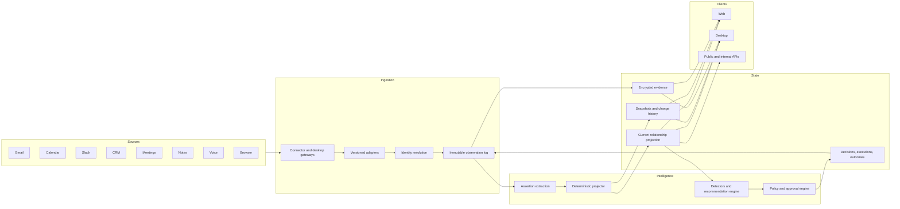

# RFC 036: Relationship Intelligence System

|                   |                                                                                                                                                                                                                                                                                                                                                            |
| ----------------- | ---------------------------------------------------------------------------------------------------------------------------------------------------------------------------------------------------------------------------------------------------------------------------------------------------------------------------------------------------------- |
| **RFC**           | 036                                                                                                                                                                                                                                                                                                                                                        |
| **Status**        | Implementing — foundation landed; production program open                                                                                                                                                                                                                                                                                                  |
| **Track**         | Product foundation — relationship intelligence                                                                                                                                                                                                                                                                                                             |
| **Owners**        | `apps/rowboat-api`, `apps/rowboat-www`, `apps/x`                                                                                                                                                                                                                                                                                                           |
| **Created**       | 2026-07-26                                                                                                                                                                                                                                                                                                                                                 |
| **Last updated**  | 2026-07-26                                                                                                                                                                                                                                                                                                                                                 |
| **Product brief** | [Oppulence relationship-intelligence one-pager](../../docs/one-pager.md)                                                                                                                                                                                                                                                                                   |
| **Depends on**    | [RFC 007](./007-production-cloud-enablement.md), [RFC 012](./012-connector-suite-and-consent-broker.md), [RFC 022](./022-unified-entity-graph.md), [RFC 023](./023-closed-loop-actions.md), [RFC 025](./025-desktop-runtime-durability.md), [RFC 027](./complete-027-durable-agent-runtime.md), [RFC 031](./031-tiered-mail-storage-for-revenue-memory.md) |
| **Uses**          | [RFC 019](./019-google-push-infrastructure.md), [RFC 020](./020-native-third-party-action-engine.md), [RFC 029](./029-founder-operating-memory.md), [RFC 030](./complete-030-revenue-memory-outbound-governance.md), [RFC 035](./035-meeting-intelligence-commitment-ledger.md)                                                                            |
| **Supersedes**    | RFC 022's local-vault-only authority for customer relationships; RFC 030's statement that the action queue itself is the product; any web-primary or desktop-secondary interpretation of the product                                                                                                                                                       |

## 1. Decision

Oppulence is a relationship-intelligence system for customer-facing teams.

It maintains an accurate, living, explainable model of every customer account
and tells the team what needs action. Gmail, Calendar, Slack, CRM, meetings,
notes, voice, browser context, and future integrations are observers of that
model. They are not competing systems of relationship truth.

The Oppulence API is authoritative for shared relationship identity,
observations, assertions, projected state, participants, commitments, risks,
milestones, recommendations, corrections, approvals, execution receipts, and
team-visible history.

The web and desktop applications are equal clients of the same versioned
contract. Platform-native affordances differ, but neither client may ship a
core relationship workflow alone.

Desktop knowledge remains user-owned local working memory and a high-value
observation and execution node. It does not become a second canonical
relationship database.

V1 models customer accounts from prospect through former customer. Revenue
recovery, founder follow-through, meeting intelligence, and finance workflows
are applications over the relationship model. None of them defines the
category.

## 2. Product contract

### 2.1 Job to be done

At any moment, a customer-facing teammate must be able to open an account and
trust the answers to four questions:

1. What is the state of this relationship?
2. What changed?
3. What evidence supports that?
4. What needs action now?

If Oppulence cannot answer all four, it must say what is missing, stale,
ambiguous, or still processing. It must never fill an evidence gap with an
unlabelled guess.

### 2.2 First product experience: Account Mission Control

Account Mission Control must expose:

- the current lifecycle, engagement, sentiment, and health;
- the change since the previous meaningful state;
- source-linked evidence for every material conclusion;
- participants, roles, influence, and recent changes;
- open commitments, risks, blockers, and milestones;
- the recommended next action and why it is recommended;
- approval and execution state for proposed external actions;
- source connection, freshness, lag, and reconciliation state;
- user corrections, their effects, and their audit trail.

### 2.3 Non-negotiable product principles

1. **Model relationships, not inboxes.**
2. **Evidence precedes inference.**
3. **AI proposes; deterministic code owns canonical state.**
4. **Corrections outrank automation and remain reversible.**
5. **Ambiguous identity fails closed.**
6. **No opaque relationship score.**
7. **Missing evidence is a visible state, not a healthy default.**
8. **External actions require policy evaluation and human approval.**
9. **Web and desktop remain at capability parity.**
10. **Every state transition must be replayable and explainable.**
11. **Every connector is replaceable; the relationship history is the asset.**
12. **Learning may improve ranking, extraction, and recommendations, but may
    not silently weaken safety or authority rules.**

## 3. Scope

### 3.1 V1 scope

V1 supports business-to-business customer accounts and their participants
across:

- prospecting;
- evaluation;
- contracting;
- onboarding;
- active customer management;
- renewal;
- churn;
- former-customer reactivation.

The initial users are founder-led sales, account management, customer success,
partnerships, and high-touch services teams.

### 3.2 V1 source families

Production support is required for:

- Gmail;
- Google Calendar;
- Slack;
- HubSpot;
- desktop meetings;
- desktop notes;
- desktop voice notes;
- consented browser context;
- direct user corrections.

Additional CRM, mail, meeting, support, billing, and product-usage sources plug
into the same observer contract.

### 3.3 Explicit non-goals

V1 is not:

- a general social graph;
- a replacement for the CRM's record-editing workflows;
- an employee-surveillance or continuous-screen-recording product;
- an autonomous outbound agent;
- a numeric customer-health score;
- a data warehouse or general-purpose CDP;
- an unbounded copy of every source system;
- a model that auto-merges people or companies from fuzzy names;
- a chat interface that reconstructs state from scratch on every question.

## 4. Current-state audit

This section is evidence, not aspiration. It describes the repository at the
time of this update.

### 4.1 Landed foundation

The following capabilities exist:

- Ent schemas for relationships, participants, observations, assertions,
  source statuses, and state snapshots;
- a migration for the relationship-intelligence schema;
- a provider-neutral batch observation ingestion contract;
- atomic batches of at most 100 observations;
- idempotency on workspace, source, external id, and source version;
- encrypted raw observation payloads through the service sealer;
- assertion precedence for user corrections, source facts, deterministic
  derivations, and AI inferences;
- versioned typed assertion validation, explicit accepted/proposed/rejected/
  superseded/retracted/expired lifecycle states, persisted authority rank, and
  reviewer audit metadata;
- server-owned assertion admission: authenticated observation callers can only
  create proposed AI-tier candidates, while accepted source facts come from
  provider-verified internal adapters and user corrections use the dedicated
  correction path;
- deterministic selection and materialized relationship fields;
- immutable snapshots when projected state changes;
- explicit projection time, projector compatibility, stable state hashes, a
  transactional projection outbox, retry/dead-letter handling, and replay CLI;
- source normalizers for Gmail, Calendar, Slack, and HubSpot;
- relationship list, create, detail, timeline, changes, evidence, correction,
  source-health, recommendation-approval, and recommendation-rejection APIs;
- tenant query interceptors and mutation hooks for the relationship entities;
- an Acme golden path that projects four sources into one relationship;
- tenant isolation, replay idempotency, precedence, correction, and projection
  tests;
- web and desktop Account Mission Control views with list/filter, source
  status, detail, changes, evidence, corrections, and recommendations;
- desktop IPC and shared runtime schemas for the relationship API.

Primary implementation anchors:

- `apps/rowboat-api/internal/revenue/relationship_state.go`
- `apps/rowboat-api/internal/revenue/relationship_adapters.go`
- `apps/rowboat-api/internal/revenue/handler.go`
- `apps/rowboat-api/ent/schema/relationship*.go`
- `apps/rowboat-www/components/revenue/relationships-view.tsx`
- `apps/x/apps/renderer/src/components/relationships-view.tsx`
- `apps/x/packages/core/src/relationships/client.ts`
- `apps/x/packages/shared/src/relationships.ts`
- `fixtures/relationship-acme.json`
- `fixtures/relationship-marketing-observations.json`

### 4.2 Foundation limitations

The current implementation is not production-complete:

- identity resolution only checks a supplied relationship id, exact account
  domain, or exact primary email;
- there is no identity-candidate queue, merge/split history, alias model, or
  human reconciliation workflow;
- the four source adapters are normalizers, not complete production ingestion
  pipelines;
- risks and milestones are stored as arrays but projected from one winning
  assertion each;
- commitments, risks, milestones, and participant changes are not yet fully
  modeled as independent temporal objects;
- source status is updated on successful observations but does not yet model
  cursor, watermark, poll time, expected cadence, lag, consent scope, or
  disconnect reason;
- recommendation coverage is still coupled to `RevenueAction` and
  revenue-oriented detectors;
- cross-relationship questions reuse revenue semantic search rather than a
  relationship-native query and citation contract;
- web and desktop implementations are visually similar but duplicated; parity
  is maintained by convention rather than generated contracts and automated
  capability tests;
- desktop offline observation outbox and reconciliation are not complete;
- authorization is user-scoped; team workspaces, roles, and organization
  sharing are not the completed authority model;
- per-tenant envelope keys, retention workers, legal hold, export, and
  cryptographic erasure are not complete;
- relationship-specific SLOs, traces, cost metrics, load tests, chaos tests,
  and production eval gates are not complete.

Nothing in this RFC may treat the landed foundation as proof that these gaps
are solved.

## 5. Target architecture



### 5.1 Planes

| Plane                | Responsibility                                                                | Must not do                                       |
| -------------------- | ----------------------------------------------------------------------------- | ------------------------------------------------- |
| Source plane         | Provider authorization, sync, webhooks, cursors, raw events                   | Decide canonical relationship state               |
| Ingestion plane      | Validate, normalize, deduplicate, seal, resolve identity, append observations | Mutate projected fields directly                  |
| Assertion plane      | Produce provenance-bearing candidate claims                                   | Bypass authority, temporal, or review rules       |
| Projection plane     | Deterministically derive current state and snapshots                          | Call LLMs, providers, or non-deterministic clocks |
| Recommendation plane | Detect opportunities and risks; rank next actions                             | Execute external actions                          |
| Governance plane     | Evaluate policy, obtain approval, bind revisions, execute idempotently        | Approve on the user's behalf                      |
| Experience plane     | Render state, evidence, changes, corrections, and actions                     | Maintain a competing canonical model              |

### 5.2 Authority

| Concern                                | Authority                              |
| -------------------------------------- | -------------------------------------- |
| CRM-owned records                      | CRM                                    |
| Provider messages, events, and files   | Source provider                        |
| Shared relationship identity           | Oppulence relationship service         |
| Current relationship projection        | Versioned deterministic projector      |
| User correction                        | User-authored assertion                |
| Action authorization                   | Policy decision plus explicit approval |
| Local notes and private working memory | Desktop vault                          |
| Team-visible relationship history      | Oppulence API                          |

## 6. Domain model

### 6.1 Required aggregates

| Object              | Purpose                                                          | Mutability                                 |
| ------------------- | ---------------------------------------------------------------- | ------------------------------------------ |
| `Workspace`         | Tenant and team boundary                                         | Mutable configuration                      |
| `Relationship`      | Stable account aggregate and current projection                  | Projection fields mutable; identity stable |
| `RelationshipAlias` | Verified domain, email, provider, and external aliases           | Append, verify, revoke                     |
| `IdentityCandidate` | Ambiguous proposed link or merge                                 | State machine                              |
| `IdentityDecision`  | Human or policy resolution of a candidate                        | Immutable                                  |
| `Participant`       | Person and role within the account                               | Temporal                                   |
| `Observation`       | Normalized source event                                          | Immutable                                  |
| `EvidenceBlob`      | Sealed raw or bounded source payload                             | Immutable, retention-bound                 |
| `Assertion`         | Provenance-bearing claim                                         | Immutable; supersede or retract            |
| `StateSnapshot`     | Versioned projection checkpoint                                  | Immutable                                  |
| `Commitment`        | Promise with owner, counterparty, due state, and evidence        | State machine with immutable history       |
| `Risk`              | Evidence-backed unresolved risk                                  | State machine with immutable history       |
| `Milestone`         | Evidence-backed achieved or expected event                       | Temporal                                   |
| `Recommendation`    | Proposed next action                                             | State machine                              |
| `Decision`          | Approval, rejection, edit, snooze, dismiss, or correction        | Immutable                                  |
| `Execution`         | Idempotent attempt to perform an approved action                 | Append-only attempts                       |
| `Outcome`           | Provider or user-confirmed result                                | Immutable                                  |
| `SourceConnection`  | Authorization, scope, and account identity                       | Mutable state with audit                   |
| `SourceCheckpoint`  | Cursor, watermark, lag, and sync result                          | Append-only or monotonic                   |
| `Evaluation`        | Quality result tied to extractor, detector, or projector version | Immutable                                  |

### 6.2 Relationship projection

The materialized relationship contains:

- stable id;
- workspace id;
- display name;
- kind;
- verified aliases and source references;
- lifecycle;
- engagement;
- sentiment;
- health;
- summary;
- next action summary;
- state reason;
- last touch;
- last meaningful change;
- projection version;
- projector version;
- source completeness;
- participant, commitment, risk, milestone, and recommendation summaries.

### 6.3 State dimensions

| Dimension    | Values or shape                                                                                                   | Cardinality         | Authority notes                                 |
| ------------ | ----------------------------------------------------------------------------------------------------------------- | ------------------- | ----------------------------------------------- |
| Lifecycle    | `prospect`, `evaluation`, `contracting`, `onboarding`, `active_customer`, `renewal`, `churned`, `former_customer` | One                 | CRM fact may lead; correction may override      |
| Engagement   | `unknown`, `increasing`, `steady`, `declining`, `dormant`                                                         | One                 | Derived from a declared time window             |
| Sentiment    | `unknown`, `positive`, `mixed`, `negative`                                                                        | One                 | Inference must include evidence and confidence  |
| Health       | `unknown`, `healthy`, `needs_attention`, `critical`                                                               | One                 | Qualitative and explainable; never numeric-only |
| Participants | Person, role, influence, active interval                                                                          | Many                | Identity-reviewed                               |
| Commitments  | Owner, counterparty, due time, status, evidence                                                                   | Many                | First-class object                              |
| Risks        | Type, severity, status, evidence, owner                                                                           | Many                | First-class object                              |
| Milestones   | Type, expected or achieved time, evidence                                                                         | Many                | First-class object                              |
| Next action  | Recommendation reference plus readable summary                                                                    | Zero or one primary | Derived from open recommendations               |

### 6.4 Assertion model

Every assertion must contain:

- id and workspace id;
- relationship id;
- dimension and typed value;
- source type;
- authority rank;
- confidence;
- reason;
- supporting observation ids;
- extractor or rule version;
- recorded time;
- valid-from time;
- optional valid-to time;
- status: `proposed`, `accepted`, `rejected`, `superseded`, `retracted`,
  `expired`;
- optional superseded assertion id;
- optional reviewer and review decision;
- schema and projector compatibility versions.

Free-form string values are insufficient for typed state dimensions. The API
must validate values against versioned dimension schemas before acceptance.

## 7. System invariants

The following are hard invariants:

1. Every tenant-owned entity is scoped at ORM read and mutation boundaries.
2. Every observation has one workspace, source, source account, external id,
   source version, occurred time, received time, and content hash.
3. Observation identity is unique within its workspace and source account.
4. Observations are never edited in place.
5. Raw payloads are sealed before durable database storage.
6. An adapter cannot mutate materialized relationship fields.
7. An AI extractor cannot mutate materialized relationship fields.
8. Canonical state is produced only by a versioned deterministic projector.
9. Every material projected value references winning assertions.
10. Every accepted assertion references evidence or an explicit user action.
11. A user correction cannot be silently displaced by automation.
12. Corrections can be superseded or retracted only through another explicit
    user-visible decision.
13. Similar names alone never merge identities.
14. Ambiguous identity never attaches evidence to an arbitrary relationship.
15. A relationship merge or split preserves the full decision and lineage
    history.
16. Missing or stale sources cannot produce a positive health conclusion
    without a visible completeness warning.
17. Projection replay over the same ordered inputs and version produces the
    same state and winning assertion ids.
18. State versions are monotonic per relationship.
19. Recommendations are immutable revisions; edits create a new revision.
20. No external action executes without a valid policy decision and explicit
    approval bound to the exact revision.
21. Execution is idempotent and produces a receipt.
22. Rejection, snooze, dismissal, correction, execution, and outcome events
    return to the observation history.
23. Web and desktop consume compatible generated contracts.
24. A core relationship capability is not released until both clients pass
    the same behavior contract.

## 8. Identity and reconciliation

### 8.1 Identity keys

Identity resolution evaluates, in order:

1. explicit relationship id;
2. verified provider object association;
3. verified CRM account and contact association;
4. previously verified external alias;
5. verified participant email plus verified account domain;
6. exact account domain with no conflicting tenant account;
7. candidate-only signals such as similar names, unverified domains, and shared
   participants.

Signals in step 7 may create an `IdentityCandidate`; they may not auto-link.

### 8.2 Candidate states

`proposed → under_review → confirmed | rejected | expired`

A candidate records:

- the source observation;
- candidate relationships;
- matched signals;
- conflicting signals;
- confidence by signal, not one unexplained score;
- proposed action: link, create, merge, split, or ignore;
- reviewer and decision.

### 8.3 Merge and split

Merge and split are governed operations:

- never delete source records;
- preserve prior relationship ids as aliases;
- retain observation, assertion, decision, and execution lineage;
- reproject every affected aggregate;
- issue a new state version;
- emit an audit and domain event;
- support administrative rollback when no later dependent decision blocks it.

### 8.4 Reconciliation experience

Both clients must show:

- unresolved identity count;
- reason a record is ambiguous;
- candidate accounts and evidence;
- confirm, reject, create-new, merge, and split actions;
- resulting state changes before confirmation;
- complete decision history.

## 9. Observation ingestion

### 9.1 Canonical envelope

```json
{
  "schemaVersion": "relationship.observation.v1",
  "idempotencyKey": "gmail:account-123:message-456:v1",
  "workspaceId": "uuid",
  "relationshipHint": {
    "relationshipId": "uuid-or-empty",
    "providerRefs": ["hubspot:company:123"],
    "accountDomains": ["acme.com"],
    "participantEmails": ["champion@acme.com"]
  },
  "source": {
    "provider": "gmail",
    "accountId": "account-123",
    "cursor": "provider-cursor",
    "eventId": "message-456",
    "eventVersion": "1"
  },
  "eventType": "message.received",
  "occurredAt": "2026-07-26T12:00:00Z",
  "receivedAt": "2026-07-26T12:00:02Z",
  "summary": "Customer confirmed the security review.",
  "normalizedFacts": {},
  "participants": [],
  "assertionCandidates": [],
  "sealedPayload": "server-produced"
}
```

Clients submit raw payloads only over authenticated transport. The server
normalizes or validates them, seals retained content, and never trusts
client-supplied ciphertext metadata.

### 9.2 Processing stages

1. authenticate caller;
2. authorize workspace and source account;
3. validate schema and body size;
4. assign or validate idempotency key;
5. normalize provider payload;
6. seal retained raw evidence;
7. resolve or quarantine identity;
8. append observation;
9. update source checkpoint;
10. emit outbox event;
11. extract assertion candidates;
12. validate and accept assertions;
13. enqueue projection;
14. enqueue detectors after projection;
15. publish client-visible change event.

### 9.3 Ordering and replay

- `occurred_at` orders source meaning.
- `received_at` records ingestion latency.
- provider sequence or cursor orders events when available.
- late events are accepted and may trigger a reproject.
- the projector consumes a stable total order:
  `valid_from`, `recorded_at`, authority, confidence, assertion id.
- replay never calls a provider or model.
- a replay writes a comparison result before replacing a production
  projection.

### 9.4 Adapter contract

Production third-party adapters are authored, versioned, certified, and
operated through [RFC 020](./020-native-third-party-action-engine.md). This RFC
defines the observation and identity boundary they must satisfy. Provider
transport, authentication, cursor, webhook, package, and catalog mechanics
belong to RFC 020.

An adapter must:

- declare source capabilities and scopes;
- validate webhook signatures or sync credentials;
- map provider identifiers to stable external references;
- normalize participants and account hints;
- classify event type;
- bound summaries and searchable facts;
- declare raw-data retention requirements;
- emit source facts separately from inference candidates;
- record adapter version;
- expose cursor, watermark, lag, and error state;
- include fixture payloads and contract tests.

An adapter must not:

- decide the canonical relationship;
- write projected state;
- auto-merge fuzzy identities;
- emit an untraceable model conclusion;
- retain raw content beyond policy.

## 10. Assertion and projection engine

### 10.1 Authority order

Default authority is:

1. active user correction;
2. explicit authoritative source fact;
3. accepted deterministic derivation;
4. accepted AI inference.

Authority does not erase time. An expired correction does not dominate forever,
and a source fact that ceased to be valid does not block a later state.

### 10.2 Assertion acceptance

Candidate assertions pass:

- dimension schema validation;
- evidence availability validation;
- source authorization;
- temporal validation;
- contradiction detection;
- confidence calibration rules;
- optional human review based on policy;
- extractor or rule version allowlist.

The system distinguishes:

- **proposed**: produced but not trusted for projection;
- **accepted**: eligible for projection;
- **rejected**: reviewed or invalid;
- **superseded**: replaced by a newer assertion;
- **retracted**: explicitly withdrawn;
- **expired**: outside its validity interval.

### 10.3 Projector requirements

The projector is a pure function of:

- projector version;
- dimension schema version;
- relationship identity;
- accepted assertions;
- temporal evaluation time supplied by the caller;
- referenced first-class commitments, risks, milestones, and participants.

It returns:

- full projected state;
- winning assertion ids;
- changed dimensions;
- explanation fragments;
- completeness and freshness flags;
- next state version;
- deterministic state hash.

It may not:

- call an LLM;
- query a provider;
- read the system clock directly;
- depend on map iteration order;
- mutate input observations or assertions.

### 10.4 Projection execution

Projection moves out of the ingestion transaction before production scale.

Required flow:

- ingestion commits observation and outbox event;
- a durable worker coalesces relationship projection requests;
- the worker locks one relationship version;
- the projector computes the next state;
- compare-and-swap commits state and snapshot;
- conflicts retry from the latest version;
- permanent failures move to a dead-letter queue;
- replay tooling can rebuild one relationship, one workspace, or a version
  range.

### 10.5 Explainability

For each material state field, clients receive:

- value;
- winning assertion;
- authority type;
- confidence where relevant;
- reason;
- evidence references;
- valid interval;
- last changed time;
- completeness warning;
- correction affordance.

`state_reason` is a convenience summary, not the sole explanation.

## 11. Commitments, risks, milestones, and participants

These objects become first-class temporal records rather than strings embedded
in the aggregate.

### 11.1 Commitment

Required fields:

- owner and counterparty;
- direction: `ours`, `theirs`, `mutual`;
- text and normalized type;
- created, due, completed, cancelled, and breached times;
- status;
- confidence;
- source evidence;
- user-confirmed flag;
- linked recommendation and outcome.

### 11.2 Risk

Required fields:

- category;
- qualitative severity;
- status;
- owner;
- detected and resolved times;
- explanation;
- evidence;
- detector version;
- linked recommendation.

### 11.3 Milestone

Required fields:

- normalized type;
- expected or achieved time;
- status;
- source;
- evidence;
- related lifecycle transition.

### 11.4 Participant

Required fields:

- stable person identity;
- account role;
- title;
- influence;
- champion, blocker, signer, admin, user, or executive flags where supported;
- active interval;
- verified aliases;
- evidence and source references.

## 12. Recommendation, approval, action, and learning loop

### 12.1 Recommendation contract

A recommendation contains:

- relationship id;
- detector id and version;
- action type and channel;
- readable reason;
- evidence ids;
- state version evaluated;
- priority explanation;
- risk class;
- policy status;
- proposed content revision;
- dedupe key;
- cooldown;
- expiry;
- approval and execution state.

### 12.2 Detectors

Initial detectors:

- overdue commitment;
- missing next meeting;
- unanswered proposal;
- declining champion engagement;
- unresolved blocker;
- onboarding stall;
- renewal without plan;
- stakeholder departure;
- support escalation without owner;
- payment or invoice risk;
- dormant former-customer opportunity.

Each detector ships with:

- precise input dimensions;
- negative conditions;
- dedupe behavior;
- cooldown;
- explanation template;
- offline evaluation set;
- false-positive target;
- telemetry.

### 12.3 Ranking without an opaque score

The queue may use an internal ranking function, but clients expose the factors:

- urgency;
- relationship value or declared importance;
- commitment due state;
- lifecycle timing;
- evidence freshness;
- reversibility;
- action risk;
- confidence;
- user preference.

No unlabeled numeric health or priority score may be the only explanation.

### 12.4 Governance

The RFC 023 action lifecycle remains mandatory:

`propose → evaluate → edit → approve | reject | snooze | dismiss → execute → watch → outcome`

Approval binds:

- actor;
- relationship;
- exact revision hash;
- channel;
- provider account;
- scopes;
- recipients;
- expiry;
- risk acceptance when required.

### 12.5 Learning

Learning signals include:

- correction accepted or reversed;
- recommendation approved, edited, rejected, snoozed, or dismissed;
- action executed or failed;
- reply or meeting outcome;
- commitment completed or breached;
- relationship state improved, worsened, or remained unchanged.

Learning may:

- calibrate extractor confidence;
- rank detectors;
- personalize timing and channel;
- suggest rules;
- identify missing evidence.

Learning may not automatically:

- alter authority order;
- approve actions;
- expand connector scopes;
- disable safety policy;
- merge identities;
- change retention policy.

Model, prompt, rule, and threshold changes require an evaluation result and
versioned rollout.

## 13. API and event contracts

### 13.1 API families

#### Relationships

- `GET /v1/relationships`
- `POST /v1/relationships`
- `GET /v1/relationships/{id}`
- `PATCH /v1/relationships/{id}/metadata`
- `GET /v1/relationships/{id}/timeline`
- `GET /v1/relationships/{id}/changes`
- `GET /v1/relationships/{id}/explanations`
- `GET /v1/relationships/{id}/evidence/{evidenceId}`
- `POST /v1/relationships/{id}/corrections`
- `POST /v1/relationships/{id}/corrections/{correctionId}/retract`

#### Identity

- `GET /v1/relationship-identities/candidates`
- `POST /v1/relationship-identities/candidates/{id}/confirm`
- `POST /v1/relationship-identities/candidates/{id}/reject`
- `POST /v1/relationships/{id}/merge`
- `POST /v1/relationships/{id}/split`
- `GET /v1/relationships/{id}/lineage`

#### Observations and sources

- `POST /v1/relationship-observations/batch`
- `GET /v1/relationship-observations/{id}`
- `GET /v1/relationship-sources`
- `GET /v1/relationship-sources/status`
- `POST /v1/relationship-sources/{id}/resync`
- `GET /v1/relationship-sources/{id}/checkpoints`

#### Recommendations and actions

- `GET /v1/relationship-recommendations`
- `GET /v1/relationship-recommendations/{id}`
- `POST /v1/relationship-recommendations/{id}/edit`
- `POST /v1/relationship-recommendations/{id}/approve`
- `POST /v1/relationship-recommendations/{id}/reject`
- `POST /v1/relationship-recommendations/{id}/snooze`
- `POST /v1/relationship-recommendations/{id}/dismiss`
- `POST /v1/relationship-recommendations/{id}/execute`
- `GET /v1/relationship-recommendations/{id}/audit`

#### Query and portfolio

- `POST /v1/relationships/query`
- `GET /v1/relationship-portfolio/attention`
- `GET /v1/relationship-portfolio/changes`
- `GET /v1/relationship-portfolio/source-health`

#### Administration and replay

- `POST /v1/internal/relationship-projections/replay`
- `GET /v1/internal/relationship-projections/replay/{id}`
- `GET /v1/internal/relationship-projections/dead-letters`
- `POST /v1/internal/relationship-projections/dead-letters/{id}/retry`

### 13.2 API rules

- OpenAPI is authoritative.
- Generated clients and runtime validators consume the same schema.
- Lists use cursor pagination; no unbounded arrays.
- Writes accept an idempotency key.
- Mutable metadata writes use version or ETag preconditions.
- Errors use RFC 9457 with stable machine codes.
- Evidence responses distinguish unavailable, expired, redacted, unauthorized,
  and decrypt-failed states.
- Every response includes contract version.
- Breaking changes require a new API version or compatibility adapter.

### 13.3 Domain events

Required versioned events:

- `relationship.observation.appended.v1`
- `relationship.identity.review_required.v1`
- `relationship.identity.resolved.v1`
- `relationship.assertion.proposed.v1`
- `relationship.assertion.accepted.v1`
- `relationship.state.changed.v1`
- `relationship.recommendation.created.v1`
- `relationship.decision.recorded.v1`
- `relationship.action.executed.v1`
- `relationship.outcome.recorded.v1`
- `relationship.source.degraded.v1`
- `relationship.source.recovered.v1`

Events publish through a transactional outbox and include workspace,
relationship, aggregate version, event id, correlation id, causation id, and
occurred time.

## 14. Web and desktop parity

### 14.1 Required capability matrix

| Capability                                      | Web                    | Desktop              | Shared proof           |
| ----------------------------------------------- | ---------------------- | -------------------- | ---------------------- |
| Relationship list, filters, and attention queue | Required               | Required             | Contract and E2E       |
| Account Mission Control                         | Required               | Required             | Snapshot fixture       |
| State explanations                              | Required               | Required             | Same assertion ids     |
| What changed                                    | Required               | Required             | Same state versions    |
| Unified timeline                                | Required               | Required             | Same cursor sequence   |
| Evidence inspection                             | Required               | Required             | Authorization contract |
| Participants and roles                          | Required               | Required             | Same DTO               |
| Commitments, risks, milestones                  | Required               | Required             | Same DTO               |
| Corrections and retractions                     | Required               | Required             | Cross-client E2E       |
| Identity reconciliation                         | Required               | Required             | Cross-client E2E       |
| Recommendations and audit                       | Required               | Required             | Same action revision   |
| Approve, reject, snooze, dismiss                | Required               | Required             | Cross-client E2E       |
| Source health and repair                        | Required               | Required             | Same checkpoint state  |
| Ask across relationships                        | Required               | Required             | Same cited answer      |
| Team activity and ownership                     | Required               | Required             | Same event stream      |
| Meeting, note, voice, browser capture           | Result visible         | Native capture       | Observation contract   |
| Native provider execution                       | Receipt visible        | Native when selected | Execution contract     |
| Offline capture                                 | Read-only cached state | Required             | Reconciliation E2E     |

### 14.2 Shared client architecture

Parity cannot rely on copying two large view files.

The target is:

- generated API types from OpenAPI;
- one framework-neutral relationship domain package;
- one query-key and cache-invalidation contract;
- one formatting and state-label package;
- shared fixture-driven behavior tests;
- separate web and Electron transport adapters;
- platform-specific presentation components only where native behavior differs.

The clients may have different layouts. They may not interpret state,
authority, evidence availability, recommendation status, or source health
differently.

### 14.3 Desktop offline behavior

Desktop maintains:

- encrypted cached relationship summaries;
- last synchronized state version;
- an append-only local observation outbox;
- client-generated idempotency keys;
- retry and dead-letter state;
- explicit offline and stale indicators.

Reconnection:

1. uploads observations in order;
2. receives canonical identities and state versions;
3. never overwrites server state with last-write-wins;
4. surfaces identity or correction conflicts;
5. records reconciliation results.

### 14.4 Real-time updates

Both clients subscribe to a shared change stream or invalidate on domain
events. A correction, approval, execution, source degradation, or state change
performed in one client appears in the other within the freshness SLO.

## 15. Relationship-native query

“Ask across relationships” is not generic vector search.

The query service must:

- classify the requested dimensions and time range;
- query structured state first;
- retrieve relevant observations and assertions second;
- generate a bounded answer with account-level citations;
- show source freshness and completeness;
- distinguish data absence from negative evidence;
- refuse unsupported causal conclusions;
- record query, plan, cited evidence, model version, latency, and cost.

Example:

> Which renewals lost engagement this month, and what evidence supports that?

The answer must identify:

- renewal relationships;
- prior and current engagement;
- state-change time;
- winning assertion;
- supporting observations;
- missing or stale sources;
- recommended next action.

## 16. Security, privacy, and governance

### 16.1 Authorization

The production authority boundary is organization and workspace, not an
individual user's row ownership.

Required roles:

- owner;
- admin;
- manager;
- contributor;
- viewer;
- integration service;
- internal worker.

Permissions are resource and action specific:

- view relationship;
- view sensitive evidence;
- correct state;
- resolve identity;
- create recommendation;
- approve action;
- execute action;
- manage source;
- export;
- delete;
- administer retention.

Internal workers use scoped service identity and never bypass tenant filters
through an untracked global client.

### 16.2 Encryption

- TLS in transit.
- Database and backup encryption at rest.
- Per-tenant envelope encryption for raw evidence.
- KMS-backed key encryption keys.
- Key version stored with every sealed blob.
- Rotation without rewriting unrelated data.
- Cryptographic erasure on workspace deletion where legally permitted.
- Secrets remain in the connector broker, never in observation payloads.

The current service-level AES-GCM sealer is an interim implementation, not the
GA key-management design.

### 16.3 Data minimization

- Store stable identifiers and bounded normalized facts by default.
- Retain raw bodies only when a product workflow requires them.
- Separate searchable metadata from sealed content.
- Redact secrets, tokens, payment data, and unsupported sensitive classes.
- Do not retain continuous screen capture.
- Browser context is per-invocation and consented.
- Model prompts receive only the minimum necessary evidence.

### 16.4 Retention

Default policy:

| Data                                                   | Default                           |
| ------------------------------------------------------ | --------------------------------- |
| Observation metadata                                   | Relationship lifetime             |
| Raw evidence                                           | 365 days or shorter source policy |
| Sealed transient mail body                             | RFC 031 policy                    |
| Assertions and snapshots                               | Relationship lifetime             |
| Corrections, identity decisions, approvals, executions | Audit lifetime                    |
| Deleted workspace keys                                 | Destroy after recovery window     |

Retention workers, legal hold, export, and deletion must be tested before GA.

### 16.5 Audit

Audit records include actor, role, action, resource, prior version, next
version, reason, IP or service identity, correlation id, and time.

Audit applies to:

- source connection and scope changes;
- evidence access;
- correction and retraction;
- identity decision;
- merge and split;
- recommendation edit;
- approval and rejection;
- execution;
- export;
- retention change;
- deletion.

## 17. Reliability and performance

### 17.1 Service-level objectives

| Measure                                          | Target                                                |
| ------------------------------------------------ | ----------------------------------------------------- |
| API availability                                 | 99.9% monthly                                         |
| Observation accepted after authenticated request | p95 under 2 seconds                                   |
| Provider event to projected state                | p95 under 60 seconds                                  |
| Client correction to other client                | p95 under 5 seconds                                   |
| Approval to execution receipt                    | p95 under 30 seconds, provider permitting             |
| Relationship detail cached response              | p95 under 500 ms                                      |
| Relationship list response                       | p95 under 750 ms for 10k relationships                |
| Replay determinism                               | 100% identical state hashes for same versioned inputs |
| Duplicate execution                              | 0                                                     |
| Cross-tenant evidence exposure                   | 0                                                     |

### 17.2 Failure isolation

- One malformed observation does not poison a source stream.
- One relationship projection failure does not stop the workspace.
- Provider rate limiting backs off without losing cursors.
- Dead letters preserve payload metadata and repair instructions.
- Source degradation is visible before recommendations rely on stale evidence.
- Circuit breakers stop repeated provider failures.
- Action execution separates safe retry from uncertain outcome.
- Unknown execution outcome is never reported as success.

### 17.3 Capacity targets

The first production capacity test covers:

- 10,000 relationships per workspace;
- 100 participants per relationship;
- 100,000 observations per active relationship over its lifetime;
- 100 observations per ingestion request;
- 1,000 source events per second per regional service;
- 1,000 concurrent client change streams;
- full workspace replay without blocking interactive reads.

These are engineering targets, not pricing entitlements.

## 18. Observability and cost

### 18.1 Required telemetry

Metrics:

- observations accepted, duplicated, quarantined, rejected;
- adapter lag and failure by source;
- identity candidate and resolution counts;
- assertions proposed, accepted, rejected, corrected, retracted;
- projection latency, conflict, retry, failure, and replay drift;
- recommendation count, precision proxy, approval, edit, rejection, snooze,
  dismissal;
- execution success, uncertain outcome, failure, and duplicate prevention;
- evidence decrypt and retention failures;
- client parity contract failures;
- model tokens, latency, and cost by extractor and query;
- queue depth and dead letters.

Traces connect:

`provider event → observation → identity → assertion → projection → detector → recommendation → decision → execution → outcome`

### 18.2 Trust-facing diagnostics

Users see:

- last successful sync;
- last observation;
- expected cadence;
- current lag;
- missing scope;
- latest error;
- retry state;
- whether state is complete, partial, stale, or rebuilding.

### 18.3 Cost controls

- deterministic extraction before model extraction;
- bounded evidence windows;
- cached normalized facts;
- small-model routing for classification;
- budget by workspace and source;
- replay without LLM calls;
- sampling for non-critical eval telemetry;
- cost per useful accepted assertion and per approved recommendation.

## 19. Migration and compatibility

### 19.1 Existing data

Migration sources include:

- existing `Relationship` rows;
- revenue evidence and actions;
- commitments;
- mail threads and signals;
- desktop live notes;
- account and person records from RFC 022;
- action outcomes from RFC 023 and RFC 030.

### 19.2 Migration stages

1. add new normalized objects and versions;
2. dual-write current and target representations;
3. backfill aliases, assertions, and snapshots;
4. replay and compare state hashes;
5. expose shadow explanations internally;
6. switch reads by workspace cohort;
7. verify action and correction lineage;
8. stop legacy writes;
9. retain compatibility reads for one release window;
10. remove legacy fields only after export and rollback windows expire.

### 19.3 Backfill rules

- A legacy field becomes a `legacy_import` assertion with explicit provenance.
- Legacy arrays become first-class records with imported status.
- No inferred identity merge occurs during backfill.
- Conflicts create identity candidates.
- Backfill does not emit external actions.
- Every backfill run is idempotent and reports counts, failures, and drift.

## 20. Testing and evaluation

### 20.1 Test layers

#### Unit

- adapter normalization;
- dimension validation;
- authority and temporal ordering;
- retraction and supersession;
- projector determinism;
- detector logic;
- priority factor explanations;
- retention decisions.

#### Property

- observation replay is idempotent;
- state versions are monotonic;
- input permutation preserves state when source order is equivalent;
- merge then supported rollback preserves lineage;
- correction cannot be displaced by lower authority;
- reproject over the same inputs returns the same hash;
- execution idempotency prevents duplicate effects.

#### Contract

- OpenAPI and generated clients;
- web transport and desktop IPC;
- every adapter fixture;
- event schemas;
- RFC 9457 error codes;
- evidence unavailable and redacted states.

#### Integration

- database isolation and mutation scoping;
- transactional outbox;
- projection worker retries and dead letters;
- KMS envelope encryption and rotation;
- source cursor recovery;
- approval revision binding;
- export, retention, and deletion.

#### End-to-end

- web correction appears on desktop;
- desktop correction appears on web;
- identity decision reprojects both clients;
- web approval appears on desktop;
- desktop approval appears on web;
- execution occurs once;
- outcome becomes evidence;
- source degradation changes completeness;
- offline desktop observations reconcile after reconnect.

#### Load and chaos

- webhook burst;
- provider replay storm;
- out-of-order history import;
- projection worker restart;
- database failover;
- KMS temporary failure;
- provider timeout after uncertain action execution;
- 10k-account list and query;
- full workspace replay.

### 20.2 Golden evaluation corpus

The Acme fixture becomes the first of a versioned corpus:

1. healthy onboarding;
2. silent proposal;
3. champion departure;
4. unresolved security blocker;
5. renewal without plan;
6. support escalation;
7. overdue customer commitment;
8. overdue internal commitment;
9. ambiguous company identity;
10. shared-domain false merge;
11. contradictory CRM and conversation evidence;
12. stale source falsely suggesting health;
13. corrected sentiment;
14. churn and reactivation;
15. payment risk tied to relationship context.

Each scenario declares:

- source events;
- expected identity;
- accepted and rejected assertions;
- expected projected state;
- expected explanation;
- expected recommendations;
- forbidden recommendations;
- client snapshots;
- security and retention expectations.

### 20.3 Quality gates

No extractor, detector, ranker, or model version reaches production without:

- corpus pass;
- no safety regression;
- no tenant-scope regression;
- calibrated confidence report;
- false-positive and false-negative report;
- cost and latency report;
- shadow or canary evidence;
- rollback plan.

## 21. Delivery program

The phases below are cumulative. A later phase cannot waive an earlier exit
gate.

### Phase 0 — Foundation

**Status:** Landed.

Delivered:

- initial domain tables and migration;
- observation batch ingestion;
- basic idempotency and payload sealing;
- assertion precedence;
- synchronous projection and snapshots;
- four adapter normalizers;
- first API surface;
- first web and desktop views;
- first cross-source golden path.

Phase 0 proves the architecture is viable. It does not prove production
readiness.

### Phase 1 — Correctness and authority

**Goal:** make the model replayable, temporally correct, team-safe, and
operable.

Work packages:

| ID   | Deliverable                                                                            | Owner       | Proof                        |
| ---- | -------------------------------------------------------------------------------------- | ----------- | ---------------------------- |
| R1.1 | Typed assertion schemas, status, validity, retraction, supersession, extractor version | API         | Unit and migration tests     |
| R1.2 | Pure versioned projector with explicit evaluation time and state hash                  | API         | Determinism/property tests   |
| R1.3 | Outbox, durable projection worker, CAS, retry, dead letter, replay CLI                 | API         | Failure and replay tests     |
| R1.4 | First-class commitments, risks, milestones, participant intervals                      | API         | Golden corpus                |
| R1.5 | Workspace/team roles and relationship FGA boundary                                     | API + auth  | Cross-tenant and role matrix |
| R1.6 | Per-tenant envelope encryption and key rotation                                        | API + infra | Rotation and erasure test    |
| R1.7 | Source completeness and freshness projection                                           | API         | Stale-source scenarios       |
| R1.8 | Relationship-specific metrics, traces, dashboards, and alerts                          | API + SRE   | Staging SLO dashboard        |

**Implementation checkpoint (2026-08-26):** R1.1 is landed. Assertion values
are validated against a versioned dimension contract before acceptance.
Authority rank is deterministic and persisted. Lifecycle states and reviewer
metadata are explicit. Untrusted observation assertions cannot self-assign
canonical authority. Retraction and supersession preserve historical replay
through their validity boundaries. The additive migration deliberately keeps
legacy `active` rows and the database default until pre-R1.1 projectors have
drained. New projectors read both statuses while new writers emit `accepted`.
The Phase 1 exit gate remains open until the
full corpus, operational, encryption, source-completeness, and seven-day staging
proofs pass together.

**R1.1 validation evidence (2026-08-26):**

- API repository gate: `make verify` passed.
- API CI-only follow-through: `make migration-lint test-race security` passed.
  Atlas reported no diagnostics for the new migration, race-enabled tests
  passed, `govulncheck` found no vulnerabilities, and Gitleaks found no leaks.
- Generated-contract reproducibility: `make generate-check` and the web
  `contracts:check` gate passed with no drift.
- Web gates: `npm run verify` passed. The CI-only `bundle:check`, Playwright
  `test:e2e`, and Lighthouse stages also passed.
- Desktop gates: `pnpm verify` passed. The pinned external tools were then
  installed and the CI-required policy, secret, and dependency audits passed
  with `X_GAUNTLET_REQUIRE_EXTERNAL=1`.
- Consumer compatibility: web and desktop type checks passed after generation.
- Public-interface smoke test: the real `cmd/server` process started with local
  defaults. `/healthz`, `/readyz`, and `/openapi.json` returned HTTP 200. The
  served contract mounted `/v1/relationship-observations/batch` and exposed the
  Mission Control `value` and `reason` fields as strings plus integer authority
  rank and value-schema version metadata.
- Authenticated acceptance constraint: a real POST to the observation endpoint
  reached the authentication boundary and returned HTTP 503 `auth_unavailable`
  because the local WorkOS JWKS check was degraded. The complete signed-in
  observation-to-projection-to-client workflow therefore remains externally
  blocked without a working WorkOS environment and interactive user session.
  This public-path limitation is not replaced by the passing package tests.

This evidence closes R1.1 implementation validation only. The broader Phase 1
exit gate still requires the full corpus, staging SLO window, key rotation,
source-completeness scenarios, and operational recovery proofs listed below.

Exit gate:

- deterministic replay passes for the full corpus;
- no unscoped relationship read or mutation path;
- correction retraction and temporal expiry work;
- stale evidence cannot render as complete state;
- projection failures are recoverable without manual database edits;
- per-tenant keys rotate successfully;
- staging meets latency SLOs for seven days.

### Phase 2 — Identity and production observers

**Goal:** ingest real activity without corrupting identity.

Work packages:

| ID   | Deliverable                                                   | Owner               | Proof                             |
| ---- | ------------------------------------------------------------- | ------------------- | --------------------------------- |
| R2.1 | Alias, candidate, decision, merge, split, and lineage schemas | API                 | Migration and property tests      |
| R2.2 | Reconciliation API and both-client review flow                | API + web + desktop | Cross-client E2E                  |
| R2.3 | Gmail RFC 020 package and cursor recovery                     | Connectors          | Webhook, history, replay fixtures |
| R2.4 | Calendar RFC 020 package                                      | Connectors          | Event lifecycle fixtures          |
| R2.5 | Slack RFC 020 package                                         | Connectors          | Channel/thread fixtures           |
| R2.6 | HubSpot RFC 020 package                                       | Connectors          | Company/contact/deal fixtures     |
| R2.7 | Desktop meeting, note, voice, and browser observation outbox  | Desktop             | Offline/reconnect E2E             |
| R2.8 | Source repair and resync controls                             | API + clients       | Fault-injection E2E               |

Exit gate:

- zero fuzzy auto-merges;
- ambiguous identities appear in both clients;
- merge and split preserve lineage;
- four cloud sources survive replay, rate limiting, and cursor loss;
- desktop observations reconcile after offline use;
- source freshness is accurate under disconnect and degraded conditions.

### Phase 3 — Complete Account Mission Control parity

**Goal:** both clients answer the four product questions completely.

Work packages:

| ID   | Deliverable                                                   | Owner         | Proof                 |
| ---- | ------------------------------------------------------------- | ------------- | --------------------- |
| R3.1 | Generated OpenAPI client and framework-neutral domain package | Platform      | Contract build        |
| R3.2 | Shared cache, invalidation, labels, and explanation logic     | Web + desktop | Shared behavior suite |
| R3.3 | Complete participants, commitments, risks, milestones UI      | Web + desktop | Snapshot and E2E      |
| R3.4 | Explanation per dimension and correction/retraction UX        | Web + desktop | Cross-client E2E      |
| R3.5 | Identity reconciliation and lineage UI                        | Web + desktop | Cross-client E2E      |
| R3.6 | Source health, repair, and rebuilding states                  | Web + desktop | Fault E2E             |
| R3.7 | Real-time cross-client synchronization                        | Platform      | p95 freshness test    |
| R3.8 | Relationship-native query with citations                      | API + clients | Citation eval corpus  |
| R3.9 | Accessibility, keyboard, responsive, and desktop-native QA    | Clients       | WCAG and platform QA  |

Exit gate:

- the parity matrix is green;
- both clients render the same state version and winning assertion ids;
- corrections, identity decisions, and approvals cross clients within SLO;
- every material state is explainable;
- relationship-native queries cite evidence and expose missing sources;
- no duplicated client interpretation logic remains.

### Phase 4 — General recommendation and action system

**Goal:** reliably tell the team what needs action and close the loop.

Work packages:

| ID   | Deliverable                                                     | Owner                  | Proof                                  |
| ---- | --------------------------------------------------------------- | ---------------------- | -------------------------------------- |
| R4.1 | General `Recommendation` contract decoupled from revenue naming | API                    | Migration and compatibility tests      |
| R4.2 | Initial detector suite and offline evals                        | Intelligence           | Per-detector reports                   |
| R4.3 | Explainable ranking and user preferences                        | Intelligence + clients | Factor and preference tests            |
| R4.4 | Full approval lifecycle in both clients                         | API + clients          | Cross-client E2E                       |
| R4.5 | Email, Slack, CRM, calendar, and native action executors        | Actions                | Idempotency and uncertain-result tests |
| R4.6 | Outcome watchers and relationship feedback observations         | API                    | Closed-loop E2E                        |
| R4.7 | Recommendation quality and cost telemetry                       | Intelligence + SRE     | Production dashboard                   |

Exit gate:

- every recommendation has evidence, state version, detector version, and
  readable factors;
- policy and approval bind the exact action revision;
- every executor is idempotent;
- uncertain outcomes are visible;
- outcome events return to relationship state;
- detector precision meets its declared gate before default enablement.

### Phase 5 — Learning, enterprise control, and scale

**Goal:** make accuracy compound while preserving governance.

Work packages:

| ID   | Deliverable                                            | Owner                  | Proof                   |
| ---- | ------------------------------------------------------ | ---------------------- | ----------------------- |
| R5.1 | Decision and outcome feature store                     | Intelligence           | Lineage test            |
| R5.2 | Confidence calibration and personalized ranking        | Intelligence           | Offline and canary eval |
| R5.3 | Suggested rules with explicit admin activation         | Intelligence + clients | Governance E2E          |
| R5.4 | Export, legal hold, retention administration, deletion | Platform               | Compliance suite        |
| R5.5 | SSO, SCIM, advanced FGA, audit export                  | Platform               | Enterprise role suite   |
| R5.6 | Multi-region recovery and disaster-recovery runbook    | SRE                    | Recovery exercise       |
| R5.7 | Capacity targets and cost envelope                     | SRE + platform         | Load and cost report    |

Exit gate:

- learning changes cannot bypass policy;
- model and detector rollouts are versioned and reversible;
- enterprise lifecycle controls pass;
- disaster recovery meets declared RPO and RTO;
- production capacity and cost targets hold with representative data.

### 21.1 Critical path

The required order is:

1. temporal assertions and pure projector;
2. durable projection and replay;
3. team authority and encryption;
4. identity reconciliation;
5. production observers and source health;
6. complete shared client contract;
7. relationship-native query;
8. generalized recommendations;
9. governed executors and outcomes;
10. learning and enterprise scale.

Building more recommendation features before steps 1–5 increases the volume of
confidently wrong output and is prohibited.

## 22. Product and system metrics

### 22.1 North-star proof

For a reviewed relationship:

- state accuracy accepted by the user;
- change explanation accepted by the user;
- evidence available for every material claim;
- useful next action accepted, edited, or deliberately rejected.

### 22.2 Product metrics

- weekly reviewed relationships;
- percentage of active relationships with complete current state;
- percentage of material state values with accessible evidence;
- time from source event to acknowledged state change;
- correction rate and correction reversal rate;
- identity candidate resolution time;
- recommendation approval, edit, rejection, snooze, and dismissal rates;
- action completion and outcome capture rates;
- commitment breach recovery;
- retained teams and active customer-facing seats.

### 22.3 Guardrail metrics

- cross-tenant access incidents;
- incorrect identity merges;
- evidence decrypt failures;
- stale source shown as complete;
- unsupported claims in query answers;
- duplicate or unauthorized actions;
- correction displacement by automation;
- recommendation false-positive rate;
- raw evidence beyond retention;
- web/desktop contract drift.

Vanity metrics such as summaries generated, chats started, or total
observations ingested are not success measures.

## 23. Release gates

No phase reaches general availability unless:

1. migrations have forward and tested rollback or compensating paths;
2. OpenAPI, generated clients, and runtime validators agree;
3. the full API test suite passes;
4. the desktop typecheck, unit tests, build, and smoke tests pass;
5. the web typecheck, build, and relationship E2E pass;
6. tenant and role isolation tests pass;
7. replay determinism passes;
8. the golden corpus passes;
9. parity tests pass in both directions;
10. security review covers evidence, identity, approval, and execution;
11. load and fault tests meet the phase target;
12. dashboards and alerts exist before production traffic;
13. canary and rollback procedures are documented;
14. the release owner signs the phase exit evidence.

## 24. Definition of done

RFC 036 is complete only when all of the following are true:

- Account Mission Control answers the four product questions for production
  data;
- every material state value has provenance and a correction path;
- the projector is pure, versioned, deterministic, replayable, and durable;
- identity candidates, review, merge, split, lineage, and rollback are
  implemented;
- Gmail, Calendar, Slack, HubSpot, meeting, note, voice, browser, and user
  observations run through production-grade adapters;
- source completeness, freshness, lag, and repair are visible;
- commitments, risks, milestones, and participants are first-class temporal
  records;
- generalized recommendations are evidence-backed and evaluated;
- external actions are approval-bound, idempotent, audited, and watched for
  outcomes;
- decisions and outcomes improve ranking through governed, versioned learning;
- web and desktop pass the complete parity matrix;
- desktop offline capture reconciles without last-write-wins;
- relationship-native questions return source-linked, bounded answers;
- organization/workspace roles and resource permissions are enforced;
- raw evidence uses per-tenant envelope encryption and tested retention;
- export, deletion, legal hold, and audit controls work;
- SLOs, traces, alerts, replay, dead letters, and recovery runbooks are
  operational;
- the golden corpus, security suite, parity suite, load suite, and chaos suite
  pass;
- no P0 or P1 relationship-intelligence issue is open;
- every phase exit artifact is linked from this RFC.

“The tables exist,” “the UI renders,” “the demo works,” and “the model produced
a plausible answer” are explicitly insufficient definitions of done.

## 25. Risks and mitigations

| Risk                           | Consequence                                       | Mitigation                                                  |
| ------------------------------ | ------------------------------------------------- | ----------------------------------------------------------- |
| Wrong identity link            | Evidence and actions attach to the wrong customer | Fail closed, candidates, lineage, rollback                  |
| Stale source appears healthy   | Team acts on incomplete state                     | Completeness projection and visible source health           |
| Permanent correction dominance | Relationship never recovers from old manual state | Validity, retraction, review, and expiry                    |
| Model hallucination            | False state or unsafe recommendation              | Evidence requirement, assertion acceptance, evals           |
| Projector drift                | Replay changes history unexpectedly               | Versioned pure projector and shadow comparison              |
| Client divergence              | Web and desktop disagree                          | Generated contract and shared behavior suite                |
| Duplicate execution            | Customer receives repeated action                 | Revision-bound idempotency and outcome reconciliation       |
| Raw evidence exposure          | Trust and compliance failure                      | Tenant keys, minimum retention, access audit                |
| Recommendation fatigue         | Users ignore the queue                            | Precision gates, cooldowns, explainable ranking             |
| Connector economics            | Margins collapse                                  | Deterministic processing, bounded model use, cost telemetry |
| Scope expansion                | Product becomes generic CRM or assistant          | V1 boundary and phase gates                                 |
| Learning weakens safety        | Silent policy regression                          | Immutable authority rules and governed rollout              |

## 26. Decisions resolved by this RFC

1. The backend, not the desktop vault, owns shared relationship state.
2. Web and desktop are equal clients.
3. The relationship is the primary product object.
4. Integrations are observers and action providers.
5. AI assertions are candidates, not canonical writes.
6. Health is qualitative and explainable.
7. Ambiguous identity requires review.
8. Corrections are durable assertions with explicit lifecycle.
9. Projection is deterministic and versioned.
10. Recommendations remain governed by RFC 023.
11. Revenue recovery is a detector family, not the product category.
12. Learning is subordinate to safety, authority, and explicit evaluation.

## 27. Open decisions

These do not block Phase 1 unless noted:

| Decision                                  | Default direction                                           | Must resolve by      |
| ----------------------------------------- | ----------------------------------------------------------- | -------------------- |
| Organization authorization implementation | Extend WorkOS organization plus resource FGA                | R1.5                 |
| Projection worker runtime                 | Temporal workflow or durable queue worker with outbox       | R1.3                 |
| Change-stream transport                   | SSE first; WebSocket only if bidirectional need is proven   | R3.7                 |
| Evidence regional residency               | Workspace-selectable region                                 | Before enterprise GA |
| Default raw-evidence retention by source  | 365-day maximum with shorter source policies                | R1.6                 |
| Shared client package boundary            | Framework-neutral types, state logic, query keys, and tests | R3.1                 |
| Recommendation storage migration          | General table with compatibility view over `RevenueAction`  | R4.1                 |
| Query planner                             | Structured SQL/state query before semantic retrieval        | R3.8                 |

## 28. Rejected alternatives

### 28.1 CRM as canonical relationship state

Rejected because CRM fields are declared records, not a longitudinal,
evidence-backed model across communication and execution sources.

### 28.2 Reconstruct state at query time

Rejected because it is slow, inconsistent, difficult to audit, and does not
support reliable change detection or action governance.

### 28.3 Let the model write relationship fields

Rejected because authority, replay, correction, and deterministic explanation
would be impossible to guarantee.

### 28.4 One numeric health score

Rejected because it hides missing evidence, authority, uncertainty, and the
specific action a teammate should take.

### 28.5 Desktop-only canonical graph

Rejected because team state, web parity, always-on observation, and durable
execution cannot depend on one laptop.

### 28.6 Web as the primary client and desktop as a capture utility

Rejected because the desktop is a full relationship client with unique native
observation and execution capabilities.

### 28.7 Ship connectors before identity review

Rejected because more sources would increase irreversible relationship
corruption.

### 28.8 Autonomous action by default

Rejected because the product's trust model requires policy, exact revision
binding, approval, and auditable outcomes.

## 29. Implementation evidence register

Every work package adds links here:

| Evidence                   | Location                                                                                   |
| -------------------------- | ------------------------------------------------------------------------------------------ |
| Product contract           | `docs/one-pager.md`                                                                        |
| RFC contract               | `apps/rfc/036-relationship-state-engine.md`                                                |
| Domain schemas             | `apps/rowboat-api/ent/schema/relationship*.go`                                             |
| Migration                  | `apps/rowboat-api/migrations/20260726114325_relationship_intelligence.sql`                 |
| Ingestion and projector    | `apps/rowboat-api/internal/revenue/relationship_state.go`                                  |
| Adapter boundary           | `apps/rowboat-api/internal/revenue/relationship_adapters.go`                               |
| API handlers               | `apps/rowboat-api/internal/revenue/handler.go`                                             |
| Current API tests          | `apps/rowboat-api/internal/revenue/relationship_state_test.go`                             |
| Assertion contract         | `apps/rowboat-api/internal/revenue/relationship_assertion_contract.go`                     |
| Assertion contract tests   | `apps/rowboat-api/internal/revenue/relationship_assertion_contract_test.go`                |
| Projection lifecycle tests | `apps/rowboat-api/internal/revenue/relationship_projection_test.go`                        |
| R1.1 migration             | `apps/rowboat-api/migrations/postgres/20260826090000_relationship_assertion_authority.sql` |
| Web client                 | `apps/rowboat-www/components/revenue/relationships-view.tsx`                               |
| Desktop client             | `apps/x/apps/renderer/src/components/relationships-view.tsx`                               |
| Desktop transport          | `apps/x/packages/core/src/relationships/client.ts`                                         |
| Desktop schemas            | `apps/x/packages/shared/src/relationships.ts`                                              |
| Golden fixtures            | `fixtures/relationship-*.json`                                                             |

Phase evidence is incomplete until it includes code, tests, runtime proof,
security proof, operational proof, and both-client proof.
