# RFC 037: Conversation Intelligence Quality and Follow-Through Program

|                  |                                                                                                                                                                                                                                                                                                                                    |
| ---------------- | ---------------------------------------------------------------------------------------------------------------------------------------------------------------------------------------------------------------------------------------------------------------------------------------------------------------------------------- |
| **RFC**          | 037                                                                                                                                                                                                                                                                                                                                |
| **Status**       | Draft implementation plan                                                                                                                                                                                                                                                                                                          |
| **Track**        | Relationship intelligence — conversation quality, commitments, review, coaching, recovery, learning, capture reliability, and governance                                                                                                                                                                                           |
| **Owners**       | `apps/x/packages/core/src/relationships`, `apps/x/packages/core/src/meetings`, `apps/x/apps/main`, `apps/x/apps/renderer`, `apps/rowboat-api/internal/revenue`, `apps/rowboat-api/ent/schema`, `apps/rowboat-www`                                                                                                                  |
| **Created**      | 2026-07-31                                                                                                                                                                                                                                                                                                                         |
| **Depends on**   | [RFC 035](./035-meeting-intelligence-commitment-ledger.md), [RFC 036](./036-relationship-state-engine.md), [RFC 023](./023-closed-loop-actions.md), [RFC 031](./031-tiered-mail-storage-for-revenue-memory.md), [RFC 012](./012-connector-suite-and-consent-broker.md), [RFC 017](./complete-017-on-device-meeting-diarization.md) |
| **Related**      | [RFC 021](./complete-021-semantic-memory-index.md), [RFC 022](./022-unified-entity-graph.md), [RFC 025](./025-desktop-runtime-durability.md), [RFC 034](./034-floating-overlay-assistant.md), [email-015](./email-015-email-privacy-security-and-governance.md), [email-016](./email-016-email-evaluation-and-quality-gates.md)    |
| **Source brief** | Ten conversation-adjacent investments: hybrid extraction, bilateral commitments, change review, contradiction resolution, contextual coaching, mutual action plans, commitment recovery, personalized recommendation learning, capture reliability, and policy-aware privacy controls                                              |

## 1. Decision

Oppulence will turn the landed conversation-evidence foundation into a
production conversation-intelligence program. The program is not a standalone
notetaker roadmap. Every workstream must improve the shared relationship loop:

> Observe → Assert → Project → Explain → Recommend → Approve → Act → Learn

The build order is trust-first:

1. measure extraction quality and capture health;
2. make claims and commitments reviewable state machines;
3. reconcile conflicting evidence and recover slipping commitments;
4. add differentiated live coaching and shared mutual action plans;
5. personalize ranking only after enough governed decisions and outcomes exist;
6. enforce privacy policy at every capture, model, publication, retention, and
   deletion boundary.

AI may propose claims, links, resolutions, plans, and actions. Deterministic
validators, authority rules, review decisions, and policy checks decide what may
enter canonical relationship state or execute externally.

## 2. Required outcomes

This RFC implements all ten source requirements without narrowing them:

| ID    | Required outcome                            | Product proof                                                                                                                                                                   |
| ----- | ------------------------------------------- | ------------------------------------------------------------------------------------------------------------------------------------------------------------------------------- |
| CI-1  | Hybrid semantic extraction and evaluation   | Versioned structured extraction beats the regex baseline on a labeled corpus; unsupported quotes and invalid assertions never mutate state.                                     |
| CI-2  | Bilateral commitment graph                  | Oppulence knows who owes what to whom, acceptance, dependencies, deadlines, renegotiations, and the evidence that opened or closed each state.                                  |
| CI-3  | Conversation-to-relationship change review  | After a meeting, a user can approve, correct, reject, or defer every proposed material state change with before/after state and exact evidence.                                 |
| CI-4  | Cross-channel contradiction resolution      | Conflicting meeting, email, Slack, calendar, CRM, note, and user evidence becomes a focused, resolvable case rather than a generic warning.                                     |
| CI-5  | Contextual live coaching                    | During a meeting, quiet source-linked cues suggest the next useful question without overwhelming the conversation or silently sending transcript text to a cloud model.         |
| CI-6  | Mutual action plans                         | Accepted commitments can become an approval-gated shared plan with owners, dependencies, milestones, dates, evidence, revisions, and counterparty confirmations or corrections. |
| CI-7  | Automatic commitment recovery               | Due and overdue commitments are reconciled against fresh evidence before Oppulence proposes a reminder, escalation, calendar hold, or renegotiation.                            |
| CI-8  | Personalized recommendation learning        | Ranking learns from context, edits, decisions, and outcomes while preserving an inspectable factor explanation and immutable authority rules.                                   |
| CI-9  | Meeting capture reliability guardian        | Preflight and runtime monitoring detect missing or silent tracks, stalled capture/transcription, disk pressure, model readiness, and permission loss, with actionable recovery. |
| CI-10 | Policy-aware privacy and redaction controls | Resolved policy governs consent, routing, redaction, retention, legal hold, and verifiable deletion, and the UI truthfully shows what stayed local and what left the device.    |

## 3. Current-state audit

### 3.1 Foundations to reuse

| Capability                              | Current implementation                                                                                                                                  | Decision                                                                                                                                              |
| --------------------------------------- | ------------------------------------------------------------------------------------------------------------------------------------------------------- | ----------------------------------------------------------------------------------------------------------------------------------------------------- |
| Canonical transcript envelope           | `apps/x/packages/core/src/relationships/conversation-evidence.ts` and `apps/x/packages/shared/src/relationships.ts`                                     | Keep the provider-neutral envelope and stable transcript fingerprint; version the envelope when new fields require it.                                |
| Broad conversation claim extraction     | `MATERIAL_PATTERNS` in `conversation-evidence.ts`                                                                                                       | Retain patterns only as a cheap candidate prefilter and explicit offline fallback. They may not directly create state-changing assertions after CI-1. |
| Safer structured commitment extraction  | `apps/x/packages/core/src/meetings/commitments-ai.ts` plus quote validation in `commitments.ts`                                                         | Generalize this structured-output + deterministic-validator seam to all material claim types.                                                         |
| Exact-quote evidence                    | Conversation claims carry quote, timestamps, speaker, confidence, and caveats; API validates that quotes exist in the encrypted transcript payload.     | Preserve this invariant for every extractor and every later correction or resolution.                                                                 |
| Conversation action packs               | Email/Slack recaps, CRM updates, tasks, and calendar holds are generated in `conversation-evidence.ts` and materialized as governed `RevenueAction`s.   | Move action generation after claim validation and review policy; keep actions independently approvable and revision-bound.                            |
| Local commitment ledger                 | `commitment-ledger.ts`, `commitment-store.ts`, and the meeting confirmation UI                                                                          | Migrate confirmed local records through the outbox; keep local-first durability, but make the shared API authoritative after synchronization.         |
| Shared commitment row                   | `apps/rowboat-api/ent/schema/commitment.go` stores direction, text, status, due time, confidence, confirmation, relationship, user, and evidence.       | Extend rather than replace; backfill existing direction and status into the new event model.                                                          |
| Relationship projection and corrections | Immutable observations/assertions, deterministic precedence, state snapshots, conversation review items, and correction endpoints.                      | Add candidate/review lifecycle and do not weaken user-correction precedence.                                                                          |
| Contradiction signal                    | `RelationshipIntelligenceFor` compares assertions in a dimension and emits one live cue.                                                                | Replace raw string inequality with typed comparison, evidence ranking, durable cases, and explicit resolution.                                        |
| Outcome-informed ranking                | `outcomeLearningLift` applies a workspace-wide positive-minus-negative adjustment by action type and channel.                                           | Preserve as the baseline ranker; add versioned contextual factors and shadow evaluation before promotion.                                             |
| Capture readiness and recovery          | Capture doctor, automatic preflight, disk/model checks, track levels, silence auto-stop, crash recovery, transcription queue, and retry.                | Add per-track runtime health, progress deadlines, failover, and durable diagnostic events; do not create a parallel capture controller.               |
| Privacy surfaces                        | Effective routing UI, local-only setting, consent-shaped auto-start settings, audio retention, delete-all, governance receipts, and encrypted payloads. | Convert descriptive receipts into evaluated policy decisions and verifiable downstream deletion.                                                      |
| Equal clients                           | Shared API DTOs plus parallel relationship surfaces in web and desktop.                                                                                 | Every shared workflow in this RFC must ship contract and parity tests before GA.                                                                      |

### 3.2 Gaps that shape the implementation

1. The broad compiler can mistake keyword presence for a material claim and
   assigns confidence largely from speaker confidence.
2. The model-backed commitment extractor and the relationship compiler are two
   paths with different schemas, date behavior, and validation rules.
3. A confirmed commitment has no durable owner/counterparty identity edge,
   acceptance state, dependency graph, or append-only transition history.
4. Conversation claims can affect projection before a focused approve/correct/
   defer review has taken place.
5. Contradictions are not durable cases and currently compare untyped string
   values without subject or validity-window semantics.
6. Live cues are static account-context cards loaded near meeting start; they do
   not react to the live conversation or carry a suggested question.
7. The schema permits a `commitment_due` detector and `commitment_rescue` action,
   but no complete evidence-reconciliation recovery loop exists.
8. Outcome learning is not segmented by lifecycle, stakeholder, relationship
   history, timing, user edits, or individual preferences.
9. Preflight is strong, but runtime monitoring does not independently detect a
   single stalled/silent track, diminishing disk headroom, or a stuck
   transcription phase.
10. Governance receipts describe policy-like facts, but no versioned policy
    resolver enforces jurisdiction, account overrides, redaction, legal hold, or
    deletion propagation.

## 4. Program invariants

The following invariants apply to every phase:

1. Every material claim has an exact source quote or an explicit structured
   source-field reference. No evidence means no claim.
2. Model output is untrusted input. Runtime schema validation, quote validation,
   identity validation, date validation, and policy validation run before storage.
3. Conversation text cannot directly overwrite canonical relationship fields.
   Only accepted assertions consumed by the deterministic projector can change
   state.
4. User corrections outrank every automated source and remain reversible through
   another explicit decision, never silent automation.
5. Ambiguous speakers, people, accounts, dates, and counterparties fail into a
   review state.
6. A proposal is not a commitment. A commitment requires the configured
   confirmation policy, and bilateral acceptance is distinct from internal
   confirmation.
7. Completion inferred by a model is a candidate. Only explicit provider evidence,
   an approved user decision, or an allowed deterministic rule closes a commitment.
8. External messages, CRM writes, tasks, calendar holds, and plan shares use the
   existing revision-bound approval and idempotent execution system.
9. Learning can change ranking within bounded factors. It cannot change tenant
   isolation, evidence requirements, authority, approval, or privacy policy.
10. Local-only means no audio, transcript, excerpt, embedding, prompt, or derived
    sensitive value leaves the device.
11. Raw audio is not retained by default. Redaction never destroys the protected
    original evidence needed for an authorized audit; it creates a governed view.
12. Web and desktop use the same API state and decision records. A core review or
    action workflow cannot ship on only one client.
13. Every new entity is tenant-scoped, audited, exportable, retention-aware, and
    covered by database interceptors and mutation hooks.
14. Every extractor, validator, projector, detector, cue engine, policy resolver,
    and ranker is versioned and rollback-capable.

## 5. Target architecture

```mermaid
flowchart LR
  Sources[Meetings, email, Slack, CRM, calendar, notes] --> Normalize[Versioned source adapters]
  Normalize --> Policy[Policy resolver]
  Policy --> Envelope[Canonical conversation envelope]
  Envelope --> Extract[Structured semantic extractor]
  Extract --> Validate[Deterministic validators]
  Validate --> Candidates[Claim and commitment candidates]
  Candidates --> Review[Change review and contradiction cases]
  Review --> Assertions[Accepted assertions and commitment events]
  Assertions --> Project[Deterministic relationship projector]
  Project --> State[Relationship state and deltas]
  State --> Coach[Live cue engine]
  State --> Recover[Commitment recovery reconciler]
  State --> Plans[Mutual action plans]
  Coach --> Actions[Governed recommendations]
  Recover --> Actions
  Plans --> Actions
  Actions --> Approve[Policy, revision, human approval]
  Approve --> Execute[Idempotent execution]
  Execute --> Outcomes[Decisions and outcomes]
  Outcomes --> Evidence[Immutable feedback observations]
  Evidence --> Rank[Versioned contextual ranker]
  Rank --> Actions
  Validate --> Evals[Golden corpus and production quality telemetry]
  Outcomes --> Evals
```



The extractor proposes typed candidates. The validator proves structural and
evidence integrity. Review and authority rules decide which candidates become
assertions or commitment events. The projector remains deterministic.

## 6. Shared domain and storage changes

### 6.1 Versioned extraction contract

Add a provider-neutral extraction contract to
`apps/x/packages/shared/src/relationships.ts` and mirror it in OpenAPI:

```ts
interface ConversationExtractionRequest {
  envelope: CanonicalTranscriptEnvelope;
  relationshipContext?: BoundedRelationshipContext;
  extractorVersion: string;
  requestedClaimKinds: ConversationClaimKind[];
}

interface ConversationClaimCandidate {
  candidateId: string;
  kind: ConversationClaimKind;
  normalizedValue: unknown;
  displayValue: string;
  evidence: ConversationEvidenceSpan[];
  speakerRef?: string;
  subjectRef?: string;
  counterpartyRef?: string;
  duePhrase?: string;
  dueAt?: string;
  confidence: number;
  caveats: string[];
  extractor: ExtractionProvenance;
}

interface ConversationExtractionResult {
  schemaVersion: 2;
  envelopeFingerprint: string;
  candidates: ConversationClaimCandidate[];
  rejectedCandidates: CandidateRejection[];
  provenance: ExtractionProvenance;
}
```

`normalizedValue` is kind-specific and validated through a discriminated union.
For example, a commitment contains owner, counterparty, action, acceptance,
dependencies, due phrase, resolved due time, and supporting spans. A lifecycle
claim contains a supported lifecycle enum and validity window. No free-form model
dimension is accepted.

### 6.2 New and extended entities

| Entity or record                 | Change                                                                                                                                                                            | Migration and authority                                                                                                                          |
| -------------------------------- | --------------------------------------------------------------------------------------------------------------------------------------------------------------------------------- | ------------------------------------------------------------------------------------------------------------------------------------------------ |
| `ConversationExtractionRun`      | Immutable extractor/prompt/model/provider/routing versions, input/output hashes, latency, token/cost counts, candidate counts, validator result, and rollout cohort.              | New tenant-scoped entity. Never stores unsealed transcript text.                                                                                 |
| `ConversationClaimCandidate`     | Typed value, evidence spans, confidence, caveats, extraction run, review state, and target relationship dimension or object.                                                      | New entity or normalized child of observation; candidates do not enter projection until accepted by policy.                                      |
| `ConversationReviewBatch`        | One post-conversation review with baseline snapshot, proposed target snapshot, counts, status, and source observation.                                                            | New entity. Idempotent on observation plus extractor version.                                                                                    |
| `ConversationReviewDecision`     | Immutable approve, correct, reject, or defer decision; actor, reason, replacement value, and affected assertion/action ids.                                                       | New entity. Approval creates an AI-inference assertion; correction creates a higher-authority user-correction assertion.                         |
| `Commitment`                     | Add stable owner/counterparty participant refs, source phrase, resolved due time and timezone, acceptance state, current blocker, completed-at, and current event version.        | Extend existing table. Backfill `direction` to owner/counterparty roles; keep old fields during dual-read compatibility.                         |
| `CommitmentEvent`                | Append-only proposed, internally-confirmed, offered, accepted, disputed, blocked, due-date-changed, renegotiated, fulfilled, cancelled, and superseded transitions with evidence. | New entity. Existing rows receive a synthetic migration event; current state derives deterministically from events.                              |
| `CommitmentDependency`           | Directed dependency between commitments or milestones with type and evidence.                                                                                                     | New entity with cycle rejection and relationship/workspace scope validation.                                                                     |
| `ContradictionCase`              | Durable typed conflict with subject, dimension, validity window, evidence sides, authority comparison, status, and resolution decision.                                           | New entity. Open cases do not silently choose between equal/ambiguous evidence.                                                                  |
| `MutualActionPlan`               | Relationship-scoped plan status, internal owner, counterparty, current revision, share policy, and external token state.                                                          | New entity. Draft until internally approved; sharing creates a governed action.                                                                  |
| `MutualActionPlanItem`           | Ordered item linked to commitments/milestones, owner, dependency refs, due date, status, and evidence.                                                                            | New entity. External changes become observations and proposed revisions, not direct canonical mutations.                                         |
| `RecommendationEvaluation`       | Immutable ranker version, bounded feature snapshot, factor contributions, candidate set, position, decision, edit distance, and eventual outcome.                                 | New entity or generalized RFC 036 `Evaluation`; sensitive features are minimized and sealed where required.                                      |
| `ConversationPolicy`             | Versioned organization/workspace/account/user defaults for consent, routes, redaction, retention, evidence publication, and coaching.                                             | New entity with explicit precedence. User choice may be stricter than organization policy, never less strict than an enforced organization rule. |
| `ConversationGovernanceDecision` | Immutable resolved policy at capture, enrichment, publication, share, retention, and deletion checkpoints.                                                                        | Supersedes descriptive-only receipts while retaining receipt DTO compatibility.                                                                  |
| `DeletionReceipt`                | Requested scope, legal-hold decision, local deletion, sealed evidence deletion, provider propagation, failures, retries, and verification hashes.                                 | New immutable audit record. Content is absent; only identifiers, states, and hashes remain after successful deletion.                            |
| `CaptureHealthEvent`             | Local session-scoped track heartbeat, level, disk, sidecar, queue, model, warning, remediation, and recovery event.                                                               | Local durable record first. Upload only redacted aggregate telemetry when permitted.                                                             |

All Ent additions require generated code, Atlas migration, tenant interceptor
coverage, mutation-hook coverage, export/deletion handling, OpenAPI enrichment,
generated TypeScript SDK regeneration, and rollback or compensating behavior.

### 6.3 State machines

#### Claim candidate

```text
extracted → validated → pending_review → accepted → assertion_created
                     ↘ rejected
                     ↘ deferred → pending_review
                     ↘ corrected → user_correction_created
```

Invalid or unsupported candidates terminate as `validator_rejected` and are
available only in redacted quality diagnostics.

#### Commitment

```text
candidate → internally_confirmed → offered → accepted → open
                                      ↘ disputed
open → blocked → open
open → fulfilled
open → renegotiated → open
open → cancelled
open → superseded
```

`internally_confirmed` means the Oppulence user accepts that the promise was
made. It does not claim that an external participant accepted a shared plan.

#### Contradiction case

```text
open → auto_resolved_by_authority
open → user_resolved
open → source_corrected
open → deferred → open
open → obsolete
```

Only deterministic authority differences may auto-resolve. Semantic similarity
or model confidence alone may not.

#### Mutual action plan

```text
draft → internally_approved → shared → counterparty_responded → active
active → revised → internally_approved
active → completed
active → cancelled
```

Each revision is immutable and a share or resend is bound to the exact revision
hash.

## 7. Workstreams

### WP1 — Hybrid semantic extraction and evaluation suite

**Goal:** replace regex-owned material claims with structured semantic extraction
whose output is deterministically validated and continuously measured.

Implementation:

1. Extract an injectable `ConversationExtractor` interface modeled after
   `meetings/commitments-ai.ts`. Implement hosted/local model adapters through the
   existing model-routing configuration and a deterministic fixture adapter for CI.
2. Define a discriminated structured-output schema for commitments, risks,
   objections, decisions, milestones, sentiment, stakeholders, lifecycle, and
   dates. Include negative evidence and uncertainty fields so the model can abstain.
3. Move prompt-injection guarding, transcript bounding, and model routing into one
   shared path. Transcript content remains untrusted evidence.
4. Add deterministic validators for exact quote presence, span derivation, speaker
   existence, participant/account identity, supported state enums, date/timezone
   resolution, duplicate claims, and contradictory output within one extraction.
5. Keep `MATERIAL_PATTERNS` only as an over-permissive call prefilter and explicit
   offline fallback. Fallback output is labeled `deterministic_candidate` and cannot
   mutate canonical state without review.
6. Consolidate native, upload, Granola, and Fireflies paths onto the same extractor
   and validator. Source adapters continue to own normalization, not claim semantics.
7. Persist extraction provenance and validator rejection reasons without storing
   unencrypted raw model output.
8. Add `conversation-evals/{fixtures,runner,metrics}.ts`, a CLI, and a CI job. Reuse
   the mailbox and retrieval evaluation patterns already in the repository.

Initial corpus:

- at least 250 consented/de-identified or synthetic conversations;
- balanced positives and hard negatives for every claim kind;
- explicit commitments, requests without acceptance, hypotheticals, negations,
  corrections, sarcasm, quoted third-party speech, cross-talk, poor diarization,
  repeated statements, and prompt-injection attempts;
- dates covering relative phrases, timezones, locale ambiguity, end-of-period
  phrases, and no-date cases;
- English is the first gated slice; each additional language receives its own
  corpus and cannot hide behind an aggregate score.

Release gate:

| Metric                                              | Initial gate                                                                                     |
| --------------------------------------------------- | ------------------------------------------------------------------------------------------------ |
| Unsupported exact-quote rate                        | 0                                                                                                |
| Invalid state-mutating assertion rate               | 0                                                                                                |
| Commitment precision / recall                       | ≥ 0.93 / ≥ 0.80                                                                                  |
| Risk and objection precision / recall               | ≥ 0.90 / ≥ 0.75                                                                                  |
| Decision, milestone, stakeholder precision / recall | ≥ 0.88 / ≥ 0.75                                                                                  |
| Resolved-date exact match                           | ≥ 0.90 on unambiguous labeled cases; ambiguous cases must abstain                                |
| Regression                                          | No gated slice drops by more than 2 percentage points without an approved exception and rollback |
| Cost/latency                                        | Reported by provider/model/corpus slice; budgets fixed before production canary                  |

The corpus stores no production customer transcript in Git. A private encrypted
evaluation store may hold consented samples; repository fixtures are synthetic or
irreversibly de-identified.

### WP2 — Bilateral commitment graph

**Goal:** represent durable promises and their history, not just extracted action
sentences.

Implementation:

1. Extend the shared and API commitment DTO with owner participant, counterparty,
   beneficiary, action, original due phrase, resolved due time/timezone, acceptance,
   blocker, source conversation, and evidence references.
2. Introduce `CommitmentEvent` as the authority for transitions. Materialized fields
   on `Commitment` are a deterministic projection for queries.
3. Introduce dependencies with cycle checks, cross-tenant/cross-relationship guards,
   and clear semantics: `blocks`, `requires`, or `supersedes`.
4. Replace the local `me|them` abstraction only after identity resolution. Until then,
   retain the meeting-scoped speaker and require review rather than guessing a person.
5. Preserve the human confirmation rule for extracted commitments. Explicit source
   facts such as an accepted task or counterparty plan response may confirm the
   corresponding transition deterministically.
6. Emit idempotent commitment events from email, Slack, CRM, task, calendar, meeting,
   and user observations. Match by stable ids first; semantic matching creates a
   candidate link requiring review.
7. Implement due-date change and renegotiation as new events. Never rewrite the
   original promise or evidence.
8. Dual-read existing commitment rows, backfill migration events, verify projection
   equality, then switch reads to event-derived state.

Required tests include transition tables, invalid transitions, concurrency,
dependency cycles, replay determinism, identity ambiguity, source dedupe, migration
parity, and exact evidence traversal.

### WP3 — Conversation-to-relationship change review

**Goal:** make every meeting-induced relationship change understandable and
controllable.

Implementation:

1. Create a review batch after validation, pinned to the relationship state snapshot
   that existed before the conversation was processed.
2. Compute a proposed projection without publishing it. Each item shows dimension or
   object, before, proposed after, exact quote, speaker, confidence, caveats, and the
   actions that depend on it.
3. Support approve, correct, reject, and defer per item, plus safe bulk approval for
   items above a workspace-configured threshold. Bulk approval must still create one
   immutable decision per item.
4. Approval emits the typed assertion or commitment event. Correction emits a
   `user_correction` assertion or corrected commitment event. Rejection records a
   negative training label. Defer has an explicit reminder time and does not mutate
   state.
5. Reproject transactionally after accepted decisions, create an exact state delta,
   invalidate actions whose evidence was rejected or corrected, and regenerate them as
   new revisions when appropriate.
6. Add an inbox and relationship-detail review flow to both web and desktop. Clicking
   evidence seeks the local recording when available or opens the authorized evidence
   view when audio has been deleted.
7. Make the API conflict-aware: a decision against a stale baseline returns the newer
   delta and requires review rather than applying a last-write-wins update.

The workflow is complete only when the same pending batch, decisions, and resulting
state appear on both clients and offline desktop decisions reconcile idempotently.

### WP4 — Cross-channel contradiction resolution

**Goal:** convert conflicting evidence into durable, focused resolution work.

Implementation:

1. Normalize comparable values by kind: lifecycle enums, dates/intervals, participant
   identity/role, money/currency, commitment status, sentiment bands, and milestone
   state. Free-form summaries are not compared as exact strings.
2. Detect conflicts within subject, dimension, and overlapping validity windows. A
   previous value superseded by a later event is a state change, not automatically a
   contradiction.
3. Create a stable `ContradictionCase` with both evidence sets, source freshness,
   authority, recency, identity confidence, and the reason it was opened.
4. Auto-resolve only where existing deterministic authority rules are decisive. Equal
   or ambiguous evidence produces a focused question with concrete choices and an
   optional correction.
5. A resolution creates a provenance-bearing assertion that references every case
   side. Reopening is permitted when new evidence invalidates the chosen resolution.
6. Surface open cases in Account Mission Control, the portfolio attention queue, and
   relevant pre-meeting/live cues. Do not show only the first case.

Quality fixtures must distinguish contradiction, legitimate temporal change,
duplicate evidence, semantic equivalence, stale-source conflict, and user correction.

### WP5 — Contextual live coaching

**Goal:** provide sparse, timely, account-aware prompts during a meeting.

Implementation:

1. Extend `RelationshipLiveCue` with source refs, suggested question, trigger reason,
   created/expiry time, confidence, privacy route, and dismissal state.
2. Combine preloaded relationship state with validated incremental transcript signals.
   Initial triggers are deterministic: unresolved objection mentioned, stakeholder gap,
   competitor/reference resurfaced, promise missing owner/date, overdue promise, and
   contradiction touched in the live discussion.
3. Run local deterministic matching first. Optional semantic enrichment follows the
   effective routing policy and must never send text when local-only is active.
4. Add user-controlled `off|minimal|standard` frequency, per-kind toggles, cooldown,
   dedupe, maximum visible cards, dismiss-for-meeting, and never-show-this-kind feedback.
5. Keep cues passive. They may populate a draft question but cannot speak, send, or
   write externally.
6. Add cue timing telemetry that contains ids and outcomes, not transcript content:
   displayed, opened, dismissed, question used, and post-meeting usefulness.
7. Use the existing live panel first; the floating overlay may consume the same cue
   stream after RFC 034 is ready.

Release gates: no cue without evidence, no duplicate cue within its cooldown, zero
local-only routing violations, bounded CPU/battery overhead, and an initial canary
usefulness rate agreed before default enablement. Default remains off until the canary
passes.

### WP6 — Mutual action plans

**Goal:** turn accepted commitments into a governed, shared plan that both sides can
correct.

Implementation:

1. Generate a draft only from accepted commitments and milestones. Unsupported model
   additions are prohibited.
2. Provide a plan editor with owners, dependencies, milestones, due dates, evidence,
   and per-item status in both clients.
3. Sharing is a revision-bound governed action. The user approves recipients, exact
   plan revision, channel, message, and data-class summary before execution.
4. Build a minimal external web response page using a scoped, expiring, revocable,
   single-plan token. The token grants no account or transcript access.
5. A counterparty can confirm, propose a correction, mark an item blocked/complete, or
   comment. Responses append external observations; they do not directly rewrite
   canonical state.
6. Internal acceptance of an external correction creates the appropriate commitment
   event and next plan revision. Every share and response remains auditable.
7. Plan reminders and reshares go through the action queue, suppression policy, and
   idempotent execution path.

The first release supports one relationship and one external counterparty per plan.
Multi-account programs and arbitrary project management are non-goals.

### WP7 — Automatic commitment recovery

**Goal:** catch slipping promises without sending an uninformed reminder.

Implementation:

1. Add a durable scheduled reconciler using the API-owned scheduler/Temporal path. It
   evaluates upcoming, due, and overdue commitments while clients are closed.
2. Before proposing action, query bounded evidence since the commitment's latest
   relevant event from Gmail, Slack, CRM, task, calendar, meeting, and user sources.
3. Produce one of: fulfilled with explicit evidence, likely fulfilled requiring review,
   superseded, blocked, renegotiated, forgotten, or unknown because sources are stale.
4. Source staleness or ambiguous identity blocks automatic closure and is visible in the
   explanation.
5. Deterministic explicit evidence may append a fulfillment/supersession event.
   Inferred states create review items.
6. Generate the appropriate approval-gated action: internal task, reminder draft,
   escalation draft, calendar hold, or renegotiation draft. Bind it to the commitment,
   evidence set, and recovery evaluation version.
7. Dedupe by commitment plus material event version and recovery window. Snoozing or
   rejecting one revision suppresses equivalent retries until new evidence arrives.

End-to-end proof: a spoken commitment becomes accepted, time advances, source evidence
is reconciled, the correct state is selected, one governed action is proposed, execution
occurs once, and the resulting reply or provider outcome updates the commitment graph.

### WP8 — Personalized recommendation learning

**Goal:** improve which action is shown first without creating an opaque relationship
score or weakening safety.

Implementation:

1. Generalize the current outcome lift into a versioned ranker interface. Keep the
   existing calculation as `baseline-v1` for rollback and comparison.
2. Capture bounded features available at decision time: lifecycle, commitment direction
   and due state, stakeholder role, channel, recency, source completeness, prior touch,
   user/workspace decision history, edit distance, and time-of-day/day-of-week.
3. Exclude protected/sensitive content, raw transcript text, inferred protected traits,
   and downstream information that would leak the eventual outcome into training.
4. Store every factor contribution and a readable reason. The ranker may reorder or
   suppress within configured bounds; it does not invent claims or bypass policy.
5. Learn from approval, edit, rejection, dismissal, snooze, execution, reply, meeting
   booked, progression, renewal, correction, escalation, loss, and churn. Weight direct
   user feedback separately from business outcomes to avoid claiming causality.
6. Evaluate offline against chronological holdouts, then shadow, then canary by
   workspace. Require sample-size floors and confidence intervals before promotion.
7. Support per-user preferences with workspace fallback and a cold-start baseline.
   Admin reset/export and model-version rollback are required.

Release reports include precision at the top queue positions, acceptance/edit/rejection
rates, action completion, calibration, segment regressions, cost, and safety invariants.
No single numeric relationship health score is introduced.

### WP9 — Meeting capture reliability guardian

**Goal:** detect and recover from capture failures while the meeting can still be saved.

Implementation:

1. Extend `MeetingController`; do not introduce a second session owner. Add a guardian
   that consumes sidecar heartbeat, per-track frame/level progress, disk headroom,
   permissions, model status, live-pass progress, and queue progress.
2. Define typed health states for microphone missing/silent, system track missing/silent,
   sidecar stalled/crashed, disk pressure, model unavailable, live transcription stale,
   and post-meeting transcription stuck.
3. Distinguish legitimate silence from a stalled track using frame growth, peer-track
   activity, elapsed duration, device changes, and configurable grace periods. Never
   stop a valid meeting solely because one participant is quiet.
4. Surface one persistent status indicator with a clear problem, impact, and remediation.
   Notifications are reserved for failures that threaten evidence; healthy status stays
   silent.
5. Offer safe recovery: reopen a lost track, continue with the surviving track, switch
   post-meeting transcriber, preserve partial audio, free/relocate storage, or retry a
   stuck queue job. Track replacement is recorded in session provenance.
6. Check disk headroom continuously using observed byte rate and projected remaining
   meeting duration; warn before capture stops.
7. Persist a local redacted health timeline with the session. Include it in capture
   caveats and the review queue when reliability may affect a material claim.
8. Add fault-injection tests for zero frames, zero levels, one-track loss, permission
   revocation, disk exhaustion, sidecar death, model failure, queue stall, app quit, and
   restart recovery on native and renderer paths.

Initial service targets: detect a stopped track within 15 seconds after the grace
period, never delete the last recoverable audio after a failure, and keep false critical
warnings below the canary threshold established from telemetry.

### WP10 — Policy-aware privacy and redaction controls

**Goal:** enforce and prove conversation data handling, not merely describe it.

Implementation:

1. Define policy precedence: enforced organization rule → workspace rule → account rule
   → user preference → meeting override. A lower layer may become stricter, never weaken
   an enforced higher rule.
2. Evaluate policy at six checkpoints: standby/capture, transcription, semantic
   enrichment, shared evidence publication, external plan/action share, and
   retention/deletion.
3. Model participant disclosure/consent evidence and jurisdiction as explicit inputs.
   Unknown required consent fails closed with a precise remediation; the system does not
   attempt to infer legal permission.
4. Add redaction classes for credentials/secrets, financial identifiers, health data,
   personal identifiers, and workspace-defined terms. Apply them to model prompts,
   shared excerpts, external plans, logs, analytics, and exports according to policy.
5. Preserve the encrypted/sealed original only where policy permits. Maintain hashes and
   evidence-span mapping so an authorized user can audit a redacted claim without
   presenting altered text as the original quote.
6. Make account-specific retention and legal hold executable. Legal hold blocks deletion
   with a visible reason; it never pretends deletion succeeded.
7. Implement deletion orchestration across local recordings, local notes when selected,
   outbox entries, API payload/evidence stores, derived embeddings, action-plan shares,
   and supported providers. Persist retryable per-target outcomes and a final receipt.
8. Expand the privacy settings UI into a resolved policy inspector: effective rule,
   source of the rule, data classes, destination/region, retention deadline, legal hold,
   and verified deletion status.
9. Add admin policy management to web and equivalent read/explain behavior on desktop.
   User-level stricter controls remain available in both.

Required security tests prove no cloud network call in local-only mode, policy
precedence, tenant isolation, fail-closed unknown policy, redaction at every outbound
boundary, legal-hold behavior, deletion retry/idempotency, and absence of deleted content
from evidence/search/embedding APIs.

## 8. API and event contract

The exact endpoint names may follow the repository's handler conventions, but the
capability families are fixed:

| Capability          | Required API surface                                                                                                                                     |
| ------------------- | -------------------------------------------------------------------------------------------------------------------------------------------------------- |
| Extraction/review   | List/get review batches; decide item; bulk decide with per-item result; compare baseline/proposed/current; retrieve authorized evidence.                 |
| Commitments         | List/get graph; append permitted transition; propose/resolve dependency; retrieve event history and evidence; reconcile candidate link.                  |
| Contradictions      | List/get cases; resolve/defer/reopen; retrieve both evidence sides and authority explanation.                                                            |
| Live cues           | Get meeting/account cues; subscribe to cue events; dismiss/use/feedback; retrieve source evidence.                                                       |
| Mutual action plans | Create from accepted commitments; edit to a new revision; evaluate/share/revoke; receive scoped external response; approve response.                     |
| Recovery            | Inspect latest recovery evaluation; manually rerun; decide candidate completion; list generated actions.                                                 |
| Ranking             | Retrieve factor explanation and ranker version; submit explicit feedback; admin shadow/canary/rollback controls.                                         |
| Policy/governance   | Resolve effective policy; CRUD authorized policy layers; inspect decisions; request deletion; inspect legal hold and deletion receipt.                   |
| Capture health      | Desktop IPC for current health, event timeline, remediation, failover, and diagnostics export. Cloud receives only policy-permitted redacted aggregates. |

Versioned domain events:

- `conversation.extraction.completed.v1`
- `conversation.review.requested.v1`
- `conversation.review.decided.v1`
- `relationship.contradiction.opened.v1`
- `relationship.contradiction.resolved.v1`
- `commitment.event.appended.v1`
- `commitment.recovery.evaluated.v1`
- `mutual_action_plan.revision.created.v1`
- `mutual_action_plan.response.received.v1`
- `conversation.governance.decided.v1`
- `conversation.deletion.completed.v1`

Events contain stable ids and evidence references, not unbounded transcript text.
Every consumer is idempotent and tolerant of out-of-order delivery.

## 9. Delivery sequence

The phases are cumulative. A later phase cannot waive an earlier exit gate.
Effort ranges are planning estimates, not delivery commitments.

| Phase | Goal                               | Work                                                                                                                                                       | Exit evidence                                                                                                                           | Estimate           |
| ----- | ---------------------------------- | ---------------------------------------------------------------------------------------------------------------------------------------------------------- | --------------------------------------------------------------------------------------------------------------------------------------- | ------------------ |
| P0    | Measurement and contracts          | Eval schema/runner/corpus seed; extraction interface; policy/candidate/commitment event ADRs; baseline metrics; capture guardian design and fault harness. | Regex and current model baselines published; migrations/API shapes reviewed; no production behavior change.                             | 1–2 engineer-weeks |
| P1    | Trustworthy conversation state     | Hybrid extractor shadow mode; validators; review batches/decisions; commitment event graph; runtime capture guardian; governance decision skeleton.        | Corpus gates pass in shadow; change review parity passes; migrated commitments replay identically; capture fault suite passes.          | 4–6 engineer-weeks |
| P2    | Reconciliation and recovery        | Typed contradiction cases; cross-source evidence matching; scheduled commitment recovery; source-freshness blocks; governed recovery actions.              | Contradiction and recovery golden E2Es pass; no duplicate closure/action; stale sources fail visibly.                                   | 3–4 engineer-weeks |
| P3    | Differentiated collaboration       | Contextual live coaching; cue controls; mutual action-plan editor, revision approval, share, external response, and response review.                       | Live privacy/performance canary passes; plan sharing is revision-bound; external response cannot mutate canonical state without review. | 4–6 engineer-weeks |
| P4    | Learning and enterprise governance | Contextual ranker shadow/canary; policy hierarchy; full redaction; legal hold; deletion orchestration/receipts; admin controls.                            | Offline/shadow quality report, canary sign-off, policy security suite, deletion verification, and rollback drill pass.                  | 4–6 engineer-weeks |

### 9.1 Critical path

```text
Eval contract and baseline
  → structured extractor + validators
  → candidate/review lifecycle
  → commitment events + typed contradiction cases
  → recovery and action plans
  → sufficient decisions/outcomes
  → personalized ranker promotion
```

The capture guardian can proceed in parallel after P0. Policy resolution begins in
P0 because every later model, live, sharing, and deletion path depends on it; full
enterprise controls finish in P4.

### 9.2 First implementation slices

1. **P0-A — evaluation harness:** create conversation fixture schema, deterministic
   runner, metrics, baseline report, and CI command without changing runtime behavior.
2. **P0-B — extractor seam:** route the current regex compiler and structured commitment
   extractor through one injectable interface and preserve byte-for-byte current output
   under a compatibility adapter.
3. **P0-C — schema decisions:** land Ent/OpenAPI designs for extraction runs, review
   batches/decisions, commitment events/dependencies, and governance decisions.
4. **P0-D — guardian harness:** extract capture health inputs behind a deterministic
   clock and fake sidecar so runtime faults are testable without real devices.
5. **P1-A — shadow extraction:** run the structured extractor beside the existing path,
   persist only quality metadata, and compare candidates without changing state/actions.
6. **P1-B — review loop:** persist candidates and ship approve/correct/reject/defer in
   both clients before allowing semantic candidates to project.
7. **P1-C — commitment migration:** dual-write events for new commitments, backfill old
   rows, compare projections, then switch reads.

## 10. File-level implementation map

| Area                | Primary files to change or add                                                                                                                                                                                                              |
| ------------------- | ------------------------------------------------------------------------------------------------------------------------------------------------------------------------------------------------------------------------------------------- |
| Shared DTOs         | `apps/x/packages/shared/src/relationships.ts`, `apps/x/packages/shared/src/meetings.ts`, `apps/x/packages/shared/src/ipc.ts`                                                                                                                |
| Extraction runtime  | Refactor `apps/x/packages/core/src/relationships/conversation-evidence.ts`; reuse `apps/x/packages/core/src/meetings/commitments-ai.ts` and `commitments.ts`; add `relationships/conversation-extractor.ts` and `conversation-validator.ts` |
| Evaluation suite    | Add `apps/x/packages/core/src/relationships/conversation-evals/{fixtures,runner,metrics}.ts`, synthetic fixture manifests, CLI script, package command, and CI workflow                                                                     |
| Desktop publication | `relationships/meeting-evidence.ts`, `relationships/evidence-outbox.ts`, Granola/Fireflies adapters, and main IPC registration                                                                                                              |
| Capture guardian    | Extend `apps/x/apps/main/src/meeting-controller.ts`, `meeting-preflight.ts`, `meeting-capture.ts`, shared meeting status types, capture strip/check, recordings view, and privacy settings                                                  |
| API storage         | Extend `ent/schema/commitment.go`; add extraction, claim candidate, review, commitment event/dependency, contradiction, plan, evaluation, policy, governance decision, and deletion receipt schemas                                         |
| API services        | Refactor `internal/revenue/conversation_intelligence.go`; add focused extraction-review, commitment, contradiction, recovery, plan, ranker, and policy services rather than growing one file indefinitely                                   |
| Scheduler           | Add commitment recovery evaluation through the existing API-owned scheduler/Temporal workflow and metrics                                                                                                                                   |
| API/SDK             | `internal/revenue/handler.go`, `internal/openapidoc`, `api/openapi.json`, generated Ent/proto/GraphQL artifacts, and `packages/rowboat-api-client-ts`                                                                                       |
| Desktop UI          | `apps/x/apps/renderer/src/components/relationships-view.tsx`, meeting live/capture/commitment components, privacy settings, and typed IPC/client adapters                                                                                   |
| Web UI              | `apps/rowboat-www/components/revenue/relationships-view.tsx`, shared revenue types/client, plan response route, and policy administration                                                                                                   |
| Observability       | `internal/revenuemetrics`, desktop analytics use cases, redacted diagnostics, dashboards, alerts, and runbooks                                                                                                                              |

Generated artifacts are regenerated from their source schemas and never hand-edited.

## 11. Testing and evaluation plan

### 11.1 Unit and property tests

- structured schema validation and abstention;
- exact quote/span derivation across segment boundaries and repeated quotes;
- typed date parsing with timezone and ambiguity;
- claim dedupe and semantic normalization;
- commitment transition and dependency invariants;
- review idempotency, stale-baseline conflicts, and correction precedence;
- contradiction equivalence, validity windows, authority, and reopen behavior;
- ranker factor bounds and explanation sum;
- policy precedence and stricter-child rule;
- redaction mappings and deletion target enumeration;
- guardian timing, per-track health, failover, and false-alarm cases;
- observation/event replay, permutation, and projection determinism.

### 11.2 Contract tests

- OpenAPI, Go DTOs, shared Zod schemas, generated TypeScript client, desktop IPC,
  and web transport agree;
- every review/commitment/contradiction/plan/policy status enum round-trips;
- every source adapter produces the canonical envelope and governance decision;
- evidence unavailable, redacted, expired, deleted, legal-held, and unauthorized
  states remain distinct.

### 11.3 Integration tests

- tenant query/mutation isolation for every new entity;
- transactional candidate → decision → assertion/event → projection;
- offline desktop outbox replay and duplicate delivery;
- scheduler lease, retry, and dedupe for recovery;
- policy failure blocks cloud routing and sharing;
- deletion across local/API/search/embedding/share targets with partial retry;
- plan token expiry, revocation, scope, replay, and response ingestion;
- action revision invalidation after claim correction or plan edit.

### 11.4 End-to-end scenarios

1. Meeting contains an explicit internal commitment and an unaccepted request; only
   the commitment is proposed, reviewed, accepted, and projected.
2. A low-confidence speaker produces a pending review and cannot create an assigned
   commitment until resolved.
3. CRM and meeting disagree on renewal date; a durable contradiction case appears in
   web and desktop, resolution creates a correction, and both clients show the same
   state.
4. An accepted commitment becomes due; fresh email proves completion and closes it
   once without a reminder.
5. An overdue commitment has stale sources; Oppulence says evidence is incomplete and
   does not close or send.
6. A mutual action plan is approved, shared, corrected externally, reviewed internally,
   and revised without losing history.
7. A live conversation mentions an unresolved objection; one source-linked suggested
   question appears within the latency budget and respects cooldown/dismissal.
8. The system-audio track stalls while the microphone continues; the guardian warns,
   preserves the valid track, records provenance, and the post-meeting review shows the
   caveat.
9. Local-only plus hosted-model configuration produces no cloud request and explains
   why enrichment is unavailable.
10. A legal-held meeting rejects deletion with a visible reason; after release, every
    target deletes idempotently and the receipt proves completion without retaining
    content.

### 11.5 Performance, cost, and reliability gates

- extraction has a bounded transcript size, bounded context, timeout, and one retry
  policy;
- long conversations chunk by semantic/time boundaries and merge deterministically;
- live coaching does not block capture and stays within the desktop CPU/battery budget;
- review and relationship-detail APIs remain within RFC 036 SLOs at 10k accounts and
  200 recent observations per relationship;
- recovery scans paginate and use indexes on status/due time/workspace;
- evaluation and production telemetry report provider/model cost without transcript
  content;
- capture and policy failures never delete recoverable evidence or silently downgrade
  privacy.

## 12. Metrics

### 12.1 North-star proof

For conversations that contain a material relationship change or commitment:

> Percentage correctly captured, evidence-linked, accepted or corrected by a person,
> and resolved before becoming overdue.

This is measured as a funnel, not one blended score, so extraction, review, and
follow-through failures remain visible.

### 12.2 Product metrics

- material claim precision/recall by kind, source, language, and extractor version;
- percentage of material claims with accessible evidence;
- review acceptance, correction, rejection, defer, and time-to-decision;
- commitments with resolved owner, counterparty, acceptance, due time, and evidence;
- on-time fulfillment, renegotiation, blocked, overdue, and breach-recovery rates;
- contradiction open/resolution time and reopening rate;
- cue shown/used/dismissed/useful rates by kind and frequency setting;
- plan internal approval, external response, correction, completion, and time-to-close;
- recommendation approval/edit/rejection and outcome rates by ranker version;
- capture sessions with both healthy tracks, warning rate, successful recovery, and
  unrecoverable evidence loss;
- policy decisions by route, redaction class, hold, deletion result, and failure reason.

### 12.3 Guardrails

- unsupported claim rate;
- false commitment and false fulfillment rate;
- user correction displaced by lower authority;
- duplicate or invalid commitment transition/action;
- stale source presented as complete;
- cue without evidence or over-frequency violation;
- local-only network violation;
- unredacted sensitive data crossing a restricted boundary;
- content retained after verified deletion;
- cross-tenant access or externally scoped token escape;
- web/desktop contract or workflow drift;
- extractor/ranker quality regression after rollout.

Transcript count, summaries generated, and cue impressions are not success metrics.

## 13. Rollout, migration, and rollback

1. **Baseline:** freeze the current regex and commitment extractor outputs as versioned
   baselines and run the corpus before refactoring.
2. **Compatibility seam:** route old behavior through the new interface with snapshot
   tests proving unchanged output.
3. **Shadow:** run structured extraction and contextual ranking without state/action
   effects. Store hashes, metrics, and redacted differences.
4. **Review-only canary:** surface semantic candidates to internal/test workspaces, but
   require explicit review before every state mutation.
5. **Commitment dual write:** write old materialized fields plus events, replay both,
   and block promotion on divergence.
6. **Source canary:** enable one source at a time—native meetings, upload, Granola,
   Fireflies—so provider normalization regressions are attributable.
7. **Feature flags:** independent workspace flags for semantic extraction, review,
   contradiction cases, recovery, coaching, mutual plans, learned ranking, guardian
   failover, and policy enforcement.
8. **Rollback:** pin prior extractor/ranker/policy versions, stop new background
   evaluations, continue reading event history, and preserve all explicit decisions.
   Rollback never deletes claims, commitments, or audit records.
9. **Backfill:** historical transcripts may be shadow-evaluated, but they do not emit
   external actions and do not change state without the same review/authority policy as
   new evidence.

## 14. Web and desktop parity

| Workflow                                    | Web | Desktop | Notes                                                                                              |
| ------------------------------------------- | --- | ------- | -------------------------------------------------------------------------------------------------- |
| Review proposed conversation changes        | Yes | Yes     | Same batch, decision ids, evidence state, and conflict semantics.                                  |
| View/edit commitment graph and history      | Yes | Yes     | Desktop may open local audio; web shows authorized evidence availability.                          |
| Resolve contradiction                       | Yes | Yes     | Same typed case and resolution assertion.                                                          |
| View live coaching                          | No  | Yes     | Platform-native meeting affordance; resulting cues/feedback are shared where policy permits.       |
| Create/edit/approve mutual action plan      | Yes | Yes     | Same revision and approval. External response page is web-only by nature.                          |
| Review recovery proposal and approve action | Yes | Yes     | Same recommendation/action revision.                                                               |
| View ranking explanation                    | Yes | Yes     | Same factor snapshot and ranker version.                                                           |
| Capture reliability diagnostics             | No  | Yes     | Device-native. Shared relationship caveats and source health remain visible on web.                |
| Resolve/view policy                         | Yes | Yes     | Admin editing may be web-first only if desktop has full effective-policy explanation and controls. |
| Request/verify deletion                     | Yes | Yes     | Device-local deletion requires desktop participation; server receipt shows pending device target.  |

Parity means equal relationship authority, not identical platform controls.

## 15. Security and privacy review checklist

- threat-model transcript prompt injection, malicious external plan responses,
  evidence-link authorization, token replay, inference leakage, and deletion races;
- verify tenant/workspace/user scope on every new query, mutation, event, cache, job,
  metric label, and external token;
- seal raw payloads and sensitive normalized facts with tenant-bound encryption;
- never place transcript text, quotes, email addresses, tokens, plan comments, or model
  output in logs, metrics, traces, crash reports, or feature flags;
- bind external plan tokens to plan id, revision, allowed operations, expiry, and
  revocation state; store only token hashes;
- run prompt-injection guards before every model call and treat model output as
  untrusted;
- require policy evaluation immediately before a routed model call or external share,
  not only when a proposal was created;
- include embeddings, caches, derived excerpts, and pending outbox payloads in deletion;
- test legal-hold race behavior and prove no successful deletion receipt is issued while
  a hold blocks a required target;
- retain only redacted/versioned quality metadata needed to audit a rollout.

## 16. Risks and mitigations

| Risk                                         | Consequence                                  | Mitigation                                                                                                                                   |
| -------------------------------------------- | -------------------------------------------- | -------------------------------------------------------------------------------------------------------------------------------------------- |
| Model extraction looks fluent but is wrong   | False relationship state and follow-through  | Exact evidence, typed validators, labeled corpus, review gate, shadow/canary, abstention.                                                    |
| Review fatigue                               | Users rubber-stamp or ignore batches         | Materiality thresholds, grouping, safe bulk decision, learning from corrections, no mutation for deferred items.                             |
| Commitment schema becomes project management | Product loses relationship focus             | Limit dependencies/plans to evidence-backed relationship commitments and milestones; no general task board.                                  |
| Semantic matching closes the wrong promise   | Trust-damaging false fulfillment             | Explicit ids/source facts can close deterministically; semantic matches require review.                                                      |
| Contradiction queue reports normal changes   | Noise and lost trust                         | Typed values, subjects, validity windows, semantic equivalence, and labeled temporal-change fixtures.                                        |
| Live coaching distracts the user             | Meeting performance worsens                  | Default off, sparse deterministic triggers, cooldowns, caps, minimal mode, passive presentation, usefulness canary.                          |
| Outcome learning encodes confounding/bias    | Bad or unfair ranking                        | Bounded features, no protected traits, factor explanations, holdouts, shadow/canary, sample floors, easy rollback.                           |
| Runtime guardian false alarms                | Users disable the feature                    | Multi-signal detection, grace periods, healthy silence, severity levels, canary thresholds, silent healthy state.                            |
| Redaction breaks evidence auditability       | Quotes cannot be verified                    | Sealed original where allowed, governed redacted views, stable hashes/span mapping, explicit unavailable/deleted states.                     |
| Deletion spans online and offline stores     | False completion or residual content         | Target ledger, retryable orchestration, pending-device state, verification, no success receipt until every required target completes.        |
| Ten workstreams fragment contracts           | Web/desktop/API drift and duplicate concepts | Shared DTO first, focused services over one domain model, generated clients, parity tests, phase gates, and one RFC implementation register. |

## 17. Non-goals

- Joining calls as a meeting bot.
- Continuous screen or ambient audio surveillance.
- Autonomous outbound communication by default.
- A general project-management or task-tracking product.
- Biometric voice identity persisted across meetings.
- A numeric customer-health score.
- Letting an LLM select canonical relationship state directly.
- Copying full provider archives or retaining raw audio indefinitely.
- Treating a counterparty's external plan response as a trusted internal correction.
- Training a personalized model before evaluation, sample-size, governance, and
  rollback requirements are met.

## 18. Definition of done

This RFC is complete only when:

- all ten CI outcomes in section 2 have production evidence;
- the golden extraction corpus and every per-kind gate pass;
- model claims without exact valid evidence cannot be persisted or projected;
- commitments have evidence-backed owners, counterparties, acceptance, dependencies,
  deadlines, immutable transitions, and deterministic current state;
- every conversation-induced state change has approve/correct/reject/defer behavior in
  web and desktop;
- cross-channel contradictions are typed, durable, explainable, and resolvable;
- live coaching is source-linked, bounded, controllable, privacy-safe, and canary-proven;
- mutual action plans are revisioned, approval-gated, externally scoped, and feed
  responses back as reviewable evidence;
- commitment recovery reconciles fresh evidence before proposing or applying state;
- personalized ranking is versioned, explained, bounded, evaluated, and reversible;
- capture fault injection proves detection, preservation, recovery, and honest caveats;
- policy decisions enforce consent, routing, redaction, retention, hold, and deletion;
- deletion receipts have been verified across local and shared stores;
- Ent/OpenAPI/shared DTO/generated SDK contracts agree;
- tenant isolation, replay determinism, action idempotency, security, parity, load, and
  failure suites pass;
- dashboards, alerts, canary controls, rollback runbooks, and phase exit evidence exist;
- no P0/P1 issue in this program remains open.

Shipping a plausible model demo, rendering new cards, or creating the new tables is
explicitly insufficient.

## 19. Requirement traceability

| Source requirement                      | Primary workstream | Supporting sections |
| --------------------------------------- | ------------------ | ------------------- |
| Hybrid semantic extraction + evaluation | WP1                | 6.1, 10, 11, 13     |
| Bilateral commitment graph              | WP2                | 6.2, 6.3, WP7       |
| Conversation change review              | WP3                | 6.3, 8, 14          |
| Cross-channel contradiction resolution  | WP4                | 6.2, 6.3, WP3       |
| Contextual live coaching                | WP5                | WP9, WP10, 14       |
| Mutual action plans                     | WP6                | WP2, WP10, 15       |
| Automatic commitment recovery           | WP7                | WP2, WP4, WP8       |
| Personalized recommendation learning    | WP8                | 11, 12, 13          |
| Meeting capture reliability guardian    | WP9                | 3, 10, 11           |
| Policy-aware privacy and redaction      | WP10               | 4, 8, 13, 15        |
