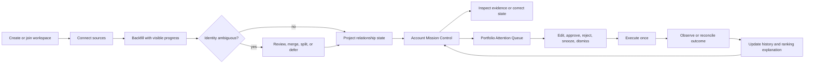
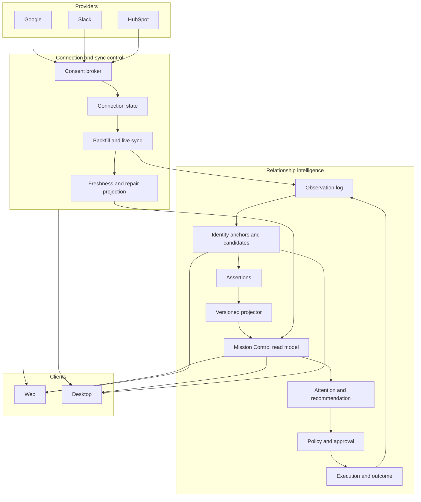

# RFC 038: Trustworthy First Account Beta

|                    |                                                                                                                                                                                                                                                                                                                                                                 |
| ------------------ | --------------------------------------------------------------------------------------------------------------------------------------------------------------------------------------------------------------------------------------------------------------------------------------------------------------------------------------------------------------- |
| **RFC**            | 038                                                                                                                                                                                                                                                                                                                                                             |
| **Status**         | Implemented; design-partner rollout remains fail-closed on the release evidence register                                                                                                                                                                                                                                                                        |
| **Track**          | Relationship intelligence — activation, trust, Account Mission Control, portfolio attention, governed action, and outcome learning                                                                                                                                                                                                                              |
| **Owners**         | `apps/rowboat-api`, `apps/rowboat-www`, `apps/x`, connector platform, product, SRE                                                                                                                                                                                                                                                                              |
| **Created**        | 2026-07-31                                                                                                                                                                                                                                                                                                                                                      |
| **Depends on**     | [RFC 036](./036-relationship-state-engine.md), [RFC 037](./037-conversation-intelligence-quality-and-follow-through.md), [RFC 020](./020-native-third-party-action-engine.md), [RFC 023](./023-closed-loop-actions.md), [RFC 031](./031-tiered-mail-storage-for-revenue-memory.md), [RFC 035](./035-meeting-intelligence-commitment-ledger.md)                  |
| **Related**        | [RFC 012](./012-connector-suite-and-consent-broker.md), [RFC 014](./014-live-note-observability-cost-and-provenance.md), [RFC 022](./022-unified-entity-graph.md), [RFC 025](./025-desktop-runtime-durability.md), [email-014](./email-014-sync-reliability-rate-limits-and-repair.md), [email-017](./email-017-onboarding-permissions-and-feature-adoption.md) |
| **Product brief**  | [Oppulence relationship-intelligence one-pager](../../docs/one-pager.md)                                                                                                                                                                                                                                                                                        |
| **Canonical spec** | RFC 036 remains authoritative for the relationship model, invariants, SLOs, and full production definition of done. This RFC defines the first releasable vertical slice and may not weaken RFC 036.                                                                                                                                                            |

## 1. Decision

Oppulence will ship a **Trustworthy First Account** beta before expanding the
relationship-intelligence feature surface.

The beta proves one complete production path:

> connect real evidence → resolve identity → project relationship state →
> explain change → identify needed action → obtain approval → execute once →
> observe the outcome → improve the next recommendation

A new customer-facing team must be able to connect its existing work systems,
open a real account, and trust Oppulence's answers to the four questions in RFC
036:

1. What is the state of this relationship?
2. What changed?
3. What evidence supports that?
4. What needs action now?

The release is not complete when a demo fixture renders, a connector returns
records, or an LLM produces a plausible summary. It is complete when the path
works for production-shaped customer data, exposes uncertainty honestly, and
survives the failure cases defined in this RFC.

This RFC is a delivery slice, not a competing architecture. RFC 036 owns the
domain and platform contract. RFC 037 owns the conversation-intelligence
quality program. RFC 038 selects, sequences, instruments, and gates the work
needed to turn those capabilities into the first coherent beta.

## 2. Required product proof

### 2.1 Beta covenant

For a workspace with at least one supported source, Oppulence must let an
authorized user:

1. connect Gmail and Google Calendar plus at least one of Slack or HubSpot;
2. understand requested scopes before granting access;
3. see backfill and live-sync progress without opening operator tooling;
4. see at least one relationship assembled from real evidence;
5. resolve or defer ambiguous identities without corrupting existing accounts;
6. open Account Mission Control and answer all four product questions;
7. inspect the exact evidence and freshness behind every material conclusion;
8. correct a state claim and see that correction synchronize across web and
   desktop;
9. approve, edit, reject, snooze, or dismiss a recommended action;
10. execute an approved Gmail, Slack, or HubSpot action exactly once;
11. see success, failure, or uncertain outcome truthfully represented;
12. see a later reply, meeting, correction, or provider result update the same
    relationship history;
13. see why a subsequent recommendation changed;
14. disconnect a source and immediately see the resulting completeness impact.

### 2.2 Activation target

For a pilot workspace that already contains relevant provider history:

- the user reaches the first projected relationship within 15 minutes of
  completing source authorization;
- the user reaches a reviewable Account Mission Control view without entering
  an internal workspace id or running a manual import command;
- the system identifies at least ten candidate relationships when the source
  corpus contains ten eligible external accounts;
- every incomplete, stale, rebuilding, or ambiguous condition is visible before
  it can be mistaken for healthy state;
- the first approved action and its outcome remain attached to the exact
  relationship, recommendation revision, evidence, and actor.

The 15-minute target measures product activation, not completion of an
unbounded historical backfill. The UI must allow useful partial results while
showing what remains incomplete.

### 2.3 Why this is the next release

SDK coverage and isolated summaries are not the product moat. The durable,
permissioned history connecting evidence, state, recommendation, decision,
execution, and outcome is the compounding asset. This beta is the first release
that makes that history tangible to a user from beginning to end.

## 3. Scope

### 3.1 Required beta scope

The beta includes:

- guided connection for Google, Slack, and HubSpot through the existing
  connector and consent infrastructure;
- source inventory, scope, backfill, freshness, lag, error, reconnect, resync,
  and disconnect states;
- exact-key identity resolution plus a durable ambiguity review workflow;
- Account Mission Control in both web and desktop;
- current state, meaningful change, evidence, participants, commitments, risks,
  milestones, recommendation, and source completeness;
- correction and retraction paths;
- a relationship-native Portfolio Attention Queue with readable reasons;
- approval-gated Gmail, Slack, and HubSpot actions;
- bounded reconciliation for uncertain provider outcomes;
- outcome observations and explainable recommendation-learning effects;
- desktop meeting or imported-transcript publication into the shared
  relationship history;
- activation, trust, quality, reliability, safety, and cost telemetry;
- workspace-scoped feature flags, canary rollout, and rollback controls.

### 3.2 Supported pilot boundary

The initial buyer remains a small customer-facing team managing valuable B2B
relationships: founder-led sales, account management, customer success,
partnerships, or high-touch services.

The supported pilot shape is:

- one Oppulence workspace;
- one or more authorized users with explicit roles;
- one or more Google accounts;
- zero or one Slack workspace for the first pilot cut;
- zero or one HubSpot portal for the first pilot cut;
- customer accounts from prospect through former customer;
- web and desktop clients on supported release versions.

Multi-Slack-workspace and multi-HubSpot-portal support must not be made
impossible by schema or key choices, but broad multi-account UX is not a beta
gate unless a selected pilot requires it.

### 3.3 Explicit non-goals

This beta does not include:

- autonomous outbound or approval bypass;
- fuzzy identity auto-merge;
- a numeric relationship-health score;
- replacing HubSpot as the authority for CRM-owned fields;
- copying complete provider histories without retention limits;
- every CRM, messaging, meeting, or support provider;
- general social-graph or employee-monitoring behavior;
- enterprise SSO, SCIM, legal hold administration, or multi-region GA;
- personalized model training from raw customer data;
- live coaching or mutual action plans as activation requirements;
- claiming RFC 036 complete.

## 4. Current-state audit

This audit describes the repository when this RFC was created. Each statement
must be revalidated when implementation begins.

### 4.1 Foundations already landed

The beta reuses:

- the canonical relationship, participant, observation, assertion, state
  snapshot, source-status, action, outcome, and workspace entities;
- encrypted raw observations and source-linked evidence;
- deterministic assertion precedence and projected relationship state;
- relationship list, detail, changes, evidence, corrections, source health,
  recommendations, approval, and rejection APIs;
- Account Mission Control surfaces in web and desktop;
- relationship identity anchors for email, company domain, and provider
  resource references;
- fail-closed handling of conflicting identity anchors;
- exact-provider references that keep same-domain people distinct;
- Gmail, Slack, Google Calendar, and HubSpot action executors with stable
  idempotency markers;
- bounded ambiguous-result reconciliation that does not repeat writes;
- action decisions and outcomes incorporated into recommendation history;
- conversation evidence, review, commitments, recovery, recommendation
  evaluation, and publication into shared relationship state;
- desktop capture preflight, local transcription, evidence outbox, and runtime
  schemas;
- source-health summaries in both relationship clients;
- CI coverage for tenant isolation, generated contract drift, desktop quality,
  lease concurrency, race detection, and provider reconciliation.

### 4.2 Gaps this RFC closes

The current implementation does not yet prove the beta covenant:

1. Assertions do not yet have the complete temporal lifecycle required by RFC
   036, including explicit validity, retraction, supersession, and compatibility
   metadata.
2. Projection is not yet a fully pure, versioned, durable, asynchronously
   replayable system with state hashes, dead letters, and operator-safe repair.
3. Relationship authorization remains short of the complete workspace-role and
   resource-permission model, and evidence encryption does not yet meet the
   per-tenant key-rotation and erasure gate.
4. Source status is primarily derived from accepted observations; it is not a
   complete user-facing connection and backfill state machine.
5. Empty states ask users to connect a source but do not provide one guided,
   measurable activation journey across consent, backfill, and first state.
6. Identity conflicts fail closed, but there is no complete durable candidate,
   decision, merge, split, and lineage review experience in both clients.
7. Account Mission Control has the major data sections, but the four product
   questions are not enforced as a single versioned read contract or acceptance
   suite.
8. Web and desktop duplicate important rendering and explanation logic, so
   parity is not guaranteed by automation.
9. The current queue and recommendation compatibility layer still carries
   revenue-oriented naming and assumptions.
10. Connector freshness, missing scopes, lag, rebuilding state, and repair
    actions are not consistently available in the relationship read model.
11. Provider execution is safer, but a pilot needs explicit user-facing
    uncertain-outcome and manual-review states.
12. Outcome learning exists, but activation telemetry and user-visible
    explanations do not yet prove that later recommendations improved.
13. There is no production-shaped, fresh-workspace E2E that starts at consent
    and ends with an observed action outcome across both clients.
14. Release ownership, feature flags, pilot operations, rollback, and incident
    runbooks are not assembled around this vertical slice.

## 5. Experience contract

### 5.1 Golden journey



### 5.2 Source onboarding

The user must never need to know an internal connector id, workspace id, cursor,
or backfill command. Each source card exposes:

- what evidence the source contributes;
- what actions, if any, it can perform;
- requested scopes and why they are required;
- account or workspace being connected;
- connection state;
- backfill phase and progress;
- last successful sync and last observation;
- current lag and expected cadence;
- missing or revoked scopes;
- latest safe error summary;
- retry, reconnect, resync, and disconnect actions;
- whether the relationship state is complete, partial, stale, or rebuilding as
  a result.

Useful partial data should appear during backfill. Partial state must be visibly
partial and cannot generate an external recommendation that depends on a
missing required source.

### 5.3 Identity review

An identity candidate shows:

- the proposed relationship or participant link;
- the exact anchors that matched or conflicted;
- source and provider records involved;
- evidence counts and time ranges;
- fields and history that would move;
- recommended decision and confidence, clearly labeled as advisory;
- merge, keep separate, move evidence, split, defer, and undo where valid;
- decision actor, reason, timestamp, and resulting lineage.

Deferring a candidate preserves both records and blocks only the evidence or
action that depends on the unresolved link. It must not block unrelated
relationships or silently choose a winner.

### 5.4 Account Mission Control

The account header must answer the four questions before secondary detail. The
read model contains one consistent `stateVersion` and `asOf` boundary for:

- **State:** lifecycle, engagement, sentiment, qualitative health, participants,
  commitments, risks, and milestones;
- **Change:** material differences since the user's last acknowledged review or
  the previous material snapshot;
- **Evidence:** winning assertion, evidence reference, observed time, source,
  freshness, authority, and confidence for every material value;
- **Action:** the recommended next move, readable factors, required policy,
  approval state, and alternatives;
- **Completeness:** source coverage, stale or missing required evidence,
  rebuilding state, and unresolved identities;
- **Control:** correction, retraction, identity review, source repair, action
  decision, and audit history.

The backend owns winning assertions, freshness, completeness, and factor data.
Clients may format these values but may not independently reinterpret them.

### 5.5 Portfolio Attention Queue

The queue is a relationship-native view, not a list of generic tasks. Each row
contains:

- relationship and current lifecycle;
- why attention is needed now;
- triggering commitments, risks, milestones, or source changes;
- evidence freshness and completeness;
- recommended action and alternatives;
- urgency band and readable ordering factors;
- current owner and approval state;
- snooze or dismissal state with reason;
- whether new evidence changed the recommendation since the last review.

Ordering may use an internal deterministic rank, but the product must not
present a single opaque account score.

### 5.6 Governed action and outcome

The review surface binds approval to the exact destination, channel, body,
structured payload, relationship, recommendation revision, policy decision,
evidence set, and actor. Editing creates a new revision and invalidates earlier
approval.

After execution, the UI shows exactly one of:

- succeeded with provider receipt;
- failed safely before the provider accepted the operation;
- outcome uncertain while read-only reconciliation runs;
- manual review required after bounded reconciliation;
- rejected, expired, superseded, or canceled before execution.

The system never represents an unknown result as success and never retries an
ambiguous write without proof that the first operation did not occur.

### 5.7 Desktop meeting extension

Desktop must prove its platform-specific value without creating a separate
relationship database:

1. preflight validates microphone, system audio when requested, model readiness,
   storage, and permissions;
2. capture or import produces a stable transcript artifact;
3. the user reviews material claims and commitments;
4. approved evidence publishes through the durable outbox;
5. web and desktop show the same resulting relationship state version;
6. a proposed recap or follow-up enters the same governed action workflow.

Capture failure cannot fabricate a complete meeting. Missing or silent tracks,
stalled transcription, and publication failure remain visible and repairable.

## 6. Delivery architecture



The connector platform owns provider authorization, credentials, triggers,
polling, rate limits, and raw provider cursors. The relationship service owns
how accepted observations affect identity and relationship state. Clients own
presentation and user decisions, not canonical interpretation.

## 7. Required contracts

The names below describe required semantics. Implementers may extend existing
endpoints and entities instead of creating parallel APIs when the existing
contract can satisfy the requirement compatibly.

### 7.1 Connection and source lifecycle

The relationship-facing source read model must represent:

```text
not_connected
authorizing
connected
backfilling
live
degraded
stale
rebuilding
reconnect_required
disconnected
```

It must include:

- stable source connection id and provider account id;
- workspace and consenting actor;
- granted and required scopes;
- backfill start, watermark, progress, and completion;
- live cursor or opaque cursor reference;
- expected cadence and calculated lag;
- last provider event, accepted observation, successful sync, and failed sync;
- safe error code, retry state, and user repair action;
- completeness impact;
- disconnect and revocation time.

Secrets, raw tokens, provider cursor contents, and sensitive error payloads must
not enter client contracts or analytics.

### 7.2 Identity candidate and decision

RFC 036's `IdentityCandidate`, `IdentityDecision`, alias, and lineage contracts
are beta requirements. A candidate is durable and uses optimistic versioning.
Decisions are immutable, actor-bound, and idempotent. Merge and split operations
must preserve observation, assertion, action, outcome, correction, and audit
lineage.

Required API families:

- list candidates by workspace, state, source, and relationship;
- inspect candidate evidence and proposed impact;
- decide merge, keep separate, move, split, or defer;
- view decision and lineage history;
- undo through a compensating decision where safe;
- stream resulting relationship-version changes to both clients.

### 7.3 Mission Control read model

One server-owned aggregate response must provide or reference:

- relationship projection and `stateVersion`;
- previous acknowledged or material state version;
- dimension-level changes;
- winning assertion ids and evidence refs;
- completeness and source-health summary;
- unresolved identity counts affecting the account;
- participants, commitments, risks, and milestones;
- active recommendation and factor explanation;
- pending correction, review, approval, execution, and reconciliation states;
- capability links for allowed operations;
- `asOf`, projector version, detector version, and freshness boundary.

Large evidence bodies remain separately authorized and fetched on demand. The
aggregate may link to them; it must not copy unrestricted raw payloads into a
convenience response.

### 7.4 Attention item

An attention item is a versioned projection over a relationship and one or more
detector results. It contains:

- stable id and relationship id;
- reason code and human-readable explanation;
- triggering object and evidence references;
- urgency band and explicit rank factors;
- source completeness requirements;
- recommendation id and revision when present;
- owner, created time, updated time, and expiry;
- acknowledgement, snooze, dismissal, and supersession state;
- detector and projector versions.

The implementation may initially adapt existing `RevenueAction` and scan data,
but the public contract and new code must use relationship-native terminology
and preserve the migration path to RFC 036's general recommendation model.

### 7.5 Activation and trust events

The product emits tenant-safe events for:

- onboarding viewed;
- authorization started, completed, canceled, or failed;
- first backfill progress and completion;
- first relationship projected;
- first Mission Control opened;
- evidence inspected;
- correction proposed and applied;
- identity candidate viewed and decided;
- recommendation viewed, edited, approved, rejected, snoozed, or dismissed;
- action executed and outcome observed;
- subsequent recommendation explanation viewed;
- source repaired, reconnected, resynced, or disconnected.

Events include workspace, actor, client, release, state version, source category,
and bounded reason codes. They exclude raw evidence, transcript text, message
bodies, recipient addresses, and provider tokens.

## 8. Workstreams

### TFA-0 — Correctness, authority, release controls, and observability

**Owner:** API + auth + security + SRE + product + clients

Deliver:

- typed assertion status, validity, retraction, supersession, extractor version,
  and projector compatibility metadata required by RFC 036 Phase 1;
- a pure versioned projector with explicit evaluation time and stable state hash;
- durable projection outbox, worker, optimistic transition, bounded retry, dead
  letter, replay command, and operator repair path;
- workspace roles and relationship-resource authorization enforced by query and
  mutation boundaries;
- per-tenant evidence envelope keys, key rotation, and cryptographic-erasure
  proof;
- workspace-scoped beta entitlement and per-capability kill switches;
- activation funnel and trust-event schema;
- trace continuity from connection through outcome;
- pilot dashboard, alert thresholds, and release evidence register;
- version support policy for web, desktop, API, and connector packages;
- production-shaped golden workspace and deterministic provider fixtures.

Proof:

- identical versioned inputs produce identical state hashes under replay;
- correction expiry, retraction, and supersession change projection at the
  explicit evaluation boundary;
- projection failure recovers without database edits and cannot partially
  publish a state version;
- tenant, workspace-role, and resource authorization matrices pass;
- tenant key rotation and erasure drills pass;
- one test workspace can enable and disable every risky capability without a
  deploy;
- traces join provider event to outcome without containing raw evidence;
- the dashboard distinguishes no data, incomplete data, system failure, user
  rejection, and provider uncertainty.

### TFA-1 — Guided connections and source health

**Owner:** Connector platform + API + web + desktop

Deliver:

- in-product Google, Slack, and HubSpot connection cards;
- progressive, least-privilege consent with capability explanation;
- durable backfill jobs, watermarks, retries, rate-limit handling, and resume;
- relationship-facing source lifecycle and completeness projection;
- reconnect, resync, and disconnect operations;
- partial-result rendering during backfill;
- source-health parity in web and desktop.

Proof:

- fresh-workspace E2E for each provider;
- cursor loss, revoked scope, rate limit, webhook duplication, provider outage,
  and reconnect fault tests;
- no source appears current after its required freshness boundary expires;
- disconnect changes affected relationship completeness within RFC 036's SLO.

### TFA-2 — Identity review and lineage

**Owner:** API + web + desktop

Deliver:

- durable identity candidates and decisions;
- exact-match anchor and collision generation rules;
- candidate impact preview;
- merge, keep separate, move, split, defer, and compensating undo;
- observation and relationship lineage;
- both-client inbox and account-scoped review surface;
- action blocking when its destination depends on unresolved identity.

Proof:

- zero fuzzy auto-merges in property tests;
- concurrent decisions resolve once without partial graph changes;
- merge followed by split restores lineage and preserves audit history;
- same-domain people remain distinct;
- no action executes against an unresolved destination.

### TFA-3 — Four-question Account Mission Control

**Owner:** API + shared client contract + web + desktop

Deliver:

- the versioned aggregate read model in section 7.3;
- one shared framework-neutral explanation and label package;
- state, change, evidence, action, and completeness hierarchy;
- acknowledgement boundary for “changed since my last review”;
- dimension-level evidence drawer;
- correction, retraction, and audit workflow;
- rebuilding, partial, stale, and ambiguous states;
- real-time cross-client invalidation;
- keyboard, screen-reader, responsive, and desktop-native behavior.

Proof:

- the same fixture produces the same state version, winning assertions,
  completeness, and recommendation factors in both clients;
- every material rendered value links to evidence or an explicit missing-state
  explanation;
- a correction in either client appears in the other within RFC 036's SLO;
- snapshot, accessibility, contract, and cross-client E2E suites pass.

### TFA-4 — Portfolio Attention Queue

**Owner:** API + intelligence + web + desktop

Deliver:

- relationship-native attention contract;
- initial high-precision detectors for quiet account, overdue commitment,
  unresolved risk, missing next step, source degradation, and action outcome
  requiring review;
- readable ordering factors and lifecycle-aware cooldowns;
- acknowledgement, snooze, dismissal, and supersession;
- daily refresh and event-driven refresh;
- direct navigation into the relevant Mission Control evidence and action.

Proof:

- each detector has a labeled corpus, precision gate, freshness dependency, and
  false-positive report;
- stale required sources suppress or downgrade unsafe recommendations;
- queue order and factors are deterministic for a fixed input version;
- dismissals and snoozes survive refresh without hiding materially new evidence.

### TFA-5 — Approval, execution, reconciliation, and outcomes

**Owner:** API actions + connectors + web + desktop

Deliver:

- revision-bound review for Gmail, Slack, and HubSpot actions;
- provider capability and destination validation;
- idempotency key generation and persistence before the write;
- provider receipt normalization;
- explicit ambiguous-result UI and bounded read-only reconciliation;
- manual-review path and operator diagnostics;
- reply, CRM mutation, and provider-result outcome observations;
- visible recommendation-factor changes attributable to decisions and outcomes.

Proof:

- repeated approval or worker delivery cannot duplicate an action;
- injected timeouts before and after provider acceptance resolve truthfully;
- unsupported backends fail closed;
- edits invalidate approval;
- outcomes enter the same relationship history and affect only versioned,
  explainable ranking factors;
- policy, tenant, revision, and concurrency suites pass under race detection.

### TFA-6 — Desktop meeting-to-relationship path

**Owner:** Desktop + API + conversation intelligence

Deliver:

- capture/import entry point from a relationship and relationship selection
  from a captured meeting;
- explicit microphone and optional system-audio preflight;
- capture and transcription progress, per-track health, recovery, and retry;
- reviewed conversation changes and commitments;
- durable evidence publication outbox;
- shared-state confirmation in web and desktop;
- recap or follow-up proposal through TFA-5.

Proof:

- microphone-only, system-audio, mixed-track, permission loss, silent-track,
  disk-pressure, crash-recovery, offline-publication, and reconnect E2E;
- exact quotes remain linked to the transcript fingerprint and timestamps;
- no unreviewed material conversation claim bypasses configured review policy;
- deletion and retention operate across local and published artifacts.

### TFA-7 — Pilot operations, privacy, and support

**Owner:** Product + security + SRE + support

Deliver:

- pilot invitation, workspace setup, and role checklist;
- retention defaults and customer-visible data map;
- support-safe diagnostics and export bundle with redaction;
- runbooks for sync lag, bad identity decision, projection failure, duplicate
  prevention, uncertain execution, and evidence deletion;
- canary promotion and rollback playbook;
- structured weekly trust review with pilot users.

Proof:

- support can diagnose a failed golden journey without database access or raw
  evidence exposure;
- deletion, disconnect, and credential revocation drills pass;
- a bad projector, detector, connector, or executor version can be disabled or
  rolled back without corrupting history;
- pilot exit evidence is recorded for every release gate.

## 9. Implementation sequence

The phases are cumulative. Later phases cannot waive earlier gates.

### Phase A — Establish the production trust boundary

Work packages:

| ID  | Deliverable                                             | Primary workstream | Exit proof                                 |
| --- | ------------------------------------------------------- | ------------------ | ------------------------------------------ |
| A-1 | Typed temporal assertion lifecycle                      | TFA-0              | Migration, expiry, and retraction tests    |
| A-2 | Pure versioned projector and stable state hash          | TFA-0              | Determinism and property suite             |
| A-3 | Durable projection worker, dead letter, replay, repair  | TFA-0              | Fault and full-corpus replay tests         |
| A-4 | Workspace roles and relationship authorization          | TFA-0              | Tenant and role matrix                     |
| A-5 | Per-tenant evidence keys, rotation, and erasure         | TFA-0              | Rotation and deletion drill                |
| A-6 | Beta flags and capability matrix                        | TFA-0              | Workspace kill-switch test                 |
| A-7 | Activation, trust, trace, and cost contracts            | TFA-0              | Privacy review and schema tests            |
| A-8 | Golden workspace, provider fixtures, and baseline board | TFA-0              | Synthetic golden journey reaches dashboard |

Exit gate:

- deterministic replay passes for the complete relationship corpus;
- temporal expiry, correction retraction, and supersession are authoritative;
- no unscoped relationship or evidence read or mutation path remains;
- projection failures recover without manual database edits;
- per-tenant keys rotate and erase successfully;
- implementation can be canaried and measured before pilot data arrives;
- telemetry contains no raw evidence or provider secrets;
- every later acceptance test has an owner and evidence location.

### Phase B — Connect and build safely

Work packages:

| ID  | Deliverable                                       | Primary workstream | Depends on | Exit proof                   |
| --- | ------------------------------------------------- | ------------------ | ---------- | ---------------------------- |
| B-1 | Source lifecycle and completeness contract        | TFA-1              | A-2, A-3   | API contract suite           |
| B-2 | Google guided connect and resumable backfill      | TFA-1              | B-1        | Fresh-workspace E2E          |
| B-3 | Slack guided connect and resumable backfill       | TFA-1              | B-1        | Fresh-workspace E2E          |
| B-4 | HubSpot guided connect and resumable backfill     | TFA-1              | B-1        | Fresh-workspace E2E          |
| B-5 | Identity candidate, decision, and lineage schemas | TFA-2              | A-2, A-4   | Migration and property tests |
| B-6 | Identity review API and both-client surfaces      | TFA-2              | B-5        | Concurrent cross-client E2E  |
| B-7 | Source repair and disconnect completeness impact  | TFA-1              | B-2–B-4    | Fault-injection E2E          |

Exit gate:

- a new user can connect sources without operator assistance;
- useful partial relationships appear during backfill;
- identity ambiguity cannot silently contaminate a relationship;
- source health remains truthful through rate limits, revocation, disconnect,
  cursor loss, and rebuilding.

### Phase C — Make one account trustworthy

Work packages:

| ID  | Deliverable                                      | Primary workstream | Depends on | Exit proof                    |
| --- | ------------------------------------------------ | ------------------ | ---------- | ----------------------------- |
| C-1 | Mission Control aggregate contract               | TFA-3              | B-1, B-5   | Generated contract build      |
| C-2 | Shared explanation, completeness, and labels     | TFA-3              | C-1        | Shared behavior suite         |
| C-3 | Four-question web experience                     | TFA-3              | C-2        | Web E2E and accessibility     |
| C-4 | Four-question desktop experience                 | TFA-3              | C-2        | Desktop E2E and accessibility |
| C-5 | Correction, retraction, and acknowledgement sync | TFA-3              | C-3, C-4   | Cross-client SLO test         |
| C-6 | Account-level identity and source repair entry   | TFA-2, TFA-3       | B-6, B-7   | Fault and recovery E2E        |

Exit gate:

- both clients answer all four product questions from the same state version;
- every material value is sourced or explicitly marked missing;
- a user correction wins, synchronizes, remains auditable, and can be
  retracted;
- a pilot user can complete the first-account journey inside the activation
  target.

### Phase D — Find, act, and learn

Work packages:

| ID  | Deliverable                                      | Primary workstream | Depends on | Exit proof                     |
| --- | ------------------------------------------------ | ------------------ | ---------- | ------------------------------ |
| D-1 | Relationship-native attention projection         | TFA-4              | C-1        | Determinism and detector tests |
| D-2 | Portfolio Attention Queue in both clients        | TFA-4              | D-1, C-2   | Parity and behavior E2E        |
| D-3 | Gmail, Slack, and HubSpot governed action review | TFA-5              | C-1        | Revision and policy suite      |
| D-4 | Receipt and ambiguous-result experience          | TFA-5              | D-3        | Provider timeout fault suite   |
| D-5 | Outcome observations and learning explanation    | TFA-5              | D-4        | Closed-loop golden journey     |
| D-6 | Desktop meeting-to-relationship path             | TFA-6              | C-1, D-3   | Capture-to-outcome E2E         |

Exit gate:

- the queue contains only explainable, freshness-aware attention items;
- an approved action executes once and has a truthful terminal or manual-review
  state;
- outcome evidence returns to relationship history;
- later recommendation changes expose the decision or outcome factors that
  changed them;
- a reviewed desktop meeting can update the same account visible on web.

### Phase E — Pilot and release decision

Work packages:

| ID  | Deliverable                                      | Primary workstream | Depends on | Exit proof                      |
| --- | ------------------------------------------------ | ------------------ | ---------- | ------------------------------- |
| E-1 | Internal dogfood on production-shaped workspaces | TFA-7              | A–D        | Two-week evidence register      |
| E-2 | Design-partner canary                            | TFA-7              | E-1        | Cohort metrics and trust review |
| E-3 | Reliability, privacy, and incident drills        | TFA-7              | E-1        | Signed drill reports            |
| E-4 | Beta go/no-go review                             | All                | E-2, E-3   | Release owner sign-off          |

Exit gate:

- all release gates in section 13 pass;
- no unresolved P0 or P1 issue remains in the golden journey;
- pilot users meet the qualitative trust bar and quantitative activation bar;
- support and rollback paths have been exercised, not merely documented.

### 9.1 Critical path

The required order is:

1. temporal assertions and a pure versioned projector;
2. durable projection, replay, dead letters, and repair;
3. workspace authority and per-tenant evidence keys;
4. release flags and safe telemetry;
5. source lifecycle and resumable backfill;
6. durable identity review and lineage;
7. server-owned Mission Control read contract;
8. cross-client correction and completeness parity;
9. relationship-native attention projection;
10. governed execution and ambiguous-result UX;
11. outcome observation and learning explanation;
12. desktop meeting publication into the same loop;
13. dogfood, canary, drills, and beta decision.

Client polish may run in parallel once its server contract is stable. Connector
packages may run in parallel after the source lifecycle contract is fixed.
Executors may be tested in parallel, but no external action is enabled for a
pilot workspace before identity, completeness, policy, revision, and
idempotency gates pass.

## 10. End-to-end acceptance suite

### 10.1 Fresh workspace golden journey

The automated journey must:

1. create a workspace and authorized member;
2. connect Google and one of Slack or HubSpot through test consent;
3. begin backfill and render partial progress;
4. ingest duplicate and out-of-order provider events safely;
5. create at least ten eligible relationships from the fixture;
6. produce one intentional identity conflict;
7. defer the conflict and prove unrelated accounts continue;
8. resolve the conflict and prove lineage;
9. open the same account in web and desktop;
10. assert equal state version, completeness, evidence, and recommendation;
11. inspect evidence and apply a correction in one client;
12. observe the correction in the other client;
13. open an attention item and edit its proposed action;
14. prove prior approval is invalid after the edit;
15. approve and execute the revised action;
16. inject a provider timeout after acceptance;
17. reconcile the operation without repeating it;
18. ingest a reply or provider outcome;
19. show the outcome in the relationship timeline;
20. show the factor-level reason the next recommendation changed;
21. disconnect a source and show the completeness downgrade;
22. reconnect and resume without duplicating history.

### 10.2 Desktop conversation journey

The automated journey must:

1. run capture preflight;
2. capture or import a two-speaker fixture;
3. exercise a missing or silent optional track;
4. recover or continue with an honest degraded state;
5. transcribe and create reviewable claims and commitments;
6. reject one claim and correct one commitment;
7. publish approved evidence through the offline-capable outbox;
8. show the resulting state in web and desktop;
9. propose a follow-up and route it through the governed action path;
10. delete the local artifact and verify configured retention behavior for the
    shared evidence snapshot.

### 10.3 Mandatory failure cases

The suite also covers:

- OAuth cancellation, missing scope, revocation, and expired credential;
- provider rate limit and outage;
- stale cursor and full rebuild;
- duplicate webhook and replay;
- same-domain people and recycled email addresses;
- concurrent identity decisions;
- projection retry and dead letter;
- stale client correction;
- missing evidence reference;
- stale required source;
- rejected and expired approval;
- worker redelivery;
- provider timeout before and after acceptance;
- unsupported execution backend;
- outcome watcher delay;
- desktop offline capture and publication;
- tenant and role boundary violations;
- deletion during backfill, projection, and outcome reconciliation.

## 11. Metrics and service levels

### 11.1 North-star proof

For each reviewed relationship, record whether the user accepted, corrected, or
could not verify:

- current state;
- material change;
- supporting evidence;
- recommended next action.

The beta north-star is the percentage of weekly reviewed relationships for
which all four answers are accepted or deliberately corrected and no required
source is silently stale.

### 11.2 Activation metrics

- authorization start-to-success rate by source;
- time from authorization to first accepted observation;
- time from authorization to first projected relationship;
- time to first Mission Control review;
- percentage of eligible workspaces reaching ten relationships;
- time to first identity decision;
- time to first evidence inspection;
- time to first correction or accepted state;
- time to first recommendation decision;
- time to first executed action and observed outcome;
- onboarding abandonment and failure reason.

### 11.3 Trust and quality metrics

- state acceptance and correction rate by dimension;
- unsupported material claim rate;
- percentage of material state with accessible evidence;
- stale source shown as complete;
- identity candidate rate and median resolution time;
- incorrect merge and compensating split rate;
- recommendation approval, edit, rejection, snooze, and dismissal rate;
- action success, failure, uncertainty, manual-review, and duplicate rate;
- outcome capture rate;
- percentage of recommendation changes with an inspectable explanation;
- web/desktop state-version drift;
- capture preflight failure, track degradation, transcription retry, and
  publication-lag rate.

### 11.4 SLOs

RFC 036 section 17.1 remains authoritative. In particular:

- provider event to projected state: p95 under 60 seconds;
- client correction to the other client: p95 under 5 seconds;
- approval to execution receipt: p95 under 30 seconds, provider permitting;
- relationship detail cached response: p95 under 500 ms;
- duplicate execution: zero;
- cross-tenant evidence exposure: zero;
- replay determinism: identical state hashes for identical versioned inputs.

Backfill has separate progress and freshness objectives because completion time
depends on corpus size and provider quotas. The product activation target is
first useful state within 15 minutes, with truthful progress thereafter.

### 11.5 Guardrails

Any of the following pauses rollout:

- cross-tenant access or evidence exposure;
- unauthorized or duplicate external action;
- incorrect identity auto-merge;
- unknown execution result presented as success;
- user correction silently displaced by automation;
- material claim without accessible evidence;
- stale required source presented as complete;
- unrecoverable relationship lineage;
- raw evidence in analytics, logs, traces, or support bundles;
- parity drift that changes a user decision between web and desktop.

## 12. Security, privacy, and retention

- Connector consent is explicit, scoped, revocable, and bound to workspace and
  actor.
- Tokens remain in the credential broker and never enter relationship or client
  DTOs.
- Observation and evidence access uses the same tenant and role boundary as the
  relationship.
- Raw message bodies and transcripts follow RFC 031 and RFC 037 retention and
  redaction policy.
- Analytics use categorical reason codes and identifiers, not raw content.
- Support diagnostics default to metadata and require explicit audited access
  for any evidence reveal.
- Disconnect stops future collection and updates completeness immediately; it
  does not silently erase historical assertions that retention policy permits.
- Deletion propagates through raw evidence, derived artifacts, local desktop
  copies, indexes, and caches according to the configured policy.
- Action payload previews show exactly what will leave Oppulence and through
  which provider.
- Prompt-injection and untrusted-content boundaries apply before evidence is
  supplied to any model or tool.

## 13. Release gates

No design-partner workspace may enable external execution until all gates below
pass. Read-only internal dogfood may begin earlier behind workspace flags.

1. Temporal assertion, pure projector, state-hash, durable worker, dead-letter,
   replay, and operator-repair suites pass for the complete golden corpus.
2. Workspace-role and resource-authorization matrices plus tenant key rotation
   and erasure drills pass.
3. Source authorization, backfill, freshness, and repair E2E passes for each
   enabled source.
4. Identity collision, decision, lineage, merge, split, defer, and undo suites
   pass.
5. The four-question parity suite passes against the same state version in web
   and desktop.
6. Every material value in the golden corpus has evidence or an explicit
   missing-state reason.
7. Correction precedence, retraction, stale-baseline, and cross-client SLO
   tests pass.
8. Each enabled detector meets its declared corpus precision and freshness
   gate.
9. Policy, revision, idempotency, uncertain-result, reconciliation, and worker
   redelivery suites pass for each enabled executor.
10. Duplicate execution remains zero under concurrency and fault injection.
11. Outcome ingestion and recommendation-factor explanation pass the closed-loop
    E2E.
12. Desktop capture preflight, degraded-track, crash recovery, offline outbox,
    and deletion suites pass.
13. API, generated clients, desktop quality, web quality, race, migration,
    replay, load, security, and contract-drift CI is green.
14. Activation, trust, reliability, guardrail, and cost dashboards are live.
15. Support, incident, rollback, credential-revocation, and deletion drills are
    signed off.
16. No open P0 or P1 issue affects the golden journey.
17. A named release owner links the evidence for every gate and records the
    go/no-go decision.

## 14. Rollout and rollback

### 14.1 Rollout stages

1. **Synthetic:** CI and staging fixtures only.
2. **Internal read-only:** employee workspaces; connectors and Mission Control,
   no external execution.
3. **Internal governed action:** selected employee workspaces with one executor
   at a time.
4. **Design-partner read-only:** real pilot data, corrections, and attention
   queue; no writes for the initial observation window.
5. **Design-partner governed action:** per-workspace, per-channel enablement.
6. **Beta:** supported cohort after release-gate review.

### 14.2 Feature controls

Controls are workspace-scoped and independently disable:

- each source connection and live-sync consumer;
- model extraction while preserving deterministic ingestion;
- each detector;
- each external action channel;
- outcome-informed ranking lift;
- desktop evidence publication;
- real-time updates, with polling fallback;
- the beta navigation entry points.

Disabling a feature stops new work but does not delete audit history or mutate
previous state. Rollback of projector, detector, or extractor versions uses
versioned replay or shadow state; it does not edit historical observations.

### 14.3 Pilot operating rhythm

During canary and design-partner stages:

- review activation failures daily;
- review every identity merge and uncertain execution;
- sample corrected and rejected recommendations weekly;
- compare web and desktop state versions continuously;
- review freshness and backfill lag by source;
- review model cost per accepted assertion and approved recommendation;
- conduct a weekly trust interview using the four product questions;
- record decisions and evidence in the release register.

## 15. Definition of done

RFC 038 is complete only when current evidence proves all of the following:

- a fresh supported workspace completes the golden journey without operator
  commands or internal identifiers;
- temporal assertions and the pure versioned projector pass deterministic
  replay, expiry, retraction, supersession, and recovery gates;
- workspace roles and relationship-resource authorization are enforced, and
  per-tenant evidence keys pass rotation and erasure drills;
- first useful relationship state meets the activation target for
  production-shaped pilot fixtures;
- Google plus Slack or HubSpot can backfill, go live, degrade, repair,
  disconnect, and reconnect truthfully;
- identity ambiguity is durable, reviewable in both clients, and never resolved
  through fuzzy auto-merge;
- Account Mission Control answers the four product questions from one versioned
  server-owned read model;
- every material conclusion is source-linked or explicitly incomplete;
- corrections and identity decisions synchronize across clients and preserve
  audit history;
- the attention queue is relationship-native, freshness-aware, explainable,
  and evaluated;
- Gmail, Slack, and HubSpot pilot actions are revision-bound, approval-gated,
  idempotent, reconciled, and audited;
- outcomes update the same relationship history and the next recommendation
  explains relevant learning effects;
- a desktop meeting or imported transcript can become reviewed shared evidence
  and a governed follow-up without creating separate canonical state;
- all section 13 release gates pass;
- design-partner evidence demonstrates that users can trust or deliberately
  correct all four answers;
- rollout and rollback have both been exercised;
- no P0 or P1 golden-journey issue remains open;
- the release owner signs the beta decision and links the evidence register.

Completion of RFC 038 proves the first beta. It does not by itself complete RFC
036's broader enterprise, scale, provider, and generalization program.

## 16. Risks and mitigations

| Risk                                     | Consequence                                         | Mitigation                                                                                  |
| ---------------------------------------- | --------------------------------------------------- | ------------------------------------------------------------------------------------------- |
| Backfill takes too long                  | User abandons before seeing value                   | Partial projections, progress, bounded history, priority accounts, resumable jobs           |
| Wrong identity link                      | Evidence and actions attach to the wrong customer   | Exact anchors, durable candidates, impact preview, fail closed, lineage, compensating split |
| Missing source appears healthy           | User trusts incomplete state                        | Completeness projection, cadence and lag, visible stale/rebuilding state                    |
| Four-question UI becomes a large dossier | The important answer is buried                      | Fixed information hierarchy, progressive evidence reveal, task-based usability tests        |
| Queue becomes noisy                      | Users ignore recommendations                        | High-precision launch detectors, freshness requirements, cooldowns, dismissals, evals       |
| Provider timeout duplicates a write      | Customer receives repeated action                   | Persisted idempotency marker, uncertain state, read-only reconciliation, no blind retry     |
| Learning hides why ranking changed       | Product becomes another opaque score                | Versioned factors, before/after explanation, shadow rollout, user controls                  |
| Client divergence                        | Web and desktop produce different decisions         | Generated contract, shared behavior package, parity fixtures, continuous drift metric       |
| Transcript publication leaks data        | Privacy and trust failure                           | Preflight, review policy, encryption, redaction, retention, explicit publication status     |
| Pilot support requires raw DB access     | Slow recovery and privacy risk                      | User-facing repair, redacted diagnostics, audit-safe support bundle, runbooks               |
| Vertical slice forks RFC 036             | Short-term beta creates long-term architecture debt | RFC 036 invariants remain authoritative; adapters require explicit migration path           |

## 17. Beta release policy decisions

The accountable role defaults below are implemented for the beta. The named
people occupying those roles are recorded in the release evidence register
before design-partner rollout:

1. Product owns a three-design-partner cohort. Google plus HubSpot is the
   primary path; Google plus Slack is supported.
2. Connector owners default to Gmail 90 days, Calendar 180 days, Slack 90 days,
   and HubSpot 365 days, bounded further by customer retention policy.
3. Intelligence owns freshness-aware detector dependencies. Quiet-account and
   missing-next-step signals are suppressed when their relationship evidence is
   degraded. Every external action additionally requires its live provider and
   exact progressive write scope.
4. “Changed since last review” is user-specific over a shared immutable state
   version.
5. Connector platform supports a relationship-associated HubSpot note first,
   with a constrained task only for an explicit reviewed task action and due
   date.
6. Security limits the first Slack beta to connected public channels and
   explicitly selected private channels. Direct-message ingestion is excluded.
7. Privacy stops collection immediately on disconnect and retains only history
   permitted by the workspace policy. Deletion and tenant-key destruction stay
   independently authoritative.
8. Product requires at least 20 reviewed relationships in each of three design
   partners, at least 90% accepted-or-deliberately-corrected four-answer
   reviews, and zero invariant guardrail breaches.
9. Connector, intelligence, actions, desktop, and SRE leads own their scoped
   switches; SRE owns global beta and release-approval disablement.

These decisions may tune rollout policy. They may not weaken tenant isolation,
evidence requirements, identity fail-closed behavior, explicit approval,
idempotency, truthful uncertainty, correction precedence, or web/desktop
parity.

## 18. Implementation anchors

Implementation should extend the current seams rather than create parallel
relationship systems:

- `apps/rowboat-api/internal/revenue/relationship_state.go`
- `apps/rowboat-api/internal/revenue/handler.go`
- `apps/rowboat-api/internal/revenue/ambiguous_reconciliation.go`
- `apps/rowboat-api/internal/revenue/outcome_learning.go`
- `apps/rowboat-api/internal/revenue/conversation_intelligence.go`
- `apps/rowboat-api/internal/revenue/executor_gmail.go`
- `apps/rowboat-api/internal/revenue/executor_channels.go`
- `apps/rowboat-api/ent/schema/relationship*.go`
- `apps/rowboat-api/ent/schema/revenue_action.go`
- `apps/rowboat-api/api/openapi.json`
- `packages/rowboat-api-client-ts`
- `apps/rowboat-www/components/revenue/relationships-view.tsx`
- `apps/rowboat-www/components/revenue/queue-view.tsx`
- `apps/rowboat-www/components/revenue/review-sheet.tsx`
- `apps/x/packages/shared/src/relationships.ts`
- `apps/x/packages/core/src/relationships`
- `apps/x/apps/main/src/ipc.ts`
- `apps/x/apps/renderer/src/components/relationships-view.tsx`
- `apps/x/packages/core/src/voice`
- `apps/x/packages/core/src/meetings`

Each work package must add its authoritative code, migration, contract,
generated-client, fixture, test, telemetry, rollout flag, runbook, and release
evidence links to this RFC as implementation lands.

## 19. Implementation evidence and rollout boundary

The implementation is anchored by:

- `internal/revenue/trustworthy_first_account_beta_test.go` for the named
  22-step fresh-workspace relationship journey;
- `internal/revenue/relationship_attention_corpus_test.go` for per-detector
  labeled precision, freshness, false-positive, and false-negative gates;
- `internal/revenue/mission_control_test.go` for exact-snapshot evidence,
  projection-backlog safety, aggregate parity, acknowledgement, correction, and
  progressive action-scope behavior;
- `internal/revenue/release_controls_test.go` for workspace rollout controls,
  live provider write scopes, and design-partner release-owner signoff;
- desktop relationship publication, outbox, capture guardian, recovery,
  retention, and microphone/system-audio suites under `apps/x`;
- generated `api/openapi.json`, `packages/rowboat-api-client-ts`, and the shared
  `packages/relationship-contract` package;
- the redacted administrator support bundle at
  `GET /v1/relationship-beta/diagnostics`;
- runbooks, pilot data map, version policy, rollout/rollback playbook, and the
  machine-validated evidence register in
  `docs/trustworthy-first-account-beta/`.

Validate register structure with:

```sh
make -C apps/rowboat-api tfa-release-register-validate
```

The governed-action check intentionally fails until a named release owner has
attached current evidence and signed every required gate:

```sh
make -C apps/rowboat-api tfa-release-governed-check
```

Code completion does not fabricate the two-week dogfood, design-partner trust
sample, live dashboard, incident drill, or go/no-go evidence. Those gates remain
`pending` in the checked-in register and the runtime keeps design-partner writes
disabled until `release_gate_approval` is explicitly signed and the provider is
live with the exact write scope.
