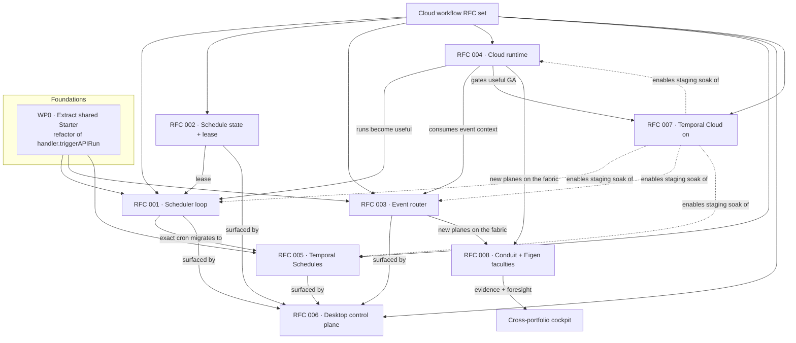
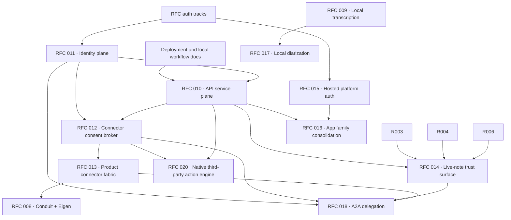
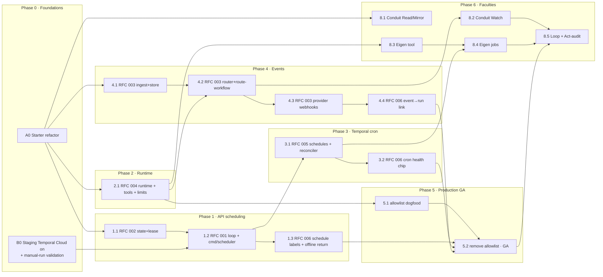

# Rowboat RFC Set

This directory holds Rowboat architecture RFCs. It started with the cloud-native
background workflow set and now also carries the related service plane, auth,
connector, product-fabric, observability, app-boundary, local-model, product
strategy, and future agent-delegation tracks. Email feature RFCs use the `email-{number}-{value}`
prefix so they can evolve as a product track without renumbering the platform
RFC sequence.

The first set takes Rowboat's background tasks from **cloud-executed but
desktop-driven** to **fully cloud-native** — scheduled, event-driven, and useful
while the desktop app is closed.

This RFC set is the canonical architecture and implementation-design record.
Older planning docs that were folded into these RFCs were removed from `docs/`
to avoid parallel sources of truth.

> **The thesis in one sentence:** today an `executionTarget: api` task is _executed_ in the
> cloud (Temporal worker) but _initiated_ by the desktop's 15-second poll — so closing the
> laptop silently pauses every scheduled and event-driven cloud job. These RFCs move
> initiation (cron, windows, events) and a real execution runtime into the Rowboat API,
> and turn the desktop into the **control plane** that observes it.

## Cloud workflow RFCs

| #                                                      | Title                           | Layer           | What it adds                                                                                                                    |
| ------------------------------------------------------ | ------------------------------- | --------------- | ------------------------------------------------------------------------------------------------------------------------------- |
| [001](./complete-001-api-owned-scheduler.md)           | API-Owned Scheduler             | rowboat-api     | A scheduler process that evaluates cron/window triggers server-side and fires runs while the desktop is offline.                |
| [002](./complete-002-durable-schedule-state.md)        | Durable Schedule State & Leases | ent / Postgres  | A `BackgroundTaskScheduleState` entity + atomic lease so N scheduler replicas fire each cycle exactly once.                     |
| [003](./complete-003-cloud-event-ingestion.md)         | Cloud Event Ingestion           | rowboat-api     | An event envelope + ingestion/routing layer that starts `trigger=event` cloud runs from Gmail/Calendar/Slack/webhooks.          |
| [004](./complete-004-cloud-agent-runtime.md)           | Cloud-Safe Agent Runtime        | Temporal worker | The first production runtime: LLM access, a scoped/audited tool surface, connector reads, and enforced limits.                  |
| [005](./complete-005-temporal-schedule-integration.md) | Temporal Schedule Integration   | Temporal        | Exact-cron triggers via durable Temporal Schedules (windows/events stay in Rowboat code).                                       |
| [006](./complete-006-desktop-cloud-control-plane.md)   | Desktop as Control Plane        | apps/x          | Makes cloud-managed schedules legible: next run, schedule health, runs-while-closed, event→run links.                           |
| [007](./007-production-cloud-enablement.md)            | Production Enablement           | Helm / infra    | Flips Temporal Cloud on in staging→production with SLOs, PromQL alerts, and runbooks.                                           |
| [008](./008-conduit-eigen-faculties.md)                | Conduit & Eigen Faculties       | cross-portfolio | Plugs the **evidence** (Conduit) and **foresight** (Eigen) planes into the event bus + runtime — the federated financial brain. |

RFCs 001–007 build the execution plane; **008** is the first _faculty_ RFC that proves the
fabric extends to new portfolio planes. **001–006** are **Complete** (003 with its GCP
provisioning companion [019](./019-google-push-infrastructure.md); 004 is the cloud agent
runtime; 005 is enabled by default (`TEMPORAL_SCHEDULES_ENABLED=false` is the rollback); 006 is the desktop control
plane over all of them); **007** remains **Draft**. Each carries a metadata block, grounded `file:line` references into the current
codebase, mermaid diagrams, a **Decisions** section (resolved forks), and a test plan.

## Other RFCs

Not part of the cloud-workflows set above, but living here under the same RFC conventions:

| #                                                           | Title                                         | Layer                | What it adds                                                                                                                                                                                                                                                                                  |
| ----------------------------------------------------------- | --------------------------------------------- | -------------------- | --------------------------------------------------------------------------------------------------------------------------------------------------------------------------------------------------------------------------------------------------------------------------------------------- |
| [009](./complete-009-local-on-device-transcription.md)      | Local On-Device Transcription (whisper.cpp)   | apps/x               | An on-device STT provider (whisper.cpp) as a cheaper, private alternative to Deepgram streaming; tiers local vs cloud **by feature** (voice -> local, meetings -> cloud-with-quota).                                                                                                          |
| [010](./complete-010-rowboat-api-service-plane.md)          | Rowboat API Service Plane                     | rowboat-api          | Canonical Go backend boundary for desktop cloud features: config/me, LLM gateway, billing/credits, Google OAuth broker, provider proxies, ent schemas, kind/deploy, and observability.                                                                                                        |
| [011](./complete-011-identity-and-authorization-plane.md)   | Identity and Authorization Plane              | auth / platform      | Resolves the WorkOS-direct-now vs Hydra/Ory-later split; defines token modes, user/org identity, service-to-service auth, step-up, and migration rules.                                                                                                                                       |
| [012](./012-connector-suite-and-consent-broker.md)          | Connector Suite and Consent Broker            | rowboat-api / OAuth  | Account linking, scope catalog, consent UI, token broker, resource-server libraries, entitlement gates, money-touching approval tokens, revocation, and connector observability.                                                                                                              |
| [013](./013-oppulence-product-connector-fabric.md)          | Oppulence Product Connector Fabric            | apps/x + products    | Canvas, Cadence, Corinthian, Conduit, and Eigen product connectors using read/mirror/watch/act semantics over the shared connector and cloud-runtime fabric.                                                                                                                                  |
| [014](./014-live-note-observability-cost-and-provenance.md) | Live-Note Observability, Cost, and Provenance | apps/x + api         | Per-live-note run history, trigger health, cost, budget controls, provenance sidecars, generated-vs-source-backed labeling, silent-trigger detection, and trust-facing error taxonomy.                                                                                                        |
| [015](./015-rowboat-platform-workos-fga-and-widget-auth.md) | Rowboat Platform WorkOS FGA and Widget Auth   | apps/rowboat         | Hosted platform WorkOS migration: AuthKit, organizations, FGA project resources, org/project API key semantics, widget session JWTs, billing hooks, and Auth0 migration.                                                                                                                      |
| [016](./016-app-family-consolidation.md)                    | App Family Consolidation                      | repo / apps          | Canonical app tiers and contract ownership across desktop, hosted platform, Go service plane, SDK, CLI, static frontends, widgets, experiments, simulation runner, and docs.                                                                                                                  |
| [017](./complete-017-on-device-meeting-diarization.md)      | On-Device Meeting Diarization                 | apps/x               | A local speaker diarization follow-up to RFC 009: VAD, speaker embeddings, clustering, alignment, provenance, quality gates, and a beta meetings mode that does not replace cloud diarization until it passes product gates.                                                                  |
| [018](./018-a2a-delegation-and-agent-identity.md)           | A2A Delegation and Agent Identity             | future protocol      | User-bound agent identity, scoped delegation tokens, A2A/MCP adapter boundaries, approval policy, connector-scope enforcement, and delegation-chain provenance for future cross-agent workflows.                                                                                              |
| [019](./019-google-push-infrastructure.md)                  | Google Push Infrastructure                    | GCP / infra          | The operator-provisioned GCP half of RFC 003: Pub/Sub topic + Gmail publish grant + push subscription, Calendar domain verification, token rotation, verification, and the OIDC push-auth follow-up.                                                                                          |
| [020](./020-native-third-party-action-engine.md)            | Native Third-Party Tool & Connector Engine    | rowboat-api + apps/x | A native, in-house replacement for legacy integration vendor: a provider/action catalog (declarative manifests, OpenAPI-bootstrapped), an OAuth broker (reusing RFC 012), and a server-side execution engine — all exposed to the agent over MCP, to cut per-call vendor cost and keep tool metadata in-house. |

## Finance command center & desktop foundations

The set below (021–026) hardens the desktop's memory/runtime foundations and composes them — with the existing fabric (006/008/013/020) — into a **finance command center** for a finance operator/founder over Conduitt (AR), Cadence (AP), and Eigen (stress-testing). 026 is the umbrella; 021–025 are the foundations it depends on. All **Draft**.

| #                                              | Title                                                                    | Layer              | What it adds                                                                                                                                                              |
| ---------------------------------------------- | ------------------------------------------------------------------------ | ------------------ | ------------------------------------------------------------------------------------------------------------------------------------------------------------------------- |
| [021](./complete-021-semantic-memory-index.md) | Semantic Retrieval & Memory Index                                        | apps/x (+ api)     | A local, incremental embedding index over the vault + a `memory-search` builtin doing hybrid (vector + BM25) recall; lexical `file-grep` won't scale a large KB.          |
| [022](./022-unified-entity-graph.md)           | Unified Entity Graph — Stable IDs, Reconciliation & Shared Memory        | apps/x + api       | Stable ULID + `resourceRefs` per entity reconciling a desktop Company/Person to product records (Conduitt/Cadence/Eigen), plus an optional FGA-scoped team spine.         |
| [023](./023-closed-loop-actions.md)            | Operating Business Objects — Closed-Loop Actions (HITL)                  | api + apps/x       | propose → approve → execute → watch: agents operate invoices/bills via Act-seam tools with single-use scoped approval tokens; the product's return event closes the loop. |
| [024](./024-cold-primitives-ga.md)             | Finishing the Cold Primitives                                            | apps/x             | Turns on four wired-but-cold capabilities: a Slack event producer, Code Mode GA, an agent-schedule UI, and note version history.                                          |
| [025](./025-desktop-runtime-durability.md)     | Desktop Runtime Durability — Local Queue, Backpressure & Multi-Workspace | apps/x             | Replaces in-memory run guards with a crash-safe SQLite job queue (at-most-once), adds event coalescing/backpressure, and supports multiple workspaces without restart.    |
| [026](./026-finance-command-center.md)         | The Finance Command Center                                               | product (umbrella) | Composes 021–025 + 006/008/013/020 into the operator/founder cockpit (AR inbox · AP queue · cash & exposure · agent activity); personas, killer workflows, build order.   |

## Durable agent runtime

RFC 027 generalizes the cloud runtime ([004](./complete-004-cloud-agent-runtime.md)) — whose agent loop runs entirely **inside one Temporal activity** — into a per-step durable, multi-tenant, multi-turn agent framework (a Temporal/Go analogue of Vercel's eve). It lifts the reason→act loop into workflow code so each LLM/tool call is a checkpointed activity, and adds sessions/turns, an HTTP surface, HITL approvals, subagents (child workflows), channels, and streaming observability. **027** defines the runtime + the hybrid `AgentDefinition`; **028** adds the **YAML/GitOps authoring** layer over it (one canonical shape, three front doors). **027 is Complete**; **028** is **Draft.**

| #                                              | Title                         | Layer                  | What it adds                                                                                                                                                                                                                                                                                                                                                                               |
| ---------------------------------------------- | ----------------------------- | ---------------------- | ------------------------------------------------------------------------------------------------------------------------------------------------------------------------------------------------------------------------------------------------------------------------------------------------------------------------------------------------------------------------------------------ |
| [027](./complete-027-durable-agent-runtime.md) | Durable Agent Runtime         | rowboat-api            | Lifts the RFC 004 loop into a durable `rowboat.agent.session.v1` workflow; adds declarative `AgentDefinition`s, sessions/turns over `/v1/agent-sessions`, Update-delivered turns, HITL approvals, subagents-as-child-workflows, NDJSON streaming, and per-turn/per-session budgets.                                                                                                        |
| [028](./028-declarative-agent-definitions.md)  | Declarative Agent Definitions | rowboat-api + apps/cli | Extends 027's `AgentDefinition` with a versioned **YAML** authoring format (`agent.yaml` + `instructions.md`), one shared JSON-Schema validator (tool names vs the Go registry, model allowlist, RFC 012 scopes), embedded/tenant/**GitOps** delivery, a `rowboat agent validate/push` CLI, revision-pinned sessions, and declarative OpenAPI/MCP tools (RFC 020) referenceable from YAML. |

## Product strategy

RFC 029 is the product wedge that turns the runtime and memory primitives into a
specific buyer-facing promise: founder/operator follow-through. RFC 030 turns
that wedge into a cross-product revenue loop with OutboundConsole research and
governance plus the email-verification backend, while preserving independent
repositories and databases. The control tower remains the main product point,
with the agent builder, graph, MCP layer, Temporal runtime, research sessions,
and verification pipelines as infrastructure underneath that promise.

| #                                                  | Title                                              | Layer                                              | What it adds                                                                                                                                                                                                                         |
| -------------------------------------------------- | -------------------------------------------------- | -------------------------------------------------- | ------------------------------------------------------------------------------------------------------------------------------------------------------------------------------------------------------------------------------------ |
| [029](./029-founder-operating-memory.md)           | Founder Operating Memory and Control Tower         | product + apps/x + rowboat-api                     | Daily founder brief, follow-up queue, relationship/deal memory, approval-gated actions, job portfolio, metrics, and build order around the "nothing important slips" wedge.                                                          |
| [030](./030-revenue-memory-outbound-governance.md) | Revenue Memory and Outbound Governance Integration | rowboat-api + OutboundConsole + email verification | Three-service warm-revenue loop: relationship memory and RevenueAction queue in Rowboat, composed research/verification policy in OutboundConsole, approval-gated Gmail execution, durable outcomes, identity, privacy, and rollout. |

## Email feature RFCs

This set translates the email capabilities studied from Inbox Zero into
Rowboat's desktop-first architecture. The track starts with a source inventory
and provider-neutral mailbox foundation, then layers the command center,
automation rules, reply workflows, cleanup, insights, attachment/calendar/channel
integrations, assistant chat, reliability, privacy, evals, onboarding,
multi-account boundaries, debug tooling, implementation sequencing, and concrete
implementation blueprints with code examples.

| #                                                                           | Title                                                 | Layer                    | What it adds                                                                                                                                                |
| --------------------------------------------------------------------------- | ----------------------------------------------------- | ------------------------ | ----------------------------------------------------------------------------------------------------------------------------------------------------------- |
| [email-000](./email-000-inbox-zero-agent-reference.md)                      | Inbox Zero Agent Reference Map                        | implementation reference | Exact Inbox Zero docs, schema models, utilities, routes, and tests that implementation agents should inspect for each Rowboat email RFC.                    |
| [email-001](./email-001-mailbox-provider-foundation.md)                     | Mailbox Provider Foundation                           | apps/x + rowboat-api     | Provider-neutral mailbox accounts, capabilities, sync/watch primitives, local store, and broker API shape over Gmail first and Outlook later.               |
| [email-002](./email-002-mailbox-command-center.md)                          | Mailbox Command Center                                | apps/x renderer          | A desktop mailbox workspace for triage, reading, composing, queues, inspector context, and provider-neutral actions.                                        |
| [email-003](./email-003-ai-rules-and-action-engine.md)                      | AI Rules and Mail Action Engine                       | apps/x + rowboat-api     | Static/AI/learned email rules, action catalog, delayed actions, webhook/digest actions, audit trails, safety policy, and rule testing.                      |
| [email-004](./email-004-reply-zero-and-drafting.md)                         | Reply Zero and AI Drafting                            | apps/x                   | Needs Reply/Awaiting Reply trackers, AI draft suggestions, nudge drafts, writing style memory, and outbound/inbound state transitions.                      |
| [email-005](./email-005-newsletter-cleanup-and-cold-email-defense.md)       | Newsletter Cleanup and Cold Email Defense             | apps/x + provider rules  | Sender profiles, newsletter decisions, cold outreach detection, bulk archive jobs, safe unsubscribe, and provider filters.                                  |
| [email-006](./email-006-digest-analytics-and-insights.md)                   | Digests, Analytics, and Mail Insights                 | apps/x + optional cloud  | Digest queues/schedules, email analytics, response-time metrics, automation impact reporting, and local-first privacy boundaries.                           |
| [email-007](./email-007-attachments-calendar-and-channels.md)               | Attachments, Calendar Context, and Messaging Channels | apps/x + connectors      | Attachment filing, local/cloud destinations, calendar availability for drafts, booking links, and Slack/Telegram-style notification routes.                 |
| [email-008](./email-008-email-platform-api-and-ecosystem.md)                | Email Platform API and Ecosystem                      | apps/x + rowboat-api     | Scoped API keys, local/broker API surfaces, signed webhooks, assistant chat APIs, import/export, and integration audit controls.                            |
| [email-009](./email-009-inbox-zero-source-inventory.md)                     | Inbox Zero Source Inventory and Feature Map           | product / architecture   | Source inventory mapping Inbox Zero capabilities to Rowboat RFCs, current Rowboat anchors, ownership, decisions, and milestones.                            |
| [email-010](./email-010-ai-mail-assistant-chat.md)                          | AI Mail Assistant Chat                                | apps/x + runtime         | Mail-aware assistant tools for search, summaries, drafts, explanations, proposed actions, rule authoring, chat memory, and channel extension.               |
| [email-011](./email-011-smart-categories-tabs-and-labels.md)                | Smart Categories, Tabs, and Labels                    | apps/x + core            | Native desktop tabs, query views, smart categories, provider label sync, correction metadata, and reusable category assignments.                            |
| [email-012](./email-012-mail-search-semantic-memory-and-knowledge.md)       | Mail Search, Semantic Memory, and Knowledge           | apps/x + RFC 021         | Exact search, semantic retrieval, summaries, knowledge, learned memory, retention, redaction, and mailbox-specific indexing policy.                         |
| [email-013](./email-013-meeting-briefs-and-relationship-context.md)         | Meeting Briefs and Relationship Context               | apps/x + connectors      | Upcoming meeting briefs from calendar events, external attendees, email history, relationship context, optional web research, and delivery channels.        |
| [email-014](./email-014-sync-reliability-rate-limits-and-repair.md)         | Sync Reliability, Rate Limits, and Repair             | apps/x + rowboat-api     | Provider backoff, cursor repair, watch renewal, durable sync jobs, provider action reconciliation, health state, and repair tools.                          |
| [email-015](./email-015-email-privacy-security-and-governance.md)           | Email Privacy, Security, and Governance               | platform + apps/x        | Data classes, model routing, prompt-injection defense, retention, external payload policy, secrets handling, and audit requirements.                        |
| [email-016](./email-016-email-evaluation-and-quality-gates.md)              | Email Evaluation and Quality Gates                    | AI/runtime + tests       | Eval datasets, metrics, synthetic fixtures, prompt/model tracking, rule testing, draft rubrics, and release gates for risky automation.                     |
| [email-017](./email-017-onboarding-permissions-and-feature-adoption.md)     | Onboarding, Permissions, and Feature Adoption         | apps/x + OAuth           | Progressive account setup, least-privilege scopes, feature cards, migration from existing Gmail sync, reconnect/revocation states, and adoption telemetry.  |
| [email-018](./email-018-email-product-roadmap-and-build-order.md)           | Email Product Roadmap and Build Order                 | product / delivery       | Milestone plan for current Gmail hardening, mailbox foundation, safe AI ops, cleanup/insights, integrations, ecosystem, multi-account, and Outlook.         |
| [email-019](./email-019-multi-account-organizations-and-team-boundaries.md) | Multi-Account, Organizations, and Team Boundaries     | platform + apps/x        | Account-scoped data and actions, cross-account search policy, sending safety, future organization policies, team stats boundaries, and API scope.           |
| [email-020](./email-020-email-debug-console-and-operator-tools.md)          | Email Debug Console and Operator Tools                | apps/x + core            | Account health, sync jobs, rule history, drafts, reply tracker, memory, external deliveries, redacted diagnostics, and thread "why" views.                  |
| [email-021](./email-021-implementation-blueprints-and-code-examples.md)     | Implementation Blueprints and Code Examples           | implementation reference | Concrete TypeScript and Go sketches for provider adapters, local store, IPC, rules, actions, policy, sync backoff, assistant tools, evals, and broker APIs. |

## Dependency graph

`★ Critical path ─────────────────────────────────`
The spine is **WP0 (shared `Starter`) → RFC 002 (lease) → RFC 001 (loop)**. Everything that
creates a cloud run (the loop, the event router, the Temporal-schedule workflow) funnels
through the one `Starter`, so extracting it first prevents run-provenance drift. RFC 002
lands just before RFC 001's loop so the scheduler is lease-aware on day one and going from
one replica to many is a `replicaCount` change, not a code change.
`──────────────────────────────────────────────────`

### Cross-track dependency graph

## Implementation order

Two tracks run in parallel: **Track A** builds capabilities; **Track B** lights up the
environment they soak in. Each phase ends in a hard gate.

### Phase 0 — Foundations & environment

| WP      | RFC | Work                                                                                                                                                                                                                                  | Done when                                                                                                       |
| ------- | --- | ------------------------------------------------------------------------------------------------------------------------------------------------------------------------------------------------------------------------------------- | --------------------------------------------------------------------------------------------------------------- |
| **0·A** | 001 | Extract `handler.triggerAPIRun`'s "create queued run → emit `temporal.queued` → `StartBackgroundTaskRun` → persist Temporal ids → `metrics.Triggered`" into an internal `Starter.Start`. Pure refactor; HTTP path behavior unchanged. | `handler_cloud_test.go` green; HTTP trigger output byte-identical (`viewRun`).                                  |
| **0·B** | 007 | Provision the staging Temporal Cloud namespace + key (into `rowboat-api-secrets` via Infisical); flip staging `TEMPORAL_ENABLED=true`, `worker.enabled: true` (1 replica).                                                            | API `/readyz` shows passing `temporal` check; a manual api-target run from desktop→staging reaches `succeeded`. |

> 0·A and 0·B are independent and run together. 0·B reuses the **already-shipped** manual
> cloud-run path, so it validates Temporal Cloud connectivity before any new code lands.

### Phase 1 — API-owned timed scheduling (the core offline win)

| WP      | RFC | Work                                                                                                                                                                                                  | Done when                                                             |
| ------- | --- | ----------------------------------------------------------------------------------------------------------------------------------------------------------------------------------------------------- | --------------------------------------------------------------------- |
| **1.1** | 002 | `BackgroundTaskScheduleState` ent schema + additive migration (`make migrate-dump`), lease primitives (`Acquire`/`Complete`/`Release`), **Postgres testcontainer** concurrency tests.                 | Concurrent `Acquire` on one key → exactly one winner (Postgres test). |
| **1.2** | 001 | `internal/backgroundscheduler` due-math (`gronx`, ported from `schedule/utils.ts`) + lease-wired loop + `cmd/scheduler` binary + `scheduler-deployment.yaml`, behind `CLOUD_SCHEDULER_ENABLED=false`. | kind: desktop killed, cron task fires within two grace windows.       |
| **1.3** | 006 | Desktop `Cloud scheduled` vs `Runs when desktop is open` labels; `GET /v1/background-tasks/{slug}/schedule-state` + `bg-task:getCloudScheduleState`; offline-return badge.                            | Renderer tests for both labels + the error states.                    |

**Gate 1:** kind E2E desktop-closed cron fires; staging **multi-replica** scheduler produces
exactly one run per cycle (`cloud_scheduler_duplicate_suppressed_total` > 0).

### Phase 2 — Useful cloud runtime _(parallel with Phase 1)_

| WP      | RFC | Work                                                                                                                                                                                                                                                                            | Done when                                                                                                                       |
| ------- | --- | ------------------------------------------------------------------------------------------------------------------------------------------------------------------------------------------------------------------------------------------------------------------------------- | ------------------------------------------------------------------------------------------------------------------------------- |
| **2.1** | 004 | `internal/backgroundtaskruntime` (`Runtime`/`ToolRegistry`/`ArtifactStore`/`EventSink`/`LLMClient`), `DefaultRuntime` (gateway LLM, Gmail+Calendar read tools, enforced limits, heartbeats) + `NoopRuntime`; extend `errcodes.go` + `metrics.go`; flag `CLOUD_RUNTIME_ENABLED`. | Staging api-target task produces an LLM-generated artifact; `Lookup("shell")` → denied; each limit fails with its `error_code`. |

**Gate 2:** runtime soaks in staging with the deterministic `NoopRuntime` as instant
rollback. **This gate blocks _useful_ GA** (Phase 5) — you don't GA scheduled runs that only
emit static artifacts.

### Phase 3 — Exact cron via Temporal Schedules

| WP      | RFC | Work                                                                                                                                                                                                                                                  | Done when                                                                              |
| ------- | --- | ----------------------------------------------------------------------------------------------------------------------------------------------------------------------------------------------------------------------------------------------------- | -------------------------------------------------------------------------------------- |
| **3.1** | 005 | `SchedulerWorkflow` (`rowboat.background_tasks.schedule.v1`) + `CreateScheduledRun` activity + schedule upsert/delete/pause hooks in `Create`/`Patch`/`Delete` + reconciler + `schedule_sync_state` field; behind `TEMPORAL_SCHEDULES_ENABLED=false`. | A Temporal Schedule fires → run row exists → `BackgroundTaskWorkflow` runs (test env). |
| **3.2** | 006 | Desktop cron sync-health chip (`current/syncing/failed/paused`) + next-fire from `ScheduleClient.Describe`.                                                                                                                                           | Renderer shows health + next-fire.                                                     |

**Gate 3:** cron fires via a Temporal Schedule with the desktop closed; the reconciler repairs
induced drift (deleted/orphaned/wrong-pause). RFC 001 loop remains the fallback.

### Phase 4 — Event-triggered cloud runs

| WP      | RFC | Work                                                                                                                                                                                                 | Done when                                                       |
| ------- | --- | ---------------------------------------------------------------------------------------------------------------------------------------------------------------------------------------------------- | --------------------------------------------------------------- |
| **4.1** | 003 | `CloudEvent` schema (encrypted `payload_json`) + `POST /v1/events` + dedupe (store only).                                                                                                            | Duplicate `dedupeKey` → one row, `deduped=true`.                |
| **4.2** | 003 | Temporal route-workflow (`rowboat.cloud_events.route.v1`) + two-pass router (threshold `0.7`) → `Starter.Start(trigger=event)`; link runs via `cloud_event_id`; flag `CLOUD_EVENTS_ROUTING_ENABLED`. | devstack event → linked `trigger=event` run; no duplicate runs. |
| **4.3** | 003 | Gmail/Calendar webhook ingestion (signature verify); Slack/webhook later.                                                                                                                            | Signed provider event ingests; bad/stale signature rejected.    |
| **4.4** | 006 | Event→run link in the transcript ("Triggered by …").                                                                                                                                                 | Transcript shows the source event.                              |

**Gate 4:** devstack event with the desktop closed fires a linked run; signature + dedupe
hold.

### Phase 5 — Production GA

| WP      | RFC | Work                                                                                                              | Done when                                                                         |
| ------- | --- | ----------------------------------------------------------------------------------------------------------------- | --------------------------------------------------------------------------------- |
| **5.1** | 007 | Enable the production worker; gate api-target **task creation** behind the user-id allowlist; dogfood internally. | Internal dogfood tasks run in prod; no regressions.                               |
| **5.2** | 007 | Remove the allowlist after SLOs hold; enable user-facing api-execution controls.                                  | SLOs (success ≥ 99%, queue p95 ≤ 30s) hold over the soak; alerts + runbooks live. |

### Phase 6 — Faculties (Conduit + Eigen) — [RFC 008](./008-conduit-eigen-faculties.md)

The portfolio-brain layer. Conduit Read/Mirror is independent (parallel with Phase 1); the
autonomous loop builds on the event bus (RFC 003) + runtime (RFC 004) + scheduler (RFC 001/005).

| WP      | RFC | Work                                                                                                                             | Done when                                                               |
| ------- | --- | -------------------------------------------------------------------------------------------------------------------------------- | ----------------------------------------------------------------------- |
| **8.1** | 008 | Conduit **Read/Mirror**: connector entry + `sync_conduit.ts` → invoice notes carry their correspondence. _(parallel w/ Phase 1)_ | An invoice note shows its dispute/reply thread.                         |
| **8.2** | 008 | Conduit **Watch**: extend RFC 003 `source` enum + `POST /v1/webhooks/conduit` + routing. _(after Phase 4)_                       | A dispute event wakes the owning agent, desktop closed.                 |
| **8.3** | 008 | Eigen **tool**: `eigen.simulate` in the RFC 004 registry. _(after Phase 2)_                                                      | An agent quantifies an action's runway impact mid-run.                  |
| **8.4** | 008 | Eigen **jobs**: `rowboat.eigen.stress.v1` scheduled + event-triggered re-runs + `eigen.breach`. _(after Phase 3)_                | Nightly stress note in the corpus; a breach wakes an agent.             |
| **8.5** | 008 | **Combined loop + Act-audit**: dual-review send → Conduit bind-back; RFC 006 surfacing. _(after Phase 5)_                        | Dispute → forecast → reviewed action → bound-back evidence, end to end. |

**Gate 6:** the Conduit→Eigen→Agent→Conduit loop runs desktop-closed with end-to-end
provenance; reads are scoped, money-touching actions double-gated, Eigen never moves money.

### Cross-track implementation order

These tracks can run alongside the cloud-workflow phases, but they have their own gates.

| Phase  | RFCs     | Work                                                                     | Gate                                                                              |
| ------ | -------- | ------------------------------------------------------------------------ | --------------------------------------------------------------------------------- |
| **S0** | 010, 011 | Stabilize the Go service plane and settle WorkOS-direct auth boundaries. | Desktop can call service-plane APIs with documented auth and tenant checks.       |
| **S1** | 012, 013 | Add connector consent broker and product connector fabric.               | A product connector can read/mirror/watch with consent, audit, and revocation.    |
| **T0** | 014      | Add live-note run health, cost, provenance, and trigger observability.   | A user can explain why a note changed, what it cost, and which sources backed it. |
| **H0** | 015      | Migrate hosted platform auth/widget session design to WorkOS/FGA.        | Hosted projects, API keys, and widget sessions have one auth model.               |
| **R0** | 016      | Mark canonical apps, clients, and experiments.                           | No prototype app is documented as a supported production surface by accident.     |
| **L0** | 017      | Prototype local meeting diarization behind a beta flag.                  | Local meetings can produce speaker labels with measured DER/performance gates.    |
| **F0** | 018      | Model agent identity and delegation before external A2A adapters.        | Delegated work is user-bound, scope-bound, and visible in provenance.             |

## Consolidated decisions

The forks each RFC raised, resolved. (Each RFC's own **Decisions** section links here.)

### Cross-cutting

| Decision                  | Choice                                                                                                                                                                                              | Affects            |
| ------------------------- | --------------------------------------------------------------------------------------------------------------------------------------------------------------------------------------------------- | ------------------ |
| **Run creation**          | One extracted `Starter.Start` is the _only_ way an `executor=api` run is created — HTTP, scheduler, event router, and the Temporal schedule-workflow all call it.                                   | 001, 003, 005      |
| **Timezone (v1)**         | Evaluate cron prev-occurrence and window bands in **UTC** (`CLOUD_SCHEDULER_TIMEZONE=UTC`); "once per day" = UTC day.                                                                               | 001, 002, 005, 006 |
| **Per-task timezone**     | Committed **fast-follow** (post-v1): a task-level `timezone` field adds a TZ segment to the RFC 002 schedule key, sets Temporal `TimeZoneName` (RFC 005), and gets a desktop label (RFC 006).       | 001, 002, 005, 006 |
| **Everything ships dark** | Each capability lands behind a default-off flag (`CLOUD_SCHEDULER_ENABLED`, `CLOUD_RUNTIME_ENABLED`, `TEMPORAL_SCHEDULES_ENABLED`, `CLOUD_EVENTS_ROUTING_ENABLED`) and rolls kind → staging → prod. | all                |

### Per-RFC

- **001** — Separate `cmd/scheduler` Deployment (not a goroutine in `cmd/server`); cron via
  **`github.com/adhocore/gronx`** (`PrevTick`); lease-aware from day one.
- **002** — Row-based ent lease (not advisory locks/Redis); **30-day** retention for fired
  cycles; write `last_evaluated_at` only on state transitions; **Postgres testcontainer** in
  CI for the `ON CONFLICT` guard.
- **003** — Linkage **option (A)** (`cloud_event_id` FK + `routing_json` summary);
  **encrypt `payload_json`** at rest (`crypto.Sealer`); **async routing via a Temporal
  route-workflow**; match threshold **`0.7`, fixed in v1**; `GET /v1/events` admin-scoped
  (desktop shows only the event→run _link_).
- **004** — **Hand-rolled** bounded agent loop; **Temporal heartbeats wired in v1**; v1
  connector tools = **Gmail + Google Calendar read**; **per-tenant** limits (no per-task
  override); `CLOUD_RUNTIME_ENABLED` selects `Default`/`Noop` runtime.
- **005** — Overlap policy **`SKIP`**; persisted **`schedule_sync_state`** task field
  (reconciler is authority); UTC v1; loop-first then per-task cutover (loop stays fallback).
- **006** — Offline-return = **activity badge + opt-in OS notification**; **event→run link**
  in the transcript; auto-pull **latest successful artifact per task** since `lastSeenCloudRunAt`.
- **007** — Worker: staging **1** replica, prod starts at **2** (`200m/256Mi`→`1/512Mi`),
  re-tuned from soak; **single-region** worker + one Temporal namespace per env; Phase-3
  allowlist = a **DB/env user-id list**.
- **008** — Conduit ingests **via RFC 003** (offline-capable), payload encrypted; faculties
  are **read-only at the tool layer** (`conduit.read` / `eigen.simulate`) — all
  money-touching action stays behind the **dual-review** gate and Eigen never moves money;
  Eigen plugs in as **both** a runtime tool _and_ a scheduled/triggered job; **mirror durable
  identity, query volatile numbers**; breach threshold is config (`EIGEN_LIQUIDITY_FLOOR_WEEKS`),
  not per-task.
- **009** — Local voice STT uses **whisper.cpp**; feature-tiering stays explicit:
  voice can default local, meetings stay cloud-with-quota until diarization quality is solved.
- **010** — `apps/rowboat-api` is the canonical Go service plane for desktop cloud features:
  config/me, LLM gateway, billing/credits, OAuth broker, provider proxies, ent schemas, and
  deploy/observability conventions live there.
- **011** — WorkOS-direct is the current production auth path; Hydra/Ory-style brokered
  auth is a future self-hosted/enterprise mode, not a prerequisite for near-term delivery.
- **012** — Connector access goes through one consent broker with explicit scopes,
  revocation, entitlement checks, and approval tokens for money-touching actions.
- **013** — Product connectors share read/mirror/watch/act semantics; Cadence remains the
  product-facing connector name while Billflow can stay as a legacy/API alias.
- **014** — Live notes need a trust surface: trigger health, run history, cost, provenance,
  source-backed/generated labeling, and budget kill switches are product requirements.
- **015** — Hosted platform auth moves to WorkOS AuthKit/Organizations/FGA; widget sessions
  use short-lived widget JWTs distinct from WorkOS user sessions and project API keys.
- **016** — Keep three Tier 1 surfaces: desktop (`apps/x`), hosted platform (`apps/rowboat`),
  and Go service plane (`apps/rowboat-api`); SDK/CLI/widget consume those contracts instead
  of inventing independent backends.
- **017** — Local meeting diarization is a beta follow-up to RFC 009; speaker labels are
  anonymous and meeting-scoped, and cloud meetings remain the default until quality gates pass.
- **018** — Agent delegation is user-bound, scope-bound, audience-bound, short-lived, and
  auditable; protocol adapters translate A2A/MCP messages but never own policy.
- **027** — The reason→act loop moves **out of the single activity and into workflow code**
  (per-step durable; RFC 004's in-activity loop becomes the legacy/`Noop` path); agents are a
  **hybrid** (type-safe Go tool registry + declarative `AgentDefinition` ent rows + embedded
  first-party directory); turns/approvals use Temporal **Update** (Signal kept for cancel/pause);
  history is bounded via **ContinueAsNew** under a stable session workflow id; **sandbox/code-exec
  is deferred**; everything ships behind `AGENT_RUNTIME_ENABLED=false`.
- **028** — **YAML is a source format**, not a new runtime path: it compiles into RFC 027's
  `AgentDefinition` (one canonical shape; embedded / API / GitOps front doors). **One JSON Schema**
  (via `sigs.k8s.io/yaml`) validates YAML files, the JSON API body, and the offline CLI; tool names
  validate against the Go registry, model against the `internal/llm` allowlist, scopes against the
  RFC 012 catalog. YAML **configures** code-backed tools freely but **declares** new OpenAPI/MCP
  tools only via RFC 020 manifests (trust-gated). **Secrets never in YAML** (scopes only);
  definitions are **immutable + revision-pinned** (sessions pin `agent_revision`); GitOps uses the
  RFC 005 reconciler pattern (`managed_by=gitops` is authoritative). Behind `AGENT_YAML_ENABLED=false`.

## Conventions

Implementers across these RFCs share these so the system stays coherent.

### New Go packages

| Package                                      | Owns                                                                                                                                      |
| -------------------------------------------- | ----------------------------------------------------------------------------------------------------------------------------------------- |
| `internal/backgroundtaskruns`                | the shared `Starter` (extracted from the handler)                                                                                         |
| `internal/backgroundscheduler`               | RFC 001 loop, `gronx` due-math, RFC 002 lease helpers, scheduler metrics                                                                  |
| `internal/cloudevents`                       | RFC 003 ingestion, router, normalization, metrics                                                                                         |
| `internal/backgroundtaskruntime`             | RFC 004 runtime, tool registry, limits                                                                                                    |
| `internal/backgroundtaskworkflow` _(extend)_ | RFC 005 `SchedulerWorkflow` + schedule helpers; RFC 004 activity delegates to the runtime                                                 |
| `internal/faculties` _(thin)_                | RFC 008 Conduit/Eigen glue: `conduit.read`/`eigen.simulate` tools, `rowboat.eigen.stress.v1`, faculty metrics — mostly reuses RFC 003/004 |

New binaries mirror `cmd/worker/main.go` (config load → telemetry → db → `/metrics` +
`/healthz` → signal-aware loop): `cmd/scheduler`.

### Config keys (env)

All new keys land in `internal/appconfig/config.go` (`Config` struct + `Load` defaults), in
the `TEMPORAL_*` style, surfaced via the Helm ConfigMap.

| Prefix                            | RFC     | Examples                                                                                                                                                     |
| --------------------------------- | ------- | ------------------------------------------------------------------------------------------------------------------------------------------------------------ |
| `CLOUD_SCHEDULER_*`               | 001/002 | `ENABLED`, `POLL_INTERVAL=15s`, `LEASE_TTL=60s`, `REPLICA_ID`, `TIMEZONE=UTC`                                                                                |
| `CLOUD_RUNTIME_*`                 | 004     | `ENABLED`, `MAX_DURATION=4m`, `MAX_LLM_CALLS=12`, `MAX_TOOL_CALLS=24`, `MAX_ARTIFACT_BYTES`, `MAX_EVENT_BYTES`                                               |
| `CLOUD_EVENTS_*`                  | 003     | `ROUTING_ENABLED`, `MATCH_THRESHOLD=0.7`                                                                                                                     |
| `TEMPORAL_SCHEDULE*`              | 005     | `TEMPORAL_SCHEDULES_ENABLED`, `TEMPORAL_SCHEDULE_CATCHUP=1m`, `TEMPORAL_SCHEDULE_RECONCILE_INTERVAL=5m`                                                      |
| `FACULTY_* / EIGEN_* / CONDUIT_*` | 008     | `FACULTY_CONDUIT_ENABLED`, `FACULTY_EIGEN_ENABLED`, `EIGEN_BASE_URL`, `CONDUIT_BASE_URL`, `EIGEN_STRESS_SCHEDULE=0 6 * * *`, `EIGEN_LIQUIDITY_FLOOR_WEEKS=8` |
| `ROWBOAT_API_* / WORKOS_*`        | 010/011 | service-plane public URLs, WorkOS issuer/client/audience, token modes, service auth, and local kind overrides                                                |
| `CONNECTOR_* / OAUTH_*`           | 012/013 | provider client ids/secrets, redirect URLs, consent scopes, revocation settings, product connector enablement                                                |
| `LIVE_NOTE_* / COST_*`            | 014     | provenance sidecars, budget thresholds, silent-trigger alerts, run-history retention                                                                         |
| `WIDGET_* / WORKOS_FGA_*`         | 015     | hosted widget session issuer/audience/TTL, WorkOS FGA resource settings, hosted API-key behavior                                                             |
| `LOCAL_DIARIZATION_*`             | 017     | beta enablement, model path/version, VAD aggressiveness, local quality/performance gates                                                                     |
| `DELEGATION_* / A2A_*`            | 018     | delegation token TTL, adapter enablement, external trust policy, tenant-level disable switches                                                               |

### Metric families

All Prometheus series live in leaf metrics packages (the pattern in
`internal/backgroundtaskmetrics/metrics.go`) so the HTTP API, scheduler, and worker can each
emit and expose them on their own `/metrics`. **Cardinality rule (hard):** label only by
bounded dimensions — `trigger`, `error_code`, `source`, `tool` (fixed allowlist). **Never**
by `taskSlug` / `userId` / `runId` — those go to logs and traces.

| Family                                  | RFC      |
| --------------------------------------- | -------- |
| `cloud_runs_*`, `cloud_run_*` (exists)  | base     |
| `cloud_scheduler_*`                     | 001, 002 |
| `cloud_events_*`, `cloud_event_*`       | 003      |
| `cloud_runtime_*`                       | 004      |
| `temporal_schedule*`                    | 005      |
| `faculty_eigen_*`, `faculty_conduit_*`  | 008      |
| `rowboat_api_*`, `auth_*`               | 010, 011 |
| `connector_*`, `consent_*`              | 012, 013 |
| `live_note_*`, `provenance_*`, `cost_*` | 014      |
| `widget_auth_*`, `workos_fga_*`         | 015      |
| `local_diarization_*`                   | 017      |
| `delegation_*`, `agent_identity_*`      | 018      |

### Vocabularies & ids

- **Run id prefixes:** `api-trigger-` (manual), `retry-`, `remote-trigger-` (existing);
  `sched-cron-`, `sched-window-` (RFC 001), `sched-temporal-` (RFC 005), `event-` (RFC 003),
  `eigen-stress-` (RFC 008).
- **Event sources** (`CloudEvent.source`, RFC 003): `gmail`, `google_calendar`, `slack`,
  `webhook`, `internal`; RFC 008 adds the portfolio + faculties: `canvas`, `cadence`,
  `corinthian`, `conduit`, `eigen`.
- **Lifecycle events:** the `temporal.*` vocabulary in
  `internal/backgroundtaskworkflow/events.go` — emitters use the constants; consumers may
  rely on the set; unknown types are logged, not rejected.
- **Error codes:** the taxonomy in `internal/backgroundtaskworkflow/errcodes.go` +
  `ClassifyRunError`. RFC 004 extends it (`runtime_*`, `llm_call_failed`, `tool_*`,
  `connector_unavailable`); keep the desktop mirror in sync (per the file's own comment).
- **Workflow id:** `background-task/{userID}/{slug}/{runID}` (`workflow.go`); schedule id:
  `background-task-schedule/{userID}/{slug}/cron` (RFC 005).

### ent + migrations

Schema change → `make generate` (`go generate ./ent`) → `make migrate-dump name=<desc>`
(Atlas) → review the SQL → `make migrate-apply`. New entities (RFC 002 `BackgroundTaskScheduleState`,
RFC 003 `CloudEvent`) and additive fields (RFC 005 `schedule_sync_state`, RFC 003
`cloud_event_id` FK) are **additive, no backfill** — safe to apply ahead of the code that
reads them. Every entity uses `mixin.BaseMixin` (UUID `id`, `created_at`, `updated_at`) and
is per-user scoped via a `user` edge; the ORM interceptors
(`internal/db/interceptors.go`) enforce tenant isolation. System components (scheduler,
worker, router) run under `auth.WithInternal(ctx)` and take **no external input**.

## Status legend & process

- **Draft** — under design; safe to comment/iterate.
- **Accepted** — design agreed; implementation may start.
- **Implemented** — shipped; the RFC becomes historical record (move detail to the parent
  reference doc).

To change a decision: edit the RFC's **Decisions** section, update the row here under
[Consolidated decisions](#consolidated-decisions), and note the change in the affected RFC's
metadata `Last updated`. Keep cross-references (`./00X-*.md`) intact — every RFC links its
dependencies in its metadata block.
