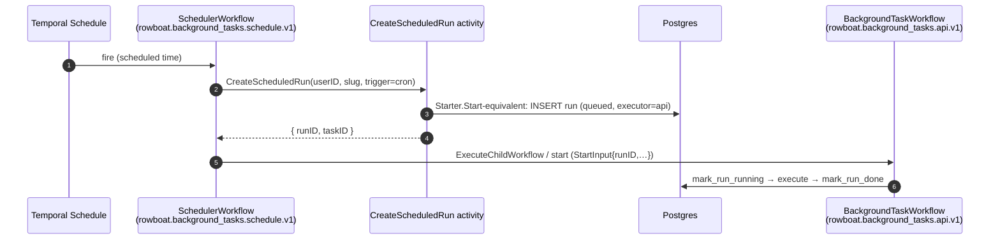
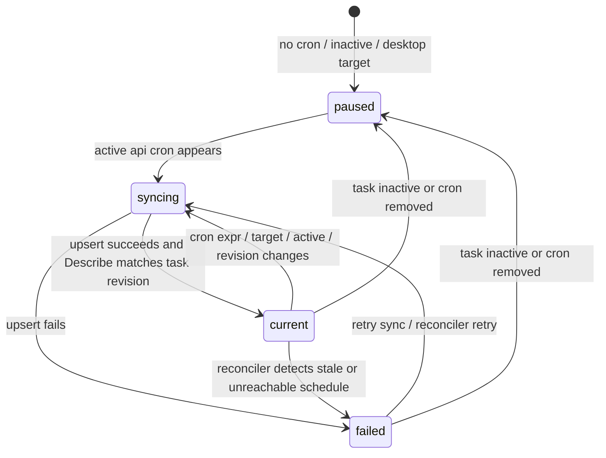

# [Complete] RFC 005: Temporal Schedule Integration for Exact Cron Cloud Tasks

|                  |                                                                                                                                                                                                                                                                                                                                                                                                                                                                                                                                                                                                                                                                                                                                                                                                                                                                                                                                                                                                                                                                                                                                                                                                                                                                                                                                                                                                                                                                                                                                                                                                                                                                                                                                                                                                                                                                                                                                                                                                                                                                                                                                                                                                                                                                                                                                                                                                                                                                                                                                                                                                                                                                                                                                                                                                                         |
| ---------------- | ----------------------------------------------------------------------------------------------------------------------------------------------------------------------------------------------------------------------------------------------------------------------------------------------------------------------------------------------------------------------------------------------------------------------------------------------------------------------------------------------------------------------------------------------------------------------------------------------------------------------------------------------------------------------------------------------------------------------------------------------------------------------------------------------------------------------------------------------------------------------------------------------------------------------------------------------------------------------------------------------------------------------------------------------------------------------------------------------------------------------------------------------------------------------------------------------------------------------------------------------------------------------------------------------------------------------------------------------------------------------------------------------------------------------------------------------------------------------------------------------------------------------------------------------------------------------------------------------------------------------------------------------------------------------------------------------------------------------------------------------------------------------------------------------------------------------------------------------------------------------------------------------------------------------------------------------------------------------------------------------------------------------------------------------------------------------------------------------------------------------------------------------------------------------------------------------------------------------------------------------------------------------------------------------------------------------------------------------------------------------------------------------------------------------------------------------------------------------------------------------------------------------------------------------------------------------------------------------------------------------------------------------------------------------------------------------------------------------------------------------------------------------------------------------------------------------- |
| **RFC**          | 005                                                                                                                                                                                                                                                                                                                                                                                                                                                                                                                                                                                                                                                                                                                                                                                                                                                                                                                                                                                                                                                                                                                                                                                                                                                                                                                                                                                                                                                                                                                                                                                                                                                                                                                                                                                                                                                                                                                                                                                                                                                                                                                                                                                                                                                                                                                                                                                                                                                                                                                                                                                                                                                                                                                                                                                                                     |
| **Status**       | Complete — implemented (merged to `develop` in PR #62, released in v0.1.14); **enabled by default** since the post-006 flip (decision override of the ship-dark stance — `TEMPORAL_SCHEDULES_ENABLED=false` is the instant rollback, and the flag is inert without `TEMPORAL_ENABLED`) — on `feat/rfc-005-temporal-schedules`: `internal/backgroundtaskschedule` (Manager over `ScheduleClient` with memo-based diffing, sync-state Syncer, drift Reconciler in `cmd/scheduler`), `SchedulerWorkflow` + `CreateScheduledRun` → shared `Starter.StartScheduledRun` (preferred no-child shape), handler Create/Patch hooks + post-commit Delete cleanup, loop skip-gate (blanks the cron so a same-tick window still fires), `schedule_sync_*` task fields + desktop mirror. Implementation notes vs this draft: spec changes **delete+recreate** the schedule (the SDK's `ScheduleHandle.Update` cannot rewrite memos, and the memo is the diff source since Temporal normalizes cron strings); the task-revision memo field is informational, not diffed (sync-state writes bump the revision and exact matching would churn); the handler removes the schedule **after** the delete commits, so a stale-revision 409 never strands a live task without its schedule. Post-review hardening (five review rounds): the fire path re-validates the task and dedupes by **occurrence coverage** against `last_run_at` — the occurrence comes from Temporal's own `TemporalScheduledStartTime` search attribute threaded through the scheduler workflow (exact under worker clock skew and late activity retries, where deriving it from the worker clock is provably ambiguous; a cron-derived fallback covers attribute-less fires) — plus an in-flight backstop whose retry bypass is verified against the latest run row, stamps the task on fire exactly like the loop's `stampFired`, and skips fires entirely during a `TEMPORAL_SCHEDULES_ENABLED=false` backout; transient start failures retry via the activity policy with the loop backed off through `last_attempt_at`; the syncer/reconciler share one `classify()` state machine, the reconciler re-reads tasks before every mutation and the orphan sweep re-checks the DB before deleting; config-derived schedule properties (task queue, catchup) participate in the memo diff so config changes propagate; client-visible `schedule_sync_error` is sanitized (raw gRPC errors stay in logs). Known pre-existing interaction (unchanged here): a desktop app that is open fires api-target crons via `POST /trigger` from its own local anchor, independent of both the loop and Temporal Schedules. Deferred: RFC 006 schedule-state endpoint, internal repair/admin commands (`schedule-sync`, `reconcile --once`, `describe one`), per-task timezone. |
| **Track**        | Cloud-native background workflows                                                                                                                                                                                                                                                                                                                                                                                                                                                                                                                                                                                                                                                                                                                                                                                                                                                                                                                                                                                                                                                                                                                                                                                                                                                                                                                                                                                                                                                                                                                                                                                                                                                                                                                                                                                                                                                                                                                                                                                                                                                                                                                                                                                                                                                                                                                                                                                                                                                                                                                                                                                                                                                                                                                                                                                       |
| **Owners**       | `apps/rowboat-api` (Go backend / Temporal worker)                                                                                                                                                                                                                                                                                                                                                                                                                                                                                                                                                                                                                                                                                                                                                                                                                                                                                                                                                                                                                                                                                                                                                                                                                                                                                                                                                                                                                                                                                                                                                                                                                                                                                                                                                                                                                                                                                                                                                                                                                                                                                                                                                                                                                                                                                                                                                                                                                                                                                                                                                                                                                                                                                                                                                                       |
| **Created**      | 2026-06-05                                                                                                                                                                                                                                                                                                                                                                                                                                                                                                                                                                                                                                                                                                                                                                                                                                                                                                                                                                                                                                                                                                                                                                                                                                                                                                                                                                                                                                                                                                                                                                                                                                                                                                                                                                                                                                                                                                                                                                                                                                                                                                                                                                                                                                                                                                                                                                                                                                                                                                                                                                                                                                                                                                                                                                                                              |
| **Last updated** | 2026-06-10                                                                                                                                                                                                                                                                                                                                                                                                                                                                                                                                                                                                                                                                                                                                                                                                                                                                                                                                                                                                                                                                                                                                                                                                                                                                                                                                                                                                                                                                                                                                                                                                                                                                                                                                                                                                                                                                                                                                                                                                                                                                                                                                                                                                                                                                                                                                                                                                                                                                                                                                                                                                                                                                                                                                                                                                              |
| **Depends on**   | [RFC 001](./complete-001-api-owned-scheduler.md) (ships first, is the fallback), shared `Starter`, [RFC 007](./007-production-cloud-enablement.md) (Temporal Cloud creds)                                                                                                                                                                                                                                                                                                                                                                                                                                                                                                                                                                                                                                                                                                                                                                                                                                                                                                                                                                                                                                                                                                                                                                                                                                                                                                                                                                                                                                                                                                                                                                                                                                                                                                                                                                                                                                                                                                                                                                                                                                                                                                                                                                                                                                                                                                                                                                                                                                                                                                                                                                                                                                               |
| **Relationship** | Supersedes [RFC 002](./complete-002-durable-schedule-state.md) leasing **for exact cron only**; windows + events stay on RFC 001/003                                                                                                                                                                                                                                                                                                                                                                                                                                                                                                                                                                                                                                                                                                                                                                                                                                                                                                                                                                                                                                                                                                                                                                                                                                                                                                                                                                                                                                                                                                                                                                                                                                                                                                                                                                                                                                                                                                                                                                                                                                                                                                                                                                                                                                                                                                                                                                                                                                                                                                                                                                                                                                                                                    |
| **Supersedes**   | Former cloud workflow planning Temporal schedule sections.                                                                                                                                                                                                                                                                                                                                                                                                                                                                                                                                                                                                                                                                                                                                                                                                                                                                                                                                                                                                                                                                                                                                                                                                                                                                                                                                                                                                                                                                                                                                                                                                                                                                                                                                                                                                                                                                                                                                                                                                                                                                                                                                                                                                                                                                                                                                                                                                                                                                                                                                                                                                                                                                                                                                                              |

## Summary

[RFC 001's](./complete-001-api-owned-scheduler.md) polling loop is the fastest way to make cloud
schedules work, but Temporal ships **first-class durable Schedules** that are a strictly
better fit for _exact cron_: Temporal owns the catch-up policy, overlap policy, jitter,
pause/unpause, and "next fire time" — durably, with no lease table and no poll. This RFC
uses Temporal Schedules for `triggers.cronExpr` while keeping Rowboat's own scheduler for
`triggers.windows` (forgiving once-per-day bands Temporal can't express) and the event
router for `triggers.eventMatchCriteria`.

The desktop still edits one `triggers` object; **the API decides the mechanism per
sub-trigger.**

## Current state (grounded)

| Fact                                                                          | Evidence                                                                                  |
| ----------------------------------------------------------------------------- | ----------------------------------------------------------------------------------------- |
| Temporal already executes API runs                                            | `internal/backgroundtaskworkflow/workflow.go`; workflow `rowboat.background_tasks.api.v1` |
| Temporal client dial (Cloud API-key/TLS aware)                                | `Dial` (`workflow.go:91`); `Starter` (`workflow.go:108`)                                  |
| Deterministic workflow id                                                     | `WorkflowID = "background-task/{userID}/{slug}/{runID}"` (`workflow.go:113`)              |
| Reuse policy                                                                  | `ALLOW_DUPLICATE_FAILED_ONLY` (`workflow.go:123`)                                         |
| Cron/window due math lives on desktop today; RFC 001 moves it to the API loop | `schedule/utils.ts`, RFC 001                                                              |
| Temporal **Schedules**                                                        | **not used anywhere yet**                                                                 |

## Goals

- Use Temporal's durable scheduling for exact `cronExpr` triggers.
- Reduce custom scheduler responsibility where Temporal already has strong semantics.
- Keep Rowboat-specific window/event behavior in Rowboat code.
- **Preserve a single run-history model** in the Oppulence API DB — every fire still produces
  a `BackgroundTaskRun` row via the shared `Starter`, identical to manual/loop runs.

## Non-Goals

- Replacing window triggers with Temporal Schedules (Temporal cron can't express
  "once/day anywhere in a band").
- Replacing event routing with Temporal Schedules.
- Exposing raw Temporal Schedule internals to users (the desktop sees a normalized
  schedule-health summary, RFC 006).

## Proposed split

| Sub-trigger                   | Mechanism                            | Owner                                                                                                  |
| ----------------------------- | ------------------------------------ | ------------------------------------------------------------------------------------------------------ |
| `triggers.cronExpr`           | **Temporal Schedule**                | this RFC                                                                                               |
| `triggers.windows`            | Oppulence API scheduler loop + lease | [RFC 001](./complete-001-api-owned-scheduler.md) / [RFC 002](./complete-002-durable-schedule-state.md) |
| `triggers.eventMatchCriteria` | Cloud event router                   | [RFC 003](./complete-003-cloud-event-ingestion.md)                                                     |
| `manual` `Run now`            | `POST /trigger` (unchanged)          | `handler.triggerAPIRun`                                                                                |

A task with both `cronExpr` and `windows` uses **both** mechanisms simultaneously, each
producing its own runs (the `last_run_at` cycle anchor keeps them independent).

## Schedule identity & the run-record problem

Temporal Schedule ID (one per task's cron sub-trigger):

```
background-task-schedule/{userID}/{slug}/cron
```

The critical design constraint: **a Temporal Schedule fires a workflow, but Rowboat needs a
`BackgroundTaskRun` row to exist first** (every run-history/UI/metric assumes it —
`triggerAPIRun` creates the row _before_ `StartWorkflow`, `handler.go:1127-1161`). A naive
Schedule that directly starts `rowboat.background_tasks.api.v1` would launch a workflow with
no run row, breaking `MarkRunRunning` (which `Update().Where(RunIDEQ(...))` expects an
existing row, `workflow.go:196-213`).

**Solution — schedule a thin "scheduler workflow" that creates the run first:**



The action target is the **scheduler workflow** `rowboat.background_tasks.schedule.v1`,
task queue `TEMPORAL_TASK_QUEUE` (`rowboat-api-background-tasks`). Its single activity
creates the run row (reusing the same insert logic as `Starter`, run-id prefix
`sched-temporal-<uuid>`), then it starts/continues the existing
`rowboat.background_tasks.api.v1` workflow with the freshly-minted `runID`. This guarantees
the invariant "no `BackgroundTaskWorkflow` runs without a run record."

> **Why a workflow and not just an activity as the schedule action?** Temporal Schedule
> actions start a _workflow_. Making that workflow thin (create-row → start-real-workflow)
> keeps run creation durable and retryable under Temporal's own guarantees, and keeps the
> heavy `BackgroundTaskWorkflow` unchanged.

### Schedule spec

```go
// internal/backgroundtaskworkflow/schedules.go (new)
client.ScheduleClient().Create(ctx, client.ScheduleOptions{
	ID: ScheduleID(userID, slug),                 // background-task-schedule/{u}/{slug}/cron
	Spec: client.ScheduleSpec{
		CronExpressions: []string{task.cronExpr},  // from triggers.cronExpr
		TimeZoneName:    scheduleTimezone,          // UTC for v1 (decided; RFC 001)
		Jitter:          0,                          // exact cron; no smear
	},
	Action: &client.ScheduleWorkflowAction{
		ID:        WorkflowID(userID, slug, "cron-anchor"), // base id; runs get unique suffix
		Workflow:  SchedulerWorkflowName,                   // rowboat.background_tasks.schedule.v1
		TaskQueue: cfg.TemporalTaskQueue,
		Args:      []any{ScheduleFireInput{UserID: userID, Slug: slug, TaskID: taskID, Trigger: "cron"}},
	},
	Overlap: enums.SCHEDULE_OVERLAP_POLICY_SKIP, // don't stack runs if one overruns
	CatchupWindow: time.Minute,                  // ≈ RFC 001's 2-min grace; bound replay after downtime
	Paused:  !task.active,                       // inactive task ⇒ paused schedule
})
```

`Overlap=SKIP` mirrors the desktop's in-flight guard (a new occurrence is skipped while the
prior run is still in flight). `CatchupWindow` ≈ the loop's grace, so a brief outage replays
at most the missed occurrences inside the window — not a storm.

## API behavior (schedule lifecycle = task lifecycle)

The handler's task mutations drive schedule state. Hook into the existing
`Create`/`Patch`/`Delete` handlers (`handler.go:296/386/460`):

| Task event                                        | Schedule action                             |
| ------------------------------------------------- | ------------------------------------------- |
| Create/Patch sets `cronExpr` (api-target, active) | **upsert** schedule (create or update spec) |
| Patch removes `cronExpr`                          | **delete** (or pause) schedule              |
| Patch sets `active=false`                         | **pause** schedule                          |
| Patch sets `active=true` (has cron)               | **unpause** (ensure exists)                 |
| Delete task                                       | **delete** schedule                         |
| `execution_target` flips `api`→`desktop`          | **delete** schedule (desktop owns it now)   |

`Run now` (`POST /trigger`) continues through `triggerAPIRun` and **does not** touch the
Schedule — manual and scheduled are independent.

Each upsert is keyed by the task `revision` (`background_task.go:53`) so the reconciler can
detect drift (schedule built from an older revision than the task).

## Reconciliation

Temporal Schedules can drift from the DB (a patch whose upsert failed, a schedule for a
deleted task, a paused schedule for a now-active task). Add a periodic reconciler (a slow
loop in the scheduler binary from RFC 001, or its own goroutine):

```
for each active api-target task with cronExpr:
    ensure schedule exists; if missing → create; if spec/revision differs → update
for each existing background-task-schedule/* in Temporal:
    if owning task missing/deleted → delete (fail-safe)
    if task inactive → ensure paused
    emit drift metric per correction
```

This makes the system self-healing: a missed upsert is repaired within one reconcile
interval, bounded and observable.

## Failure modes

| Case                                                         | Behavior                                                                                                                                                                                                   |
| ------------------------------------------------------------ | ---------------------------------------------------------------------------------------------------------------------------------------------------------------------------------------------------------- |
| Schedule upsert fails on `Patch`                             | Return a visible API error **or** persist a `schedule_sync_state=failed` marker on the task and let the reconciler repair; desktop shows `failed` (RFC 006). Do **not** silently swallow.                  |
| Schedule fires but run-row creation fails                    | The scheduler workflow's `CreateScheduledRun` activity retries (Temporal retry policy); on exhaustion, emit a failed scheduler run/event with `errorCode=schedule_run_create_failed`.                      |
| Schedule exists but task deleted                             | `SchedulerWorkflow` finds no task → fails fast & safe; reconciler deletes the orphan schedule.                                                                                                             |
| Temporal Cloud unreachable during upsert                     | Mark `schedule_sync_state=syncing/failed`; **RFC 001 loop remains enabled as the fallback** so cron still fires (see Rollout).                                                                             |
| Both loop and Schedule active for same cron during migration | Double-fire risk — mitigated by the migration order: a task is on **exactly one** mechanism at a time, gated by `schedule_sync_state=current`. The loop skips cron sub-triggers it has handed to Temporal. |

## Desktop UX (summary; full spec in RFC 006)

Desktop shows, for cron api-target tasks:

- `Cloud scheduled` + schedule type `Temporal cron`
- schedule sync state: `current | syncing | failed | paused`
- next expected fire time (from `ScheduleClient.Describe` → `Info.NextActionTimes`)

## Configuration

| Env                                    | Default | Meaning                                                                          |
| -------------------------------------- | ------- | -------------------------------------------------------------------------------- |
| `TEMPORAL_SCHEDULES_ENABLED`           | `false` | Master switch for the Schedule path. When false, cron stays on the RFC 001 loop. |
| `TEMPORAL_SCHEDULE_CATCHUP`            | `1m`    | `CatchupWindow`.                                                                 |
| `TEMPORAL_SCHEDULE_RECONCILE_INTERVAL` | `5m`    | Reconciler cadence.                                                              |
| `CLOUD_SCHEDULER_TIMEZONE`             | `UTC`   | shared with RFC 001; the Schedule `TimeZoneName`.                                |

(All cron firing requires `TEMPORAL_ENABLED=true` and the worker registering
`SchedulerWorkflowName`.)

## Observability

`internal/backgroundtaskmetrics/metrics.go` additions:

| Series                                  | Type    | Labels                                      |
| --------------------------------------- | ------- | ------------------------------------------- |
| `temporal_schedules_upserted_total`     | counter | `action` (`create`/`update`)                |
| `temporal_schedules_deleted_total`      | counter | —                                           |
| `temporal_schedule_sync_failures_total` | counter | `op`                                        |
| `temporal_schedule_drift_total`         | counter | `kind` (`missing`/`stale`/`orphan`/`pause`) |
| `temporal_schedule_fires_total`         | counter | — (scheduler-workflow starts)               |

Logs: `taskSlug`, `scheduleId`, `taskRevision`, `action`
(`upsert/delete/pause/unpause/reconcile`), `error`.

## Code-level implementation playbook

Temporal Schedules must preserve the Rowboat invariant that a `BackgroundTaskRun` row
exists before `rowboat.background_tasks.api.v1` starts. The implementation is therefore
not "Schedule starts the existing workflow"; it is "Schedule starts a tiny schedule
workflow, and that workflow creates the run row before launching the existing workflow."

### 1. Schema and task view additions

Add to `ent/schema/background_task.go`:

```go
field.String("schedule_sync_state").
	Default("paused").
	Validate(oneOfBackgroundTask("schedule_sync_state", "current", "syncing", "failed", "paused")),
field.Text("schedule_sync_error").Optional(),
field.Time("schedule_synced_at").Optional().Nillable(),
```

Expose in:

- `taskView` in `internal/backgroundtasks/handler.go`
- `createTaskRequest`/`patchTaskRequest` only if the desktop needs to mirror it; otherwise
  keep server-owned and omit from user writes
- `apps/x/packages/shared/src/background-task.ts` summary/detail schemas
- `bg-task:getCloudScheduleState` response from RFC 006

The reconciler is the authority for `schedule_sync_state`. User patch requests should not
be able to force `current`; only schedule upsert/describe/reconcile can set it.

### 2. Schedule helper package

Add `internal/backgroundtaskworkflow/schedules.go`:

```go
const SchedulerWorkflowName = "rowboat.background_tasks.schedule.v1"
const ActivityCreateScheduledRun = "rowboat.background_tasks.create_scheduled_run.v1"

type ScheduleFireInput struct {
	UserID string `json:"userId"`
	TaskID string `json:"taskId"`
	Slug   string `json:"slug"`
	Trigger string `json:"trigger"` // cron
	TaskRevision int `json:"taskRevision"`
	ScheduledTime string `json:"scheduledTime,omitempty"`
}
```

Helper functions:

```go
func ScheduleID(userID, slug string) string {
	return fmt.Sprintf("background-task-schedule/%s/%s/cron", userID, slug)
}

func ScheduleWorkflowID(userID, slug string) string {
	return fmt.Sprintf("background-task-scheduler/%s/%s/cron", userID, slug)
}
```

Do not reuse `backgroundtaskworkflow.WorkflowID(userID, slug, runID)` for the scheduler
workflow; the scheduler workflow is a controller, not the actual run.

### 3. Scheduler workflow implementation

Register it in `backgroundtaskworkflow.Register`:

```go
w.RegisterWorkflowWithOptions(SchedulerWorkflow, workflow.RegisterOptions{Name: SchedulerWorkflowName})
w.RegisterActivityWithOptions(activities.CreateScheduledRun, activity.RegisterOptions{Name: ActivityCreateScheduledRun})
```

Workflow:

```go
func SchedulerWorkflow(ctx workflow.Context, in ScheduleFireInput) error {
	ctx = workflow.WithActivityOptions(ctx, workflow.ActivityOptions{
		StartToCloseTimeout: time.Minute,
		RetryPolicy: &temporal.RetryPolicy{MaximumAttempts: 5, InitialInterval: time.Second},
	})
	var out CreateScheduledRunOutput
	if err := workflow.ExecuteActivity(ctx, ActivityCreateScheduledRun, in).Get(ctx, &out); err != nil {
		return err
	}
	childOpts := workflow.ChildWorkflowOptions{
		WorkflowID: backgroundtaskworkflow.WorkflowID(in.UserID, in.Slug, out.RunID),
		TaskQueue:  out.TaskQueue,
		WorkflowIDReusePolicy: enums.WORKFLOW_ID_REUSE_POLICY_ALLOW_DUPLICATE_FAILED_ONLY,
	}
	ctx = workflow.WithChildOptions(ctx, childOpts)
	return workflow.ExecuteChildWorkflow(ctx, WorkflowName, StartInput{
		UserID: in.UserID, TaskID: in.TaskID, Slug: in.Slug, RunID: out.RunID,
		Trigger: "cron", RequestedContext: out.RequestedContext,
	}).Get(ctx, nil)
}
```

If the child workflow start fails after the run row is created, `CreateScheduledRun` has
already created a queued row. The error path must mark it failed with
`temporal_start_failed` or rely on the shared `Starter.Start` inside the activity and skip
manual child start. Preferred implementation: have `CreateScheduledRun` call the shared
`Starter.Start` and return the existing workflow ids, then the scheduler workflow does not
start a child itself. If that path is used, the schedule workflow is a durable wrapper
around `Starter.Start` only. The invariant remains the same: run row first, workflow start
second, one shared code path.

### 4. Schedule client helpers

Create `internal/backgroundtasks/schedules.go` or `internal/backgroundtaskschedule` with a
small interface so handlers are testable without a live Temporal client:

```go
type ScheduleManager interface {
	UpsertTaskCron(ctx context.Context, task *ent.BackgroundTask) error
	DeleteTaskCron(ctx context.Context, userID, slug string) error
	PauseTaskCron(ctx context.Context, userID, slug string) error
	DescribeTaskCron(ctx context.Context, userID, slug string) (ScheduleDescription, error)
}
```

Implementation uses `temporalClient.ScheduleClient()`. In tests, use a fake that records
calls and injected errors.

### 5. Handler hooks

Hook into the task lifecycle in `internal/backgroundtasks/handler.go`:

| Handler   | Current location                                       | Schedule behavior                                                                                                                                                                      |
| --------- | ------------------------------------------------------ | -------------------------------------------------------------------------------------------------------------------------------------------------------------------------------------- |
| `Create`  | after `create.Save` (`handler.go:363`)                 | If active API task has cron and schedules enabled: set `syncing`, upsert, then set `current`; on failure set `failed` and return 500 or 202-with-failed depending product choice.      |
| `Patch`   | after optimistic update (`handler.go:445-456`)         | Compare old and new task: target change, active change, cron change. Upsert/pause/delete accordingly.                                                                                  |
| `Delete`  | before/after delete transaction (`handler.go:459-536`) | Delete schedule best-effort before DB delete; if delete fails, either abort delete or commit delete and let reconciler remove orphan. Decision: commit delete, log, reconciler cleans. |
| `Trigger` | `handler.go:1080-1097`                                 | No schedule mutation. Manual runs are independent.                                                                                                                                     |

To compare old/new in `Patch`, retain `task` from `lookupTask` and query `updated` after
save. The schedule manager should receive the updated task with user edge loaded.

### 6. Cron extraction rules

Use the same trigger parser from RFC 001. A task is schedule-managed only when:

```go
task.ExecutionTarget == "api" &&
task.Active &&
triggers.CronExpr != "" &&
TEMPORAL_SCHEDULES_ENABLED
```

Cases:

- No cron: delete/pause any existing cron schedule and set state `paused`.
- `executionTarget=desktop`: delete schedule; desktop owns timed evaluation.
- `active=false`: pause schedule; keep it for fast unpause.
- Invalid cron: schedule upsert fails; set `failed` with error.

### 7. Loop fallback handoff

The RFC 001 scheduler must skip cron sub-triggers only when:

```go
TEMPORAL_SCHEDULES_ENABLED &&
task.ScheduleSyncState == "current" &&
triggers.CronExpr != ""
```

It must still evaluate windows on the same task, and it must resume cron evaluation if
state is `failed`, `syncing` for too long, or `paused` while task is active. This is the
safety net during Temporal Cloud incidents and schedule-upsert bugs.

### 8. Reconciler algorithm

Run in `cmd/scheduler` every `TEMPORAL_SCHEDULE_RECONCILE_INTERVAL`:

1. Query all API-target tasks with cron, plus inactive/desktop tasks that may have stale
   schedule state.
2. For each active API cron task:
   - Build desired `ScheduleSpec` from current triggers, timezone, catchup, overlap.
   - `Describe` schedule id.
   - If not found: create and mark `current`.
   - If found but spec/revision mismatch: update and mark `current`.
   - If found paused while task active: unpause.
3. For inactive API cron tasks: ensure schedule exists but paused, state `paused`.
4. List Temporal schedules with prefix `background-task-schedule/`.
5. For any schedule whose task no longer exists or no longer targets API: delete and emit
   `temporal_schedule_drift_total{kind="orphan"}`.

Persist enough metadata in schedule memo/search attributes to make drift checks cheap:

```go
Memo: map[string]any{
	"userId": userID, "taskId": task.ID.String(), "slug": task.Slug,
	"taskRevision": task.Revision, "cronExpr": cronExpr,
}
```

### 9. Schedule-state endpoint composition

RFC 006's `GET /v1/background-tasks/{slug}/schedule-state` should not call Temporal for
every task-list row. It should use persisted `schedule_sync_state` for lists, and call
`Describe` only on explicit detail/open. The response should include:

```json
{
  "target": "api",
  "triggerSources": ["cron", "window"],
  "health": "current",
  "scheduleMechanism": "temporal_cron",
  "nextDueAt": "2026-06-06T14:00:00Z",
  "lastEvaluatedAt": null,
  "lastTriggeredAt": "2026-06-06T13:00:03Z",
  "scheduleSyncState": "current"
}
```

For tasks with windows only, `scheduleMechanism` should be `rowboat_loop`. For mixed tasks,
return per-source detail if the UI needs exact health:

```json
"sources": {
  "cron": {"mechanism":"temporal_schedule","health":"current","nextDueAt":"..."},
  "window": {"mechanism":"rowboat_loop","health":"current","nextDueAt":"..."}
}
```

## Schedule sync state machine and repair tooling

Persisted `schedule_sync_state` is a product-facing summary, not the full Temporal truth.
Define exact transitions so the UI and reconciler do not fight each other.



### State write rules

| State     | Writer                                                   | Required fields                                                      |
| --------- | -------------------------------------------------------- | -------------------------------------------------------------------- |
| `syncing` | handler/reconciler before create/update                  | clear old `schedule_sync_error`, bump `revision`.                    |
| `current` | schedule manager after successful create/update/describe | set `schedule_synced_at=now`, clear error.                           |
| `failed`  | schedule manager/reconciler on failure                   | set `schedule_sync_error`, keep previous schedule if any.            |
| `paused`  | handler/reconciler after pause/delete/no-cron            | clear next-fire assumptions, keep error only if pause/delete failed. |

Do not set `current` immediately after writing the DB task. It means the external Temporal
Schedule matches the DB task, not merely that the task wants a schedule.

### Schedule diffing

The reconciler needs a deterministic desired spec:

```go
type DesiredCronSchedule struct {
	ScheduleID string
	CronExpr string
	Timezone string
	CatchupWindow time.Duration
	Overlap enums.ScheduleOverlapPolicy
	TaskRevision int
	Paused bool
}
```

Diff fields:

- cron expression
- timezone
- catchup window
- overlap policy
- paused state
- task revision memo/search attribute
- workflow/action args (`UserID`, `TaskID`, `Slug`, `Trigger`)

If any differ, update the schedule and increment `temporal_schedule_drift_total{kind="stale"}`.

### Repair commands

Add internal/admin operations only if staging needs manual intervention:

| Operation       | Implementation                                                      | Use                                              |
| --------------- | ------------------------------------------------------------------- | ------------------------------------------------ |
| `sync one task` | `POST /v1/internal/background-tasks/{slug}/schedule-sync`           | Retry a failed task after fixing Temporal creds. |
| `reconcile all` | one-shot scheduler command `rowboat-api-scheduler reconcile --once` | Repair drift without waiting 5 minutes.          |
| `delete orphan` | reconciler with schedule prefix                                     | Clean Temporal schedule for deleted task.        |
| `describe one`  | internal endpoint returning DB state + Temporal describe            | Debug UI "failed" chip.                          |

All internal operations should log `taskSlug`, `userId`, `scheduleId`, `oldState`,
`newState`, and `reason`.

### Temporal namespace visibility

When debugging in Temporal Cloud, operators should be able to find schedules by prefix:

```
background-task-schedule/<userID>/<slug>/cron
```

Workflow ids:

```
background-task-scheduler/<userID>/<slug>/cron
background-task/<userID>/<slug>/<runID>
```

Memo/search attributes should include at least:

- `rowboatUserId`
- `rowboatTaskId`
- `rowboatTaskSlug`
- `rowboatTaskRevision`
- `rowboatTrigger=cron`

Avoid putting task names/instructions in Temporal memos; those may contain user data.

### Migration backout

If Temporal Schedules must be disabled after some tasks have `schedule_sync_state=current`:

1. Set `TEMPORAL_SCHEDULES_ENABLED=false`.
2. Roll scheduler/API.
3. RFC 001 loop resumes cron evaluation because the feature flag is false, regardless of
   persisted `current`.
4. Leave Temporal schedules paused/deleted by reconciler when the system comes back, or run
   the orphan cleanup command.

The important invariant is that the loop checks both flag and state. Persisted `current`
alone must not suppress fallback when the global feature is disabled.

## Rollout

1. **Implement RFC 001 loop first** (it handles cron, windows, fallback) and ship it.
2. Add `SchedulerWorkflow` + `CreateScheduledRun` activity + schedule upsert/delete/pause
   helpers, register on the worker, behind `TEMPORAL_SCHEDULES_ENABLED=false`.
3. Enable in **kind** for a single cron test (desktop closed → Temporal fires → run row →
   completes).
4. Enable in **staging**; run cron tasks on Schedules with the loop _also_ watching (loop
   skips cron sub-triggers marked `schedule_sync_state=current`).
5. **Migrate cron tasks** from the loop to Schedules per task: upsert schedule → mark
   `current` → loop stops evaluating that cron.
6. Keep the **RFC 001 loop as the fallback** for any task whose schedule sync is `failed`.
7. Production via RFC 007 phases.

## Test plan

- Unit: `ScheduleID` / `WorkflowID` generation; spec built from `triggers.cronExpr`.
- Unit: `SchedulerWorkflow` creates a run row then starts `rowboat.background_tasks.api.v1`
  (Temporal test env, time-skipping) — assert a `BackgroundTaskRun` exists before the child
  workflow runs.
- Integration: `Create`/`Patch`/`Delete` task upserts/updates/deletes the schedule;
  `active=false` pauses it.
- Integration: reconciler repairs a deleted-schedule / orphaned-schedule / wrong-pause-state.
- kind E2E: cron task fires through a Temporal Schedule with the desktop closed; run history
  shows `trigger=cron`, `executor=api`.

## Acceptance criteria

- Exact-cron api-target tasks fire through Temporal Schedules with the desktop closed.
- Run history remains stored in Oppulence API tables, identical in shape to loop/manual runs.
- Schedule drift is observable and recoverable (reconciler + metrics).
- Falling back to the RFC 001 loop is possible by setting `TEMPORAL_SCHEDULES_ENABLED=false`.

## Alternatives considered

- **Direct schedule → `BackgroundTaskWorkflow`** (no scheduler-workflow indirection) —
  rejected: leaves no `BackgroundTaskRun` row, breaking `MarkRunRunning` and the entire
  run-history/UI/metrics model. The thin scheduler-workflow is the minimal fix.
- **Temporal Schedules for windows too** — rejected: Temporal cron can't express "once per
  day anywhere in [09:00,12:00]"; forcing it would change user-visible window semantics.
- **Drop the RFC 001 loop entirely once Schedules ship** — deferred: the loop is the
  fallback during Temporal Cloud incidents and still owns windows. Revisit consolidation
  after Schedules soak.

## Decisions

Resolved forks (consolidated in [`README.md`](./README.md#consolidated-decisions)):

- **Overlap policy → `SCHEDULE_OVERLAP_POLICY_SKIP`.** Mirrors the desktop in-flight guard: a
  new occurrence is skipped while the prior run is still executing — no stacked runs.
- **Schedule health → a persisted `schedule_sync_state` field on `BackgroundTask`** (additive
  ent change: `current | syncing | failed | paused`). Gives the desktop a fast read; the
  reconciler is the authority that repairs it. Avoids a `ScheduleClient.Describe` round-trip
  on every task-list render (next-fire time is still fetched live on the detail view).
- **Timezone → UTC for v1**, parity with [RFC 001](./complete-001-api-owned-scheduler.md). Temporal's
  native `TimeZoneName` means the per-task-TZ fast-follow can land _first_ on the cron path;
  the window loop follows. Either way the desktop labels the zone (RFC 006).
- **Migration → loop-first, then per-task cutover.** The RFC 001 loop ships and owns cron
  until each task is migrated to a Schedule (marked `schedule_sync_state=current`, after
  which the loop skips that cron sub-trigger). The loop stays the permanent fallback.
