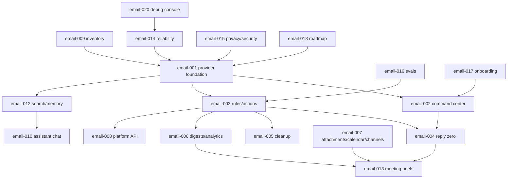

# RFC email-009: Inbox Zero Source Inventory and Feature Map

| Field      | Value                       |
| ---------- | --------------------------- |
| RFC        | email-009                   |
| Status     | Draft                       |
| Track      | Desktop email               |
| Owner      | TBD                         |
| Created    | 2026-06-12                  |
| Depends on | None                        |
| Related    | email-001 through email-020 |

## Summary

This RFC is the source inventory for the Rowboat email track. It maps the email capabilities found in the Inbox Zero repository to concrete Rowboat RFCs, current Rowboat surfaces, and proposed implementation ownership. The goal is to prevent the email plan from becoming a vague "AI inbox" bucket. Each feature should have a home, a dependency path, and an explicit decision about whether Rowboat should copy, adapt, defer, or reject it.

## Why This Exists

Inbox Zero is a mature email product with many connected features:

- Provider abstraction.
- Gmail and Outlook support.
- AI rules and actions.
- Reply tracking.
- Bulk cleanup and unsubscribe.
- Cold email blocker.
- Smart categories.
- Email analytics.
- Digest delivery.
- Attachment filing.
- Calendar and booking links.
- Meeting briefs.
- Slack, Telegram, and Teams surfaces.
- API keys and public API endpoints.
- Debug pages for drafts, rules, memories, and follow-up.

Rowboat already has some overlapping primitives:

- Gmail sync in the desktop app.
- Gmail UI and thread actions.
- Google OAuth broker.
- Cloud event ingestion.
- Google push infrastructure.
- Background task runtime.
- Connector/action RFCs.
- Semantic memory RFCs.

This inventory stitches those together.

## Inbox Zero Implementation References

This RFC is paired with [email-000](./email-000-inbox-zero-agent-reference.md). Implementation agents should use `email-000` as the canonical file/path index and this RFC as the product feature map.

Primary source sets:

- `docs/essentials/*.mdx`
- `docs/api-reference/**/*.mdx`
- `docs/openapi.json`
- `apps/web/prisma/schema.prisma`
- `apps/web/app/(app)/[emailAccountId]/**/page.tsx`
- `apps/web/app/api/**/*.ts`
- `apps/web/utils/email/**/*.ts`
- `apps/web/utils/gmail/**/*.ts`
- `apps/web/utils/outlook/**/*.ts`
- `apps/web/utils/ai/**/*.ts`
- `apps/web/utils/webhook/**/*.ts`
- `apps/web/utils/messaging/**/*.ts`
- `apps/web/utils/drive/**/*.ts`
- `apps/web/utils/calendar/**/*.ts`

## Feature Map

| Inbox Zero capability         | Rowboat destination             | Decision                                                                    |
| ----------------------------- | ------------------------------- | --------------------------------------------------------------------------- |
| Email provider abstraction    | email-001                       | Adapt. Make provider-neutral mailbox APIs for Gmail first, Outlook later.   |
| Gmail/Outlook mail operations | email-001                       | Adapt. Do not leak provider APIs above provider adapter.                    |
| Mail UI                       | email-002                       | Adapt. Build desktop command center, not web route clone.                   |
| AI assistant chat             | email-010                       | Adapt. Route all mutations through Rowboat action policy.                   |
| AI rules                      | email-003                       | Adapt. Use rules/actions/runs model with local-first execution.             |
| Static conditions             | email-003                       | Copy concept. Implement with typed conditions and query compiler.           |
| Learned patterns              | email-003, email-011, email-016 | Adapt. Require evaluation and user correction loop.                         |
| Delayed actions               | email-003                       | Adapt. Use local durable queue and cloud scheduler where available.         |
| Digest action                 | email-006                       | Adapt. Digest queue plus local/cloud delivery.                              |
| Webhook action                | email-008                       | Adapt. Signed webhooks and payload policy.                                  |
| Reply Zero                    | email-004                       | Adapt. Thread tracker + drafts + nudge workflow.                            |
| Draft cleanup                 | email-004, email-020            | Adapt. Track draft lifecycle and cleanup stale provider drafts.             |
| Newsletter cleanup            | email-005                       | Adapt. Safe unsubscribe and auto-archive filters.                           |
| Cold email blocker            | email-005                       | Adapt. Conservative default monitor/label before archive.                   |
| Smart categories              | email-011                       | Adapt. Categories feed tabs, rules, cleanup, and analytics.                 |
| Gmail tabs extension          | email-011                       | Adapt. Native desktop tabs/queues instead of browser extension.             |
| Email analytics               | email-006                       | Adapt. Local-first aggregates; cloud sync optional.                         |
| Response-time analytics       | email-006                       | Adapt. Driven by reply tracker.                                             |
| Attachment filing             | email-007                       | Adapt. Local folder first, Drive/OneDrive later.                            |
| Calendar integration          | email-007, email-013            | Adapt. Availability service and meeting briefs.                             |
| Booking links                 | email-007                       | Defer until availability service is stable.                                 |
| Meeting briefs                | email-013                       | Adapt. External-attendee briefings with email history and calendar context. |
| Slack/Telegram assistant      | email-007, email-010            | Defer. Notifications first, commands second.                                |
| Teams events                  | email-007                       | Defer. Keep channel abstraction open.                                       |
| API keys and public API       | email-008                       | Adapt. Scoped API with stronger local/cloud separation.                     |
| Debug pages                   | email-020                       | Adapt. Native operator console for rule/draft/memory/sync issues.           |
| BYO LLM key and Ollama        | email-015                       | Adapt. Fit into Rowboat model policy and local model track.                 |
| Self-hosting docs             | Out of scope                    | Rowboat deployment docs already exist separately.                           |

## Rowboat Current-State Anchors

| Current Rowboat capability                                                                            | Gap                                                                                    |
| ----------------------------------------------------------------------------------------------------- | -------------------------------------------------------------------------------------- |
| `sync_gmail.ts` syncs Gmail threads, bodies, attachments, drafts, archive/trash/read, and reply/send. | Gmail-specific, markdown-backed product state, no provider-neutral account model.      |
| `email-view.tsx` renders Gmail lists and thread detail.                                               | No command-center queues, rule history, reply tracker, cleanup, or analytics surfaces. |
| `classify_thread.ts` classifies important/other and drafts replies.                                   | Not durable, not user-correctable, not tied to rules or evals.                         |
| CloudEvent and Google watch schemas exist.                                                            | Not wired into mailbox automation and provider-level repair.                           |
| `backgroundtaskruntime` exposes read-only Gmail snippets.                                             | No mailbox action execution or full thread hydration policy.                           |
| RFC 020 defines native action engine direction.                                                       | Needs email-specific policies and action semantics.                                    |
| RFC 021 defines semantic memory direction.                                                            | Needs mailbox-specific indexing, redaction, retention, and retrieval.                  |

## Suggested Ownership

| Area                          | Primary owner                      |
| ----------------------------- | ---------------------------------- |
| Provider foundation           | Core + API                         |
| Command center                | Desktop renderer + Core            |
| Rules/actions                 | Core + API runtime                 |
| Reply Zero                    | Core + renderer                    |
| Cleanup                       | Core + renderer, provider adapters |
| Analytics/digests             | Core first, API optional           |
| Attachments/calendar/channels | Connectors + Core                  |
| Platform API                  | API + desktop IPC                  |
| Reliability                   | Core + API                         |
| Privacy/security              | Platform + Core                    |
| Eval harness                  | AI/runtime + Core                  |
| Debug console                 | Core + renderer                    |

## Copy, Adapt, Reject Principles

### Copy

Copy product concepts that are clearly useful and provider-independent:

- Rule testing.
- Rule/action audit history.
- Needs Reply and Awaiting Reply queues.
- Sender-level cleanup decisions.
- Digest queues.
- Meeting brief timing window.

### Adapt

Adapt implementation details where Rowboat differs:

- Rowboat is desktop-first, not web-first.
- Local-first privacy matters more than SaaS convenience.
- Provider actions should go through a typed action engine.
- Gmail should be one provider implementation, not the product model.
- Existing Rowboat cloud runtime should be reused, not replaced.

### Reject or Defer

Reject or defer features that increase risk before the base is stable:

- Fully autonomous sending by default.
- Silent unsubscribe link clicking.
- Permanent delete.
- Posting full email bodies to Slack/Telegram by default.
- Cloud storage of full mailboxes by default.
- Public API launch before internal action policies are proven.

## Track Dependency Graph

## Milestone Buckets

| Milestone                                | RFCs                                       | Purpose                                                                  |
| ---------------------------------------- | ------------------------------------------ | ------------------------------------------------------------------------ |
| M0 inventory and current Gmail hardening | email-009, email-014, email-020            | Make current system observable and repairable.                           |
| M1 provider-neutral mailbox              | email-001, email-002, email-017            | Rename the product contract from Gmail to mailbox.                       |
| M2 safe AI email ops                     | email-003, email-004, email-016            | Rules, drafts, reply queues, and quality gates.                          |
| M3 cleanup and insights                  | email-005, email-006, email-011, email-012 | Make mail easier to triage and reason over.                              |
| M4 connected workflows                   | email-007, email-013                       | Attachments, calendar, meeting briefs, notifications.                    |
| M5 ecosystem                             | email-008, email-010, email-015, email-019 | Assistant, API, governance, multi-account.                               |
| Cross-cutting implementation handoff     | email-000, email-021                       | Source references plus concrete code examples for implementation agents. |

## Open Questions

- Should this track be implemented as a single branch series or split into provider, UI, automation, and integrations branches?
- Should Outlook be part of M1 or wait until M2 validates the action model?
- Which features should be local-only dogfood before any broker/cloud persistence?
- Should email feature RFCs eventually be promoted into the numbered platform RFC sequence?
