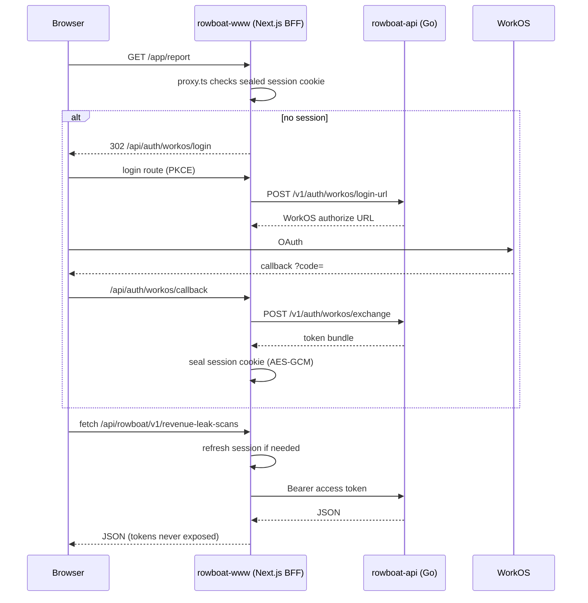

# Product auth and BFF flow



## Rules

- Browser code calls **same-origin** `/api/rowboat/v1/...` only.
- Access tokens live in **HTTP-only sealed cookies**, never `localStorage`.
- `rowboat-api` is the authority for authorization; the BFF attaches credentials.

## Local development

```bash
npm run dev:stack   # validates env, checks API healthz, hot reload on :18082
open http://localhost:18082/dev/routes
```
