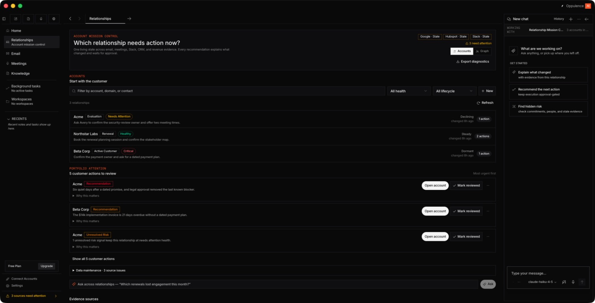
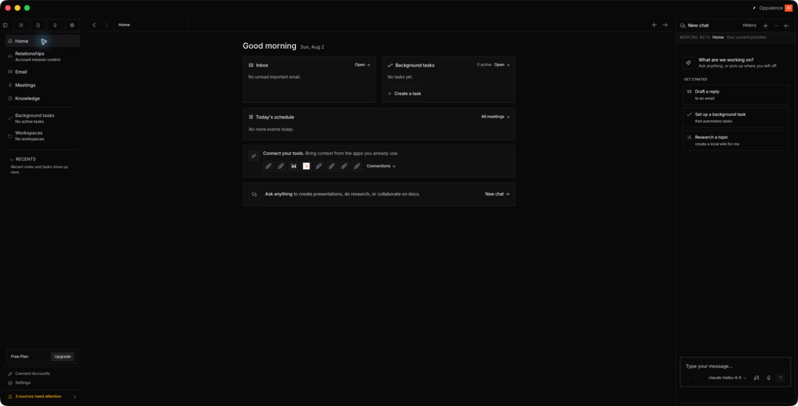
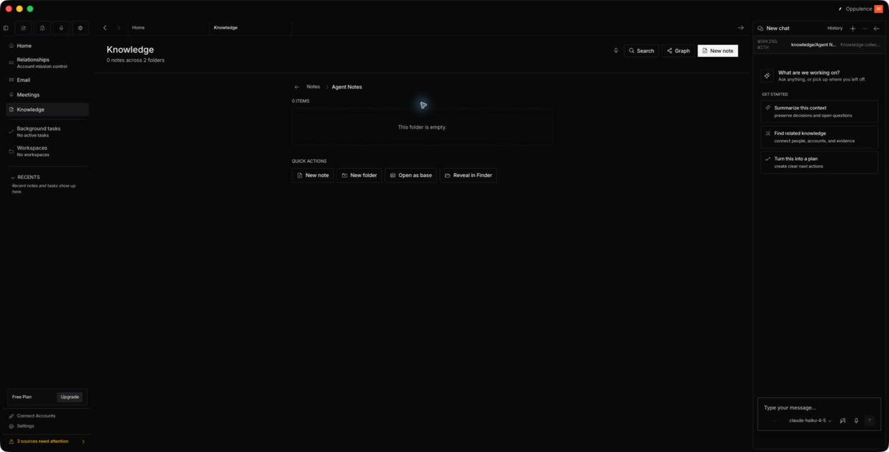
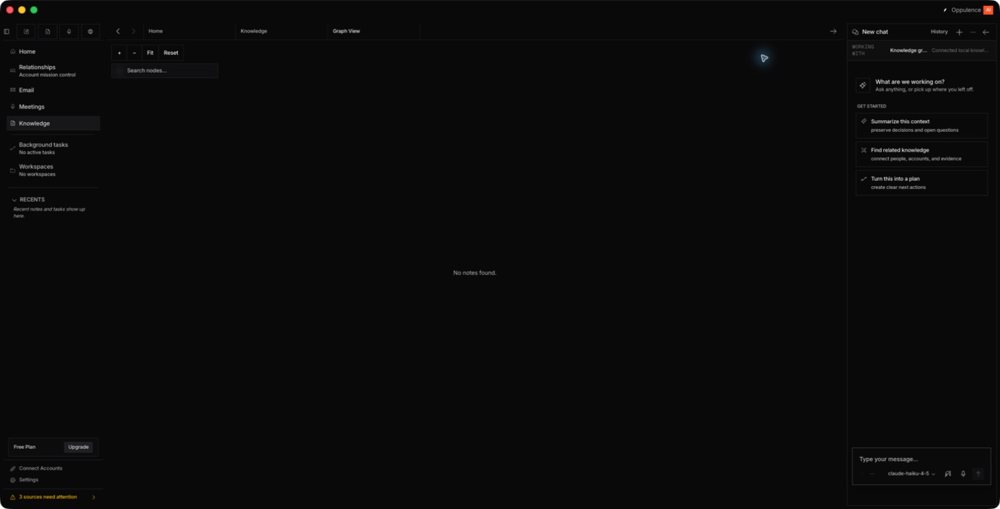
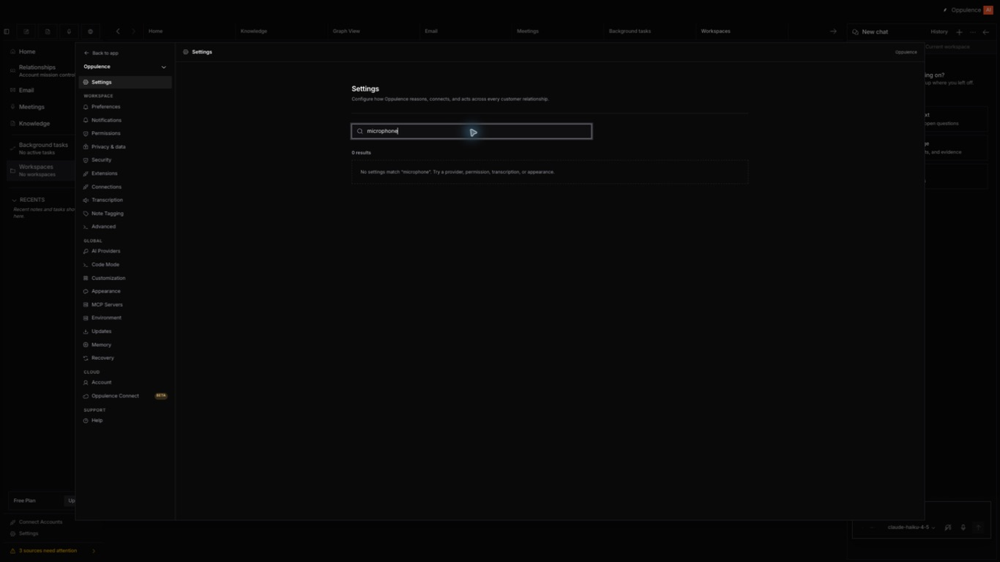
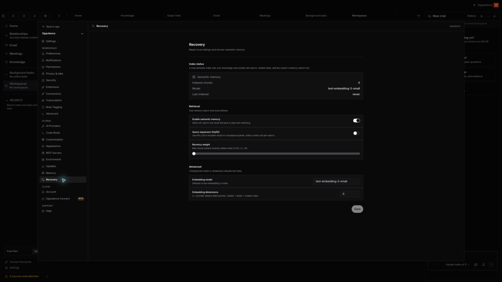
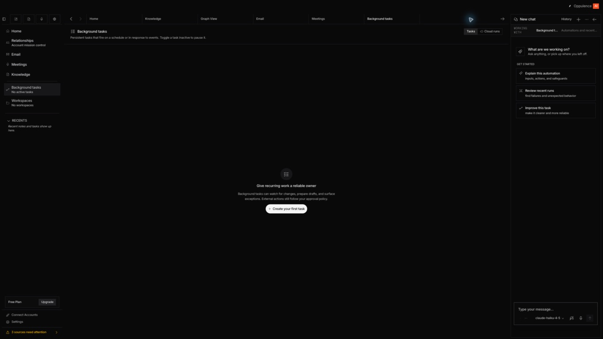
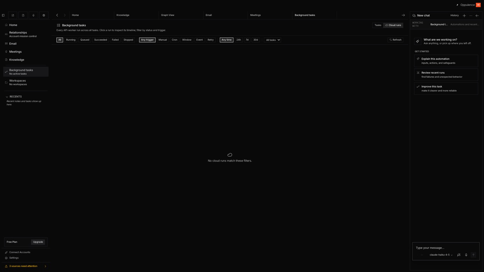

# Desktop usability audit — Round 2

Date: 2026-08-02  
Mode: Combined UX and accessibility audit  
Surface: Running Oppulence desktop development app (`make desktop`)

## Overall verdict

The desktop app is directionally strong: its account prioritization, source-health visibility, meeting-device blocker, task onboarding, and persistent AI context make the product feel like a serious coworker rather than a generic chat shell. The remaining defects are concentrated where trust matters most. Some actions advertise readiness that the system does not have, several recovery and empty states do not actually help users recover, and the account detail experience exposes internal model data instead of translating it into decisions.

The first fixes should be the microphone-readiness mismatch in account detail, the non-functional Recovery information architecture, and the raw/dense account drawer. Those three issues can make a user doubt whether the product understands its own state.

## Audit scope

I used the app as an ordinary user across Home, Relationship Mission Control, account detail, Knowledge, Settings, Background tasks, Cloud runs, tabs, dialogs, keyboard navigation, and an alternate window size. I inspected each accepted screenshot and cross-checked key behavior against the accessibility tree and the relevant implementation.

No recording, connector OAuth, disconnect, deletion, feedback submission, relationship creation, note, task, or workspace was performed.

## Journey and findings

### 1. Relationship Mission Control — Good foundation, trust copy needs work

Strengths:

- Accounts appear before the action queue and the top three actions are easy to scan.
- Health, lifecycle, momentum, action count, and evidence-source attention are visible without opening a record.
- The AI pane offers relationship-specific prompts instead of generic suggestions.

Defects:

- **High — Source state contradicts the instruction.** The page says “Connect Google plus Slack or HubSpot” while all three sources already have `Resync` and `Disconnect`, proving they are connected but stale. A user cannot tell whether to connect, reconnect, or wait.
- **Medium — Freshness is exposed as telemetry.** Values such as `14110m lag` are implementation-oriented and difficult to reason about. Use “9 days behind,” the last successful sync time, and the next recovery action.

Evidence: `relationships-view.tsx:843-844`, `relationships-view.tsx:872-877`.

### 2. Account detail entry — High-risk readiness mismatch

Strengths:

- The header summarizes health, lifecycle, engagement, and the reason for attention.
- Evidence staleness is called out before the user relies on recommendations.
- Actions remain approval-gated.

Defects:

- **High — “Record meeting for this account” is enabled while Meetings reports that no usable default microphone exists.** The primary Meetings screen correctly blocks capture; the account drawer ignores the same readiness state. The same action has two different truths depending on where the user starts.
- **High — The drawer is too narrow and too dense for the record it contains.** It combines status, evidence, model correction, transcript import, risks, privacy, deletion, commitment recovery, recommendations, people, commitments, action plans, changes, and evidence history in one long rail. It behaves like a full record squeezed into a drawer.
- **Medium — A destructive privacy action sits inside the same scanning flow as routine relationship work.** “Delete conversation data” needs clearer separation and progressive disclosure.

Evidence: the meeting button is disabled only by generic `busy` state at `relationships-view.tsx:1582-1594`.

### 3. Account detail changes — Internal model output leaks into the UX

Defects:

- **High — “What changed” renders raw serialized values.** Users see values such as `"unknown" → "needs_attention"` and JSON arrays instead of readable change statements such as “Health changed from unknown to Needs attention.”
- **Medium — Recommendation metadata exposes implementation concepts.** `priority 94`, `revision 1`, and raw policy status help engineers audit a decision, but they do not help a customer-facing user decide what to do. Keep these behind an “Audit details” disclosure.
- **Medium accessibility risk — People were visible on screen but were not announced as text in the macOS accessibility tree during this pass.** The list needs a VoiceOver-specific check and stable semantic list items.

Evidence: raw values at `relationships-view.tsx:2086-2103`; internal recommendation metadata at `relationships-view.tsx:2288-2293`; people list composition at `relationships-view.tsx:1935-1945` and `relationships-view.tsx:2872-2895`.

### 4. Home — Understandable, but generic action labels weaken navigation

Strengths:

- Inbox, tasks, schedule, integrations, and AI entry are understandable at a glance.
- Empty states are calm and do not pretend there is activity.

Defects:

- **Medium accessibility defect — Two different controls are both announced only as “Open.”** One opens Inbox and one opens Background tasks. Their accessible names should be “Open inbox” and “Open background tasks.”
- **Low — The primary content occupies a small island inside a large canvas.** At this window size, the dashboard could use the space for a concise “needs attention” summary rather than simply widening cards.

Evidence: unlabeled controls at `home-view.tsx:462-469` and `home-view.tsx:498-505`.

### 5. Knowledge folder — Terminology and recovery are inconsistent

Defects:

- **Medium — The same place is called Knowledge in navigation and Notes in the breadcrumb.** This creates doubt about whether Notes is a separate product area.
- **Medium — The empty-state body has no contextual action.** “This folder is empty” is separated from the New note action, while New note is also duplicated in the page header.
- **Low — “Open as base” is product jargon and is offered when there is nothing to open.** Disable it until it applies and explain the user benefit.

Evidence: quick actions at `knowledge-view.tsx:297-339`, breadcrumb copy at `knowledge-view.tsx:537-573`, empty folder at `knowledge-view.tsx:594-599`.

### 6. Knowledge Graph — Empty canvas offers controls but no recovery

Defects:

- **Medium — “No notes found” is a dead end.** Zoom, Fit, Reset, and Search remain visible even though there is nothing to manipulate, while no “Create note” or “Back to Knowledge” action is present.
- **Medium — “Graph View” is ambiguous beside the product’s separate Relationship Graph.** Name it “Knowledge Graph” everywhere.

Evidence: empty message at `graph-view.tsx:651-655`.

### 7. Settings search — Common user language is not indexed

Defect:

- **High findability defect — Searching for “microphone” returns zero results** even though Transcription and Permissions contain the relevant settings. The search only matches tab labels, descriptions, and groups; it needs task keywords and synonyms such as microphone, audio, recording, speaker, screen capture, and notifications.

Evidence: `settings-dialog.tsx:1276-1292`.

### 8. Recovery settings — The label promises a capability the page does not provide

Defect:

- **High information-architecture and functionality mismatch.** Recovery promises “Repair local settings and recover semantic memory,” but the page contains only memory indexing and retrieval configuration. It has no repair, reset, rebuild, restore, diagnostic, or recovery action. In the implementation, both Memory and Recovery render the same `MemorySettings` component.

Recommendation: either rename this page to “Memory indexing” or make Recovery a real guided repair surface with safe diagnostics, rebuild-index, reset-local-preferences, and export-support-bundle actions.

Evidence: Recovery config at `settings-dialog.tsx:259-262`; duplicate render path at `settings-dialog.tsx:1881-1884`.

### 9. Background tasks — Strong empty-state onboarding

Strengths:

- The empty state explains what the feature does before asking for setup.
- One clear “Create your first task” action gives the user a next step.
- The Tasks/Cloud runs distinction is visible without overwhelming this state.

Opportunity:

- The AI pane suggests “Explain this automation” and “Improve this task” even though no task exists. Until a task is selected, suggestions should be “Design a recurring task,” “See examples,” and “Explain approvals.”

### 10. Cloud runs — Filters dominate a true zero state

Defects:

- **Medium — A dense rail of filtering controls is shown before any run exists.** This makes an empty product look like a failed search tool.
- **Medium — “No cloud runs match these filters” is false under the default filters.** The problem is that no runs exist, not that filters removed them. Show onboarding first; reveal filters after the first run or when historical data exists.
- **Medium — AI suggestions still assume a selected automation.** Contextual prompts should reflect the zero state.

Evidence: unconditional filter rail at `bg-tasks-view.tsx:3460-3516`; empty copy at `bg-tasks-view.tsx:3525-3529`.

## Cross-cutting defects

1. **High — Relationships uses a special tab mode.** Visiting Relationships replaces the existing tab strip with a single non-closable Relationships tab; leaving makes the prior tabs reappear. This breaks the otherwise learnable rule that destinations accumulate as tabs. Evidence: `App.tsx:6653-6675`.
2. **Medium accessibility defect — New relationship dialog focus does not move to the first field.** In the accessibility-tree pass, focus remained on the underlying HTML content after the dialog opened. Focus should enter the dialog, remain trapped, and return to the trigger on close.
3. **Medium responsive risk — The desktop window allows 600×480 even though the layout contains a persistent navigation rail, content pane, tab strip, and AI pane.** At 1229px wide, seven tabs already squeezed and truncated “Background tasks.” Define a supported compact layout before allowing the current 600px minimum. Evidence: `main.ts:322-327`.

## Prioritized fixes

### P0 — Restore trust in system readiness

1. Share one capture-readiness state across Meetings, account detail, and every recording entry point.
2. Make Recovery honest: either implement guided recovery or remove/rename the destination.
3. Replace raw JSON, priority scores, revision numbers, and policy internals with plain-language summaries; retain an optional audit-details view.

### P1 — Make empty and stale states actionable

4. Replace “connect” copy for connected stale sources with “resync” or “reconnect,” and humanize freshness.
5. Add contextual creation/recovery actions to empty Knowledge and Knowledge Graph states.
6. Hide Cloud runs filters until runs exist and correct its zero-state message.
7. Add settings search keywords and synonyms.

### P2 — Make the desktop model predictable and accessible

8. Put Relationships into the same persistent tab model as every other destination.
9. Give Home actions destination-specific accessible names; fix dialog focus; verify People with VoiceOver.
10. Add a compact-layout breakpoint or raise the minimum supported window width.

## Confirmed strengths

- The Meetings surface correctly blocks capture when microphone preflight fails.
- Mission Control now prioritizes account work ahead of source maintenance.
- Connections separates Connected, Needs attention, and Available states.
- Keyboard order through navigation and the tab bar was logical; closing the active tab selected the previous tab.
- The Settings dialog fit within the smaller tested window.
- Background tasks has a useful first-run explanation and primary action.
- The AI pane retains visible work context across the audited destinations.

## Evidence limits and verification gaps

- This is not a full WCAG compliance claim. VoiceOver speech output, automated contrast measurements, reduced-motion behavior, and target-size measurements were not completed.
- The capture service began returning a stale visual frame late in the walkthrough while the accessibility tree continued to update. I rejected those screenshots. The natural-language relationship-graph query should receive a focused follow-up because its zero-result canvas could not be re-captured reliably in this pass.
- The alternate-size inspection reached approximately 1229×768. The 600×480 minimum is reported as a source-backed design risk, not as a visually confirmed failure at that exact size.
- No microphone or system-audio recording was started, and no external-service or persistent-data mutation was performed.
