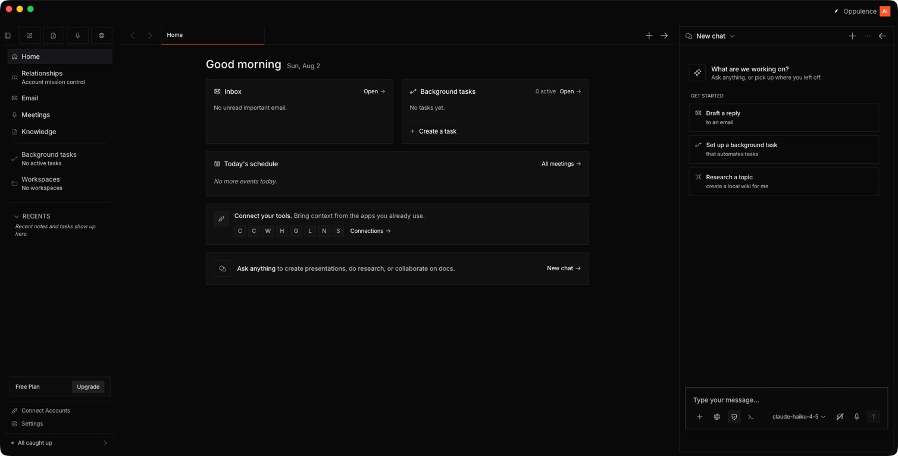
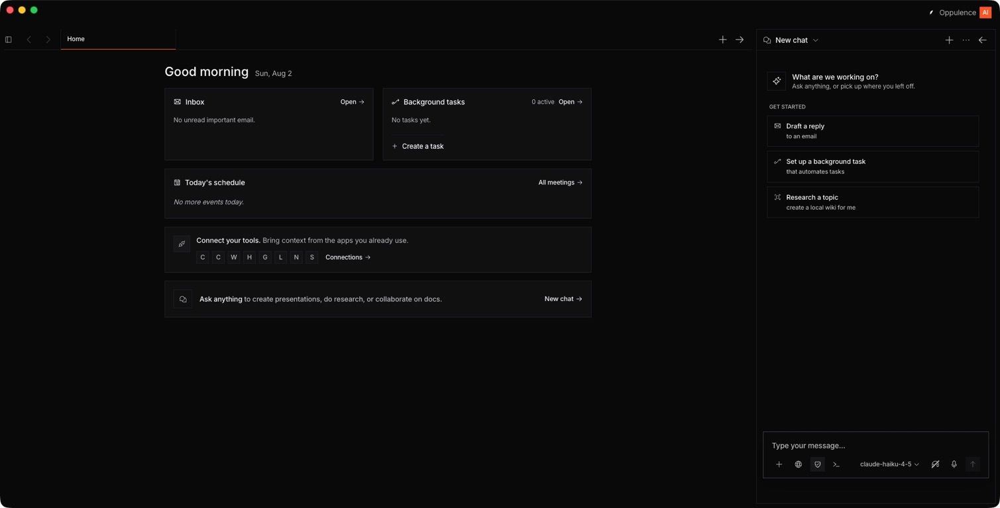

# Desktop UI polish audit — 2026-08-02

## Scope

Current Oppulence desktop home surface in the expanded and collapsed sidebar states, captured from the running Electron app.

## Overall verdict

The shell now feels coherent and intentionally restrained. The remaining gap is not another layout rewrite; it is a system pass that makes priority, shape, density, and state clearer. The biggest visible detractors are the blanket square-corner treatment, placeholder integration initials, duplicated chat entry points, and a fixed-density center canvas that leaves too much unused space.

## Steps

### 1. Expanded sidebar — good, with visible polish gaps

- Strengths: clear three-pane structure, stable navigation, restrained use of orange, balanced logo placement, and sensible task groupings.
- UX risks: four equally weighted unlabeled quick-action buttons make the primary action unclear; the account/status footer is fragmented; the center “Ask anything” card duplicates the right chat pane.
- Visual risks: every card and control uses the same hard square geometry; tool initials read as placeholders; the center content does not expand enough to use the available canvas.
- Accessibility risks: several labels appear below the requested 12px floor, muted copy is very faint, and icon-only actions need strong visible focus and persistent tooltips.

### 2. Collapsed sidebar — good, but not yet adaptive

- Strengths: the sidebar collapses cleanly and the primary content remains understandable.
- UX risks: the center dashboard keeps approximately the same fixed width after space is released, so the collapse produces dead space instead of a more useful canvas.
- Accessibility risks: the collapsed state depends heavily on icon recognition; the toggle and pane transitions still require keyboard, focus-order, zoom, and reduced-motion verification.

## Highest-impact changes

1. Restore the intended shape hierarchy: 8px navigation rows, 16px cards, and pill CTAs/status chips. Remove the global square-corner override.
2. Make the center dashboard fluid: expand its max width when the sidebar collapses, use the available grid, and add resizable/snap behavior for the right chat pane.
3. Replace Canvas, Corinthian, Wispr Flow, HubSpot, GitHub, Linear, Notion, and Stripe initials with their real assets.
4. Establish action priority: make New chat the one obvious primary quick action and demote note, voice, and browser actions to secondary controls or a compact create menu.
5. Remove duplicate chat entry points and simplify the right-pane header so history, new chat, options, and pane controls form one predictable cluster.
6. Consolidate Free Plan, Upgrade, Connect Accounts, Settings, and All caught up into a quieter account/status footer.
7. Enforce the type system: Inter regular/medium, -0.15px tracking, and a 12px minimum. Use stronger muted text for readability.
8. Add product-grade states: subtle card hover, pressed and selected states, a 2px focus ring, skeleton/loading states, reduced-motion transitions, and clearer disabled states.

## Evidence limits

Screenshots confirm visual hierarchy, spacing, density, and visible labels. They do not confirm contrast ratios, complete keyboard behavior, screen-reader announcements, 200% zoom reflow, or reduced-motion behavior; those need interaction and automated accessibility testing.
