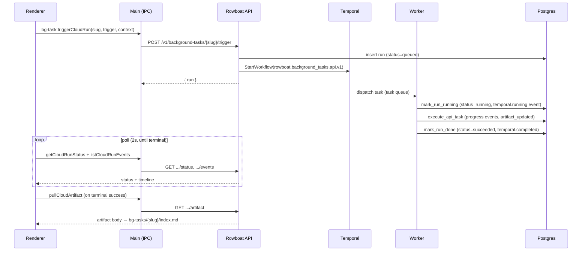

# RFC: Cloud-Native Background Workflow Experience

> **Document status:** Living reference + forward plan.
> The end-to-end cloud execution path (desktop → API → Temporal worker → desktop)
> is **implemented and validated in local kind today**. This RFC has been
> restructured to (1) document the system that already exists, with code
> references, and (2) define the *remaining* work to make it consistent,
> observable, and production-ready on **Temporal Cloud**. Where earlier drafts
> read as "we propose to build X," most of that X already ships — see
> [§3 Status at a Glance](#3-status-at-a-glance).

## 1. Summary

Rowboat background tasks can target either the local desktop agent
(`executionTarget: desktop`) or the Rowboat API's durable Temporal worker
(`executionTarget: api`). The API-target path is fully wired end to end:

- The desktop app can create API-target tasks, trigger runs, poll status, list
  events, list run history, cancel, retry, send control signals
  (pause/resume/update-context), and pull artifacts — all over typed IPC.
- The Rowboat API persists tasks, runs, run events, and artifacts in Postgres via
  ent, exposes them under `/v1/background-tasks/...`, and documents them in OpenAPI.
- A separate Temporal **worker** deployment executes the durable workflow, emits
  lifecycle events, updates progress, and writes the task artifact.
- The renderer shows cloud run history, a live run transcript with a lifecycle
  timeline, Temporal IDs, and state-aware controls; it auto-pulls the artifact on
  terminal success.
- A local **kind** stack (Postgres, Redis, Temporal, devstack, API, worker) plus a
  smoke test validate the happy path automatically.

What is *not* done yet is the work that turns a working path into an operable,
trustworthy product: a consistent schema/vocabulary across layers, real
observability (metrics, structured lifecycle logs, audit trail), a few missing UX
surfaces (a global Cloud Runs view, artifact sync state, rerun-vs-retry), and
enablement in staging/production — where execution runs on **Temporal Cloud**, not
the self-hosted Temporal used in kind.

This RFC is internal engineering documentation and lives in top-level `docs/`.

## 2. Goals & Non-Goals

### Goals

- Keep an accurate, code-referenced description of the implemented cloud path so
  new engineers can navigate it quickly.
- Make cloud run state **consistent** across the Go schema, the API surface, the
  desktop types, and the UI vocabulary.
- Make cloud runs **observable**: metrics, structured lifecycle logging, and an
  audit trail that can answer "what ran, who triggered it, how long it waited,
  where it executed, why it failed, what artifact it produced."
- Close the **UX gaps** that block trust: a global Cloud Runs view, an explicit
  artifact sync state, and a rerun-with-same-context action distinct from retry.
- **Enable** the cloud path in staging and production against **Temporal Cloud**.

### Non-Goals

- Replace local desktop execution. Desktop remains the default `executionTarget`.
- Build a full Temporal UI inside Rowboat.
- Support arbitrary user-authored workflow code.
- Self-host Temporal in staging/production (we use Temporal Cloud there; kind keeps
  the bundled `temporalio/auto-setup` server for local-only convenience).
- Solve multi-region orchestration or advanced autoscaling.
- Redesign background task UX outside the cloud execution path.

## 3. Status at a Glance

State legend: **✅ Implemented** · **🟡 Partial** · **⬜ Not started**

| Capability | State | Where |
| --- | --- | --- |
| `executionTarget: api` modeled end-to-end | ✅ | `ent/schema/background_task.go:44`, `packages/shared/src/background-task.ts:25` |
| Trigger / runs / status / events / artifact routes | ✅ | `cmd/server/wire.go:189-211` |
| Cancel / retry / signal routes | ✅ | `cmd/server/wire.go:205-207` |
| Global runs listing route | ✅ | `GET /v1/background-task-runs`, `wire.go:189` |
| Temporal workflow + 4 activities | ✅ | `internal/backgroundtaskworkflow/workflow.go` |
| Lifecycle events emitted | ✅ | `temporal.{running,progress,artifact_updated,completed,failed,signal,cancel_requested}` |
| Cancel → Temporal cancellation | ✅ | `workflow.go:117-119`, `CancelWorkflow` |
| Signal (pause/resume/update_context) | ✅ | `workflow.go:122-125`, `SignalControl` |
| OpenAPI docs for all routes | ✅ | `internal/openapidoc/enrich.go:189-392` |
| Per-user authorization (ORM-enforced) | ✅ | `internal/db/interceptors.go:46-72` |
| Desktop IPC (trigger/status/list/events/cancel/retry/signal/pull) | ✅ | `apps/x/apps/main/src/ipc.ts:1072-1140` |
| Desktop core sync/runner/scheduler/event-consumer | ✅ | `apps/x/packages/core/src/background-tasks/*` |
| Per-task cloud run history + live transcript UI | ✅ | `apps/x/apps/renderer/src/components/bg-tasks-view.tsx` |
| Auto artifact pull on terminal success | ✅ | `bg-tasks-view.tsx` (terminal-status poll) |
| kind full-stack + happy-path smoke test | ✅ | `deploy/kind/rowboat-api/dependencies.yaml`, `scripts/rowboat-api-kind.sh:390-466` |
| Consistent status vocabulary (`stopped`) | ✅ | schema/API/desktop all use `stopped`; kept `stopped`, documented (drift was doc-only) |
| Retry as a first-class trigger + lineage fields | ✅ | `trigger=retry` + `retry_of_run_id`; terminal-only guard; `startRetryRun` |
| `attempt`, `cancel_requested_at`, `error_code`, `error_details` | ✅ | `ent/schema/background_task_run.go`; populated in handler + worker |
| Artifact `updated_by_run_id` / `content_type` | ✅ | `ent/schema/background_task_artifact.go`; set in `upsertArtifact` (history still deferred) |
| Cloud-run metrics | ✅ | `internal/backgroundtaskmetrics/metrics.go` (9 series); emitted from handler + activities |
| Structured lifecycle logging + audit trail | ✅ | `runLogFields` (handler); append-only `temporal.*` event stream is the audit trail |
| Worker `/metrics` endpoint + scraping | ✅ | `cmd/worker/main.go` + `templates/worker-{service,servicemonitor}.yaml` |
| Granular error-code taxonomy | ✅ | `internal/backgroundtaskworkflow/errcodes.go` + `ClassifyRunError` |
| Run-list filters (status/trigger/executor/since/until) | ✅ | `applyRunFilters` — backs the global Cloud Runs view |
| Temporal Cloud connection (API-key auth) | ✅ | `Dial` + `appconfig` (`TEMPORAL_API_KEY`/`TEMPORAL_TLS_ENABLED`); chart wired |
| Staging/production *enablement* (flip on) | 🟡 | code + chart ready; `TEMPORAL_ENABLED: "false"` until namespace/key provisioned |
| Go test coverage (cancel/retry/failure/filters) | ✅ | `internal/backgroundtasks/handler_cloud_test.go` |
| Global Cloud Runs view (desktop UI) | ✅ | `bg-tasks-view.tsx` `GlobalCloudRunsView` + Tasks/Cloud-runs toggle; `bg-task:listAllCloudRuns` |
| Artifact sync-state indicator (desktop UI) | ✅ | sidebar chip + Pull action; `getArtifactSyncState` + `.artifact-sync.json` sidecar |
| Rerun-with-same-context (desktop UI) | ✅ | `rerunCloudRun` (manual run, no lineage) vs retry; both buttons in `CloudRunTranscriptView` |
| **kind E2E for cancel/retry/failure/desktop-closed** | ⬜ | Go-level covered; kind smoke still happy-path only |

## 4. Implemented System (Reference)

This section is descriptive — it documents what exists today.

### 4.1 Data model (ent → Postgres)

Four entities under `apps/rowboat-api/ent/schema/`, all using `BaseMixin`
(`id` UUID, `created_at`, `updated_at`) and scoped per-user via edges.

**`BackgroundTask`** (`background_task.go`)
`slug`, `name`, `instructions`, `active`, `triggers_json` (validated JSON),
`model`, `provider`, `execution_target` (`desktop|api`, default `desktop`),
`task_created_at`, `last_attempt_at`, `last_run_id`, `last_run_at`,
`last_run_summary`, `last_run_error`, `revision`.
Edges: `user` (required), `artifact` (1:1), `runs` (1:N), `run_events` (1:N).
Unique index `(slug, user)`.

**`BackgroundTaskRun`** (`background_task_run.go`)
`run_id`, `trigger` (`manual|cron|window|event`, default `manual`),
`status` (`queued|running|succeeded|failed|stopped`, default `running`),
`executor` (`desktop|api`), `model`, `provider`, `use_case`, `sub_use_case`,
`previous_run_id`, `local_run_id`, `requested_context`, `summary`, `error`,
`temporal_workflow_id`, `temporal_run_id`, `temporal_status`,
`temporal_started_at`, `temporal_closed_at`, `progress_percent` (0–100),
`progress_message`, `last_heartbeat_at`, `started_at`, `completed_at`, `revision`.
Indexes: `(run_id, user)` unique, `status`, `(executor, status)`,
`temporal_workflow_id`.

**`BackgroundTaskRunEvent`** (`background_task_run_event.go`)
`seq` (non-negative), `event_type` (free-form string), `event_json` (validated
JSON), `received_at`. Append-only; unique index `(seq, run)`, index on `event_type`.

**`BackgroundTaskArtifact`** (`background_task_artifact.go`)
`body`, `revision`. One per task (unique on `task` edge).

### 4.2 API surface

All routes are registered behind `RequireJWT` + per-user rate limiting in
`apps/rowboat-api/cmd/server/wire.go:189-211` and implemented in
`internal/backgroundtasks/handler.go`:

| Method | Path | Handler |
| --- | --- | --- |
| GET | `/v1/background-task-runs` | `ListAllRuns` (cross-task) |
| GET / POST | `/v1/background-tasks` | `List` / `Create` |
| GET / PATCH / DELETE | `/v1/background-tasks/{slug}` | `Get` / `Patch` / `Delete` |
| GET / PUT | `/v1/background-tasks/{slug}/artifact` | `GetArtifact` / `PutArtifact` |
| GET / POST | `/v1/background-tasks/{slug}/runs` | `ListRuns` / `CreateRun` |
| GET / PATCH | `/v1/background-tasks/{slug}/runs/{runId}` | `GetRun` / `PatchRun` |
| GET | `/v1/background-tasks/{slug}/runs/{runId}/status` | `RunStatus` |
| POST | `/v1/background-tasks/{slug}/runs/{runId}/cancel` | `CancelRun` |
| POST | `/v1/background-tasks/{slug}/runs/{runId}/retry` | `RetryRun` |
| POST | `/v1/background-tasks/{slug}/runs/{runId}/signal` | `SignalRun` |
| GET / POST | `/v1/background-tasks/{slug}/runs/{runId}/events` | `ListRunEvents` / `AppendRunEvents` |
| POST | `/v1/background-tasks/{slug}/trigger` | `Trigger` |

Every route is documented in OpenAPI via `internal/openapidoc/enrich.go:189-392`.
Authorization is enforced at the ORM layer: query interceptors in
`internal/db/interceptors.go:46-72` filter every background-task entity to the
authenticated user, so cross-tenant access is impossible regardless of handler code.

### 4.3 Temporal worker

`internal/backgroundtaskworkflow/workflow.go`:

- **Workflow**: `rowboat.background_tasks.api.v1`. Deterministic workflow id
  `background-task/{userID}/{slug}/{runID}` (`WorkflowID`, line 98); reuse policy
  `ALLOW_DUPLICATE_FAILED_ONLY`.
- **Activities** (5-minute start-to-close, retry 3× with exponential backoff):
  `mark_run_running.v1` → `execute_api_task.v1` →
  `mark_run_done.v1` (or `mark_run_failed.v1` on error).
- **Events** appended to `BackgroundTaskRunEvent` as the workflow advances:
  `temporal.running`, `temporal.progress`, `temporal.artifact_updated`,
  `temporal.completed`, `temporal.failed`, plus handler-injected
  `temporal.signal` and `temporal.cancel_requested`.
- **Controller** interface (line 72) keeps the Temporal surface small for testing:
  `StartBackgroundTaskRun`, `CancelBackgroundTaskRun`, `SignalBackgroundTaskRun`.
- **Cancel** maps to `client.CancelWorkflow`; **signal** maps to
  `client.SignalWorkflow` on `rowboat.background_tasks.control.v1` with the
  constrained set `pause | resume | update_context`.
- **Connection**: `Dial` (line 85) sets only `HostPort` + `Namespace` — **no TLS or
  auth options** (see [§6.4](#64-staging--production-enablement-temporal-cloud)).

The worker process entrypoint is `apps/rowboat-api/cmd/worker/main.go`; the API
process wires the Temporal client conditionally in `cmd/server/wire.go` when
`TEMPORAL_ENABLED=true`.

### 4.4 Desktop integration

**Shared types** (`apps/x/packages/shared/src/background-task.ts`):
`BackgroundTaskExecutionTarget` (`desktop|api`),
`BackgroundTaskRunStatus` (`queued|running|succeeded|failed|stopped`),
`BackgroundTaskTrigger` (`manual|cron|window|event`),
`BackgroundTaskSignal` (`pause|resume|update_context`),
plus `BackgroundTaskCloudRun*` shapes mirroring the API.

**IPC** (`apps/x/apps/main/src/ipc.ts:1072-1140`, typed in
`packages/shared/src/ipc.ts`): `bg-task:triggerCloudRun`,
`bg-task:getCloudRunStatus`, `bg-task:listCloudRuns`,
`bg-task:listCloudRunEvents`, `bg-task:cancelCloudRun`, `bg-task:retryCloudRun`,
`bg-task:signalCloudRun`, `bg-task:pullCloudArtifact` (alongside the
local task channels `run/get/patch/create/delete/stop/list/listRunIds`).

**Core** (`apps/x/packages/core/src/background-tasks/`):
- `cloud-sync.ts` — `cloudFetch` (bearer-authed), `triggerCloudRun`,
  `getCloudRunStatus`, `listCloudRuns`, `listCloudRunEvents`, cancel/retry/signal,
  `syncArtifactFromCloud` (writes `bg-tasks/<slug>/index.md`), best-effort run sync,
  and `processRemoteTriggers` (lets the desktop pick up API-queued desktop-target runs).
- `runner.ts` — `runBackgroundTask` for desktop execution + cloud best-effort sync.
- `scheduler.ts` — 15s poll evaluating cron/window triggers; dispatches to cloud or
  local based on `executionTarget`.
- `event-consumer.ts` — routes matched inbound events to the right target.

**Renderer** (`apps/x/apps/renderer/src/components/bg-tasks-view.tsx`): task list,
detail view with output + sidebar, a **Setup** tab (instructions, execution target,
triggers, model/provider), a **Runs history** tab split into `LocalRunsHistoryTab`
and `CloudRunsHistoryTab` (polls every 3s while non-terminal runs exist), and
`CloudRunTranscriptView` (polls status + events every 2s; pause/resume/stop while
running, retry when terminal; renders the lifecycle timeline and Temporal IDs). On
terminal success the detail view auto-calls `bg-task:pullCloudArtifact` and refreshes
the output pane.

### 4.5 Deployment & local validation

- **kind stack** (`deploy/kind/rowboat-api/dependencies.yaml`): Postgres 16, Redis 7,
  Temporal (`temporalio/auto-setup:1.27.2`, backed by the shared Postgres, no
  Elasticsearch, ephemeral storage), and a devstack mock (WorkOS/OIDC/LLM/Google).
- **Worker** runs as a separate deployment
  (`charts/rowboat-api/templates/worker-deployment.yaml`), gated on `worker.enabled`,
  with `TEMPORAL_WORKER_ENABLED=true` set at the pod level.
- **kind values** (`charts/rowboat-api/values-kind.yaml:82-91`): `TEMPORAL_ENABLED:
  "true"`, address `rowboat-api-temporal:7233`, `worker.enabled: true`.
- **Smoke test** (`scripts/rowboat-api-kind.sh:390-466`): creates a task, triggers a
  run, polls status to `succeeded`, reads events, and checks the artifact.

## 5. Architecture & Flows

### 5.1 Trigger → execute → observe



### 5.2 Cancel & signal

```mermaid
sequenceDiagram
    participant UI as Renderer
    participant API as Rowboat API
    participant T as Temporal
    participant W as Worker

    UI->>API: POST .../runs/{runId}/cancel
    API->>T: CancelWorkflow(workflowId, temporalRunId)
    API->>API: append temporal.cancel_requested; status→stopped
    T-->>W: cancellation delivered
    Note over UI,W: Signal path (pause/resume/update_context)
    UI->>API: POST .../runs/{runId}/signal {signal}
    API->>T: SignalWorkflow(control.v1, {signal, payload})
```

### 5.3 Retry (current behavior)

`RetryRun` creates a **new** run that links back via `previous_run_id` and starts a
fresh workflow. The new run currently inherits the prior run's `trigger` rather than
recording `retry` as its own trigger — see [§6.1](#61-schema--terminology-consistency).

## 6. Gap Analysis & Remaining Work

Each gap is stated as **Current → Desired → Proposed change**. Priority order
reflects the chosen emphasis: schema/terminology, observability, UX, then
production enablement, then tests.

### 6.1 Schema & terminology consistency

The single biggest source of confusion is vocabulary drift between the Go schema,
the desktop types, and prose/UX.

1. **`stopped` vs `cancelled`.**
   *Current:* `status` enum is `queued|running|succeeded|failed|stopped` in both
   `background_task_run.go:38` and `background-task.ts:28`; cancellation sets
   `status=stopped`. Earlier RFC text and UI labels say "cancelled."
   *Desired:* one canonical term across schema, API, types, and UI copy.
   *Proposed:* **keep `stopped` as the wire/storage value** (avoids a migration and a
   breaking API change) and standardize the **display label** to "Stopped." Document
   the mapping once. (Alternative — migrate everything to `cancelled` — is a
   decision in [§9](#9-open-questions).)

2. **Retry as a first-class trigger + explicit lineage.**
   *Current:* `trigger` enum lacks `retry`; `previous_run_id` is overloaded to mean
   both "the run I retried" and any "prior run."
   *Desired:* retries are visibly retries; lineage is unambiguous.
   *Proposed:* add `retry` to the `trigger` enum; add a dedicated `retry_of_run_id`
   field and reserve `previous_run_id` for ordering/parentage. Update `RetryRun` and
   the desktop types accordingly.

3. **Missing run fields.**
   *Current:* no `attempt`, `cancel_requested_at`, `error_code`, `error_details`.
   *Desired:* attempt numbering for retries; a distinct cancel-requested timestamp
   (separate from `temporal_closed_at`); structured errors for triage and UX.
   *Proposed:* add `attempt` (int), `cancel_requested_at` (nullable time),
   `error_code` (string), `error_details` (text) to `BackgroundTaskRun`, populate
   them in the handler/activities, and surface `error_code`/`error_details` in the UI.

4. **Artifact provenance & history.**
   *Current:* artifact has only `body` + `revision`; overwritten in place.
   *Desired:* know which run produced an artifact and its media type; optionally
   retain recent revisions.
   *Proposed:* add `updated_by_run_id` and `content_type`; optionally a thin
   revisions table or retained history window (tie to retention in
   [§9](#9-open-questions)).

5. **Event-type constraints.**
   *Current:* `event_type` is a free-form string.
   *Desired:* a known, documented set so consumers can rely on it.
   *Proposed:* define the canonical event vocabulary in one place (shared constant),
   keep the column flexible for forward-compat, and validate known types at write time
   in the worker/handler.

### 6.2 Observability

*Current:* the only background-task metric is the generic
`rowboat_ent_queries_total` counter (`internal/db/metrics.go`); lifecycle logging is
ad-hoc `zap` error logs; there is no audit trail and no tracing on these operations.
A `ServiceMonitor` is already enabled in staging/production values, so Prometheus
scraping infrastructure exists — there is just nothing cloud-run-specific to scrape.

*Desired:* answer "what ran, who triggered it, how long it waited, where it executed,
why it failed, what it produced" from metrics + logs without reading the DB.

*Proposed:*
- **Metrics** (emit from handler trigger + worker activities):
  `cloud_runs_triggered_total`, `cloud_runs_completed_total`,
  `cloud_runs_failed_total`, `cloud_runs_stopped_total`,
  `cloud_run_retry_total`, `cloud_run_cancel_requested_total`,
  `cloud_run_duration_seconds`, `cloud_run_queue_latency_seconds`,
  `cloud_run_artifact_sync_failures_total`. Label conservatively (e.g. `trigger`,
  `executor`) to control cardinality — **do not** label by `runId`/`userId`.
- **Structured logs**: a consistent field set on every lifecycle transition —
  `runId`, `taskSlug`, `userId`, `workflowId`, `temporalRunId`, `traceId`, `trigger`,
  `status`.
- **Audit events**: persist trigger-requested, worker-claimed, artifact-updated,
  completed, failed, cancel-requested, stopped, retry-requested, artifact-pulled.
  (The append-only `BackgroundTaskRunEvent` stream is a natural backing store; decide
  whether audit lives there or in a separate audit table.)
- **Tracing**: propagate a trace id from the trigger request through the workflow and
  activities (the project already uses OTel-style wiring elsewhere).

### 6.3 UX completeness

*Current:* cloud runs are only visible **per task**, under the detail view's Runs
history tab; the artifact is written silently on success with no sync indicator;
"retry" is the only re-execution action; there are no filters or copy-id controls.

*Desired:* a trustworthy, operable surface that works across tasks and makes sync
state and re-execution explicit.

*Proposed:*
- **Global Cloud Runs view** (under Background agents) listing runs across all
  API-target tasks, each row showing task name, run id, status, trigger, start/finish,
  duration, progress + latest message, executor, Temporal status — filterable by
  status, trigger, task, and time range. Back it with the existing
  `GET /v1/background-task-runs`.
- **Artifact sync state** indicator with explicit states:
  `current | remote newer | syncing | pull failed | not pulled`, driven by comparing
  local vs remote `revision`. On terminal success, attempt auto-pull; if it fails,
  keep the run `succeeded` but show `pull failed` with a retry action.
- **Rerun with same context** — a distinct action that creates a new `manual` run
  copying `requested_context` (no `retry_of_run_id`), labeled "rerun," separate from
  retry.
- **Copy controls** for run id, Temporal workflow id, and Temporal run id in the run
  detail view.
- **State-aware controls** everywhere: stop only for queued/running; retry only for
  terminal failed/stopped; rerun for any terminal; pull-artifact only when a remote
  artifact exists.

### 6.4 Staging / production enablement (Temporal Cloud)

*Current:* `values-staging.yaml:26` and `values-production.yaml:27` set
`TEMPORAL_ENABLED: "false"` and do not enable the worker. The Temporal client
`Dial` (`workflow.go:85-90`) and `appconfig.Config` (`config.go:136-142`) support
only `HostPort` + `Namespace` — **no TLS, mTLS, or API-key auth**, which Temporal
Cloud requires. kind's bundled Temporal uses ephemeral storage and the shared
Postgres — fine locally, not a production posture.

*Desired:* staging and production execute API-target runs on **Temporal Cloud**, with
secure auth, the correct namespace, and the worker enabled.

*Proposed:*
- Extend `appconfig.Config` + `Dial` with Temporal Cloud connection options:
  TLS client cert/key (mTLS) **or** API-key auth, and a cloud namespace
  (`<namespace>.<account>`). Plumb new env vars (e.g.
  `TEMPORAL_TLS_CERT`/`TEMPORAL_TLS_KEY` or `TEMPORAL_API_KEY`) sourced from the
  cluster `Secret`/Infisical — never inline in values.
- Flip `TEMPORAL_ENABLED: "true"` and enable the worker in staging first, then
  production, pointing `TEMPORAL_ADDRESS` at the Temporal Cloud gRPC endpoint and
  `TEMPORAL_NAMESPACE` at the cloud namespace.
- Confirm a dedicated production task queue and reasonable worker resourcing/replicas.

### 6.5 Test coverage

*Current:* the kind smoke test covers create → trigger → succeed → events → artifact
only (`scripts/rowboat-api-kind.sh:390-466`).

*Desired:* the non-happy paths are exercised automatically.

*Proposed:* extend API/core tests and the kind E2E to cover: cancel of a
running run → `stopped`; retry of a failed run → linked successful run; a failure path
with structured `error_code`/`error_details`; desktop-closed durability (run started,
app reopened, terminal state + artifact reconciled); and run-list filtering by status,
trigger, and executor.

## 7. Rollout Plan

The foundation (schemas, routes, worker, IPC, per-task UI, kind validation) is
**already shipped**. Remaining phases:

- **Phase A — Consistency.** Standardize status vocabulary; add `retry` trigger +
  `retry_of_run_id`; add `attempt`/`cancel_requested_at`/`error_code`/`error_details`;
  add artifact `updated_by_run_id`/`content_type`; document the event vocabulary.
  Migrations + OpenAPI + desktop type updates.
- **Phase B — Observability.** Cloud-run metrics, structured lifecycle logging, audit
  events, trace propagation.
- **Phase C — UX.** Global Cloud Runs view + filters; artifact sync-state indicator;
  rerun-with-same-context; copy-id controls.
- **Phase D — Temporal Cloud (staging).** Add Cloud auth/config; enable in staging;
  expand E2E to cancel/retry/failure/desktop-closed.
- **Phase E — Temporal Cloud (production).** Enable after staging soak; gate the new
  Cloud Runs surface behind a feature flag; enable once trigger/completion metrics
  look healthy.

## 8. Acceptance Criteria

- Status vocabulary is consistent across schema, API, desktop types, and UI copy; the
  chosen term is documented.
- Retries are distinguishable from original runs and from reruns; lineage
  (`retry_of_run_id`) and `attempt` are populated.
- Failed runs expose `error_code` + `error_details`, shown in the UI.
- The nine cloud-run metrics are emitted and scraped; lifecycle logs carry the full
  field set; audit events are persisted.
- A global Cloud Runs view lists and filters runs across tasks; artifact sync state is
  always visible; rerun-with-same-context exists as its own action.
- Staging and production execute API-target runs on Temporal Cloud with secure auth,
  the worker enabled, and `TEMPORAL_ENABLED: "true"`.
- E2E validates desktop → API → Temporal worker → desktop for success, failure,
  cancel, retry, and desktop-closed durability.
- Production logs/metrics can answer: what ran, who triggered it, how long it waited,
  where it executed, why it failed, and what artifact it produced.

## 9. Open Questions

(Questions the implementation has already answered are removed; these remain genuine
decisions.)

- **Status term:** keep `stopped` everywhere (recommended; no migration) or migrate to
  `cancelled` (clearer to users, requires schema + API + type changes)?
- **Retry settings:** should a retry snapshot the original run's model/provider, or use
  the task's current settings at retry time?
- **Artifact history:** expose historical artifact revisions to users, or only the
  latest? This drives whether we add a revisions table vs. retain a window.
- **Temporal Cloud auth:** mTLS client certs or API-key auth? (Affects which secrets
  and env vars we standardize.)
- **Audit storage:** reuse the `BackgroundTaskRunEvent` stream for audit, or add a
  dedicated audit table with its own retention?
- **Retention:** how long to keep run summaries, detailed events, and artifact history
  in production, and should it be per-user, per-workspace, or per-task? Deleting a task
  should cascade-delete its runs, events, and artifact (verify cascade behavior on the
  ent edges before relying on it).
- **Notifications:** should cloud runs notify the user on completion/failure in v1?

## 10. Assumptions

- The Rowboat API worker remains the only cloud executor for this RFC.
- Temporal remains the durable execution layer — **Temporal Cloud** in
  staging/production, the bundled `temporalio/auto-setup` server in local kind.
- The desktop app remains the primary user-facing control plane; local desktop
  execution remains fully supported and is the default `executionTarget`.
- Local kind is the required development validation path.

## Appendix: Code Map

| Area | File(s) |
| --- | --- |
| Task / run / event / artifact schemas | `apps/rowboat-api/ent/schema/background_task{,_run,_run_event,_artifact}.go` |
| Route registration | `apps/rowboat-api/cmd/server/wire.go:189-211` |
| HTTP handlers | `apps/rowboat-api/internal/backgroundtasks/handler.go` |
| Temporal workflow / activities / controller | `apps/rowboat-api/internal/backgroundtaskworkflow/workflow.go` |
| Worker entrypoint | `apps/rowboat-api/cmd/worker/main.go` |
| Temporal/worker config | `apps/rowboat-api/internal/appconfig/config.go:136-142` |
| OpenAPI enrichment | `apps/rowboat-api/internal/openapidoc/enrich.go:189-392` |
| Per-user authorization | `apps/rowboat-api/internal/db/interceptors.go:46-72` |
| Metrics | `apps/rowboat-api/internal/db/metrics.go` |
| Desktop shared types | `apps/x/packages/shared/src/background-task.ts` |
| Desktop IPC (main) | `apps/x/apps/main/src/ipc.ts:1072-1140` |
| Desktop core (sync/runner/scheduler/events) | `apps/x/packages/core/src/background-tasks/*` |
| Renderer UI | `apps/x/apps/renderer/src/components/bg-tasks-view.tsx` |
| Helm values (kind/staging/prod) | `charts/rowboat-api/values-{kind,staging,production}.yaml` |
| Worker deployment template | `charts/rowboat-api/templates/worker-deployment.yaml` |
| kind dependencies | `deploy/kind/rowboat-api/dependencies.yaml` |
| kind orchestration + smoke test | `scripts/rowboat-api-kind.sh` (smoke `:390-466`) |
