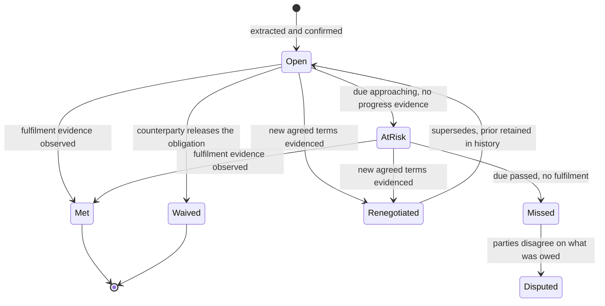
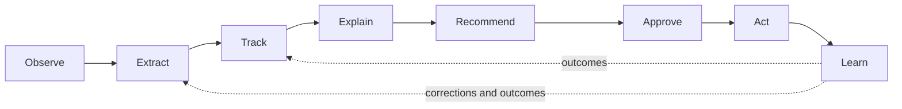

# Oppulence — The Commitment Ledger

**Oppulence is the independent record of what your business promised and what
was promised to you, proven by evidence, across the systems where promises are
actually made.**

_A Playbook Media product · Rewritten September 2026_

---

## Contents

1. [The problem](#1-the-problem)
2. [Why no existing system solves it](#2-why-no-existing-system-solves-it)
3. [The product](#3-the-product)
4. [What a commitment is](#4-what-a-commitment-is)
5. [The operating loop](#5-the-operating-loop)
6. [Evidence and provenance](#6-evidence-and-provenance)
7. [Two clients](#7-two-clients)
8. [Why an independent ledger — and why the platforms will not attack here](#8-why-an-independent-ledger--and-why-the-platforms-will-not-attack-here)
9. [Competitive map](#9-competitive-map)
10. [Initial customer and boundary](#10-initial-customer-and-boundary)
11. [Go-to-market](#11-go-to-market)
12. [Pricing and value](#12-pricing-and-value)
13. [Defensibility](#13-defensibility)
14. [Product discipline](#14-product-discipline)
15. [Trust, security, and governance](#15-trust-security-and-governance)
16. [The platform it becomes](#16-the-platform-it-becomes)
17. [Risks and how we retire them](#17-risks-and-how-we-retire-them)
18. [Success](#18-success)
19. [Open questions](#19-open-questions)

---

## 1. The problem

**Businesses run on promises that no system records.**

A delivery date agreed on a call. A scope change conceded in a thread. An
integration promised to close the deal. A discount contingent on a case study
that never got written. A vendor SLA nobody tracks. A migration date given to a
customer in Slack at 6pm on a Friday.

These obligations share four properties that make them systematically invisible:

1. **They are created in conversation, not in software.** The moment of promise
   is an email, a call, a thread, or a document — never a form field.
2. **They are made by one person and kept by another.** The founder promises;
   the implementation team discovers. The account executive concedes; support
   inherits.
3. **Nobody is compensated for recording them.** Logging a commitment costs the
   promiser time and creates accountability. The incentive runs against
   capture.
4. **They are only noticed when broken.** An obligation met silently produces
   no signal. The first signal is a complaint, an escalation, or a churn.

The consequence is not disorganization. It is:

| Failure                       | What it looks like                                                                    |
| ----------------------------- | ------------------------------------------------------------------------------------- |
| **Orphaned promise**          | A commitment exists in one person's sent folder and nowhere else                        |
| **Late discovery**            | Delivery learns about a commitment after the date has passed                            |
| **Silent renegotiation**      | A date slips across three threads and no one ever decides it slipped                    |
| **Unenforced inbound**        | A vendor or customer owes something; nobody tracks it; the value is quietly forfeited   |
| **Undefended dispute**        | An argument about what was agreed is conducted from memory and selective screenshots    |
| **Churn without a cause**     | A renewal is lost to an accumulation of small unmet promises no one aggregated          |
| **Key-person risk**           | The person who made the promises leaves, and the obligations leave with them            |

> Every company has a system of record for what it **sold**.
> None has a system of record for what it **owes**.

That absence is the market.

---

## 2. Why no existing system solves it

The obligation problem is not unsolved because it is unimportant. It is unsolved
because it falls between the seams of every existing category.

| System                          | Records                             | Why it misses commitments                                                                                |
| ------------------------------- | ----------------------------------- | -------------------------------------------------------------------------------------------------------- |
| **CRM** (HubSpot, Salesforce)   | The deal, stage, and amount          | Structured around the pipeline, not the promise. Manually maintained. Blind to delivery and to inbound obligations. |
| **CLM** (Ironclad, Docusign)    | The signed contract                  | Covers only what reached paper. The vast majority of operational promises are made after signature and never amended. |
| **Ticketing** (Jira, Linear)    | Work someone chose to file           | A commitment only appears if a human already noticed it and decided to file it. Capture is the problem, not tracking. |
| **Project tools** (Asana)       | Tasks and dates                      | Internally-facing. No counterparty, no evidence, no two-sided view.                                       |
| **Meeting notes** (Granola, Otter, Fireflies) | One meeting's transcript and action items | Per-meeting, not longitudinal. Never reconciled across sources. No state, no outcome tracking.            |
| **Email AI** (Superhuman, Shortwave) | Inbox triage and drafting        | Optimizes the handling of messages, not the obligations inside them. Scope ends at the inbox.             |
| **Revenue intelligence** (Gong, Clari) | Calls and forecast              | Optimizes closing the deal, not keeping it. Value ends at signature; obligations begin there.             |

Each category holds a fragment. None holds the obligation, because the obligation
spans all of them — created in email, confirmed in a meeting, renegotiated in
chat, and consequential in delivery.

**The seam between systems is precisely where commitments live.** That is why the
solution has to span systems, and why an incumbent inside any one of them is
structurally the wrong builder.

---

## 3. The product

Oppulence maintains a live, two-sided register of commitments.

Integrations are **evidence streams**. They append immutable observations to a
durable history. Oppulence extracts the commitments contained in that evidence,
tracks each one to an outcome, and links every claim back to the message,
meeting, or document that created it.

The first experience is the **Commitment Register**.

### The register

| Column          | Content                                                                        |
| --------------- | ------------------------------------------------------------------------------ |
| **Direction**   | Outbound (we owe them) or inbound (they owe us)                                 |
| **Commitment**  | The obligation, in the promiser's own words where possible                      |
| **Counterparty** | The account, and the specific person on each side                              |
| **Owner**       | Who made it, and who is accountable for keeping it                              |
| **Due**         | A date, a condition, or an explicit "unspecified" — never a guessed date        |
| **State**       | Open · Met · At risk · Missed · Renegotiated · Waived · Disputed                |
| **Confidence**  | How certain extraction is, shown honestly, never hidden                         |
| **Evidence**    | The exact source text, one click away, with timestamp and author                |

### The five views

1. **What we owe** — outbound obligations by risk, then by date.
2. **What they owe us** — inbound obligations, the view no other tool offers.
3. **What changed** — new commitments, slippage, and silent renegotiation since
   the last review.
4. **By account** — the full two-sided obligation history for one relationship,
   used before a renewal, QBR, escalation, or handover.
5. **By owner** — what each person on the team has promised, used for load,
   handover, and offboarding.

### The exportable record

A commitment record can be exported as a standalone document containing the
obligation, its full state history, and the verbatim cited evidence with
timestamps and authors.

This artifact is a first-class product surface, not a reporting feature. It is
what makes the ledger useful in the moments that matter: a customer conversation
about what was agreed, an executive escalation, a renewal negotiation, or a
handover. **A record that cannot leave the tool cannot settle an argument.**

### What it is not

- Not a score. Every state is discrete, evidenced, and correctable.
- Not autonomous. Nothing is sent, written, or promised on the user's behalf
  without explicit approval.
- Not a replacement for the CRM, ticket queue, or contract repository.
- Not legal advice, and not a CLM.

---

## 4. What a commitment is

Precision here is the product. A loose definition produces noise, and noise
destroys trust faster than missed extraction.

**A commitment is an obligation, asserted by an identifiable party, to an
identifiable counterparty, to do or provide something, with a due date or a due
condition, evidenced by a specific source.**

### The five required elements

| Element          | Requirement                                    | If missing                                        |
| ---------------- | ---------------------------------------------- | ------------------------------------------------- |
| **Promiser**     | A specific person or the company                | Not a commitment; discard                          |
| **Counterparty** | A specific person or organization               | Not a commitment; discard                          |
| **Substance**    | A concrete deliverable, action, or forbearance  | Not a commitment; discard                          |
| **Due**          | A date or a condition                           | Recorded as **unspecified**, never inferred        |
| **Evidence**     | A citable source with author and timestamp      | Never asserted; extraction is rejected             |

### Included

- Delivery and timeline promises ("we'll have it live by the 14th")
- Scope and feature promises ("that will be in the next release")
- Commercial concessions ("we'll hold this price through renewal")
- Process promises ("I'll send the security questionnaire today")
- Conditional promises ("if you send the data, we'll turn it around in a week")
- Inbound obligations, in exactly the same shape, in the other direction

### Explicitly excluded

- Aspirations and hedged statements ("we'd love to," "ideally," "hopefully")
- Internal-only intentions with no counterparty
- Restatements of an already-tracked commitment (deduplicated to one obligation
  with an updated history)
- Anything extracted without a citable source

### States and transitions



Two rules govern the machine:

- **Renegotiation never overwrites.** The prior obligation is retained in
  history. Silent slippage is only visible if the original survives.
- **Missed is never inferred from silence alone.** Absence of fulfilment
  evidence produces *at risk*, which prompts a human. Only an elapsed due date
  plus review produces *missed*.

---

## 5. The operating loop

**Observe → Extract → Track → Explain → Recommend → Approve → Act → Learn**



1. **Observe** — Gmail, Calendar, Slack, HubSpot, meetings, notes, voice,
   documents, and desktop context emit immutable, provenance-bearing
   observations. Observations are never edited or deleted, only appended.

2. **Extract** — explicit source facts, deterministic rules, AI inference, and
   user corrections produce candidate commitments carrying the five required
   elements. Candidates below a confidence threshold are queued for review
   rather than asserted.

3. **Track** — deterministic code owns each commitment's canonical state through
   to an outcome. AI never mutates state directly; it only proposes.

4. **Explain** — every commitment and every state change links to the evidence
   that produced it. An unexplainable claim is a bug.

5. **Recommend** — Oppulence surfaces the obligation most at risk and the safest
   valuable next action, with its reasoning visible.

6. **Approve** — every external action waits for a human decision. Approval is
   the product's central trust mechanism, not a setting.

7. **Act** — approved email, Slack, and CRM actions execute idempotently, and
   the action itself is recorded as evidence.

8. **Learn** — replies, meetings, corrections, and outcomes feed the same
   history. Corrections tune extraction; outcomes tune risk assessment.

**The critical asymmetry:** AI proposes, deterministic code decides, and a human
approves anything that leaves the building.

---

## 6. Evidence and provenance

The ledger's value is entirely a function of whether its claims can be trusted,
which means provenance is architecture, not a feature.

### The chain

```
observation (immutable, sourced)
    → assertion (typed, confidence-scored, provenance-bearing)
        → commitment (canonical, deterministic)
            → state change (evidenced, timestamped)
                → recommendation (explained)
                    → human decision (recorded)
                        → execution (idempotent, audited)
                            → outcome (fed back as observation)
```

Every link is retained. Any commitment can be walked back to the raw source that
created it, and any recommendation can be walked back to the commitments that
justified it.

### Precedence

When sources conflict, precedence is fixed and never inverted:

1. **User correction** — always wins, always retained, always attributed.
2. **Explicit source fact** — a direct quote from evidence.
3. **Deterministic rule** — a rule over observed facts.
4. **AI inference** — the weakest signal, and never sufficient alone for a
   material claim.

### Honest uncertainty

Confidence is displayed, not hidden. Low-confidence extractions enter a review
queue rather than the register. The product's failure mode must be *"it asked
me"* rather than *"it was confidently wrong."*

One confidently wrong claim about what a customer was promised costs more trust
than ten missed extractions earn. **The system is tuned for precision over
recall, deliberately.**

---

## 7. Two clients

| Web                                                                        | Desktop                                                                                                                    |
| -------------------------------------------------------------------------- | -------------------------------------------------------------------------------------------------------------------------- |
| Register across accounts, portfolio review, ownership, approvals, export.  | The same register and workflows, plus ambient context, meeting capture, voice notes, local documents, and native execution. |

State, evidence, corrections, recommendations, and approvals synchronize through
the same backend. Platform-native affordances differ; the obligation model does
not.

**The desktop is not a secondary viewer.** Commitments are disproportionately
created in conversation — calls, meetings, and ad-hoc discussion. A
high-fidelity observation node running close to the work captures obligations
that never reach a cloud system at all. It is also the surface no cloud
incumbent can reach, which makes it strategic as well as useful.

---

## 8. Why an independent ledger — and why the platforms will not attack here

This section is the strategic core of the document.

The value of a commitment ledger depends on **neutrality**. That single
requirement is what converts the obvious question — *"why won't HubSpot or
Google just build this?"* — from a threat into a moat.

### 8.1 The structural requirement

A commitment ledger must satisfy four conditions simultaneously:

1. **It must span systems.** Obligations are created in email, confirmed in
   meetings, renegotiated in chat, and consequential in the CRM and the delivery
   tool. A ledger that sees one system sees a fraction of the obligations.
2. **It must span both sides.** Inbound obligations are half the value, and they
   originate in the counterparty's behaviour, not in our own records.
3. **It must be credible as a record.** Its output is used to settle
   disagreements. A record produced by an interested party is worth less
   precisely when it matters most.
4. **It must be willing to hold liability-bearing claims.** "You promised X by
   Y, and here is the proof" is a discoverable assertion with consequences.

**No single-system vendor can satisfy all four.** That is not a temporary gap in
their roadmaps; it follows from what they are.

### 8.2 Why HubSpot will not attack here

HubSpot is the most plausible attacker and the one to reason about most
carefully. Five structural reasons it does not take this ground:

**(a) The auditor's conflict.** A commitment ledger's core function is to record
whether obligations were met. If HubSpot produces that record for obligations
managed in HubSpot, it is grading its own homework. A vendor cannot credibly
attest that work tracked in its own system was completed — the same reason no
company accepts its supplier's self-reported SLA compliance as the authoritative
record. The moment a commitment record is used in a disagreement, its
independence is the whole point. **HubSpot cannot sell neutrality it does not
have.**

**(b) The wrong data boundary.** HubSpot sees HubSpot, plus connected email. It
does not see Slack in depth, does not see meeting capture, does not see local
documents, does not see the desktop, and structurally will never see a
competitor's CRM or a counterparty's systems. Its version of the product is
confined to obligations already inside its own walls, which is the small and
least valuable subset — those are the ones someone already logged.

**(c) The inbound half is invisible to them.** "What they owe us" requires
observing the counterparty. HubSpot's data model is oriented around *our*
pipeline and *our* activity. Vendor obligations, partner obligations, and
customer-side obligations are not modeled and are not in the product's frame of
reference.

**(d) It contradicts their business model.** HubSpot sells growth: pipeline,
velocity, closed-won. A ledger of unkept promises is an *accountability* product
that surfaces where the company failed. Incumbents whose entire narrative is
acceleration do not ship a feature whose primary output is a list of the
customer's broken commitments — it is off-narrative for their buyer, their
marketing, and their renewal conversation.

**(e) Approval gating is off-strategy for them.** Our central mechanism is that
nothing leaves the building without human approval. Platform vendors are racing
to demonstrate autonomous AI; deliberately gating their agent behind human
review makes their AI look slower and less capable than competitors'. *Slow and
certain* is a viable position for a specialist and a liability for a platform in
an AI arms race.

**What HubSpot will plausibly ship:** AI-extracted action items on a deal record.
That is a feature inside their walls, and it is genuinely competitive for
single-system, outbound-only, already-logged obligations. It is not the ledger,
and the gap between the two is the business.

### 8.3 Why Google will not attack here

**(a) Liability aversion.** A commitment ledger manufactures discoverable,
quasi-legal records about what an enterprise promised. That is a category of
product Google systematically avoids: it creates litigation exposure, discovery
obligations, and regulatory surface with no corresponding revenue. Workspace's
AI strategy is assistive — summarize, draft, retrieve — precisely because
assistive output makes no assertions anyone will litigate.

**(b) Wrong buyer and wrong motion.** Workspace is sold as horizontal seats to
IT. This is an opinionated vertical workflow product sold to an operating leader
with a specific pain. Google has repeatedly demonstrated it does not build,
market, or sustain opinionated vertical workflow software, and its history of
retiring such attempts is well known to the buyers who would have to depend on
it.

**(c) One evidence stream.** Google has Gmail and Calendar. It does not have
Slack, the CRM, meeting capture outside Meet, or the desktop. It cannot
reconcile across the systems where obligations actually span, and it cannot
observe a counterparty's tooling.

**(d) The trust inversion.** "Google noticed you promised your customer a date
and missed it" reads as surveillance in a way the same sentence does not when it
comes from a tool the team deliberately installed for that purpose. Google's
scale makes ambient observation a reputational liability rather than a feature.

**(e) Track record.** Gemini has been shipping into Workspace for years. It
summarizes threads and drafts replies. It has not built cross-system obligation
state, because that is vertical application work and Workspace is horizontal
infrastructure.

### 8.4 Why the meeting-notes tools do not get here

Granola, Otter, and Fireflies are closest to the moment of promise and will
extract action items well. Three things stop them becoming the ledger:

- **Per-meeting, not longitudinal.** Their unit is the meeting. A commitment's
  life is months and spans dozens of sources.
- **No reconciliation.** They do not see the email that renegotiated the date or
  the CRM record that contradicts it.
- **No approval or action layer.** They produce notes, not governed state with
  audited execution.

They are a competitive evidence stream, and a plausible acquirer. They are not
a competitive ledger.

### 8.5 The honest limits of this argument

This document should not overstate the moat.

- **The reasoning is structural, not permanent.** Structures change. A
  determined incumbent with a new executive sponsor can decide to accept the
  conflict and ship anyway.
- **A partial product can still take the market.** HubSpot shipping 40% of this
  inside the tool customers already own is a real competitive event, even though
  it is not the full product.
- **Neutrality only pays once buyers value it.** Early customers buy because
  promises are being dropped, not because of an abstract independence argument.
  Neutrality defends the position; it does not open it.
- **The realistic good outcome includes acquisition.** Being the thing an
  incumbent buys rather than builds is a success, and the strategy should be
  legible as such.

**What this argument does buy is a head start on ground the obvious attackers
are structurally reluctant to take, and a data asset none of them can backfill.**
That is enough. It is not invulnerability, and the plan should not assume it is.

### 8.6 The eighteen-month test

The question that matters is not *"can an incumbent build this?"* — the answer is
always yes. It is:

> **When an incumbent ships their version in eighteen months, why does the
> customer keep paying us?**

The answer must remain:

1. We hold years of their reconciled, corrected, two-sided obligation history,
   with their own decisions recorded in it. The incumbent starts that customer
   at zero.
2. We read the systems the incumbent cannot, including the counterparty side and
   the desktop.
3. We are neutral, which is the property that makes the record usable in the
   moments it is needed.
4. We never write to their customers without asking, and the incumbent's
   strategy points the other way.

If that answer weakens, the strategy — not the competitor — is the problem.

---

## 9. Competitive map

| Player                | Overlap                     | Why they do not hold the ledger                                  |
| --------------------- | --------------------------- | ---------------------------------------------------------------- |
| **HubSpot / Salesforce** | Deal-record action items | Auditor's conflict; single-system; outbound only; off-narrative   |
| **Google Workspace**  | Thread summarization         | Liability aversion; one stream; wrong buyer; trust inversion      |
| **Granola / Otter / Fireflies** | Meeting action items | Per-meeting; no reconciliation; no governed state                 |
| **Ironclad / CLM**    | Contractual obligations      | Only what reached paper; blind to post-signature operational promises |
| **Gong / Clari**      | Call analysis                | Optimizes closing, not keeping; value ends at signature           |
| **Asana / Linear**    | Task tracking                | Requires a human to notice and file; internal only; no evidence   |
| **Attio / Clay**      | Modern CRM, fast-moving      | Same single-system and conflict constraints as HubSpot            |
| **Status quo**        | Memory, spreadsheets, sent folders | **The real competitor.** Free, universal, and quietly failing |

The honest read: our fight is against *nothing* far more than against any vendor.
The buyer's alternative is a spreadsheet and a good memory, and that alternative
is losing them money in ways they can already feel.

---

## 10. Initial customer and boundary

### Who

**Founder-led B2B teams, 5–30 people, selling something with a delivery
obligation** — implementation, onboarding, integration, migration, or ongoing
service.

### Why this profile

| Property                                | Why it matters                                                        |
| --------------------------------------- | --------------------------------------------------------------------- |
| Promises have real consequences         | The pain is felt, not explained                                        |
| The promiser is not the keeper          | The core failure mode is present by construction                       |
| Founder is buyer, user, and champion    | One conversation, no committee, no procurement theater                 |
| They know their CRM is stale            | No need to sell the problem                                            |
| Gmail, Calendar, Slack, HubSpot         | Exactly our integration set, no long tail                              |
| Small enough to tolerate v1 roughness   | In exchange for proximity to the roadmap                               |

### Disqualify

- **Enterprise** — procurement and security review will consume the company
  before product-market fit.
- **High-velocity transactional sales** — deals close before an obligation can
  form.
- **No delivery phase** — if the promise ends at signature, the ledger has
  little to hold.

### The qualifying question

> **"What did you promise a customer last quarter that your team found out about
> late?"**

If they cannot name one instantly, they are not the customer. If they name three,
they are.

### Boundary

Oppulence does not replace the CRM, the ticket queue, or the contract
repository. Those remain authoritative for their own records. Oppulence owns the
longitudinal commitment history and the evidence explaining what is owed, by
whom, and what should happen next.

Formal contracts are in scope **as evidence**. Oppulence is not a CLM and does
not provide legal advice. Its subject is the far larger body of operational
promises made outside the contract.

---

## 11. Go-to-market

The product is invisible, explainable, and trust-dependent. That rules out
performance advertising and rules in demonstration.

### The core motion: the Open Promises report

Rather than demo, connect a prospect's sources and hand them a document that
says: *"here are the commitments your team made in the last 90 days that have no
evidence of fulfilment, and here is the exact message that created each one."*

The artifact sells itself, is forwarded internally, and cannot be faked. It is
also the onboarding, so the sale and the activation are one motion.

### Sequence

| Phase                | Motion                                                                 | Goal                                                            |
| -------------------- | ---------------------------------------------------------------------- | --------------------------------------------------------------- |
| **First 10**         | Hand-picked founders, white-glove onboarding run personally, no marketing | Pass the four-question test in §18. Learn extraction failure modes. |
| **Next 40**          | Open Promises report as a self-serve wedge                              | Repeatable activation without founder time                       |
| **Scale**            | Content, community, and the exportable record as organic distribution   | Compounding inbound                                              |

Run the first reports **manually, by hand**, before automating any of it. If the
artifact does not make founders lean in, the thesis is wrong and we learn it
cheaply.

### Content posture

Publish the failures. *"We told a customer their delivery commitment had
slipped. We were wrong. Here is why, and what we changed."*

Nobody in AI publishes their errors. In a category where the entire product is
trustworthiness, doing so is the differentiator rather than a risk.

### Positioning

> **"Your CRM tracks the deal. We track the promise — and we can prove it."**

Lead with **proof**, not intelligence. Every competitor claims intelligence.
None claims provenance.

---

## 12. Pricing and value

**Priced per seat, on the team that makes and keeps promises.**

The value argument is concrete and does not depend on attribution modeling:

- A single unmet commitment that contributes to losing one customer costs more
  than a year of the product.
- Inbound obligations — vendor credits, partner deliverables, customer-side
  prerequisites — are recoverable value that is currently forfeited by default.
- The exportable record converts one avoided dispute into a self-funding year.

**The wedge is the report; the retention is the ledger.** The report proves value
in a day. The accumulated history is what makes leaving expensive in year two.

---

## 13. Defensibility

Extraction and summarization are commodities. The compounding asset is the
permissioned history connecting:

> evidence → commitment → owner → state change → recommendation → human decision
> → execution → outcome

Four assets, ranked by durability:

1. **The obligation ledger.** Years of reconciled, corrected, two-sided history
   with the customer's own decisions in it. Not backfillable by anyone,
   including us, for a new customer of a competitor. **This is the moat.**
2. **The approval and audit layer.** Idempotent, human-gated, evidence-cited
   writes. What makes the product sellable to anyone with a compliance function,
   and structurally off-strategy for platform vendors.
3. **The desktop observation node.** Ambient context no cloud-only competitor can
   reach.
4. **The connector spine.** Necessary, real, and commoditizing. Not defensible
   alone.

Each correction improves extraction. Each approved or rejected recommendation
teaches the system how this company operates. Each closed obligation improves the
next risk assessment.

A competitor can copy the feature. It cannot reconstruct a customer's governed,
two-sided, evidence-linked obligation history — and if it is a system-of-record
vendor, it cannot credibly hold that history at all.

---

## 14. Product discipline

- AI proposes commitments; deterministic code owns canonical state.
- **No commitment is asserted without a citation to its source evidence.**
- User corrections outrank source facts, derivations, and AI inference.
- Confidence is shown, never hidden; low-confidence extractions go to review,
  not to the register.
- Due dates are never guessed. Unknown is recorded as unspecified.
- Renegotiation supersedes but never erases; prior terms stay in history.
- Missed is never inferred from silence alone.
- Ambiguous identities require review and never auto-merge.
- Raw evidence is encrypted and tenant-isolated.
- Every external action is approval-gated and audited.
- Relationship health is a projection over commitment history, not the category.
- Neither web nor desktop ships a core commitment workflow alone.

---

## 15. Trust, security, and governance

We request the most invasive permission set in software: email, calendar, chat,
meetings, documents, and desktop context. The security posture is therefore a
precondition, not a later milestone.

| Commitment            | Implementation                                                             |
| --------------------- | -------------------------------------------------------------------------- |
| **Tenant isolation**  | Raw evidence encrypted and isolated per tenant                              |
| **Data minimization** | Retain what the ledger requires; documented retention with customer control |
| **Approval gating**   | No external send, write, or update without a recorded human decision        |
| **Full audit**        | Every action, approval, and correction attributed and timestamped           |
| **Explainability**    | Every claim traceable to a source; an unexplainable claim is a defect       |
| **Export and exit**   | Customers can export their full ledger with evidence; no hostage data       |
| **Certification**     | SOC 2 on the path to the first cohort of non-founder buyers                 |

Platform verification for restricted email scopes is a long-lead dependency and
must start well before it is needed.

**The invasive permission set is only acceptable because of the governance
posture.** The two must ship together; the second is the price of the first.

---

## 16. The platform it becomes

Commitments are universal. The same engine, pointed at different entities,
produces different companies — and each one requires the neutrality that
platform vendors cannot offer.

| Ledger         | Obligation tracked                                        | Buyer         | Why neutral matters                          |
| -------------- | --------------------------------------------------------- | ------------- | -------------------------------------------- |
| **Customer**   | What we promised in the deal, onboarding, and QBR         | Founder / CRO | CRM vendor cannot audit itself               |
| **Vendor**     | What suppliers promised us, and what we can recover       | COO / Finance | The supplier's own system is not a record    |
| **Internal**   | Cross-team dependencies and handoffs                      | COO           | No team's own tracker is credible to another |
| **Regulatory** | Attestations, controls, and retention commitments         | GC / Compliance | Independence is a formal requirement       |

Customer commitments ship first. The others are the same loop pointed elsewhere.

**Sequencing discipline:** do not open a second ledger until the first has proven
the loop with paying customers. The engine is extracted when a second vertical
demands it, not before.

---

## 17. Risks and how we retire them

| Risk                              | Why it is real                                                     | How we retire it                                                            |
| --------------------------------- | ------------------------------------------------------------------ | --------------------------------------------------------------------------- |
| **Cold start**                    | An empty ledger has no value on day one                             | Backfill history on connect, so the first screen is already populated        |
| **Confidently wrong**             | One bad claim about a customer permanently destroys trust           | Precision over recall; citation required; visible confidence; review queue   |
| **Extraction quality**            | The entire product depends on it                                    | Manual reports first; measure precision explicitly before automating         |
| **Noise**                         | Too many low-value commitments makes the register unusable          | Strict definition (§4); aggressive exclusion; deduplication                  |
| **Nobody's job**                  | Obligations have no owner and no budget line                        | Sell to the founder, who owns the consequence                                |
| **Accountability resistance**     | A register of broken promises can feel like surveillance of the team | Frame as team defence and load visibility, never as individual scoring       |
| **Security review**               | The permission set is maximally invasive                            | Governance posture and certification ahead of the buyers who require it      |
| **Platform dependency**           | API access, verification, and rate limits                           | Begin verification early; degrade gracefully; never depend on one stream     |
| **Incumbent partial entry**       | A 40% version inside a tool they already own                        | The history they cannot backfill; the systems they cannot read; neutrality   |
| **Scope**                         | More specification exists than can be shipped                       | One ledger, one buyer, one client excellent before parity                    |

The largest near-term risk is **scope**, not competition.

---

## 18. Success

The first proof is not the number of commitments extracted. It is whether a team
can open the register and trust the answer to four questions:

1. **What did we promise, and to whom?**
2. **What was promised to us?**
3. **What evidence proves it?**
4. **What is at risk right now?**

Supporting signals, in order of importance:

- **Trust** — corrections trend down as extraction learns; users stop
  double-checking against the source.
- **Coverage** — commitments the team did not know existed are surfaced and
  confirmed as real.
- **Consequence** — obligations are met that would otherwise have been missed,
  and users can name them.
- **Reliance** — the register is opened before renewals, escalations, QBRs, and
  handovers without prompting.
- **Export** — records are exported into real conversations, which is the
  strongest available signal that the ledger is believed.

If Oppulence can maintain those answers accurately over time, it becomes the
commitment ledger that every business operates without and none can currently
produce.

---

## 19. Open questions

Recorded honestly, to be answered with customers rather than argument.

1. **Does the accountability framing sell or repel?** A register of promises made
   is also a register of promises broken. Whether founders experience that as
   relief or as threat is unknown and decides the marketing.
2. **What precision threshold earns trust?** There is a floor below which the
   register is worse than nothing. It has to be measured, not assumed.
3. **Is inbound or outbound the wedge?** "What they owe us" is more novel and
   more directly monetizable. "What we owe them" is more urgent. Which one opens
   the conversation is untested.
4. **Does the exportable record get used?** It is central to the neutrality
   argument, and it is a hypothesis until a customer forwards one.
5. **Which vertical is second?** Vendor obligations look like the largest
   adjacent market, but internal commitments may be the easier expansion inside
   an existing account.
